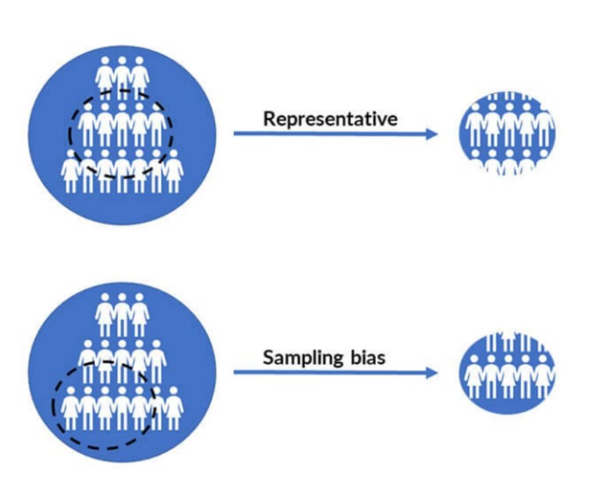
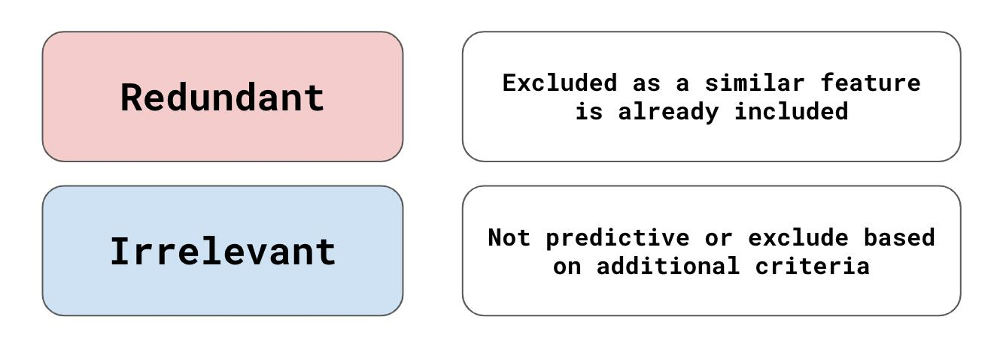
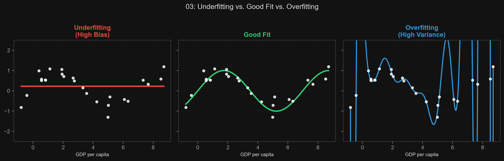

# 🏷️ Module 3: Main Challenges of Machine Learning
> **Ch. 1 — Hands-On ML with Scikit-Learn, Keras & TensorFlow (Aurélien Géron)**

---

## 📌 Table of Contents
1. [Start Here: The Big Picture](#big-picture)
2. [Challenge Category 1: Bad Data](#concept-1)
3. [Challenge Category 2: Bad Algorithms — Overfitting](#concept-2)
4. [Challenge Category 3: Bad Algorithms — Underfitting](#concept-3)
5. [Common Beginner Mistakes](#mistakes)
6. [Interview Q&A](#interview)
7. [⚡ One-Page Flash Card](#revision)

---

## 🌍 Start Here: The Big Picture {#big-picture}

> **TL;DR:** Virtually every ML failure traces back to one of two root causes: **Bad Data** or **Bad Algorithms**. Bad data means not enough, non-representative, noisy, or feature-starved data. Bad algorithms means the model is either too complex (overfits) or too simple (underfits). Correctly diagnosing which of these is at play is the core skill of an ML engineer.

**The Real-World Analogy 🍕:**
Imagine training an apprentice chef:
*   **Bad Data:** You only show them burnt pizzas (biased), or too few examples (insufficient), or the pizza was photographed blurry (poor quality).
*   **Overfitting:** The apprentice memorizes the exact burnt pizza you showed them and can't make any other. They learned the training data, not the cooking principles.
*   **Underfitting:** The apprentice decides "cooking is just heating bread" and refuses to learn anything more detailed.

---

## 🔍 1. Challenge Category 1: Bad Data {#concept-1}

### 1A. Insufficient Quantity of Training Data
*   A toddler learns to recognize an apple from a handful of examples. ML algorithms need **thousands of examples** for simple problems and **millions** for complex problems like image or speech recognition.
*   **The Unreasonable Effectiveness of Data (Banko & Brill, 2001):** Different ML algorithms — including simple ones — performed almost identically on NLP tasks when given enough data. This suggests investing in data quality and quantity may matter more than algorithm choice for complex problems.

> [!IMPORTANT]
> "These results suggest that we may want to reconsider the trade-off between spending time and money on algorithm development versus spending it on corpus development." — Banko & Brill, 2001

---

### 1B. Nonrepresentative Training Data
For a model to generalize well, the training set must be **representative** of the cases you want to generalize to.

**The Life Satisfaction Example (Sampling Bias):**
*   Original linear model trained on a subset of countries produced a nice upward line.
*   When missing countries (very rich with lower happiness, very poor with higher happiness) were added, the relationship was clearly non-linear.
*   The original model was **biased** because the training set was nonrepresentative.

**Two Types of Non-representativeness:**
*   **Sampling Noise:** If the sample is too small, unrepresentative data appears by pure chance.
*   **Sampling Bias:** Even large samples can be nonrepresentative if the sampling **method** is flawed.



> [!WARNING]
> **Famous Sampling Bias Example — 1936 US Election:** The Literary Digest polled 2.4 million people (from telephone directories, magazines, clubs). They predicted Landon wins. Roosevelt won with 62%. The flaw: wealthier people (who tend Republican) were overrepresented in phone directories and club lists. Non-response bias also occurred — only 25% answered.

---

### 1C. Poor-Quality Data
If training data is full of **errors, outliers, and noise**, the algorithm cannot detect the true underlying patterns.

**What to do:**
*   **Outliers:** Discard them or fix the errors manually.
*   **Missing features:** Choose one of:
    1. Ignore the attribute entirely.
    2. Ignore instances with missing values.
    3. Fill in the missing values (e.g., with the median age) — called **imputation**.
    4. Train two models: one with the feature and one without.

---

### 1D. Irrelevant Features
**"Garbage in, garbage out."** The ML system can only learn useful things if the training data contains enough relevant features and not too many irrelevant ones.

**Feature Engineering involves:**
*   **Feature selection:** Selecting the most useful features from the existing set.
*   **Feature extraction:** Combining existing features to produce a more useful one (dimensionality reduction can help).
*   **Creating new features:** Gathering new data from external sources.



---

## 🔍 2. Challenge Category 2: Bad Algorithms — Overfitting {#concept-2}

Overfitting means the model performs very well on training data but **does not generalize** to new instances. It has memorized the specific noise and patterns in the training set.

> **Analogy from the book:** You visit a foreign country and get ripped off by a taxi driver. You overgeneralize: "All taxi drivers here are thieves." This is the human equivalent of overfitting — fitting a complex conclusion to a small, unrepresentative sample.

**Mechanism:**
*   A high-degree polynomial life satisfaction model can fit every training data point perfectly.
*   It might even find a spurious pattern: "all countries with a 'w' in their name have life satisfaction > 7" (New Zealand 7.3, Norway 7.4, Sweden 7.2, Switzerland 7.5). This is noise, not signal.


> 📊 **Graph 03:** Overfitting vs. Good Fit vs. Underfitting. The polynomial curve (blue, overfitting) perfectly memorizes all training points but will generalize poorly. The simple line (red, underfitting) misses the structure. The smooth curve (green) generalizes well.

**Overfitting happens when model is too complex relative to:** 
*   The amount of training data.
*   The noisiness of the training data.

**Three Solutions to Overfitting:**
1. **Simplify the model** — select fewer parameters, reduce attributes, or constrain the model.
2. **Gather more training data.**
3. **Reduce the noise** — fix errors, remove outliers.

### Regularization: Constraining the Model
Constraining a model to reduce its risk of overfitting is called **regularization**.

**Example:** In `life_satisfaction = θ₀ + θ₁ × GDP`:
*   If we force `θ₁ = 0`, the algorithm has 1 degree of freedom (only `θ₀`).
*   If we allow `θ₁` but constrain it to be small (e.g., penalize large values), the model is simpler than 2 full degrees of freedom but more flexible than 1.
*   **Regularization finds the balance:** Fits training data well enough, but generalizes.

**Hyperparameter:** A parameter of the **learning algorithm** (not the model itself). It's set before training and is NOT learned from data.
*   Example: The regularization strength hyperparameter `α` controls how much to penalize large `θ` values.
*   A very high `α` → nearly flat model → likely to underfit.
*   A very low `α` → barely constrained → likely to overfit.

---

## 🔍 3. Challenge Category 3: Bad Algorithms — Underfitting {#concept-3}

Underfitting is the opposite of overfitting. The model is too simple to learn the underlying structure of the data. It performs poorly on **both training data and new instances**.

**Example:** A linear model of life satisfaction will underfit because reality is more complex than a straight line.

**Three Solutions to Underfitting:**
1. **Select a more powerful model** with more parameters (e.g., go from Linear to Polynomial Regression).
2. **Feed better features** to the algorithm (better feature engineering).
3. **Reduce constraints** on the model (e.g., lower the regularization hyperparameter).

---

## ❌ Common Beginner Mistakes {#mistakes}

**1. "Tuning the regularization hyperparameter by running on the Test Set"** ❌
> If you tune the regularization strength to minimize Test Set error, you're adapting the model to that specific Test Set. When deployed in production, it will perform much worse. The Test Set must never be touched during tuning.

**2. "Assuming a complex model with 95% training accuracy is good"** ❌
> High training accuracy with low validation accuracy is the textbook definition of overfitting. The gap between training error and generalization error is the key diagnostic metric.

---

## 🎤 Interview Q&A {#interview}

**Q1: What is sampling bias? Describe a famous historical example.**
> **A:**
> Sampling bias occurs when the sampling method is flawed and produces a nonrepresentative sample, even if the sample is very large. The canonical example is the 1936 US presidential election: The Literary Digest polled 2.4 million people (from telephone directories and club lists, skewing toward wealthier, more Republican voters) and predicted Landon would win. Roosevelt won with 62% of the vote. The flaw wasn't sample size — it was the methodology of selecting *who* to poll.

**Q2: What is regularization? How does it relate to the bias-variance tradeoff?**
> **A:**
> Regularization is the process of constraining a model to reduce its complexity and its risk of overfitting. It typically adds a penalty term to the cost function for large parameter values.
> *   **High regularization → High Bias:** The model is overly constrained (too simple), likely to underfit.
> *   **Low regularization → High Variance:** The model is unconstrained, likely to overfit (memorize noise).
> The regularization hyperparameter is tuned to find the **sweet spot** — the model complex enough to capture true patterns but simple enough not to model the noise.

**Q3: What is a hyperparameter? How is it different from a model parameter?**
> **A:**
> *   **Model Parameter (e.g., θ₀, θ₁):** Learned FROM the training data by the algorithm. Determined internally during training.
> *   **Hyperparameter (e.g., regularization strength, learning rate, K in KNN):** Set BY THE ENGINEER before training. NOT learned from the data itself. It controls how the learning algorithm operates.

---

## ⚡ One-Page Flash Card {#revision}

```
╔══════════════════════════════════════════════════════════════════╗
║         MODULE 3 FLASH CARD — Main Challenges of ML             ║
╠══════════════════════════════════════════════════════════════════╣
║  BAD DATA TYPES:                                                 ║
║  1. Insufficient quantity (need thousands–millions of examples). ║
║  2. Nonrepresentative (sampling bias, sampling noise).           ║
║  3. Poor quality (noise, errors, outliers).                      ║
║  4. Irrelevant features (GIGO → use Feature Engineering).        ║
║                                                                  ║
║  BAD ALGORITHMS:                                                 ║
║  - Overfitting: Too complex for the data. Model memorizes noise. ║
║    Solutions: Simplify model, more data, clean data.             ║
║    Key tool: REGULARIZATION (constrain model params).            ║
║  - Underfitting: Too simple. Fails to capture true patterns.     ║
║    Solutions: More powerful model, better features, less reg.    ║
║                                                                  ║
║  HYPERPARAMETER vs MODEL PARAMETER:                              ║
║  - Model param (θ): Learned from data during training.           ║
║  - Hyperparameter (α, K, etc): Set BY ENGINEER before training.  ║
╚══════════════════════════════════════════════════════════════════╝
```

---

**🔗 Previous Module →** [02_Types_of_ML_Systems.md](02_Types_of_ML_Systems.md)  
**🔗 Next Module →** [04_Testing_and_Validating.md](04_Testing_and_Validating.md)
