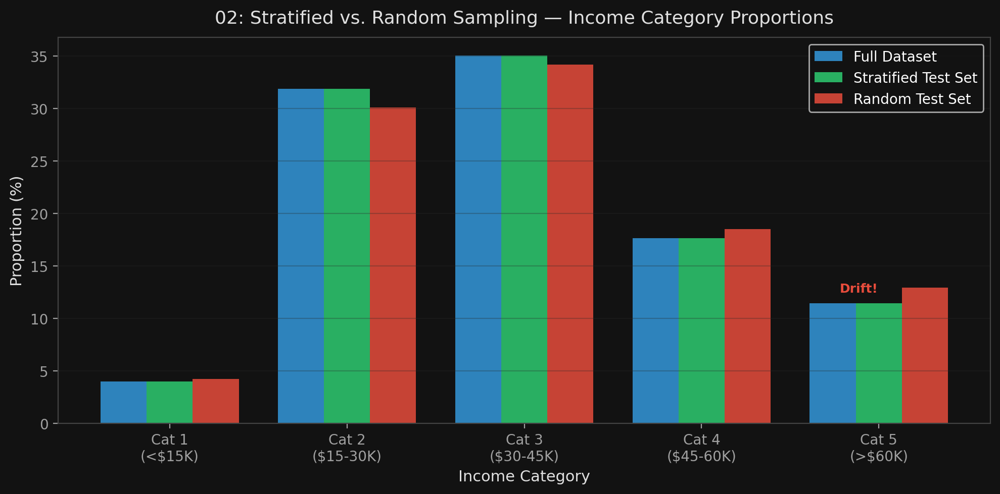

# 🏷️ Module 2: Get the Data
> **Ch. 2 — Hands-On ML with Scikit-Learn, Keras & TensorFlow (Aurélien Géron)**

---

## 📌 Table of Contents
1. [Start Here: The Big Picture](#big-picture)
2. [Automating Data Fetching](#concept-1)
3. [Quick Look at the Data Structure](#concept-2)
4. [Create a Test Set — The Right Way](#concept-3)
5. [Stratified Sampling](#concept-4)
6. [Common Beginner Mistakes](#mistakes)
7. [Interview Q&A](#interview)
8. [⚡ One-Page Flash Card](#revision)

---

## 🌍 Start Here: The Big Picture {#big-picture}

> **TL;DR:** The first critical act before any analysis is to **set aside a test set and lock it away**. Your brain is a pattern-recognition machine — if you look at the test data even once, you will unknowingly bias your design decisions toward it (data snooping bias). Equally important: a random split may not produce a representative test set. Use **Stratified Sampling** based on the most important feature to guarantee the test set mirrors the overall population.

**The Real-World Analogy 🗂️:**
Imagine writing a textbook exam. Once you see the questions, you will subconsciously over-index studying those exact topics. A fair evaluation requires you never see the exam before the test day. The same discipline applies to the Test Set in ML.

---

## 🔍 1. Automating Data Fetching {#concept-1}

Instead of manually downloading data, write a function. Benefits:
*   Reproducibility — anyone can re-run the pipeline.
*   Automation — schedule cron jobs to always fetch the latest data.
*   Portability — install the dataset on multiple machines with a single function call.

```python
import os
import tarfile
import urllib

DOWNLOAD_ROOT = "https://raw.githubusercontent.com/ageron/handson-ml2/master/"
HOUSING_PATH = os.path.join("datasets", "housing")
HOUSING_URL = DOWNLOAD_ROOT + "datasets/housing/housing.tgz"

def fetch_housing_data(housing_url=HOUSING_URL, housing_path=HOUSING_PATH):
    os.makedirs(housing_path, exist_ok=True)
    tgz_path = os.path.join(housing_path, "housing.tgz")
    urllib.request.urlretrieve(housing_url, tgz_path)
    housing_tgz = tarfile.open(tgz_path)
    housing_tgz.extractall(path=housing_path)
    housing_tgz.close()

import pandas as pd
def load_housing_data(housing_path=HOUSING_PATH):
    csv_path = os.path.join(housing_path, "housing.csv")
    return pd.read_csv(csv_path)
```

---

## 🔍 2. Quick Look at the Data Structure {#concept-2}

**Key Pandas Methods for Initial EDA:**

| Method | What It Shows |
|---|---|
| `housing.head()` | First 5 rows — quick structure check |
| `housing.info()` | Row count, column types, non-null value count |
| `housing.describe()` | count, mean, std, min, 25th/50th/75th percentile, max |
| `housing.hist(bins=50, figsize=(20,15))` | Distribution of every numerical attribute |

**Critical Findings from `.info()` on the California Dataset:**
*   20,640 total instances.
*   `total_bedrooms` has only **20,433 non-null** values → **207 missing values** to handle.
*   All attributes numerical except `ocean_proximity` (categorical text).

**5 Categories of `ocean_proximity`:**
```
<1H OCEAN     9136
INLAND        6551
NEAR OCEAN    2658
NEAR BAY      2290
ISLAND           5
```

**4 Things to Note from the Histograms (Figure 2-8):**
1. `median_income` is scaled/capped (0.5–15, representing ~$5K–$150K). Not raw USD.
2. `housing_median_age` and `median_house_value` are **capped** at 50 and $500,000 respectively. This is a **serious problem for the target variable** — the model may learn prices never exceed $500K.
3. Attributes have **very different scales** → feature scaling will be required.
4. Many histograms are **tail-heavy** → may benefit from log transformation for some algorithms.

---

## 🔍 3. Create a Test Set — The Right Way {#concept-3}

### Why Not Just Use `random_state=42` Forever?
If the dataset updates and you re-run the split, `np.random.permutation` produces different results. Instances that were previously in the Test Set may move to the Training Set → **data leakage**.

### The Stable Hash-Based Split
Use a **cryptographic hash of the instance's identifier** to deterministically assign each instance:

```python
from zlib import crc32
import numpy as np

def test_set_check(identifier, test_ratio):
    return crc32(np.int64(identifier)) & 0xffffffff < test_ratio * 2**32

def split_train_test_by_id(data, test_ratio, id_column):
    ids = data[id_column]
    in_test_set = ids.apply(lambda id_: test_set_check(id_, test_ratio))
    return data.loc[~in_test_set], data.loc[in_test_set]

# Using row index as ID
housing_with_id = housing.reset_index()
train_set, test_set = split_train_test_by_id(housing_with_id, 0.2, "index")

# Or use stable geographical coordinates as ID
housing_with_id["id"] = housing["longitude"] * 1000 + housing["latitude"]
train_set, test_set = split_train_test_by_id(housing_with_id, 0.2, "id")
```

### Scikit-Learn's Simple Version (for stable datasets)
```python
from sklearn.model_selection import train_test_split
train_set, test_set = train_test_split(housing, test_size=0.2, random_state=42)
```

---

## 🔍 4. Stratified Sampling {#concept-4}

**The Problem with Pure Random Sampling:**
If the dataset is small or a key feature is heavily skewed, random sampling will produce a biased Test Set.

*   Survey analogy from the book: US population is 51.3% female / 48.7% male. A random sample of 1,000 people has a ~12% chance of being skewed enough to bias the survey.

**The Solution:**
Divide the population into **strata** based on the most predictive feature, then sample proportionally from each stratum.

**Implementation for the Housing Project:**
```python
# Step 1: Create income categories from the continuous median_income
housing["income_cat"] = pd.cut(housing["median_income"],
                               bins=[0., 1.5, 3.0, 4.5, 6., np.inf],
                               labels=[1, 2, 3, 4, 5])

# Step 2: Stratified split on income_cat
from sklearn.model_selection import StratifiedShuffleSplit

split = StratifiedShuffleSplit(n_splits=1, test_size=0.2, random_state=42)
for train_index, test_index in split.split(housing, housing["income_cat"]):
    strat_train_set = housing.loc[train_index]
    strat_test_set = housing.loc[test_index]

# Step 3: Verify proportions match
strat_test_set["income_cat"].value_counts() / len(strat_test_set)
# 3: 0.3505, 2: 0.3188, 4: 0.1764, 5: 0.1146, 1: 0.0397

# Step 4: Remove the income_cat column (it was only for stratification)
for set_ in (strat_train_set, strat_test_set):
    set_.drop("income_cat", axis=1, inplace=True)
```


> 📊 **Graph 02:** Random vs. Stratified Sampling. The stratified test set has income category proportions nearly identical to the full dataset; the random test set drifts significantly.

---

## ❌ Common Beginner Mistakes {#mistakes}

**1. "Running EDA before locking away the Test Set"** ❌
> **Data Snooping Bias.** The book explicitly warns: "Wait! Before you look at the data any further, you need to create a test set, put it aside, and never look at it." If you explore the full dataset first, your brain picks up patterns from the Test Set, and all subsequent design decisions become biased toward it.

**2. "Using the same split code on a periodically updated dataset"** ❌
> `random_state=42` only works if the dataset never changes. For growing datasets, use a hash of stable IDs (e.g., longitude × 1000 + latitude for geographic data) so each instance's train/test assignment is deterministic and stable across data refreshes.

---

## 🎤 Interview Q&A {#interview}

**Q1: What is data snooping bias and how does stratified sampling relate to it?**
> **A:**
> Data snooping bias occurs when the engineer looks at the test set before training. The brain subconsciously picks up on patterns, leading to model/feature choices that are unknowingly optimized for the test set. This makes the test set's error estimate overly optimistic — the model will underperform in production.
>
> Stratified sampling is the technique to ensure that the test set is *representative*, not biased. It doesn't prevent data snooping bias directly, but it ensures the test set accurately reflects the production population by sampling proportionally from each stratum (e.g., income category), preventing *sampling bias* (a different problem from snooping bias).

**Q2: Why use a hash of the instance ID rather than `random_state=42` for a production train/test split?**
> **A:**
> `random_state=42` provides the same shuffle *if the dataset doesn't change*. But in production, datasets are regularly updated with new data. When you re-run the split on the updated dataset, `np.random.permutation` will reassign instances differently — data previously in the Test Set may appear in Training, leaking information. A cryptographic hash (e.g., `crc32`) of a stable unique identifier (like a customer ID or geographic coordinate) deterministically assigns each instance to train or test forever, regardless of how much new data is added.

---

## ⚡ One-Page Flash Card {#revision}

```
╔══════════════════════════════════════════════════════════════════╗
║           MODULE 2 FLASH CARD — Get the Data                    ║
╠══════════════════════════════════════════════════════════════════╣
║  CRITICAL RULE:                                                  ║
║  → Create and lock away the Test Set FIRST.                      ║
║  → Never look at it until final evaluation.                      ║
║                                                                  ║
║  DATA SNOOPING BIAS:                                             ║
║  → Brain sees test data → biases all design decisions            ║
║  → Test error estimate becomes optimistic → fails in prod.       ║
║                                                                  ║
║  STABLE SPLIT (evolving datasets):                               ║
║  → Hash(instance_id) < 20% threshold → Test Set                 ║
║  → Guarantees same assignment across dataset refreshes.          ║
║                                                                  ║
║  STRATIFIED SAMPLING:                                            ║
║  → Divide population into strata (e.g., 5 income bins).         ║
║  → Sample proportionally from each stratum.                      ║
║  → Use: StratifiedShuffleSplit from sklearn.model_selection      ║
╚══════════════════════════════════════════════════════════════════╝
```

---

**🔗 Previous Module →** [01_Look_at_the_Big_Picture.md](01_Look_at_the_Big_Picture.md)  
**🔗 Next Module →** [03_Discover_and_Visualize.md](03_Discover_and_Visualize.md)
