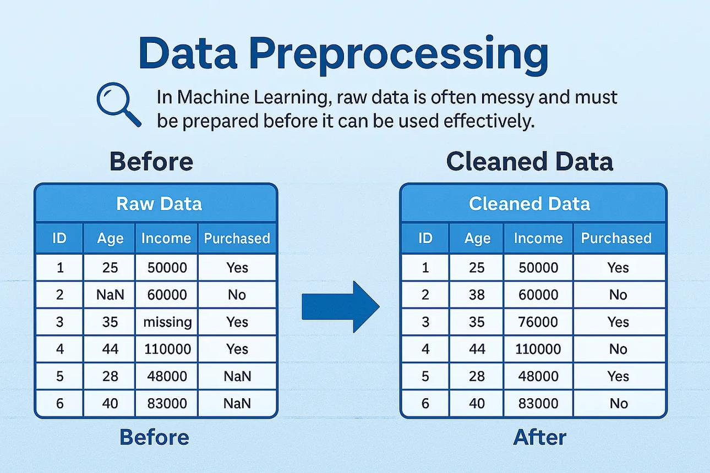
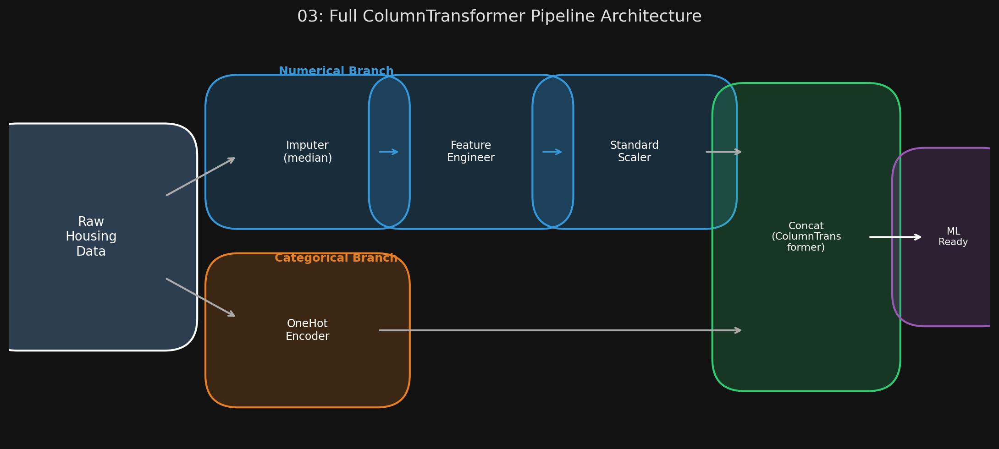

# 🏷️ Module 4: Prepare the Data for ML Algorithms
> **Ch. 2 — Hands-On ML with Scikit-Learn, Keras & TensorFlow (Aurélien Géron)**

---

## 📌 Table of Contents
1. [Start Here: The Big Picture](#big-picture)
2. [Data Cleaning — Handling Missing Values](#concept-1)
3. [Scikit-Learn's Design Philosophy](#concept-2)
4. [Handling Categorical Attributes](#concept-3)
5. [Custom Transformers](#concept-4)
6. [Feature Scaling](#concept-5)
7. [Transformation Pipelines & ColumnTransformer](#concept-6)
8. [Common Beginner Mistakes](#mistakes)
9. [Interview Q&A](#interview)
10. [⚡ One-Page Flash Card](#revision)

---

## 🌍 Start Here: The Big Picture {#big-picture}

> **TL;DR:** ML algorithms are mathematical equations — they cannot ingest missing values, text strings, or wildly different numerical scales. This module transforms raw, messy data into a clean, standardized, purely numerical matrix. The entire transformation process is wrapped in a Scikit-Learn `Pipeline` + `ColumnTransformer` so it can be reproduced exactly on any future data, with zero manual intervention.

**Why write functions, not manual Pandas code?**
1. Reproducibility — re-run on fresh data anytime.
2. Build a reusable library of transformers.
3. Use the same pipeline in production to transform live data.
4. Enables hyperparameter search over transformation steps (e.g., "should I add bedrooms_per_room or not?").

---

## 🔍 1. Data Cleaning — Handling Missing Values {#concept-1}

`total_bedrooms` has 207 missing values. Three options:
1. `housing.dropna(subset=["total_bedrooms"])` — drop the 207 rows.
2. `housing.drop("total_bedrooms", axis=1)` — drop the entire column.
3. `housing["total_bedrooms"].fillna(median, inplace=True)` — fill with a computed value.



**Best Practice — `SimpleImputer`:**

```python
from sklearn.impute import SimpleImputer

imputer = SimpleImputer(strategy="median")

# Work with numerical attributes only (imputer can't handle text)
housing_num = housing.drop("ocean_proximity", axis=1)

# FIT on training data ONLY → computes median for each attribute
imputer.fit(housing_num)

# Inspect what was learned
print(imputer.statistics_)
# [-118.51, 34.26, 29.0, 2119.5, 433.0, 1164.0, 408.0, 3.5409]

# TRANSFORM training data (fills missing with learned medians)
X = imputer.transform(housing_num)

# Convert back to DataFrame
housing_tr = pd.DataFrame(X, columns=housing_num.columns, index=housing_num.index)
```

> [!CAUTION]
> **NEVER call `imputer.fit()` on the Test Set.** The Test Set median might differ from the Training Set median. Calling `.fit_transform()` on the Test Set would compute test medians and use them — a form of data leakage. Always call only `.transform()` on validation and test data.

---

## 🔍 2. Scikit-Learn's Design Philosophy {#concept-2}

The book dedicates a section to Scikit-Learn's elegant API design — worth memorizing for interviews:

| Role | Description | Key Method |
|---|---|---|
| **Estimators** | Any object that can estimate parameters from data (e.g., `SimpleImputer`, `LinearRegression`) | `.fit(X, y)` |
| **Transformers** | Estimators that can also transform data (e.g., `SimpleImputer`, `StandardScaler`) | `.transform(X)` and `.fit_transform(X)` |
| **Predictors** | Estimators that can make predictions (e.g., `LinearRegression`, `RandomForestRegressor`) | `.predict(X)` and `.score(X, y)` |

**Additional Design Principles:**
*   **Inspection:** Hyperparameters accessible via public attributes (e.g., `imputer.strategy`). Learned parameters accessible with underscore suffix (e.g., `imputer.statistics_`).
*   **Non-proliferation of classes:** Datasets use NumPy arrays or SciPy sparse matrices — not custom objects.
*   **Sensible defaults:** Every class has reasonable defaults for rapid prototyping.

---

## 🔍 3. Handling Categorical Attributes {#concept-3}

**`ocean_proximity`** has 5 categories: `<1H OCEAN`, `INLAND`, `ISLAND`, `NEAR BAY`, `NEAR OCEAN`.

### Option 1: Ordinal Encoding
```python
from sklearn.preprocessing import OrdinalEncoder

ordinal_encoder = OrdinalEncoder()
housing_cat_encoded = ordinal_encoder.fit_transform(housing[["ocean_proximity"]])
# Categories: [['<1H OCEAN', 'INLAND', 'ISLAND', 'NEAR BAY', 'NEAR OCEAN']]
# Encoded: 0, 1, 2, 3, 4
```

**Problem:** ML algorithms assume numerical proximity = categorical similarity. Category 0 (`<1H OCEAN`) and category 4 (`NEAR OCEAN`) should be more similar than 0 and 1 (`INLAND`), but the numbers imply the opposite.

### Option 2: One-Hot Encoding (Preferred for Nominal Categories)
```python
from sklearn.preprocessing import OneHotEncoder

cat_encoder = OneHotEncoder()
housing_cat_1hot = cat_encoder.fit_transform(housing[["ocean_proximity"]])
# Returns a SciPy SPARSE matrix (16512 × 5)
# Convert to dense:
housing_cat_1hot.toarray()
# [[1., 0., 0., 0., 0.],  # <1H OCEAN
#  [0., 0., 0., 0., 1.],  # NEAR OCEAN
#  ...]
```

**Why a sparse matrix?** If there are thousands of categories, one-hot encoding produces a huge matrix of mostly 0s. Sparse format only stores the location of non-zero elements — massive memory savings.

> [!TIP]
> If a categorical attribute has **many** categories (e.g., country codes, zip codes), one-hot encoding creates too many features and slows training. Alternatives: replace with useful numerical features (e.g., country's GDP) or use learnable **embeddings** (covered in Ch. 13 & 17).

---

## 🔍 4. Custom Transformers {#concept-4}

Scikit-Learn allows you to build custom transformers that work seamlessly with pipelines. You need three methods: `fit()`, `transform()`, and `fit_transform()`.

```python
from sklearn.base import BaseEstimator, TransformerMixin

rooms_ix, bedrooms_ix, population_ix, households_ix = 3, 4, 5, 6

class CombinedAttributesAdder(BaseEstimator, TransformerMixin):
    def __init__(self, add_bedrooms_per_room=True):  # no *args or **kwargs!
        self.add_bedrooms_per_room = add_bedrooms_per_room

    def fit(self, X, y=None):
        return self  # Nothing to fit

    def transform(self, X):
        rooms_per_household = X[:, rooms_ix] / X[:, households_ix]
        population_per_household = X[:, population_ix] / X[:, households_ix]
        if self.add_bedrooms_per_room:
            bedrooms_per_room = X[:, bedrooms_ix] / X[:, rooms_ix]
            return np.c_[X, rooms_per_household, population_per_household, bedrooms_per_room]
        else:
            return np.c_[X, rooms_per_household, population_per_household]

attr_adder = CombinedAttributesAdder(add_bedrooms_per_room=False)
housing_extra_attribs = attr_adder.transform(housing.values)
```

**`add_bedrooms_per_room` is a hyperparameter!** GridSearchCV can automatically discover whether including this feature improves performance.

---

## 🔍 5. Feature Scaling {#concept-5}

Most ML algorithms (especially those using gradient descent or distance metrics) perform poorly when features have vastly different scales. In the housing data:
*   `total_rooms`: 6 to 39,320.
*   `median_income`: 0 to 15.

| Method | Formula | Range | Outlier Sensitivity |
|---|---|---|---|
| **Min-Max Scaling** (Normalization) | $X_{norm} = \frac{X - X_{min}}{X_{max} - X_{min}}$ | 0 to 1 | **HIGH** — one outlier crushes all other values |
| **Standardization** (Z-score) | $X_{std} = \frac{X - \mu}{\sigma}$ | Unbounded (zero mean, unit variance) | **LOW** — outliers have limited effect |

**Scikit-Learn classes:**
*   `MinMaxScaler(feature_range=(0,1))` — for normalization. Use `feature_range` if algorithm needs 0–1 exactly (e.g., some neural networks).
*   `StandardScaler()` — for standardization. Preferred for most cases.

> [!IMPORTANT]
> **Fit scalers on training data ONLY.** Using the same scaler fitted on training data to transform the test set ensures that the test set is transformed using the training statistics (mean, std, min, max) — not its own. This is the exact same rule as for imputers.

---

## 🔍 6. Transformation Pipelines & ColumnTransformer {#concept-6}

Instead of running all transformations manually in sequence, Scikit-Learn's `Pipeline` chains them:

```python
from sklearn.pipeline import Pipeline
from sklearn.preprocessing import StandardScaler
from sklearn.impute import SimpleImputer

# Numerical pipeline
num_pipeline = Pipeline([
    ('imputer', SimpleImputer(strategy="median")),
    ('attribs_adder', CombinedAttributesAdder()),
    ('std_scaler', StandardScaler()),
])
housing_num_tr = num_pipeline.fit_transform(housing_num)
```

**How Pipeline works:** `fit()` calls `fit_transform()` on all transformers sequentially, passing output of each as input to the next. `predict()` / `transform()` just run `transform()` on each step in order.

**Full Pipeline with ColumnTransformer (handles numerical + categorical together):**
```python
from sklearn.compose import ColumnTransformer
from sklearn.preprocessing import OneHotEncoder

num_attribs = list(housing_num)
cat_attribs = ["ocean_proximity"]

full_pipeline = ColumnTransformer([
    ("num", num_pipeline, num_attribs),
    ("cat", OneHotEncoder(), cat_attribs),
])

housing_prepared = full_pipeline.fit_transform(housing)
# Output: Dense NumPy array ready for ML training
# (ColumnTransformer auto-converts sparse+dense mix if density > 0.3)
```


> 📊 **Graph 03:** Full ColumnTransformer Pipeline architecture — numerical (imputation → feature engineering → scaling) and categorical (one-hot encoding) branches run in parallel and concatenate.

---

## ❌ Common Beginner Mistakes {#mistakes}

**1. "Calling `.fit_transform()` on the test set with the scaler/imputer"** ❌
> This leaks future information (the test set's own statistics) into the model. The scaler must only `.transform()` the test set using the means/medians computed from the training set.

**2. "Using OrdinalEncoder for nominal categories"** ❌
> Ordinal encoding is appropriate for ordered categories ("bad" < "average" < "good"). For unordered categories like ocean proximity, it artificially implies a numerical order. Use OneHotEncoder.

---

## 🎤 Interview Q&A {#interview}

**Q1: When would you use `MinMaxScaler` vs `StandardScaler`?**
> **A:**
> *   **`MinMaxScaler`:** When the algorithm requires inputs in a specific range (e.g., neural networks expecting 0–1 input, image pixel normalization). Very sensitive to outliers — a single erroneous extreme value (e.g., income = 100 instead of 10) compresses all normal values into a tiny near-0 range.
> *   **`StandardScaler`:** The safer general-purpose choice. Doesn't bound values to a range (which is fine for most algorithms) and is much more robust to outliers — a median income outlier of 100 vs. normal range of 0–15 barely affects the mean or std meaningfully.

**Q2: What is the Scikit-Learn design principle called "Nonproliferation of classes" and why does it matter?**
> **A:**
> Nonproliferation of classes means Scikit-Learn represents datasets as standard NumPy arrays or SciPy sparse matrices (not custom Scikit-Learn data objects), and hyperparameters as regular Python strings or numbers. This matters because any tool that can generate or consume NumPy arrays integrates seamlessly with Scikit-Learn. You can use Pandas for data loading, NumPy for manipulation, and pass the result directly into any Scikit-Learn transformer — no conversion or adapter code required.

---

## ⚡ One-Page Flash Card {#revision}

```
╔══════════════════════════════════════════════════════════════════╗
║         MODULE 4 FLASH CARD — Prepare the Data                  ║
╠══════════════════════════════════════════════════════════════════╣
║  MISSING VALUES → SimpleImputer(strategy="median")               ║
║  CRITICAL: fit() on TRAIN only. transform() on TEST.             ║
║                                                                  ║
║  CATEGORICAL:                                                    ║
║  - OrdinalEncoder: ordered categories only.                      ║
║  - OneHotEncoder: nominal categories (default choice).           ║
║                                                                  ║
║  SKLEARN API ROLES:                                              ║
║  - Estimator: .fit()                                             ║
║  - Transformer: .transform() / .fit_transform()                  ║
║  - Predictor: .predict() / .score()                              ║
║                                                                  ║
║  FEATURE SCALING:                                                ║
║  - MinMaxScaler: 0-1 range. Outlier-sensitive.                   ║
║  - StandardScaler: Zero mean, unit variance. Preferred.          ║
║                                                                  ║
║  PIPELINE + COLUMNTRANSFORMER:                                   ║
║  - Automates the full num + cat transformation in one object.    ║
║  - Enables hyperparameter search over transformation steps.      ║
╚══════════════════════════════════════════════════════════════════╝
```

---

**🔗 Previous Module →** [03_Discover_and_Visualize.md](03_Discover_and_Visualize.md)  
**🔗 Next Module →** [05_Select_Train_FineTune.md](05_Select_Train_FineTune.md)
