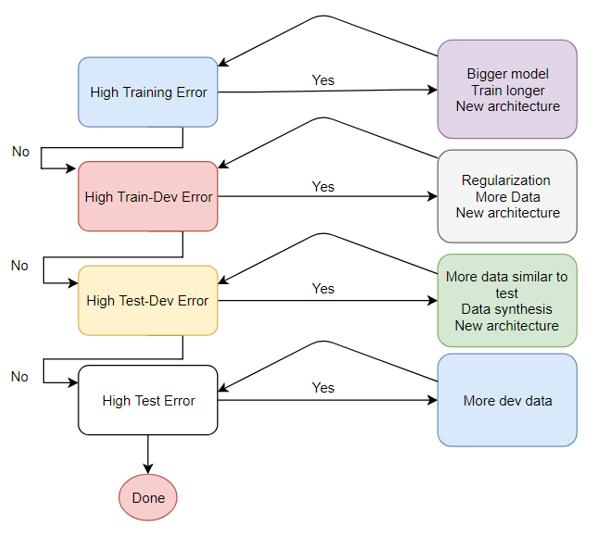
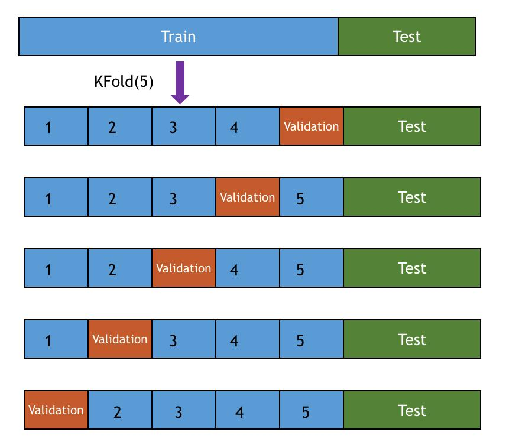
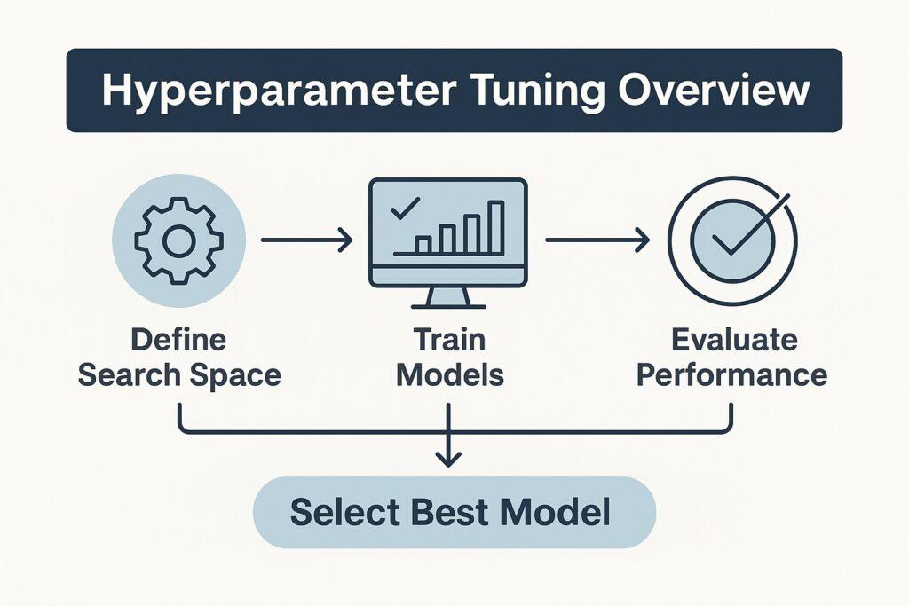
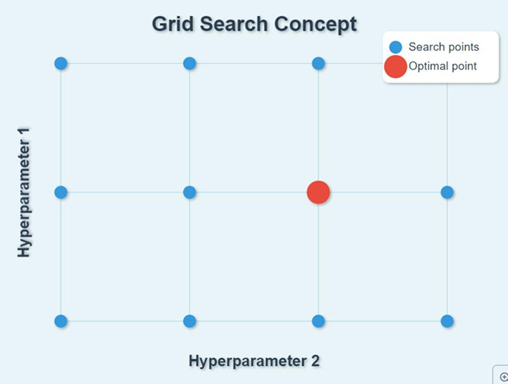

# 🏷️ Module 5: Select, Train & Fine-Tune a Model
> **Ch. 2 — Hands-On ML with Scikit-Learn, Keras & TensorFlow (Aurélien Géron)**

---

## 📌 Table of Contents
1. [Start Here: The Big Picture](#big-picture)
2. [Shortlisting Models — Train and Evaluate](#concept-1)
3. [K-Fold Cross-Validation for Robust Evaluation](#concept-2)
4. [Fine-Tuning with GridSearchCV](#concept-3)
5. [Fine-Tuning with RandomizedSearchCV](#concept-4)
6. [Ensemble Methods](#concept-5)
7. [Analyze Feature Importances](#concept-6)
8. [Evaluate on the Test Set](#concept-7)
9. [Launch, Monitor, and Maintain](#concept-8)
10. [Chapter 2 Exercises](#exercises)
11. [Common Beginner Mistakes](#mistakes)
12. [Interview Q&A](#interview)
13. [⚡ One-Page Flash Card](#revision)

---

## 🌍 Start Here: The Big Picture {#big-picture}

> **TL;DR:** With perfectly prepared data, the modeling phase is surprisingly straightforward. You shortlist 2–5 algorithms by training them quickly with default settings and using K-Fold Cross-Validation for a reliable performance estimate. Then you violently search through thousands of hyperparameter combinations using GridSearchCV or RandomizedSearchCV to extract peak performance. You evaluate on the Test Set exactly once. Finally, you deploy with a monitoring system and automate retraining.

---

## 🔍 1. Shortlisting Models — Train and Evaluate {#concept-1}

**Step 1 — Prepare: separate predictors from labels:**
```python
housing = strat_train_set.drop("median_house_value", axis=1)
housing_labels = strat_train_set["median_house_value"].copy()
```

### Model 1: Linear Regression (Baseline)
```python
from sklearn.linear_model import LinearRegression

lin_reg = LinearRegression()
lin_reg.fit(housing_prepared, housing_labels)

# Test on 5 training instances
some_data_prepared = full_pipeline.transform(some_data)
print("Predictions:", lin_reg.predict(some_data_prepared))
# Predictions: [210644.6045, 317768.8069, 210956.4333, 59218.9888, 189747.5584]
print("Labels:", list(some_labels))
# Labels: [286600.0, 340600.0, 196900.0, 46300.0, 254500.0]
```

**Training Set RMSE:**
```python
from sklearn.metrics import mean_squared_error
lin_rmse = np.sqrt(mean_squared_error(housing_labels, lin_reg.predict(housing_prepared)))
# lin_rmse = 68,628
```

**Diagnosis:** $68,628 error on median house values ranging $120K–$265K → ~30% error rate. **Underfitting** — the model is too simple.

---

### Model 2: Decision Tree Regressor
```python
from sklearn.tree import DecisionTreeRegressor
tree_reg = DecisionTreeRegressor()
tree_reg.fit(housing_prepared, housing_labels)
tree_rmse = np.sqrt(mean_squared_error(housing_labels, tree_reg.predict(housing_prepared)))
# tree_rmse = 0.0
```

**RMSE = 0!** This looks perfect, but it is **massively overfitting**. The Decision Tree memorized the entire training set.



---

## 🔍 2. K-Fold Cross-Validation for Robust Evaluation {#concept-2}

A single train/val split produces a noisy estimate. K-Fold CV splits the training data into K folds, trains K times, and averages the scores for a robust estimate.

```python
from sklearn.model_selection import cross_val_score

# Decision Tree — 10 folds
scores = cross_val_score(tree_reg, housing_prepared, housing_labels,
                         scoring="neg_mean_squared_error", cv=10)
tree_rmse_scores = np.sqrt(-scores)
```

> [!NOTE]
> Scikit-Learn's cross-validation uses a **utility function** (higher = better). Since MSE is a cost function (lower = better), it returns the *negative* MSE. You must negate before taking the square root: `np.sqrt(-scores)`.

**Cross-Validation Results Summary:**



| Model | CV RMSE (Mean) | CV RMSE (Std Dev) | Verdict |
|---|---|---|---|
| Linear Regression | 69,052 | ±2,732 | Underfitting |
| Decision Tree | 71,408 | ±2,439 | Overfitting (worse than LR!) |
| **Random Forest** | **50,182** | **±2,097** | **Best so far** |

```python
# Random Forest
from sklearn.ensemble import RandomForestRegressor
forest_reg = RandomForestRegressor()
forest_reg.fit(housing_prepared, housing_labels)
forest_rmse  # = 18,603 on TRAINING (lower than val → still overfitting)
# CV Mean: 50,182, Std: 2,097
```

**Insight:** Random Forest training RMSE (18,603) << CV RMSE (50,182) → model is still **overfitting**. Options: simplify, regularize, or get more data.

> [!TIP]
> Save every model you experiment with using `joblib`:
> ```python
> import joblib
> joblib.dump(forest_reg, "forest_model.pkl")
> my_model_loaded = joblib.load("forest_model.pkl")
> ```
> Save hyperparameters, CV scores, and error samples for comparison later.

---

## 🔍 3. Fine-Tuning with GridSearchCV {#concept-3}



GridSearchCV exhaustively searches every combination you specify, evaluating each with cross-validation:

```python
from sklearn.model_selection import GridSearchCV

param_grid = [
    {'n_estimators': [3, 10, 30], 'max_features': [2, 4, 6, 8]},
    {'bootstrap': [False], 'n_estimators': [3, 10], 'max_features': [2, 3, 4]},
]

grid_search = GridSearchCV(RandomForestRegressor(), param_grid,
                           cv=5, scoring='neg_mean_squared_error',
                           return_train_score=True)
grid_search.fit(housing_prepared, housing_labels)
```

*   **First dict:** 3 × 4 = 12 combinations.
*   **Second dict:** 2 × 3 = 6 combinations.
*   **Total:** 18 combinations × 5-fold CV = **90 training rounds**.



```python
grid_search.best_params_
# {'max_features': 8, 'n_estimators': 30}

grid_search.best_estimator_
# RandomForestRegressor(max_features=8, n_estimators=30, ...)
```

**Best CV RMSE:** 49,682 (improved from 50,182 with default params).

> [!NOTE]
> Since both optimal values (max_features=8, n_estimators=30) hit the maximum of the search space, you should **continue searching at higher values** — the score may still improve.

> [!TIP]
> You can treat **data preparation steps as hyperparameters**. GridSearchCV can automatically find whether `add_bedrooms_per_room=True` or `False` is better, or the best imputation strategy, or whether to add certain features at all.

**If `GridSearchCV(refit=True)` (the default):** After finding the best params, Scikit-Learn retrains the best model on the **full training set** → usually improves performance.

---

## 🔍 4. Fine-Tuning with RandomizedSearchCV {#concept-4}

When the hyperparameter search space is large or includes continuous variables, RandomizedSearchCV is preferred:

*   Evaluates N random combinations (you control N via `n_iter`).
*   For continuous hyperparameters, selects from a distribution (e.g., `scipy.stats.randint`) → explores far more values than a fixed list.
*   Advantage: Same compute budget → better coverage of large spaces.

```python
from sklearn.model_selection import RandomizedSearchCV
from scipy.stats import randint

param_distribs = {
    'n_estimators': randint(low=1, high=200),
    'max_features': randint(low=1, high=8),
}

rnd_search = RandomizedSearchCV(RandomForestRegressor(), param_distribs,
                                n_iter=10, cv=5,
                                scoring='neg_mean_squared_error',
                                random_state=42)
rnd_search.fit(housing_prepared, housing_labels)
```

---

## 🔍 5. Ensemble Methods {#concept-5}

Combining multiple well-performing models that make **different types of errors** can outperform any individual model.

*   **Random Forest** = Ensemble of Decision Trees. Each tree sees a random subset of features.
*   More details in Chapter 7.

---

## 🔍 6. Analyze Feature Importances {#concept-6}

Random Forest provides `feature_importances_` — the relative contribution of each feature to prediction accuracy:

```python
feature_importances = grid_search.best_estimator_.feature_importances_
attributes = num_attribs + extra_attribs + cat_one_hot_attribs
sorted(zip(feature_importances, attributes), reverse=True)
```

**Top Features by Importance:**

| Rank | Feature | Importance |
|---|---|---|
| 1 | `median_income` | **0.366** |
| 2 | `INLAND` (one-hot) | 0.165 |
| 3 | `pop_per_hhold` | 0.109 |
| 4 | `longitude` | 0.073 |
| 5 | `latitude` | 0.063 |
| 6 | `rooms_per_hhold` | 0.056 |
| 7 | `bedrooms_per_room` | 0.053 |
| ... | ... | ... |
| Last | `ISLAND` | 0.00006 |

**Actionable insight:** Drop low-importance one-hot categories like `NEAR BAY` (0.002) and `ISLAND` (0.00006) to reduce dimensionality. Only `INLAND` is truly informative.

---

## 🔍 7. Evaluate on the Test Set {#concept-7}

```python
final_model = grid_search.best_estimator_

X_test = strat_test_set.drop("median_house_value", axis=1)
y_test = strat_test_set["median_house_value"].copy()

# CRITICAL: use .transform() NOT .fit_transform() on the test set
X_test_prepared = full_pipeline.transform(X_test)

final_predictions = final_model.predict(X_test_prepared)
final_rmse = np.sqrt(mean_squared_error(y_test, final_predictions))
# final_rmse ≈ 47,730
```

**Computing a 95% Confidence Interval for the Final Error:**
```python
from scipy import stats

squared_errors = (final_predictions - y_test) ** 2
np.sqrt(stats.t.interval(0.95, len(squared_errors) - 1,
                          loc=squared_errors.mean(),
                          scale=stats.sem(squared_errors)))
# array([45,685, 49,691])
```

> [!CAUTION]
> If the Test Set performance is disappointing, **do NOT tweak the model to improve the number**. This is overfitting the Test Set. Accept the score and present it honestly.

---

## 🔍 8. Launch, Monitor, and Maintain {#concept-8}

**Deployment Options:**
1.  **Direct deploy:** Save model with `joblib`, load in production, call `.predict()` on each request.
2.  **REST API web service:** Wrap model in a dedicated web service. Main app queries via HTTP. Enables independent scaling, language-agnostic, easy model version upgrades.
3.  **Cloud platforms:** Google Cloud AI Platform — save with joblib, upload to GCS, create model version. Handles load balancing and scaling automatically.

**Monitoring Strategy:**
*   Monitor model performance at regular intervals.
*   **Downstream metrics:** If your recommendation model drives sales, monitor daily sales of recommended products.
*   **Human evaluation pipeline:** Sample uncertain predictions, send to human raters.
*   **Input data monitoring:** Alert if a feature's mean/std drifts beyond training distribution, if new categorical values appear, or if missing feature rate spikes.
*   Keep **backups of every model version** to enable rollback.
*   Keep **backups of every dataset version** to reproduce any past training run.

**Automate the full retraining pipeline:**
1.  Scheduled script fetches fresh labeled data.
2.  Script trains and tunes model automatically.
3.  Script evaluates new model vs. previous model on the updated test set.
4.  If new model's performance is not worse, auto-deploy. Otherwise, alert the engineer.

---

## 🔍 9. Chapter 2 Exercises {#exercises}

| # | Exercise |
|---|---|
| 1 | Try `SVR` (Support Vector Regressor) with various kernels (`linear`, `rbf`) and C/gamma values. |
| 2 | Replace `GridSearchCV` with `RandomizedSearchCV`. |
| 3 | Add a transformer to the pipeline to select only the most important features. |
| 4 | Build a single pipeline combining the full preparation + final prediction. |
| 5 | Use `GridSearchCV` to automatically explore preparation hyperparameters. |

---

## ❌ Common Beginner Mistakes {#mistakes}

**1. "GridSearching on an extremely large space without Randomized Search first"** ❌
> If you search 5 values for 6 hyperparameters, that's 5⁶ = 15,625 combinations × CV folds = potentially months of training. Use RandomizedSearch first to identify the promising subspace, then narrow with GridSearch.

**2. "Calling `.fit_transform()` instead of `.transform()` on the Test Set"** ❌
> This is the most common ML bug in production. The pipeline must be fitted on training data only. Test Set: `.transform()` only — never `.fit_transform()`.

---

## 🎤 Interview Q&A {#interview}

**Q1: Why does the Decision Tree get 0% training RMSE but a worse CV score than Linear Regression?**
> **A:**
> A decision tree with no `max_depth` restriction will partition the training data until every leaf contains a single instance, achieving perfect memorization (0 training error). But it has learned the noise, not the underlying pattern. Cross-validation reveals the true generalization performance — the tree performs worse than Linear Regression because its perfect training fit comes from memorizing noise that doesn't generalize. This is the textbook definition of **overfitting**.

**Q2: Why does Scikit-Learn use `neg_mean_squared_error` as the scoring metric in cross-validation?**
> **A:**
> Scikit-Learn's cross-validation framework follows a convention that **higher scores are better** (it internally maximizes the scoring function). MSE is a cost function where lower is better. To comply with the convention, Scikit-Learn returns the *negative* MSE. You must negate it before taking the square root: `tree_rmse_scores = np.sqrt(-scores)`.

**Q3: You computed a Test Set RMSE of $47,730. A colleague suggests tweaking the hyperparameters one more time to bring it below $45,000. Should you do it?**
> **A:**
> No. If you tweak hyperparameters to improve the Test Set score, you are effectively overfitting the Test Set through manual decisions. The resulting model would be tuned to perform well on that specific 20% held-out sample but would likely perform worse on truly new production data. Accept the score, report it honestly, and launch. If the performance is genuinely unsatisfactory, re-evaluate whether the approach (more features, different algorithm, more data) needs to change — not the hyperparameters chosen to minimize Test Set error.

---

## ⚡ One-Page Flash Card {#revision}

```
╔══════════════════════════════════════════════════════════════════╗
║     MODULE 5 FLASH CARD — Select, Train & Fine-Tune             ║
╠══════════════════════════════════════════════════════════════════╣
║  SHORTLISTING RESULTS:                                           ║
║  - LinReg: CV RMSE=69,052 (underfitting)                        ║
║  - DecTree: CV RMSE=71,408 (overfitting — worse than LinReg!)   ║
║  - RandForest: CV RMSE=50,182 (best)                            ║
║                                                                  ║
║  CROSS-VALIDATION:                                               ║
║  - scoring="neg_mean_squared_error" → negate → sqrt = RMSE      ║
║  - Provides std dev of estimate. Single val split does not.      ║
║                                                                  ║
║  FINE-TUNING:                                                    ║
║  - GridSearchCV: Exhaustive. Best for small search spaces.       ║
║  - RandomizedSearchCV: N random combos. Best for large/cont.    ║
║                                                                  ║
║  TEST SET EVALUATION:                                            ║
║  - full_pipeline.transform() — NEVER fit_transform()!            ║
║  - Final RMSE ≈ 47,730. Accept. Do NOT tweak.                   ║
║                                                                  ║
║  TOP FEATURE IMPORTANCES:                                        ║
║  - median_income (0.366) → INLAND category (0.165) → lat/lon    ║
╚══════════════════════════════════════════════════════════════════╝
```

---

**🔗 Previous Module →** [04_Prepare_the_Data.md](04_Prepare_the_Data.md)
