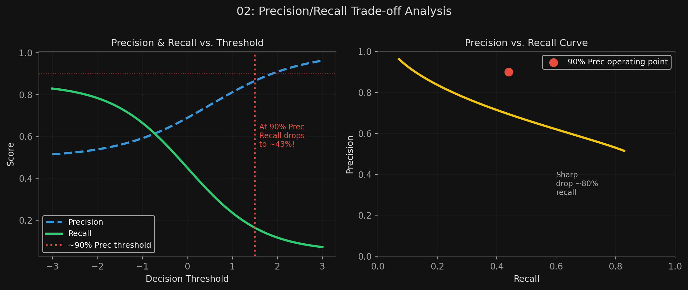

# 🏷️ Module 2: Confusion Matrix, Precision, Recall & F1
> **Ch. 3 — Hands-On ML with Scikit-Learn, Keras & TensorFlow (Aurélien Géron)**

---

## 📌 Table of Contents
1. [Start Here: The Big Picture](#big-picture)
2. [The Confusion Matrix — All 4 Cells Explained](#concept-1)
3. [Precision](#concept-2)
4. [Recall (Sensitivity / TPR)](#concept-3)
5. [F1 Score — Harmonic Mean](#concept-4)
6. [Precision/Recall Trade-off](#concept-5)
7. [Choosing the Right Threshold](#concept-6)
8. [Common Beginner Mistakes](#mistakes)
9. [Interview Q&A](#interview)
10. [⚡ One-Page Flash Card](#revision)

---

## 🌍 Start Here: The Big Picture {#big-picture}

> **TL;DR:** The confusion matrix is the foundation of all classifier evaluation. From it derive precision (quality of positive predictions), recall (coverage of actual positives), and F1 (their harmonic mean). These three metrics tell you everything about binary classifier performance on imbalanced datasets. The precision/recall trade-off is controlled by a decision threshold — raising it improves precision but tanks recall, and vice versa.

---

## 🔍 1. The Confusion Matrix {#concept-1}

**How to compute:**
```python
from sklearn.model_selection import cross_val_predict
from sklearn.metrics import confusion_matrix

# cross_val_predict: returns clean out-of-fold predictions (model never saw that fold)
y_train_pred = cross_val_predict(sgd_clf, X_train, y_train_5, cv=3)

confusion_matrix(y_train_5, y_train_pred)
# array([[53057, 1522],
#        [ 1325, 4096]])
```

**The Four Cells — MEMORIZE THIS:**

```
┌─────────────────────────────────────────────────────────┐
│                   PREDICTED CLASS                       │
│              Negative (NOT-5)   Positive (5)            │
│  ┌──────────┬────────────────┬───────────────┐          │
│  │ ACTUAL   │   TN = 53,057  │  FP = 1,522   │          │
│  │ Negative │ (correctly     │ (wrongly said │          │
│  │ (NOT-5)  │  said NOT-5)   │  it's a 5)    │          │
│  ├──────────┼────────────────┼───────────────┤          │
│  │ ACTUAL   │   FN = 1,325   │  TP = 4,096   │          │
│  │ Positive │ (missed a 5 — │ (correctly    │          │
│  │  (5)     │  called NOT-5) │  found a 5)   │          │
│  └──────────┴────────────────┴───────────────┘          │
└─────────────────────────────────────────────────────────┘
```

| Cell | Name | Meaning |
|---|---|---|
| TN (53,057) | True Negative | Correctly identified NOT-5 |
| FP (1,522) | False Positive | Said "it's a 5" but it wasn't — **Type I Error** |
| FN (1,325) | False Negative | Said "not a 5" but it was — **Type II Error** |
| TP (4,096) | True Positive | Correctly identified a 5 |

**Perfect classifier:**
```python
confusion_matrix(y_train_5, y_train_5)  # perfect = self-prediction
# array([[54579, 0],
#        [    0, 5421]])
# Only TN and TP — no off-diagonal values.
```

---

## 🔍 2. Precision {#concept-2}

> "Of all the times I said 'positive', how often was I right?"

$$\text{Precision} = \frac{TP}{TP + FP}$$

```python
from sklearn.metrics import precision_score
precision_score(y_train_5, y_train_pred)
# 4096 / (4096 + 1522) = 0.7291  → 72.9%
```

**The Precision Triviality Problem:**
A classifier that makes **exactly one positive prediction** and gets it right → Precision = 1/1 = 100%. But it catches virtually nothing. This is why precision must always be considered alongside recall.

---

## 🔍 3. Recall (Sensitivity / True Positive Rate) {#concept-3}

> "Of all the actual positives, how many did I catch?"

$$\text{Recall} = \frac{TP}{TP + FN}$$

```python
from sklearn.metrics import recall_score
recall_score(y_train_5, y_train_pred)
# 4096 / (4096 + 1325) = 0.7556  → 75.6%
```

**Also called:** Sensitivity, True Positive Rate (TPR), Hit Rate.

**Interpretation for the 5-detector:**
*   When the SGD classifier claims an image is a 5, it's right only **72.9%** of the time.
*   Of all actual 5s in the dataset, it only catches **75.6%** of them.

---

## 🔍 4. F1 Score — Harmonic Mean {#concept-4}

$$F_1 = 2 \times \frac{\text{Precision} \times \text{Recall}}{\text{Precision} + \text{Recall}} = \frac{TP}{TP + \frac{FN + FP}{2}}$$

```python
from sklearn.metrics import f1_score
f1_score(y_train_5, y_train_pred)
# 0.7421
```

**Why harmonic mean, not arithmetic mean?**
*   Arithmetic mean of Precision=100%, Recall=1% = **50.5%** — misleadingly OK-looking.
*   Harmonic mean of Precision=100%, Recall=1% = **1.98%** — correctly penalizes the terrible recall.
*   **The harmonic mean heavily penalizes the lower of the two values** — a classifier only gets a high F1 if BOTH precision AND recall are high.

**When to use what:**

| Use Case | Priority | Reason |
|---|---|---|
| Safe-for-kids video classifier | **High Precision** | Better to reject safe videos than let harmful ones through |
| Shoplifter detection (surveillance) | **High Recall** | Better to have false alerts than miss actual shoplifters |
| Medical disease screening | **High Recall** | Missing a sick patient (FN) is worse than a false alarm (FP) |
| Spam filter | Balanced / High Precision | Users hate losing real emails to spam folder |

---

## 🔍 5. Precision/Recall Trade-off {#concept-5}

**The Mechanism:**
SGDClassifier assigns a **decision score** to each instance using an internal decision function. If `score > threshold` → predicted Positive; else → predicted Negative.

**Default threshold = 0** for SGDClassifier.

**Visual from the book (Figure 3-3):**
```
Scores (low → high):
[2] [3] [3] [6] [3] [5] [5] [6] [6] [5]  ← Digit types (6 = false positive)
         ↑             ↑
      Low threshold  High threshold
Precision: 4/5=80%   Precision: 3/3=100%
Recall:    4/6=67%   Recall:    3/6=50%
```

**Key insight:**
*   **Raise threshold** → Precision ↑, Recall ↓
*   **Lower threshold** → Recall ↑, Precision ↓
*   They move in opposite directions. This is the **fundamental precision/recall trade-off**.

> [!NOTE]
> **Why is the precision curve sometimes bumpy?** Raising the threshold by one step can occasionally *decrease* precision (e.g., from 4/5=80% to 3/4=75% if a true positive was removed). But recall can only monotonically decrease with increasing threshold — hence recall's smooth curve.

---

## 🔍 6. Choosing the Right Threshold {#concept-6}

**Step 1 — Get decision scores for all training instances:**
```python
from sklearn.model_selection import cross_val_predict

y_scores = cross_val_predict(sgd_clf, X_train, y_train_5, cv=3,
                              method="decision_function")
```

**Step 2 — Compute precision & recall at every possible threshold:**
```python
from sklearn.metrics import precision_recall_curve

precisions, recalls, thresholds = precision_recall_curve(y_train_5, y_scores)
```

**Step 3 — Plot and choose:**
```python
plt.plot(thresholds, precisions[:-1], "b--", label="Precision")
plt.plot(thresholds, recalls[:-1], "g-", label="Recall")
plt.xlabel("Threshold")
plt.legend()
```

**Step 4 — Target a specific precision programmatically:**
```python
# Find the lowest threshold that gives at least 90% precision
threshold_90_precision = thresholds[np.argmax(precisions >= 0.90)]  # ≈ 7816

# Make predictions at this threshold
y_train_pred_90 = (y_scores >= threshold_90_precision)

precision_score(y_train_5, y_train_pred_90)  # 0.9000  ✓
recall_score(y_train_5, y_train_pred_90)     # 0.4368  ← Low!
```

> [!WARNING]
> High precision ≠ good classifier. At 90% precision, recall drops to only **43.7%** — the classifier now misses more than half of all actual 5s. If someone demands 99% precision, always ask: "At what recall?"

**Also: precision vs. recall plot (Figure 3-5):**
```python
plt.plot(recalls, precisions)
plt.xlabel("Recall")
plt.ylabel("Precision")
```
*   Precision remains high until recall ≈ 80%, then **drops sharply**.
*   Recommended operating point: just before the sharp drop (~60% recall).


> 📊 **Graph 02:** Precision and Recall as functions of the decision threshold (left) and Precision vs. Recall curve (right).

---

## ❌ Common Beginner Mistakes {#mistakes}

**1. "Treating F1 as a geometric or arithmetic mean of precision and recall"** ❌
> F1 is the **harmonic mean**. The harmonic mean is always ≤ arithmetic mean, and it punishes extreme imbalance much more severely. If precision=100% and recall=1%, arithmetic mean=50.5% (seemingly OK), harmonic mean=1.98% (correctly terrible).

**2. "Setting a high threshold to get high precision, then claiming the model is 'high precision'"** ❌
> The book's exact quote: "A high-precision classifier is not very useful if its recall is too low." Always report precision **and** recall (or F1) together. Reporting precision alone without the corresponding recall is misleading.

---

## 🎤 Interview Q&A {#interview}

**Q1: A colleague says "Our cancer screening classifier has 99.9% precision at our chosen threshold!" Is this enough information to evaluate the classifier?**
> **A:**
> No. High precision without recall context is meaningless. A classifier that makes only 1 positive prediction and gets it right has 100% precision — but it's completely useless clinically. At 99.9% precision, we need to know the corresponding **recall**: how many actual cancer cases does the classifier catch? If recall is 5%, the classifier is missing 95% of real cancer cases (FN = very high), which in a medical context is potentially lethal. We need both metrics, or the F1 score, to evaluate the classifier properly.

**Q2: Explain the mechanism behind the precision/recall trade-off at the level of the decision threshold.**
> **A:**
> SGDClassifier (and most classifiers) compute an internal score per instance. Predictions are made by comparing the score to a threshold: `predicted = (score > threshold)`. 
> *   **Raising the threshold** makes the classifier more conservative — only the highest-confidence positives pass. Fewer total positives are predicted → fewer false positives → **Precision increases**. But some true positives that were just above the old threshold are now rejected → **Recall decreases**.
> *   **Lowering the threshold** makes the classifier more liberal — more instances become "positive". Catches more true positives → **Recall increases**. But also captures more false positives → **Precision decreases**.
> This is a fundamental trade-off — you cannot simultaneously maximize both without improving the underlying model's discriminative ability.

---

## ⚡ One-Page Flash Card {#revision}

```
╔══════════════════════════════════════════════════════════════════╗
║  MODULE 2 FLASH CARD — Confusion Matrix, Precision, Recall, F1  ║
╠══════════════════════════════════════════════════════════════════╣
║  CONFUSION MATRIX (actual rows, predicted cols):                 ║
║  TN | FP  ← Actual Negative row                                  ║
║  FN | TP  ← Actual Positive row                                  ║
║                                                                  ║
║  Precision  = TP / (TP + FP) → "How precise are my POS calls?"  ║
║  Recall     = TP / (TP + FN) → "How many POS did I catch?"      ║
║  F1         = 2*(P*R)/(P+R)  → Harmonic mean. Penalizes lows.   ║
║                                                                  ║
║  REAL VALUES FROM BOOK (SGD 5-detector):                         ║
║  Precision = 72.9%  |  Recall = 75.6%  |  F1 = 74.2%           ║
║                                                                  ║
║  PRECISION/RECALL TRADE-OFF:                                     ║
║  Raise threshold → Precision ↑, Recall ↓                        ║
║  Lower threshold → Recall ↑, Precision ↓                        ║
║  At 90% precision target → Recall drops to only 43.7%!          ║
╚══════════════════════════════════════════════════════════════════╝
```

---

**🔗 Previous Module →** [01_MNIST_Binary_Classifier.md](01_MNIST_Binary_Classifier.md)  
**🔗 Next Module →** [03_ROC_Multiclass_ErrorAnalysis.md](03_ROC_Multiclass_ErrorAnalysis.md)
