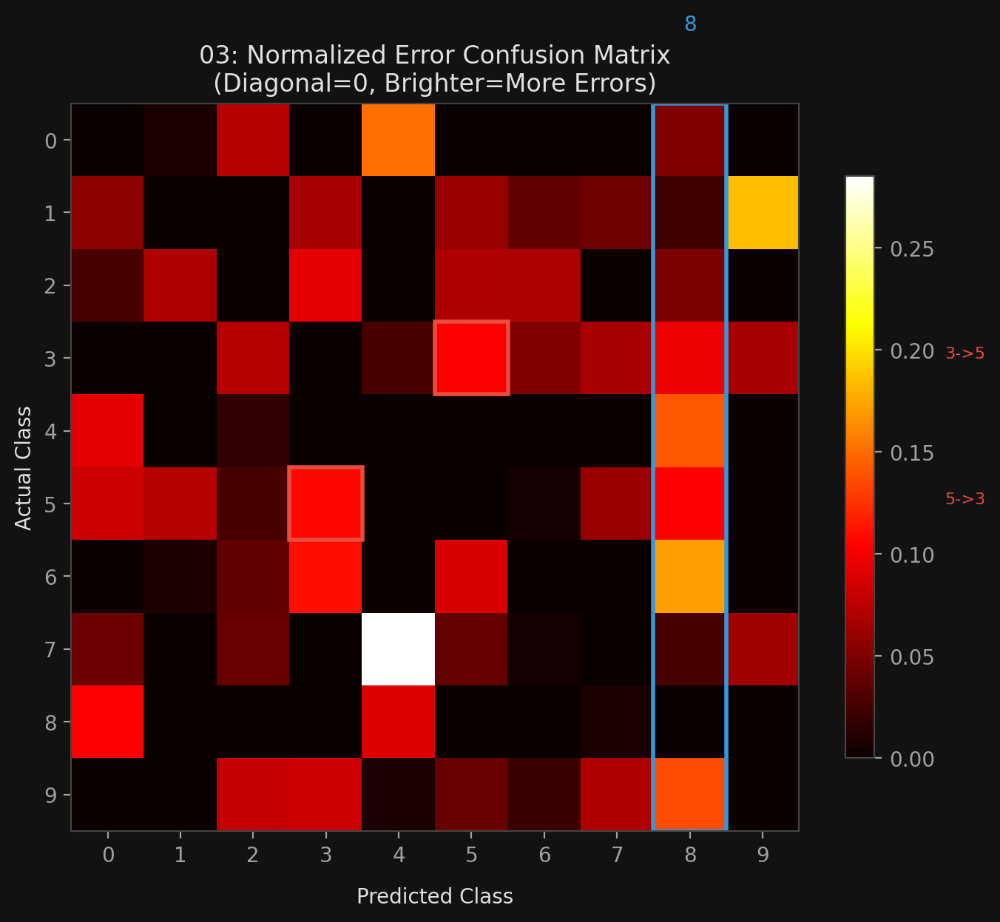

# 🏷️ Module 3: ROC Curve, Multiclass, Error Analysis & Advanced Classification
> **Ch. 3 — Hands-On ML with Scikit-Learn, Keras & TensorFlow (Aurélien Géron)**

---

## 📌 Table of Contents
1. [Start Here: The Big Picture](#big-picture)
2. [ROC Curve & AUC](#concept-1)
3. [PR Curve vs. ROC Curve — When to Use Which?](#concept-2)
4. [Multiclass Classification — OvR vs. OvO](#concept-3)
5. [Error Analysis — Confusion Matrix Deep Dive](#concept-4)
6. [Multilabel Classification](#concept-5)
7. [Multioutput Classification](#concept-6)
8. [Chapter 3 Exercises](#exercises)
9. [Complete Metrics Reference Table](#metrics-table)
10. [Common Beginner Mistakes](#mistakes)
11. [Interview Q&A](#interview)
12. [⚡ One-Page Flash Card](#revision)

---

## 🌍 Start Here: The Big Picture {#big-picture}

> **TL;DR:** The ROC curve plots TPR (recall) vs. FPR across all thresholds. The AUC (area under ROC) summarizes classifier quality in a single number (1.0 = perfect, 0.5 = random). For multiclass problems, Scikit-Learn auto-applies OvR or OvO. Error analysis on the normalized confusion matrix reveals which classes the model confuses and guides targeted improvement.

---

## 🔍 1. ROC Curve & AUC {#concept-1}

### Key Terms

| Term | Formula | Meaning |
|---|---|---|
| **TPR (Recall / Sensitivity)** | TP / (TP + FN) | Of all actual positives, fraction correctly caught |
| **FPR (Fall-out)** | FP / (FP + TN) | Of all actual negatives, fraction wrongly called positive |
| **TNR (Specificity)** | TN / (TN + FP) | Of all actual negatives, fraction correctly rejected |
| Note | FPR = 1 − TNR | ROC plots Sensitivity vs. (1 − Specificity) |

### Plotting the ROC Curve

```python
from sklearn.metrics import roc_curve

# SGDClassifier scores
y_scores = cross_val_predict(sgd_clf, X_train, y_train_5, cv=3,
                              method="decision_function")

fpr, tpr, thresholds = roc_curve(y_train_5, y_scores)

def plot_roc_curve(fpr, tpr, label=None):
    plt.plot(fpr, tpr, linewidth=2, label=label)
    plt.plot([0, 1], [0, 1], 'k--')  # Diagonal = random classifier
    plt.xlabel("False Positive Rate (FPR)")
    plt.ylabel("True Positive Rate (TPR / Recall)")

plot_roc_curve(fpr, tpr)
plt.show()
```

**A perfect classifier:** Hugs the top-left corner (TPR=1, FPR=0 at some threshold).  
**Random classifier:** Follows the diagonal (AUC = 0.5).  
**Good classifier:** Stays as far from the diagonal as possible toward the top-left corner.

### ROC AUC Score

```python
from sklearn.metrics import roc_auc_score

# SGDClassifier
roc_auc_score(y_train_5, y_scores)
# 0.9612

# RandomForestClassifier (uses predict_proba instead of decision_function)
from sklearn.ensemble import RandomForestClassifier
forest_clf = RandomForestClassifier(random_state=42)
y_probas_forest = cross_val_predict(forest_clf, X_train, y_train_5, cv=3,
                                     method="predict_proba")
y_scores_forest = y_probas_forest[:, 1]  # Probability of positive class

roc_auc_score(y_train_5, y_scores_forest)
# 0.9983  ← Much better!
```

**Random Forest precision & recall on this task:**
*   Precision: **99.0%**
*   Recall: **86.6%**
*   ROC AUC: **0.9983** vs. SGD's 0.9612

---

## 🔍 2. PR Curve vs. ROC Curve — When to Use Which? {#concept-2}

This is one of the most frequently tested interview questions:

| Situation | Use This Curve | Reason |
|---|---|---|
| Positive class is **rare** (imbalanced) | **PR Curve** | ROC AUC looks inflated because TN is huge; PR curve reveals the hard-to-detect minority class struggle |
| You care more about **False Positives** than False Negatives | **PR Curve** | FP directly appears in the Precision formula |
| Classes are roughly balanced | **ROC Curve** | AUC has intuitive probabilistic interpretation |
| You care more about **False Negatives** | Either + check Recall | Both curves show TPR (recall) |

**Example from the book:**
*   SGD 5-detector ROC AUC = **0.9612** → looks great!
*   But the PR curve reveals clear room for improvement (curve is far from the top-left corner).
*   Why? TN is huge (90% of images are non-5) → FPR remains low even for a mediocre classifier → ROC appears inflated.
*   The PR curve is more honest here because only 10% of images are 5s (rare positive class).

---

## 🔍 3. Multiclass Classification — OvR vs. OvO {#concept-3}

**Two strategies for extending binary classifiers to multiple classes:**

| Strategy | Full Name | # Classifiers (N classes) | Training data per classifier | Preferred for |
|---|---|---|---|---|
| **OvR** | One-vs-Rest (One-vs-All) | N | Full dataset | Most algorithms (default for SGD, LR) |
| **OvO** | One-vs-One | N×(N−1)/2 | Only 2-class subset | Algorithms that scale poorly with data (SVM) |

**For MNIST (10 classes):**
*   OvR = 10 classifiers
*   OvO = 10 × 9 / 2 = **45 classifiers**

**Scikit-Learn auto-selects the right strategy:**
```python
from sklearn.svm import SVC

svm_clf = SVC()
svm_clf.fit(X_train, y_train)           # Full multi-class labels
svm_clf.predict([some_digit])           # → array([5])

# SVC uses OvO under the hood (45 classifiers)
some_digit_scores = svm_clf.decision_function([some_digit])
# Returns 10 scores (one per class)
# → class 5 has the highest score (9.5)
```

**SGDClassifier natively supports multiclass:**
```python
sgd_clf.fit(X_train, y_train)           # Multi-class — no OvR/OvO needed
sgd_clf.predict([some_digit])           # → array([5])
sgd_clf.decision_function([some_digit]) # Returns 10 class scores
# Class 5 = 2412.5 (highest). Class 3 = 573.5 (some doubt)

# Multiclass CV accuracy
cross_val_score(sgd_clf, X_train, y_train, cv=3, scoring="accuracy")
# array([0.8490, 0.8713, 0.8699])  ← 84-87% (vs. 10% random baseline)

# After feature scaling → jumps to ~90%!
X_train_scaled = StandardScaler().fit_transform(X_train.astype(np.float64))
cross_val_score(sgd_clf, X_train_scaled, y_train, cv=3, scoring="accuracy")
# array([0.8971, 0.8961, 0.9069])
```

**Force a specific strategy:**
```python
from sklearn.multiclass import OneVsRestClassifier, OneVsOneClassifier

ovr_clf = OneVsRestClassifier(SVC())
ovr_clf.fit(X_train, y_train)
len(ovr_clf.estimators_)  # 10 binary classifiers
```

---

## 🔍 4. Error Analysis — Confusion Matrix Deep Dive {#concept-4}

**Step 1 — Get cross-validated predictions for all 10 classes:**
```python
y_train_pred = cross_val_predict(sgd_clf, X_train_scaled, y_train, cv=3)
conf_mx = confusion_matrix(y_train, y_train_pred)
```

**Step 2 — Visualize:**
```python
plt.matshow(conf_mx, cmap=plt.cm.gray)
plt.show()
```
Most images fall on the main diagonal (correct). 5s appear slightly darker (fewer images or harder to classify).

**Step 3 — Normalize by row to compare error rates (not absolute counts):**
```python
row_sums = conf_mx.sum(axis=1, keepdims=True)
norm_conf_mx = conf_mx / row_sums
np.fill_diagonal(norm_conf_mx, 0)  # Zero out correct predictions to focus on errors
plt.matshow(norm_conf_mx, cmap=plt.cm.gray)
plt.show()
```

**Key findings from the error matrix:**
*   **Column 8 is very bright** → Many classes get misclassified **as 8** (many false 8s).
*   **Row 8 is not that bad** → Actual 8s are mostly classified correctly.
*   **3s and 5s are confused with each other** (in both directions).

**Root cause analysis for 3/5 confusion:**
*   SGD is a **linear model** — assigns a weight per pixel.
*   3s and 5s differ by only a few pixels (the small junction line).
*   Slight shifts or rotations flip a 3 into a 5 in the model's "view".

**Fix → data augmentation:**
```python
# Identify the 4 types of 3/5 errors
cl_a, cl_b = 3, 5
X_aa = X_train[(y_train == cl_a) & (y_train_pred == cl_a)]  # Correct 3s
X_ab = X_train[(y_train == cl_a) & (y_train_pred == cl_b)]  # 3s called 5s
X_ba = X_train[(y_train == cl_b) & (y_train_pred == cl_a)]  # 5s called 3s
X_bb = X_train[(y_train == cl_b) & (y_train_pred == cl_b)]  # Correct 5s
```

**Insights → Actions:**
1. Collect more training data for digits that look like 8 (to reduce false 8 predictions).
2. Engineer features counting closed loops (8 has 2, 6 has 1, 5 has 0).
3. Preprocess images: center and normalize rotation → reduces 3/5 confusion.


> 📊 **Graph 03:** Normalized confusion matrix with diagonal zeroed out — reveals which classes are most confused.

---

## 🔍 5. Multilabel Classification {#concept-5}

Each instance can belong to **multiple classes simultaneously**.

**Example:** Given a digit image, output:
1. Is it large? (7, 8, or 9 → True/False)
2. Is it odd? (1, 3, 5, 7, 9 → True/False)

```python
from sklearn.neighbors import KNeighborsClassifier

y_train_large = (y_train >= 7)
y_train_odd   = (y_train % 2 == 1)
y_multilabel  = np.c_[y_train_large, y_train_odd]  # Shape: (60000, 2)

knn_clf = KNeighborsClassifier()
knn_clf.fit(X_train, y_multilabel)

knn_clf.predict([some_digit])  # digit=5
# array([[False, True]])  ← Not large (5 < 7), but odd ✓

# Evaluation: average F1 across all labels
y_train_knn_pred = cross_val_predict(knn_clf, X_train, y_multilabel, cv=3)
f1_score(y_multilabel, y_train_knn_pred, average="macro")
# 0.976  ← average="macro" treats all labels equally
# Use average="weighted" to weight by label support (# of instances)
```

**Supported natively by:** KNeighborsClassifier, RandomForestClassifier.  
**NOT natively by:** Most binary classifiers (wrap with `MultiOutputClassifier`).

---

## 🔍 6. Multioutput Classification {#concept-6}

Generalization of multilabel where each label can have **more than 2 possible values**.

**Example: Image Denoising**
*   Input: noisy digit image (784 pixel features, each 0–255).
*   Output: clean digit image (784 pixel labels, each 0–255).
*   Each of the 784 output labels is **multiclass** (256 possible values).

```python
# Create noisy images
noise = np.random.randint(0, 100, (len(X_train), 784))
X_train_mod = X_train + noise
y_train_mod = X_train  # Target = clean original image

# Train
knn_clf.fit(X_train_mod, y_train_mod)
clean_digit = knn_clf.predict([X_test_mod[some_index]])
plot_digit(clean_digit)  # Looks close to the original clean digit
```

---

## 🔍 7. Chapter 3 Exercises {#exercises}

| # | Exercise | Key Insight |
|---|---|---|
| 1 | Build a MNIST classifier with >97% test accuracy. (Hint: KNeighborsClassifier + grid search on weights & n_neighbors) | KNN with good hyperparams is surprisingly powerful on MNIST |
| 2 | Augment MNIST by shifting each image 1 pixel in all 4 directions (left, right, up, down). Retrain and measure accuracy improvement. | **Data Augmentation** — artificially expanding training set improves generalization |
| 3 | Tackle the Titanic dataset on Kaggle | Classic tabular classification |
| 4 | Build a spam classifier with high precision AND recall | Full end-to-end: download → vectorize emails → train → evaluate |

---

## 🔍 8. Complete Metrics Reference Table {#metrics-table}

| Metric | Formula | When High | When Low | Primary Use |
|---|---|---|---|---|
| **Accuracy** | (TP+TN) / Total | Most correct | Many errors OR imbalanced | Only for balanced datasets |
| **Precision** | TP/(TP+FP) | Few false alarms | Many false alarms | When FP cost is high |
| **Recall** | TP/(TP+FN) | Few misses | Missing many positives | When FN cost is high |
| **F1 Score** | Harmonic mean of P&R | Both P&R high | Either P or R is low | General comparison |
| **ROC AUC** | Area under ROC | Perfect discrimination | Random (0.5) | General, balanced classes |
| **PR AUC** | Area under PR curve | Perfect on rare class | Fails on rare class | Imbalanced datasets |
| **Specificity (TNR)** | TN/(TN+FP) | Few false alarms | Many false alarms | Medical testing |

---

## ❌ Common Beginner Mistakes {#mistakes}

**1. "Using ROC AUC for severely imbalanced datasets without also checking PR AUC"** ❌
> ROC AUC can be artificially inflated for imbalanced datasets because the huge TN pool keeps FPR low even for mediocre classifiers. The book demonstrates this explicitly: SGD's ROC AUC=0.9612 looks good, but the PR curve reveals substantial room for improvement.

**2. "Normalizing the confusion matrix by total count instead of by row"** ❌
> Normalizing by total gives misleading results when classes have different sizes. Normalizing **by row** converts to error rates: each cell shows the fraction of actual class A instances that were predicted as class B. This enables fair comparison across classes with different sizes.

---

## 🎤 Interview Q&A {#interview}

**Q1: What is the intuitive interpretation of ROC AUC?**
> **A:**
> The ROC AUC has an elegant probabilistic interpretation: **it equals the probability that a randomly chosen positive instance will be ranked higher (given a higher score by the classifier) than a randomly chosen negative instance.** AUC = 1.0 means the classifier perfectly separates all positives from all negatives. AUC = 0.5 means the classifier has no discrimination ability — it's equivalent to random guessing. AUC = 0.0 means the classifier perfectly inverts the correct ranking (never happens in practice — just flip the predictions).

**Q2: When would you choose OvR over OvO for a 10-class problem?**
> **A:**
> *   **OvR** (10 classifiers, each trained on the full dataset) → Preferred for most algorithms because training on the full dataset gives each classifier more signal.
> *   **OvO** (45 classifiers for 10 classes, each trained on only 2-class data) → Preferred for algorithms that **scale poorly with training set size**, like SVMs. Training 45 small classifiers is faster than training 10 large ones when the algorithm's complexity is quadratic or higher in N.
> Scikit-Learn automatically selects the appropriate strategy: SGDClassifier and RandomForestClassifier use OvR; SVC uses OvO.

**Q3: What is the difference between multilabel classification and multioutput classification?**
> **A:**
> *   **Multilabel:** Each instance gets multiple binary labels. Output = vector of 0s and 1s. E.g., face-recognition: [Alice=1, Bob=0, Charlie=1].
> *   **Multioutput (Multioutput-Multiclass):** Each label can have more than 2 possible values. Output = vector of multiclass labels. E.g., image denoising: each of the 784 pixels is a label with 256 possible values (0–255). Multioutput is a generalization of multilabel.

---

## ⚡ One-Page Flash Card {#revision}

```
╔══════════════════════════════════════════════════════════════════╗
║  MODULE 3 FLASH CARD — ROC, Multiclass, Error Analysis          ║
╠══════════════════════════════════════════════════════════════════╣
║  ROC CURVE: TPR (Recall) vs. FPR across all thresholds          ║
║  - AUC=1.0: perfect  |  AUC=0.5: random                        ║
║  - SGD AUC: 0.9612   |  Random Forest AUC: 0.9983              ║
║                                                                  ║
║  PR vs ROC:                                                      ║
║  - Rare positive class → Use PR Curve (ROC looks inflated)      ║
║  - Balanced classes → ROC Curve is fine                         ║
║                                                                  ║
║  MULTICLASS STRATEGIES:                                          ║
║  - OvR: N classifiers, full data. Default for most algos.       ║
║  - OvO: N*(N-1)/2 classifiers, 2-class data. For SVMs.         ║
║  - MNIST 10 classes: OvR=10, OvO=45 classifiers.               ║
║                                                                  ║
║  ERROR ANALYSIS WORKFLOW:                                        ║
║  1. cross_val_predict → confusion_matrix                         ║
║  2. Normalize by row (error rates, not absolute counts)          ║
║  3. Zero diagonal → reveals which classes get confused           ║
║  4. Target the brightest off-diagonal cells for improvement      ║
║                                                                  ║
║  CLASSIFICATION TAXONOMY:                                        ║
║  Binary → Multiclass → Multilabel → Multioutput-Multiclass      ║
╚══════════════════════════════════════════════════════════════════╝
```

---

**🔗 Previous Module →** [02_Confusion_Matrix_Precision_Recall.md](02_Confusion_Matrix_Precision_Recall.md)
