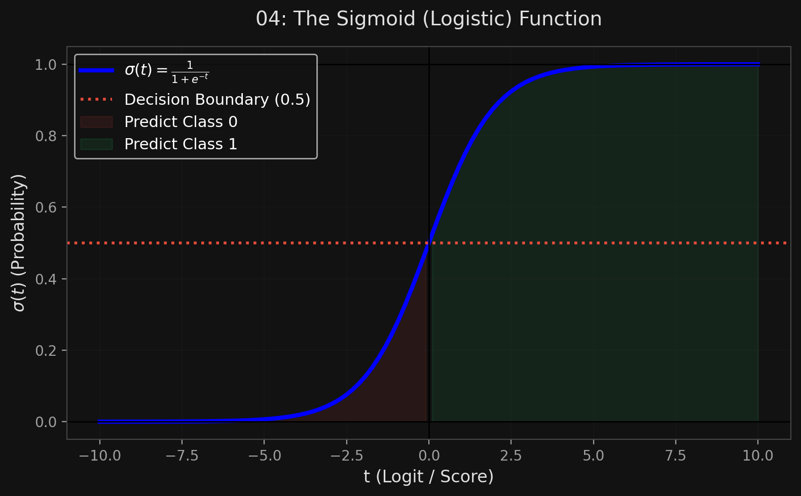
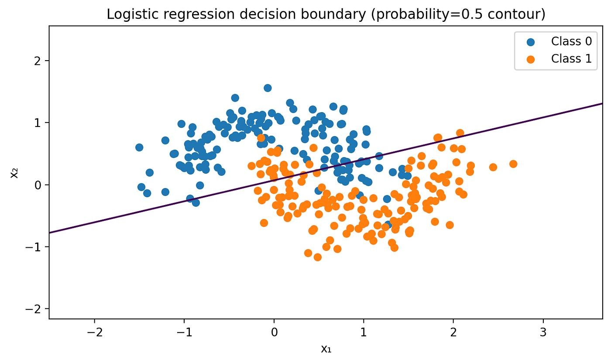

# 🏷️ Module 5: Logistic Regression & Softmax Regression
> **Ch. 4 — Hands-On ML with Scikit-Learn, Keras & TensorFlow (Aurélien Géron)**

---

## 📌 Table of Contents
1. [Start Here: The Big Picture](#big-picture)
2. [Logistic Regression (Binary) & The Sigmoid](#concept-1)
3. [The Log Loss Cost Function](#concept-2)
4. [Decision Boundaries](#concept-3)
5. [Softmax Regression (Multiclass) & Cross Entropy](#concept-4)
6. [Chapter 4 Exercises](#exercises)
7. [Common Beginner Mistakes](#mistakes)
8. [Interview Q&A](#interview)
9. [⚡ One-Page Flash Card](#revision)

---

## 🌍 Start Here: The Big Picture {#big-picture}

> **TL;DR:** Some regression algorithms can be used for classification! **Logistic Regression** takes the output of a standard linear regression equation ($\theta^T x$) and squashes it through a mathematical S-curve (the sigmoid) to output a probability between 0 and 1. If it's $> 50\%$, it's class 1; else, class 0. For multiple exclusive classes (like plant species), we generalize this into **Softmax Regression**.

---

## 🔍 1. Logistic Regression (Binary) & The Sigmoid {#concept-1}

Just like Linear Regression, a Logistic Regression model computes a weighted sum of the input features. But instead of outputting the result directly, it outputs the **logistic** of this result.

**The Model Equation:**
$$\hat{p} = h_\theta(x) = \sigma(\theta^T x)$$

**The Sigmoid Function:**
The logistic — denoted $\sigma(t)$ — is a sigmoid function (S-shaped) that always outputs a number between 0 and 1.
$$\sigma(t) = \frac{1}{1 + e^{-t}}$$

**Making a Prediction:**
Once the probability $\hat{p}$ is estimated, prediction is simple:
*   $\hat{y} = 0$ if $\hat{p} < 0.5$
*   $\hat{y} = 1$ if $\hat{p} \ge 0.5$

> [!NOTE]
> The score $t$ (which equals $\theta^T x$) is often called the **logit**. A Logistic Regression model predicts 1 if the logit is positive, and 0 if it is negative.


> 📊 **Graph 04:** The Sigmoid Function

---

## 🔍 2. The Log Loss Cost Function {#concept-2}

How do we train it? We want the model to estimate high probabilities for positive instances ($y=1$) and low probabilities for negative instances ($y=0$). 

Because the output is bounded [0,1], MSE doesn't work well (it creates a non-convex surface with local minima). Instead, we use the **Log Loss** (binary cross entropy) cost function:

**Cost for a single instance:**
*   $c(\theta) = -\log(\hat{p})$  if $y = 1$
*   $c(\theta) = -\log(1 - \hat{p})$ if $y = 0$

**Why this works:**
*   $-\log(t)$ grows infinitely large when $t$ approaches 0.
*   If the model predicts a probability close to 0 for a positive instance ($y=1$), the penalty (cost) explodes to infinity. It forces the model to be correct.

**Cost over the whole dataset (Log Loss Equation):**
$$J(\theta) = -\frac{1}{m} \sum_{i=1}^m \left[ y^{(i)} \log(\hat{p}^{(i)}) + (1 - y^{(i)}) \log(1 - \hat{p}^{(i)}) \right]$$

> **The Good News:** This cost function is mathematically guaranteed to be **convex**. Gradient Descent will always find the global minimum. There is no Normal Equation (closed-form solution) for Logistic Regression, so you *must* use Gradient Descent or another optimization algorithm.

---

## 🔍 3. Decision Boundaries {#concept-3}

Let's use the Iris dataset. We want to detect the *Iris virginica* species based on Petal Width.

```python
from sklearn import datasets
from sklearn.linear_model import LogisticRegression

iris = datasets.load_iris()
X = iris["data"][:, 3:] # petal width
y = (iris["target"] == 2).astype(int) # 1 if Iris virginica, else 0

log_reg = LogisticRegression()
log_reg.fit(X, y)
```

**What does the model output?**
*   Petal width > 2.0 cm $\rightarrow$ High probability of *Virginica*.
*   Petal width < 1.0 cm $\rightarrow$ Low probability of *Virginica*.
*   **Petal width = 1.6 cm $\rightarrow$ The intersection (50% probability).** 

This 1.6 cm point is the **Decision Boundary**.
If you pass 2 features (petal length and width), the decision boundary becomes a literal straight line separating the two classes.



---

## 🔍 4. Softmax Regression (Multiclass) & Cross Entropy {#concept-4}

Logistic Regression can be generalized to support multiple mutually exclusive classes directly, without using OvR or OvO. This is called **Softmax Regression** (or Multinomial Logistic Regression).

**How it works:**
1.  Compute a linear score $s_k(x)$ for *every* class $k$. (Each class gets its own parameter vector $\theta^{(k)}$).
2.  Run all the scores through the **Softmax function**. It computes the exponential of every score, then normalizes them so they all add up to 1.0 (100%).

**The Softmax Function:**
$$\hat{p}_k = \frac{\exp(s_k(x))}{\sum_{j=1}^K \exp(s_j(x))}$$

*   $K$ = Number of classes.
*   The class with the highest resulting probability is the prediction.

**The Cost Function (Cross Entropy):**
The goal is to force the model to assign a high probability to the correct class. We minimize the **Cross Entropy** cost function:
$$J(\Theta) = -\frac{1}{m} \sum_{i=1}^m \sum_{k=1}^K y_k^{(i)} \log(\hat{p}_k^{(i)})$$

*   $y_k^{(i)}$ is 1 if the target class for instance $i$ is $k$; otherwise 0.
*   If $K=2$, this collapses exactly into the binary Log Loss equation above.

**Scikit-Learn Implementation:**
```python
# multi_class="multinomial" activates Softmax
softmax_reg = LogisticRegression(multi_class="multinomial", solver="lbfgs", C=10)
softmax_reg.fit(X, y) # Pass all 3 classes
```

> [!CAUTION]
> Softmax Regression predicts ONLY ONE class at a time (multiclass, not multioutput). You cannot use it to recognize multiple people in one picture. The classes must be mutually exclusive (e.g., dog vs. cat vs. bird).

---

## 🔍 5. Chapter 4 Exercises {#exercises}

| # | Question | Answer |
|---|---|---|
| 1 | Algorithm for millions of features? | Stochastic GD or Mini-batch GD. (Normal Equation / SVD will crash). |
| 2 | What happens if features have different scales? | Gradient Descent will take a long time to converge (valley becomes elongated). Fix: `StandardScaler`. |
| 3 | Can GD get stuck in local minima for Logistic Regression? | No. The Log Loss cost function is strictly convex. |
| 5 | Validation error consistently goes up during training? | The model is overfitting. Stop early, add regularization, or get more data. |
| 11 | Outdoor/indoor AND daytime/nighttime classification? | These are NOT mutually exclusive. You must train **two separate Logistic Regression models** (not Softmax). |

---

## ❌ Common Beginner Mistakes {#mistakes}

**1. "Assuming Logistic Regression is a regression algorithm"** ❌
> Despite its name, Logistic Regression is purely a **classification algorithm**. It uses regression math internally to compute a score, but maps that score to a probability for classification.

**2. "Using Softmax to predict tags on an image (e.g., 'outdoor', 'dog', 'frisbee')"** ❌
> Softmax enforces a strict rule: all probabilities must sum to 100%. If it predicts 90% 'dog', it can only predict at most 10% 'outdoor'. If the tags are not mutually exclusive, you must train separate binary Logistic Regression models (or a Neural Network with a sigmoid output layer).

---

## 🎤 Interview Q&A {#interview}

**Q1: Why do we use Log Loss instead of Mean Squared Error (MSE) for Logistic Regression?**
> **A:**
> If we pass the sigmoid probability function into the MSE cost function, the resulting math surface becomes non-convex — meaning it will be full of hills and valleys (local minima). Gradient Descent would get permanently stuck. Log Loss (binary cross entropy) was mathematically designed specifically to remain strictly convex when combined with the sigmoid function, guaranteeing that Gradient Descent will always find the true global minimum.

**Q2: What is Cross Entropy and how does it relate to Softmax?**
> **A:**
> Softmax is the *activation function* that takes raw linear scores (logits) and converts them into a valid probability distribution (all classes sum to 1). Cross Entropy is the *cost function* used to train the Softmax layer. It measures how far the predicted probability distribution is from the true distribution (where the correct class is 100% and all others are 0%). By minimizing Cross Entropy, we force the Softmax probabilities to align with the true labels.

---

## ⚡ One-Page Flash Card {#revision}

```
╔══════════════════════════════════════════════════════════════════╗
║  MODULE 5 FLASH CARD — Logistic & Softmax Regression             ║
╠══════════════════════════════════════════════════════════════════╣
║  LOGISTIC REGRESSION (Binary):                                   ║
║  - Computes linear score: theta^T * X                            ║
║  - Passes score through SIGMOID function (S-curve).              ║
║  - Outputs probability [0, 1]. Predicts 1 if prob >= 50%.        ║
║  - Cost Function: Log Loss (Convex). No closed-form math eq!     ║
║                                                                  ║
║  SOFTMAX REGRESSION (Multiclass):                                ║
║  - Computes a linear score for EVERY class.                      ║
║  - Softmax normalizes them so they all sum to 100%.              ║
║  - Cost Function: Cross Entropy.                                 ║
║                                                                  ║
║  KEY RULE:                                                       ║
║  - Softmax is only for mutually exclusive classes (A or B or C). ║
║  - If an instance can be BOTH A and B, use multiple binary       ║
║    Logistic Regressions instead.                                 ║
╚══════════════════════════════════════════════════════════════════╝
```

---

**🔗 Previous Module →** [04_Regularized_Linear_Models.md](04_Regularized_Linear_Models.md)
