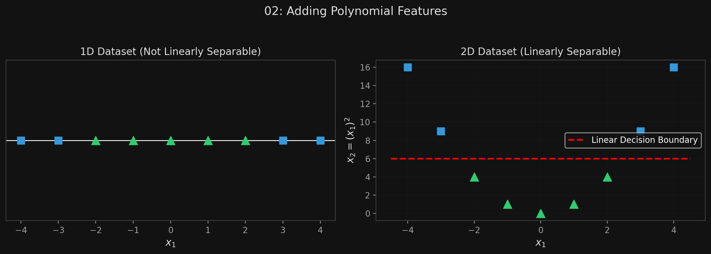
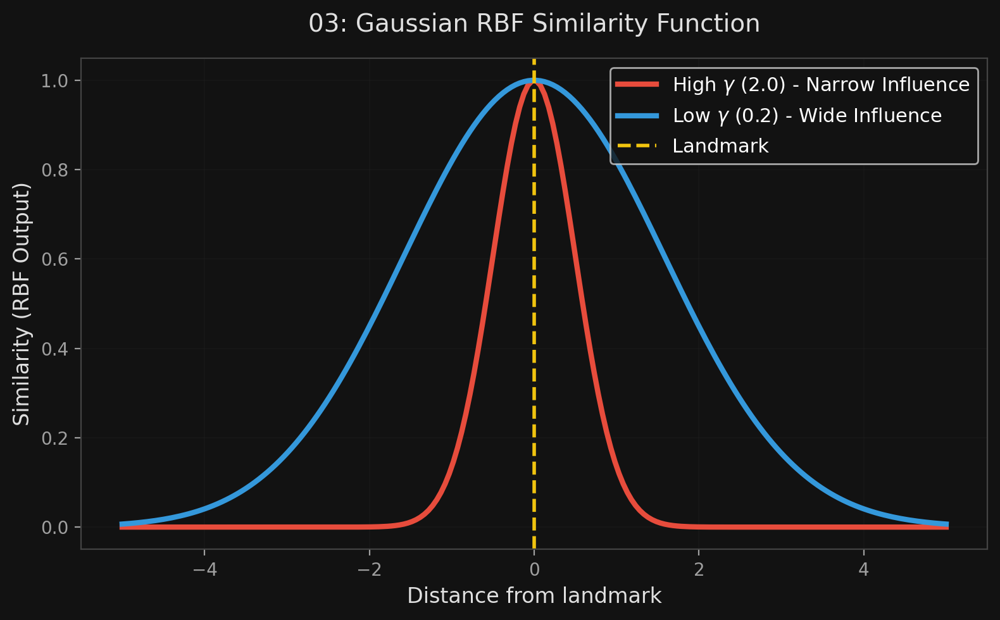

# 🏷️ Module 2: Nonlinear SVMs & The Kernel Trick
> **Ch. 5 — Hands-On ML with Scikit-Learn, Keras & TensorFlow (Aurélien Géron)**

---

## 📌 Table of Contents
1. [Start Here: The Big Picture](#big-picture)
2. [Adding Polynomial Features Manually](#concept-1)
3. [The Miraculous Kernel Trick](#concept-2)
4. [Adding Similarity Features (Gaussian RBF)](#concept-3)
5. [The Gaussian RBF Kernel](#concept-4)
6. [Computational Complexity Table](#concept-5)
7. [Common Beginner Mistakes](#mistakes)
8. [Interview Q&A](#interview)
9. [⚡ One-Page Flash Card](#revision)

---

## 🌍 Start Here: The Big Picture {#big-picture}

> **TL;DR:** Linear SVMs are great, but most real-world data isn't a straight line. If we map 1D data into 2D by adding $x^2$, it suddenly becomes linearly separable. But adding millions of polynomial features manually will crash your computer. SVMs solve this using mathematical magic called the **Kernel Trick**: it gets the exact same result as adding infinite features, *without actually adding them*. The most common kernels are Polynomial and Gaussian RBF.

---

## 🔍 1. Adding Polynomial Features Manually {#concept-1}

If data is not linearly separable, you can add more features (like polynomial features).
*   Imagine a 1D dataset with points at $x = -2, -1, 0, 1, 2$. 
*   If the negative points are class 1 and positive are class 0, they overlap.
*   Add a second feature $x_2 = (x_1)^2$. Now the data plots as a U-shape parabola in 2D, and you can draw a straight line right through it!

**Implementation (using `make_moons` dataset):**
```python
from sklearn.datasets import make_moons
from sklearn.pipeline import Pipeline
from sklearn.preprocessing import PolynomialFeatures

X, y = make_moons(n_samples=100, noise=0.15)

polynomial_svm_clf = Pipeline([
    ("poly_features", PolynomialFeatures(degree=3)),
    ("scaler", StandardScaler()),
    ("svm_clf", LinearSVC(C=10, loss="hinge"))
])

polynomial_svm_clf.fit(X, y)
```


> 📊 **Graph 02:** Adding polynomial features to make data linearly separable

---

## 🔍 2. The Miraculous Kernel Trick {#concept-2}

Adding features manually (`PolynomialFeatures`) has a massive flaw: if you want a high-degree polynomial (e.g., degree=10), it creates a combinatorial explosion of features, making the model impossibly slow.

**The Solution: The Kernel Trick**
When you use SVMs, you can apply an almost miraculous mathematical technique. It allows the SVM to find the exact same decision boundary as if you had added millions of polynomial features, **but without actually having to compute or store them**.

```python
from sklearn.svm import SVC

poly_kernel_svm_clf = Pipeline([
    ("scaler", StandardScaler()),
    # kernel="poly" activates the kernel trick
    ("svm_clf", SVC(kernel="poly", degree=3, coef0=1, C=5))
])

poly_kernel_svm_clf.fit(X, y)
```
*   `degree`: The degree of the polynomial. (If the model underfits, increase it).
*   `coef0`: Controls how much the model is influenced by high-degree polynomials vs. low-degree polynomials.

---

## 🔍 3. Adding Similarity Features (Gaussian RBF) {#concept-3}

Another way to map non-linear data into a linearly separable space is to use **Similarity Features**.
*   We define a "landmark" at the location of certain instances.
*   We measure how far every other instance is from that landmark using a bell-shaped function called the **Gaussian Radial Basis Function (RBF)**.

**The Gaussian RBF Equation:**
$$\phi_\gamma(x, \ell) = \exp(-\gamma || x - \ell ||^2)$$
*   It outputs a 1 if the instance is right on the landmark, and drops toward 0 as it gets further away.

If you drop a landmark on every single training instance, an $m \times n$ dataset transforms into an $m \times m$ dataset. It guarantees linear separability, but if you have 100,000 instances, you just created 100,000 features. That's too slow.

---

## 🔍 4. The Gaussian RBF Kernel {#concept-4}

Once again, the Kernel Trick saves the day. We can use the RBF Kernel to get the exact same result as adding a landmark at every single training instance, *without actually doing it*.

```python
rbf_kernel_svm_clf = Pipeline([
    ("scaler", StandardScaler()),
    ("svm_clf", SVC(kernel="rbf", gamma=5, C=0.001))
])

rbf_kernel_svm_clf.fit(X, y)
```

**Understanding the $\gamma$ (gamma) Hyperparameter:**
$\gamma$ controls the width of the bell-shaped curve.
*   **High $\gamma$:** The bell curve is narrow. Each instance only influences things very close to it. The decision boundary wiggles violently around individual points. (Higher Variance $\rightarrow$ **Fixes Underfitting**).
*   **Low $\gamma$:** The bell curve is wide. Instances have a huge range of influence. The decision boundary becomes very smooth. (Higher Bias $\rightarrow$ **Fixes Overfitting**).

> [!TIP]
> **Rule of Thumb for Kernels:** Always try `LinearSVC` first (it's the fastest). If the training set is not too large, try the `kernel="rbf"` next. It works extremely well in most cases.


> 📊 **Graph 03:** Similarity features using the Gaussian RBF

---

## 🔍 5. Computational Complexity Table {#concept-5}

You must memorize this table to know when an SVM will crash your server.

| Class | Time Complexity | Out-of-core | Kernel Trick? | Ideal Use Case |
|---|---|---|---|---|
| `LinearSVC` | **$O(m \times n)$** | No | **No** | Huge datasets, lots of features |
| `SGDClassifier` | **$O(m \times n)$** | **Yes** | **No** | Datasets that don't fit in RAM |
| `SVC` | **$O(m^2 \times n)$ to $O(m^3 \times n)$** | No | **Yes** | Small to medium complex datasets |

> **Warning:** Because `SVC` scales quadratically or cubically with the number of instances ($m$), it gets **dreadfully slow** if you have hundreds of thousands of instances. Use it only for small/medium datasets.

---

## ❌ Common Beginner Mistakes {#mistakes}

**1. "Using SVC(kernel='rbf') on a dataset with 500,000 rows"** ❌
> Because the time complexity of the SVC class is between $O(m^2)$ and $O(m^3)$, plugging in 500,000 rows means doing $500,000^3$ operations. Your code will run forever and crash. For huge datasets, you must stick to `LinearSVC` or `SGDClassifier`.

**2. "Increasing Gamma to fix overfitting"** ❌
> Increasing $\gamma$ makes the bell curve narrower, which causes the decision boundary to wiggle tightly around individual points (memorizing the noise). This *causes* overfitting. To fix overfitting, you must **decrease** $\gamma$ to make the boundary smoother.

---

## 🎤 Interview Q&A {#interview}

**Q1: Explain the "Kernel Trick" to me like I'm 5.**
> **A:** 
> Sometimes data is all mixed together in 2D, and you can't draw a straight line to separate the classes. If you toss the data up into the air (a 3rd dimension), you can suddenly slide a flat sheet of metal between the classes. But calculating the exact 3D coordinates for millions of data points takes too much computer memory. 
> The Kernel Trick is a math shortcut. It calculates exactly where the sheet of metal should go *without ever actually throwing the points into the air*. It gives you the power of infinite dimensions with the computational cost of the original dimensions.

**Q2: You've trained an SVM with an RBF kernel, but the model is severely underfitting the training data. Which hyperparameters should you adjust and in which direction?**
> **A:**
> If the model is underfitting, it is too highly regularized. You need to make it more sensitive to the training data.
> 1.  **Increase $\gamma$ (Gamma):** This makes the RBF bell curves narrower, giving each instance a smaller, sharper area of influence, allowing the decision boundary to bend more flexibly around the data.
> 2.  **Increase $C$:** This reduces the regularization, imposing a stricter penalty for margin violations, which forces the model to fit the training data more closely.

---

## ⚡ One-Page Flash Card {#revision}

```
╔══════════════════════════════════════════════════════════════════╗
║  MODULE 2 FLASH CARD — Nonlinear SVMs & The Kernel Trick         ║
╠══════════════════════════════════════════════════════════════════╣
║  THE PROBLEM WITH LINEAR:                                        ║
║  Not all data can be separated by a straight line.               ║
║                                                                  ║
║  THE KERNEL TRICK:                                               ║
║  A mathematical shortcut (e.g., poly or rbf kernel) that finds   ║
║  complex boundaries without actually creating infinite features. ║
║                                                                  ║
║  GAUSSIAN RBF KERNEL:                                            ║
║  Uses a bell curve (similarity function) around instances.       ║
║  - Gamma (γ): Controls bell width.                               ║
║    High γ = narrow bell = wiggly boundary (fixes underfitting).  ║
║    Low γ  = wide bell = smooth boundary (fixes overfitting).     ║
║                                                                  ║
║  COMPLEXITY WARNING:                                             ║
║  SVC (with kernels) is O(m^2) to O(m^3).                         ║
║  DO NOT use on datasets with > 100,000 instances!                ║
╚══════════════════════════════════════════════════════════════════╝
```

---

**🔗 Previous Module →** [01_Linear_SVM_Classification.md](01_Linear_SVM_Classification.md)  
**🔗 Next Module →** [03_SVM_Regression.md](03_SVM_Regression.md)
