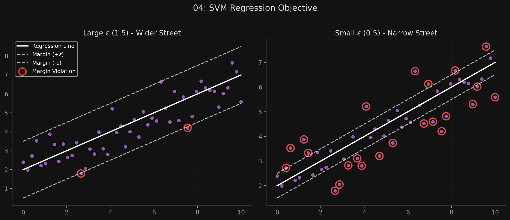

# 🏷️ Module 3: SVM Regression
> **Ch. 5 — Hands-On ML with Scikit-Learn, Keras & TensorFlow (Aurélien Géron)**

---

## 📌 Table of Contents
1. [Start Here: The Big Picture](#big-picture)
2. [Reversing the Objective](#concept-1)
3. [The $\epsilon$ (Epsilon) Hyperparameter](#concept-2)
4. [Nonlinear SVM Regression](#concept-3)
5. [Common Beginner Mistakes](#mistakes)
6. [Interview Q&A](#interview)
7. [⚡ One-Page Flash Card](#revision)

---

## 🌍 Start Here: The Big Picture {#big-picture}

> **TL;DR:** The SVM algorithm is extremely versatile. By completely reversing its core objective, it can be used for Regression instead of Classification! Instead of trying to keep the street empty while separating classes, SVM Regression tries to fit as many instances as possible *inside* the street, while limiting margin violations (points outside the street).

---

## 🔍 1. Reversing the Objective {#concept-1}

To switch an SVM from Classification to Regression, we invert the logic:

*   **SVM Classification Objective:** Fit the largest possible street *between* two classes while limiting margin violations (instances inside the street).
*   **SVM Regression Objective:** Fit *as many instances as possible* **ON** the street, while limiting margin violations (instances *off* the street).

The street acts as a buffer zone around the prediction line. As long as a training point falls inside the street, it is considered perfectly predicted (no penalty).

---

## 🔍 2. The $\epsilon$ (Epsilon) Hyperparameter {#concept-2}

The width of the street is controlled by a hyperparameter called **$\epsilon$ (epsilon)**.

*   **Large $\epsilon$:** A very wide street. Many points fit inside it. 
*   **Small $\epsilon$:** A narrow street. 

**The $\epsilon$-insensitive property:**
Adding more training instances *within the margin* does not affect the model's predictions at all. Once a point is safely inside the street, the model ignores it. Thus, the model is said to be **$\epsilon$-insensitive**.

**Scikit-Learn Implementation (Linear):**
```python
from sklearn.svm import LinearSVR

# Create an SVM Regressor with a street width of 1.5
svm_reg = LinearSVR(epsilon=1.5)
svm_reg.fit(X, y)
```
*(Note: Data should be centered and scaled first!)*


> 📊 **Graph 04:** SVM Regression (Large vs Small Epsilon)

---

## 🔍 3. Nonlinear SVM Regression {#concept-3}

Just like classification, if your data is curved or complex, you can use the Kernel Trick for regression tasks.

```python
from sklearn.svm import SVR

# Using a 2nd-degree polynomial kernel
svm_poly_reg = SVR(kernel="poly", degree=2, C=100, epsilon=0.1)
svm_poly_reg.fit(X, y)
```

**Understanding the C Hyperparameter in Regression:**
In SVM Regression, $C$ still controls regularization, but remember the objective is reversed!
*   **Large $C$:** Little regularization. The model desperately tries to fit the data, creating a wiggly, tight curve.
*   **Small $C$:** Much more regularization. The curve becomes smoother.

**Computational Complexity Warning (Again):**
*   `LinearSVR` scales linearly with the size of the training set (fast).
*   `SVR` (which supports the kernel trick) gets much too slow when the training set grows large.

---

## ❌ Common Beginner Mistakes {#mistakes}

**1. "Assuming SVM Regression penalizes all errors like MSE does"** ❌
> In standard Linear Regression (MSE), being off by 0.1 costs you a small penalty. In SVM Regression, if a point is within the $\epsilon$ street (e.g., you are off by 0.1 but $\epsilon=0.5$), the penalty is exactly **zero**. The model only cares about points that fall *outside* the street.

**2. "Using SVR on a massive dataset"** ❌
> Just like `SVC` for classification, the `SVR` class uses the kernel trick and scales quadratically/cubically. Do not use it for hundreds of thousands of instances. Use `LinearSVR` instead, or a completely different algorithm (like Random Forests).

---

## 🎤 Interview Q&A {#interview}

**Q1: How does the objective of SVM Regression differ from SVM Classification?**
> **A:**
> They are exact opposites. SVM Classification tries to draw the widest possible empty street between two classes; margin violations are instances that fall *inside* the street. SVM Regression tries to fit as many instances as possible *inside* the street around the regression line; margin violations are instances that fall *outside* the street. 

**Q2: What does it mean when we say SVM Regression is "$\epsilon$-insensitive"?**
> **A:**
> The hyperparameter $\epsilon$ (epsilon) defines the width of the margin (the street) around the predicted regression line. If a training instance falls anywhere inside this margin, the model calculates its error as zero. Because adding or moving data points inside the margin doesn't change the loss, it doesn't change the model's weights. The model is totally insensitive to data inside the $\epsilon$-tube.

---

## ⚡ One-Page Flash Card {#revision}

```
╔══════════════════════════════════════════════════════════════════╗
║  MODULE 3 FLASH CARD — SVM Regression                            ║
╠══════════════════════════════════════════════════════════════════╣
║  THE REVERSED OBJECTIVE:                                         ║
║  - Fit as many points as possible ON the street.                 ║
║  - Margin Violations = points OFF the street.                    ║
║                                                                  ║
║  EPSILON (ε):                                                    ║
║  - Controls the width of the street.                             ║
║  - ε-insensitive: Any point inside the street has 0 error and    ║
║    doesn't affect the model weights at all.                      ║
║                                                                  ║
║  HYPERPARAMETERS TO TUNE:                                        ║
║  - ε (epsilon): Width of the street.                             ║
║  - C (Regularization): Small C = smooth line; Large C = tight fit║
║  - Kernel trick (poly, rbf) works exactly the same.              ║
║                                                                  ║
║  CLASSES TO USE:                                                 ║
║  - LinearSVR: Fast, linear, for large datasets.                  ║
║  - SVR: Slow, supports kernels, for small datasets.              ║
╚══════════════════════════════════════════════════════════════════╝
```

---

**🔗 Previous Module →** [02_Nonlinear_SVM_Kernel_Trick.md](02_Nonlinear_SVM_Kernel_Trick.md)  
**🔗 Next Module →** [04_Under_the_Hood.md](04_Under_the_Hood.md)
