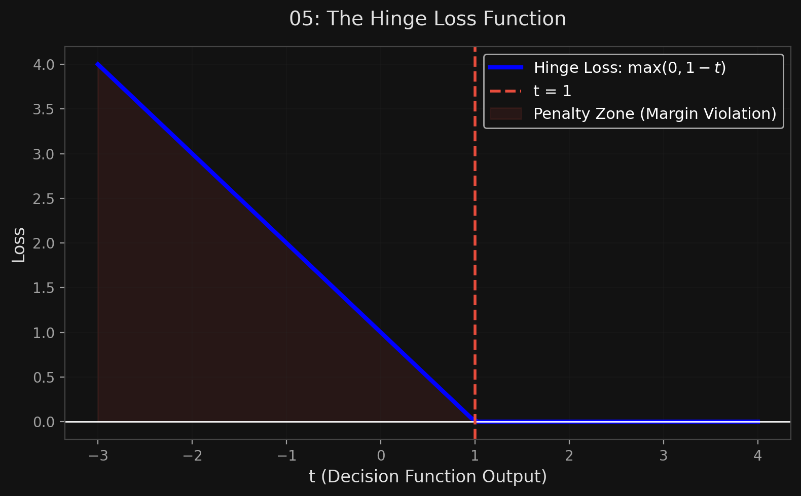

# 🏷️ Module 4: Under the Hood (Math & Optimization)
> **Ch. 5 — Hands-On ML with Scikit-Learn, Keras & TensorFlow (Aurélien Géron)**

---

## 📌 Table of Contents
1. [Start Here: The Big Picture](#big-picture)
2. [The Decision Function & Predictions](#concept-1)
3. [The Training Objective (Minimizing Weights)](#concept-2)
4. [Primal vs. Dual Problem](#concept-3)
5. [The Math behind the Kernel Trick](#concept-4)
6. [Hinge Loss & Online SVMs](#concept-5)
7. [Chapter 5 Exercises](#exercises)
8. [Interview Q&A](#interview)
9. [⚡ One-Page Flash Card](#revision)

---

## 🌍 Start Here: The Big Picture {#big-picture}

> **TL;DR:** To truly understand SVMs, you have to look at the math. An SVM makes predictions by computing $w^T x + b$. If it's positive, class 1; negative, class 0. To make the "street" as wide as possible, the optimization algorithm must **minimize the size of the weight vector $w$**. The magic of the Kernel Trick happens because we can swap the optimization problem into its "Dual" form, where we only ever need to calculate the *dot product* of two vectors, never the vectors themselves!

---

## 🔍 1. The Decision Function & Predictions {#concept-1}

*(Note: We drop $x_0 = 1$ here. The bias term is simply called $b$, and weights are $w$.)*

A linear SVM classifier predicts the class of a new instance $x$ by computing the decision function:
$$f(x) = w^T x + b = w_1 x_1 + \dots + w_n x_n + b$$

*   If $f(x) \ge 0 \rightarrow$ Predict Class 1
*   If $f(x) < 0 \rightarrow$ Predict Class 0

**Visualizing the Math:**
*   The **Decision Boundary** is the set of points where $f(x) = 0$. (This is a straight line, or hyperplane).
*   The edges of the street (the margins) are the points where $f(x) = 1$ and $f(x) = -1$. 
*   We want to make the distance between $f(x)=1$ and $f(x)=-1$ as large as possible.

---

## 🔍 2. The Training Objective (Minimizing Weights) {#concept-2}

Here is the most mind-bending part of SVMs: **The slope of the decision function is equal to the norm of the weight vector, $||w||$.**

*   If you divide the slope by 2, the points where $f(x) = \pm 1$ will be pushed *twice as far away* from the center boundary.
*   Therefore: **A smaller weight vector $w$ results in a larger margin!**

**Hard Margin Objective:**
We want to minimize $||w||$ to get a large margin. But we must also ensure that all positive instances score $\ge 1$ and all negative instances score $\le -1$. 

Mathematically, we minimize $\frac{1}{2} w^T w$ (which has a much cleaner derivative than $||w||$).
*   Minimize: $\frac{1}{2} w^T w$
*   Subject to: $t^{(i)}(w^T x^{(i)} + b) \ge 1$ for all instances (where $t=1$ for pos, $-1$ for neg).

**Soft Margin Objective:**
We introduce a *slack variable* $\zeta^{(i)} \ge 0$. This measures how much the $i$-th instance is allowed to violate the margin. 
*   We want to minimize the weights (make margin wide) AND minimize $\zeta$ (reduce violations).
*   We use hyperparameter **$C$** to trade off between them.
*   Minimize: $\frac{1}{2} w^T w + C \sum_{i=1}^m \zeta^{(i)}$

This is a convex quadratic optimization problem with linear constraints, known as **Quadratic Programming (QP)**.

---

## 🔍 3. Primal vs. Dual Problem {#concept-3}

Any constrained optimization problem (the *Primal* problem) can be expressed as a closely related *Dual* problem. 
*   Usually, solving the Dual just gives a lower bound. 
*   But for SVMs, the Dual gives the **exact same solution** as the Primal!

**Why do we care?**
1.  The Dual problem is faster to solve when the number of instances ($m$) is smaller than the number of features ($n$).
2.  More importantly: **The Dual problem makes the Kernel Trick possible!** The Primal does not.

---

## 🔍 4. The Math behind the Kernel Trick {#concept-4}

Let's say you apply a 2nd-degree polynomial mapping $\phi(x)$ to transform a 2D vector into 3D.
If you look at the Dual problem equation, it requires computing the dot product of every instance with every other instance: $\phi(a)^T \phi(b)$.

If you do the algebra, you discover something insane:
The dot product of the transformed 3D vectors is mathematically identical to the square of the dot product of the original 2D vectors!
$$\phi(a)^T \phi(b) = (a^T b)^2$$

**The Trick:** 
You NEVER need to transform the data using $\phi$. You just take the dot products of the original data and square them. 

**Common Kernels:**
*   **Linear:** $K(a,b) = a^T b$
*   **Polynomial:** $K(a,b) = (\gamma a^T b + r)^d$
*   **Gaussian RBF:** $K(a,b) = \exp(-\gamma ||a - b||^2)$

*(Mercer's Theorem states that as long as a function $K$ respects certain conditions, you can use it as a kernel, and you are guaranteed that some mapping $\phi$ exists, even if you have no idea what it is!)*

---

## 🔍 5. Hinge Loss & Online SVMs {#concept-5}

We can also train linear SVMs using standard Gradient Descent (this is what `SGDClassifier` does).
To do this, we minimize a cost function that uses the **Hinge Loss**.

**Hinge Loss Function:** $\max(0, 1 - t)$
*   If $t \ge 1$ (point is safely off the street), the loss is $0$.
*   If $t < 1$ (point is in the street or wrong side), the loss increases linearly.


> 📊 **Graph 05:** The Hinge Loss Function

---

## 🔍 6. Chapter 5 Exercises {#exercises}

| # | Question | Answer |
|---|---|---|
| 1 | Fundamental idea behind SVMs? | Fit the widest possible "street" between classes (large margin classification), avoiding or limiting margin violations. |
| 2 | What is a support vector? | An instance located exactly on the boundary of the street, or inside it. They fully define the model. Deleting non-support vectors does nothing. |
| 4 | Can SVMs output confidence scores / probabilities? | Yes, distance from the boundary is a confidence score. But they do NOT naturally output probabilities (0 to 1). You must use Platt scaling (set `probability=True`), which uses cross-validation. |
| 5 | Primal or Dual for millions of instances / hundreds of features? | Use the **Primal** form (e.g., `LinearSVC`). The Dual form scales as $O(m^2)$ or $O(m^3)$, so millions of instances will crash it. |
| 6 | RBF kernel underfitting. Adjust Gamma/C? | Underfitting = too much regularization. To fix, **increase Gamma** (narrows the bell, making boundary wiggly) and **increase C** (imposes strict penalties on violations). |

---

## 🎤 Interview Q&A {#interview}

**Q1: How does minimizing the weight vector $w$ maximize the margin in an SVM?**
> **A:**
> The decision boundary is the plane where $w^T x + b = 0$. The margins are defined as the planes where $w^T x + b = 1$ and $-1$. The geometric distance between the $0$ plane and the $1$ plane is exactly $\frac{1}{||w||}$. Therefore, to maximize this distance (the margin), the optimization algorithm must minimize $||w||$. 

**Q2: Why can we use the Kernel Trick in the Dual formulation of the SVM problem, but not the Primal?**
> **A:**
> If you look at the math of the Primal problem, the optimization involves the actual mapped feature vectors $\phi(x)$ directly. If $\phi(x)$ maps to infinite dimensions (like the RBF kernel does), it's impossible to compute. However, when we mathematically convert the problem to its Dual form, the feature vectors only ever appear inside a **dot product** with each other: $\phi(x^{(i)})^T \phi(x^{(j)})$. The Kernel Trick allows us to replace that entire dot product with a simple kernel function $K(x^{(i)}, x^{(j)})$ computed on the original low-dimensional data, entirely bypassing the need to compute $\phi$.

---

## ⚡ One-Page Flash Card {#revision}

```
╔══════════════════════════════════════════════════════════════════╗
║  MODULE 4 FLASH CARD — SVM Math & The Kernel Trick               ║
╠══════════════════════════════════════════════════════════════════╣
║  THE DECISION FUNCTION:                                          ║
║  f(x) = w^T * x + b.  If >= 0, Class 1. If < 0, Class 0.         ║
║  Margins are exactly where f(x) = 1 and f(x) = -1.               ║
║                                                                  ║
║  THE OBJECTIVE:                                                  ║
║  Margin width is inversely proportional to ||w||.                ║
║  To maximize the street, we MINIMIZE the weights (1/2 w^T w).    ║
║                                                                  ║
║  PRIMAL VS DUAL:                                                 ║
║  - Primal: Scales with features. Cannot use kernels.             ║
║  - Dual: Scales with instances squared. Allows Kernel Trick!     ║
║                                                                  ║
║  THE KERNEL TRICK:                                               ║
║  In the dual eq, instances only appear as dot products.          ║
║  We replace dot(phi(a), phi(b)) with a Kernel function K(a,b).   ║
║  This computes the answer without ever mapping to high dims!     ║
╚══════════════════════════════════════════════════════════════════╝
```

---

**🔗 Previous Module →** [03_SVM_Regression.md](03_SVM_Regression.md)
