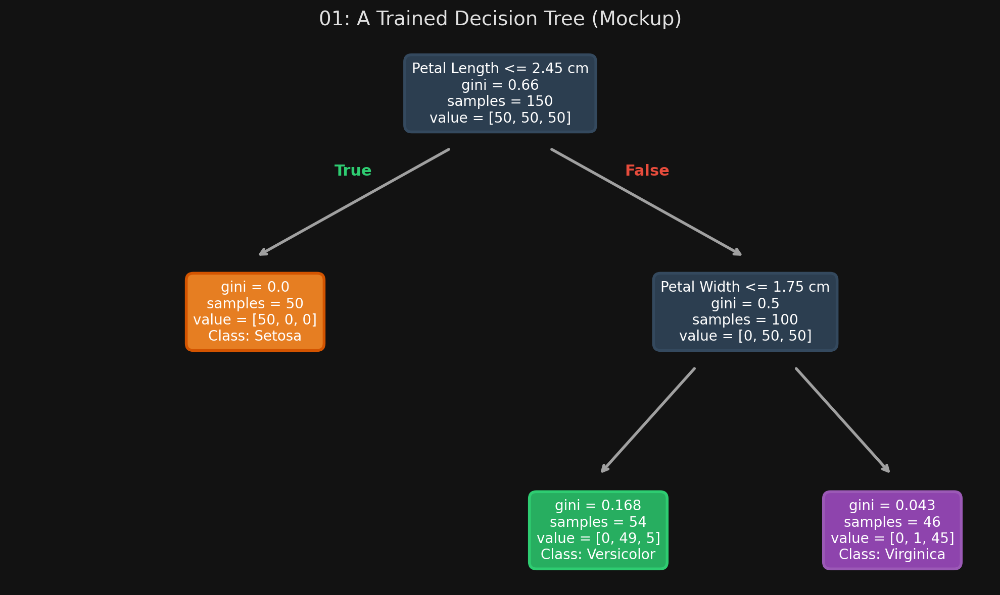

# 🏷️ Module 1: Training, Predictions & Gini Impurity
> **Ch. 6 — Hands-On ML with Scikit-Learn, Keras & TensorFlow (Aurélien Géron)**

---

## 📌 Table of Contents
1. [Start Here: The Big Picture](#big-picture)
2. [Training and Visualizing a Tree](#concept-1)
3. [Making Predictions (How to traverse the tree)](#concept-2)
4. [Gini Impurity & Entropy](#concept-3)
5. [White Box vs Black Box Models](#concept-4)
6. [Common Beginner Mistakes](#mistakes)
7. [Interview Q&A](#interview)
8. [⚡ One-Page Flash Card](#revision)

---

## 🌍 Start Here: The Big Picture {#big-picture}

> **TL;DR:** Decision Trees are versatile algorithms that can perform classification, regression, and multioutput tasks. They work by asking a sequence of simple yes/no questions about the data's features, splitting the data into increasingly "pure" subsets. They are incredibly powerful, require almost zero data prep (no scaling needed!), and are easy to interpret. They are also the fundamental building blocks of Random Forests.

---

## 🔍 1. Training and Visualizing a Tree {#concept-1}

To train a Decision Tree, we just use `DecisionTreeClassifier`. 

```python
from sklearn.datasets import load_iris
from sklearn.tree import DecisionTreeClassifier

iris = load_iris()
X = iris.data[:, 2:] # petal length and width
y = iris.target

# max_depth restricts the tree from growing infinitely and overfitting
tree_clf = DecisionTreeClassifier(max_depth=2)
tree_clf.fit(X, y)
```

**Visualizing the Tree:**
You can output a `.dot` graph file using `export_graphviz()` and convert it to a PNG image using the `dot` command-line tool.

```python
from sklearn.tree import export_graphviz
export_graphviz(tree_clf, out_file="iris_tree.dot", 
                feature_names=iris.feature_names[2:], class_names=iris.target_names, 
                rounded=True, filled=True)
# Terminal: dot -Tpng iris_tree.dot -o iris_tree.png
```


> 📊 **Graph 01:** A Trained Decision Tree

---

## 🔍 2. Making Predictions {#concept-2}

Traversing a Decision Tree is perfectly intuitive. 

1.  **Start at the Root Node (Depth 0):** The node asks a question, e.g., "Is petal length $\le$ 2.45 cm?"
2.  **Move down:** If True, go left. If False, go right.
3.  **Leaf Node:** Once you hit a node that doesn't ask a question (a leaf node), you stop. The predicted class is simply the class that is most frequent in that leaf node.

**Estimating Class Probabilities:**
A Decision Tree can output probabilities! It simply returns the ratio of training instances of each class in the final leaf node.
*   If a leaf has 0 *Setosa*, 49 *Versicolor*, and 5 *Virginica* instances (Total 54).
*   The probability for *Versicolor* is $49/54 = 90.7\%$.
*   `predict_proba()` outputs: `[0.0, 0.907, 0.093]`

> [!TIP]
> **No Scaling Required:** Decision Trees do not care about the scale of the data. You do not need to center or scale features (no `StandardScaler` needed).

---

## 🔍 3. Gini Impurity & Entropy {#concept-3}

How does the tree know if a node is "good"? It uses an impurity metric.
A node is considered "pure" (impurity = 0) if all training instances inside it belong to the exact same class.

**Equation 1: Gini Impurity (Scikit-Learn Default)**
$$G_i = 1 - \sum_{k=1}^n p_{i,k}^2$$
*   $p_{i,k}$ is the ratio of class $k$ instances among all instances in the $i^{th}$ node.
*   Example: If a node has 49 *Versicolor* and 5 *Virginica* (54 total):
*   $G = 1 - (0/54)^2 - (49/54)^2 - (5/54)^2 \approx 0.168$

**Equation 2: Entropy**
$$H_i = - \sum_{k=1, p \neq 0}^n p_{i,k} \log_2(p_{i,k})$$
*   Originates from thermodynamics (molecular disorder) and information theory. Entropy is zero when a set contains instances of only one class.

**Which one should you use?**
*   They lead to very similar trees 99% of the time.
*   Gini is slightly faster to compute (it's the default).
*   When they differ: Gini tends to isolate the most frequent class in its own branch, while Entropy tends to produce slightly more balanced trees.

---

## 🔍 4. White Box vs Black Box Models {#concept-4}

*   **White Box Models:** (Like Decision Trees and Linear Regression). The decisions they make are entirely interpretable. You can look at the exact path a tree took and say perfectly why it made a specific prediction (e.g., "Because petal length was < 2.45").
*   **Black Box Models:** (Like Random Forests and Neural Networks). They perform much better, but they are unexplainable. If a Neural Network classifies an image as a dog, you cannot easily know *why*. Was it the ears? The fur? The background grass?

---

## ❌ Common Beginner Mistakes {#mistakes}

**1. "Applying StandardScaler before training a Decision Tree"** ❌
> It's not necessarily an "error" that will crash your code, but it is completely unnecessary. Decision Trees split nodes based on strict threshold values (e.g., $x \le 5.4$). Scaling the feature to $z \le 0.2$ changes the number, but does absolutely nothing to the tree's structure or performance.

**2. "Assuming `predict_proba` gives a unique probability for every instance"** ❌
> The estimated probabilities are identical anywhere inside the same leaf node's region. If a flower falls into the bottom-right rectangle of the decision space, it gets the exact same probability score, whether it is barely inside the boundary or miles deep into the corner.

---

## 🎤 Interview Q&A {#interview}

**Q1: What is the difference between Gini Impurity and Entropy in Decision Trees?**
> **A:**
> Both are metrics used to measure how "mixed" or impure a node is (with 0 meaning the node contains only one class). Gini Impurity computes the probability of a random sample being misclassified if it were randomly labeled according to the distribution in the node. Entropy comes from information theory and measures the average information content or disorder. Practically, they yield very similar trees, but Gini is slightly faster to compute, while Entropy sometimes produces slightly more balanced trees.

**Q2: Are Decision Trees considered Parametric or Non-parametric models? Why?**
> **A:**
> Decision Trees are **Non-parametric models**. This doesn't mean they don't have parameters; it means the number of parameters (the size and shape of the tree) is not determined prior to training. The model is free to grow and stick closely to the data. In contrast, Linear Regression is a parametric model because it has a fixed, predetermined number of parameters (weights) regardless of how much data you feed it.

---

## ⚡ One-Page Flash Card {#revision}

```
╔══════════════════════════════════════════════════════════════════╗
║  MODULE 1 FLASH CARD — Training & Predictions                    ║
╠══════════════════════════════════════════════════════════════════╣
║  CORE CONCEPT:                                                   ║
║  Splits data using yes/no questions to create pure subsets.      ║
║  No feature scaling required! White box (highly interpretable).  ║
║                                                                  ║
║  PREDICTIONS & PROBABILITIES:                                    ║
║  - Follow the tree from root to leaf based on thresholds.        ║
║  - Predicts the most frequent class in that leaf.                ║
║  - Probability = ratio of that class in the leaf.                ║
║                                                                  ║
║  IMPURITY METRICS:                                               ║
║  - Goal: Minimize impurity at every split.                       ║
║  - Gini Impurity (Default): Fast.                                ║
║  - Entropy: Slightly slower, sometimes more balanced trees.      ║
║  - 0 Impurity = Node is 100% one class.                          ║
╚══════════════════════════════════════════════════════════════════╝
```

---

**🔗 Next Module →** [02_CART_Algorithm_and_Regularization.md](02_CART_Algorithm_and_Regularization.md)
