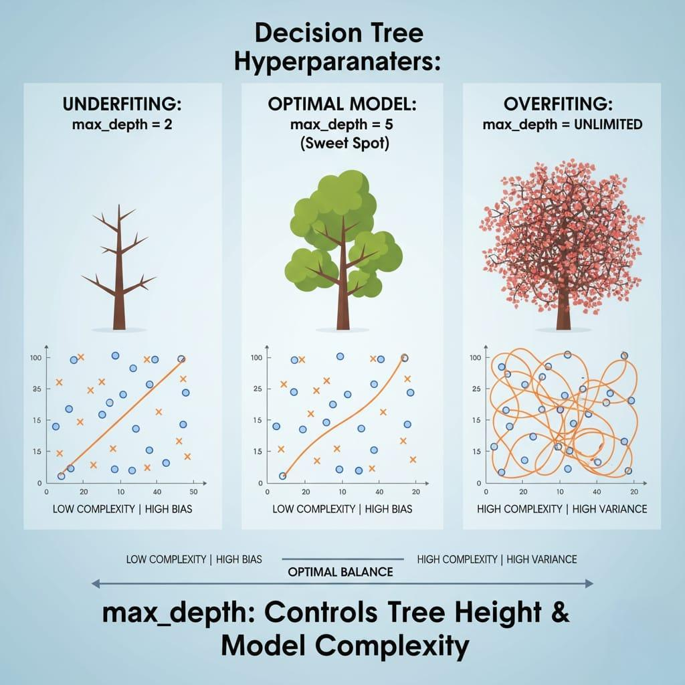
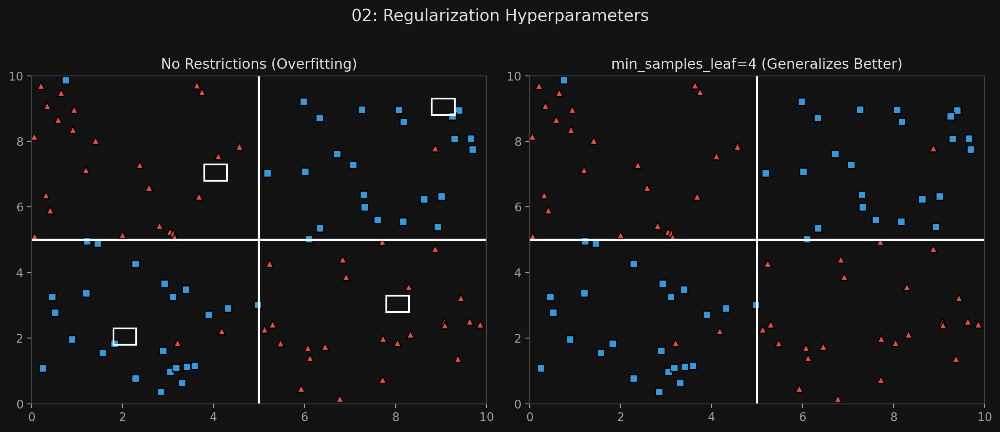

# 🏷️ Module 2: The CART Algorithm & Regularization
> **Ch. 6 — Hands-On ML with Scikit-Learn, Keras & TensorFlow (Aurélien Géron)**

---

## 📌 Table of Contents
1. [Start Here: The Big Picture](#big-picture)
2. [The CART Algorithm (How it splits)](#concept-1)
3. [The Greedy Nature of CART](#concept-2)
4. [Computational Complexity](#concept-3)
5. [Regularization Hyperparameters](#concept-4)
6. [Common Beginner Mistakes](#mistakes)
7. [Interview Q&A](#interview)
8. [⚡ One-Page Flash Card](#revision)

---

## 🌍 Start Here: The Big Picture {#big-picture}

> **TL;DR:** Scikit-Learn trains trees using the **CART** algorithm. It works by finding the single feature and threshold that splits the data into the purest possible halves, and then it repeats this recursively down the tree. Because Decision Trees make zero assumptions about the data, they will grow infinitely and completely overfit the training set if you don't stop them. We use **Regularization Hyperparameters** (like limiting max depth or requiring a minimum number of samples per leaf) to constrain the tree and force it to generalize.

---

## 🔍 1. The CART Algorithm {#concept-1}

Scikit-Learn uses the **Classification and Regression Tree (CART)** algorithm.
*(Note: CART produces ONLY binary trees. Every node has exactly two children: Yes or No).*

**How it works:**
1.  It searches for a single feature $k$ and a threshold $t_k$ (e.g., "petal length $\le$ 2.45") that produces the purest subsets (weighted by their size).
2.  It uses the cost function below to find this optimal split.
3.  Once the top is split, it splits the subsets using the exact same logic, recursively.
4.  It stops recursing once it reaches `max_depth`, or if it cannot find a split that reduces impurity.

**The Cost Function for Classification:**
$$J(k, t_k) = \frac{m_{\text{left}}}{m} G_{\text{left}} + \frac{m_{\text{right}}}{m} G_{\text{right}}$$
*   $G$ is the Gini impurity of the subset.
*   $m$ is the number of instances in the subset.
*   *Translation:* Minimize the impurity of the left and right sides, but give more weight to whichever side has more instances.

---

## 🔍 2. The Greedy Nature of CART {#concept-2}

CART is a **Greedy Algorithm**. 
*   It searches for the optimum split at the *current* level, without caring about the future.
*   It does NOT check whether this split will lead to the absolute lowest possible impurity several levels down.

**Why greedy?**
Finding the globally optimal tree is an **NP-Complete** problem. It requires $O(\exp(m))$ time, making it mathematically impossible to solve even for small datasets. We must settle for a "reasonably good" greedy solution.

---

## 🔍 3. Computational Complexity {#concept-3}

**Making Predictions:** Very Fast
*   Requires traversing from root to leaf.
*   Complexity: $O(\log_2(m))$
*   Independent of the number of features!

**Training the Tree:**
*   The algorithm compares all features on all samples at each node.
*   Complexity: $O(n \times m \log_2(m))$
*   *Trick for tiny datasets:* Scikit-Learn can speed up training on small sets (< a few thousand) by sorting the data (`presort=True`). But this drastically slows down large datasets.

---

## 🔍 4. Regularization Hyperparameters {#concept-4}

A non-parametric model (like a Decision Tree) has no predefined shape. If left unconstrained, the tree will grow until every single leaf contains exactly 1 instance, perfectly memorizing the training data (**extreme overfitting**).



To avoid this, we **Regularize** the tree by restricting its freedom.

**Key Scikit-Learn Hyperparameters:**
*   `max_depth`: The maximum depth of the tree (Default is None. You should almost always reduce this).
*   `min_samples_split`: Minimum instances a node must have before it is allowed to split.
*   `min_samples_leaf`: Minimum instances a leaf node must have to exist.
*   `max_leaf_nodes`: Maximum total number of leaf nodes.
*   `max_features`: Maximum features evaluated for splitting at each node.

> [!TIP]
> **Rule of Thumb:** Increasing `min_*` hyperparameters or reducing `max_*` hyperparameters will increase regularization and prevent overfitting.


> 📊 **Graph 02:** Unregularized vs Regularized Tree (min_samples_leaf)

---

## ❌ Common Beginner Mistakes {#mistakes}

**1. "Setting `presort=True` on a dataset with 500,000 rows to make it train faster"** ❌
> `presort=True` only speeds up training for extremely small datasets (under a few thousand instances). If you use it on a large dataset, sorting the data at every single node split will slow down the algorithm exponentially. 

**2. "Leaving the hyperparameters to their defaults"** ❌
> The default `max_depth` in Scikit-Learn is `None`. This means the tree will grow infinitely until every leaf is perfectly pure. This is a guarantee that the model will overfit the training data and fail on the test data. Always set regularization parameters like `max_depth` or `min_samples_leaf`.

---

## 🎤 Interview Q&A {#interview}

**Q1: Why does the CART algorithm use a "Greedy" approach instead of finding the perfect tree?**
> **A:**
> Finding the absolute optimal, perfectly balanced Decision Tree that minimizes impurity globally is an NP-Complete problem. The time complexity to solve it is $O(\exp(m))$, meaning the universe would end before a computer could find the perfect tree for even a moderately sized dataset. The greedy approach (optimizing the best split right now at this specific node) finds a "reasonably good" solution in polynomial time.

**Q2: You've trained a Decision Tree and the training accuracy is 100%, but the test accuracy is 60%. What is happening and how do you fix it?**
> **A:**
> The model is severely overfitting. Because it is a non-parametric model, it has perfectly memorized the training data by creating a very deep, complex tree. To fix it, you must apply regularization. You can decrease the `max_depth` hyperparameter, or increase the `min_samples_leaf` hyperparameter to force the tree to stop growing earlier and generalize better.

---

## ⚡ One-Page Flash Card {#revision}

```
╔══════════════════════════════════════════════════════════════════╗
║  MODULE 2 FLASH CARD — CART Algorithm & Regularization           ║
╠══════════════════════════════════════════════════════════════════╣
║  THE CART ALGORITHM:                                             ║
║  - Scikit-Learn's algorithm. Creates purely binary trees.        ║
║  - Greedy: Finds the best split for the current node, ignoring   ║
║    how it might affect nodes further down.                       ║
║  - Cost function: Minimizes weighted impurity of left/right.     ║
║                                                                  ║
║  COMPLEXITY:                                                     ║
║  - Predictions: O(log2(m)). Lightning fast.                      ║
║  - Training: O(n * m * log2(m)).                                 ║
║                                                                  ║
║  REGULARIZATION (Preventing Overfitting):                        ║
║  - Trees are non-parametric; they will overfit if unconstrained. ║
║  - Decrease max_* params (max_depth, max_leaf_nodes)             ║
║  - Increase min_* params (min_samples_split, min_samples_leaf)   ║
╚══════════════════════════════════════════════════════════════════╝
```

---

**🔗 Previous Module →** [01_Training_and_Predictions.md](01_Training_and_Predictions.md)  
**🔗 Next Module →** [03_Regression_Trees.md](03_Regression_Trees.md)
