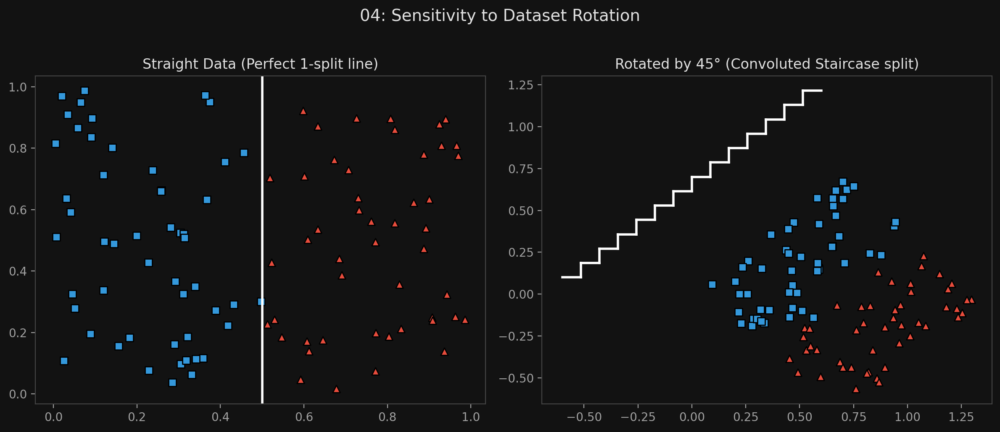
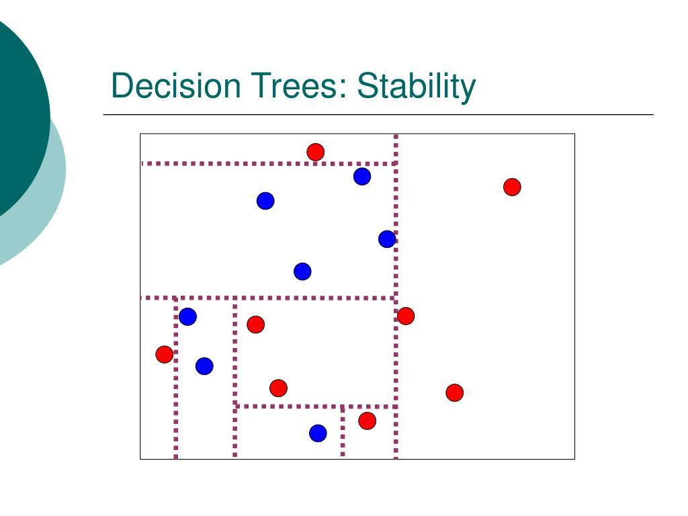

# 🏷️ Module 4: Limitations and Instability
> **Ch. 6 — Hands-On ML with Scikit-Learn, Keras & TensorFlow (Aurélien Géron)**

---

## 📌 Table of Contents
1. [Start Here: The Big Picture](#big-picture)
2. [Sensitivity to Dataset Rotation](#concept-1)
3. [Extreme Sensitivity to Small Variations](#concept-2)
4. [Chapter 6 Exercises](#exercises)
5. [Common Beginner Mistakes](#mistakes)
6. [Interview Q&A](#interview)
7. [⚡ One-Page Flash Card](#revision)

---

## 🌍 Start Here: The Big Picture {#big-picture}

> **TL;DR:** Decision Trees have a lot going for them: they are highly interpretable, require almost zero data preparation, and are very fast. However, they have a massive flaw: **Instability**. Because they split the data using strict horizontal and vertical lines, rotating the data by just 45 degrees ruins the model. Furthermore, changing or removing just a single data point can cause the tree to generate a completely different structure. This fatal flaw is exactly why we invented Random Forests!

---

## 🔍 1. Sensitivity to Dataset Rotation {#concept-1}

Decision Trees love **orthogonal decision boundaries** (all splits are perfectly perpendicular to an axis; e.g., either perfectly horizontal or vertical).

*   **Scenario A:** You have a linearly separable dataset split down the middle vertically. The Decision Tree easily splits it with a single rule: $x_1 \le 0$. (Perfect generalization).
*   **Scenario B:** You take that exact same data and rotate it by 45 degrees. The Decision Tree can no longer draw a single diagonal line. Instead, it must build a massive, convoluted staircase of horizontal and vertical splits to approximate the diagonal line.
*   **The Result:** The rotated model perfectly fits the training set, but it is highly unlikely to generalize well to new data.

**The Fix:**
One way to limit this problem is to use **Principal Component Analysis (PCA)** before training the tree, which often rotates the data into a better orientation automatically.


> 📊 **Graph 04:** Sensitivity to Dataset Rotation

---

## 🔍 2. Extreme Sensitivity to Small Variations {#concept-2}

More generally, the main issue with Decision Trees is that they are incredibly sensitive to tiny, seemingly insignificant variations in the training data.

*   If you take the Iris dataset, train a tree, and look at the graph.
*   Then, you simply **remove the single widest Iris versicolor** flower from the dataset and train again.
*   The entire structure of the tree might completely change. The root node might change, the depths might change, and the decision boundaries will look totally different.

**The Stochastic Nature of Scikit-Learn's Algorithm:**
Actually, even if you don't remove any data at all, you might get a different tree! Scikit-Learn's CART training algorithm is stochastic (it randomly selects the set of features to evaluate at each node).
*   Unless you set the `random_state` hyperparameter, training the exact same code twice will yield two different models.



**The Ultimate Fix (Preview to Chapter 7):**
**Random Forests** solve this instability problem. By training hundreds of slightly different trees and averaging their predictions together, the random errors and instabilities cancel out, leaving a highly robust and powerful model.

---

## 🔍 3. Chapter 6 Exercises {#exercises}

| # | Question | Answer |
|---|---|---|
| 1 | Approximate depth of a tree trained on 1 million instances? | Unrestricted, the tree will grow until leaves have 1 instance. If balanced, depth is $\approx \log_2(1,000,000) \approx 20$. In reality, usually slightly deeper because it's rarely perfectly balanced. |
| 2 | Is a node's Gini impurity lower or greater than its parent's? | It is *generally* lower. The cost function guarantees that the *weighted sum* of the children's impurity is lower. However, one child can have higher impurity if the other child is very large and extremely pure. |
| 3 | Overfitting $\rightarrow$ decrease max_depth? | **Yes.** Reducing `max_depth` regularizes the tree. |
| 4 | Underfitting $\rightarrow$ scale input features? | **No.** Decision Trees don't care about feature scaling. To fix underfitting, increase max depth or decrease min_* parameters. |
| 5 | Training time from 1 million to 10 million instances? | Time complexity is $O(n \times m \log(m))$. So $K = (10m \times \log(10m)) / (1m \times \log(1m)) \approx 11.7$ hours. |
| 6 | `presort=True` on 100,000 instances to speed up training? | **No.** Presorting slows down training dramatically for datasets larger than a few thousand instances. |

---

## ❌ Common Beginner Mistakes {#mistakes}

**1. "Using a single Decision Tree for a mission-critical production deployment"** ❌
> Because of their extreme sensitivity to noise, rotation, and minor variations, a single unconstrained Decision Tree is rarely used in high-stakes production environments. They are almost always deployed as an ensemble (like a Random Forest or Gradient Boosted Tree) to stabilize the predictions.

**2. "Assuming the tree found the absolute best possible splits"** ❌
> Remember that CART is a *greedy* algorithm. It finds the best split for the *current* node, but it might miss a mediocre split that leads to an incredibly perfect split three levels down. The tree is "good enough", but mathematically not perfect.

---

## 🎤 Interview Q&A {#interview}

**Q1: Why are Decision Trees sensitive to the rotation of the dataset?**
> **A:**
> Decision Trees operate by evaluating one feature at a time against a threshold ($x \le \text{val}$). Geometrically, this means every single split they make must be perfectly perpendicular (orthogonal) to one of the feature axes. They cannot draw diagonal lines. If a dataset is best separated by a diagonal line, the tree is forced to approximate it by drawing dozens of tiny horizontal and vertical stair-steps, leading to an overcomplicated model that fails to generalize.

**Q2: What is the main structural weakness of a single Decision Tree, and how does the industry solve it?**
> **A:**
> The main structural weakness is extreme instability (high variance). Changing a single data point, or just changing the random seed, can cause the algorithm to build a completely different tree structure. The industry solves this by using Ensemble Learning — specifically Random Forests or Gradient Boosted Trees — which combine hundreds of trees to average out their individual instabilities, yielding a highly robust final model.

---

## ⚡ One-Page Flash Card {#revision}

```
╔══════════════════════════════════════════════════════════════════╗
║  MODULE 4 FLASH CARD — Limitations & Instability                 ║
╠══════════════════════════════════════════════════════════════════╣
║  SENSITIVITY TO ROTATION:                                        ║
║  - Trees can ONLY draw horizontal and vertical lines.            ║
║  - If data is diagonal, tree draws a convoluted staircase.       ║
║  - Fix: PCA (rotates data before training).                      ║
║                                                                  ║
║  SENSITIVITY TO MINOR VARIATIONS (High Variance):                ║
║  - Deleting/adding 1 data point can change the entire tree.      ║
║  - Scikit-Learn's CART is stochastic (random feature selection). ║
║  - Fix: Set random_state for reproducibility.                    ║
║                                                                  ║
║  THE ULTIMATE FIX:                                               ║
║  - A single tree is too unstable for most production uses.       ║
║  - Use Random Forests (averaging many trees together).           ║
╚══════════════════════════════════════════════════════════════════╝
```

---

**🔗 Previous Module →** [03_Regression_Trees.md](03_Regression_Trees.md)
