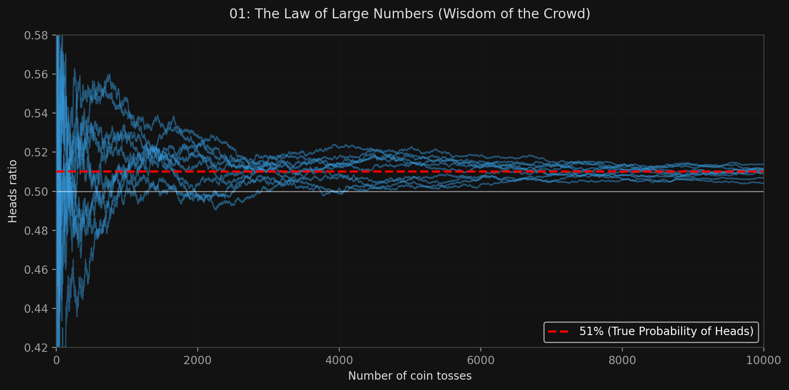

# 🏷️ Module 1: Voting Classifiers
> **Ch. 7 — Hands-On ML with Scikit-Learn, Keras & TensorFlow (Aurélien Géron)**

---

## 📌 Table of Contents
1. [Start Here: The Big Picture](#big-picture)
2. [The Law of Large Numbers (Why Ensembles Work)](#concept-1)
3. [Hard Voting vs. Soft Voting](#concept-2)
4. [The Importance of Independence](#concept-3)
5. [Common Beginner Mistakes](#mistakes)
6. [Interview Q&A](#interview)
7. [⚡ One-Page Flash Card](#revision)

---

## 🌍 Start Here: The Big Picture {#big-picture}

> **TL;DR:** If you ask a complex question to thousands of random people and aggregate their answers, the collective answer is often better than a single expert's answer. This is called the "Wisdom of the Crowd." In Machine Learning, if you aggregate the predictions of a group of different models (an **ensemble**), you will often get a higher accuracy than the best individual model in the group. The simplest way to do this is with a **Voting Classifier**.

---

## 🔍 1. The Law of Large Numbers (Why Ensembles Work) {#concept-1}

How can combining 1,000 weak models (that each only have 51% accuracy) result in a strong ensemble with 75% accuracy?

**The Coin Toss Analogy:**
Imagine you have a slightly biased coin that lands on Heads 51% of the time. 
*   If you toss it 10 times, anything could happen.
*   But if you toss it 1,000 times, you will get roughly 510 heads and 490 tails.
*   Mathematically, the probability of obtaining a majority of heads after 1,000 tosses is close to 75%. With 10,000 tosses, it climbs over 97%.
*   This is the **Law of Large Numbers**. 

In ML, if you have 1,000 classifiers that are individually correct only 51% of the time (barely better than random guessing), predicting the majority voted class can yield up to 75% accuracy!


> 📊 **Graph 01:** The Law of Large Numbers in action

---

## 🔍 2. Hard Voting vs. Soft Voting {#concept-2}

There are two ways for an ensemble to cast their votes:

**1. Hard Voting:**
*   Each classifier makes a rigid, definitive prediction (e.g., "I predict Class A").
*   The ensemble simply counts the votes and predicts the class that got the **majority vote**.
*   It treats a classifier that is 51% confident exactly the same as a classifier that is 99% confident.

**2. Soft Voting:**
*   If all classifiers can estimate probabilities (i.e., they have a `predict_proba()` method), the ensemble can compute the **average probability** across all models for each class.
*   It predicts the class with the highest average probability.
*   Soft voting almost always achieves **higher performance** than hard voting because it gives more weight to highly confident models.

**Scikit-Learn Implementation:**
```python
from sklearn.ensemble import VotingClassifier
from sklearn.linear_model import LogisticRegression
from sklearn.ensemble import RandomForestClassifier
from sklearn.svm import SVC

log_clf = LogisticRegression()
rnd_clf = RandomForestClassifier()
# Note: SVC does not output probabilities by default. You MUST set probability=True for soft voting.
svm_clf = SVC(probability=True) 

voting_clf = VotingClassifier(
    estimators=[('lr', log_clf), ('rf', rnd_clf), ('svc', svm_clf)],
    voting='soft' # Change to 'hard' for hard voting
)

voting_clf.fit(X_train, y_train)
```

---

## 🔍 3. The Importance of Independence {#concept-3}

The Law of Large Numbers (and Ensemble learning in general) comes with a massive mathematical caveat: **It only works if the models are perfectly independent, making uncorrelated errors.**

*   If all your models are trained on the exact same data using the exact same algorithm, they will make the exact same mistakes.
*   If 1,000 models all vote for the wrong class because they share the same bias, the ensemble will still be wrong.

**How to get independent models:**
One way to force models to be independent and make different types of errors is to train them using **very different algorithms** (e.g., combining an SVM, a Random Forest, and a Logistic Regression model).

---

## ❌ Common Beginner Mistakes {#mistakes}

**1. "Using Hard Voting when all your models support predict_proba"** ❌
> If your models output probabilities, you are throwing away incredibly valuable information by using Hard Voting. A model that is 99.9% certain should override a model that is 50.1% certain. Always switch to `voting='soft'` if your estimators support it.

**2. "Forgetting to set `probability=True` on SVC when using Soft Voting"** ❌
> The `SVC` class in Scikit-Learn does not output probabilities by default (because it relies on distance margins, not probability curves). If you put an `SVC` in a `VotingClassifier` with `voting='soft'`, the code will crash. You must initialize it with `SVC(probability=True)`.

---

## 🎤 Interview Q&A {#interview}

**Q1: Explain how a Voting Classifier works and the difference between Hard and Soft voting.**
> **A:**
> A voting classifier aggregates the predictions of multiple distinct models. In **Hard Voting**, each model casts exactly one vote for a class, and the ensemble outputs the majority vote. In **Soft Voting**, the ensemble averages out the predicted probabilities of each class across all models, and outputs the class with the highest average probability. Soft voting generally yields higher accuracy because it accounts for the confidence level of each model.

**Q2: If you train 5 perfectly identical Random Forest models on the exact same dataset with the exact same hyperparameters and random seeds, will a Voting Classifier improve their accuracy?**
> **A:**
> No, it will have zero effect. The mathematical magic of ensemble learning requires the models to make **uncorrelated errors**. If the models are perfectly identical, they will all make the exact same incorrect predictions at the exact same time. To benefit from an ensemble, you need diversity (e.g., using different algorithms, or training them on different subsets of data).

---

## ⚡ One-Page Flash Card {#revision}

```
╔══════════════════════════════════════════════════════════════════╗
║  MODULE 1 FLASH CARD — Voting Classifiers                        ║
╠══════════════════════════════════════════════════════════════════╣
║  CORE CONCEPT:                                                   ║
║  Wisdom of the crowd. Combining multiple models yields higher    ║
║  accuracy than the best individual model (Law of Large Numbers). ║
║                                                                  ║
║  HARD VOTING vs SOFT VOTING:                                     ║
║  - Hard: Majority rules. Treats all votes equally.               ║
║  - Soft: Averages the probabilities. Highly confident models     ║
║    have more influence. Always preferred if supported!           ║
║                                                                  ║
║  THE GOLDEN RULE OF ENSEMBLES:                                   ║
║  The models MUST be diverse and make uncorrelated errors!        ║
║  Achieve this by using completely different algorithms (SVM vs   ║
║  Trees vs Logistic Regression).                                  ║
╚══════════════════════════════════════════════════════════════════╝
```

---

**🔗 Next Module →** [02_Bagging_and_Pasting.md](02_Bagging_and_Pasting.md)
