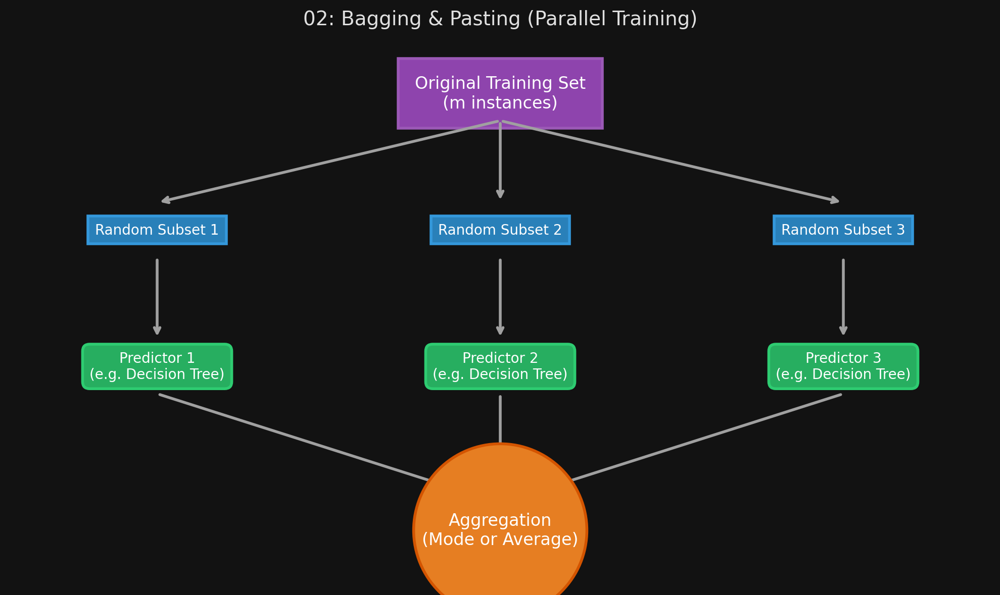

# 🏷️ Module 2: Bagging and Pasting
> **Ch. 7 — Hands-On ML with Scikit-Learn, Keras & TensorFlow (Aurélien Géron)**

---

## 📌 Table of Contents
1. [Start Here: The Big Picture](#big-picture)
2. [Bagging vs. Pasting (Bootstrapping)](#concept-1)
3. [Out-of-Bag (OOB) Evaluation](#concept-2)
4. [Random Patches and Random Subspaces](#concept-3)
5. [Common Beginner Mistakes](#mistakes)
6. [Interview Q&A](#interview)
7. [⚡ One-Page Flash Card](#revision)

---

## 🌍 Start Here: The Big Picture {#big-picture}

> **TL;DR:** In Module 1, we got diverse models by using different algorithms (SVM vs Trees). Another way to get diverse models is to use the exact same algorithm for every predictor, but train them on **different random subsets** of the training data. If we sample the data *with* replacement, it's called **Bagging**. If we sample *without* replacement, it's called **Pasting**. The ensemble combines their predictions, resulting in a model with the same bias but dramatically lower variance (less overfitting).

---

## 🔍 1. Bagging vs. Pasting (Bootstrapping) {#concept-1}

Both bagging and pasting allow training instances to be sampled several times across multiple predictors. 
*   **Bagging (Bootstrap Aggregating):** Sampling is performed *with replacement*. This means a single predictor might see the same training instance 5 times, while missing other instances completely.
*   **Pasting:** Sampling is performed *without replacement*. A predictor can only see an instance once.

**Why is Bagging better?**
Bootstrapping (sampling with replacement) introduces a bit more diversity into the subsets. This extra diversity means the predictors end up being less correlated with each other. This reduces the variance of the overall ensemble. Bagging generally results in better models and is the industry default.

**Scikit-Learn Implementation:**
```python
from sklearn.ensemble import BaggingClassifier
from sklearn.tree import DecisionTreeClassifier

# n_jobs=-1 tells Scikit-Learn to use all available CPU cores!
bag_clf = BaggingClassifier(
    DecisionTreeClassifier(), n_estimators=500,
    max_samples=100, bootstrap=True, n_jobs=-1 
)
# Note: set bootstrap=False to use Pasting instead of Bagging

bag_clf.fit(X_train, y_train)
```


> 📊 **Graph 02:** Parallel training of predictors on random subsets

---

## 🔍 2. Out-of-Bag (OOB) Evaluation {#concept-2}

Because bagging samples *with replacement*, some instances are picked multiple times, and some are never picked at all.
*   Mathematically, if you sample $m$ instances with replacement from a training set of size $m$, roughly **63%** of the instances are sampled.
*   The remaining **37%** of the training instances are NEVER seen by that specific predictor during training. These are called **Out-of-Bag (oob)** instances.

**The Magic Trick:**
Since a predictor never saw its oob instances during training, we can evaluate its accuracy on those exact instances! You don't even need a separate validation set. The ensemble's overall score is just the average of these oob evaluations.

```python
bag_clf = BaggingClassifier(
    DecisionTreeClassifier(), n_estimators=500,
    bootstrap=True, n_jobs=-1, oob_score=True # Turn on OOB evaluation
)
bag_clf.fit(X_train, y_train)

# View the automatic evaluation score without using a validation set!
print(bag_clf.oob_score_) 
```

---

## 🔍 3. Random Patches and Random Subspaces {#concept-3}

Just like we sample the *instances* (rows), we can also sample the *features* (columns). This is highly useful for high-dimensional data like images.

*   **Random Patches Method:** Sampling BOTH training instances and features.
*   **Random Subspaces Method:** Keeping all training instances (`bootstrap=False`, `max_samples=1.0`) but sampling features (`bootstrap_features=True`, `max_features < 1.0`).

Sampling features creates even more predictor diversity, trading a tiny bit more bias for even lower variance.

---

## ❌ Common Beginner Mistakes {#mistakes}

**1. "Running a BaggingClassifier without setting `n_jobs=-1`"** ❌
> One of the greatest advantages of Bagging and Pasting is that every predictor is trained completely independently of the others. This means they can be trained in parallel across multiple CPU cores. If you leave `n_jobs` at its default (`None` or `1`), Scikit-Learn will train 500 trees one at a time, which takes 500x longer than necessary. Always set `n_jobs=-1` to use all cores.

**2. "Using Pasting when you want maximum model diversity"** ❌
> Pasting (sampling without replacement) forces every subset to just be a smaller chunk of the original dataset. Bagging (sampling with replacement) distorts the distribution slightly, introducing more randomness and diversity, which forces the models to make uncorrelated errors. Bagging almost always outperforms Pasting.

---

## 🎤 Interview Q&A {#interview}

**Q1: Explain the difference between Bagging and Pasting, and why one is generally preferred.**
> **A:**
> Bagging samples the training data *with replacement* (Bootstrapping), whereas Pasting samples *without replacement*. Bagging is generally preferred because sampling with replacement introduces more randomness and diversity into the subsets. This diversity causes the individual predictors to be less correlated with one another, which leads to a greater reduction in the ensemble's overall variance.

**Q2: What is Out-of-Bag (OOB) evaluation, and why is it useful?**
> **A:**
> When bagging is used, roughly 37% of the training instances are not sampled for any given predictor. Because that specific predictor never saw those 37% of instances during training, they act as a perfect, built-in validation set for that predictor. We can evaluate the ensemble's performance using these OOB instances entirely for free, without needing to withhold a separate validation set from our training data.

---

## ⚡ One-Page Flash Card {#revision}

```
╔══════════════════════════════════════════════════════════════════╗
║  MODULE 2 FLASH CARD — Bagging & Pasting                         ║
╠══════════════════════════════════════════════════════════════════╣
║  THE CONCEPT:                                                    ║
║  Train the exact same algorithm 500 times, but on different      ║
║  random subsets of the data.                                     ║
║                                                                  ║
║  BAGGING VS PASTING:                                             ║
║  - Bagging: Sample WITH replacement (Bootstrapping). Preferred!  ║
║  - Pasting: Sample WITHOUT replacement.                          ║
║                                                                  ║
║  OOB (OUT-OF-BAG) EVALUATION:                                    ║
║  - With Bagging, ~37% of data is never seen by a given predictor.║
║  - We can evaluate the model on this 37% without needing to      ║
║    create a separate validation set!                             ║
║                                                                  ║
║  SCALABILITY:                                                    ║
║  - Can be trained 100% in parallel. ALWAYS use n_jobs=-1.        ║
╚══════════════════════════════════════════════════════════════════╝
```

---

**🔗 Previous Module →** [01_Voting_Classifiers.md](01_Voting_Classifiers.md)  
**🔗 Next Module →** [03_Random_Forests_and_Extra_Trees.md](03_Random_Forests_and_Extra_Trees.md)
