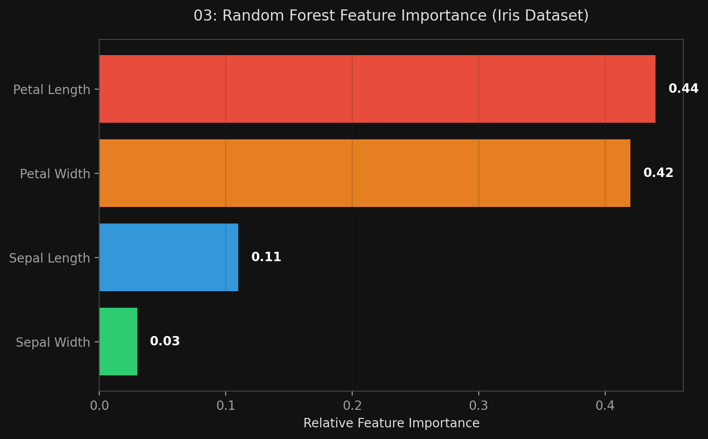

# 🏷️ Module 3: Random Forests & Extra-Trees
> **Ch. 7 — Hands-On ML with Scikit-Learn, Keras & TensorFlow (Aurélien Géron)**

---

## 📌 Table of Contents
1. [Start Here: The Big Picture](#big-picture)
2. [The Random Forest Algorithm](#concept-1)
3. [Extra-Trees (Extremely Randomized Trees)](#concept-2)
4. [Feature Importance](#concept-3)
5. [Common Beginner Mistakes](#mistakes)
6. [Interview Q&A](#interview)
7. [⚡ One-Page Flash Card](#revision)

---

## 🌍 Start Here: The Big Picture {#big-picture}

> **TL;DR:** A Random Forest is simply an ensemble of Decision Trees trained via the Bagging method. However, instead of searching for the absolute best feature when splitting a node, a Random Forest forces the tree to pick the best feature from a *random subset* of features. This injects a huge amount of diversity into the trees, lowering the ensemble's variance and making it one of the most powerful Machine Learning algorithms in existence.

---

## 🔍 1. The Random Forest Algorithm {#concept-1}

You could create a Random Forest by putting a `DecisionTreeClassifier` inside a `BaggingClassifier`. But Scikit-Learn provides a highly optimized `RandomForestClassifier` class that is much more convenient.

```python
from sklearn.ensemble import RandomForestClassifier

# Training 500 trees across all CPU cores
rnd_clf = RandomForestClassifier(n_estimators=500, max_leaf_nodes=16, n_jobs=-1)
rnd_clf.fit(X_train, y_train)
y_pred_rf = rnd_clf.predict(X_test)
```

**The Extra Randomness:**
In a standard Decision Tree (CART algorithm), the node evaluates *every single feature* to find the one that splits the data perfectly. 
In a Random Forest, the algorithm is forced to search for the best feature among a **random subset of features**. 
*   This prevents a single dominant feature from being chosen as the root node of every single tree.
*   It forces the forest to explore different paths, resulting in greater tree diversity, which trades a higher bias for a much lower variance (a net positive!).

---

## 🔍 2. Extra-Trees (Extremely Randomized Trees) {#concept-2}

Can we make the trees *even more random*? Yes!
When a Random Forest node evaluates its random subset of features, it still mathematically searches for the exact optimal threshold (e.g., $x \le 5.43$) to split the data.

An **Extremely Randomized Trees (Extra-Trees)** ensemble goes one step further: it uses **random thresholds** for each feature, rather than searching for the best possible threshold.

```python
from sklearn.ensemble import ExtraTreesClassifier

extra_clf = ExtraTreesClassifier(n_estimators=500, n_jobs=-1)
```

**Why use Extra-Trees?**
1.  **Lower Variance:** It trades even more bias for even lower variance than a Random Forest.
2.  **Massive Speed Boost:** Finding the absolute best mathematical threshold for every feature at every node is the single most time-consuming task of growing a tree. By skipping this and picking random thresholds, Extra-Trees train *significantly* faster than standard Random Forests.

*(Note: It is impossible to know in advance if Random Forest or Extra-Trees will perform better. You must use Cross-Validation to test both).*

---

## 🔍 3. Feature Importance {#concept-3}

One of the greatest qualities of Random Forests is that they make it incredibly easy to measure the relative importance of each feature. 

Scikit-Learn measures a feature's importance by looking at how much the tree nodes that use that feature reduce impurity *on average* across all trees in the forest (weighted by the number of instances the node processes).

```python
for name, score in zip(iris["feature_names"], rnd_clf.feature_importances_):
    print(name, score)

# sepal length (cm): 0.11
# sepal width (cm):  0.02
# petal length (cm): 0.44  <-- Most important
# petal width (cm):  0.42  <-- Most important
```

This makes Random Forests an incredible tool for **Feature Selection**. If you have 10,000 features, you can train a Random Forest and instantly drop the 9,000 features that have 0% importance.


> 📊 **Graph 03:** Visualizing Pixel Importance on the MNIST Dataset using a Random Forest

---

## ❌ Common Beginner Mistakes {#mistakes}

**1. "Using a BaggingClassifier with a DecisionTree instead of RandomForestClassifier"** ❌
> While you *can* do this, the `RandomForestClassifier` is highly optimized specifically for trees. It will run faster and provide access to tree-specific attributes like `feature_importances_`, which the generic Bagging API does not expose as easily.

**2. "Assuming Random Forests don't overfit"** ❌
> While bagging dramatically reduces variance and overfitting compared to a single Decision Tree, a Random Forest with infinite depth can still overfit noisy datasets. You should still consider tuning hyperparameters like `max_depth`, `min_samples_leaf`, or the number of estimators.

---

## 🎤 Interview Q&A {#interview}

**Q1: How exactly does a Random Forest inject more randomness into the model than a standard Bagging ensemble of Decision Trees?**
> **A:**
> A standard Bagging ensemble just trains normal trees on random subsets of the data. A Random Forest does that, but it also alters the tree-building algorithm itself. At each node, instead of evaluating all possible features to find the best split, the Random Forest algorithm evaluates only a *random subset of features*. This ensures that a single dominant feature doesn't dictate the structure of every single tree, forcing the ensemble to be diverse.

**Q2: What is the difference between a Random Forest and Extra-Trees, and why might you choose Extra-Trees?**
> **A:**
> While a Random Forest evaluates a random subset of features at each node, it still calculates the absolute optimal threshold for those features to minimize impurity. Extra-Trees (Extremely Randomized Trees) skip this calculation entirely; they pick completely random thresholds for the features. You might choose Extra-Trees because this extra randomness can lower variance even further, and skipping the threshold calculation makes them significantly faster to train than Random Forests.

---

## ⚡ One-Page Flash Card {#revision}

```
╔══════════════════════════════════════════════════════════════════╗
║  MODULE 3 FLASH CARD — Random Forests & Extra-Trees              ║
╠══════════════════════════════════════════════════════════════════╣
║  RANDOM FORESTS:                                                 ║
║  - An optimized Bagging ensemble of Decision Trees.              ║
║  - Extra randomness: Nodes can only pick the best split from a   ║
║    RANDOM SUBSET of features. Reduces variance.                  ║
║                                                                  ║
║  EXTRA-TREES (Extremely Randomized Trees):                       ║
║  - Same as Random Forest, but uses RANDOM THRESHOLDS for splits. ║
║  - Massive speed boost during training (skips math calculations).║
║                                                                  ║
║  FEATURE IMPORTANCE:                                             ║
║  - rf.feature_importances_ tells you which features matter most. ║
║  - Measured by how much a feature reduces impurity on average.   ║
║  - Incredible tool for Feature Selection.                        ║
╚══════════════════════════════════════════════════════════════════╝
```

---

**🔗 Previous Module →** [02_Bagging_and_Pasting.md](02_Bagging_and_Pasting.md)  
**🔗 Next Module →** [04_Boosting.md](04_Boosting.md)
