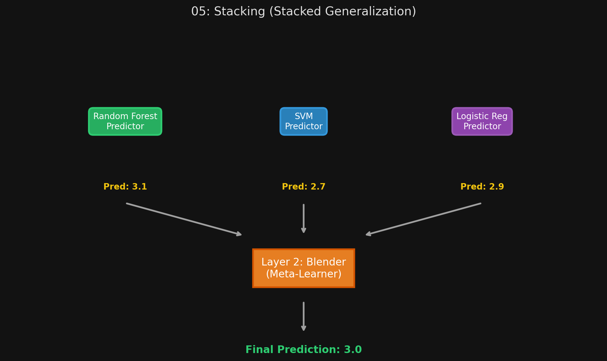

# 🏷️ Module 5: Stacking (Stacked Generalization)
> **Ch. 7 — Hands-On ML with Scikit-Learn, Keras & TensorFlow (Aurélien Géron)**

---

## 📌 Table of Contents
1. [Start Here: The Big Picture](#big-picture)
2. [How Stacking Works (The Blender)](#concept-1)
3. [Training a Stacking Ensemble (Hold-out Sets)](#concept-2)
4. [Multilayer Stacking](#concept-3)
5. [Common Beginner Mistakes](#mistakes)
6. [Interview Q&A](#interview)
7. [⚡ One-Page Flash Card](#revision)

---

## 🌍 Start Here: The Big Picture {#big-picture}

> **TL;DR:** Up to this point, our ensembles have aggregated their predictions using trivial math formulas (e.g., hard voting, or averaging). **Stacking** asks a brilliant question: instead of using a simple math formula to aggregate the predictions, *why don't we train a Machine Learning model to do it?* Stacking feeds the predictions of the base models into a final "meta-learner," which learns how to optimally combine them to make the ultimate prediction.

---

## 🔍 1. How Stacking Works (The Blender) {#concept-1}

In a Stacking ensemble, you have multiple layers of predictors.

1.  **Layer 1 (The Base Predictors):** You train a diverse set of models (e.g., an SVM, a Random Forest, and a Logistic Regression model) on the dataset.
2.  **Layer 2 (The Blender / Meta-Learner):** Instead of just averaging the output of Layer 1, the Layer 1 predictions are fed as *input features* into a final model (the Blender). The Blender learns how much to trust each base predictor. 
    *   For example, it might learn that the Random Forest is highly accurate overall, but when the SVM predicts Class B, the SVM is never wrong. The Blender learns these complex relationships to optimize the final output.


> 📊 **Graph 05:** Aggregating predictions using a blending predictor

---

## 🔍 2. Training a Stacking Ensemble (Hold-out Sets) {#concept-2}

You cannot train the Blender on the same exact data used to train Layer 1! If you do, Layer 1 will just perfectly output the target labels, and the Blender will overfit immediately.

**The Hold-out Set Method (Blending):**
1.  **Split the Data:** Split the training set into two subsets (Subset A and Subset B).
2.  **Train Layer 1:** Train the base predictors (SVM, Random Forest, etc.) exclusively on **Subset A**.
3.  **Generate Clean Predictions:** Pass **Subset B** through the trained base predictors. Because they have never seen Subset B, their predictions are "clean" (unbiased).
4.  **Create the Blender's Training Set:** Use the predictions from step 3 as the *input features*, and use the actual target labels of Subset B as the *targets*.
5.  **Train the Blender:** Train the meta-learner on this new dataset.

---

## 🔍 3. Multilayer Stacking {#concept-3}

It is actually possible to train an incredibly deep stacking architecture!

Instead of one Blender, you could train three different Blenders in Layer 2 (e.g., a Linear Regression Blender, a Random Forest Blender, etc.). Then, you take *their* predictions and feed them into a single Layer 3 "Super Blender".

**How to train a 3-Layer Stack:**
1.  Split the training set into three subsets (A, B, C).
2.  Train Layer 1 models on Subset A.
3.  Use Layer 1 models to make predictions on Subset B.
4.  Train Layer 2 blenders using those predictions as inputs.
5.  Use Layer 1 models to make predictions on Subset C. Pass those through the Layer 2 blenders.
6.  Train the Layer 3 super-blender using the output of Layer 2 as its inputs.

> [!WARNING]
> **Scikit-Learn Limitations:** Scikit-Learn does not support Stacking natively in a simple `StackingClassifier` class (at the time of the book's writing). You either have to roll your own implementation, or use an open-source library like **DESlib**.

---

## ❌ Common Beginner Mistakes {#mistakes}

**1. "Training the base models and the blender on the exact same dataset"** ❌
> If you do this, the base models (especially powerful ones like Random Forests) will severely overfit the training data. Their predictions will be nearly 100% accurate. When you pass these predictions to the blender, the blender will just learn the identity function (e.g., "always trust the Random Forest"). When you deploy this to production on unseen data, the base models will make mistakes, and the blender will have no idea how to handle them. You MUST use a hold-out set or out-of-fold predictions.

---

## 🎤 Interview Q&A {#interview}

**Q1: What is the main difference between a Voting Classifier and a Stacking ensemble?**
> **A:**
> A Voting Classifier uses a deterministic, mathematical rule to aggregate predictions—either a strict majority count (Hard Voting) or a simple average of probabilities (Soft Voting). Stacking (Stacked Generalization) replaces that math formula with a Machine Learning model. It trains a "meta-learner" or "blender" to intelligently figure out the best way to combine the base models' predictions.

**Q2: Why do we have to use a "hold-out set" when training a Stacking ensemble?**
> **A:**
> If we trained the Blender on the same data used to train the base models, the Blender would only learn how the base models behave on data they have perfectly memorized. It would overfit. By using a hold-out set, we ensure the base models are making predictions on unseen data. This forces the Blender to learn how to deal with the actual mistakes and biases the base models exhibit in the real world.

---

## ⚡ One-Page Flash Card {#revision}

```
╔══════════════════════════════════════════════════════════════════╗
║  MODULE 5 FLASH CARD — Stacking                                  ║
╠══════════════════════════════════════════════════════════════════╣
║  THE CONCEPT:                                                    ║
║  - Don't just average predictions; TRAIN a model to aggregate    ║
║    them!                                                         ║
║  - Layer 1: Base models (SVM, RF, etc.)                          ║
║  - Layer 2: The Blender (Meta-learner)                           ║
║                                                                  ║
║  THE HOLD-OUT SET (CRITICAL!):                                   ║
║  - You MUST split the training data.                             ║
║  - Train Layer 1 on Subset A.                                    ║
║  - Make predictions on Subset B.                                 ║
║  - Train Layer 2 on those Subset B predictions.                  ║
║  - This ensures the Blender learns from "clean", unbiased errors.║
║                                                                  ║
║  IMPLEMENTATION:                                                 ║
║  - Scikit-Learn doesn't natively support it easily; you must     ║
║    write custom code or use external libraries (e.g., DESlib).   ║
╚══════════════════════════════════════════════════════════════════╝
```

---

**🔗 Previous Module →** [04_Boosting.md](04_Boosting.md)
