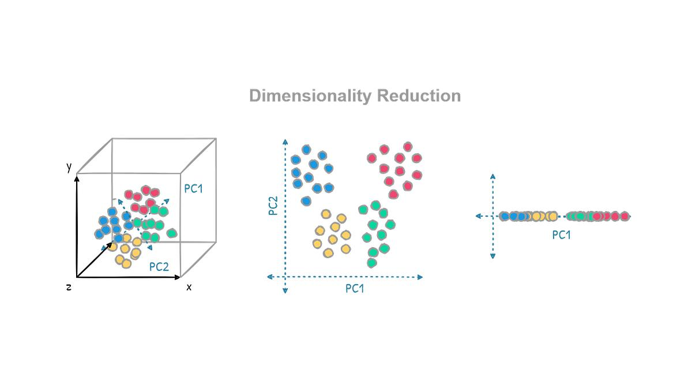
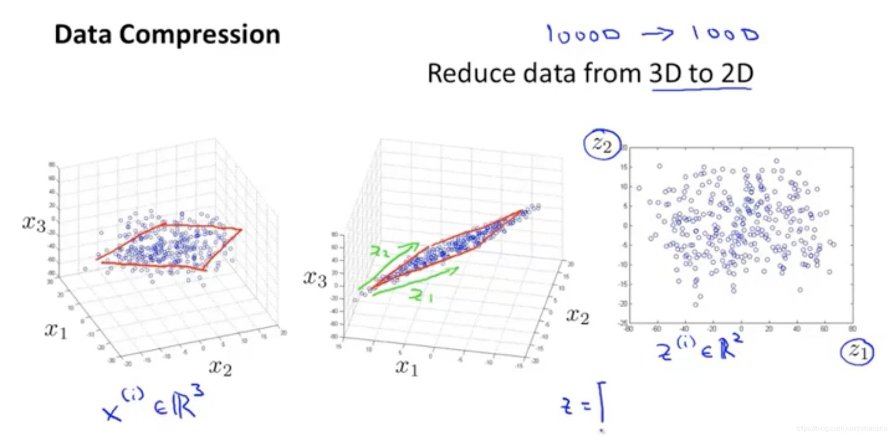
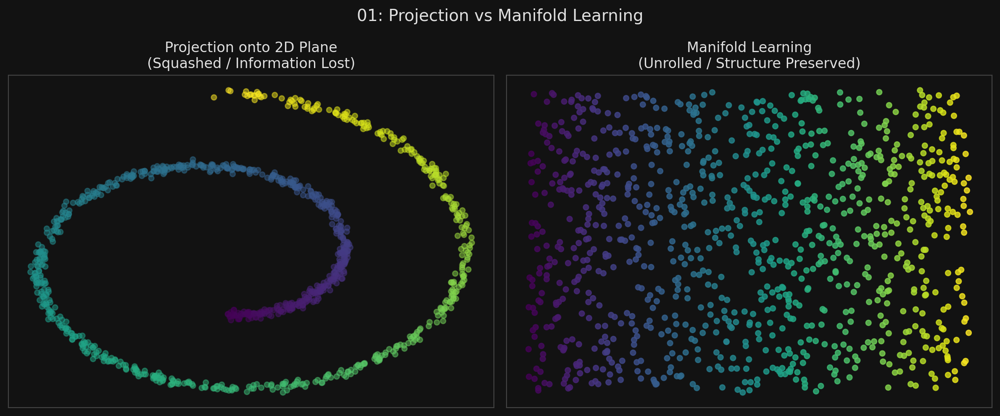

# 🏷️ Module 1: The Curse of Dimensionality & Main Approaches
> **Ch. 8 — Hands-On ML with Scikit-Learn, Keras & TensorFlow (Aurélien Géron)**

---

## 📌 Table of Contents
1. [Start Here: The Big Picture](#big-picture)
2. [The Curse of Dimensionality](#concept-1)
3. [Approach 1: Projection](#concept-2)
4. [Approach 2: Manifold Learning](#concept-3)
5. [Common Beginner Mistakes](#mistakes)
6. [Interview Q&A](#interview)
7. [⚡ One-Page Flash Card](#revision)

---

## 🌍 Start Here: The Big Picture {#big-picture}

> **TL;DR:** Datasets with thousands or millions of features (dimensions) cause training to become incredibly slow, and worse, make it much harder to find a good model. This is called the **Curse of Dimensionality**. By carefully dropping features that are highly correlated or useless (like the white pixels on the border of an image), we can compress a dataset from 10,000 dimensions down to 100 without losing much information. This speeds up training and allows us to visualize complex data in 2D or 3D. 

---

## 🔍 1. The Curse of Dimensionality {#concept-1}

Our human brains are built for 3D space, so our intuition completely fails when thinking about high-dimensional space (e.g., a 10,000-dimensional hypercube). Math behaves very weirdly in high dimensions.

**The Sparsity Problem:**
*   If you pick two random points in a 1x1 2D square, the average distance between them is roughly $0.52$.
*   If you pick two random points in a 1,000,000-dimensional hypercube, the average distance between them is **$408.25$**!
*   **Conclusion:** There is just *so much space* in high dimensions. Every single data point in your training set is likely to be extremely far away from every other point.
*   Because data is so sparse, predictions are based on massive extrapolations. The more dimensions you have, the greater the risk of severe overfitting.

*(In theory, you could just add more training data. But to adequately fill a 100-dimensional space, you would need more training instances than there are atoms in the observable universe).*



---

## 🔍 2. Approach 1: Projection {#concept-2}

In the real world, training instances are almost never spread out uniformly across all dimensions.
*   Many features are almost constant.
*   Many features are highly correlated with each other.

Because of this, data points usually lie close to a much lower-dimensional **subspace**.
Imagine a cluster of 3D data points that happen to form the shape of a flat dinner plate. The data exists in 3D, but it actually only *needs* 2 dimensions to be perfectly described. 
By dropping a perpendicular line from every point down onto that 2D plate, you can **project** the 3D data into 2D. 



---

## 🔍 3. Approach 2: Manifold Learning {#concept-3}

Projection doesn't always work. Imagine the famous **Swiss Roll** dataset (a 2D plane rolled up like a pastry in 3D space).
*   If you just squashed it flat (Projection), the different colored layers of the roll would overlap and mix together, destroying the dataset.
*   Instead, you want to carefully **unroll** the pastry to lay it flat.

A 2D **manifold** is simply a 2D shape that has been bent or twisted inside a higher-dimensional space. 
**The Manifold Hypothesis:** This states that most real-world high-dimensional datasets actually lie close to a much lower-dimensional manifold. 

*(For example, randomly generating pixel noise will almost never produce a picture of a handwritten digit. Digit images are constrained by rules (must have lines, connected strokes, etc), forcing them to live on a smaller manifold within the massive universe of all possible images).*


> 📊 **Graph 01:** Squashing (Projection) vs Unrolling (Manifold Learning) on the Swiss Roll

---

## ❌ Common Beginner Mistakes {#mistakes}

**1. "Using Dimensionality Reduction as the first step to improve model accuracy"** ❌
> Dimensionality reduction almost always causes *some* information loss (like compressing an image to a JPEG). It will generally make your system perform slightly *worse*, not better. It is primarily used to **speed up training**, reduce storage space, or visualize data. You should always try training on the original dataset first.

**2. "Assuming unrolling a manifold will always make the decision boundary simpler"** ❌
> The Manifold Hypothesis assumes that the task (like classification) will be simpler if expressed in the lower-dimensional space. While often true, it is not guaranteed. Sometimes, unrolling a manifold can take a very simple, straight 3D decision boundary and warp it into a highly complex, squiggly 2D decision boundary.

---

## 🎤 Interview Q&A {#interview}

**Q1: What is the Curse of Dimensionality, and why does it lead to overfitting?**
> **A:**
> The Curse of Dimensionality refers to the fact that as the number of features (dimensions) grows, the volume of the space increases exponentially. In high-dimensional space, data points become incredibly sparse—meaning every training instance is very far away from every other instance. Because the data is so spread out, new, unseen instances will also be far away from the training data, forcing the model to make wild extrapolations. This makes it incredibly easy for the model to overfit the training data and fail to generalize.

**Q2: Compare Projection vs. Manifold Learning for dimensionality reduction.**
> **A:**
> Projection works by identifying a lower-dimensional flat hyperplane (subspace) that lies close to the data, and projecting the data straight down onto it (like casting a shadow). It works well if the data is generally flat. Manifold Learning assumes the data is a lower-dimensional shape that has been twisted or bent in high-dimensional space (like a Swiss roll). It attempts to model that curved shape and "unroll" it, rather than just squashing it flat.

---

## ⚡ One-Page Flash Card {#revision}

```
╔══════════════════════════════════════════════════════════════════╗
║  MODULE 1 FLASH CARD — The Curse & Main Approaches               ║
╠══════════════════════════════════════════════════════════════════╣
║  THE CURSE OF DIMENSIONALITY:                                    ║
║  High dimensional space is vast. Data becomes incredibly sparse, ║
║  making models extrapolate wildly and severely overfit.          ║
║                                                                  ║
║  APPROACH 1: PROJECTION                                          ║
║  - Drops data straight down onto a flat, lower-dimensional plane.║
║  - Fails if the data is curved or twisted (e.g., Swiss roll).    ║
║                                                                  ║
║  APPROACH 2: MANIFOLD LEARNING                                   ║
║  - Unrolls twisted/curved data (manifolds).                      ║
║  - Manifold Hypothesis: Real-world high-D data is usually just   ║
║    low-D data constrained by rules (e.g., handwritten digits).   ║
║                                                                  ║
║  WARNING:                                                        ║
║  Reduction loses information. Usually degrades accuracy slightly.║
║  Only use it if training is too slow or you need visualization!  ║
╚══════════════════════════════════════════════════════════════════╝
```

---

**🔗 Next Module →** [02_Principal_Component_Analysis.md](02_Principal_Component_Analysis.md)
