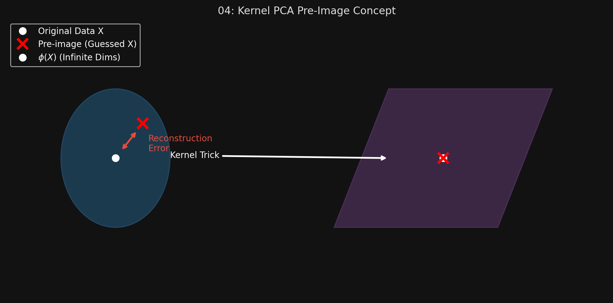

# 🏷️ Module 4: Kernel PCA
> **Ch. 8 — Hands-On ML with Scikit-Learn, Keras & TensorFlow (Aurélien Géron)**

---

## 📌 Table of Contents
1. [Start Here: The Big Picture](#big-picture)
2. [What is Kernel PCA?](#concept-1)
3. [Tuning kPCA (Supervised Approach)](#concept-2)
4. [Tuning kPCA (Unsupervised Pre-image Approach)](#concept-3)
5. [Common Beginner Mistakes](#mistakes)
6. [Interview Q&A](#interview)
7. [⚡ One-Page Flash Card](#revision)

---

## 🌍 Start Here: The Big Picture {#big-picture}

> **TL;DR:** In Chapter 5, we learned about the "Kernel Trick"—a mathematical shortcut that maps data into an infinite-dimensional space to make nonlinear data linearly separable. We can apply this exact same trick to PCA! **Kernel PCA (kPCA)** allows us to perform complex, nonlinear projections for dimensionality reduction. It is incredibly good at preserving clusters of instances and unrolling datasets that lie close to a twisted manifold (like the Swiss roll).

---

## 🔍 1. What is Kernel PCA? {#concept-1}

Standard PCA is strictly linear. If you use it on a highly non-linear dataset (like a Swiss roll), it will just squash it flat, destroying the structure.

By applying the Kernel Trick, kPCA implicitly maps the dataset into an infinitely high-dimensional feature space where it *is* linear, applies standard PCA there, and then brings it back down.
*   **Result:** You get a non-linear dimensionality reduction in the original space.

```python
from sklearn.decomposition import KernelPCA

# Using an RBF kernel (bell curve similarity)
rbf_pca = KernelPCA(n_components=2, kernel="rbf", gamma=0.04)
X_reduced = rbf_pca.fit_transform(X)
```

**Common Kernels:**
*   `linear`: Equivalent to standard PCA.
*   `rbf`: Great for preserving clusters.
*   `sigmoid`: Often used, but less common than RBF.

---

## 🔍 2. Tuning kPCA (Supervised Approach) {#concept-2}

Because kPCA is an *unsupervised* learning algorithm, there is no obvious accuracy score to help you choose the best kernel or the best `gamma` value.

However, dimensionality reduction is usually just a preparation step inside a larger pipeline that ends in a *supervised* task (like Classification). Therefore, the best way to tune kPCA is to use Grid Search on the final classification accuracy!

```python
from sklearn.model_selection import GridSearchCV
from sklearn.linear_model import LogisticRegression
from sklearn.pipeline import Pipeline

# 1. Create a Pipeline: kPCA -> Logistic Regression
clf = Pipeline([
    ("kpca", KernelPCA(n_components=2)),
    ("log_reg", LogisticRegression())
])

# 2. Define the Grid (testing different kPCA kernels and gamma values)
param_grid = [{
    "kpca__gamma": np.linspace(0.03, 0.05, 10),
    "kpca__kernel": ["rbf", "sigmoid"]
}]

# 3. Search for the combination that yields the highest Logistic Regression accuracy
grid_search = GridSearchCV(clf, param_grid, cv=3)
grid_search.fit(X, y)

print(grid_search.best_params_)
# Output: {'kpca__gamma': 0.0433, 'kpca__kernel': 'rbf'}
```

---

## 🔍 3. Tuning kPCA (Unsupervised Pre-image Approach) {#concept-3}

What if you don't have a supervised classification task at the end? How do you tune kPCA purely unsupervised?
You can select the kernel that yields the **lowest reconstruction error** (just like standard PCA).

**The Mathematical Problem:**
With linear PCA, you just use `inverse_transform` to go backwards. With kPCA, the data was projected from an *infinite-dimensional* feature space. You cannot mathematically invert infinite dimensions! Therefore, you cannot compute the true reconstruction error.

**The Solution (The Pre-image):**
We can train a supervised regression model to "guess" where the reconstructed point *should* be in the original space. This guessed point is called the **reconstruction pre-image**. 
We can then measure the squared distance between the original instance and the guessed pre-image!

```python
# You must set fit_inverse_transform=True, otherwise Scikit-Learn will not 
# build the regression model required to guess the pre-image!
rbf_pca = KernelPCA(
    n_components=2, kernel="rbf", gamma=0.0433,
    fit_inverse_transform=True 
)

X_reduced = rbf_pca.fit_transform(X)
X_preimage = rbf_pca.inverse_transform(X_reduced) # This is the guessed point

# Now compute the error!
from sklearn.metrics import mean_squared_error
error = mean_squared_error(X, X_preimage)
```
*You can now wrap this in a loop to find the kernel that minimizes this error.*


> 📊 **Graph 04:** The Pre-Image concept in Kernel PCA

---

## ❌ Common Beginner Mistakes {#mistakes}

**1. "Trying to call `inverse_transform` on a KernelPCA object and getting an error"** ❌
> By default, `KernelPCA` in Scikit-Learn has no `inverse_transform()` method. Because of the infinite-dimensional math of the kernel trick, it is impossible to invert natively. You MUST pass `fit_inverse_transform=True` when initializing the object. This forces Scikit-Learn to train a secondary regression algorithm just to guess the inverted points.

**2. "Using kPCA when standard PCA works perfectly fine"** ❌
> kPCA is computationally expensive and much harder to tune than linear PCA. If your data doesn't have a severe non-linear manifold structure, always stick to standard PCA.

---

## 🎤 Interview Q&A {#interview}

**Q1: How do you select the best hyperparameters for an unsupervised algorithm like Kernel PCA?**
> **A:**
> There are two main ways. The easiest and most common way is to treat kPCA as a preprocessing step in a supervised pipeline (e.g., kPCA -> Logistic Regression). You use Grid Search to find the kPCA parameters that maximize the accuracy of the final supervised classifier. If you are doing purely unsupervised work, you must train a regression model to estimate the "reconstruction pre-image" of the reduced data back into the original space, and pick the hyperparameters that minimize that pre-image reconstruction error.

**Q2: Why is computing the reconstruction error for Kernel PCA so much harder than for standard PCA?**
> **A:**
> Standard PCA uses linear math (matrix multiplication), which is easily reversible to find the exact reconstructed point. Kernel PCA uses the kernel trick, which mathematically implies projecting the data into an infinite-dimensional feature space. You cannot reverse an operation from infinite dimensions back to the original space. Therefore, you can't find the exact reconstructed point; you have to train a secondary Machine Learning model to "guess" where the point should be (the pre-image).

---

## ⚡ One-Page Flash Card {#revision}

```
╔══════════════════════════════════════════════════════════════════╗
║  MODULE 4 FLASH CARD — Kernel PCA                                ║
╠══════════════════════════════════════════════════════════════════╣
║  THE CONCEPT:                                                    ║
║  - Standard PCA is linear. It squashes curved manifolds.         ║
║  - Kernel PCA uses the Kernel Trick (infinite dimensions) to     ║
║    perform NON-LINEAR dimensionality reduction.                  ║
║                                                                  ║
║  TUNING KPCA (Method 1: Supervised Pipeline):                    ║
║  - Put kPCA in a Pipeline with a Classifier.                     ║
║  - Use GridSearchCV to maximize the Classifier's accuracy!       ║
║                                                                  ║
║  TUNING KPCA (Method 2: Unsupervised Pre-image):                 ║
║  - You cannot mathematically invert infinite dimensions.           ║
║  - Set fit_inverse_transform=True. Sklearn trains a regression   ║
║    model to "guess" the original point (the Pre-image).          ║
║  - Minimize the error between the original and the guess.        ║
╚══════════════════════════════════════════════════════════════════╝
```

---

**🔗 Previous Module →** [03_Advanced_PCA.md](03_Advanced_PCA.md)  
**🔗 Next Module →** [05_LLE_and_Other_Techniques.md](05_LLE_and_Other_Techniques.md)
