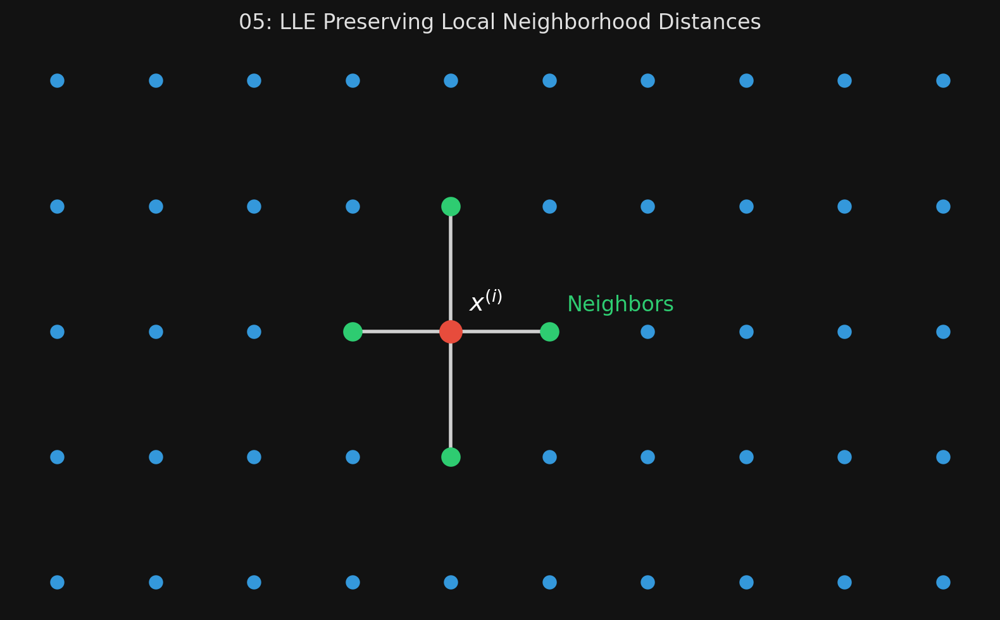

# 🏷️ Module 5: LLE and Other Techniques
> **Ch. 8 — Hands-On ML with Scikit-Learn, Keras & TensorFlow (Aurélien Géron)**

---

## 📌 Table of Contents
1. [Start Here: The Big Picture](#big-picture)
2. [Locally Linear Embedding (LLE)](#concept-1)
3. [How LLE Works (The Math Intuition)](#concept-2)
4. [Other Popular Techniques (t-SNE, MDS, etc.)](#concept-3)
5. [Common Beginner Mistakes](#mistakes)
6. [Interview Q&A](#interview)
7. [⚡ One-Page Flash Card](#revision)

---

## 🌍 Start Here: The Big Picture {#big-picture}

> **TL;DR:** While PCA and kPCA rely on projecting data onto planes, **LLE (Locally Linear Embedding)** is a pure Manifold Learning technique that does not use projections at all. Instead, it measures how each data point relates to its closest neighbors, and then tries to map the data to 2D while keeping those local neighborhood relationships perfectly intact. We'll also briefly cover other famous algorithms, like **t-SNE**, which is the gold standard for visualizing clusters.

---

## 🔍 1. Locally Linear Embedding (LLE) {#concept-1}

LLE is incredibly good at unrolling twisted manifolds (like the Swiss roll), especially when the dataset isn't too noisy.

Because it only cares about preserving *local* distances (how close a point is to its immediate neighbors), it sometimes fails to preserve *global* distances (the left side of the unrolled Swiss roll might get stretched out, while the right side gets squeezed). But overall, it models the manifold excellently.

```python
from sklearn.manifold import LocallyLinearEmbedding

# Unroll the Swiss Roll to 2D
lle = LocallyLinearEmbedding(n_components=2, n_neighbors=10)
X_reduced = lle.fit_transform(X)
```


> 📊 **Graph 05:** The Swiss Roll unrolled using Locally Linear Embedding

---

## 🔍 2. How LLE Works (The Math Intuition) {#concept-2}

LLE works in two specific steps:

**Step 1: Linearly Model Local Relationships (Original Space)**
For every training instance $x^{(i)}$, the algorithm finds its $k$ nearest neighbors (e.g., $k=10$). It then tries to write $x^{(i)}$ as a linear math equation based *only* on those 10 neighbors. It finds the optimal weights so that $x^{(i)}$ is perfectly described by the points immediately surrounding it. 
*(This encodes the structure of the local neighborhood).*

**Step 2: Reduce Dimensionality (Lower Space)**
Now, LLE creates a new 2D space. It places all the points into this 2D space, and moves them around until their relationships perfectly match the weights calculated in Step 1.
Instead of keeping the points fixed and finding weights (Step 1), it keeps the weights fixed and finds the optimal positions for the points (Step 2).

> [!WARNING]
> **Scalability Issue:** The mathematical optimization in Step 2 scales incredibly poorly. Its complexity is $O(d m^2)$, where $m$ is the number of instances. Because of the $m^2$, LLE cannot be used on very large datasets.

---

## 🔍 3. Other Popular Techniques (t-SNE, MDS, etc.) {#concept-3}

Scikit-Learn offers several other dimensionality reduction techniques you should know about:

*   **t-SNE (t-Distributed Stochastic Neighbor Embedding):**
    *   The absolute gold standard for **Data Visualization**.
    *   It tries to keep similar instances close together and dissimilar instances far apart.
    *   If you want to visualize the MNIST dataset in 2D and see beautiful, distinct clusters of digits, use t-SNE!
*   **Multidimensional Scaling (MDS):**
    *   Reduces dimensionality while trying to preserve the exact absolute distances between every single instance.
*   **Isomap:**
    *   Creates a graph connecting nearest neighbors, then reduces dimensionality while preserving the *geodesic distances* (the number of nodes on the shortest path between two points) between instances.
*   **Linear Discriminant Analysis (LDA):**
    *   This is actually a classification algorithm, but it learns the most discriminative axes between classes during training. You can project data onto these axes to reduce dimensions while keeping the classes as far apart as possible! (Great preprocessing step before an SVM).
*   **Random Projections:**
    *   Projects data using a mathematically random linear projection. Surprisingly, thanks to the Johnson-Lindenstrauss lemma, this actually preserves distances quite well and is insanely fast.

---

## ❌ Common Beginner Mistakes {#mistakes}

**1. "Trying to use LLE on a dataset with 500,000 rows"** ❌
> Because the computational complexity of the second step of LLE scales exponentially with the number of instances ($m^2$), running LLE on a massive dataset will cause your computer to freeze or run out of memory. LLE is strictly for small to medium datasets.

**2. "Using PCA to visualize distinct clusters instead of t-SNE"** ❌
> PCA is great for compressing data to speed up algorithms, but it is often terrible at visualizing distinct clusters in 2D because it only cares about preserving variance, not neighborhood similarity. If your goal is strictly visualization and cluster detection, t-SNE will almost always produce vastly superior, beautiful visualizations.

---

## 🎤 Interview Q&A {#interview}

**Q1: Explain the conceptual difference between how PCA and LLE reduce dimensionality.**
> **A:**
> PCA uses the Projection approach. It looks for a flat hyperplane that preserves the maximum variance of the entire dataset and projects the points straight down onto it. It cares about the global structure. LLE uses the Manifold Learning approach without projection. It looks at how every point relates to its immediate nearest neighbors, and then maps the points to 2D while trying to perfectly preserve those local neighborhood relationships, often at the expense of global distances.

**Q2: If your only goal is to visualize a high-dimensional dataset in 2D to see if there are natural clusters, which algorithm should you use?**
> **A:**
> t-SNE (t-Distributed Stochastic Neighbor Embedding). While PCA will preserve variance, it usually mushes clusters together in 2D. t-SNE specifically mathematically optimizes to keep similar instances close together and push dissimilar instances far apart, making it the industry standard for 2D/3D cluster visualization.

---

## ⚡ One-Page Flash Card {#revision}

```
╔══════════════════════════════════════════════════════════════════╗
║  MODULE 5 FLASH CARD — LLE & Other Techniques                    ║
╠══════════════════════════════════════════════════════════════════╣
║  LLE (Locally Linear Embedding):                                 ║
║  - Manifold Learning algorithm (no projection).                  ║
║  - Step 1: Learn how a point relates to its k-nearest neighbors. ║
║  - Step 2: Map to 2D while keeping those relationships intact.   ║
║  - Scales TERRIBLY on large datasets (O(m^2)).                   ║
║                                                                  ║
║  t-SNE (t-Distributed Stochastic Neighbor Embedding):            ║
║  - The gold standard for VISUALIZATION.                          ║
║  - Keeps similar items close, dissimilar items far apart.        ║
║                                                                  ║
║  LDA (Linear Discriminant Analysis):                             ║
║  - A classifier that can be used for dimensionality reduction.   ║
║  - Keeps classes as far apart as possible. Great preprocessing.  ║
╚══════════════════════════════════════════════════════════════════╝
```

---

**🔗 Previous Module →** [04_Kernel_PCA.md](04_Kernel_PCA.md)
