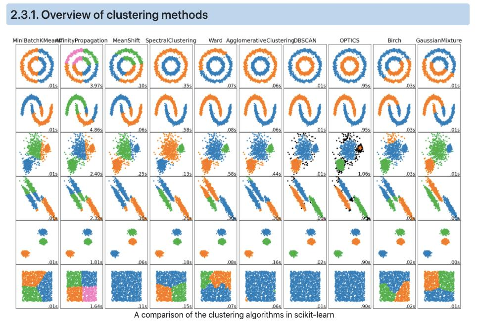

# 🏷️ Module 1: The Big Picture of Unsupervised Learning
> **Ch. 9 — Hands-On ML with Scikit-Learn, Keras & TensorFlow (Aurélien Géron)**

---

## 📌 Table of Contents
1. [Start Here: The Big Picture](#big-picture)
2. [Why Unsupervised Learning Matters](#concept-1)
3. [The Three Main Tasks](#concept-2)
4. [Common Beginner Mistakes](#mistakes)
5. [Interview Q&A](#interview)
6. [⚡ One-Page Flash Card](#revision)

---

## 🌍 Start Here: The Big Picture {#big-picture}

> **TL;DR:** So far, we have only looked at *Supervised Learning*, where our dataset came with labels (e.g., predicting the price of a house, where the dataset actually included the historical prices). But in the real world, the vast majority of data is **unlabeled**. Imagine a factory camera taking thousands of pictures of products every hour. You have the images (features), but nobody has manually gone through to label which ones are defective. **Unsupervised Learning** algorithms can find hidden structures, patterns, and anomalies in this unlabeled data entirely on their own.

---

## 🔍 1. Why Unsupervised Learning Matters {#concept-1}

*"If intelligence was a cake, unsupervised learning would be the cake, supervised learning would be the icing on the cake, and reinforcement learning would be the cherry on the cake."* — Yann LeCun (Chief AI Scientist at Meta)

**The Bottleneck of Supervised Learning:**
Supervised learning requires humans to manually label data. This is often an incredibly slow, expensive, and tedious process. If a factory changes the design of a product, humans have to start labeling photos of the new product from scratch.

Unsupervised learning bypasses this bottleneck. It exploits raw, unlabeled data to find patterns. It can even be used in a hybrid approach (Semi-Supervised Learning) to automatically label a massive dataset after a human only labels a tiny fraction of it.

---

## 🔍 2. The Three Main Tasks {#concept-2}

In Chapter 8, we explored one unsupervised task: Dimensionality Reduction. In this chapter, we explore three more:

**1. Clustering:**
The goal is to automatically group similar instances together into clusters.
*   **Customer Segmentation:** Grouping customers based on purchase history to target marketing.
*   **Search Engines:** Grouping similar images together so they can be retrieved quickly.
*   **Image Segmentation:** Grouping pixels of similar colors to compress an image or identify object boundaries.

**2. Anomaly Detection (Outlier Detection):**
The objective is to learn what "normal" data looks like, and then flag instances that deviate significantly from that norm.
*   **Manufacturing:** Identifying defective items on a production line.
*   **Cybersecurity:** Detecting unusual server traffic or fraudulent credit card transactions.

**3. Density Estimation:**
Estimating the probability density function (PDF) of the underlying process that created the data. 
*   This is the mathematical foundation often used for anomaly detection (if a data point lands in a region where the estimated probability density is 0.001%, it is flagged as an anomaly).



---

## ❌ Common Beginner Mistakes {#mistakes}

**1. "Confusing Clustering with Classification"** ❌
> Classification is a supervised task. You know exactly how many classes there are, and you train the model with labeled examples of exactly what those classes look like. Clustering is an unsupervised task. You hand the algorithm a pile of unlabeled data, and it discovers its own groupings based purely on spatial similarity.

---

## 🎤 Interview Q&A {#interview}

**Q1: What is the fundamental difference between Supervised and Unsupervised learning, and why is Unsupervised learning so important in the real world?**
> **A:**
> Supervised learning requires a labeled dataset (features accompanied by correct target outputs), whereas unsupervised learning operates on unlabeled data. Unsupervised learning is critical because the vast majority of the world's data is unlabeled. Manually labeling data requires human experts, which is slow and expensive. Unsupervised algorithms can automatically extract structure, detect anomalies, and segment data without this human bottleneck.

---

## ⚡ One-Page Flash Card {#revision}

```
╔══════════════════════════════════════════════════════════════════╗
║  MODULE 1 FLASH CARD — Intro to Unsupervised Learning            ║
╠══════════════════════════════════════════════════════════════════╣
║  THE PROBLEM:                                                    ║
║  Most real-world data is UNLABELED. Manual labeling is too       ║
║  expensive and slow.                                             ║
║                                                                  ║
║  THE SOLUTION (UNSUPERVISED LEARNING):                           ║
║  Algorithms that find structure in data without human labels.    ║
║                                                                  ║
║  THREE MAIN TASKS:                                               ║
║  1. Clustering (Grouping similar items, like customer segments). ║
║  2. Anomaly Detection (Flagging defective items/fraud).          ║
║  3. Density Estimation (Mapping the probability distribution     ║
║     of the data space).                                          ║
╚══════════════════════════════════════════════════════════════════╝
```

---

**🔗 Next Module →** [02_K_Means_Clustering.md](02_K_Means_Clustering.md)
