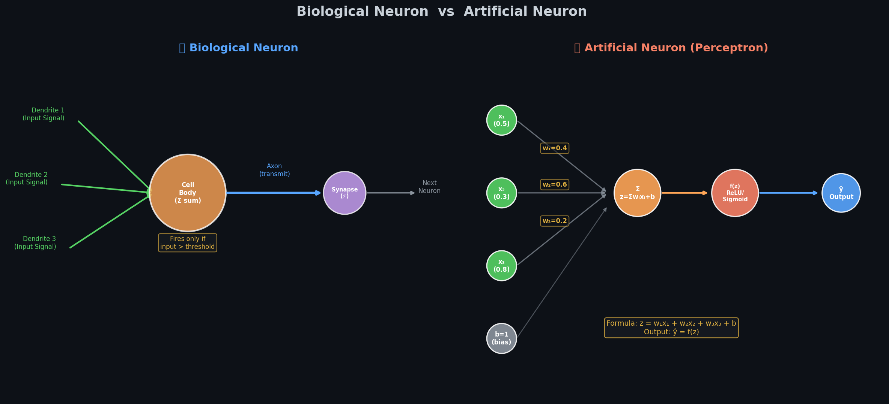
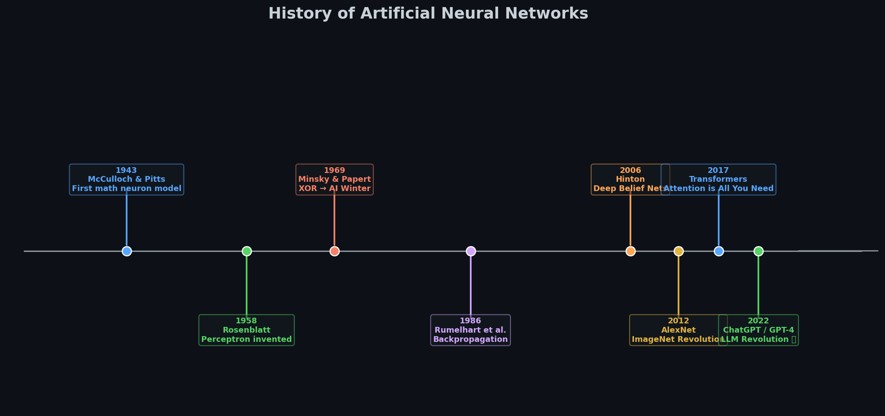
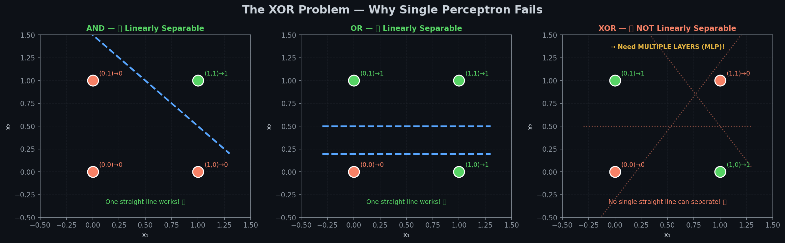
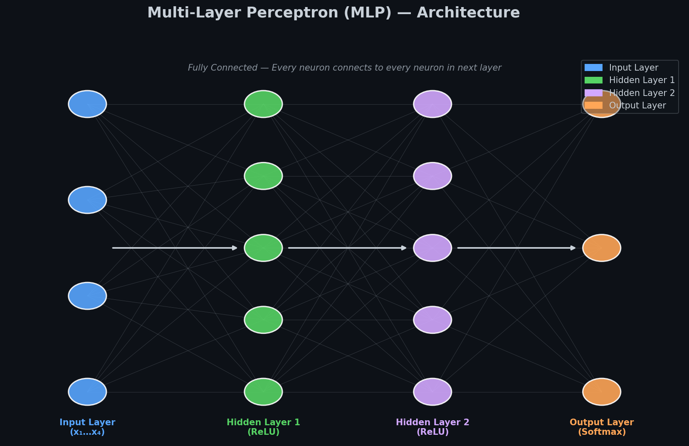
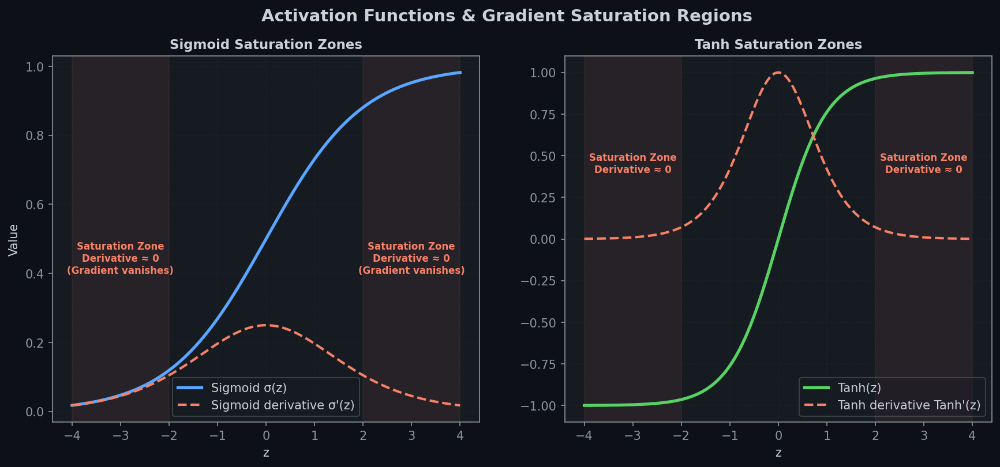
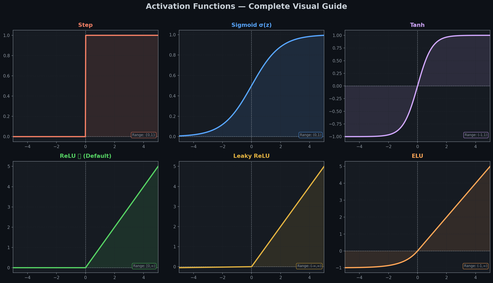

# 🧠 Module 1: From Biological Neurons to Artificial Neural Networks
> **Ch. 10 — Hands-On ML with Scikit-Learn, Keras & TensorFlow (Aurélien Géron)**

---

## 📌 Table of Contents
1. [Start Here: The Big Picture](#big-picture)
2. [The Biological Neuron](#bio-neuron)
3. [The Artificial Neuron (Perceptron)](#perceptron)
4. [Why We Need Multiple Layers: The XOR Problem](#xor)
5. [The MLP: Multi-Layer Perceptron](#mlp)
6. [Activation Functions — The Secret Sauce](#activation)
7. [Full Math Walkthrough (Step by Step)](#math)
8. [Key Terms Dictionary](#terms)
9. [Common Beginner Mistakes](#mistakes)
10. [Interview Q&A (Top 8)](#interview)
11. [⚡ One-Page Flash Card](#revision)

---

## 🌍 Start Here: The Big Picture {#big-picture}

> **TL;DR:** Your brain uses neurons to process information. We copy that idea in math. One neuron → Perceptron. Many neurons in layers → MLP. Train with data → Neural Network!

**The "Pizza Decision" Analogy 🍕**

Imagine deciding whether to eat a pizza:

| Signal | Strength | Weight |
|--------|----------|--------|
| "It smells amazing" | Strong ✅ | +0.8 |
| "I'm hungry" | Strong ✅ | +0.7 |
| "I'm on a diet" | Strong ❌ | −0.9 |
| "It's expensive" | Weak ❌ | −0.2 |

Your brain **weighs** each signal, **adds them up**, and if the total crosses a **threshold**, you decide: **YES, eat it!**

That's EXACTLY how an artificial neuron works:
- **Inputs** = the signals (smell, hunger, diet, price)
- **Weights** = how much each matters (learned from data)
- **Threshold** = the tipping point (bias term)
- **Output** = YES/NO decision

---

## 🔬 The Biological Neuron {#bio-neuron}

> **TL;DR:** A neuron receives signals through dendrites, sums them in the cell body, and fires a signal through the axon if the total is strong enough.

```
🌿 Dendrite 1 ──┐
🌿 Dendrite 2 ──┤──→ 🧠 Cell Body ──→ ➡️ Axon ──→ ⚡ Synapse ──→ 🌿 Next Neuron
🌿 Dendrite 3 ──┘    (adds signals)   (if strong enough)  (connection)
```

**Key Facts:**
- ~86 **billion** neurons in the human brain
- Each neuron connects to up to ~10,000 others
- A neuron fires **only if** the total input exceeds its threshold
- Communication uses **electrochemical signals**

### 🤖 Biological → Artificial: Side-by-Side



> 📊 **Diagram:** Left = biological neuron with labeled parts. Right = artificial neuron with the exact math equivalent of each part.

| Biological Part | What It Does | Artificial Equivalent |
|----------------|-------------|----------------------|
| **Dendrites** | Receive incoming signals | Input values x₁, x₂, x₃ |
| **Synaptic weight** | How strong each connection is | Weights w₁, w₂, w₃ |
| **Cell Body** | Adds up all the weighted signals | Σ (sum): z = Σwᵢxᵢ + b |
| **Threshold** | Fires only if signal is strong enough | Activation function f(z) |
| **Axon** | Sends the output signal forward | Output ŷ (y-hat) |

### 🗓️ How We Got Here: ANN History



> 📊 **Timeline:** 80 years of neural network history — from the first math model to ChatGPT.

| Year | What Happened | Why It Matters |
|------|--------------|---------------|
| **1943** | McCulloch & Pitts — first math neuron | "Can we model the brain in equations?" |
| **1958** | Rosenblatt — Perceptron invented | First trainable artificial neuron |
| **1969** | Minsky & Papert — XOR problem published | Proved perceptrons are too simple → **AI Winter** |
| **1986** | Rumelhart et al. — Backpropagation | The algorithm that trains deep networks |
| **2006** | Hinton — Deep Belief Networks | **Deep Learning** era begins |
| **2012** | AlexNet wins ImageNet by a huge margin | Deep Learning goes mainstream |
| **2017** | "Attention is All You Need" (Transformers) | Foundation for GPT, BERT, etc. |
| **2022** | ChatGPT launches | Largest public AI moment in history |

> 💡 **Pattern:** AI has alternating "summers" (progress) and "winters" (stagnation). We are currently in the longest summer ever.

---

## ⚡ The Artificial Neuron (Perceptron) {#perceptron}

> **TL;DR:** A perceptron multiplies each input by a weight, adds a bias, then applies a step function. If the total ≥ 0 → output 1 (YES). If < 0 → output 0 (NO).

**Invented in 1958 by Frank Rosenblatt.** The simplest possible ANN — just ONE neuron.

### How It Works — Step by Step

**Example:** Predict if a patient has diabetes (1=yes, 0=no) from 3 features.

```
Inputs:            Weights:
x₁ = glucose=0.8   w₁ = 0.5
x₂ = age=0.6       w₂ = 0.3
x₃ = BMI=0.7       w₃ = 0.4
bias b = -0.5
```

**Step 1: Multiply inputs by weights**
```
w₁×x₁ = 0.5 × 0.8 = 0.40
w₂×x₂ = 0.3 × 0.6 = 0.18
w₃×x₃ = 0.4 × 0.7 = 0.28
```

**Step 2: Add them all up + bias**
```
z = 0.40 + 0.18 + 0.28 + (−0.5) = 0.36
```

**Step 3: Apply step function**
```
ŷ = 1  because z = 0.36 ≥ 0  → "Patient likely has diabetes"
```

### The Math Formula

$$z = w_1 x_1 + w_2 x_2 + \cdots + w_n x_n + b = \mathbf{w}^T \mathbf{x} + b$$

$$\hat{y} = \text{step}(z) = \begin{cases} 1 & \text{if } z \geq 0 \\ 0 & \text{if } z < 0 \end{cases}$$

### The Learning Rule

When the prediction is wrong, update the weights:

$$w_i \leftarrow w_i + \eta \cdot (y - \hat{y}) \cdot x_i$$

- **η (eta)** = learning rate (e.g., 0.01) — how big each step is
- **(y − ŷ)** = error: +1, 0, or −1
- **x_i** = the input that caused the error

> 💡 **Intuition:** If we predicted 0 but the answer was 1, increase the weights that had positive inputs (they should have pushed us to say 1).

---

## ❌ The XOR Problem: Why One Neuron Isn't Enough {#xor}

> **TL;DR:** A single perceptron can only draw ONE straight line. XOR requires two lines. That's why we need multiple layers.



> 📊 **Graph:** Left: AND is separable with one line ✅. Middle: OR is separable ✅. Right: XOR cannot be separated by any single line ❌.

**XOR Truth Table:**
```
x₁  x₂ │ AND  OR  XOR
─────────┼────────────
 0   0  │  0   0    0    ← same output as AND
 0   1  │  0   1    1    ← same output as OR
 1   0  │  0   1    1    ← same output as OR
 1   1  │  1   1    0    ← DIFFERENT! Can't do this with 1 line
```

**1969:** Minsky & Papert proved that no single perceptron can solve XOR → Funding cut → **AI Winter for 17 years**.

**The Fix:** Stack multiple layers (MLP). A 2-layer network CAN solve XOR by combining two linear boundaries.

```python
# Proof: XOR needs at least 2 layers
# Layer 1 computes: h1 = OR(x1,x2),  h2 = NAND(x1,x2)
# Layer 2 computes: XOR = AND(h1, h2)  ← solved!
```

> 💡 **Key Takeaway:** This limitation is WHY the Multi-Layer Perceptron (MLP) exists. Every layer adds one more "turn" to the decision boundary.

---

## 🏗️ The MLP: Multi-Layer Perceptron {#mlp}

> **TL;DR:** An MLP is multiple layers of neurons. Data flows left→right (forward pass). Each hidden layer transforms the data into more useful representations. The output layer makes the final prediction.

**Real-World Analogy 🏢 — Company Hierarchy:**
- **Input Layer** = Front desk staff (takes raw info from outside world)
- **Hidden Layers** = Middle managers (each one processes and summarizes the info)
- **Output Layer** = CEO (makes the final decision based on manager reports)

Information flows in ONE direction: front desk → managers → CEO.

### The Architecture



> 📊 **Diagram:** Fully-connected MLP with 4 inputs → 5 hidden (ReLU) → 5 hidden (ReLU) → 3 outputs (Softmax). Every node connects to every node in the next layer.

**For Fashion MNIST (the book's main example):**
```
Input:    784 neurons  (28×28 pixel image, flattened)
Hidden 1: 300 neurons  (ReLU) — detects low-level patterns
Hidden 2: 100 neurons  (ReLU) — detects higher-level patterns
Output:    10 neurons  (Softmax) — one probability per clothing class
```

### Why Hidden Layers Are Powerful

Each layer learns **increasingly abstract features**:
```
Image Pixels (raw)
      ↓ Layer 1
Edges, curves, gradients
      ↓ Layer 2
Shapes, textures (sleeves, collar, sole)
      ↓ Layer 3
High-level parts (shirt body, trouser legs, shoe shape)
      ↓ Output
"T-shirt: 82%, Coat: 11%, Shirt: 7%"
```

**Key Properties:**
| Property | Meaning |
|----------|---------|
| **Feedforward** | During prediction, data flows only LEFT → RIGHT |
| **Fully Connected (Dense)** | Every neuron in layer L connects to EVERY neuron in L+1 |
| **Depth** | More layers = more abstract feature learning |
| **Width** | More neurons per layer = more capacity per step |

**Layer equation:**
$$\mathbf{a}^{(l)} = f\!\left(\mathbf{W}^{(l)} \mathbf{a}^{(l-1)} + \mathbf{b}^{(l)}\right)$$

Where `f` = activation function, `a` = activations (outputs), `W` = weights, `b` = bias.

---

## 🔧 Activation Functions — The Secret Sauce {#activation}

> **TL;DR:** Without activation functions, deep networks are useless — they collapse into a single linear layer. Activation functions add the "curves" that let networks learn complex patterns.

**Why they're essential:**

Without them: `Layer3(Layer2(Layer1(x)))` = `Wx + b` (just a single linear function!)

With them: each layer can learn **non-linear transformations** → together they can approximate ANY function.


> 📊 **Graph 27:** Activation functions and gradient saturation regions. Shaded areas represent the saturation regions of Sigmoid and Tanh where derivatives drop to near-zero, causing vanishing gradients.

### All Activation Functions Visualized


> 📊 **Graph 01:** All 6 activation functions plotted with their output ranges annotated.

### 1. Step Function (Historical only)
```
f(z) = 1 if z ≥ 0, else 0
```
- ✅ Simple and intuitive
- ❌ NOT differentiable → gradient descent impossible → **never used in modern networks**

### 2. Sigmoid σ(z)
$$\sigma(z) = \frac{1}{1 + e^{-z}} \quad \text{Output: } (0, 1)$$

- ✅ Outputs a probability → great for binary classification **output layer**
- ❌ Vanishing gradient: for large |z|, gradient ≈ 0 → early layers don't learn
- ❌ Not zero-centered: outputs always positive → slower convergence

### 3. Tanh
$$\tanh(z) = \frac{e^z - e^{-z}}{e^z + e^{-z}} \quad \text{Output: } (-1, 1)$$

- ✅ Zero-centered (better than sigmoid)
- ❌ Still has vanishing gradient problem for large |z|

### 4. ReLU — Rectified Linear Unit ⭐ DEFAULT CHOICE
$$\text{ReLU}(z) = \max(0, z) \quad \text{Output: } [0, +\infty)$$

- ✅ Gradient = 1 for z > 0 → no vanishing gradient!
- ✅ Very fast to compute: `max(0, z)`
- ✅ Sparse activations (many neurons output 0) → efficient
- ❌ "Dying ReLU": if a neuron always gets negative input, it permanently outputs 0 and stops learning

### 5. Leaky ReLU
$$\text{LeakyReLU}(z) = \begin{cases} z & z > 0 \\ 0.01z & z \leq 0 \end{cases}$$

- ✅ Fixes dying ReLU — small negative slope keeps gradients alive
- Use when ReLU causes problems (many dead neurons)

### 6. Softmax (Output layer for multi-class)
$$\text{softmax}(z_i) = \frac{e^{z_i}}{\sum_{j} e^{z_j}}$$

- ✅ All outputs sum to 1.0 → interpretable as probabilities
- ✅ Only for **multi-class output layers**

**Example:**
```
Raw scores: [2.0, 1.0, 0.1]
Softmax:    [0.70, 0.26, 0.04]   ← sum = 1.0!
Prediction: Class 0 (70% confident)
```

### Which to Use? — The Decision Rule

| Where? | Task | Use This |
|--------|------|----------|
| **Hidden layers** | Any | **ReLU** (default) |
| **Hidden layers** | ReLU dying | Leaky ReLU or ELU |
| **Output layer** | Regression | None (linear) |
| **Output layer** | Binary classification | Sigmoid |
| **Output layer** | Multi-class classification | Softmax |

---

## 📐 Full Math Walkthrough {#math}

> **TL;DR:** Each layer does: (1) multiply inputs by weights, (2) add bias, (3) apply activation. Repeat for each layer.

### Worked Numerical Example

**Network:** 2 inputs → 2 hidden neurons (ReLU) → 1 output

```
Inputs: x₁ = 0.5,  x₂ = 0.3

Layer 1 weights:          Layer 1 biases:
  W = [[0.4, 0.6],          b = [0.1, −0.2]
       [0.2, 0.8]]

Layer 2 weights: [0.7, 0.5]  bias: 0.0
```

**Forward Pass:**

```
LAYER 1:
  z₁ = 0.4×0.5 + 0.6×0.3 + 0.1 = 0.20 + 0.18 + 0.10 = 0.48
  z₂ = 0.2×0.5 + 0.8×0.3 + (−0.2) = 0.10 + 0.24 − 0.20 = 0.14

  h₁ = ReLU(0.48) = 0.48   ← positive, unchanged
  h₂ = ReLU(0.14) = 0.14   ← positive, unchanged

LAYER 2:
  z_out = 0.7×0.48 + 0.5×0.14 + 0.0 = 0.336 + 0.070 = 0.406
  ŷ = 0.406  (regression output, no activation)
```

---

## 📖 Key Terms Dictionary {#terms}

| Term | Simple Explanation | Example |
|------|--------------------|---------|
| **Neuron** | Single unit: receives inputs, computes weighted sum, outputs value | One node in the diagram |
| **Weight (w)** | How important is each input connection? Learned during training | w=0.9 means "very important" |
| **Bias (b)** | Shifts the threshold. Without it, the hyperplane must pass through origin | Like the intercept in y=mx+**b** |
| **Activation Function** | Non-linear function applied to weighted sum | ReLU, Sigmoid, Softmax |
| **Layer** | A group of neurons working in parallel | Hidden Layer 1, Output Layer |
| **Dense Layer** | Fully-connected layer: every input connects to every neuron | Most common layer type |
| **Forward Pass** | Computing the prediction from input to output | Left → Right through the network |
| **Gradient** | The slope of the loss — tells us which direction to update weights | ∂L/∂w |
| **Backpropagation** | Computing gradients backward through the network (using chain rule) | Right → Left during training |
| **Epoch** | One complete pass through the entire training dataset | 30 epochs = 30 full passes |
| **Batch** | A small group of samples used for one weight update (e.g., 32 samples) | Mini-batch SGD |
| **Overfitting** | Model memorizes training data, fails on new data | Train acc=99%, val acc=70% |

---

## ❌ Common Beginner Mistakes {#mistakes}

> These mistakes are very common in interviews and practice — know them all!

**1. "More layers always means better"** ❌
> Reality: Too many layers + not enough data = overfitting. Start with 1-2 hidden layers.

**2. "Sigmoid is the best output activation"** ❌
> Reality: Sigmoid → binary only. Multi-class → Softmax. Regression → None (linear).

**3. "Bias is optional — I can skip it"** ❌
> Reality: Without bias, the decision boundary is forced through the origin. This severely restricts what the network can learn. Always include bias!

**4. "Initialize all weights to zero"** ❌
> Reality: All-zero weights → all neurons compute the same value → they all update identically → the network never learns different features. Always use **random initialization**!

**5. "A single perceptron can learn anything"** ❌
> Reality: A single perceptron can ONLY separate linearly separable data. It literally cannot solve XOR. This is why MLPs with hidden layers exist.

**6. "ReLU is always safe to use"** ⚠️
> Reality: "Dying ReLU" — if a neuron always receives negative input, it permanently outputs 0 and stops learning. Fix: use Leaky ReLU or ELU, or use better weight initialization.

**7. "The output of a neuron is a probability"** ❌
> Reality: Only if the output layer uses Sigmoid (binary) or Softmax (multi-class). A raw neuron output is just a weighted sum — could be any number!

---

## 🎤 Interview Q&A {#interview}

**Q1: What is a Perceptron and what are its two main limitations?**
> **A:** A Perceptron is a single artificial neuron that computes `ŷ = step(Σwᵢxᵢ + b)`.
> Limitations: (1) Can only separate **linearly separable** data — cannot solve XOR. (2) The step function is **not differentiable** so gradient descent cannot be used to train it.

**Q2: Why do we need activation functions? What happens without them?**
> **A:** Without activation functions, stacking multiple linear layers still produces just ONE linear transformation: `Layer2(Layer1(x)) = W₂(W₁x + b₁) + b₂ = W_combined × x + b_combined`. This is identical to a single layer! Activation functions (ReLU, sigmoid) add non-linearity, allowing the network to model complex patterns.

**Q3: Why is ReLU the default activation for hidden layers?**
> **A:** (1) **No vanishing gradient** — gradient is 1 for z>0, so it doesn't shrink as it flows back. (2) **Fast to compute** — just `max(0, z)`. (3) **Sparse** — many neurons output 0, making computation efficient. Compare: sigmoid and tanh have gradient < 1 everywhere, causing gradients to shrink exponentially across many layers.

**Q4: What is the vanishing gradient problem?**
> **A:** When backpropagating through many sigmoid/tanh layers, gradients get multiplied by values < 1 at each layer. After 10 layers: gradient ≈ 0.9^10 ≈ 0.35 (sigmoid) or much smaller. Early layers receive essentially zero gradient → they don't learn at all. ReLU fixes this because its gradient is exactly 1 (not fractional).

**Q5: What is the "dying ReLU" problem and how do you fix it?**
> **A:** If a neuron always receives negative inputs, ReLU always outputs 0. The gradient is also 0, so the weights never update — the neuron is "dead." Fix: use **Leaky ReLU** (`0.01z` for z<0) or **ELU** which keep a small negative gradient alive.

**Q6: Why is random weight initialization critical?**
> **A:** If all weights = 0, all neurons compute the same value and receive the same gradient → they update identically → they all learn the same feature → the hidden layer is useless. Random initialization **breaks symmetry** so each neuron learns something different.

**Q7: What does Softmax do and when do you use it?**
> **A:** Softmax converts raw scores (logits) into probabilities that sum to 1: `softmax(zᵢ) = exp(zᵢ) / Σexp(zⱼ)`. Use it for **multi-class classification output layers** (one neuron per class). Example: [2.0, 1.0, 0.1] → [70%, 26%, 4%].

**Q8: What is the difference between a Perceptron and a neuron in an MLP?**
> **A:** Both compute `z = Σwᵢxᵢ + b`. The difference is the activation function: Perceptron uses a **step function** (not differentiable, can't use gradient descent). MLP neurons use **smooth functions** (ReLU, sigmoid, tanh) that are differentiable — enabling backpropagation and gradient descent training.

---

## ⚡ One-Page Flash Card {#revision}

```
╔══════════════════════════════════════════════════════════════════╗
║                MODULE 1 — FLASH CARD                            ║
╠══════════════════════════════════════════════════════════════════╣
║                                                                  ║
║  BIO → ARTIFICIAL MAPPING                                        ║
║  Dendrites → Inputs (x₁, x₂, ...)                              ║
║  Synapse strength → Weights (w₁, w₂, ...)                      ║
║  Cell body → Weighted sum: z = Σwᵢxᵢ + b                       ║
║  Fire threshold → Activation function: f(z)                     ║
║  Axon → Output: ŷ                                               ║
║                                                                  ║
║  PERCEPTRON (1958):                                              ║
║  ŷ = step(Σwᵢxᵢ + b)  →  only linear, fails XOR              ║
║                                                                  ║
║  MLP = Perceptrons stacked in layers                             ║
║  Input → [Hidden 1, ReLU] → [Hidden 2, ReLU] → [Output]       ║
║  Feedforward: left to right only during prediction              ║
║                                                                  ║
║  ACTIVATION FUNCTIONS — USE CASE:                               ║
║  ReLU    → hidden layers (DEFAULT) ⭐                           ║
║  Sigmoid → binary output (0 or 1 probability)                   ║
║  Softmax → multi-class output (probabilities summing to 1)      ║
║  None    → regression output (unbounded number)                 ║
║                                                                  ║
║  WHY ACTIVATION FUNCTIONS?                                       ║
║  Without them: deep network = 1 linear layer (useless)         ║
║  With them: can approximate any function!                       ║
║                                                                  ║
║  KEY INTERVIEW FACTS:                                            ║
║  ✅ ReLU: no vanishing gradient, fast, default for hidden      ║
║  ✅ Sigmoid: vanishes for large |z|, binary output only        ║
║  ✅ Dying ReLU fix → Leaky ReLU or ELU                        ║
║  ✅ Zero weights init → symmetry problem → always use random   ║
╚══════════════════════════════════════════════════════════════════╝
```

---

**🔗 Next Module →** [02 — MLPs and Backpropagation](02_MLPs_and_Backpropagation.md)
