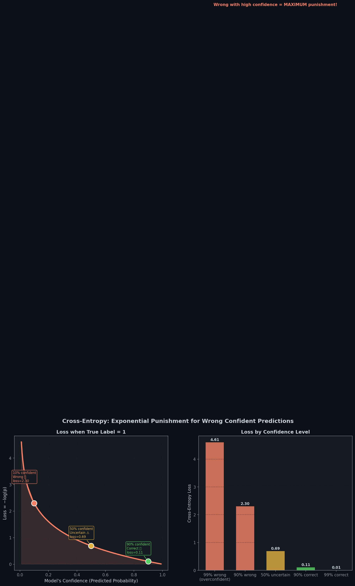
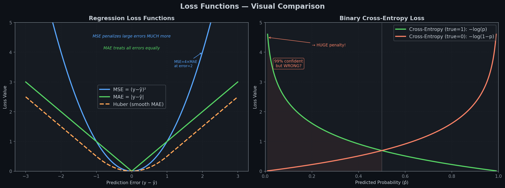
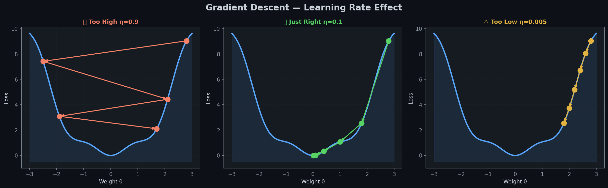
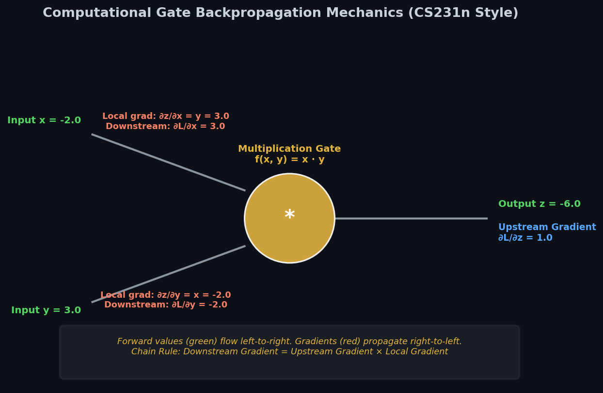
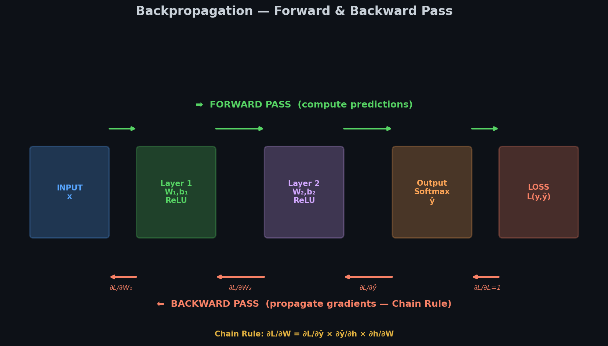
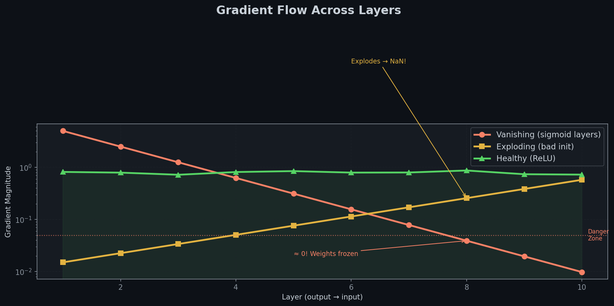
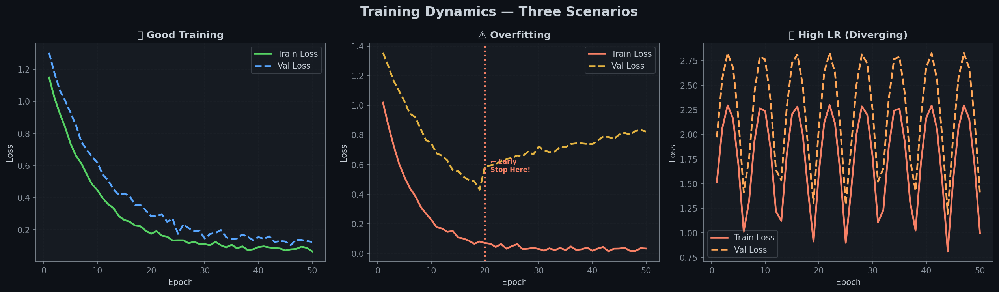

# 📉 Module 2: MLPs and Backpropagation — How Networks Actually Learn
> **Ch. 10 — Hands-On ML with Scikit-Learn, Keras & TensorFlow (Aurélien Géron)**

---

## 📌 Table of Contents
1. [Start Here: The Big Picture](#big-picture)
2. [MLP Forward Pass — Step by Step](#forward)
3. [Loss Functions — Measuring How Wrong We Are](#loss)
4. [Gradient Descent — Walking Downhill](#gradient)
5. [Backpropagation — Who Is to Blame?](#backprop)
6. [The Chain Rule (Made Simple)](#chain-rule)
7. [Vanishing & Exploding Gradients](#vanishing)
8. [Common Beginner Mistakes](#mistakes)
9. [Interview Q&A (Top 8)](#interview)
10. [⚡ One-Page Flash Card](#revision)

---

## 🌍 Start Here: The Big Picture {#big-picture}

> **TL;DR:** Training = (1) Make a prediction (forward pass), (2) Measure the error (loss), (3) Figure out whose fault it is (backpropagation), (4) Nudge all weights to reduce the error (gradient descent). Repeat thousands of times.

**The Archery Analogy 🏹**

Imagine training to hit a bullseye:
- **Forward pass** = you shoot an arrow
- **Loss** = how far from the bullseye did it land?
- **Backpropagation** = which muscle/angle caused the miss?
- **Gradient descent** = make a small adjustment to fix that muscle/angle
- **Epoch** = one full round of practice shots

After thousands of adjustments, you hit the bullseye consistently — that's what a trained neural network does!

---

## 🔄 MLP Forward Pass — Step by Step {#forward}

> **TL;DR:** In the forward pass, each layer multiplies inputs by weights, adds bias, and applies activation. The output of one layer becomes the input of the next.

### Fashion MNIST Example

The network the book uses: `784 → [300, ReLU] → [100, ReLU] → [10, Softmax]`

```
Input image (28×28 = 784 pixels):
  [0.12, 0.98, 0.05, ..., 0.77]   ← 784 pixel values
          ↓
Layer 1 (300 neurons, ReLU):
  z₁ = W₁ × input + b₁            ← shape: (300,) vector
  h₁ = ReLU(z₁)                   ← zeros out any negatives
          ↓
Layer 2 (100 neurons, ReLU):
  z₂ = W₂ × h₁ + b₂               ← shape: (100,) vector
  h₂ = ReLU(z₂)
          ↓
Output Layer (10 neurons, Softmax):
  z₃ = W₃ × h₂ + b₃               ← shape: (10,) vector
  ŷ  = Softmax(z₃)                 ← shape: (10,) probabilities summing to 1.0
```

**Example output:**
```
ŷ = [0.01, 0.02, 0.01, 0.01, 0.01, 0.85, 0.03, 0.02, 0.01, 0.03]
          ↑ T-shirt       ↑ Sandal (85%!)
Class: 5 — Sandal (correct! ✅)
```

**Layer equation (the one formula to know):**
$$\mathbf{a}^{(l)} = f\!\left(\mathbf{W}^{(l)} \mathbf{a}^{(l-1)} + \mathbf{b}^{(l)}\right)$$

Where:
- `a^(l)` = activations (output) of layer l
- `W^(l)` = weight matrix of layer l
- `b^(l)` = bias vector of layer l
- `f` = activation function (ReLU for hidden, Softmax for output)

---

## 📉 Loss Functions — Measuring How Wrong We Are {#loss}

> **TL;DR:** Loss = how wrong is your prediction? A perfect prediction = loss of 0. Terrible prediction = large loss. Training = minimize the loss.

### For Classification Problems

**Cross-Entropy Loss** (the most important one)

$$\mathcal{L} = -\frac{1}{N}\sum_{i=1}^{N} \sum_{c=1}^{C} y_{ic} \log(\hat{y}_{ic})$$

**Why "Cross-Entropy"?** It punishes **confident wrong answers** exponentially more than uncertain ones.



> 📊 **Graph:** Left = the loss curve. Right = bar chart comparing loss at different confidence levels. Notice: being 99% wrong gets MASSIVELY punished!

```python
import tensorflow as tf

# Live demo: see the punishment in action
y_true = tf.constant([1.0])   # true label = 1 (positive class)

bce = tf.keras.losses.BinaryCrossentropy()

# If you're 90% confident AND correct:
print(bce(y_true, tf.constant([0.90])).numpy())  # OUTPUT: 0.105  (small loss)

# If you're 50% confident (uncertain):
print(bce(y_true, tf.constant([0.50])).numpy())  # OUTPUT: 0.693  (moderate)

# If you're 99% confident BUT WRONG:
print(bce(y_true, tf.constant([0.01])).numpy())  # OUTPUT: 4.605  (HUGE!)
```

**Key Rule: Cross-Entropy punishes overconfident mistakes much more than cautious ones!**

**Three variants — which to use:**

| Situation | Loss Function | Example |
|-----------|-------------|---------|
| Labels are integers `[0, 5, 3, ...]` | `sparse_categorical_crossentropy` | Fashion MNIST (default) |
| Labels are one-hot `[[0,1,0,...], ...]` | `categorical_crossentropy` | Same math, different format |
| Two classes only (binary) | `binary_crossentropy` | Spam/not-spam |

```python
# Use this for Fashion MNIST (labels are 0-9 integers):
model.compile(loss="sparse_categorical_crossentropy", optimizer="sgd", metrics=["accuracy"])

# Binary classification (0 or 1):
model.compile(loss="binary_crossentropy", optimizer="sgd", metrics=["accuracy"])
```

### For Regression Problems



> 📊 **Graph:** Left = MSE vs MAE vs Huber plotted. Note how MSE explodes for large errors but MAE stays linear. Right = Cross-entropy curve for reference.

| Loss | Formula | Behavior | When to Use |
|------|---------|---------|------------|
| **MSE** | mean((y − ŷ)²) | Squares errors → large errors get MUCH higher penalty | Default regression |
| **MAE** | mean(|y − ŷ|) | Linear → treats all errors equally | When outliers are present |
| **Huber** | MSE for small errors, MAE for large | Best of both | When you have some outliers |

```python
import numpy as np

error = 2.0   # prediction is 2 units off

mse   = error**2         # = 4.0  ← squares it, large penalty
mae   = abs(error)       # = 2.0  ← just the absolute value
huber = abs(error) - 0.5 # = 1.5  ← (for |error|>1): less than MSE

# MSE penalizes a 4-unit error as 16 (4²)
# MAE penalizes a 4-unit error as just 4
print(f"MSE (error=4): {4**2}")   # OUTPUT: 16
print(f"MAE (error=4): {4}")      # OUTPUT: 4
```

---

## ⛷️ Gradient Descent — Walking Downhill {#gradient}

> **TL;DR:** Think of the loss as a mountain. Gradient descent finds the valley (minimum loss) by always stepping in the downhill direction. The learning rate controls how big each step is.

**The Mountain Analogy 🏔️**

You're blindfolded on a hilly mountain, trying to find the valley:
1. Feel the slope under your feet (= compute gradient)
2. Take one small step downhill (= update weights)
3. Repeat until you're in the valley (= loss ≈ minimum)

The **gradient** tells you which direction is uphill. You go the opposite way.



> 📊 **Graph:** Three learning rate scenarios — Too High (bounces around or diverges), Just Right (smooth descent), Too Low (barely moves).

### The Update Formula

$$\theta \leftarrow \theta - \eta \cdot \frac{\partial \mathcal{L}}{\partial \theta}$$

Where:
- **θ** = all model parameters (weights + biases)
- **η (eta)** = learning rate (e.g., 0.001)
- **∂L/∂θ** = gradient of loss with respect to parameters

### Batch Gradient Descent vs Mini-Batch SGD

| Type | How it works | Pros | Cons |
|------|-------------|------|------|
| **Batch GD** | Compute gradient on ALL 60,000 samples | Exact gradient | Very slow per update |
| **Mini-Batch SGD** ✅ | Use 32 samples at a time | Fast, GPU-friendly | Noisy gradient |
| **SGD** | Use 1 sample at a time | Very fast update | Very noisy |

**In practice: always use Mini-Batch SGD (batch size 32 is the default)**

```python
# Mini-batch SGD process for 1 epoch (60,000 samples, batch=32):
# Batch 1:   samples 0-31    → compute gradient → update weights
# Batch 2:   samples 32-63   → compute gradient → update weights
# ...
# Batch 1875: samples 59968-60000 → update weights
# = 1 epoch complete! (1875 weight updates for 1 epoch)
```

### Learning Rate — The Most Critical Setting


> 📊 **Graph:** LR Range Test curve — too small = slow, too large = diverges. Optimal = just before divergence.

| Learning Rate | What Happens | Fix |
|--------------|-------------|-----|
| Too High (e.g., 10) | Loss oscillates or explodes | Reduce by 10× |
| Too Low (e.g., 0.00001) | Learns extremely slowly | Increase by 10× |
| Just Right (e.g., 0.001) | Smooth convergence | Use this! |

**The LR Range Test (from the book):**
1. Start with a very small LR (e.g., 10⁻⁵)
2. Increase it exponentially over 500 mini-batches
3. Plot loss vs LR
4. Pick the LR just **before** the loss starts rising

> 💡 **Book tip:** "Optimal LR ≈ half of the maximum LR (where loss first starts rising)"

---

## 🔙 Backpropagation — Who Is to Blame? {#backprop}

> **TL;DR:** After making a wrong prediction, backpropagation works backward through the network to find out how much each weight contributed to the error. Then gradient descent fixes those weights.

**The Detective Analogy 🕵️**

A crime was committed (the model made a wrong prediction). Backprop is the detective that:
1. Starts at the crime scene (output, loss)
2. Works backward through the "evidence" (layers)
3. Assigns blame (gradient) to each suspect (weight)
4. The bigger the blame, the bigger the weight update


> 📊 **Graph 26:** Step-by-step gate backpropagation circuit (CS231n style). Displays forward inputs/outputs in green, incoming upstream gradient in blue, local derivatives, and final computed downstream gradients in red.


> 📊 **Graph 05:** Forward pass (green →) computes predictions. Backward pass (red ←) propagates gradients using the chain rule through each layer.

### The 3-Step Algorithm

```
STEP 1 — FORWARD PASS:
   Input x → Layer 1 → Layer 2 → Layer 3 → ŷ → Loss L
   (compute and SAVE all intermediate values for step 2)

STEP 2 — BACKWARD PASS (Backpropagation):
   Loss L → ∂L/∂W₃ → ∂L/∂W₂ → ∂L/∂W₁
   (compute gradient of loss w.r.t. EVERY weight using chain rule)

STEP 3 — UPDATE:
   For each weight: w ← w − η × ∂L/∂w
   (apply gradient descent to nudge all weights toward lower loss)
```

### Why It Matters

Before backprop (1986), there was no way to train deep networks. Once Rumelhart et al. published backprop, the entire field of deep learning became possible.

---

## 🔗 The Chain Rule — Made Simple {#chain-rule}

> **TL;DR:** If A affects B, and B affects C, then the effect of A on C = (effect of A on B) × (effect of B on C). Backprop applies this across every layer.

**Simple Analogy:** If your speed increases fuel consumption, and more fuel costs more money:
- Rate of money change w.r.t. speed = (rate of fuel w.r.t. speed) × (rate of cost w.r.t. fuel)

**In math:** If `L = f(g(w))`:
$$\frac{\partial L}{\partial w} = \frac{\partial L}{\partial g} \cdot \frac{\partial g}{\partial w}$$

### Full Chain Rule for a 2-Layer Network

Given: `z = wx + b`, `h = ReLU(z)`, `ŷ = sigmoid(h)`, `L = -(y log ŷ + (1-y) log(1-ŷ))`

**Step 1: Gradient of loss w.r.t. output ŷ:**
$$\frac{\partial L}{\partial \hat{y}} = \frac{\hat{y} - y}{\hat{y}(1 - \hat{y})}$$

**Step 2: Gradient through sigmoid:**
$$\frac{\partial \hat{y}}{\partial h} = \hat{y}(1 - \hat{y})$$

**Step 3: Gradient through ReLU:**
$$\frac{\partial h}{\partial z} = \begin{cases} 1 & \text{if } z > 0 \\ 0 & \text{if } z \leq 0 \end{cases}$$

**Step 4: Gradient w.r.t. weight:**
$$\frac{\partial z}{\partial w} = x$$

**Final gradient (chain rule combined):**
$$\frac{\partial L}{\partial w} = \frac{\partial L}{\partial \hat{y}} \cdot \frac{\partial \hat{y}}{\partial h} \cdot \frac{\partial h}{\partial z} \cdot \frac{\partial z}{\partial w} = (\hat{y} - y) \cdot x$$

### Worked Numerical Example

```
Given: x = 0.5, w = 0.4, b = 0.1, true label y = 1

Forward:
  z = 0.4 × 0.5 + 0.1 = 0.30
  h = ReLU(0.30) = 0.30
  ŷ = sigmoid(0.30) = 0.574   (predicted 57.4% probability)
  L = −log(0.574) = 0.554     (cross-entropy loss)

Backward:
  ∂L/∂ŷ = (0.574 − 1) = −0.426     (ŷ − y)
  ∂ŷ/∂h = 0.574 × (1 − 0.574) = 0.244  (sigmoid derivative)
  ∂h/∂z = 1  (z=0.30 > 0, so ReLU gradient = 1)
  ∂z/∂w = 0.5  (= x)

  ∂L/∂w = −0.426 × 0.244 × 1 × 0.5 = −0.052

Update (η = 0.1):
  w_new = 0.4 − 0.1 × (−0.052) = 0.4 + 0.0052 = 0.4052

Weight increased slightly → model now predicts higher probability for this input ✅
```

---

## ⚠️ Vanishing & Exploding Gradients {#vanishing}

> **TL;DR:** In deep networks, gradients can shrink to near-zero (vanishing) or grow to infinity (exploding) as they flow backward. Both prevent the network from learning properly.



> 📊 **Graph:** Log-scale gradient magnitude across 10 layers. Sigmoid (red) vanishes to near-zero by layer 3. ReLU (green) stays healthy throughout.

### Vanishing Gradients

**What:** Gradients get multiplied by a small number (<1) at each layer → after 10 layers, gradient ≈ 0.

**Why sigmoid is the culprit:**
- Sigmoid gradient max = 0.25 (at z=0)
- After 10 layers: 0.25¹⁰ ≈ 0.0000001 → effectively zero
- Early layers get zero gradient → weights don't update → they don't learn

```
Layer 10 gradient: 1.0
Layer 9:  × 0.25 = 0.25
Layer 8:  × 0.25 = 0.0625
Layer 7:  × 0.25 = 0.0156
...
Layer 1:  ≈ 0.0000001  ← basically ZERO. Layer 1 doesn't learn!
```

**Solutions:**
1. **Use ReLU** — gradient is 1 for z>0 (doesn't shrink!)
2. **Batch Normalization** — normalizes activations between layers (Ch. 11)
3. **Residual connections** — skip connections that provide gradient shortcuts (ResNet)

### Exploding Gradients

**What:** Gradients get multiplied by a large number (>1) at each layer → grows exponentially → NaN values.

**Solutions:**
1. **Gradient Clipping** — cap gradient magnitude (e.g., at 1.0)
2. **Better weight initialization** (Xavier, He)
3. **Smaller learning rate**

```python
# Fix exploding gradients with gradient clipping:
optimizer = tf.keras.optimizers.SGD(clipnorm=1.0)  # clip gradient if norm > 1.0
# OR:
optimizer = tf.keras.optimizers.SGD(clipvalue=0.5) # clip each gradient component to [-0.5, 0.5]
```

### Training Curves — What to Watch For



> 📊 **Graph:** Three training scenarios — Good (both curves decline together), Overfitting (train keeps going down, val goes up), Diverging (unstable, increasing loss).

| Curve Pattern | Diagnosis | Fix |
|--------------|-----------|-----|
| Both train & val loss decrease | ✅ Good training | Continue |
| Train decreasing, val increasing | ⚠️ Overfitting | Add dropout, reduce model size, more data |
| Loss oscillates wildly | ❌ LR too high | Reduce learning rate |
| Loss barely moves | ❌ LR too low | Increase learning rate |
| Loss becomes NaN | ❌ Exploding gradients | Gradient clipping, check data |

---

## ❌ Common Beginner Mistakes {#mistakes}

**1. "Just run 1000 epochs — more training = better"** ❌
> Reality: More epochs = overfitting. Use Early Stopping to find the right stopping point automatically.

**2. "Loss is decreasing — training is going well"** ❌
> Reality: Always monitor VALIDATION loss, not just training loss. Training loss always decreases; validation loss may not.

**3. "Backpropagation is a separate algorithm from gradient descent"** ❌
> Reality: Backpropagation COMPUTES the gradients. Gradient descent USES those gradients. They work together: backprop → gradient descent → repeat.

**4. "The gradient is the error"** ❌
> Reality: The gradient is the rate of change of the loss with respect to a weight. It tells us the DIRECTION and MAGNITUDE to change the weight, not the raw error.

**5. "MSE is always better than MAE"** ❌
> Reality: MSE is more affected by outliers (because it squares the error). If your data has outliers, MAE or Huber loss is more appropriate.

**6. "Smaller loss always means better model"** ❌
> Reality: If training loss is very small but validation loss is high, the model has overfit. The validation loss is the real indicator of model quality.

---

## 🎤 Interview Q&A {#interview}

**Q1: Explain the entire training loop of a neural network.**
> **A:** (1) **Forward pass**: feed input through all layers, compute prediction ŷ. (2) **Compute loss**: L = loss_function(y, ŷ). (3) **Backpropagation**: compute gradient ∂L/∂w for every weight using the chain rule, working backward from output to input. (4) **Gradient descent**: update each weight: w ← w − η×(∂L/∂w). (5) Repeat for all mini-batches, for all epochs.

**Q2: What is backpropagation and why is it important?**
> **A:** Backpropagation is an algorithm that efficiently computes the gradient of the loss function with respect to every weight in the network, by applying the chain rule of calculus backward through the computational graph. It's important because without it, there was no efficient way to train deep networks. It's what made deep learning possible (1986 breakthrough by Rumelhart et al.).

**Q3: What is the vanishing gradient problem?**
> **A:** In deep networks using sigmoid/tanh activations, the gradient gets multiplied by a value < 1 (the activation's derivative) at each layer during backprop. After many layers, the gradient becomes extremely small (e.g., 0.25^10 ≈ 0.000001), so early layers receive nearly zero gradient and don't learn. Solution: use ReLU (gradient = 1 for positive inputs) or batch normalization.

**Q4: What is gradient descent and what does the learning rate control?**
> **A:** Gradient descent is an optimization algorithm that updates weights in the direction that reduces the loss: `w ← w - η × ∂L/∂w`. The learning rate η controls the step size. Too high: overshoots the minimum, diverges. Too low: converges extremely slowly. Typical starting value: 0.001.

**Q5: What's the difference between MSE and Cross-Entropy loss?**
> **A:** MSE (mean squared error) is for regression: penalizes the squared distance between predicted number and true number. Cross-entropy is for classification: penalizes how wrong the predicted probability is for the true class. Cross-entropy heavily penalizes overconfident wrong predictions (e.g., predicting 99% for the wrong class).

**Q6: What is an epoch vs a batch vs an iteration?**
> **A:** **Batch** = a small subset of data (e.g., 32 samples) used for one weight update. **Iteration** = one forward + backward pass on one batch (= one weight update). **Epoch** = one full pass through the entire dataset. If you have 60,000 samples and batch size = 32: one epoch = 60000/32 ≈ 1875 iterations.

**Q7: How does the chain rule enable backpropagation?**
> **A:** The chain rule says: if A affects B and B affects C, then ∂C/∂A = (∂C/∂B) × (∂B/∂A). In a neural network, the loss depends on the output which depends on hidden layers which depend on weights. The chain rule lets us efficiently compute ∂L/∂w at any layer by multiplying the local gradients going backward: ∂L/∂w = ∂L/∂ŷ × ∂ŷ/∂h × ∂h/∂z × ∂z/∂w.

**Q8: What is gradient clipping and when would you use it?**
> **A:** Gradient clipping caps the magnitude of gradients during backpropagation (e.g., if gradient norm > 1.0, scale it down). Used when you have exploding gradients — where gradients grow exponentially across layers and produce NaN values. Common in RNNs, where long sequences cause many gradient multiplications.

---

## ⚡ One-Page Flash Card {#revision}

```
╔══════════════════════════════════════════════════════════════════╗
║               MODULE 2 — FLASH CARD                             ║
╠══════════════════════════════════════════════════════════════════╣
║                                                                  ║
║  TRAINING LOOP (4 steps):                                        ║
║  1. Forward pass: input → layers → ŷ (prediction)              ║
║  2. Loss: L = how wrong is ŷ vs y?                             ║
║  3. Backprop: compute ∂L/∂w for EVERY weight (chain rule)      ║
║  4. Update: w ← w − η × ∂L/∂w                                 ║
║                                                                  ║
║  LOSS FUNCTIONS:                                                 ║
║  Classification → cross-entropy (punishes confident mistakes)   ║
║    Integer labels → sparse_categorical_crossentropy             ║
║    One-hot labels → categorical_crossentropy                    ║
║    Binary → binary_crossentropy                                 ║
║  Regression     → mse (default) or mae (outlier-robust)        ║
║                                                                  ║
║  GRADIENT DESCENT:                                               ║
║  θ ← θ − η × ∇L(θ)                                            ║
║  LR too high → diverges | LR too low → too slow               ║
║  Use LR Range Test to find optimal LR                          ║
║                                                                  ║
║  BACKPROP = chain rule backward through layers                  ║
║  ∂L/∂w = ∂L/∂ŷ × ∂ŷ/∂h × ∂h/∂z × ∂z/∂w                    ║
║                                                                  ║
║  VANISHING GRADIENT:                                             ║
║  Cause: sigmoid/tanh have gradient < 1 → shrinks each layer    ║
║  Fix: Use ReLU (gradient = 1) or Batch Norm                    ║
║                                                                  ║
║  TRAINING CURVE RED FLAGS:                                       ║
║  Val loss > train loss by a lot → overfitting                  ║
║  Loss oscillates / NaN → LR too high                           ║
║  Both losses high → underfitting, need bigger model            ║
╚══════════════════════════════════════════════════════════════════╝
```

---

**🔗 Previous →** [01 — Biological to Artificial Neurons](01_Biological_to_Artificial_Neurons.md)
**🔗 Next →** [03 — Regression and Classification MLPs](03_Regression_and_Classification_MLPs.md)
