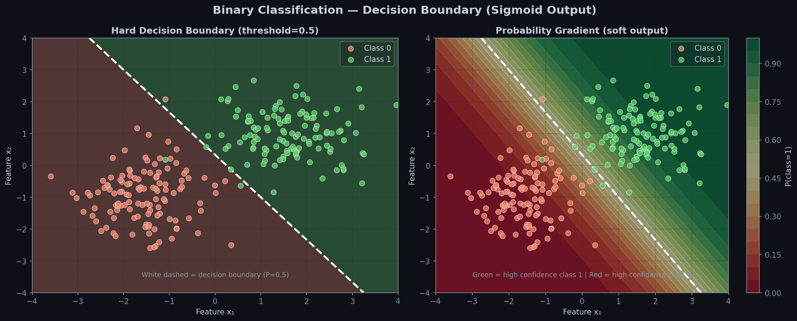
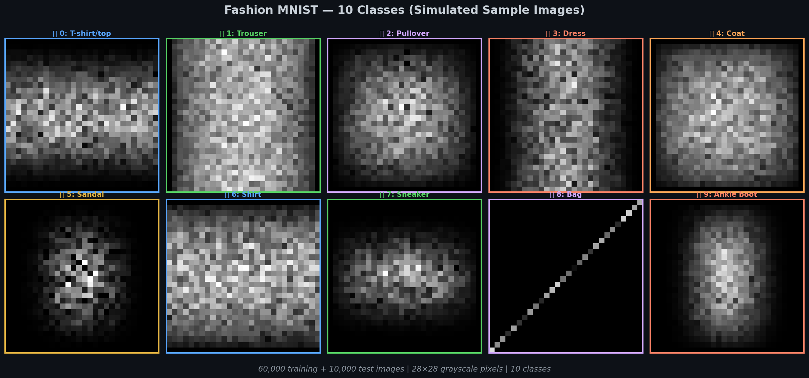
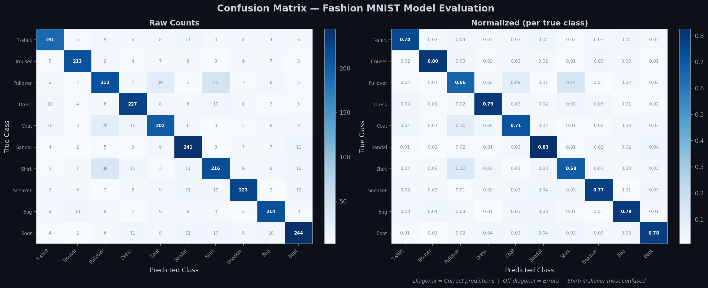

# 📊 Module 3: Regression and Classification MLPs — What Should Your Network Output?
> **Ch. 10 — Hands-On ML with Scikit-Learn, Keras & TensorFlow (Aurélien Géron)**

---

## 📌 Table of Contents
1. [Start Here: The Golden Rule](#big-picture)
2. [MLP for Regression](#regression)
3. [MLP for Binary Classification](#binary)
4. [MLP for Multi-Class Classification](#multiclass)
5. [Output Layer Design — The Cheat Sheet](#output-design)
6. [Loss Functions — Which to Pick?](#loss)
7. [Metrics — How Do We Know If It's Working?](#metrics)
8. [Fashion MNIST — Full Case Study](#fashion)
9. [Common Beginner Mistakes](#mistakes)
10. [Interview Q&A (Top 7)](#interview)
11. [⚡ One-Page Flash Card](#revision)

---

## 🌍 Start Here: The Golden Rule {#big-picture}

> **TL;DR:** The output layer design completely depends on your task. Get this wrong and your entire model is wrong. This module teaches you exactly how to design it correctly every time.

**The "Answer Format" Analogy:**

If someone asks you "What is 2 + 2?", you say "4" — a number.
If someone asks "Is this spam?", you say "Yes" or "No" — a category.
If someone asks "What breed is this dog?", you say "Labrador" — one of many categories.

Your neural network must output answers in the **right format** for its task. This is entirely determined by:
1. **Output layer neurons** — how many?
2. **Output activation** — which function?
3. **Loss function** — how do we measure error?

---

## 📈 MLP for Regression {#regression}

> **TL;DR:** Regression = predicting a number. Output: 1 neuron, NO activation, MSE loss.

**Examples:** House price prediction, temperature forecasting, age estimation from a photo.

### Architecture
```
Input Features (e.g., 8 house features)
         ↓
  Dense(30, ReLU)      ← hidden layer 1
         ↓
  Dense(30, ReLU)      ← hidden layer 2
         ↓
  Dense(1)             ← output: 1 neuron, NO activation
         ↓
  ŷ = e.g., $342,500   ← an unbounded real number
```

**Why NO activation on output?**
- House prices can be any positive number (unbounded)
- Sigmoid would limit output to (0,1) — terrible for prices!
- Softmax would limit output to probabilities — wrong!
- Linear (no activation) = output can be any real number ✅

### Complete Keras Code

```python
import tensorflow as tf
from tensorflow import keras

# California Housing Dataset (from book)
model = keras.models.Sequential([
    keras.layers.InputLayer(input_shape=[8]),    # 8 features
    keras.layers.Dense(30, activation="relu"),   # hidden layer 1
    keras.layers.Dense(30, activation="relu"),   # hidden layer 2
    keras.layers.Dense(1)                        # output: 1 number, NO activation!
])

model.compile(
    loss="mse",           # Mean Squared Error — standard for regression
    optimizer="sgd",
    metrics=["mae"]       # Mean Absolute Error — easier to interpret ($X off)
)

history = model.fit(
    X_train, y_train,
    epochs=20,
    validation_data=(X_valid, y_valid)
)

# OUTPUT (last epoch, example):
# loss: 0.3821 - mae: 0.4123 - val_loss: 0.4102 - val_mae: 0.4456

# Evaluate on test set
mse_test, mae_test = model.evaluate(X_test, y_test)
print(f"Test MAE: ${mae_test * 100000:.0f}")  # OUTPUT: Test MAE: $41,230

# Predict on new data
X_new = X_test[:3]                     # 3 new houses
y_pred = model.predict(X_new)
print(y_pred)                           # OUTPUT: [[1.234], [2.891], [3.102]]
# (values in $100k, so 1.234 = $123,400)
```

### Model Summary (what model.summary() shows)
```
Layer (type)        Output Shape    Param #
============================================
InputLayer          (None, 8)       0
Dense               (None, 30)      270     ← 8×30 + 30 biases
Dense_1             (None, 30)      930     ← 30×30 + 30 biases
Dense_2             (None, 1)       31      ← 30×1 + 1 bias
============================================
Total params: 1,231
```

---

## 🔵 MLP for Binary Classification {#binary}

> **TL;DR:** Binary = two classes (yes/no, spam/not-spam). Output: 1 neuron, Sigmoid activation, binary_crossentropy loss.

**Examples:** Email spam detection, disease diagnosis (sick/healthy), fraud detection.

### Architecture
```
Input Features
       ↓
Dense(30, ReLU)     ← hidden layers learn patterns
       ↓
Dense(30, ReLU)
       ↓
Dense(1, Sigmoid)   ← output: probability between 0.0 and 1.0
       ↓
ŷ = 0.73            ← "73% chance this is spam"
       ↓
class = 1  (because 0.73 > 0.5 threshold)
```

### Decision Boundary Visualization



> 📊 **Graph:** Left = hard threshold at P=0.5. Right = probability gradient (deep green=very confident class 1, deep red=very confident class 0).

### Complete Keras Code

```python
model = keras.models.Sequential([
    keras.layers.Dense(30, activation="relu", input_shape=[n_features]),
    keras.layers.Dense(30, activation="relu"),
    keras.layers.Dense(1, activation="sigmoid")   # key: sigmoid for binary!
])

model.compile(
    loss="binary_crossentropy",
    optimizer="sgd",
    metrics=["accuracy"]
)

# Predictions:
y_proba = model.predict(X_new)           # OUTPUT: [[0.73], [0.12], [0.88]]
y_class  = (y_proba > 0.5).astype(int)  # OUTPUT: [[1],    [0],    [1]]

# Interpretation:
# Sample 0: 73% spam → predicted SPAM ✅
# Sample 1: 12% spam → predicted NOT SPAM ✅
# Sample 2: 88% spam → predicted SPAM ✅
```

**Why Sigmoid for output?**
```python
# Sigmoid squashes any number into (0, 1):
sigmoid(-10) ≈ 0.00005   ← almost certainly class 0
sigmoid(0)   = 0.500     ← completely uncertain
sigmoid(10)  ≈ 0.99995   ← almost certainly class 1
```

---

## 🌈 MLP for Multi-Class Classification {#multiclass}

> **TL;DR:** Multi-class = many mutually exclusive categories. Output: N neurons (one per class), Softmax activation, sparse_categorical_crossentropy loss.

**Examples:** Handwritten digit recognition (0-9), Fashion MNIST (10 clothing types), language detection (100 languages).

### Architecture
```
Input (784 pixels)
        ↓
Dense(300, ReLU)       ← finds low-level patterns
        ↓
Dense(100, ReLU)       ← finds higher-level patterns
        ↓
Dense(10, Softmax)     ← 10 outputs, one per class
        ↓
[0.01, 0.02, 0.01, 0.01, 0.01, 0.85, 0.03, 0.02, 0.01, 0.03]
  T-shirt Trouser ...  Sandal (85%!)   ... Boot
```

**Softmax ensures all 10 outputs sum to exactly 1.0** — they're probabilities, not arbitrary scores.

### Fashion MNIST Dataset — Visual Guide



> 📊 **Graph:** All 10 clothing categories. Notice how similar Shirt, T-shirt, and Pullover look — that's why they're commonly confused by the model.

### Complete Keras Code for Fashion MNIST

```python
import tensorflow as tf
from tensorflow import keras

# Load data
(X_train_full, y_train_full), (X_test, y_test) = keras.datasets.fashion_mnist.load_data()

print(X_train_full.shape)   # OUTPUT: (60000, 28, 28)
print(X_test.shape)         # OUTPUT: (10000, 28, 28)
print(X_train_full.dtype)   # OUTPUT: uint8
print(X_train_full.min(), X_train_full.max())  # OUTPUT: 0 255

# Step 1: Normalize pixels from [0, 255] to [0.0, 1.0]
# WHY? Gradient descent works much better when features are on similar scales
X_train_full = X_train_full / 255.0
X_test       = X_test / 255.0

# Step 2: Create validation set (5,000 samples from training)
X_valid = X_train_full[:5000];  y_valid = y_train_full[:5000]
X_train = X_train_full[5000:];  y_train = y_train_full[5000:]

# Class names for interpretation
class_names = ["T-shirt/top", "Trouser", "Pullover", "Dress", "Coat",
               "Sandal", "Shirt", "Sneaker", "Bag", "Ankle boot"]

# Step 3: Build model
model = keras.models.Sequential([
    keras.layers.Flatten(input_shape=[28, 28]),  # 28×28 → 784 (flatten image to 1D)
    keras.layers.Dense(300, activation="relu"),
    keras.layers.Dense(100, activation="relu"),
    keras.layers.Dense(10, activation="softmax") # 10 classes → softmax
])

# Step 4: Compile
model.compile(
    loss="sparse_categorical_crossentropy",  # labels are integers 0-9
    optimizer="sgd",
    metrics=["accuracy"]
)

# Step 5: Train
history = model.fit(
    X_train, y_train,
    epochs=30,
    validation_data=(X_valid, y_valid)
)
# OUTPUT (epoch 30 example):
# loss: 0.2812 - accuracy: 0.8974 - val_loss: 0.3241 - val_accuracy: 0.8823

# Step 6: Evaluate
test_loss, test_accuracy = model.evaluate(X_test, y_test)
print(f"Test accuracy: {test_accuracy:.1%}")  # OUTPUT: Test accuracy: 88.2%

# Step 7: Predict
X_new = X_test[:3]
y_proba = model.predict(X_new)      # shape: (3, 10) — probabilities for 3 samples

y_pred = y_proba.argmax(axis=-1)    # OUTPUT: array([9, 2, 1])
class_names[y_pred[0]]              # OUTPUT: 'Ankle boot'
```

### Why `Flatten`?
```python
# Images are 2D: shape (28, 28) = a grid
# Dense layers need 1D input: shape (784,) = a flat list
# Flatten converts: (28, 28) → (784,)

keras.layers.Flatten(input_shape=[28, 28])
# Equivalent to: keras.layers.Reshape([784])
```

---

## 📐 Output Layer Design — The Cheat Sheet {#output-design}

> **This table is the most important thing to memorize in this module.**

| Task | # Output Neurons | Output Activation | Loss Function |
|------|-----------------|------------------|---------------|
| **Regression** (1 value) | 1 | None (linear) | `mse` or `mae` |
| **Regression** (n values) | n | None (linear) | `mse` |
| **Binary Classification** | 1 | `sigmoid` | `binary_crossentropy` |
| **Multi-Label** (multiple tags) | # possible tags | `sigmoid` (each independent) | `binary_crossentropy` |
| **Multi-Class Classification** | # classes | `softmax` | `sparse_categorical_crossentropy` |

### Multi-Class vs Multi-Label — Common Confusion

| | Multi-Class | Multi-Label |
|--|------------|------------|
| **Question** | "Which ONE category?" | "Which categories?" |
| **Example** | "Is this a cat, dog, or bird?" | "What tags does this photo have?" (cat AND outdoor AND sunny) |
| **Outputs** | Softmax — all probabilities sum to 1 | Sigmoid — each probability independent |
| **Code** | `Dense(3, activation="softmax")` | `Dense(n_tags, activation="sigmoid")` |
| **Loss** | `sparse_categorical_crossentropy` | `binary_crossentropy` |

---

## 📉 Loss Functions — Which to Pick? {#loss}

> **TL;DR:** If it's a number → MSE. If it's a category → cross-entropy. The cross-entropy variant depends on your label format.

**Decision flowchart:**
```
Is your output a NUMBER?
  → YES: Use MSE (default) or MAE (if outliers exist)

Is your output a CATEGORY?
  → Binary (2 classes)?  → binary_crossentropy
  → Multiple exclusive classes?
      → Integer labels (0, 5, 3, ...)?  → sparse_categorical_crossentropy  ⭐ most common
      → One-hot labels ([0,1,0,...])?   → categorical_crossentropy
  → Multiple tags possible per sample?  → binary_crossentropy (with sigmoid)
```

---

## 📊 Metrics — How Do We Know If It's Working? {#metrics}

> **TL;DR:** Metrics tell you how good your model is. For classification, use accuracy when balanced, F1 when imbalanced. For regression, use MAE (interpretable in original units).

### Classification Metrics

**Accuracy** = fraction of correct predictions
$$\text{Accuracy} = \frac{\text{Correct Predictions}}{\text{Total Predictions}}$$

⚠️ **Accuracy trap:** If 99% of emails are NOT spam, a model that always says "not spam" gets 99% accuracy — but is completely useless!

**Precision, Recall, F1** (for imbalanced datasets):
- **Precision** = "Of all samples I said were POSITIVE, how many actually were?" → avoids false alarms
- **Recall** = "Of all actual POSITIVES, how many did I find?" → avoids missed detections
- **F1** = Harmonic mean: `2 × Precision × Recall / (Precision + Recall)` → balanced metric

### Confusion Matrix — Where Exactly Does Your Model Fail?



> 📊 **Graph:** Left = raw counts. Right = normalized per true class. Notice the off-diagonal dark cells: Shirt is frequently confused with Pullover and T-shirt (they look similar!).

```python
from sklearn.metrics import confusion_matrix, classification_report

y_pred = model.predict(X_test).argmax(axis=-1)
cm = confusion_matrix(y_test, y_pred)

print(classification_report(y_test, y_pred, target_names=class_names))
# OUTPUT (example):
#                  precision  recall  f1-score
# T-shirt/top       0.82      0.87      0.84
# Trouser           0.98      0.98      0.98
# Pullover          0.77      0.69      0.73  ← confused with Shirt!
# Dress             0.85      0.91      0.88
# ...
# accuracy                              0.89
```

### Regression Metrics

| Metric | Formula | Interpretation | When to Use |
|--------|---------|---------------|------------|
| **MAE** | mean(\|y − ŷ\|) | Average error in original units — easy to explain | Default regression metric |
| **MSE** | mean((y − ŷ)²) | Large errors penalized more | When large errors are especially bad |
| **RMSE** | √MSE | Same units as target, penalizes large errors | Reporting metric |
| **R²** | 1 − SS_res/SS_tot | 1 = perfect, 0 = as bad as predicting the mean | Proportion of variance explained |

---

## 👗 Fashion MNIST — Full Case Study {#fashion}

| Class | Label | Common Confusions |
|-------|-------|-----------------|
| T-shirt/top | 0 | Shirt, Pullover |
| Trouser | 1 | Rarely confused |
| Pullover | 2 | Coat, Shirt |
| Dress | 3 | Coat |
| Coat | 4 | Pullover |
| Sandal | 5 | Sneaker |
| Shirt | 6 | T-shirt, Pullover |
| Sneaker | 7 | Ankle boot |
| Bag | 8 | Rarely confused |
| Ankle boot | 9 | Sneaker |

```python
# Understanding predictions:
X_sample = X_test[0:1]     # pick one test image
y_proba  = model.predict(X_sample)

print(y_proba.round(3))
# OUTPUT: [[0.00, 0.00, 0.01, 0.00, 0.00, 0.01, 0.00, 0.02, 0.00, 0.96]]
#   T-shirt   Trouser  Pullover  Dress Coat Sandal Shirt Sneaker  Bag  Boot

# The model is 96% confident this is an Ankle Boot (class 9)
predicted_class = y_proba.argmax(axis=-1)[0]
print(f"Predicted: {class_names[predicted_class]}")  # OUTPUT: Ankle boot

# Plotting training history:
import pandas as pd, matplotlib.pyplot as plt
pd.DataFrame(history.history).plot(figsize=(8, 5))
plt.title("Training History")
plt.show()
```

---

## ❌ Common Beginner Mistakes {#mistakes}

**1. "Using softmax for binary classification"** ❌
> Reality: For binary, use sigmoid (1 output neuron). Softmax on 2 neurons works but is redundant — the two probabilities always sum to 1 anyway.

**2. "Forgetting to normalize inputs"** ❌
> Reality: Gradient descent is very sensitive to feature scale. If feature 1 ∈ [0, 1] and feature 2 ∈ [0, 1000000], training is extremely slow or unstable. Always normalize: `X / 255.0` for images, `StandardScaler` for tabular data.

**3. "Using MSE loss for classification"** ❌
> Reality: MSE doesn't reflect the probability nature of classification. Cross-entropy is specifically designed for comparing probability distributions.

**4. "Using accuracy for imbalanced datasets"** ❌
> Reality: If 99% of samples are class 0, a model always predicting 0 gets 99% accuracy but is useless. Use precision, recall, and F1 score instead.

**5. "Forgetting to call .argmax() on predictions"** ❌
> Reality: `model.predict()` returns raw probabilities for each class. To get the predicted class, you need: `y_pred = model.predict(X).argmax(axis=-1)`

**6. "Confusing sparse_categorical_crossentropy vs categorical_crossentropy"** ❌
> Reality: They compute the same loss. The only difference is the label format:
> - `sparse_categorical_crossentropy` → labels are integers: `[3, 7, 2, 0, ...]`
> - `categorical_crossentropy` → labels are one-hot: `[[0,0,0,1,...], [0,...,1,0], ...]`

---

## 🎤 Interview Q&A {#interview}

**Q1: What activation function and loss do you use for multi-class classification?**
> **A:** Softmax activation on the output layer (one neuron per class). Loss: `sparse_categorical_crossentropy` if labels are integers, or `categorical_crossentropy` if one-hot encoded. Both compute the same mathematical loss — just different label formats.

**Q2: Why use sigmoid (not softmax) for binary classification?**
> **A:** Sigmoid outputs a single probability p ∈ (0,1) for the positive class. The probability of the negative class is automatically 1-p. Softmax on 2 neurons would work but is redundant — the two probabilities must sum to 1, so they're not independent. Sigmoid is simpler and equivalent.

**Q3: What's the difference between multi-class and multi-label classification?**
> **A:** Multi-class: each sample belongs to exactly ONE class (mutually exclusive). Use softmax. Multi-label: each sample can have MULTIPLE labels simultaneously (e.g., an image tagged as "cat", "outdoor", "sunny"). Use sigmoid on each output independently, since each label is a separate binary decision.

**Q4: Why is normalizing inputs important?**
> **A:** Gradient descent updates weights proportional to the gradient. If features have very different scales (e.g., age ∈ [0,100] vs income ∈ [0,100000]), the loss function is poorly conditioned — it has a very elongated gradient landscape. Normalization makes the landscape more spherical, so gradient descent converges much faster.

**Q5: What does the Flatten layer do and why is it needed?**
> **A:** Flatten reshapes a multi-dimensional input to 1D. A 28×28 image is a 2D matrix, but Dense layers expect a 1D vector as input. `Flatten()` converts (28, 28) → (784,) without any computation (no learned parameters).

**Q6: When would you use MAE instead of MSE as a loss function?**
> **A:** MAE is more robust to outliers. If your regression target has extreme values (e.g., house prices with some mansions worth 100× more), MSE (which squares errors) would dominate on those outliers. MAE treats all errors proportionally. Use Huber loss if you want a smooth combination of both.

**Q7: How do you interpret the output of model.predict() for multi-class classification?**
> **A:** `model.predict()` returns a 2D array of shape (n_samples, n_classes), where each row is a probability distribution over classes (summing to 1 if softmax is used). To get the predicted class: `y_pred = probabilities.argmax(axis=-1)` — this gives the index of the highest probability for each sample.

---

## ⚡ One-Page Flash Card {#revision}

```
╔══════════════════════════════════════════════════════════════════╗
║               MODULE 3 — FLASH CARD                             ║
╠══════════════════════════════════════════════════════════════════╣
║                                                                  ║
║  OUTPUT DESIGN CHEAT SHEET:                                      ║
║  ─────────────────────────────────────────────────────────────  ║
║  Regression:    Dense(1)   + None (no activation) + mse        ║
║  Binary:        Dense(1)   + sigmoid              + binary_ce   ║
║  Multi-class:   Dense(n)   + softmax              + sparse_ce   ║
║  Multi-label:   Dense(n)   + sigmoid              + binary_ce   ║
║                                                                  ║
║  FASHION MNIST ARCHITECTURE:                                     ║
║  Flatten(28,28) → Dense(300,ReLU) → Dense(100,ReLU)            ║
║  → Dense(10, softmax)                                           ║
║                                                                  ║
║  THE STANDARD TRAINING RECIPE:                                   ║
║  1. Load data + normalize (X / 255 for images)                  ║
║  2. Split: train / validation / test                            ║
║  3. Build model (Sequential or Functional)                      ║
║  4. model.compile(loss=..., optimizer=..., metrics=[...])       ║
║  5. model.fit(X_train, y_train, epochs=30, validation=...)      ║
║  6. model.evaluate(X_test, y_test)                              ║
║  7. model.predict(X_new).argmax(axis=-1)                       ║
║                                                                  ║
║  CONFUSION MATRIX — reading it:                                  ║
║  Diagonal = correct predictions                                 ║
║  Off-diagonal = errors (what was confused with what)            ║
║                                                                  ║
║  ACCURACY TRAP:                                                  ║
║  Imbalanced data → use Precision, Recall, F1!                  ║
║  F1 = 2×P×R/(P+R) — balanced metric                           ║
╚══════════════════════════════════════════════════════════════════╝
```

---

**🔗 Previous →** [02 — MLPs and Backpropagation](02_MLPs_and_Backpropagation_How_Networks_Actually_Learn.md)
**🔗 Next →** [04 — Implementing MLPs with Keras](04_Implementing_MLPs_with_Keras_The_Three_APIs.md)
