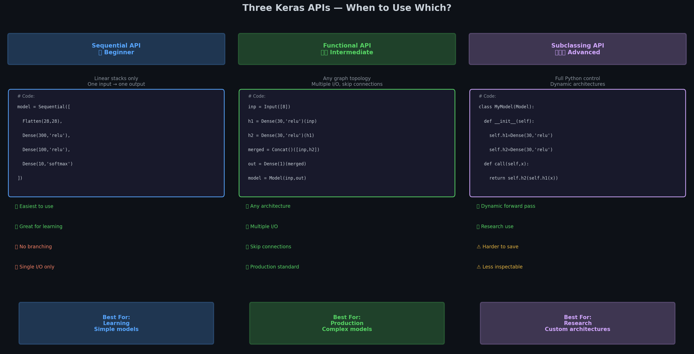
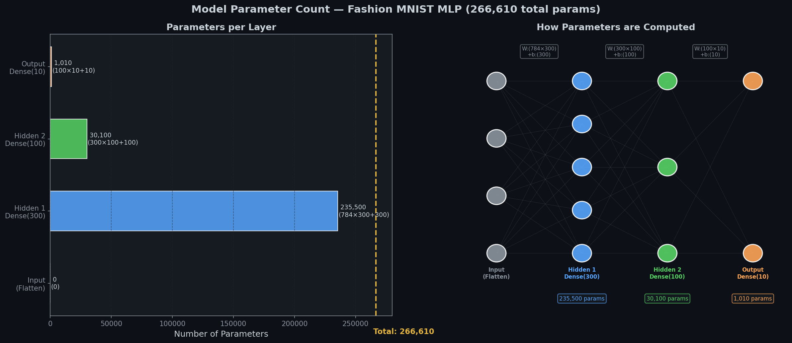
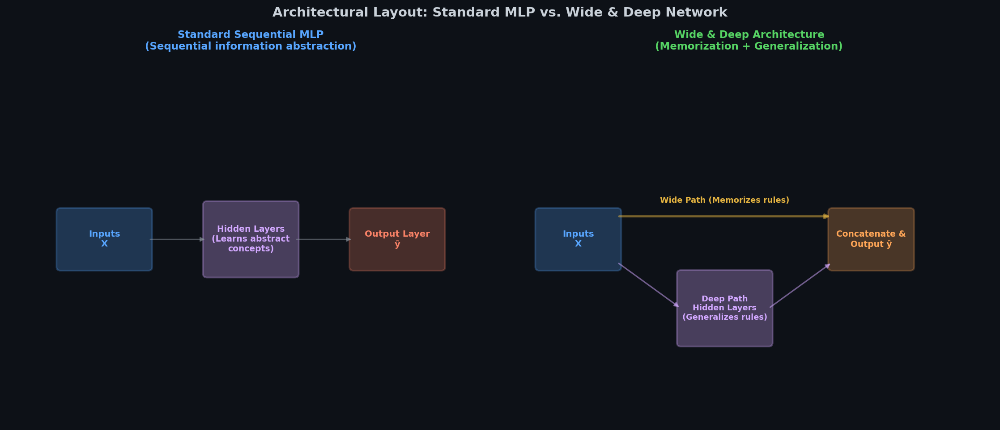
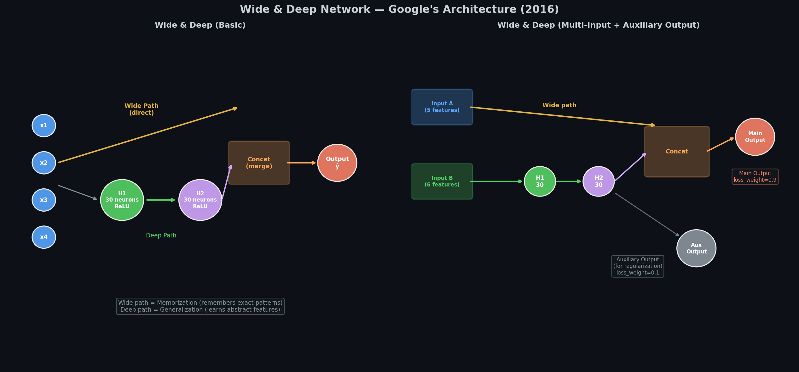
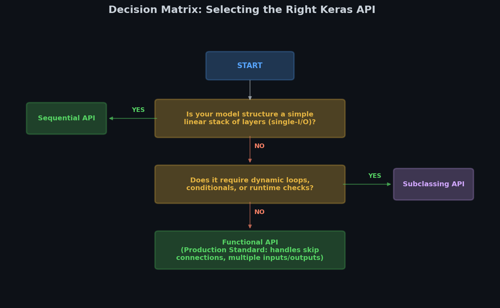

# 🏗️ Module 4: Implementing MLPs with Keras — The Three APIs
> **Ch. 10 — Hands-On ML with Scikit-Learn, Keras & TensorFlow (Aurélien Géron)**

---

## 📌 Table of Contents
1. [Start Here: Three Ways to Build a Model](#big-picture)
2. [Sequential API — The Simplest Way](#sequential)
3. [Functional API — For Complex Architectures](#functional)
4. [Subclassing API — Full Python Control](#subclass)
5. [The Wide & Deep Network (Google's Architecture)](#wide-deep)
6. [Understanding Parameters (model.summary())](#params)
7. [Which API Should I Use?](#which-api)
8. [Common Beginner Mistakes](#mistakes)
9. [Interview Q&A (Top 7)](#interview)
10. [⚡ One-Page Flash Card](#revision)

---

## 🌍 Start Here: Three Ways to Build a Model {#big-picture}

> **TL;DR:** Keras gives you 3 ways to build a model. Sequential = beginner (stacking blocks). Functional = professional (any topology). Subclassing = researcher (full Python control). Know all 3 for interviews.

**The LEGO Analogy 🧱:**
- **Sequential API** = LEGO instruction booklet — follow the steps in order, left to right, one layer at a time
- **Functional API** = free-build LEGO — connect pieces in any creative topology you want
- **Subclassing API** = design your own LEGO pieces — define exactly what each piece does internally



> 📊 **Diagram:** Side-by-side visual with code examples, pros/cons, and best-use scenarios for all 3 APIs.

---

## 1️⃣ Sequential API — The Simplest Way {#sequential}

> **TL;DR:** Stack layers like a stack of pancakes. Data flows in one direction: first layer → second layer → ... → output. Simple, clear, recommended for beginners.

**When to use:** Linear pipeline, one input, one output, no branching.

### Building the Fashion MNIST Model

```python
import tensorflow as tf
from tensorflow import keras

model = keras.models.Sequential([
    keras.layers.Flatten(input_shape=[28, 28]),       # layer 0: 28×28 → 784
    keras.layers.Dense(300, activation="relu"),        # layer 1: 300 neurons
    keras.layers.Dense(100, activation="relu"),        # layer 2: 100 neurons
    keras.layers.Dense(10, activation="softmax")       # layer 3: 10 outputs
])
```

**Alternative syntax (adding layers one by one):**
```python
model = keras.models.Sequential()
model.add(keras.layers.Flatten(input_shape=[28, 28]))
model.add(keras.layers.Dense(300, activation="relu", name="hidden1"))
model.add(keras.layers.Dense(100, activation="relu", name="hidden2"))
model.add(keras.layers.Dense(10, activation="softmax", name="output"))
```

### Accessing Layers and Weights

```python
# Get all layers:
print(model.layers)
# OUTPUT: [<Flatten>, <Dense>, <Dense>, <Dense>]

# Get a specific layer by name or index:
hidden1 = model.get_layer("hidden1")  # by name
hidden1 = model.layers[1]             # by index

# Get weights and biases of a layer:
weights, biases = hidden1.get_weights()
print(weights.shape)   # OUTPUT: (784, 300) — 784 inputs → 300 neurons
print(biases.shape)    # OUTPUT: (300,)     — one bias per neuron
print(weights[0, :5])  # OUTPUT: [0.024, -0.031, 0.012, ...] (random-ish)
```

### Understanding model.summary()

```python
model.summary()
# OUTPUT:
# Model: "sequential"
# _________________________________________________________________
# Layer (type)         Output Shape       Param #
# =================================================================
# flatten (Flatten)    (None, 784)        0         ← no params (just reshapes)
# hidden1 (Dense)      (None, 300)        235,500   ← 784×300 weights + 300 biases
# hidden2 (Dense)      (None, 100)        30,100    ← 300×100 weights + 100 biases
# output (Dense)       (None, 10)         1,010     ← 100×10  weights + 10 biases
# =================================================================
# Total params: 266,610
# Trainable params: 266,610
# Non-trainable params: 0
```



> 📊 **Graph:** Parameter distribution per layer. Layer 1 (hidden1) alone has 235,500 parameters — 88% of the total! This is because it connects 784 inputs to 300 neurons.

**Parameter count formula:**
```
params in Dense layer = (inputs × neurons) + neurons (biases)
                      = neurons × (inputs + 1)

hidden1: 784 × 300 + 300 = 235,200 + 300 = 235,500
hidden2: 300 × 100 + 100 = 30,000 + 100  = 30,100
output:  100 × 10  + 10  = 1,000  + 10   = 1,010
TOTAL:                                      266,610
```

### Compiling and Training

```python
model.compile(
    loss="sparse_categorical_crossentropy",
    optimizer="sgd",
    metrics=["accuracy"]
)

history = model.fit(
    X_train, y_train,
    epochs=30,
    validation_data=(X_valid, y_valid)
)
# OUTPUT (last epoch example):
# Epoch 30/30
# 1719/1719 [==============================] - 2s 1ms/step
# loss: 0.2812 - accuracy: 0.8974 - val_loss: 0.3241 - val_accuracy: 0.8823
```

---

## 2️⃣ Functional API — For Complex Architectures {#functional}

> **TL;DR:** Functional API builds the model as a computation graph. You explicitly define each layer's input. This allows branching, merging, multiple inputs, and multiple outputs.

**When to use:** Skip connections, multiple inputs, multiple outputs, any non-linear architecture.

### Why You Need It

Sequential only allows: `A → B → C → D`

Functional allows:
```
A ────────────────────────────────────────────┐
A → B → C ───────────────────────────────────→ Concatenate → D → Output
A → B → C → B' → C' ─────────────────────────┘ (merge paths)
```

### Basic Example (Same as Sequential)

```python
# Step 1: Define input
inputs = keras.layers.Input(shape=[28, 28], name="input_images")

# Step 2: Define each layer and pass the PREVIOUS LAYER as input
x = keras.layers.Flatten()(inputs)
x = keras.layers.Dense(300, activation="relu")(x)
x = keras.layers.Dense(100, activation="relu")(x)
outputs = keras.layers.Dense(10, activation="softmax")(x)

# Step 3: Create the model by specifying inputs and outputs
model = keras.Model(inputs=inputs, outputs=outputs)
```

### Multi-Input Example (Wide & Deep)

This is the famous architecture from Google (2016):

```python
# Two separate inputs
input_A = keras.layers.Input(shape=[5], name="wide_input")   # 5 features go wide
input_B = keras.layers.Input(shape=[6], name="deep_input")   # 6 features go deep

# Deep path: goes through hidden layers to learn complex patterns
hidden1 = keras.layers.Dense(30, activation="relu")(input_B)
hidden2 = keras.layers.Dense(30, activation="relu")(hidden1)

# Concatenate wide input directly with deep path output
concat = keras.layers.Concatenate()([input_A, hidden2])

# Final output
output = keras.layers.Dense(1, name="main_output")(concat)

# Create model with multiple inputs
model = keras.Model(inputs=[input_A, input_B], outputs=[output])

# Training with multiple inputs:
model.fit(
    (X_train_A, X_train_B),    # pass as a tuple!
    y_train,
    ...
)
```

### Multi-Output Example (with Auxiliary Output)

```python
# Deep path
hidden1 = keras.layers.Dense(30, activation="relu")(input_B)
hidden2 = keras.layers.Dense(30, activation="relu")(hidden1)

# Concat with wide path
concat   = keras.layers.Concatenate()([input_A, hidden2])

# Main output
output   = keras.layers.Dense(1, name="main_output")(concat)

# Auxiliary output (helps regularize the deep path during training)
aux_out  = keras.layers.Dense(1, name="aux_output")(hidden2)

model = keras.Model(
    inputs=[input_A, input_B],
    outputs=[output, aux_out]
)

# Compile with different loss weights:
model.compile(
    loss=["mse", "mse"],
    loss_weights=[0.9, 0.1],    # main output = 90% of total loss
    optimizer="sgd",
    metrics=["mae"]
)

# Predicting returns both outputs:
y_pred_main, y_pred_aux = model.predict((X_new_A, X_new_B))
```

---

## 🏛️ The Wide & Deep Network {#wide-deep}

> **TL;DR:** Wide path = memorization (raw features → output directly). Deep path = generalization (features through hidden layers → output). Concatenating both lets the network do both at once.


> 📊 **Graph 28:** Architecture comparison: Standard MLP (pure sequential abstraction) vs. Wide & Deep Network (combines direct memorization path with deep generalization path).


> 📊 **Graph 18:** Wide & Deep Architecture variants. Left = basic Wide & Deep model. Right = Multi-input + Auxiliary output model.

**Why does it work?**

| Path | What It Learns | Analogy |
|------|---------------|---------|
| **Wide path** | Exact feature→output memorization | "This specific user always buys this product" |
| **Deep path** | Abstract generalizable patterns | "Users with these general preferences tend to like..." |
| **Combined** | Both specific and general knowledge | Best of both worlds! |

```python
# Key insight: concat layer merges the wide and deep paths
concat = keras.layers.Concatenate()([input_A, hidden2])
# input_A → output: "I remember you, specific user!"
# hidden2 → output: "And I understand your general preferences!"
```

---

## 3️⃣ Subclassing API — Full Python Control {#subclass}

> **TL;DR:** Define a Python class that inherits from keras.Model. Override `__init__` to create layers, override `call()` to define forward pass. Maximum flexibility — but harder to save/inspect.

**When to use:** Research, dynamic architectures (different structure per batch), very custom behavior.

```python
class WideAndDeepModel(keras.Model):
    def __init__(self, units=30, activation="relu", **kwargs):
        super().__init__(**kwargs)         # always call super().__init__!
        self.hidden1 = keras.layers.Dense(units, activation=activation)
        self.hidden2 = keras.layers.Dense(units, activation=activation)
        self.main_output = keras.layers.Dense(1)
        self.aux_output  = keras.layers.Dense(1)

    def call(self, inputs):
        input_A, input_B = inputs          # unpack multiple inputs

        # Deep path:
        hidden1 = self.hidden1(input_B)
        hidden2 = self.hidden2(hidden1)

        # Concat wide + deep:
        concat  = keras.layers.Concatenate()([input_A, hidden2])

        # Outputs:
        main_output = self.main_output(concat)
        aux_output  = self.aux_output(hidden2)

        return main_output, aux_output

# Usage:
model = WideAndDeepModel(units=30, activation="relu")
# Same compile/fit as before
```

**Important: `call()` is the forward pass — this is where you define what happens.**

---

## 🔍 Which API Should I Use? {#which-api}

> **For job interviews: know ALL 3. For daily work: Sequential or Functional.**


> 📊 **Graph 29:** Keras API selection decision flowchart. A visual guide to choosing Sequential, Functional, or Subclassing APIs depending on architectural complexity.

| | Sequential | Functional | Subclassing |
|--|-----------|-----------|------------|
| **Difficulty** | ⭐ Easiest | ⭐⭐ Medium | ⭐⭐⭐ Hardest |
| **Architecture** | Linear only | Any graph | Any (dynamic too) |
| **Multiple inputs** | ❌ No | ✅ Yes | ✅ Yes |
| **Multiple outputs** | ❌ No | ✅ Yes | ✅ Yes |
| **Dynamic behavior** | ❌ No | ❌ No | ✅ Yes |
| **Saves easily** | ✅ Yes | ✅ Yes | ⚠️ Limited |
| **model.summary()** | ✅ Full info | ✅ Full info | ⚠️ Incomplete |
| **Best for** | Learning | Production | Research |

---

## ❌ Common Beginner Mistakes {#mistakes}

**1. "In Functional API, forgetting to call the layer"** ❌
```python
# WRONG — this just defines the layer object, doesn't call it:
x = keras.layers.Dense(300, activation="relu")

# CORRECT — calling it with the previous layer as argument:
x = keras.layers.Dense(300, activation="relu")(previous_layer)
```

**2. "Confusing model.layers[0] with input layer"** ❌
> In Sequential models, layer 0 is the first actual layer (Flatten/Dense), NOT an explicit Input layer. In Functional models, you define the Input explicitly.

**3. "Not naming layers — debugging becomes impossible"** ⚠️
```python
# With names — easy to debug:
keras.layers.Dense(300, activation="relu", name="hidden1")

# Without names — "dense_3" tells you nothing!
keras.layers.Dense(300, activation="relu")
```

**4. "Using Sequential for Wide & Deep"** ❌
> Sequential literally cannot do branching. If you need multiple paths, merge layers, or multiple outputs — use Functional API.

**5. "Forgetting to pass inputs when using multiple inputs in Functional"** ❌
```python
# WRONG (single tuple for training):
model.fit(X_train_A, y_train)

# CORRECT (pass as tuple of arrays):
model.fit((X_train_A, X_train_B), y_train)

# OR as dict:
model.fit({"wide_input": X_train_A, "deep_input": X_train_B}, y_train)
```

**6. "Not understanding that Flatten has no parameters"** ❌
> Flatten has 0 parameters. It just **reshapes** the data — like unrolling a 2D image into a 1D vector. No weights, no learning.

---

## 🎤 Interview Q&A {#interview}

**Q1: What are the three Keras APIs and when would you use each?**
> **A:** (1) **Sequential** — stack layers linearly; best for beginners and simple pipelines. (2) **Functional** — define computation as a graph; best for complex architectures with multiple inputs/outputs, skip connections; standard for production. (3) **Subclassing** — inherit from keras.Model and define call(); best for research with dynamic architectures. For interviews: know all 3; for production: use Functional.

**Q2: How many parameters does a Dense(300) layer have if the previous layer has 100 neurons?**
> **A:** `100 × 300 + 300 = 30,100` parameters. Formula: (input_neurons × output_neurons) + output_neurons = (inputs + 1) × neurons. The "+1" accounts for one bias term per neuron.

**Q3: What is the Wide & Deep architecture and why does it work?**
> **A:** Proposed by Google (2016) for recommendation systems. It has two paths: (1) Wide path: raw input features connected directly to the output — memorizes specific feature patterns (like "user X always buys Y"). (2) Deep path: input goes through multiple hidden layers — generalizes and learns abstract patterns. Concatenating both outputs combines memorization and generalization. The key insight: you need BOTH types of learning for good recommendations.

**Q4: What does Concatenate() do in Functional API?**
> **A:** It merges two or more tensors along a specified axis (default: last axis). Example: a tensor of shape (None, 5) and another of shape (None, 30) merged → shape (None, 35). No parameters — just concatenation. Used in Wide & Deep, skip connections, multi-input merging.

**Q5: What happens if you use a Sequential model for an architecture that needs branching?**
> **A:** Sequential cannot do it at all — it only supports a linear stack of layers. You'd need to switch to the Functional API, which builds a computation graph where you explicitly specify each layer's inputs, allowing arbitrary branching and merging.

**Q6: Why might you add an auxiliary output to a model?**
> **A:** Auxiliary outputs add a training signal at an intermediate point in the network, which helps regularize the earlier layers and prevents vanishing gradients from reaching them. During training, the total loss is a weighted sum: `loss = 0.9 × main_loss + 0.1 × aux_loss`. During inference, you typically only use the main output.

**Q7: What is the difference between model.fit() and model.predict()?**
> **A:** `model.fit()` runs the full training loop — forward pass, loss computation, backpropagation, weight update — for each batch. It requires labels. `model.predict()` runs only the forward pass on new data (no labels needed) and returns the raw predictions. `model.evaluate()` runs forward pass + computes loss/metrics on labeled data, without updating weights.

---

## ⚡ One-Page Flash Card {#revision}

```
╔══════════════════════════════════════════════════════════════════╗
║               MODULE 4 — FLASH CARD                             ║
╠══════════════════════════════════════════════════════════════════╣
║                                                                  ║
║  THREE KERAS APIs:                                               ║
║  Sequential → layers in order, one input, one output            ║
║  Functional → explicit graph, multiple I/O, skip connections ⭐  ║
║  Subclassing → full Python class, dynamic, research use         ║
║                                                                  ║
║  SEQUENTIAL:                                                     ║
║  keras.Sequential([Dense(300,"relu"), Dense(10,"softmax")])     ║
║                                                                  ║
║  FUNCTIONAL:                                                     ║
║  inp = Input([8])                                               ║
║  h = Dense(30,"relu")(inp)                                      ║
║  out = Dense(1)(h)                                              ║
║  model = Model(inp, out)                                        ║
║                                                                  ║
║  PARAMETER COUNT FORMULA:                                        ║
║  Dense(n) after m neurons: m×n + n = (m+1)×n                  ║
║  Fashion MNIST total: 266,610 params                            ║
║                                                                  ║
║  WIDE & DEEP:                                                    ║
║  Wide path → raw features directly to output (memorization)     ║
║  Deep path → features through hidden layers (generalization)    ║
║  Both paths merged → best of both!                             ║
║                                                                  ║
║  KEY LAYER FACTS:                                                ║
║  Flatten → 0 params (just reshapes)                            ║
║  Dense(n) → always has biases (n extra params)                 ║
║  Concatenate → 0 params (just joins tensors)                   ║
╚══════════════════════════════════════════════════════════════════╝
```

---

**🔗 Previous →** [03 — Regression and Classification MLPs](03_Regression_and_Classification_MLPs_What_Should_Your_Network_Output.md)
**🔗 Next →** [05 — Saving, Callbacks, and TensorBoard](05_Saving_Callbacks_and_TensorBoard_Training_Like_a_Pro.md)
