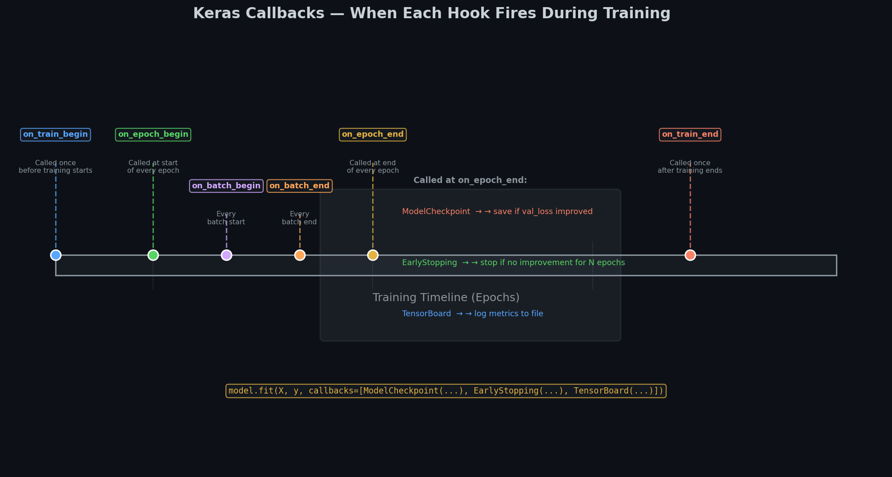
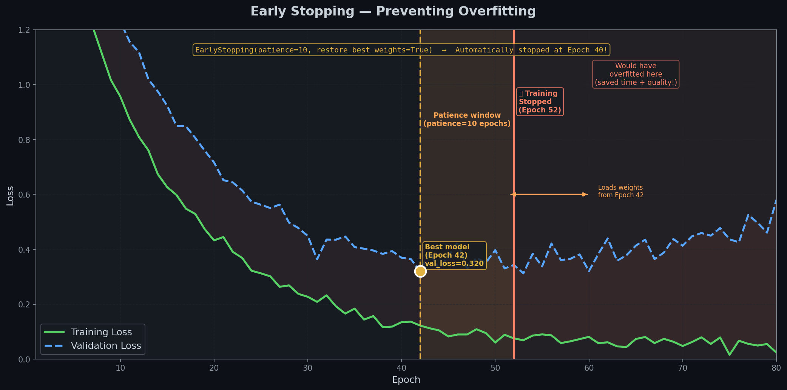

# 💾 Module 5: Saving, Callbacks, and TensorBoard — Training Like a Pro
> **Ch. 10 — Hands-On ML with Scikit-Learn, Keras & TensorFlow (Aurélien Géron)**

---

## 📌 Table of Contents
1. [Start Here: The Problem These Tools Solve](#big-picture)
2. [Saving and Loading Models](#saving)
3. [Callbacks — Automating Training Decisions](#callbacks)
4. [ModelCheckpoint — Auto-Save Best Model](#checkpoint)
5. [EarlyStopping — Stop Before Overfitting](#early-stopping)
6. [TensorBoard — Visualize Training](#tensorboard)
7. [Complete Production Training Recipe](#recipe)
8. [Common Beginner Mistakes](#mistakes)
9. [Interview Q&A (Top 6)](#interview)
10. [⚡ One-Page Flash Card](#revision)

---

## 🌍 Start Here: The Problem These Tools Solve {#big-picture}

> **TL;DR:** Training a neural network without callbacks is like driving without a speedometer or seatbelt. Callbacks give you automatic checkpoints, emergency stops, and real-time monitoring.

**What Can Go Wrong Without Callbacks:**
- ❌ Trained for 100 epochs → overfit by epoch 23 → wasted 77 epochs
- ❌ Server crashes at epoch 98 → lose ALL your training progress
- ❌ No monitoring → don't know if training is going well
- ❌ Using last epoch's weights → but epoch 72 was actually the best

**What Callbacks Solve:**
- ✅ **ModelCheckpoint** → saves best model automatically
- ✅ **EarlyStopping** → stops training when validation stops improving
- ✅ **TensorBoard** → visual dashboard of loss/accuracy in real time
- ✅ **ReduceLROnPlateau** → automatically lowers learning rate when stuck

---

## 💾 Saving and Loading Models {#saving}

> **TL;DR:** `model.save("model.keras")` saves everything. `keras.models.load_model("model.keras")` restores it completely — architecture + weights + optimizer state.

### What Does Saving Store?

A saved Keras model contains THREE things:
1. **Architecture** — what layers, what connections, what activation functions
2. **Weights** — all the learned parameters (W and b for every layer)
3. **Optimizer state** — momentum, learning rate schedule, etc. (needed to resume training)

### How to Save and Load

```python
# Save the complete model (recommended modern format):
model.save("fashion_model.keras")
# OUTPUT: Creates file: fashion_model.keras

# Load it back exactly as it was:
loaded_model = keras.models.load_model("fashion_model.keras")

# Verify it works:
loaded_model.evaluate(X_test, y_test)
# OUTPUT: Same accuracy as before! ✅

# Alternative: save only weights (useful for transfer learning):
model.save_weights("fashion_weights.weights.h5")
model.load_weights("fashion_weights.weights.h5")
```

### Older Format (HDF5 — you may see this in legacy code)

```python
# Older HDF5 format (still works, but .keras is now recommended):
model.save("fashion_model.h5")
loaded = keras.models.load_model("fashion_model.h5")
```

### When Should You Save?

| Scenario | What to Save | Why |
|----------|-------------|-----|
| After training completes | Full model (`.keras`) | Deploy or share |
| During training | Best checkpoint | Prevent losing progress |
| For transfer learning | Weights only | Load into new architecture |
| For production | Full model + SavedModel format | TF Serving compatibility |

---

## 🎛️ Callbacks — Automating Training Decisions {#callbacks}

> **TL;DR:** A callback is a function that Keras automatically calls at specific moments during training. They let you automate decisions that you'd otherwise have to make manually.

### The Callback Timeline



> 📊 **Diagram:** Exactly when each callback hook fires during the training loop. `on_epoch_end` is the most important — it's where ModelCheckpoint, EarlyStopping, and TensorBoard all trigger.

### All Available Hooks

| Hook | When It Fires | Common Use |
|------|-------------|-----------|
| `on_train_begin` | Once before training starts | Initialize resources |
| `on_epoch_begin` | Start of every epoch | Reset epoch-level variables |
| `on_batch_begin` | Before every mini-batch | — |
| `on_batch_end` | After every mini-batch | Log batch metrics |
| **`on_epoch_end`** | **After every epoch** | **Save model, early stopping, logging** |
| `on_train_end` | Once after training ends | Cleanup, final logging |

### Complete Callback Setup

```python
import os
from datetime import datetime

# Set up log directory for TensorBoard
run_logdir = os.path.join("logs", datetime.now().strftime("%Y%m%d_%H%M%S"))

checkpoint_cb = keras.callbacks.ModelCheckpoint(
    "best_model.keras",
    save_best_only=True          # only overwrite if val_loss improved
)

early_stopping_cb = keras.callbacks.EarlyStopping(
    patience=10,                 # how many epochs to wait before stopping
    restore_best_weights=True    # revert to the best epoch's weights after stopping
)

tensorboard_cb = keras.callbacks.TensorBoard(
    log_dir=run_logdir
)

reduce_lr_cb = keras.callbacks.ReduceLROnPlateau(
    factor=0.5,                  # multiply LR by 0.5 when stuck
    patience=5                   # wait 5 epochs before reducing LR
)

# Pass all callbacks to model.fit():
history = model.fit(
    X_train, y_train,
    epochs=1000,                 # set high — early stopping will decide when to stop
    validation_data=(X_valid, y_valid),
    callbacks=[checkpoint_cb, early_stopping_cb, tensorboard_cb, reduce_lr_cb]
)

print(f"Stopped after {len(history.history['loss'])} epochs")
# OUTPUT: Stopped after 47 epochs  (not 1000!)
```

---

## 📸 ModelCheckpoint — Auto-Save Best Model {#checkpoint}

> **TL;DR:** Without ModelCheckpoint, if training crashes or you overtrain, you lose your best model. With it, the best version is automatically saved to disk every time validation loss improves.

### How It Works

```
Epoch 1:  val_loss = 0.823  → saved! (new best)
Epoch 2:  val_loss = 0.741  → saved! (improved)
Epoch 3:  val_loss = 0.768  → NOT saved (worse than epoch 2)
Epoch 4:  val_loss = 0.699  → saved! (improved)
Epoch 5:  val_loss = 0.712  → NOT saved
...
Epoch 47: stopped by EarlyStopping → model is loaded from epoch 4's weights
```

```python
checkpoint_cb = keras.callbacks.ModelCheckpoint(
    filepath="best_model.keras",
    save_best_only=True,          # don't overwrite if val_loss didn't improve
    monitor="val_loss",           # metric to watch (default)
    mode="min"                    # "min" = lower is better (for loss)
)
# For accuracy:
checkpoint_cb = keras.callbacks.ModelCheckpoint(
    filepath="best_model.keras",
    save_best_only=True,
    monitor="val_accuracy",
    mode="max"                    # "max" = higher is better (for accuracy)
)
```

### Loading the Best Saved Model

```python
# Load the best checkpoint after training:
best_model = keras.models.load_model("best_model.keras")
test_loss, test_acc = best_model.evaluate(X_test, y_test)
print(f"Best model test accuracy: {test_acc:.2%}")
# OUTPUT: Best model test accuracy: 89.14%
```

---

## ⛔ EarlyStopping — Stop Before Overfitting {#early-stopping}

> **TL;DR:** EarlyStopping watches the validation loss. If it doesn't improve for `patience` epochs in a row, training automatically stops. With `restore_best_weights=True`, the model reverts to its best state.



> 📊 **Graph:** Training and validation loss over 80 epochs. Best epoch ★ marked in gold. Patience window shown in orange. Stop point in red. The gray zone = would have overfit if not stopped.

### How It Works

```
patience = 10   (wait 10 epochs with no improvement before stopping)

Epoch 1:  val_loss = 1.2  → best so far
Epoch 10: val_loss = 0.44 → best so far
Epoch 11: val_loss = 0.45 → no improvement, patience counter = 1
Epoch 12: val_loss = 0.46 → no improvement, patience counter = 2
...
Epoch 20: val_loss = 0.52 → no improvement, patience counter = 10
→ STOP! Restore weights from epoch 10 (the best)
```

```python
early_stopping_cb = keras.callbacks.EarlyStopping(
    patience=10,                    # epochs to wait after last improvement
    restore_best_weights=True,      # crucial! revert to best epoch's weights
    monitor="val_loss",             # what to watch
    min_delta=0.001                 # improvement must be > 0.001 to count
)

history = model.fit(
    X_train, y_train,
    epochs=1000,                    # high value — early stopping controls the real stop
    callbacks=[early_stopping_cb],
    validation_data=(X_valid, y_valid)
)

# Inspect when it stopped:
print(f"Training stopped at epoch {len(history.history['loss'])}")
# OUTPUT: Training stopped at epoch 47

print(f"Best val_loss: {min(history.history['val_loss']):.4f}")
# OUTPUT: Best val_loss: 0.4401
```

**Key `patience` Guidelines:**
| Patience Value | When to Use |
|---------------|-------------|
| 5–10 | Fast training, many epochs expected |
| 10–20 | Typical deep learning |
| 30–50 | Very noisy training (e.g., small datasets) |

---

## 📈 TensorBoard — Visualize Training {#tensorboard}

> **TL;DR:** TensorBoard is a browser-based dashboard. It shows loss/accuracy curves, weight histograms, computation graphs, and more — all updating in real time during training.

### Setup

```python
import os
from datetime import datetime

# Create unique log directory for this run:
run_logdir = os.path.join("my_logs", datetime.now().strftime("%Y%m%d_%H%M%S"))

tensorboard_cb = keras.callbacks.TensorBoard(
    log_dir=run_logdir,
    histogram_freq=1,     # log weight histograms every epoch (0 = never)
    write_graph=True,     # log the computation graph
)

model.fit(
    X_train, y_train,
    epochs=30,
    validation_data=(X_valid, y_valid),
    callbacks=[tensorboard_cb]
)
```

### Launch TensorBoard

```bash
# In terminal (or Jupyter cell with !):
tensorboard --logdir=./my_logs

# Then open browser: http://localhost:6006
```

### What TensorBoard Shows

| Tab | What's There |
|-----|-------------|
| **Scalars** | Loss and accuracy curves for train + validation |
| **Graphs** | The computation graph of your model |
| **Histograms** | Distribution of weights and biases per epoch |
| **Images** | Sample predictions (if you log them manually) |
| **Hparams** | Hyperparameter comparison across runs |

### Comparing Multiple Runs

```python
# Run 1: SGD optimizer
run_logdir_1 = "my_logs/run_sgd"
# Run 2: Adam optimizer
run_logdir_2 = "my_logs/run_adam"

# TensorBoard shows both runs overlaid:
# tensorboard --logdir=./my_logs
# → you'll see both curves and can compare them!
```

---

## 🏭 Complete Production Training Recipe {#recipe}

> **TL;DR:** This is the template to use for every real project. Copy and adapt it.

```python
import tensorflow as tf
from tensorflow import keras
import os
from datetime import datetime
import numpy as np

# ── 1. Load and prepare data ─────────────────────────────────────────────────
(X_train_full, y_train_full), (X_test, y_test) = keras.datasets.fashion_mnist.load_data()
X_train_full = X_train_full / 255.0
X_test       = X_test / 255.0

X_valid = X_train_full[:5000];  y_valid = y_train_full[:5000]
X_train = X_train_full[5000:];  y_train = y_train_full[5000:]

# ── 2. Build model ───────────────────────────────────────────────────────────
model = keras.models.Sequential([
    keras.layers.Flatten(input_shape=[28, 28]),
    keras.layers.Dense(300, activation="relu"),
    keras.layers.Dense(100, activation="relu"),
    keras.layers.Dense(10, activation="softmax")
])

model.compile(
    loss="sparse_categorical_crossentropy",
    optimizer="sgd",
    metrics=["accuracy"]
)

# ── 3. Set up callbacks ──────────────────────────────────────────────────────
run_logdir = os.path.join("logs", datetime.now().strftime("%Y%m%d_%H%M%S"))

callbacks = [
    keras.callbacks.ModelCheckpoint("best_model.keras", save_best_only=True),
    keras.callbacks.EarlyStopping(patience=10, restore_best_weights=True),
    keras.callbacks.TensorBoard(log_dir=run_logdir),
    keras.callbacks.ReduceLROnPlateau(factor=0.5, patience=5),
]

# ── 4. Train ──────────────────────────────────────────────────────────────────
history = model.fit(
    X_train, y_train,
    epochs=1000,                      # early stopping will control actual epochs
    validation_data=(X_valid, y_valid),
    callbacks=callbacks
)
print(f"Training stopped at epoch: {len(history.history['loss'])}")
# OUTPUT: Training stopped at epoch: 47

# ── 5. Evaluate best model ────────────────────────────────────────────────────
best_model = keras.models.load_model("best_model.keras")
test_loss, test_acc = best_model.evaluate(X_test, y_test)
print(f"Test accuracy: {test_acc:.2%}")
# OUTPUT: Test accuracy: 89.34%

# ── 6. Make predictions ───────────────────────────────────────────────────────
X_new = X_test[:3]
y_proba = best_model.predict(X_new)    # shape: (3, 10)
y_pred  = y_proba.argmax(axis=-1)      # shape: (3,)
class_names = ["T-shirt","Trouser","Pullover","Dress","Coat",
               "Sandal","Shirt","Sneaker","Bag","Ankle boot"]
print([class_names[c] for c in y_pred])
# OUTPUT: ['Ankle boot', 'Pullover', 'Trouser']
```

---

## ❌ Common Beginner Mistakes {#mistakes}

**1. "Not using save_best_only=True in ModelCheckpoint"** ❌
> Without it, ModelCheckpoint overwrites your saved model every single epoch — even when validation loss is getting worse! Always use `save_best_only=True`.

**2. "Setting epochs too low and missing the EarlyStopping benefit"** ❌
> EarlyStopping only helps if you set `epochs` high enough. Set it to something large (1000) and let EarlyStopping decide. If you set `epochs=20`, the model might be still improving when training stops.

**3. "Forgetting restore_best_weights=True in EarlyStopping"** ❌
> Without it, EarlyStopping stops training correctly but leaves the model at the LAST epoch's weights — which may be worse than the best epoch! Always set `restore_best_weights=True`.

**4. "Saving model inside the training loop manually (instead of using ModelCheckpoint)"** ❌
> You'd have to manually track whether validation loss improved. ModelCheckpoint handles all of this automatically. Use it!

**5. "Not passing validation_data to model.fit()"** ❌
> Without validation_data, EarlyStopping and ModelCheckpoint can't monitor `val_loss` — they only see the training loss. Always pass a validation set.

**6. "Forgetting to load the best model after training"** ❌
> After training with EarlyStopping, the model in memory already has `restore_best_weights=True` applied. But if you used ModelCheckpoint too, load the saved `.keras` file explicitly to ensure you have the best weights.

---

## 🎤 Interview Q&A {#interview}

**Q1: What is a Keras callback and how does it work?**
> **A:** A callback is an object that implements hook methods (`on_epoch_end`, `on_batch_end`, etc.) that Keras automatically calls at specific moments during training. You pass a list of callbacks to `model.fit()`. Each callback can read the training logs, modify the model, save files, stop training — anything you need to automate. Common callbacks: ModelCheckpoint, EarlyStopping, TensorBoard, ReduceLROnPlateau.

**Q2: What does EarlyStopping do and what is the `patience` parameter?**
> **A:** EarlyStopping monitors a metric (typically `val_loss`) during training and stops training if the metric doesn't improve for `patience` consecutive epochs. The `patience` parameter controls how long to wait before giving up — e.g., patience=10 means "stop if no improvement for 10 epochs in a row." With `restore_best_weights=True`, the model reverts to the best epoch's weights, not the last epoch.

**Q3: Why should you use `restore_best_weights=True`?**
> **A:** When EarlyStopping stops training, the model currently in memory has the weights from the LAST epoch — which might be worse than the best epoch (that's why we stopped!). With `restore_best_weights=True`, Keras automatically restores the weights from the best epoch (lowest val_loss) when training ends. Without it, you'd have to separately save and reload the best model.

**Q4: What information does TensorBoard display?**
> **A:** TensorBoard is a browser dashboard that shows: loss and accuracy curves (scalars), weight distributions (histograms), the model computation graph, image predictions (if logged), and hyperparameter comparisons across multiple runs. Launch with `tensorboard --logdir=./my_logs` in terminal, then open `localhost:6006`.

**Q5: What does `save_best_only=True` do in ModelCheckpoint?**
> **A:** Without it, ModelCheckpoint saves the model after EVERY epoch, overwriting the previous save. With `save_best_only=True`, it only overwrites when `val_loss` is better than the previous best. This ensures the saved file always contains the best model seen so far, not just the most recent one.

**Q6: How do you resume training from a checkpoint if the server crashes?**
> **A:** Load the saved model with `model = keras.models.load_model("best_model.keras")` — this restores architecture, weights, AND optimizer state. Then call `model.fit()` again. The optimizer state includes momentum, learning rate schedule, etc., so training continues smoothly from where it left off (approximately).

---

## ⚡ One-Page Flash Card {#revision}

```
╔══════════════════════════════════════════════════════════════════╗
║               MODULE 5 — FLASH CARD                             ║
╠══════════════════════════════════════════════════════════════════╣
║                                                                  ║
║  SAVING:                                                         ║
║  model.save("model.keras")          ← full model (recommended)  ║
║  keras.models.load_model("model.keras")  ← restore it           ║
║  model.save_weights(...)            ← weights only              ║
║                                                                  ║
║  KEY CALLBACKS:                                                  ║
║  ModelCheckpoint("best.keras", save_best_only=True)             ║
║  EarlyStopping(patience=10, restore_best_weights=True)          ║
║  TensorBoard(log_dir=run_logdir)                                ║
║  ReduceLROnPlateau(factor=0.5, patience=5)                      ║
║                                                                  ║
║  CALLBACK HOOKS (order):                                         ║
║  on_train_begin → on_epoch_begin → on_batch_begin               ║
║  → on_batch_end → on_epoch_end → on_train_end                  ║
║  (ModelCheckpoint, EarlyStopping fire at on_epoch_end)          ║
║                                                                  ║
║  EARLY STOPPING RULE:                                            ║
║  Set epochs=1000, let EarlyStopping decide when to stop         ║
║  ALWAYS use restore_best_weights=True                           ║
║  patience: small=fast convergence, large=stable training        ║
║                                                                  ║
║  TENSORBOARD:                                                    ║
║  tensorboard --logdir=./logs  → browser: localhost:6006         ║
║  New run = new timestamp subfolder                              ║
║  Compare multiple runs overlaid on same charts                  ║
╚══════════════════════════════════════════════════════════════════╝
```

---

**🔗 Previous →** [04 — Implementing MLPs with Keras](04_Implementing_MLPs_with_Keras.md)
**🔗 Next →** [06 — Hyperparameter Search with Scikit-Learn](06_Saving_Callbacks_TensorBoard.md)
