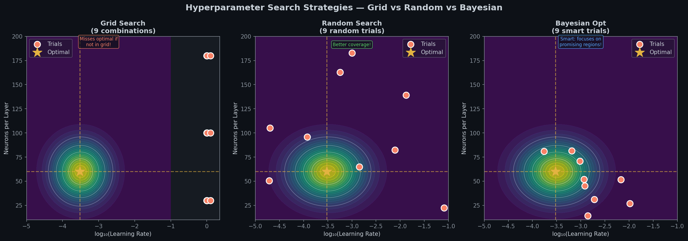

# 🔁 Module 6: Scikit-Learn Integration & Hyperparameter Tuning Workflow
> **Ch. 10 — Hands-On ML with Scikit-Learn, Keras & TensorFlow (Aurélien Géron)**

---

## 📌 Table of Contents
1. [Start Here: Why Wrap Keras in Scikit-Learn?](#big-picture)
2. [SciKeras Wrappers: Regressor & Classifier](#wrappers)
3. [Building the Model Factory (`build_model`)](#model-factory)
4. [Randomized Search vs. Grid Search](#search-strategies)
5. [The Math of Search: Uniform vs. Reciprocal (Log-Uniform)](#math-search)
6. [Keras Tuner: Smarter Hyperparameter Optimization](#keras-tuner)
7. [The Future: AutoML & Neural Architecture Search (NAS)](#automl-nas)
8. [Common Beginner Mistakes](#mistakes)
9. [Interview Q&A (Top 8)](#interview)
10. [⚡ One-Page Flash Card](#revision)

---

## 🌍 Start Here: Why Wrap Keras in Scikit-Learn? {#big-picture}

> **TL;DR:** Scikit-Learn is the gold standard for model evaluation, pipelines, and search workflows, but it doesn't natively support Keras models. SciKeras bridges this gap by wrapping Keras models into standard Scikit-Learn estimators.

Imagine you're a chef trying to perfect a recipe 🍜:
- **Ingredients (Weights & Biases)**: Learned automatically by the model during training (gradient descent).
- **Recipe Settings (Hyperparameters)**: Set manually by you before training starts (learning rate, number of layers, neurons per layer, batch size).

You can't optimize recipe settings using the normal cooking process itself. You must run experiments with different settings. Wrapping Keras in Scikit-Learn allows you to leverage industry-standard pipelines, cross-validation, and search tools to run these experiments automatically.

```
┌─────────────────────────────────────────────────────────────────┐
│                     Scikit-Learn Ecosystem                      │
│   ┌─────────────────────────┐     ┌─────────────────────────┐   │
│   │    RandomizedSearchCV   │     │    GridSearchCV         │   │
│   └────────────┬────────────┘     └────────────┬────────────┘   │
│                │                               │                │
└────────────────┼───────────────────────────────┼────────────────┘
                 │ (Wraps & Orchestrates)        │
                 ▼                               ▼
┌─────────────────────────────────────────────────────────────────┐
│               SciKeras API Wrapper (Bridge)                    │
│   ┌─────────────────────────┐     ┌─────────────────────────┐   │
│   │     KerasRegressor      │     │     KerasClassifier     │   │
│   └────────────┬────────────┘     └────────────┬────────────┘   │
└────────────────┼───────────────────────────────┼────────────────┘
                 │ (Compiles & Runs)             │
                 ▼                               ▼
┌─────────────────────────────────────────────────────────────────┐
│                     TensorFlow / Keras Engine                   │
│   ┌─────────────────────────────────────────────────────────┐   │
│   │             Backprop & Computation Graph                │   │
│   └─────────────────────────────────────────────────────────┘   │
└─────────────────────────────────────────────────────────────────┘
```

### Key Scikit-Learn Tools Unlocked by SciKeras:
- 🔄 **`sklearn.model_selection.RandomizedSearchCV`** — Random sampling of hyperparameter combinations.
- 🔲 **`sklearn.model_selection.GridSearchCV`** — Systematic grid search over predefined values.
- 🧬 **`sklearn.pipeline.Pipeline`** — Combining preprocessing (scaling, encoding) and deep learning models into a single deployable object.
- 📊 **`sklearn.model_selection.cross_val_score`** — Robust K-fold cross-validation estimates.

---

## 🔧 SciKeras Wrappers: Regressor & Classifier {#wrappers}

> **TL;DR:** Keras's legacy scikit-learn wrappers (`keras.wrappers.scikit_learn`) are deprecated and removed in TensorFlow 2.12+. The official modern replacement is **SciKeras** (`scikeras`).

To use SciKeras, install it via:
```bash
pip install scikeras
```

SciKeras provides two primary wrappers:
1. **`KerasRegressor`**: For continuous target prediction (regression tasks, e.g., house pricing).
2. **`KerasClassifier`**: For discrete label prediction (classification tasks, e.g., image tagging).

### SciKeras Wrapper Mechanics
The wrapper behaves exactly like any other Scikit-Learn estimator:
- `.fit(X, y)` trains the underlying Keras model.
- `.predict(X)` returns predictions as NumPy arrays.
- `.score(X, y)` evaluates the model on a test set (returning negative MSE/MAE for regression, and accuracy for classification).

---

## 🏗️ Building the Model Factory (`build_model`) {#model-factory}

> **TL;DR:** To wrap a model, you must write a builder function (factory) that accepts hyperparameters as arguments, construct the model dynamically, compiles it, and returns the compiled Keras model.

### 1. Regression Factory Example (`KerasRegressor`)

```python
import numpy as np
from tensorflow import keras
from scikeras.wrappers import KerasRegressor

def build_regressor(n_hidden=1, n_neurons=30, learning_rate=3e-3, input_shape=[8]):
    # 1. Instantiate a sequential container
    model = keras.models.Sequential()
    model.add(keras.layers.InputLayer(input_shape=input_shape))
    
    # 2. Add hidden layers dynamically based on input parameters
    for _ in range(n_hidden):
        model.add(keras.layers.Dense(n_neurons, activation="relu"))
        
    # 3. Add regression output layer (1 neuron, linear activation)
    model.add(keras.layers.Dense(1))
    
    # 4. Compile model with custom optimizer settings
    optimizer = keras.optimizers.SGD(learning_rate=learning_rate)
    model.compile(loss="mse", optimizer=optimizer)
    
    return model

# Wrap the builder in KerasRegressor
keras_reg = KerasRegressor(
    model=build_regressor,
    epochs=100,
    n_hidden=2,                # Default arguments mapped to build_regressor
    n_neurons=50,
    learning_rate=1e-3,
    callbacks=[keras.callbacks.EarlyStopping(patience=10, restore_best_weights=True)]
)
```

### 2. Classification Factory Example (`KerasClassifier`)

```python
from scikeras.wrappers import KerasClassifier

def build_classifier(n_hidden=2, n_neurons=64, learning_rate=1e-3, n_classes=10):
    model = keras.models.Sequential()
    model.add(keras.layers.InputLayer(input_shape=[28, 28]))
    model.add(keras.layers.Flatten())
    
    for _ in range(n_hidden):
        model.add(keras.layers.Dense(n_neurons, activation="relu"))
        
    # Output layer: activation changes based on number of classes
    if n_classes == 2:
        model.add(keras.layers.Dense(1, activation="sigmoid"))
        loss = "binary_crossentropy"
    else:
        model.add(keras.layers.Dense(n_classes, activation="softmax"))
        loss = "sparse_categorical_crossentropy"
        
    optimizer = keras.optimizers.Adam(learning_rate=learning_rate)
    model.compile(loss=loss, optimizer=optimizer, metrics=["accuracy"])
    
    return model

keras_clf = KerasClassifier(
    model=build_classifier,
    epochs=50,
    n_classes=10,
    validation_split=0.1
)
```

> [!IMPORTANT]
> **SciKeras Signature Inspection**: SciKeras automatically inspects the arguments of your factory function (`build_regressor`/`build_classifier`). Any keyword arguments passed to the `KerasRegressor` or `KerasClassifier` constructor that match your factory arguments will be forwarded directly to your builder!

---

## 🔍 Randomized Search vs. Grid Search {#search-strategies}

> **TL;DR:** Avoid grid search when tuning deep neural networks. Random search covers the hyperparameter search space much more effectively and is computationally faster because it doesn't waste trials on unimportant hyperparameters.



> 📊 **Graph:** 2D hyperparameter space performance landscape.
> - **Grid Search (Left)**: Evaluates fixed grid points. If a critical parameter is highly sensitive, grid search completely misses the optimal peak because it's limited to predefined values.
> - **Random Search (Middle)**: Samples randomly across dimensions. It projects many more unique values onto the sensitive parameters, ensuring the optimal peak is located.
> - **Bayesian Optimization (Right)**: Learns from past results and focuses searches inside the most promising regions.

### 1. RandomizedSearchCV Setup with SciKeras

This complete script sets up a random hyperparameter search with cross-validation:

```python
import numpy as np
from scipy.stats import reciprocal
from sklearn.model_selection import RandomizedSearchCV
from scikeras.wrappers import KerasRegressor

# Define the search space distributions
param_distribs = {
    "model__n_hidden": [0, 1, 2, 3],
    "model__n_neurons": np.arange(10, 100),
    "model__learning_rate": reciprocal(3e-4, 3e-2), # Log-uniform distribution
}

# Wrap model using default factory
keras_reg = KerasRegressor(model=build_regressor, input_shape=[8])

# Instantiate the search orchestrator
rnd_search_cv = RandomizedSearchCV(
    estimator=keras_reg,
    param_distributions=param_distribs,
    n_iter=10,                      # 10 random configs to evaluate
    cv=3,                           # 3-fold cross-validation
    scoring="neg_mean_squared_error",
    n_jobs=1,                       # Run sequentially (safer for GPU VRAM usage)
    random_state=42
)

# Run search (note: early stopping callback can be passed in fit)
rnd_search_cv.fit(
    X_train, y_train,
    epochs=100,
    validation_split=0.1,
    callbacks=[keras.callbacks.EarlyStopping(patience=5, restore_best_weights=True)]
)

# OUTPUT LOG:
# Fitting 3 folds for each of 10 candidates, totalling 30 fits
# Epoch 1/100 ... val_loss: 0.85
# ...
# Best parameters found: {'model__n_hidden': 2, 'model__n_neurons': 73, 'model__learning_rate': 0.0054}
```

> [!WARNING]
> **SciKeras Prefix Convention**: In SciKeras, any parameter that should be routed to the factory function inside a Scikit-Learn search must be prefixed with `model__` (e.g., `"model__learning_rate"` instead of `"learning_rate"`). If you are tuning optimization parameters directly supported by SciKeras, check their prefix guidelines.

### 2. Evaluating the Best Model
Once search completes, the best parameters and estimators are saved:

```python
# Best cross-validated metric (SciKeras / Sklearn negates MSE so it can maximize)
best_mse = -rnd_search_cv.best_score_
print(f"Best CV MSE: {best_mse:.4f}")
# OUTPUT: Best CV MSE: 0.3128

# Get the underlying best trained Keras model object
best_keras_model = rnd_search_cv.best_estimator_.model_
print(best_keras_model.summary())
# OUTPUT: Shows model summary of the best network architecture
```

---

## 📐 The Math of Search: Uniform vs. Reciprocal (Log-Uniform) {#math-search}

> **TL;DR:** Learning rates scale logarithmically. Uniform sampling favors large learning rates (e.g. 0.009 to 0.01) and ignores small scales (e.g. 0.0001 to 0.001). Reciprocal sampling gives equal probability weight to each order of magnitude.

### The Problem with Uniform Sampling
If we sample the learning rate $\eta \in [0.0001, 0.1]$ uniformly:
- $90\%$ of all random choices will fall between $0.01$ and $0.1$.
- Only $1\%$ of choices will explore the $0.0001$ to $0.001$ range!
- This is bad because learning rates are highly sensitive to small scale changes.

### The Reciprocal (Log-Uniform) Solution
A reciprocal distribution has a probability density function:
$$f(x) = \frac{1}{x \ln(b/a)}$$
where $a$ is the lower bound and $b$ is the upper bound.

This means the probability of sampling a value in a range is proportional to the size of the interval in log space:

| Range (Interval) | Width in Base-10 Log Space | Probability Weight |
|------------------|---------------------------|---------------------|
| $[0.0001, 0.001]$ | $\log_{10}(0.001) - \log_{10}(0.0001) = -3 - (-4) = 1$ | **$33.3\%$** |
| $[0.001, 0.01]$   | $\log_{10}(0.01) - \log_{10}(0.001) = -2 - (-3) = 1$ | **$33.3\%$** |
| $[0.01, 0.1]$     | $\log_{10}(0.1) - \log_{10}(0.01) = -1 - (-2) = 1$ | **$33.3\%$** |

This guarantees that all orders of magnitude are searched equally.

```python
from scipy.stats import reciprocal

# Generates log-uniform values between 3e-4 (0.0003) and 3e-2 (0.03)
lr_distrib = reciprocal(3e-4, 3e-2)

# Sample 5 test rates
samples = lr_distrib.rvs(size=5, random_state=42)
print([f"{s:.5f}" for s in samples])
# OUTPUT: ['0.00454', '0.02450', '0.00185', '0.00052', '0.01121'] ✅ Balanced orders!
```

---

## 🧪 Keras Tuner: Smarter Hyperparameter Optimization {#keras-tuner}

> **TL;DR:** SciKeras + Scikit-Learn works well, but it relies on basic random searches. For large production networks, **Keras Tuner** is Google's dedicated library providing advanced search algorithms like Hyperband and Bayesian Optimization.

Install Keras Tuner via:
```bash
pip install keras-tuner
```

### The Search Algorithms Compared:
1. **Random Search**: Picks completely random values.
2. **Bayesian Optimization**: Uses a Gaussian Process surrogate model to predict which configurations will perform well based on past trials.
3. **Hyperband**: A multi-fidelity bandit algorithm. It starts training many configurations for only a few epochs, discards the bottom performing half, and trains the remaining configs longer. It is extremely fast!

### Keras Tuner Implementation Example

```python
import keras_tuner as kt
import tensorflow as tf
from tensorflow import keras

# 1. Define model builder with an HP parameter object
def build_tuner_model(hp):
    model = keras.Sequential()
    model.add(keras.layers.InputLayer(input_shape=[8]))
    
    # Let Keras Tuner choose the number of layers
    n_layers = hp.Int("num_layers", min_value=1, max_value=3)
    
    # Choose neurons and activation dynamically
    for i in range(n_layers):
        model.add(keras.layers.Dense(
            units=hp.Int(f"units_{i}", min_value=10, max_value=100, step=10),
            activation=hp.Choice(f"activation_{i}", values=["relu", "elu", "tanh"])
        ))
        
    model.add(keras.layers.Dense(1))
    
    # Let tuner search for optimal learning rate and optimizer
    lr = hp.Float("lr", min_value=1e-4, max_value=1e-2, sampling="log")
    opt_choice = hp.Choice("optimizer", values=["adam", "sgd"])
    
    if opt_choice == "adam":
        optimizer = keras.optimizers.Adam(learning_rate=lr)
    else:
        optimizer = keras.optimizers.SGD(learning_rate=lr)
        
    model.compile(loss="mse", optimizer=optimizer)
    return model

# 2. Instantiate Hyperband Tuner
tuner = kt.Hyperband(
    hypermodel=build_tuner_model,
    objective="val_loss",
    max_epochs=30,
    factor=3,
    directory="keras_tuner_dir",
    project_name="house_price_tuning"
)

# 3. Search
tuner.search(
    X_train, y_train,
    epochs=10,
    validation_data=(X_valid, y_valid),
    callbacks=[keras.callbacks.EarlyStopping(patience=3)]
)

# 4. Get the best hyperparameters and models
best_hps = tuner.get_best_hyperparameters(num_trials=1)[0]
print(f"Best layers: {best_hps.get('num_layers')}")
# OUTPUT: Best layers: 2

best_model = tuner.get_best_models(num_models=1)[0]
```

---

## 🚀 The Future: AutoML & Neural Architecture Search (NAS) {#automl-nas}

> **TL;DR:** Instead of humans tuning layers, Neural Architecture Search (NAS) runs an evolutionary loop where algorithms design the neural architecture itself.

```
                  ┌──────────────────────┐
                  │                      │
                  │   AutoML Controller  │
                  │                      │
                  └──────────┬───────────┘
                             │ Proposes Architecture
                             ▼
                  ┌──────────────────────┐
                  │   Candidate Model    │
                  │                      │
                  └──────────┬───────────┘
                             │ Evaluates Performance
                             ▼
                  ┌──────────────────────┐
                  │   Feedback Metric    │
                  │                      │
                  └──────────┬───────────┘
                             │ Genetic / RL Update
                             ▼
```

- **Surrogate Models**: Algorithms like DeepMind's Population-Based Training (PBT) train a group of neural networks simultaneously. High-performing networks "clone" themselves over poor-performing ones and slightly mutate their weights and hyperparameters.
- **NAS Platforms**: Tools like Google AutoML and Arimo run reinforcement learning agents to evaluate hundreds of candidate networks in the cloud to discover novel network designs that beat hand-designed models.

---

## ❌ Common Beginner Mistakes {#mistakes}

**1. Using `keras.wrappers.scikit_learn` instead of `scikeras`** ❌
> Legacy Keras wrappers were removed in TF 2.12+. If you run older code, it will fail with an `ImportError`. Always use `scikeras.wrappers`.

**2. Forgetting the `model__` prefix in search grid keys** ❌
> When running search tools (like `RandomizedSearchCV`) on SciKeras wrappers, keys must have the `"model__"` prefix (e.g., `"model__learning_rate"`), otherwise Scikit-Learn will raise a `ValueError` saying the parameter doesn't exist.

**3. Sampling learning rates with a Uniform distribution** ❌
> Using a uniform distribution over-samples values in the highest range (e.g. $[0.01, 0.1]$) and misses smaller scales entirely. Always use `scipy.stats.reciprocal` (log-uniform).

**4. Oversubscribing hardware with `n_jobs > 1`** ❌
> Setting `n_jobs=-1` works great for random forests, but running multiple neural networks in parallel will cause your GPU to run out of memory (OOM). Keep `n_jobs=1` when executing search sweeps on GPUs.

**5. Training for too few epochs during search** ❌
> If you limit search runs to 5 epochs, the metrics don't reflect long-term model convergence. Set your epochs high (e.g., 100) and use an `EarlyStopping` callback inside `fit()` to stop bad models early.

---

## 🎤 Interview Q&A {#interview}

**Q1: Why is RandomizedSearchCV generally preferred over GridSearchCV for neural network tuning?**
> **A:** Neural networks contain many hyperparameters. GridSearchCV searches every combination, meaning the number of runs grows exponentially (curse of dimensionality). RandomizedSearchCV samples configurations randomly. Bergstra and Bengio (2012) showed that most hyperparameters are not equally important. Random search evaluates unique values for the sensitive hyperparameters, covering the parameter space faster and finding better models in fewer iterations.

**Q2: What is the purpose of the reciprocal (log-uniform) distribution for learning rates?**
> **A:** The learning rate is a scale-sensitive hyperparameter where a change from $0.0001$ to $0.001$ has a much larger impact than a change from $0.01$ to $0.011$. A uniform distribution would sample mostly from the larger values. A reciprocal distribution samples uniformly across logarithmic scales, ensuring equal exploration time for each order of magnitude.

**Q3: How does SciKeras map hyperparameter updates to your custom Keras model?**
> **A:** SciKeras inspects the function signature of your custom builder function (e.g., `build_model`). When you pass parameters prefixed with `model__` in your parameter grid, SciKeras matches them to your builder function's parameters at run time and constructs the Keras model.

**Q4: How does cross-validation interact with the validation set and early stopping in SciKeras?**
> **A:** In K-fold cross-validation, the training set is split into $K$ parts. The model trains on $K-1$ folds and validates on the remaining fold. Early stopping callbacks passed to `fit()` will evaluate their metrics on this validation fold automatically.

**Q5: What is the Hyperband algorithm in Keras Tuner and why is it efficient?**
> **A:** Hyperband is a resource-allocation bandit algorithm. It starts by training many configurations (e.g. 81 models) for a small budget (e.g., 2 epochs). It ranks them, discards the bottom performing ones, and trains the remaining models longer. This process repeats until only the best configurations reach the maximum epoch limit, saving significant time by killing poorly-performing networks early.

**Q6: What is the difference between model parameters and hyperparameters?**
> **A:** Model parameters (weights and biases) are learned automatically by the model from the training data using backpropagation. Hyperparameters (learning rate, layer count, batch size) are settings specified by the user before training begins that guide the learning process.

**Q7: How do you extract and save the raw Keras model after finishing a SciKeras search?**
> **A:** After the search is complete, you access the best estimator via `rnd_search_cv.best_estimator_`. The underlying Keras model object is stored in the `.model_` attribute. You can save it directly using `best_model.save("best_model.keras")`.

**Q8: Why does `KerasRegressor.score()` return negative MSE in Scikit-Learn?**
> **A:** Scikit-Learn follows a API convention where higher score values must represent better models (maximizing utility). Since MSE is a loss function (where lower is better), SciKeras negates the MSE value to make it compatible with Scikit-Learn's optimization and ranking components.

---

## ⚡ One-Page Flash Card {#revision}

```
╔══════════════════════════════════════════════════════════════════╗
║               MODULE 6 — FLASH CARD                             ║
╠══════════════════════════════════════════════════════════════════╣
║                                                                  ║
║  SCIKERAS WRAPPERS:                                              ║
║  from scikeras.wrappers import KerasRegressor, KerasClassifier   ║
║  Requires a builder factory: build_model(**kwargs) -> model      ║
║                                                                  ║
║  SCIKIT-LEARN PARAMETER PREFIX:                                  ║
║  Use "model__" prefix for hyperparameter grids:                  ║
║  dist = {"model__n_hidden": [1, 2], "model__n_neurons": [30, 50]}║
║                                                                  ║
║  LEARNING RATE SAMPLING RULE:                                    ║
║  Uniform = ❌ samples large numbers, misses log scales           ║
║  Reciprocal = Log-Uniform = ✅ searches orders of magnitude      ║
║  Code: scipy.stats.reciprocal(lower, upper)                      ║
║                                                                  ║
║  SEARCH ALGORITHMS:                                              ║
║  Grid Search: systematic, slow, misses sensitive parameter peaks║
║  Random Search: faster, better space coverage, standard baseline ║
║  Bayesian Opt: learns surrogate model of past trials             ║
║  Hyperband: multi-fidelity, early-kills bad models (fastest)    ║
║                                                                  ║
║  PRODUCTION TIP:                                                 ║
║  Never run searches with n_jobs=-1 on GPU (will cause OOM crash) ║
║  Pass early stopping callback in search_cv.fit() to save time    ║
╚══════════════════════════════════════════════════════════════════╝
```

---

**🔗 Previous Module →** [05 — Saving, Callbacks, and TensorBoard](05_Saving_Callbacks_and_TensorBoard_Training_Like_a_Pro.md)  
**🔗 Next Module →** [07 — Fine-Tuning Hyperparameters](07_Fine_Tuning_Neural_Network_Hyperparameters_The_Complete_Guide.md)
