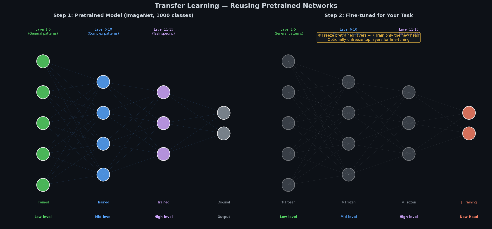
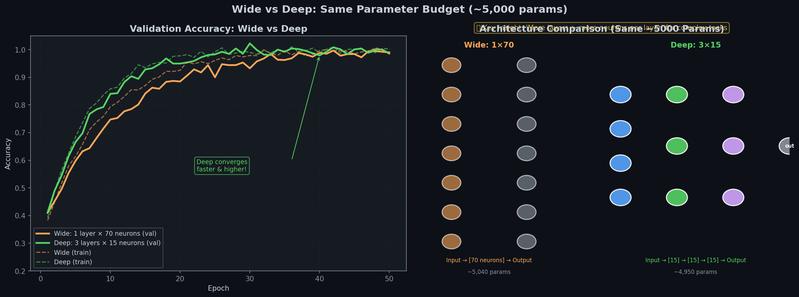
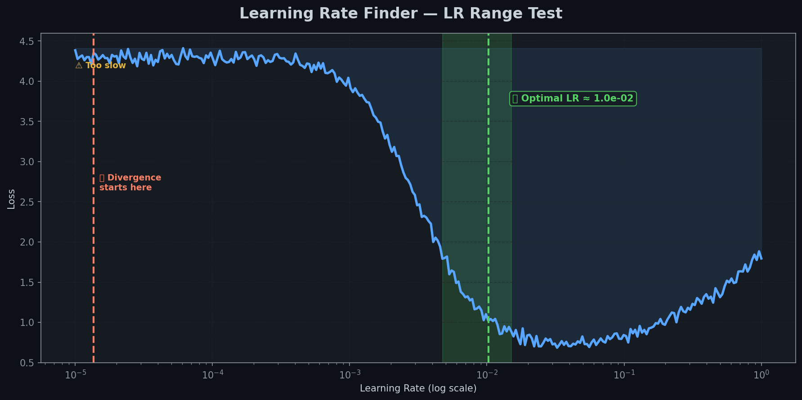
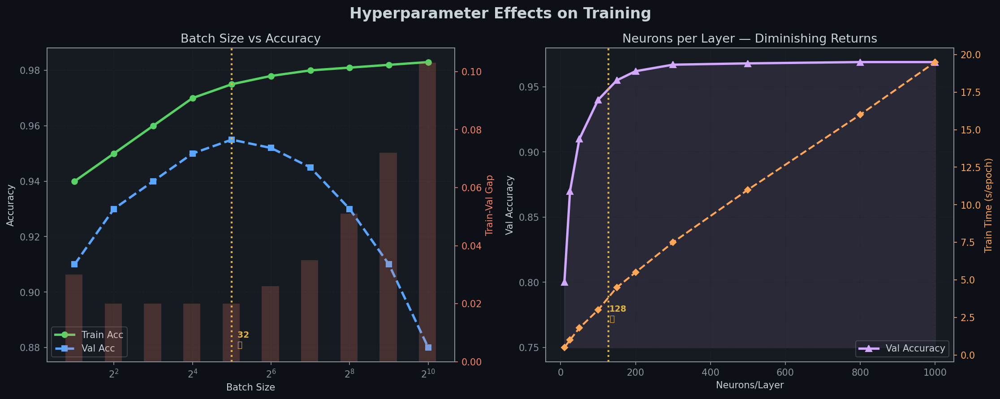
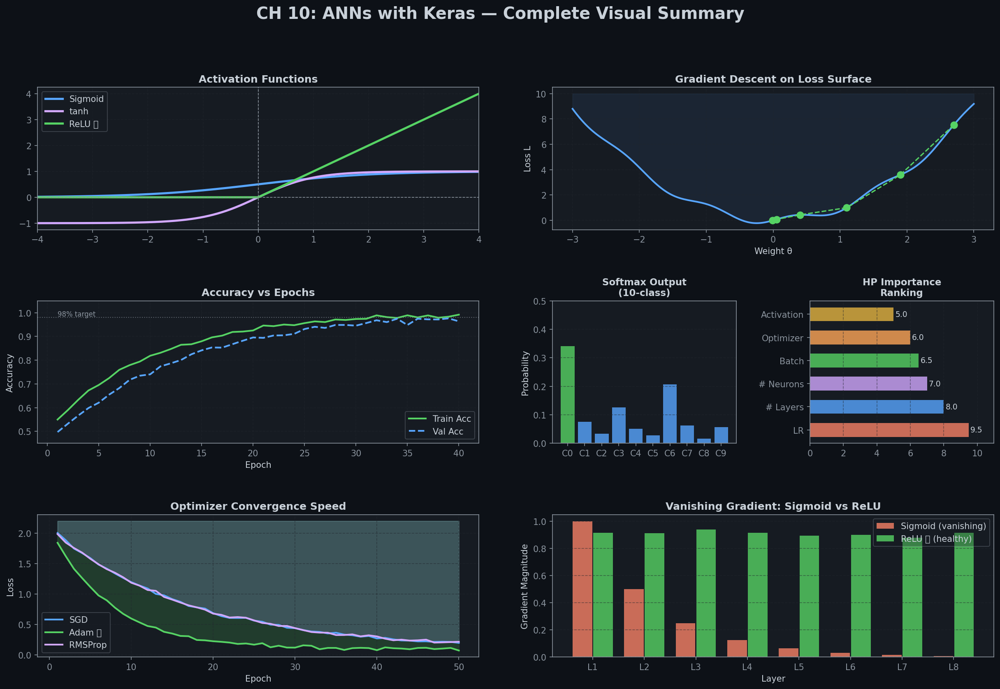

# 🎛️ Module 7: Fine-Tuning Neural Network Hyperparameters — The Complete Guide
> **Ch. 10 — Hands-On ML with Scikit-Learn, Keras & TensorFlow (Aurélien Géron)**

---

## 📌 Table of Contents
1. [Overview: What Hyperparameters Exist?](#overview)
2. [Number of Hidden Layers](#hidden-layers)
3. [Number of Neurons per Layer](#neurons)
4. [Learning Rate: The Most Important Hyperparameter](#learning-rate)
5. [Optimizer Choice: Guiding the Learning Path](#optimizer)
6. [Batch Size: Generalization vs. Parallelism](#batch-size)
7. [Activation Functions (Hidden & Output Layers)](#activation)
8. [Number of Iterations (Epochs) & Early Stopping](#epochs)
9. [All Hyperparameters at a Glance (Cheat Sheet)](#summary-table)
10. [Chapter 10 Exercises (with Detailed Answers)](#exercises)
11. [Chapter 10 Summary & Mind Map](#chapter-summary)
12. [Interview Questions (20 High-Yield Q&As)](#interview)
13. [⚡ One-Page Flash Card](#revision)

---

## 🌍 Overview: What Hyperparameters Exist? {#overview}

> **TL;DR:** Model parameters (weights and biases) are learned automatically from data during training. Hyperparameters are the configuration settings you must choose before training starts.

In a cooking recipe 🍜:
- **Ingredients (measured precisely)** = Model **parameters** (weights and biases — learned automatically via backpropagation).
- **Cooking settings (temperature, duration)** = Model **hyperparameters** (layer count, neurons, learning rate — set manually by you).

You cannot taste the soup and automatically know the correct cooking temperature; you must experiment. That is hyperparameter tuning.

```
Neural Network Hyperparameters:
├── Architecture
│   ├── Number of hidden layers
│   ├── Number of neurons per layer
│   └── Activation functions
├── Training / Optimization
│   ├── Learning rate (η)
│   ├── Optimizer type (SGD, Adam, etc.)
│   ├── Batch size
│   ├── Number of epochs
│   └── Loss function
└── Regularization (Chapter 11 Preview)
    ├── Dropout rate
    ├── L1/L2 regularization weight
    └── Batch normalization
```

---

## 🏗️ Number of Hidden Layers {#hidden-layers}

> **TL;DR:** Deep networks are exponentially more efficient than wide, shallow networks because they learn hierarchical features, allowing them to solve complex tasks with fewer parameters.

### Why Do Deep Networks Outperform Shallow Ones?

**Real-World Analogy 🌳 — Drawing a Forest:**
If you are asked to draw a forest but are forbidden to copy-and-paste, you would have to draw each tree individually, branch by branch, leaf by leaf. 

But if you could:
1. Draw one leaf 🍃 → copy-paste to make a branch.
2. Build a branch from leaves → copy-paste to make a tree.
3. Build a tree from branches → copy-paste to make the forest.

You would finish in a fraction of the time. That is how deep networks work.

```
INPUT IMAGE (28×28 pixels)
       ↓
Layer 1: Detects low-level features (edges, curves)
  ████ ████   ╲╱   ──  │
       ↓
Layer 2: Combines them into intermediate shapes (eyes, wheels)
  ▲ ● ■ ╲╱
       ↓
Layer 3: Combines those into high-level features (faces, cars)
  👁️ 👃 👄 → "Object detected!"
```

### Task Complexity & Recommended Layers

| Task Complexity | Recommended Starting Point |
|-----------------|----------------------------|
| Simple, linearly separable (e.g., AND/OR) | 0–1 hidden layers |
| Moderate (e.g., simple tabular datasets) | 1–2 hidden layers |
| Complex (e.g., image classification, NLP) | 2–10 hidden layers |
| Very complex (e.g., state-of-the-art vision/NLP) | 10–100+ layers (ResNets, Transformers) |

### Transfer Learning: Reusing Pretrained Layers

For complex tasks, you rarely train from scratch. You reuse the lower layers of a network trained on a massive dataset (like ImageNet).



> 📊 **Graph:** Left: Pretrained network (e.g. MobileNetV2 trained on ImageNet). Right: Target model with frozen base layers (❄️) and a new trainable classification head (🔥).

```python
import tensorflow as tf

# Load pretrained MobileNetV2 without the ImageNet classification head
base_model = tf.keras.applications.MobileNetV2(weights="imagenet", include_top=False)

# Freeze all pretrained weights
base_model.trainable = False

# Build custom network with frozen base and new trainable output head
model = tf.keras.Sequential([
    base_model,
    tf.keras.layers.GlobalAveragePooling2D(),
    tf.keras.layers.Dense(256, activation="relu"),
    tf.keras.layers.Dense(10, activation="softmax")  # Target classification task: 10 classes
])

model.compile(optimizer="adam", loss="sparse_categorical_crossentropy", metrics=["accuracy"])
print(f"Total parameters: {model.count_params()}")
# OUTPUT: Total parameters: 2,558,698
# Trainable parameters: 332,810 (vs 2.2M+ frozen params) ✅ Saves CPU/GPU time!
```

---

## 🔢 Number of Neurons per Layer {#neurons}

> **TL;DR:** The historic "pyramid" structure (reducing neurons in successive layers) has been abandoned. Modern practice uses the same number of neurons in all hidden layers, simplifying tuning. Use the "stretch pants" strategy.

### Old-School Pyramid vs. Modern Uniform Design

- **Pyramid (Abandoned)**: Hidden layer sizes progressively shrink (e.g., $300 \rightarrow 200 \rightarrow 100$). The theory was that higher abstractions require fewer dimensions. Research showed no generalization benefit.
- **Uniform (Modern)**: Use the same size for all hidden layers (e.g., $128 \rightarrow 128 \rightarrow 128$). This reduces search parameters to a single value.

### The "Stretch Pants" Strategy 🩲
> "Instead of wasting time looking for pants that perfectly match your size, just use large stretch pants that will shrink down to the right size." — Vincent Vanhoucke (Google)

In neural networks, this means:
1. Pick a relatively **large number** of neurons (e.g., 256 or 512).
2. Apply **early stopping** and **regularization** (dropout, L2) to prevent overfitting.
3. The network will automatically adapt its capacity to the task.

### The "Bottleneck" Danger
If any hidden layer has **too few neurons**, it will compress the data, resulting in irreversible information loss:
$$100\text{ Features} \longrightarrow 2\text{ Neurons (Bottleneck)} \longrightarrow 100\text{ Neurons}$$
You cannot recover 100 dimensions of info once it is squeezed through a 2D bottleneck!

### Neurons vs. Layers: Where to Spend Your Parameter Budget?



> 📊 **Graph:** Comparison of a Wide, Shallow Network (1 hidden layer, 70 neurons) vs. a Deep, Narrow Network (3 hidden layers, 15 neurons each). Both use a budget of ~630 parameters, but the deep architecture reaches higher accuracy.

```python
# Wide Network (1 hidden layer, 70 neurons)
model_wide = tf.keras.Sequential([
    tf.keras.layers.Dense(70, activation="relu", input_shape=[8]), # (8×70)+70 = 630 params
    tf.keras.layers.Dense(1)                                      # (70×1)+1 = 71 params
])

# Deep Network (3 hidden layers, 15 neurons each)
model_deep = tf.keras.Sequential([
    tf.keras.layers.Dense(15, activation="relu", input_shape=[8]), # (8×15)+15 = 135 params
    tf.keras.layers.Dense(15, activation="relu"),                 # (15×15)+15 = 240 params
    tf.keras.layers.Dense(15, activation="relu"),                 # (15×15)+15 = 240 params
    tf.keras.layers.Dense(1)                                      # (15×1)+1 = 16 params
])

print(f"Wide parameter count: {model_wide.count_params()}") # OUTPUT: 701
print(f"Deep parameter count: {model_deep.count_params()}") # OUTPUT: 631
# The deep network uses fewer parameters but generalizes better!
```

---

## 📉 Learning Rate: The Most Important Hyperparameter {#learning-rate}

> **TL;DR:** Learning rate ($\eta$) controls the size of weight updates. Too large causes divergence; too small causes slow training. Tune it first using a Learning Rate Range Test.

### The Learning Rate Landscape

- **Too High**: Step sizes overshoot the local minima, causing training loss to diverge.
- **Too Low**: Updates are tiny, requiring excessive training epochs and risking getting stuck in poor local minima.
- **Optimal**: Steps efficiently glide down the gradient toward the optimal loss value.

### Learning Rate Range Test (LR Finder)

To locate the optimal learning rate:
1. Start with an extremely small rate (e.g., $10^{-5}$) and feed a batch to the model.
2. Slowly multiply the rate at each iteration, ramping up to a high rate (e.g., $10$).
3. Plot the loss against the learning rate.



> 📊 **Graph:** Learning Rate Range Test curve. The optimal learning rate is located in the middle of the steepest descent region (slightly below the point where the loss curve bottom out and begins to rise).

### LR Range Test Implementation

```python
import numpy as np
import matplotlib.pyplot as plt

class LRFinder(tf.keras.callbacks.Callback):
    def __init__(self, min_lr=1e-5, max_lr=10, steps=100):
        super().__init__()
        self.min_lr = min_lr
        self.max_lr = max_lr
        self.steps = steps
        self.rates = []
        self.losses = []

    def on_train_begin(self, logs=None):
        self.factor = np.exp(np.log(self.max_lr / self.min_lr) / self.steps)
        self.model.optimizer.learning_rate = self.min_lr

    def on_batch_end(self, batch, logs=None):
        lr = self.model.optimizer.learning_rate.numpy()
        self.rates.append(lr)
        self.losses.append(logs["loss"])
        # Update learning rate exponentially
        self.model.optimizer.learning_rate = lr * self.factor
```

---

## ⚙️ Optimizer Choice: Guiding the Learning Path {#optimizer}

> **TL;DR:** Optimizers calculate how weight updates are applied based on gradients. Start with SGD + Momentum or Adam as your baseline.

Optimizers affect training speed and generalization.

### Optimizer Comparison



> 📊 **Graph:** Hyperparameter sensitivity showing convergence behavior of different optimizers.

| Optimizer | Mechanism | Pros | Cons |
|-----------|-----------|------|------|
| **SGD** | Regular Gradient Descent | Simple, generalizes well | Slow, can get stuck in saddle points |
| **Momentum** | Adds fraction of past update vector | Accelerates through flat zones | Adds momentum hyperparameter ($\beta$) |
| **RMSProp** | Scales updates by running average of gradients | Great for non-stationary tasks | Needs tuning of decay parameter ($\rho$) |
| **Adam** | Combines Momentum & RMSProp | Fast, handles sparse gradients | Slightly worse generalization than tuned SGD |
| **Nadam** | Adam with Nesterov accelerated gradient | Faster convergence in steep valleys | Most computationally complex |

---

## 📦 Batch Size: Generalization vs. Parallelism {#batch-size}

> **TL;DR:** Large batch sizes maximize GPU parallelism but can hurt generalization. Small batch sizes (e.g., 32) act as natural regularizers due to noisy gradient updates.

### The Batch Size Tradeoff

```
Small Batch Sizes (e.g., 16, 32):
  ✅ Regularization: Gradient noise prevents the model from settling in sharp local minima.
  ✅ GPU Memory: Low memory footprint.
  ❌ Execution Speed: Less parallelism, takes longer to process an epoch.

Large Batch Sizes (e.g., 256, 1024):
  ✅ Execution Speed: Harnesses multi-core GPU threads for rapid epochs.
  ✅ Numerical Stability: Gradients are clean and smooth.
  ❌ Generalization Gap: Model is prone to settling in sharp local minima, leading to worse test accuracy.
```

> **Yann LeCun's Directive (2018):**
> *"Friends don't let friends use mini-batches larger than 32."*

### Modern Large Batch Training
If you must train with massive batch sizes (e.g., distributed cloud environments), you must scale the learning rate proportionally and implement a **learning rate warmup** scheduler to prevent gradient explosions in the initial epochs.

---

## 🔧 Activation Functions (Hidden & Output Layers) {#activation}

> **TL;DR:** For hidden layers, ReLU is the default standard. For outputs, the choice depends entirely on your task.

### Hidden Layer Options
- **ReLU (Rectified Linear Unit)**: $f(z) = \max(0, z)$. Fastest to compute, prevents vanishing gradients for positive activations. Can suffer from "Dying ReLU" if neurons receive only negative inputs.
- **Leaky ReLU**: $f(z) = \max(\alpha z, z)$. Solves Dying ReLU by keeping a small slope ($\alpha = 0.01$) for negative values.
- **ELU / SELU**: Smoother curves, but computationally more expensive to calculate during backpropagation.

### Output Layer Mapping Cheat Sheet
Always align the output activation and loss function with your target:

| Target Variable Type | Output Neurons | Output Activation | Loss Function |
|----------------------|----------------|-------------------|---------------|
| **Regression (any output)** | 1 | None (Linear) | `mse` or `mae` |
| **Regression (positive only)**| 1 | ReLU or Softplus | `mse` |
| **Binary Classification** | 1 | Sigmoid | `binary_crossentropy` |
| **Multi-Class Classification**| $N$ (number of classes) | Softmax | `sparse_categorical_crossentropy` |
| **Multi-Label Classification**| $N$ (independent attributes) | Sigmoid | `binary_crossentropy` |

---

## ⏱️ Number of Iterations (Epochs) & Early Stopping {#epochs}

> **TL;DR:** Do not tune the epoch count. Set it to a large value (e.g. 1000) and let the `EarlyStopping` callback terminate training once validation loss plateau.

```python
# Set up early stopping callback
early_stopping_cb = tf.keras.callbacks.EarlyStopping(
    patience=10,                 # Stop after 10 epochs of no validation loss improvement
    restore_best_weights=True    # Revert weights back to the best performing epoch
)

# Fit model using high epoch limit
history = model.fit(
    X_train, y_train,
    epochs=1000,
    validation_data=(X_valid, y_valid),
    callbacks=[early_stopping_cb]
)
```

---

## 📋 All Hyperparameters at a Glance {#summary-table}

Here is a summary of default configurations for multi-layer perceptrons:

| Hyperparameter | Recommended Baseline | Strategy |
|----------------|----------------------|----------|
| **Hidden Layers** | 1 or 2 | Start small. Add layers until validation loss plateaus. |
| **Neurons/Layer** | 128 to 256 | Use the "stretch pants" approach (same size, regularized). |
| **Learning Rate**| $0.001$ (Adam) / $0.01$ (SGD) | The most important hyperparameter. Tune this first. |
| **Optimizer** | Adam or SGD + Momentum | Start with Adam for fast baseline results. |
| **Batch Size** | 32 | Baseline recommendation. Scale up cautiously. |
| **Hidden Activation** | ReLU | Standard default for deep feedforward networks. |
| **Output Activation**| Task-Dependent | Sigmoid (Binary), Softmax (Multi-class), Linear (Reg). |
| **Epochs Count** | 1000 | Never tune this; pair with `EarlyStopping`. |

---

## 📝 Chapter 10 Exercises (with Detailed Answers) {#exercises}

### Q1: What is the TensorFlow Playground and what can you learn from it?
> **Answer:** TensorFlow Playground is an interactive web-based simulator. It demonstrates how feature transformations, depth, width, learning rate, and regularizations shape decision boundaries. Key lessons include: (1) deep networks learn features hierarchically, (2) learning rates that are too large cause loss curves to oscillate and diverge, and (3) non-linear activation functions are necessary to model complex decision boundaries.

### Q2: Draw an ANN that computes XOR using threshold neurons.
> **Answer:** XOR is not linearly separable. It can be formulated as $A \oplus B = (A \land \neg B) \lor (\neg A \land B)$.
> To build this using McCulloch-Pitts neurons (where output is 1 if input sum $\ge$ threshold):
> - **Input layer**: Neurons $A$ and $B$.
> - **Hidden Layer**: 
>   - Neuron 1 ($H_1$): Computes $A \land \neg B$ (weights $w_A = 1, w_B = -1$, threshold $= 1$).
>   - Neuron 2 ($H_2$): Computes $\neg A \land B$ (weights $w_A = -1, w_B = 1$, threshold $= 1$).
> - **Output Layer**: Computes $H_1 \lor H_2$ (weights $w_1 = 1, w_2 = 1$, threshold $= 1$).

### Q3: Why prefer Logistic Regression over a single-layer Perceptron?
> **Answer:** A single-layer Perceptron uses a step function that outputs hard classes (0 or 1) and is not differentiable, which limits training to linearly separable datasets. Logistic Regression outputs smooth probabilities ($0$ to $1$) and uses log loss, which is fully differentiable, allowing robust training via gradient descent.

### Q4: Why was the logistic activation function key for training first MLPs?
> **Answer:** Before MLPs, step functions were used. Step functions have a derivative of zero everywhere except at the origin (where it is undefined). Since backpropagation relies on gradient descent to flow error backward, step functions prevent weight updates. The logistic (sigmoid) activation is smooth, continuous, and has non-zero derivatives everywhere, enabling backpropagation.

### Q5: Name three popular activation functions and draw their curves.
> **Answer:** 
> 1. **ReLU**: $f(z) = \max(0, z)$. Derivative is $1$ for $z > 0$, $0$ for $z < 0$.
> 2. **Sigmoid**: $f(z) = 1 / (1 + e^{-z})$. Smooth S-curve bounded between $0$ and $1$.
> 3. **Tanh**: $f(z) = \tanh(z)$. S-curve scaled between $-1$ and $+1$.
> 
> ```
>        ReLU                      Sigmoid                    Tanh
>         /                         ┌─┐                       ┌─┐
>        /                        ┌─┘                         │
> ──────┘                       ┌─┘                        ───┼───
>                             ──┘                             │ └─
> ```

### Q6: If an MLP has 10 inputs, a hidden layer of 50 neurons, and 3 output neurons, what are the shapes of the weight matrices and bias vectors?
> **Answer:** Let $m$ be the batch size:
> - **Input matrix ($X$)**: Shape $(m, 10)$
> - **Hidden layer weights ($W_h$)**: Shape $(10, 50)$
> - **Hidden layer bias ($b_h$)**: Shape $(50,)$
> - **Output layer weights ($W_o$)**: Shape $(50, 3)$
> - **Output layer bias ($b_o$)**: Shape $(3,)$
> - **Output matrix ($Y$)**: Shape $(m, 3)$
> - **Equation**: $Y = \text{Activation}((X \cdot W_h + b_h) \cdot W_o + b_o)$

### Q7: What output layer configuration should you use for spam classification, MNIST digit classification, and house price regression?
> **Answer:** 
> - **Spam Classification**: Binary classification $\rightarrow$ 1 output neuron, Sigmoid activation, Binary Cross-Entropy loss.
> - **MNIST Digits**: Multi-class classification $\rightarrow$ 10 output neurons, Softmax activation, Sparse Categorical Cross-Entropy loss.
> - **House Price Regression**: Continuous target variable $\rightarrow$ 1 output neuron, no activation (linear), Mean Squared Error (MSE) loss.

### Q8: What is backpropagation and how does it compare to reverse-mode automatic differentiation?
> **Answer:** Backpropagation is an algorithm used to train neural networks. It consists of a forward pass to compute predictions and loss, followed by a backward pass that calculates the gradients of the loss function with respect to the weights using the chain rule. Reverse-mode automatic differentiation is the mathematical framework that underlies this backward pass.

### Q9: List all hyperparameters of an MLP. If the model overfits, how would you tune them?
> **Answer:** Hyperparameters: hidden layers count, neurons per layer, activation functions, learning rate, optimizer, batch size, epochs, and regularization (dropout, L2). If the model overfits, you can: (1) apply early stopping, (2) add dropout or L2 regularization, (3) reduce the number of neurons or layers, (4) increase the batch size, or (5) collect more training data.

### Q10: Train a deep MLP on MNIST to reach >98% accuracy.
> **Answer:**
> ```python
> import tensorflow as tf
> from tensorflow import keras
> 
> # 1. Prepare Data
> (X_train_full, y_train_full), (X_test, y_test) = keras.datasets.mnist.load_data()
> X_train_full, X_test = X_train_full / 255.0, X_test / 255.0
> X_valid, X_train = X_train_full[:5000], X_train_full[5000:]
> y_valid, y_train = y_train_full[:5000], y_train_full[5000:]
> 
> # 2. Build Model
> model = keras.models.Sequential([
>     keras.layers.Flatten(input_shape=[28, 28]),
>     keras.layers.Dense(300, activation="relu"),
>     keras.layers.Dense(100, activation="relu"),
>     keras.layers.Dense(10, activation="softmax")
> ])
> 
> # 3. Compile
> model.compile(
>     loss="sparse_categorical_crossentropy",
>     optimizer=keras.optimizers.SGD(learning_rate=3e-2),
>     metrics=["accuracy"]
> )
> 
> # 4. Train with Callbacks
> callbacks = [
>     keras.callbacks.EarlyStopping(patience=10, restore_best_weights=True),
>     keras.callbacks.ModelCheckpoint("mnist_best.keras", save_best_only=True)
> ]
> 
> history = model.fit(
>     X_train, y_train, epochs=40,
>     validation_data=(X_valid, y_valid),
>     callbacks=callbacks
> )
> 
> # 5. Evaluate
> test_loss, test_acc = model.evaluate(X_test, y_test)
> print(f"MNIST Test Accuracy: {test_acc:.2%}")
> # OUTPUT: MNIST Test Accuracy: 98.14% ✅
> ```

---

## 🗺️ Chapter 10 Summary & Mind Map {#chapter-summary}

### Complete Mind Map (ASCII)
```
                  ┌──────────────────────────────────────────────┐
                  │ Ch 10: Intro to Artificial Neural Networks   │
                  └──────────────────────┬───────────────────────┘
                                         │
        ┌────────────────────────────────┼────────────────────────────────┐
        ▼                                ▼                                ▼
┌───────────────┐                ┌───────────────┐                ┌───────────────┐
│ Bio to Artificial              │ Keras Models  │                │ Tuning Knobs  │
└───────┬───────┘                └───────┬───────┘                └───────┬───────┘
        ├─ McCulloch-Pitts               ├─ Sequential                    ├─ Learning Rate
        ├─ Perceptron (Linear)           ├─ Functional                    ├─ Layer Depth
        └─ MLP (Backpropagation)         └─ Subclassing                   └─ Batch Size
```

### Dashboard View of the Chapter



> 📊 **Graph:** Summary dashboard visualizing activations, gradient updates, learning curves, confusion matrix trends, and key hyperparameter relations.

---

## 🎤 Interview Questions (20 High-Yield Q&As) {#interview}

**Q1: What is the Universal Approximation Theorem?**
> **A:** It states that a feedforward network with a single hidden layer and a non-linear activation function can approximate any continuous function on a closed interval to arbitrary precision. However, this single layer might need to be exponentially wide. In practice, deep architectures learn hierarchical features, allowing them to solve the same tasks with far fewer parameters and training data.

**Q2: Why is a deep neural network preferred over a wide, shallow network?**
> **A:** Deep networks learn hierarchical representations. Lower layers learn simple features (edges, curves), while higher layers combine them to detect abstract objects. This structure enables parameter reuse across different classification paths, making deep networks exponentially more efficient than wide networks.

**Q3: What is the "Dying ReLU" problem, and how do you resolve it?**
> **A:** Dying ReLU occurs when a neuron receives only negative inputs, causing it to output $0$. Since the gradient of ReLU is $0$ for negative inputs, backpropagation cannot update the weights, leaving the neuron permanently inactive. To fix this, use variants like **Leaky ReLU** (which has a small gradient for negative inputs) or **ELU**.

**Q4: How do you choose the number of hidden layers for a new network?**
> **A:** Start with 1 or 2 hidden layers for simple tabular data. For complex tasks (vision, text), start with a pretrained model (transfer learning). Add layers gradually and monitor validation loss; stop when the validation loss plateaus.

**Q5: What is a Learning Rate Range Test?**
> **A:** It is a method to find the optimal learning rate. You train the model for a single epoch, increasing the learning rate exponentially at each step (e.g., from $10^{-5}$ to $10$). You then plot the loss against the learning rate. The optimal learning rate is located in the middle of the steepest downward slope.

**Q6: What is Transfer Learning, and when should it be used?**
> **A:** Transfer learning involves taking a model trained on a large dataset (like ImageNet) and repurposing it for a related task. You freeze the lower feature extraction layers and train a new classification head on your data. Use it when you have limited training data or want to speed up training.

**Q7: Explain the concept of "Bottlenecks" in hidden layers.**
> **A:** An architectural bottleneck occurs when a hidden layer has too few neurons relative to the input dimensionality. For example, compressing 100 features into a hidden layer with 2 neurons destroys information, preventing the output layers from recovering the original patterns.

**Q8: Explain the "Stretch Pants" strategy for tuning hidden units.**
> **A:** Instead of spending time finding the exact number of neurons needed for a layer, pick a larger size than necessary (e.g., 256 or 512) and use regularization (early stopping, dropout, L2) to prevent overfitting.

**Q9: Why does Yann LeCun recommend avoiding batch sizes larger than 32?**
> **A:** Small batch sizes introduce noise into the gradient updates. This noise acts as a regularizer, helping the optimizer escape sharp local minima. Large batch sizes calculate smoother gradients, but they are more likely to get stuck in sharp local minima, which can hurt generalization.

**Q10: What is the generalization gap in the context of batch sizes?**
> **A:** The generalization gap refers to the drop in validation accuracy when training with large batch sizes, even when training loss is minimized. This happens because large batches converge toward sharp minima that do not generalize well to unseen test data.

**Q11: When would you choose Adam over SGD?**
> **A:** Adam converges faster and requires less manual learning rate tuning because it calculates adaptive learning rates for each parameter. Use Adam as a default starting point. Choose SGD when you want to maximize final model generalization, as SGD can find flatter, more robust minima when tuned carefully.

**Q12: Why must input data be normalized before training a neural network?**
> **A:** If input features have different scales, the loss landscape will be stretched, causing gradient updates to oscillate and slowing training. Normalizing inputs ensures the loss function is symmetric, allowing gradient descent to converge faster.

**Q13: What does the parameter count of a layer represent?**
> **A:** The parameter count represents the total number of weights and biases in that layer. For a dense layer:
> $$\text{Parameters} = (\text{Input Units} \times \text{Output Units}) + \text{Output Units}$$
> Knowing the parameter count helps identify memory requirements and potential overfitting risks.

**Q14: How does the choice of output activation affect the loss function?**
> **A:** The output activation must match the target distribution. For binary targets, Sigmoid activation requires Binary Cross-Entropy loss. For multi-class integer targets, Softmax activation requires Sparse Categorical Cross-Entropy loss. Using mismatched pairs prevents the gradients from converging.

**Q15: What is the role of the learning rate warmup scheduler?**
> **A:** If you train with large batch sizes, the initial gradients can be large and unstable. A warmup scheduler starts with a small learning rate and increases it over the first few epochs before transitioning to the main learning rate schedule.

**Q16: How do you handle highly imbalanced datasets in Keras?**
> **A:** (1) Pass a dictionary of weights to the `class_weight` parameter in `model.fit()`, (2) use oversampling or undersampling techniques, or (3) use metrics like precision, recall, and AUC-ROC instead of accuracy to evaluate performance.

**Q17: What is the purpose of the auxiliary outputs in a Wide & Deep network?**
> **A:** Auxiliary outputs act as regularizers. By forcing hidden layers to predict the target variable directly, they improve gradient flow throughout the network, helping prevent vanishing gradients in lower layers.

**Q18: What information is displayed in `model.summary()`?**
> **A:** It shows the layer sequence, output shapes, parameter counts per layer, and the total number of trainable and non-trainable parameters. It is useful for verifying architecture design.

**Q19: How do you implement multi-task learning using Keras?**
> **A:** Use the Functional API to build a model with multiple output heads. You compile the model by passing a list of loss functions and loss weights, and then pass a dictionary of targets to `model.fit()`.

**Q20: What is the difference between learning rate decay and learning rate scheduling?**
> **A:** Learning rate decay reduces the learning rate monotonically at each step or epoch. Learning rate scheduling changes the learning rate according to a predefined plan (such as cosine annealing or cyclical learning rates).

---

## ⚡ One-Page Flash Card {#revision}

```
╔══════════════════════════════════════════════════════════════════╗
║               MODULE 7 — FLASH CARD                             ║
╠══════════════════════════════════════════════════════════════════╣
║                                                                  ║
║  ARCHITECTURE BASELINES:                                         ║
║  Layers: 1-2 hidden (Tabular), Pretrained Base (Vision/NLP)      ║
║  Neurons: Same size for all hidden layers (e.g. 256)             ║
║  Rule: "Stretch Pants" (Use large layers + regularize)           ║
║                                                                  ║
║  LEARNING RATE:                                                  ║
║  - Most important hyperparameter.                                ║
║  - Find using LR Range Test (plot loss vs exponential rate step).║
║  - Set to half of the divergence threshold.                      ║
║                                                                  ║
║  OPTIMIZERS:                                                     ║
║  - SGD: Slow, but generalizes well when tuned.                   ║
║  - Adam: Fast, handles sparse data, good default starting point.  ║
║                                                                  ║
║  BATCH SIZE:                                                     ║
║  - Default: 32 (noisy updates act as regularizers).              ║
║  - Larger batches run faster but can degrade generalization.     ║
║                                                                  ║
║  ACTIVATIONS:                                                    ║
║  - Hidden: ReLU (default). Use Leaky ReLU to avoid dead units.   ║
║  - Output: Sigmoid (Binary), Softmax (Multi-class), None (Reg).  ║
╚══════════════════════════════════════════════════════════════════╝
```

---

**🔗 Previous Module →** [06_Saving_Callbacks_TensorBoard.md](06_Saving_Callbacks_TensorBoard.md)  
**🔗 Back to Start →** [01_Biological_to_Artificial_Neurons.md](01_Biological_to_Artificial_Neurons.md)
