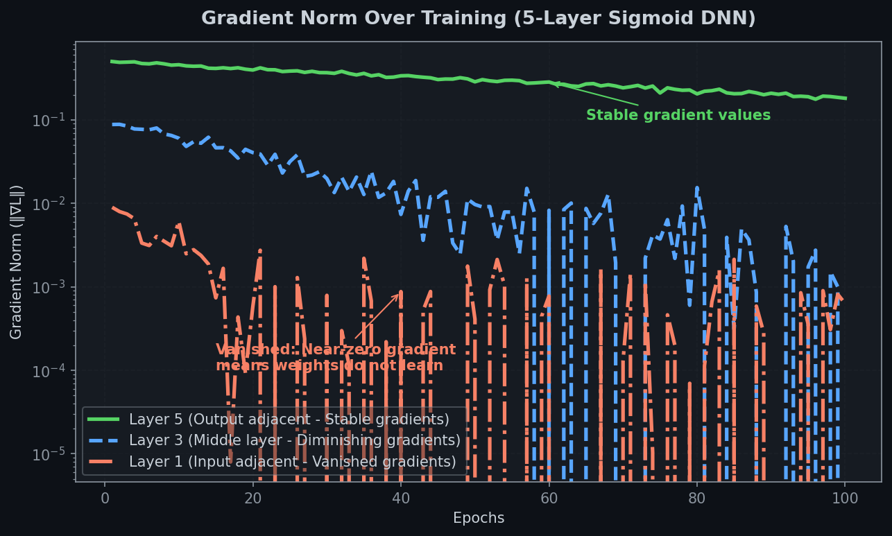
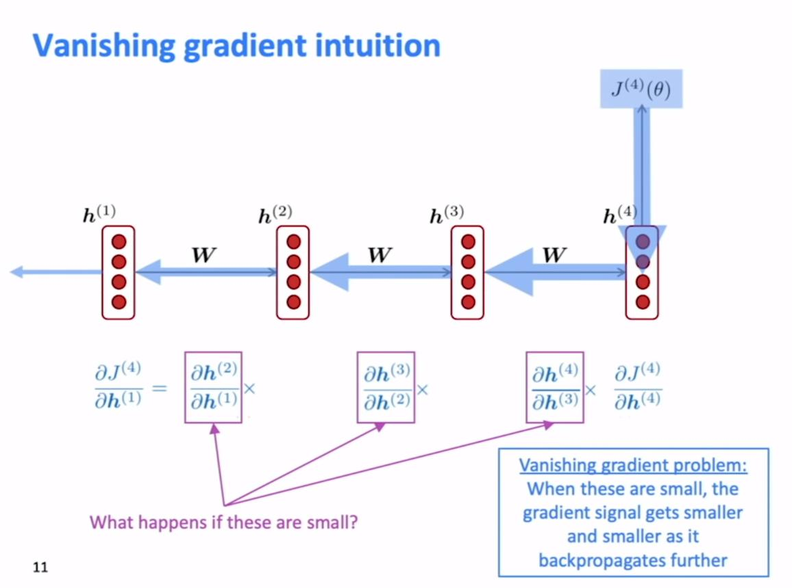
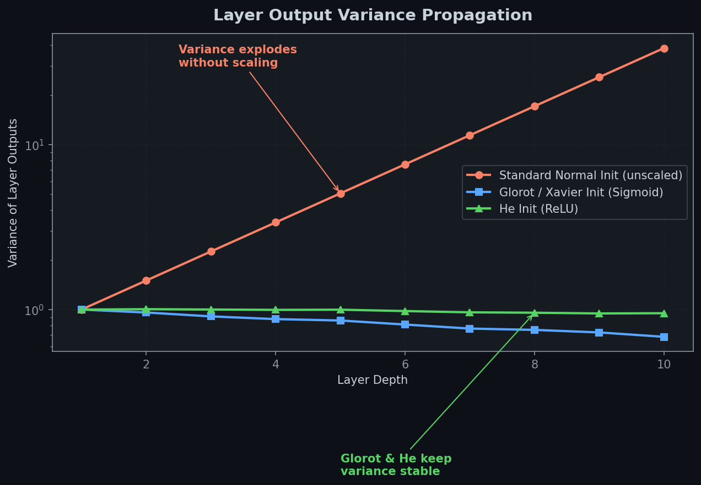
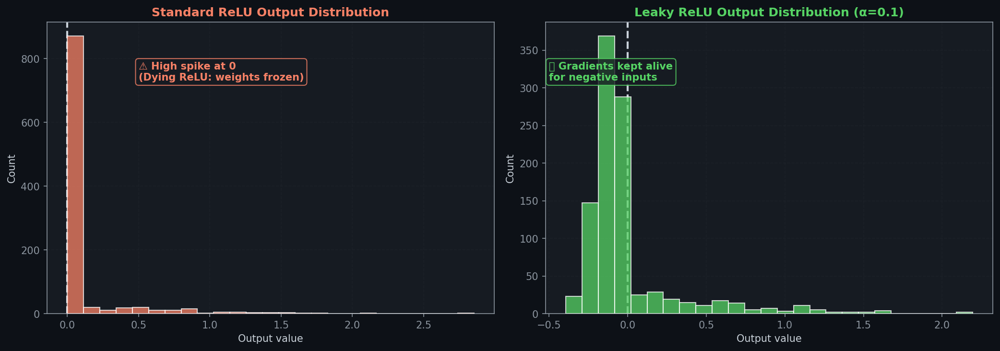
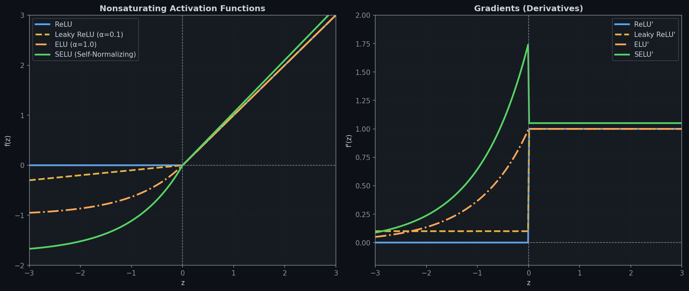

# 🔥 Module 1: Vanishing & Exploding Gradients — The Root Problem of Deep Learning
> **Ch. 11 — Hands-On ML with Scikit-Learn, Keras & TensorFlow (Aurélien Géron)**

---

## 📌 Table of Contents
1. [Start Here: The Big Picture](#big-picture)
2. [What Are Vanishing/Exploding Gradients?](#problem)
3. [Mathematical Root Cause](#math-root)
4. [Glorot / Xavier Initialization](#glorot)
5. [He Initialization](#he)
6. [Activation Function Hierarchy: SELU > ELU > Leaky ReLU > ReLU](#activations)
7. [Batch Normalization — The Game Changer](#batch-norm)
8. [BN Math Step-by-Step](#bn-math)
9. [Gradient Clipping](#gradient-clipping)
10. [Common Beginner Mistakes](#mistakes)
11. [Interview Q&A (Top 10)](#interview)
12. [⚡ One-Page Flash Card](#revision)

---

## 🌍 Start Here: The Big Picture {#big-picture}

> **TL;DR:** Deep networks are hard to train because gradients either shrink to zero (vanishing) or explode to infinity (exploding) as they flow backward through layers. The 3 fixes are: (1) better weight initialization, (2) better activation functions, and (3) Batch Normalization.

**The "Game of Telephone" Analogy 📞**

Imagine 10 people in a line whispering a message. Each person changes it slightly. By person 10, the message is unrecognizable. That's **vanishing gradients** — the error signal becomes too weak to reach early layers.

Now imagine they each SHOUT the message. By person 10, it's deafening noise. That's **exploding gradients** — the error signal becomes catastrophically large.

**Why This Matters:**
- 2013: It was proven that RNNs suffer from this severely (Pascanu et al.)
- 2015: Batch Normalization largely solved it for feedforward networks
- Still active research for RNNs, very deep ResNets, etc.

---

## 🔍 What Are Vanishing/Exploding Gradients? {#problem}

During **backpropagation**, gradients flow from the output layer backward to the input layer. At each layer, the gradient is multiplied by the **weight matrix** (transposed) and the **derivative of the activation function**.

### The Problem
**Vanishing:** If these multiplied values are consistently < 1, the gradient shrinks exponentially:
$$\text{gradient after } L \text{ layers} \approx 0.9^{100} \approx 0.0000027 \approx 0$$

**Exploding:** If consistently > 1:
$$\text{gradient after } L \text{ layers} \approx 1.1^{100} \approx 13,780 \approx \infty$$

### Why Early Layers Suffer Most
- **Output layer**: gradient = full loss gradient (e.g., 1.0)
- **Layer 5**: gradient × 0.9 × 0.9 × 0.9 × 0.9 × 0.9 ≈ 0.59 (still OK)
- **Layer 2**: gradient ≈ 0.0002 (too small to learn!)
- **Layer 1**: gradient ≈ 0.00002 (completely dead)

This means **early layers learn extremely slowly or not at all** — they essentially stay at their random initialization while only the last few layers train properly.

---

## 📐 Mathematical Root Cause {#math-root}

For a fully connected network with activation function $\phi$, the gradient flowing back through layer $l$ is:

$$\frac{\partial L}{\partial \mathbf{x}^{(l)}} = \frac{\partial L}{\partial \mathbf{x}^{(l+1)}} \cdot \mathbf{W}^{(l+1)T} \cdot \text{diag}\left(\phi'(\mathbf{z}^{(l)})\right)$$

After $L$ layers, this becomes a product of $L$ matrices and $L$ derivative vectors:

$$\frac{\partial L}{\partial \mathbf{x}^{(1)}} = \frac{\partial L}{\partial \mathbf{x}^{(L+1)}} \prod_{l=2}^{L+1} \mathbf{W}^{(l)T} \cdot \text{diag}\left(\phi'(\mathbf{z}^{(l-1)})\right)$$

**For sigmoid activations:**
$$\sigma'(z) = \sigma(z)(1-\sigma(z)) \leq 0.25 \quad \forall z$$

The maximum derivative is 0.25, occurring at z=0. So each sigmoid layer multiplies the gradient by at most 0.25. After 10 layers: $0.25^{10} \approx 9.5 \times 10^{-7}$ — essentially zero!




> 📊 **Graph 17:** The derivative of the logistic (sigmoid) activation function. Notice its maximum value is 0.25, which mathematically guarantees vanishing gradients in deep networks.

**The initialization problem:** If weights are initialized with variance $\sigma^2$, the variance of the forward signal and backward gradient depends on $n \cdot \sigma^2$ where $n$ is the number of neurons. For healthy signal flow:
$$\text{Var}(\text{output}) = \text{Var}(\text{input}) \implies n_\text{in} \cdot \sigma^2 = 1 \text{ (approximately)}$$

---

## 🎯 Glorot / Xavier Initialization {#glorot}

**Proposed by:** Glorot & Bengio, 2010

**The Insight:** For stable gradient flow in BOTH directions (forward AND backward), the variance of weights in each layer must satisfy:

$$\sigma^2 = \frac{2}{n_\text{in} + n_\text{out}}$$

Where:
- $n_\text{in}$ = number of input connections (fan-in)  
- $n_\text{out}$ = number of output connections (fan-out)
- This is the **average** of fan-in and fan-out

**Two Variants:**

| Variant | Distribution | Formula |
|---------|-------------|---------|
| **Normal** | $\mathcal{N}(0, \sigma^2)$ | $\sigma = \sqrt{\frac{2}{n_\text{in} + n_\text{out}}}$ |
| **Uniform** | $\mathcal{U}(-r, r)$ | $r = \sqrt{\frac{6}{n_\text{in} + n_\text{out}}}$ |

```python
# Glorot (Xavier) is Keras DEFAULT for Dense layers
layer = keras.layers.Dense(300, activation="sigmoid",
                           kernel_initializer="glorot_uniform")  # default!

# Normal version
layer = keras.layers.Dense(300, activation="tanh",
                           kernel_initializer="glorot_normal")
```


> 📊 **Graph 01:** Distribution of activation variances across layers depending on initialization strategy. Proper initialization maintains variance throughout the network.

> ✅ **Use Glorot when:** activation = sigmoid or tanh (symmetric around 0)

---

## 🎯 He Initialization {#he}

**Proposed by:** He et al., 2015 (specifically designed for ReLU)

**The Insight:** ReLU kills half the neurons (negative inputs → output 0). This halves the effective variance. So the weight variance needs to be DOUBLED compared to Glorot:

$$\sigma^2 = \frac{2}{n_\text{in}}$$

Note: fan-out is NOT used — only fan-in! This is because ReLU zeroes out half the outputs, so the expected variance after ReLU accounts for only the positive half.

**Mathematical Derivation:**
$$\text{Var}(y) = \frac{n_\text{in}}{2} \cdot \sigma_w^2 \cdot \text{Var}(x)$$

For variance preservation: $\frac{n_\text{in}}{2} \cdot \sigma_w^2 = 1 \implies \sigma_w^2 = \frac{2}{n_\text{in}}$

```python
# He initialization for ReLU/ELU networks
layer = keras.layers.Dense(300, activation="relu",
                           kernel_initializer="he_normal")

# For Leaky ReLU, he_uniform also works
layer = keras.layers.Dense(300, activation="elu",
                           kernel_initializer="he_normal")
```

**LeCun Initialization** (for SELU):
$$\sigma^2 = \frac{1}{n_\text{in}}$$

```python
layer = keras.layers.Dense(300, activation="selu",
                           kernel_initializer="lecun_normal")
```

### Quick Reference Table

| Activation | Initialization | Formula |
|-----------|---------------|---------|
| None, Tanh, Sigmoid, Softmax | Glorot | $\sigma = \sqrt{2/(n_{in}+n_{out})}$ |
| ReLU and variants | He | $\sigma = \sqrt{2/n_{in}}$ |
| SELU | LeCun | $\sigma = \sqrt{1/n_{in}}$ |

---

## ⚡ Activation Function Hierarchy {#activations}

> **Book's recommendation:** SELU > ELU > Leaky ReLU > ReLU > tanh > sigmoid

### 1. ReLU — The Baseline

$$\text{ReLU}(z) = \max(0, z)$$

```
       |    /
       |   /
       |  /
───────|/─────── z
       0
```


> 📊 **Graph 03:** The Dying ReLU problem. Once a neuron's weights shift such that it always outputs negative values, its gradient becomes 0 and it can never recover.

- ✅ Fast, sparse, no vanishing gradient for z>0
- ❌ **Dying ReLU**: If a neuron always receives negative input, gradient = 0 forever
- ❌ Not zero-centered (always outputs ≥ 0)

### 2. Leaky ReLU — Prevents Dying

$$
\text{LeakyReLU}_\alpha(z) = \begin{cases} 
z & \text{if } z > 0 \\ 
\alpha z & \text{if } z \leq 0 
\end{cases} \quad (\alpha \text{ typically } 0.01 \text{ to } 0.3)
$$

- ✅ Small slope for z<0 → neurons can't die
- **Variants:**
  - **RReLU (Randomized)**: α picked randomly during training, fixed as average for test → acts as regularizer
  - **PReLU (Parametric)**: α is LEARNED by backpropagation → best on large datasets, overfits on small ones

```python
model = keras.models.Sequential([
    keras.layers.Dense(300, kernel_initializer="he_normal"),
    keras.layers.LeakyReLU(alpha=0.2),
    keras.layers.Dense(100, kernel_initializer="he_normal"),
    keras.layers.LeakyReLU(alpha=0.2),
])
# Note: PReLU: replace LeakyReLU(alpha=0.2) with PReLU()
```

### 3. ELU — Exponential Linear Unit (Clevert et al., 2015)

$$
\text{ELU}_\alpha(z) = \begin{cases} 
z & \text{if } z \geq 0 \\ 
\alpha(e^z - 1) & \text{if } z < 0 
\end{cases}
$$

With default $\alpha = 1$:

```
       |    /
       |   /
───────|/─────── z
    ___/        ← smooth curve, not hard zero
  -1
```

**Advantages over ReLU:**
- ✅ Negative outputs → mean output closer to 0 → reduces vanishing gradient
- ✅ Non-zero gradient for z<0 → no dead neurons
- ✅ Smooth at z=0 (α=1) → faster gradient descent convergence
- ❌ Slower to compute than ReLU (uses `exp()`)
- ❌ Slower at test time than ReLU networks

### 4. SELU — Scaled ELU (Klambauer et al., 2017)

$$\text{SELU}(z) = \lambda \cdot \text{ELU}_\alpha(z) \quad (\lambda \approx 1.0507, \alpha \approx 1.6733)$$

**The Magic Property: Self-Normalization!**
If you build a network with:
1. Only dense layers
2. SELU activations in all hidden layers  
3. LeCun normal initialization
4. Standardized input features

Then **the output of each layer will automatically maintain mean≈0 and std≈1 during training!** This eliminates the vanishing/exploding gradient problem entirely.

**Required Conditions (ALL must hold):**
1. ✅ Input features standardized (mean=0, std=1)
2. ✅ `kernel_initializer="lecun_normal"`
3. ✅ Sequential architecture only (no skip connections, no RNNs)
4. ✅ All layers must be Dense (not Conv, not Recurrent)

```python
# SELU self-normalizing network
model = keras.models.Sequential()
model.add(keras.layers.Flatten(input_shape=[28, 28]))
for _ in range(20):  # 20 dense SELU layers → stays normalized!
    model.add(keras.layers.Dense(100, activation="selu",
                                  kernel_initializer="lecun_normal"))
model.add(keras.layers.Dense(10, activation="softmax"))
```

### The Full Comparison


> 📊 **Graph 02:** Visual comparison of ReLU, Leaky ReLU, ELU, and SELU activation functions. Note the smooth non-zero negative region for ELU and SELU.

| Activation | Dead? | Zero-centered | Grad for z<0 | Compute | Best When |
|-----------|-------|---------------|--------------|---------|-----------|
| **ReLU** | ❌ Yes | ❌ No | 0 | ⚡ Fast | Large nets, GPU optimized |
| **Leaky ReLU** | ✅ No | ❌ No | α | ⚡ Fast | When ReLU dies |
| **PReLU** | ✅ No | ❌ No | learned | ⚡ Fast | Large datasets |
| **ELU** | ✅ No | ✅ Yes | smooth | 🐢 Slow | Convergence speed critical |
| **SELU** | ✅ No | ✅ Yes | smooth | 🐢 Slow | Dense-only, self-normalizing |

---

## 🧱 Batch Normalization — The Game Changer {#batch-norm}

**Proposed by:** Sergey Ioffe & Christian Szegedy, 2015

**The Problem BN Solves:**
- Even with good initialization and activation functions, gradients can degrade as training progresses
- Each layer's input distribution changes as the weights in the previous layer change → **Internal Covariate Shift**
- This forces each layer to constantly re-adapt to a shifting input distribution

**BN's Solution:** At each layer, normalize the activations to have mean≈0 and variance≈1, then let the network LEARN the optimal scale and shift.

**Key Insight:** You're not forcing the network to always have zero-mean/unit-variance outputs. You're letting the network CHOOSE the best mean and variance through learnable parameters γ (scale) and β (shift).

---

## 📐 BN Math Step-by-Step {#bn-math}

**For a mini-batch B of size $m_B$ with input $\mathbf{x}$:**

**Step 1: Compute batch mean**
$$
\boldsymbol{\mu}_B = \frac{1}{m_B} \sum_{i=1}^{m_B} \mathbf{x}^{(i)}
$$

**Step 2: Compute batch variance**
$$
\boldsymbol{\sigma}_B^2 = \frac{1}{m_B} \sum_{i=1}^{m_B} \left(\mathbf{x}^{(i)} - \boldsymbol{\mu}_B\right)^2
$$

**Step 3: Normalize**
$$
\hat{\mathbf{x}}^{(i)} = \frac{\mathbf{x}^{(i)} - \boldsymbol{\mu}_B}{\sqrt{\boldsymbol{\sigma}_B^2 + \varepsilon}} \quad (\varepsilon \approx 10^{-5} \text{ for numerical stability})
$$

**Step 4: Scale and shift (learnable!)**
$$
\mathbf{z}^{(i)} = \boldsymbol{\gamma} \otimes \hat{\mathbf{x}}^{(i)} + \boldsymbol{\beta}
$$

Where:
- $\boldsymbol{\gamma}$ (gamma) = learned scale parameter (initialized to 1)
- $\boldsymbol{\beta}$ (beta) = learned shift parameter (initialized to 0)

**Trainable parameters per BN layer:** $2 \times n_\text{features}$ (γ and β)  
**Non-trainable parameters per BN layer:** $2 \times n_\text{features}$ (running mean $\hat{\mu}$ and running variance $\hat{\sigma}^2$)

### At Test Time (Inference)

During inference, mini-batches don't exist. BN uses the **exponential moving averages** computed during training:

$$
\hat{\boldsymbol{\mu}} \leftarrow \hat{\boldsymbol{\mu}} \times \text{momentum} + \boldsymbol{\mu}_B \times (1 - \text{momentum})
$$
$$
\hat{\boldsymbol{\sigma}}^2 \leftarrow \hat{\boldsymbol{\sigma}}^2 \times \text{momentum} + \boldsymbol{\sigma}_B^2 \times (1 - \text{momentum})
$$

Then at test time:
$$
\hat{\mathbf{x}} = \frac{\mathbf{x} - \hat{\boldsymbol{\mu}}}{\sqrt{\hat{\boldsymbol{\sigma}}^2 + \varepsilon}}, \quad \mathbf{z} = \boldsymbol{\gamma} \otimes \hat{\mathbf{x}} + \boldsymbol{\beta}
$$

> 💡 **Momentum default is 0.99** (more 9s for larger datasets). The BN layer behaves differently during training vs. inference!

### Where to Place BN: Before or After Activation?

**Original paper**: Before activation (BN → Activation)  
**Many practitioners find**: After activation can sometimes work better  
**Book recommendation**: Before activation (more common, safer default)

```python
# Option A: BN before activation (original paper)
model = keras.models.Sequential([
    keras.layers.Flatten(input_shape=[28, 28]),
    keras.layers.BatchNormalization(),
    keras.layers.Dense(300, kernel_initializer="he_normal", use_bias=False),
    keras.layers.BatchNormalization(),
    keras.layers.Activation("elu"),
    keras.layers.Dense(100, kernel_initializer="he_normal", use_bias=False),
    keras.layers.BatchNormalization(),
    keras.layers.Activation("elu"),
    keras.layers.Dense(10, activation="softmax")
])
# Note: use_bias=False when BN is between layers (BN's beta IS the bias!)
```

> ⚠️ **Important:** When placing BN before the activation, set `use_bias=False` in the Dense layer. Why? The BN layer has its own learned shift parameter β, which plays the role of the bias. Including a separate bias in the Dense layer is redundant.

### BN Hyperparameters

| Hyperparameter | Default | Meaning |
|---------------|---------|---------|
| `momentum` | 0.99 | Moving average decay (use 0.9 for small datasets) |
| `axis` | -1 | Which axis to normalize (−1 = last = features) |
| `epsilon` | 0.001 | Numerical stability constant |
| `center` | True | Whether to learn β shift |
| `scale` | True | Whether to learn γ scale |

---

## ✂️ Gradient Clipping {#gradient-clipping}

**Used primarily for:** RNNs (BN is hard to use in RNNs), but also for any network with exploding gradients.

**Two variants:**

### Clip by Value
```python
optimizer = keras.optimizers.SGD(clipvalue=1.0)
```
- Clips each gradient component independently to range [-1.0, 1.0]
- ⚠️ **Changes the direction** of the gradient vector!
- Example: [0.9, 100.0] → [0.9, 1.0] (direction changed significantly)

### Clip by Norm
```python
optimizer = keras.optimizers.SGD(clipnorm=1.0)
```
- If the ℓ₂ norm of the gradient exceeds the threshold, scales the entire vector down proportionally
- ✅ **Preserves the direction** of the gradient vector
- Example: [0.9, 100.0] (norm≈100) → [0.009, 1.0] (same direction, scaled)

**When to use which:**
- If you care about gradient direction (most cases): **clipnorm**
- If you want simple bounds per parameter: **clipvalue**

---

## ❌ Common Beginner Mistakes {#mistakes}

**1. Using Glorot initialization with ReLU** ❌
> Reality: Glorot underestimates the needed variance for ReLU. Use He initialization for ReLU/ELU. This can cause vanishing gradients even at initialization.

**2. Using SELU in non-dense architectures** ❌
> Reality: Self-normalization breaks in ResNets (skip connections), CNNs, or RNNs. Using SELU there provides no benefit over ELU.

**3. Forgetting `use_bias=False` with BatchNormalization** ❌
> Reality: When BN comes right after a Dense layer, the Dense layer's bias is redundant (BN's β parameter already shifts the output). The bias just wastes parameters.

**4. Thinking BN eliminates the need for other regularization** ❌
> Reality: BN has a mild regularization effect (due to the noise of mini-batch statistics) but does NOT replace dropout for heavy regularization.

**5. Using BN with very small batches (size < 8)** ❌
> Reality: With small batches, the mini-batch statistics are very noisy estimates of the true distribution. BN becomes unreliable. Use Layer Normalization instead for small batches.

**6. Clipping gradients with `clipvalue` when direction matters** ❌
> Reality: `clipvalue` can drastically change gradient direction (e.g., [0.9, 100] → [0.9, 1.0] points diagonally instead of vertically). Use `clipnorm` to preserve direction.

**7. Forgetting input standardization with SELU** ❌
> Reality: SELU self-normalization requires standardized inputs (mean=0, std=1). Without standardization, the self-normalization guarantee breaks immediately at the first layer.

---

## 🎤 Interview Q&A {#interview}

**Q1: What is the vanishing gradient problem and why does it specifically affect early layers?**
> **A:** During backpropagation, gradients are multiplied by $\mathbf{W}^T \cdot \phi'(z)$ at each layer. With sigmoid (max derivative = 0.25), after 10 layers the gradient is multiplied by at most $0.25^{10} \approx 10^{-6}$ — essentially zero. Early layers receive near-zero gradients and learn essentially nothing. This is why models trained with sigmoid in deep networks effectively only train the last few layers.

**Q2: What is He initialization and why is it different from Glorot for ReLU?**
> **A:** Glorot initialization sets $\sigma^2 = 2/(n_{in}+n_{out})$ assuming the activation preserves variance symmetrically. ReLU zeroes all negative outputs, halving the effective variance. He initialization compensates by doubling: $\sigma^2 = 2/n_{in}$. Using Glorot with ReLU leads to signals that progressively shrink through layers.

**Q3: Explain Batch Normalization step by step and what parameters are learned.**
> **A:** BN computes the batch mean $\mu_B$ and variance $\sigma_B^2$, normalizes: $\hat{x} = (x - \mu_B)/\sqrt{\sigma_B^2+\varepsilon}$, then applies learnable scale $\gamma$ and shift $\beta$: output $= \gamma\hat{x}+\beta$. Learned parameters: $\gamma$ (scale) and $\beta$ (shift), one per feature per layer. Non-trainable: running mean and variance for inference. BN uses batch stats during training but running averages at test time.

**Q4: Why do we set `use_bias=False` in Dense layers before BatchNormalization?**
> **A:** The BN layer has its own shift parameter $\beta$ that serves exactly the same purpose as the Dense layer's bias — it shifts the output. Having both is redundant and wastes parameters. The Dense bias would be immediately subtracted during BN's normalization step anyway, making it ineffective.

**Q5: What is the difference between gradient clipping by value vs. by norm?**
> **A:** `clipvalue=1.0` clips each gradient component independently to [-1, 1], potentially changing the gradient's direction (e.g., [0.9, 100] → [0.9, 1.0] — direction rotated). `clipnorm=1.0` scales the entire gradient vector proportionally if its L2-norm exceeds the threshold, preserving the direction. For most tasks, `clipnorm` is preferred.

**Q6: Why does SELU require `lecun_normal` initialization and standardized inputs?**
> **A:** The mathematical proof of SELU's self-normalization property requires that (1) the weight variance satisfies $\sigma^2 = 1/n_{in}$ (LeCun normal), and (2) the input distribution is standardized (mean=0, std=1). Without these, the self-normalization guarantee breaks: the network converges toward non-zero mean and non-unit variance in early layers.

**Q7: How does Batch Normalization behave differently during training vs. inference?**
> **A:** During training: BN computes $\mu_B$ and $\sigma_B^2$ from the current mini-batch. During inference: mini-batches don't exist, so BN uses exponential moving averages of $\mu$ and $\sigma^2$ accumulated during training. This is why `model.fit()` sets `training=True` and `model.predict()` sets `training=False` — they produce different outputs even on the same input!

**Q8: What is Internal Covariate Shift, and how does BN address it?**
> **A:** Internal Covariate Shift: as weights in layer $l$ change during training, the input distribution to layer $l+1$ shifts, forcing it to constantly re-adapt. BN fixes the distribution of each layer's input to (approximately) N(0,1) before scaling by γ and β — regardless of what the previous layer's weights are doing. This allows each layer to learn more independently and stably.

**Q9: Which activation function should you choose and when?**
> **A:** Follow: SELU (dense-only sequential nets, standardized inputs) > ELU (default if not SELU) > Leaky ReLU/PReLU (when dying ReLU is a problem) > ReLU (GPU-optimized, large nets) > tanh (RNNs output gates) > sigmoid (binary output only). At runtime, ReLU is still fastest due to hardware optimizations.

**Q10: Can SELU be used in convolutional networks?**
> **A:** The self-normalization guarantee is only proven for pure dense architectures. However, researchers have observed empirically that SELU can still improve performance in CNNs, even without the theoretical guarantee. The book notes this as an observation, not a proven property.

---

## ⚡ One-Page Flash Card {#revision}

```
╔══════════════════════════════════════════════════════════════════════╗
║           MODULE 1 — VANISHING GRADIENTS & SOLUTIONS                  ║
╠══════════════════════════════════════════════════════════════════════╣
║                                                                        ║
║  ROOT CAUSE: gradient × (W^T × φ'(z)) per layer → shrinks/explodes   ║
║  Sigmoid max derivative = 0.25 → after 10 layers → 10^-6             ║
║                                                                        ║
║  INITIALIZATION RULES:                                                 ║
║  Glorot → sigmoid/tanh:  σ² = 2 / (n_in + n_out)                    ║
║  He     → ReLU/ELU:      σ² = 2 / n_in                              ║
║  LeCun  → SELU:          σ² = 1 / n_in                              ║
║                                                                        ║
║  ACTIVATION HIERARCHY:                                                 ║
║  SELU > ELU > Leaky ReLU > ReLU > tanh > sigmoid                     ║
║  SELU = self-normalizing (dense only, standardized inputs required)   ║
║  ELU = smooth, negative outputs, slower than ReLU                    ║
║  Leaky ReLU = α=0.01 negative slope, prevents dying neurons          ║
║                                                                        ║
║  BATCH NORMALIZATION:                                                  ║
║  1. μ_B = mean of batch                                               ║
║  2. σ_B² = variance of batch                                          ║
║  3. x̂ = (x - μ_B) / sqrt(σ_B² + ε)                                 ║
║  4. output = γ·x̂ + β  ← γ,β are LEARNED                            ║
║  Training: uses batch stats │ Inference: uses running averages        ║
║  use_bias=False before BN! (β already IS the bias)                   ║
║                                                                        ║
║  GRADIENT CLIPPING:                                                    ║
║  clipvalue=1.0 → clips each component, CHANGES direction             ║
║  clipnorm=1.0  → scales whole vector, PRESERVES direction            ║
║                                                                        ║
╚══════════════════════════════════════════════════════════════════════╝
```

---

**🔗 Next Module →** [02 — Batch Normalization, Clipping & Transfer Learning](02_Batch_Normalization_Clipping.md)
