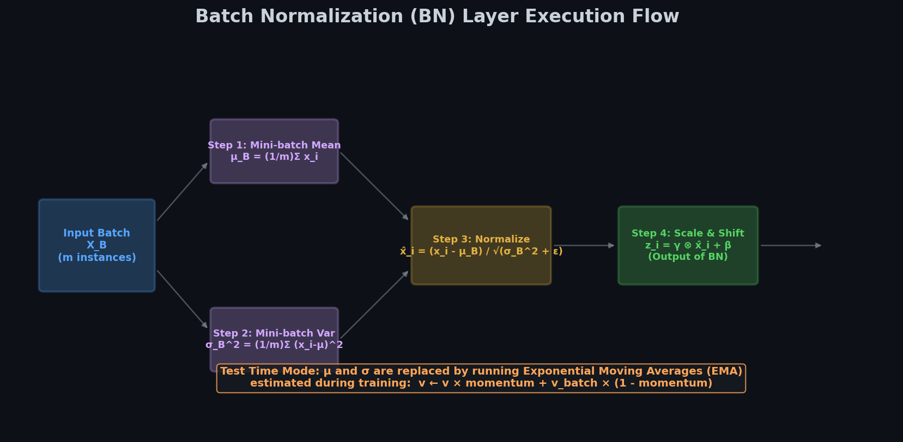
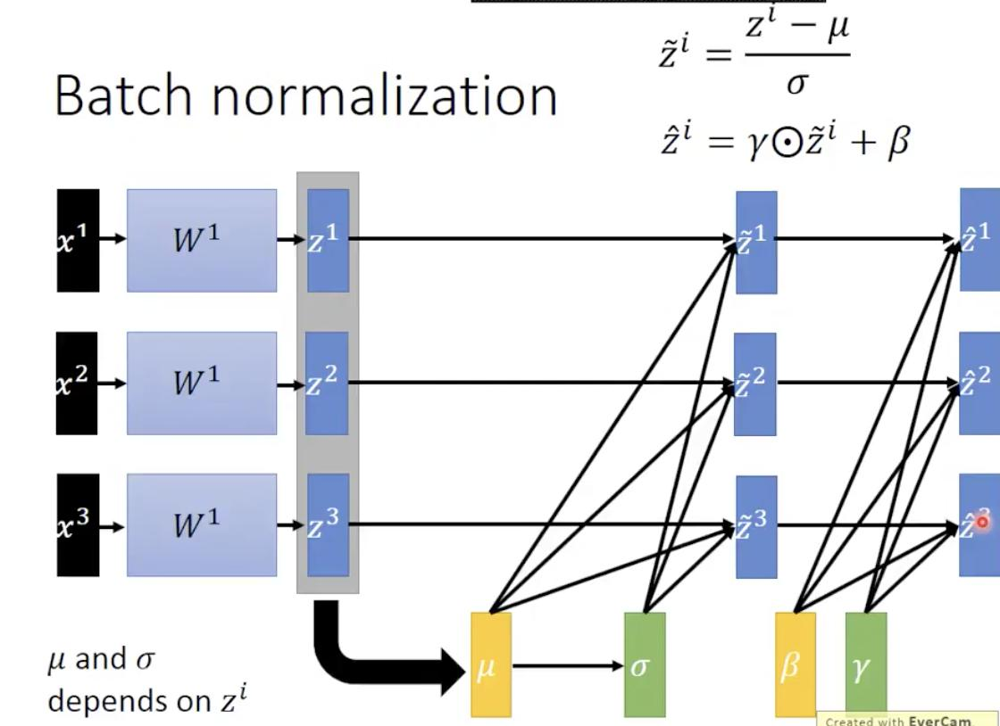
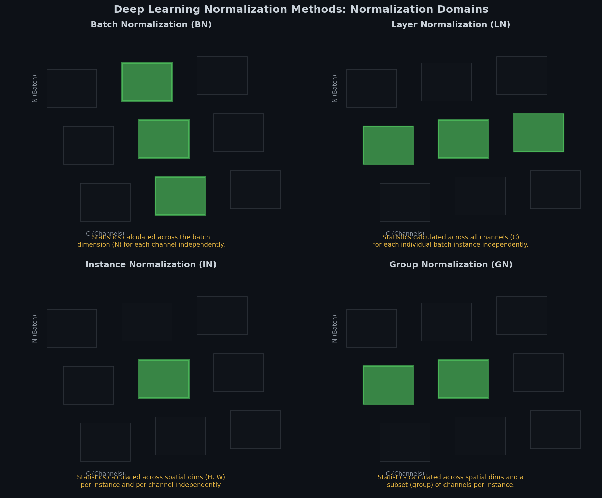
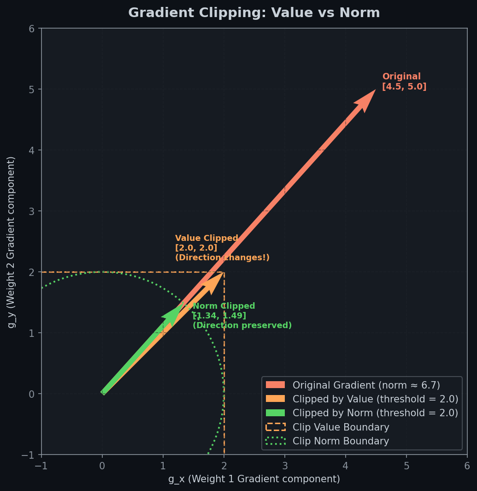

# 🎛️ Module 2: Batch Normalization & Gradient Clipping
> **Ch. 11 — Hands-On ML with Scikit-Learn, Keras & TensorFlow (Aurélien Géron)**

---

## 📌 Table of Contents
1. [Start Here: The Big Picture](#big-picture)
2. [Batch Normalization: The Mathematical Algorithm](#bn-math)
3. [Train vs. Test Time Behavior](#train-test-behavior)
4. [Keras Batch Normalization Implementation](#keras-bn)
5. [Gradient Clipping (Value vs. Norm)](#grad-clipping)
6. [Common Beginner Mistakes](#mistakes)
7. [Interview Q&A (Top 5)](#interview)
8. [⚡ One-Page Flash Card](#revision)

---

## 🌍 Start Here: The Big Picture {#big-picture}

> **TL;DR:** Batch Normalization (BN) stabilizes training by standardizing inputs to each hidden layer, learning the optimal scale and offset on the fly. It permits larger learning rates and acts as a mild regularizer. Gradient Clipping handles exploding gradients by clipping backpropagated gradients to a maximum value or norm (critical for RNNs).

**The "River Water Purifier" Analogy 🌊:**
Imagine a water treatment pipeline. If the input water from upstream keeps changing in mud density and acidity (internal covariate shift), the downstream filters have to continuously adapt, making the purification process slow and unstable.

**Batch Normalization** is like putting a standardizing filter before every single purification stage. It ensures that the water entering each filter always has a constant average acidity and turbidity (mean $0$, variance $1$). The stage can then use its own dials ($\gamma, \beta$) to tweak the water properties to the optimal level, making the whole system run much faster and more reliably.

---

## 🔍 1. Batch Normalization: The Mathematical Algorithm {#bn-math}

Batch Normalization addresses the problem of **Internal Covariate Shift**—the change in the distribution of network activations during training due to updates to the weights of prior layers.

### Step-by-Step Algorithm (Equation 11-3)

For a mini-batch $B$ of size $m_B$, the BN layer performs the following calculations:

1.  **Compute Mini-batch Mean:**

    $$
    \mathbf{\mu}_B = \frac{1}{m_B} \sum_{i=1}^{m_B} \mathbf{x}^{(i)}
    $$

2.  **Compute Mini-batch Variance:**

    $$
    \mathbf{\sigma}_B^2 = \frac{1}{m_B} \sum_{i=1}^{m_B} (\mathbf{x}^{(i)} - \mathbf{\mu}_B)^2
    $$

3.  **Standardize (Zero-Center and Normalize):**

    $$
    \hat{\mathbf{x}}^{(i)} = \frac{\mathbf{x}^{(i)} - \mathbf{\mu}_B}{\sqrt{\mathbf{\sigma}_B^2 + \epsilon}}
    $$
    *Where $\epsilon$ (typically $10^{-5}$) is a tiny smoothing term to prevent division by zero.*

4.  **Scale and Shift:**

    $$
    \mathbf{z}^{(i)} = \mathbf{\gamma} \otimes \hat{\mathbf{x}}^{(i)} + \mathbf{\beta}
    $$
    *Where $\mathbf{\gamma}$ (scale parameter) and $\mathbf{\beta}$ (shift parameter) are learnable parameters of the layer.*




> 📊 **Graph 04:** Execution pipeline of Batch Normalization showing the mini-batch standardization steps followed by the learnable scaling ($\gamma$) and shifting ($\beta$) operations.


> 📊 **Graph 16:** Comparison of Deep Learning Normalization Methods (Batch Norm vs. Layer Norm vs. Instance Norm vs. Group Norm). Shaded areas represent the tensor elements grouped to compute mean and variance.

---

## 🔍 2. Train vs. Test Time Behavior {#train-test-behavior}

Batch Normalization behaves differently during training than during testing:

### During Training:
*   Standardization statistics ($\mathbf{\mu}_B, \mathbf{\sigma}_B$) are calculated directly from the current mini-batch instances.
*   Because each mini-batch fluctuates randomly, it introduces a small amount of noise to the normalized inputs. This noise acts as a **regularizer**, reducing overfitting (similar to dropout).

### During Testing (Inference):
*   We may need to make predictions for single instances, so calculating mini-batch statistics is impossible.
*   Instead, Keras uses running **Exponential Moving Averages (EMA)** of the means ($\mathbf{\mu}$) and standard deviations ($\mathbf{\sigma}$) tracked during training:

    $$
    \mathbf{v}_{running} \leftarrow \mathbf{v}_{running} \times \text{momentum} + \mathbf{v}_{batch} \times (1 - \text{momentum})
    $$
*   *The `momentum` hyperparameter is typically set close to 1 (e.g., $0.9$, $0.99$, or $0.999$). Use more 9s for larger datasets and smaller batch sizes.*

---

## 🔍 3. Keras Batch Normalization Implementation {#keras-bn}

There is an ongoing debate about whether to add Batch Normalization **before** or **after** the activation function. Both options are supported in Keras:

### Case 1: Batch Normalization AFTER Activations (Default/Easiest)
```python
import tensorflow as tf
from tensorflow import keras

model_after = keras.models.Sequential([
    keras.layers.Flatten(input_shape=[28, 28]),
    keras.layers.BatchNormalization(), # Input normalization
    keras.layers.Dense(300, activation="elu", kernel_initializer="he_normal"),
    keras.layers.BatchNormalization(), # Normalization after activation
    keras.layers.Dense(100, activation="elu", kernel_initializer="he_normal"),
    keras.layers.BatchNormalization(),
    keras.layers.Dense(10, activation="softmax")
])
# OUTPUT: Model built with BN layers placed after dense activations.
```

### Case 2: Batch Normalization BEFORE Activations (Recommended by Original Paper)
When placing BN before activations, the preceding dense layer does not need bias terms because the BN layer's shift parameter $\beta$ already acts as a bias. Set `use_bias=False`.

```python
model_before = keras.models.Sequential([
    keras.layers.Flatten(input_shape=[28, 28]),
    keras.layers.BatchNormalization(),
    
    keras.layers.Dense(300, kernel_initializer="he_normal", use_bias=False),
    keras.layers.BatchNormalization(),
    keras.layers.Activation("elu"),
    
    keras.layers.Dense(100, kernel_initializer="he_normal", use_bias=False),
    keras.layers.BatchNormalization(),
    keras.layers.Activation("elu"),
    
    keras.layers.Dense(10, activation="softmax")
])
# OUTPUT: Optimized model built with BN layers placed before activations.
```

---

## 🔍 4. Gradient Clipping (Value vs. Norm) {#grad-clipping}

Gradient clipping is used to limit the maximum magnitude of gradients during backpropagation, preventing weight divergence (exploding gradients). It is especially critical in Recurrent Neural Networks (RNNs) where gradients can grow exponentially over time.


> 📊 **Graph 05:** Geometric effect of clipping. Clip by Value restricts each component independently, which can change the direction of the gradient vector. Clip by Norm rescales the entire vector to limit its magnitude, preserving its original direction.

### 1. Clip by Value
$$
\mathbf{g}_{clipped} = \min(\text{clipvalue}, \max(-\text{clipvalue}, \mathbf{g}))
$$
*   **Behavior:** Checks every element of the gradient vector independently. If a single parameter's gradient exceeds the threshold, it is cut down.
*   **Drawback:** Can change the orientation of the gradient vector (e.g., if gradient is $[0.9, 100.0]$ and we clip to $1.0$, it becomes $[0.9, 1.0]$, rotating its direction towards a $45^\circ$ diagonal).

### 2. Clip by Norm
$$
\mathbf{g}_{clipped} = \mathbf{g} \cdot \frac{\text{clipnorm}}{\max(\text{clipnorm}, \|\mathbf{g}\|_2)}
$$
*   **Behavior:** Checks the $\ell_2$ norm of the entire gradient vector. If the norm exceeds the threshold, the entire vector is scaled down.
*   **Benefit:** Preserves the direction of the gradient vector (e.g., $[0.9, 100.0]$ becomes $[0.009, 1.0]$ under `clipnorm=1.0`).

```python
# Configure optimizers with clipping in Keras
optimizer_val = keras.optimizers.SGD(clipvalue=1.0)
optimizer_norm = keras.optimizers.SGD(clipnorm=1.0)
# OUTPUT: Optimizers created with gradient clipping constraints.
```

---

## ❌ Common Beginner Mistakes {#mistakes}

**1. Keeping bias terms in dense layers that immediately precede BN layers** ❌
> **Reality:** Since Batch Normalization normalizes activations and adds a learnable shift parameter $\beta$, any bias term in the preceding layer ($b$ in $W x + b$) is mathematically redundant and gets canceled out. Save parameters by setting `use_bias=False`.

**2. Standardizing the entire dataset before training when using BN as the first layer** ⚠️
> **Reality:** If you put a `BatchNormalization` layer as the very first layer in your Keras sequential stack, you don't need to use Scikit-Learn's `StandardScaler` on the training set. The first BN layer will automatically standardize the inputs for you, batch-by-batch.

**3. Setting BN `momentum` too low for small batch sizes** ❌
> **Reality:** If you have small batch sizes, batch statistics vary heavily. If `momentum` is too low (e.g. $0.9$), the running averages will oscillate wildly. For small batch sizes, set the momentum higher (e.g., $0.99$ or $0.999$) to slow down updates to the running averages and make them more stable.

---

## 🎤 Interview Q&A (Top 5) {#interview}

**Q1: How does Batch Normalization accelerate training?**
> **A:** First, it mitigates the vanishing/exploding gradients problems, allowing the use of much larger learning rates. Second, it reduces the network's sensitivity to weight initialization. Third, it stabilizes the distribution of inputs to each layer (mitigating internal covariate shift), ensuring layers do not have to continuously adapt to changing input distributions.

**Q2: What parameters does a Batch Normalization layer learn? Which are trainable via backpropagation?**
> **A:** A BN layer learns four parameter vectors per channel/input: $\gamma$ (scale), $\beta$ (offset), $\mu$ (mean moving average), and $\sigma$ (standard deviation moving average). $\gamma$ and $\beta$ are updated via backpropagation (trainable). $\mu$ and $\sigma$ are non-trainable; they are estimated during training using exponential moving averages and are only used during testing.

**Q3: Why does Batch Normalization act as a regularizer?**
> **A:** During training, because $\mu_B$ and $\sigma_B$ are calculated over mini-batches, they represent noisy estimates of the true training set statistics. This batch-wise noise acts as a form of regularization (similar to dropout), preventing the network from overfitting.

**Q4: What is the main drawback of Batch Normalization during inference, and how do we resolve it?**
> **A:** At test time, BN layers cannot compute batch statistics because we may be predicting for a single instance. The original calculation would fail (division by zero or high variance). We resolve this by freezing the layer statistics to the running exponential moving average ($\mu$ and $\sigma$) accumulated during training.

**Q5: Compare `clipvalue` and `clipnorm`. In what scenario is `clipnorm` preferred?**
> **A:** `clipvalue` clips each partial derivative element-wise, which changes the direction of the gradient vector. `clipnorm` clips the vector as a whole, scaling all elements by the same factor and preserving direction. `clipnorm` is preferred when the relative coordinate proportions of the gradient updates are critical for optimization stability.

---

## ⚡ One-Page Flash Card {#revision}

```
╔══════════════════════════════════════════════════════════════════╗
║               MODULE 2 — BN & GRADIENT CLIPPING                  ║
╠══════════════════════════════════════════════════════════════════╣
║                                                                  ║
║  BATCH NORMALIZATION MATH:                                       ║
║  1. Mean:        μ_B = (1/m) * Σ x_i                             ║
║  2. Variance:    σ_B² = (1/m) * Σ (x_i - μ_B)²                   ║
║  3. Normalize:   x̂_i = (x_i - μ_B) / √(σ_B² + ε)                 ║
║  4. Output:      z_i = γ ⊗ x̂_i + β                               ║
║                                                                  ║
║  LEARNABLE PARAMETERS:                                           ║
║  - γ (scale) & β (shift)  →  trainable (backprop)                ║
║  - μ & σ (moving stats)   →  non-trainable (updated via EMA)     ║
║                                                                  ║
║  BN BEST PRACTICES:                                              ║
║  - BN Before Activation: Set use_bias=False on preceding layer.   ║
║  - BN After Activation:  Default, works fine for many tasks.     ║
║  - Run Time Penalty: BN adds latency; can fuse BN into prior     ║
║    weights after training to get rid of it during deployment.    ║
║                                                                  ║
║  GRADIENT CLIPPING RULES:                                        ║
║  - Use in RNNs (exploding gradients).                            ║
║  - clipvalue=1.0  → clips individually, changes gradient angle.  ║
║  - clipnorm=1.0   → scales entire gradient, keeps vector direction.║
║                                                                  ║
║  COMMON PITFALL:                                                 ║
║  - Forgetting use_bias=False in layers preceding BN-before-act.  ║
╚══════════════════════════════════════════════════════════════════╝
```

---

**🔗 Previous Module →** [01_Vanishing_Exploding_Gradients.md](01_Vanishing_Exploding_Gradients.md)  
**🔗 Next Module →** [03_Transfer_Learning_Pretraining.md](03_Transfer_Learning_Pretraining.md)
