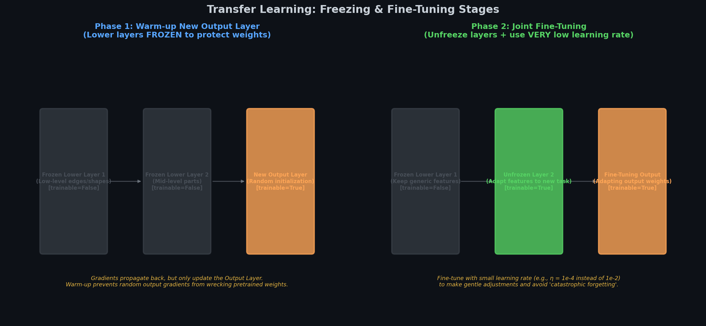
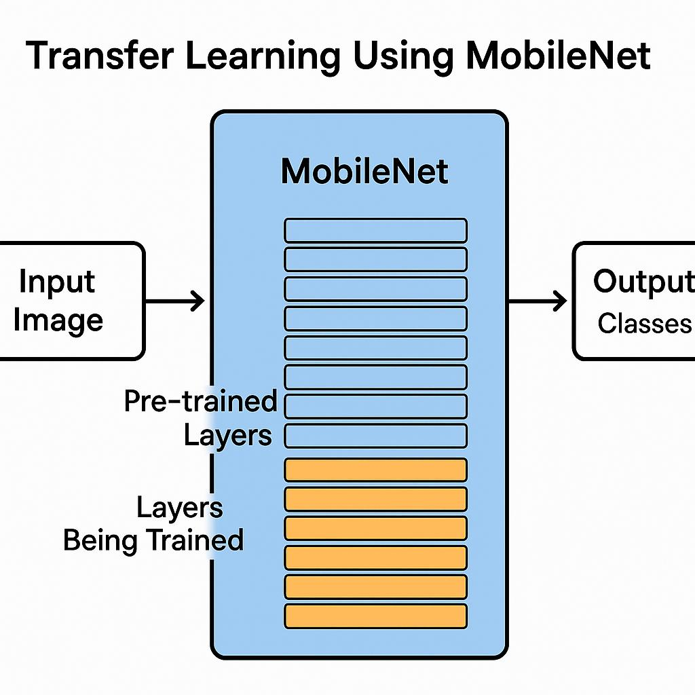
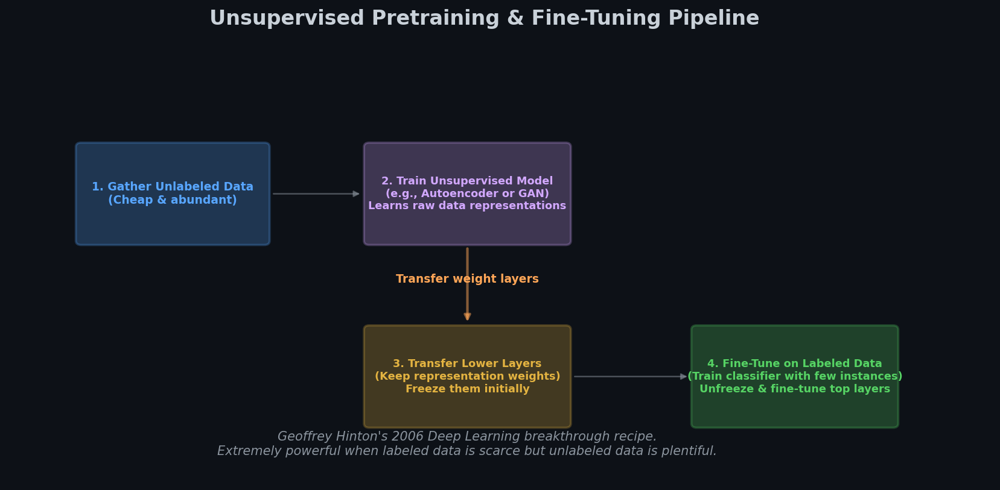

# 🔄 Module 3: Transfer Learning & Unsupervised Pretraining
> **Ch. 11 — Hands-On ML with Scikit-Learn, Keras & TensorFlow (Aurélien Géron)**

---

## 📌 Table of Contents
1. [Start Here: The Big Picture](#big-picture)
2. [Transfer Learning — The Core Idea](#transfer-learning)
3. [How Many Layers to Freeze?](#freeze-layers)
4. [Keras Implementation: Step by Step](#keras-impl)
5. [Unsupervised Pretraining](#unsupervised)
6. [Pretraining on an Auxiliary Task](#auxiliary)
7. [Self-Supervised Learning](#self-supervised)
8. [Common Beginner Mistakes](#mistakes)
9. [Interview Q&A](#interview)
10. [⚡ One-Page Flash Card](#revision)

---

## 🌍 Start Here: The Big Picture {#big-picture}

> **TL;DR:** Don't train large networks from scratch if you don't have to. Reuse the lower layers of an existing network that learned general features, then fine-tune the top layers for your specific task. This is "standing on the shoulders of giants."

**The "Hired Expert" Analogy 🏗️**

Imagine you need to build a skyscraper. You could train an architect from scratch (years of university), OR you could hire an experienced architect who already knows structural engineering, materials science, etc., and only needs to learn the specific local building codes.

Transfer learning = hire the experienced architect. You only need to teach them the new part (local codes = your specific task). You don't re-teach them physics.

**Why Transfer Learning Works:**
- Neural networks learn **hierarchical features**: edges → shapes → objects → semantic concepts
- Lower layers learn **universal, transferable** patterns (edges, curves, textures)
- Upper layers learn **task-specific** patterns (faces vs. dogs vs. cars)
- Reusing lower layers = reusing years of "visual education"

**When it works best:**
- Deep convolutional networks (CNNs) for vision tasks
- Source task similar to target task
- Target task has limited labeled data

**When it works poorly:**
- Small dense networks (they learn few, non-transferable patterns)
- Very different source and target tasks (e.g., medical imaging ← image classification)

---

## 🔍 Transfer Learning — The Core Idea {#transfer-learning}

**Scenario:**
- You have: a large pretrained network (e.g., trained on ImageNet, 1.2M images, 1000 classes)
- You need: a classifier for 10 specific vehicle types with only 5,000 labeled images
- Problem: 5,000 images are NOT enough to train a deep CNN from scratch

**Solution:**
1. Take the pretrained model (which already knows about edges, textures, shapes)
2. Remove its output layer (designed for 1000 classes, useless for your 10)
3. Add a new output layer for YOUR 10 classes
4. Freeze the lower layers (don't retrain them — their weights are already great)
5. Train only the new top layers on your small dataset




> 📊 **Graph 06:** Transfer learning stages: Reusing lower layers, replacing the output head, and selectively fine-tuning.

```
BEFORE (ImageNet model):
Input → Conv1 → Conv2 → Conv3 → Dense1 → Dense2 → Output(1000 classes)

AFTER (your vehicle classifier):
Input → Conv1* → Conv2* → Conv3* → Dense1* → [NEW Dense] → Output(10 classes)
       [FROZEN — pretrained weights]            [TRAINABLE — randomly initialized]
```
*(asterisk = frozen)*

---

## 🎛️ How Many Layers to Freeze? {#freeze-layers}

The key question: **which layers to freeze and which to retrain?**

**Decision Rule:**
| Source Task Similarity | Training Data Size | Strategy |
|----------------------|-------------------|---------|
| Very similar | Small (few hundred-few thousand) | Freeze most layers, train only output |
| Similar | Moderate (thousands) | Freeze lower layers, retrain top 1-3 layers |
| Somewhat similar | Large (tens of thousands) | Retrain all layers (fine-tune everything) |
| Very different | Large | Use pretrained only for initialization, retrain all |

**Mental Model:**
```
Layer 1: Edge detectors (lines, curves) ← Very generic → ALMOST ALWAYS FREEZE
Layer 2: Shape detectors (corners, blobs) ← Generic → Usually freeze
Layer 3: Part detectors (eyes, wheels) ← Somewhat specific → Maybe freeze
Layer 4: Object detectors ← Task-specific → Usually retrain
Output: Task-specific ← Always replace and retrain
```

**Practical advice from the book:**
- Start by **freezing all reused layers** first, train the new layers
- Then **unfreeze top 1-2 frozen layers** and retrain (learning rate should be small!)
- Continue unfreezing one layer at a time until validation performance stops improving

---

## 💻 Keras Implementation: Step by Step {#keras-impl}

```python
import tensorflow as tf
from tensorflow import keras

# ── STEP 1: Load the pretrained model ──────────────────────────────────────────
model_A = keras.models.load_model("my_model_A.h5")

# ── STEP 2: Clone the architecture but NOT the weights (fresh clone) ─────────
# (Alternative: reuse directly)
model_B_on_A = keras.models.Sequential(model_A.layers[:-1])  # all except last

# ── STEP 3: Add your new task-specific output layer ───────────────────────────
model_B_on_A.add(keras.layers.Dense(1, activation="sigmoid"))  # e.g., binary classifier

# ── STEP 4: Freeze all reused layers ──────────────────────────────────────────
for layer in model_B_on_A.layers[:-1]:  # all except new top layer
    layer.trainable = False

# ── STEP 5: Compile and train only the top (new) layers ───────────────────────
model_B_on_A.compile(
    loss="binary_crossentropy",
    optimizer=keras.optimizers.SGD(lr=1e-3),
    metrics=["accuracy"]
)
history = model_B_on_A.fit(X_train_B, y_train_B, epochs=4,
                            validation_data=(X_valid_B, y_valid_B))

# ── STEP 6: Unfreeze upper layers and fine-tune ────────────────────────────────
for layer in model_B_on_A.layers[:-1]:
    layer.trainable = True  # unfreeze

model_B_on_A.compile(
    loss="binary_crossentropy",
    optimizer=keras.optimizers.SGD(lr=1e-4),  # ← MUCH smaller LR for fine-tuning!
    metrics=["accuracy"]
)
history = model_B_on_A.fit(X_train_B, y_train_B, epochs=16,
                            validation_data=(X_valid_B, y_valid_B))
```

> ⚠️ **Critical:** After changing `trainable`, you MUST recompile the model. Only then does Keras update which parameters to optimize.

> ⚠️ **Critical:** Use a much **smaller learning rate** when fine-tuning (e.g., 10x smaller). Large LR will destroy the pretrained weights you worked hard to preserve.

---

## 🔓 Unsupervised Pretraining {#unsupervised}

**When to use:** You have a complex task with LOTS of unlabeled data but LITTLE labeled data.

**Strategy:**
1. Train an **autoencoder** or **GAN** on the unlabeled data (this is cheap — no labels needed!)
2. The encoder/discriminator learns rich feature representations
3. **Reuse the lower layers** of this unsupervised model
4. Add task-specific output layers on top
5. Fine-tune with your small labeled dataset

**Historical context:** This technique (with Restricted Boltzmann Machines, not autoencoders) is what Geoffrey Hinton used in 2006 to restart the field of deep learning! It was the dominant approach until ~2010 when better activations + initialization made supervised training feasible again.

**Modern unsupervised pretraining tools:**
- **Autoencoders** (Chapter 17): Learn compressed representations
- **GANs** (Chapter 17): Learn to generate realistic data → good features
- **Contrastive learning** (SimCLR, MoCo): Learn by comparing similar/dissimilar pairs


> 📊 **Graph 07:** Unsupervised pretraining workflow: Train an autoencoder or GAN on unlabeled data, then reuse the feature extractor for the supervised task.

```
Unlabeled data (millions of images, no labels)
        ↓
Train Autoencoder on all data (unsupervised)
        ↓ (reuse encoder layers)
Encoder: Layer1 → Layer2 → Layer3 → [bottleneck]
        ↓ (add new output head)
Fine-tune: Layer1 → Layer2 → Layer3 → [NEW Dense] → Output
        ↓ (train with small labeled dataset)
Final task-specific model
```

---

## 🎯 Pretraining on an Auxiliary Task {#auxiliary}

**When you have:** No pretrained model for your domain, no unlabeled data for unsupervised pretraining.

**Approach:** Design an EASIER related task for which you CAN get labeled data, train on it first, then transfer.

**Classic Examples:**

| Final Task | Auxiliary Task | Why it works |
|------------|---------------|-------------|
| Face recognition (few images/person) | Same-person detection (is this person A?) | Learns general face features |
| Medical image analysis | Orientation detection (is image rotated?) | Learns anatomical structures |
| Text classification | Fill-in-the-blank prediction | Learns language understanding |
| Question answering | Next sentence prediction | Learns text coherence |

**Natural Language Processing Example:**
```python
# Auxiliary task: Masked Language Modeling
# Mask 15% of words, train model to predict masked words
# Sentence: "The cat sat on the [MASK]"
# Target:    "mat"
# After training: model understands language deeply!
# Now fine-tune on your classification task with your small labeled dataset
```

This is exactly how **BERT** (Bidirectional Encoder Representations from Transformers) was trained!

---

## 🤖 Self-Supervised Learning {#self-supervised}

**Definition:** Automatically generating labels FROM the data itself, then training with supervised techniques. No human labeling needed!

**Examples:**
- **Word2Vec**: Predict context words from center word (or vice versa) → learns word embeddings
- **BERT**: Predict masked words in sentences → learns language
- **SimCLR**: Predict which two augmented versions came from the same image → learns vision features

**The key insight:** The supervisory signal comes from the **structure of the data itself**, not from humans.

> 💡 **Why it matters:** Self-supervised learning is producing models (GPT-4, BERT, CLIP) that vastly outperform models trained with pure supervised learning, because you can use BILLIONS of examples without needing ANY human labels.

---

## ❌ Common Beginner Mistakes {#mistakes}

**1. Using large learning rate when fine-tuning** ❌
> Reality: A large LR will quickly destroy the pretrained weights. The whole point of fine-tuning is to gently adjust the pretrained features, not overwrite them. Use 10x-100x smaller LR.

**2. Forgetting to recompile after changing trainable** ❌
> Reality: `layer.trainable = True` alone doesn't change which parameters Keras optimizes. You must call `model.compile()` again afterward for the change to take effect.

**3. Transferring from a completely different domain** ❌
> Reality: Transferring from ImageNet (natural photos) to medical X-rays may help a little (both are images), but much less than transferring from another medical imaging task. Always consider domain similarity.

**4. Expecting transfer learning to work for small dense networks** ❌
> Reality: Transfer learning works poorly for small dense networks. Dense layers learn highly specific, non-general features. CNNs learn general feature detectors (edges, textures) that transfer across tasks.

**5. Not unfreezing layers gradually** ❌
> Reality: Going from "all frozen" to "all unfrozen" can destabilize training. Unfreeze one layer at a time, check validation performance, then unfreeze the next.

---

## 🎤 Interview Q&A {#interview}

**Q1: What is transfer learning and when should you use it?**
> **A:** Transfer learning means reusing the lower layers (feature extractors) of a model trained on one task as the starting point for a new but related task. Use when: (1) Your target task has limited labeled data. (2) A pretrained model exists for a similar task. (3) The tasks share similar low-level features (e.g., both are image classification). Avoid if tasks are very dissimilar or if you have enormous amounts of labeled data.

**Q2: How do you decide which layers to freeze?**
> **A:** The decision depends on task similarity and data size. Very similar task + small dataset → freeze most layers, retrain only the top 1-2. Similar task + moderate data → freeze bottom layers, retrain top 3-5. Very different task + large data → fine-tune all. Always start with more frozen layers and progressively unfreeze based on validation performance.

**Q3: What's the difference between unsupervised pretraining and auxiliary task pretraining?**
> **A:** Unsupervised pretraining uses unlabeled data with no supervisory signal (autoencoders learn to reconstruct inputs; GANs learn to distinguish real from fake). Auxiliary task pretraining uses a DIFFERENT task for which labeled data IS available — you create labels automatically from the structure of the data (e.g., predicting masked words, predicting image rotation). Self-supervised learning is a special case of auxiliary pretraining where labels come automatically from data structure.

**Q4: Why must you use a smaller learning rate when fine-tuning?**
> **A:** The pretrained lower layers contain valuable, carefully learned feature representations. A large learning rate would rapidly overwrite these weights, destroying the transferred knowledge. Fine-tuning requires small steps to gently adapt these features to the new task without catastrophic forgetting of the original learned representations.

---

## ⚡ One-Page Flash Card {#revision}

```
╔══════════════════════════════════════════════════════════════════╗
║         MODULE 3 — TRANSFER LEARNING FLASH CARD                  ║
╠══════════════════════════════════════════════════════════════════╣
║                                                                    ║
║  TRANSFER LEARNING WORKFLOW:                                       ║
║  1. Load pretrained model                                          ║
║  2. Remove output layer (task-specific, useless)                  ║
║  3. Add new output layer for YOUR classes                         ║
║  4. Freeze reused layers (layer.trainable = False)                ║
║  5. Compile (REQUIRED after changing trainable!)                  ║
║  6. Train new top layers only (few epochs)                        ║
║  7. Unfreeze top 1-2 layers, fine-tune with 10x smaller LR       ║
║                                                                    ║
║  WHICH LAYERS TO FREEZE?                                           ║
║  Lower layers = generic (edges, curves) → FREEZE first           ║
║  Upper layers = specific (object parts) → RETRAIN first          ║
║                                                                    ║
║  UNSUPERVISED PRETRAINING:                                         ║
║  Unlabeled data → train autoencoder → reuse encoder layers        ║
║                                                                    ║
║  SELF-SUPERVISED LEARNING:                                         ║
║  Labels generated FROM data structure (no human annotation)       ║
║  Examples: Word2Vec, BERT masked prediction, SimCLR               ║
║                                                                    ║
║  KEY GOTCHAS:                                                      ║
║  ✅ Always recompile after changing trainable                     ║
║  ✅ Use 10x-100x smaller LR for fine-tuning                      ║
║  ✅ Transfer learning works best for CNNs, not small dense nets   ║
║                                                                    ║
╚══════════════════════════════════════════════════════════════════╝
```

---

**🔗 Previous Module →** [02 — Batch Normalization, Clipping & Transfer Learning](02_Batch_Normalization_Clipping.md)  
**🔗 Next Module →** [04 — Faster Optimizers](04_Faster_Optimizers.md)
