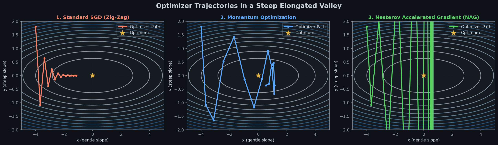
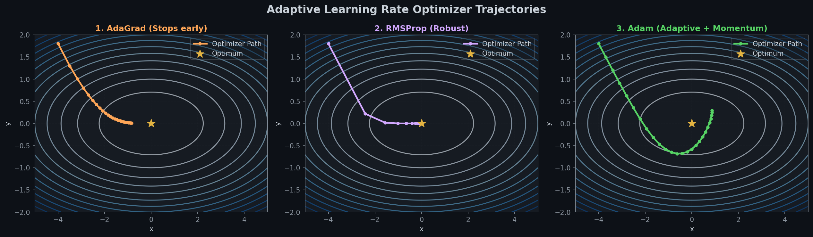
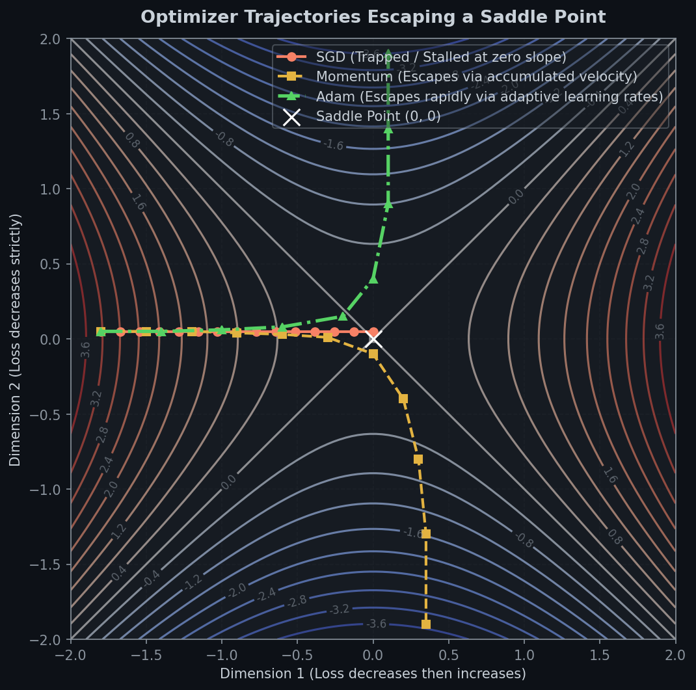

# ⚡ Module 4: Faster Optimizers
> **Ch. 11 — Hands-On ML with Scikit-Learn, Keras & TensorFlow (Aurélien Géron)**

---

## 📌 Table of Contents
1. [Start Here: The Big Picture](#big-picture)
2. [Momentum Optimization & Nesterov Accelerated Gradient (NAG)](#momentum-nag)
3. [Adaptive Optimizers (AdaGrad & RMSProp)](#adaptive-optimizers)
4. [Adam, AdaMax, and Nadam Optimization](#adam-family)
5. [First-Order vs. Second-Order Optimization Math](#order-math)
6. [Common Beginner Mistakes](#mistakes)
7. [Interview Q&A (Top 5)](#interview)
8. [⚡ One-Page Flash Card](#revision)

---

## 🌍 Start Here: The Big Picture {#big-picture}

> **TL;DR:** Standard Gradient Descent updates weights by taking constant steps down the loss slope. Advanced optimizers accelerate this process using physics (momentum) or adaptive learning rates per coordinate. While Adam is the general default, Nadam adds Nesterov momentum to speed it up further, and NAG is a reliable alternative if adaptive methods fail to generalize.

**The "Snowball down a mountain" Analogy ❄️:**
Standard Gradient Descent is like a person walking down a snowy slope step-by-step. If they hit a flat plateau, they walk very slowly; if they hit a steep ditch, they walk quickly but take the same size step. 

**Momentum Optimization** is like rolling a snowball down the slope. It starts slowly, but accumulates speed (velocity) as it rolls, flying across flat plateaus and ignoring small local depressions. **Adaptive Optimizers** (like RMSProp and Adam) are like a GPS that dynamically adjusts step size: slowing down on steep, dangerous paths (steep gradients) and speeding up along wide, flat trails (gentle gradients).

---

## 🔍 1. Momentum Optimization & Nesterov Accelerated Gradient (NAG) {#momentum-nag}

### 1. Momentum Optimization (Polyak 1964)
Momentum updates the weights by adding a momentum vector $\mathbf{m}$, where the gradient $\nabla_\theta J(\theta)$ is used for **acceleration**, not velocity:

1.  **Velocity Update:**
    $$\mathbf{m} \leftarrow \beta \mathbf{m} - \eta \nabla_\theta J(\theta)$$
2.  **Weight Update:**
    $$\theta \leftarrow \theta + \mathbf{m}$$

*   **Hyperparameter $\beta$:** Represents friction. Set between $0$ (high friction/standard SGD) and $1$ (no friction). The default is **$0.9$**.
*   **Terminal Velocity:** If gradients remain constant, the maximum velocity scaling factor is:
    $$\text{Velocity Max} = \frac{1}{1 - \beta}$$
    *With $\beta = 0.9$, the optimizer rolls up to **$10\times$ faster** than standard SGD.*

### 2. Nesterov Accelerated Gradient (NAG)
NAG measures the gradient not at the local position $\theta$, but slightly ahead in the direction of the momentum ($\theta + \beta \mathbf{m}$):

1.  **Velocity Update:**
    $$\mathbf{m} \leftarrow \beta \mathbf{m} - \eta \nabla_\theta J(\theta + \beta \mathbf{m})$$
2.  **Weight Update:**
    $$\theta \leftarrow \theta + \mathbf{m}$$

*   **Intuition:** Since the momentum vector $\mathbf{m}$ points in the correct direction, measuring the gradient ahead yields a more accurate update. It also dampens oscillations: when momentum pushes the weights across a valley, NAG measures the gradient on the other side of the valley, pushing the updates back toward the minimum.


> 📊 **Graph 08:** Comparison of path trajectories down an elongated valley. Standard SGD oscillates heavily, while Momentum builds velocity to speed down the valley. NAG looks ahead to reduce oscillations at the bottom of the valley.

---

## 🔍 2. Adaptive Optimizers (AdaGrad & RMSProp) {#adaptive-optimizers}

Adaptive gradient methods scale the learning rate independently for each parameter based on their historical gradient magnitudes.

### 1. AdaGrad (Duchi et al. 2011)
AdaGrad scales down weight updates along the steepest dimensions by accumulating the sum of squared historical gradients:

1.  **Gradient Sum Accumulation:**
    $$\mathbf{s} \leftarrow \mathbf{s} + \nabla_\theta J(\theta) \otimes \nabla_\theta J(\theta)$$
2.  **Parameter Update:**
    $$\theta \leftarrow \theta - \eta \nabla_\theta J(\theta) \oslash \sqrt{\mathbf{s} + \epsilon}$$
    *Where $\otimes$ is element-wise multiplication, $\oslash$ is element-wise division, and $\epsilon$ is a smoothing term ($10^{-10}$).*

*   **Drawback:** The sum $\mathbf{s}$ increases at every iteration. In deep networks, the learning rate scales down so much that the model stops learning before reaching the global optimum. **Never use AdaGrad for deep networks.**

### 2. RMSProp (Hinton 2012)
RMSProp fixes AdaGrad's premature stopping by accumulating only the squared gradients from the most recent iterations using exponential decay:

1.  **Decayed Variance Accumulation:**
    $$\mathbf{s} \leftarrow \beta \mathbf{s} + (1 - \beta) \nabla_\theta J(\theta) \otimes \nabla_\theta J(\theta)$$
2.  **Parameter Update:**
    $$\theta \leftarrow \theta - \eta \nabla_\theta J(\theta) \oslash \sqrt{\mathbf{s} + \epsilon}$$

*   **Hyperparameter $\beta$ (or `rho` in Keras):** Typically set to **$0.9$**.

---

## 🔍 3. Adam, AdaMax, and Nadam Optimization {#adam-family}

### 1. Adam (Adaptive Moment Estimation)
Adam combines Momentum (first moment vector $\mathbf{m}$) and RMSProp (second moment vector $\mathbf{s}$), using bias correction to adjust for initialization at $0$:

1.  **First Moment (Mean):**
    $$\mathbf{m} \leftarrow \beta_1 \mathbf{m} - (1 - \beta_1) \nabla_\theta J(\theta)$$
2.  **Second Moment (Uncentered Variance):**
    $$\mathbf{s} \leftarrow \beta_2 \mathbf{s} + (1 - \beta_2) \nabla_\theta J(\theta) \otimes \nabla_\theta J(\theta)$$
3.  **First Moment Bias Correction:**
    $$\hat{\mathbf{m}} = \frac{\mathbf{m}}{1 - \beta_1^t}$$
4.  **Second Moment Bias Correction:**
    $$\hat{\mathbf{s}} = \frac{\mathbf{s}}{1 - \beta_2^t}$$
5.  **Parameter Update:**
    $$\theta \leftarrow \theta + \eta \hat{\mathbf{m}} \oslash \sqrt{\hat{\mathbf{s}} + \epsilon}$$
    *Where $t$ is the iteration number (starting at 1).*

*   **Default Settings:** $\beta_1 = 0.9$ (momentum decay), $\beta_2 = 0.999$ (scaling decay), and $\epsilon = 10^{-7}$.

### 2. AdaMax
Replaces the $\ell_2$ norm weight scaling in Adam with the $\ell_\infty$ norm (maximum absolute value):
$$\mathbf{s} \leftarrow \max(\beta_2 \mathbf{s}, |\nabla_\theta J(\theta)|)$$
*   **Use case:** Sometimes more stable than Adam for datasets with large gradient spikes.

### 3. Nadam
Nadam is Adam optimization with the Nesterov look-ahead trick, leading to slightly faster convergence.


> 📊 **Graph 09:** Path trajectories of adaptive optimizers. AdaGrad slows down and stops before reaching the minimum. RMSProp and Adam dynamically scale coordinate updates, converging smoothly and quickly to the optimum.


> 📊 **Graph 19:** Optimizer trajectories escaping a saddle point landscape contour. SGD stalls in flat regions, while Momentum and Adam escape via velocity accumulation and coordinate scaling respectively.

---

## 🔍 4. First-Order vs. Second-Order Optimization Math {#order-math}

All optimizers discussed in Chapter 11 are **first-order methods**; they only use the gradient vector (first-order partial derivatives, or **Jacobian** $\mathbf{J}$). 

**Second-order methods** use the **Hessian matrix** $\mathbf{H}$ (second-order partial derivatives) to perform updates (e.g., Newton's method).

### The Intractability of Hessians:
For a model with $n$ parameters:
*   The **Jacobian** has $n$ elements.
*   The **Hessian** has $n \times n = n^2$ elements.

In deep networks, where $n$ can be millions or billions:
*   Storing $n^2$ parameters exceeds GPU memory (e.g. $10^6$ parameters $\to 10^{12}$ floats $\approx 4$ Terabytes of RAM).
*   Inverting the Hessian ($\mathbf{H}^{-1}$) requires $O(n^3)$ operations, which is computationally impossible. Thus, second-order methods are not used.

---

## 📋 Optimizer Comparison Summary (Table 11-2)

| Optimizer Class | Convergence Speed | Convergence Quality (Generalization) | Keras Constructor |
| :--- | :--- | :--- | :--- |
| **SGD** | $\star$ | $\star\star\star$ | `keras.optimizers.SGD(lr=0.01)` |
| **SGD + Momentum** | $\star\star$ | $\star\star\star$ | `SGD(lr=0.01, momentum=0.9)` |
| **SGD + NAG** | $\star\star$ | $\star\star\star$ | `SGD(lr=0.01, momentum=0.9, nesterov=True)` |
| **AdaGrad** | $\star\star\star$ | $\star$ (Stops early) | `keras.optimizers.Adagrad(lr=0.01)` |
| **RMSProp** | $\star\star\star$ | $\star\star$ or $\star\star\star$ | `keras.optimizers.RMSprop(lr=0.001, rho=0.9)` |
| **Adam** | $\star\star\star$ | $\star\star$ or $\star\star\star$ | `keras.optimizers.Adam(lr=0.001, beta_1=0.9, beta_2=0.999)` |
| **Nadam** | $\star\star\star$ | $\star\star$ or $\star\star\star$ | `keras.optimizers.Nadam(lr=0.001)` |

---

## ❌ Common Beginner Mistakes {#mistakes}

**1. Using AdaGrad to train deep neural networks** ❌
> **Reality:** AdaGrad is fine for simple convex optimizations or linear models, but it decreases the learning rate too aggressively for deep neural networks, causing them to freeze before reaching the optimum. Use `RMSProp` or `Adam` instead.

**2. Tuning every single hyperparameter in Adam** ❌
> **Reality:** Adam has multiple hyperparameters ($\beta_1$, $\beta_2$, $\epsilon$, and $\eta$). You rarely need to tune $\beta_1$, $\beta_2$, or $\epsilon$. Stick to the defaults ($\beta_1=0.9, \beta_2=0.999, \epsilon=1e-7$) and focus only on tuning the learning rate $\eta$.

**3. Ignoring generalization warnings for adaptive methods** ⚠️
> **Reality:** While Adam and RMSProp converge quickly, empirical studies show they can sometimes converge to sharp local minima that generalize poorly compared to NAG or SGD with momentum. If your model underperforms on the test set, try switching to `SGD(momentum=0.9, nesterov=True)`.

---

## 🎤 Interview Q&A (Top 5) {#interview}

**Q1: How does Momentum Optimization prevent the optimizer from getting stuck in plateaus?**
> **A:** Standard SGD computes the step size directly from the local gradient; if the gradient is near-zero (a plateau), the step is near-zero. Momentum tracks the historical velocity. If the optimizer reaches a plateau, it continues to move forward using its accumulated momentum $\mathbf{m}$ (terminal velocity scaling of $\frac{1}{1-\beta}$), allowing it to cross the plateau.

**Q2: What is the look-ahead mechanism of Nesterov Accelerated Gradient (NAG)?**
> **A:** Standard momentum calculates the gradient at the current position $\theta$ and adds it to the velocity. NAG looks ahead by calculating the gradient at the estimated next position $\theta + \beta\mathbf{m}$. This allows the optimizer to make corrections earlier, reducing overshoot and damping oscillations when approaching minima.

**Q3: Explain the role of the bias corrections $\hat{\mathbf{m}}$ and $\hat{\mathbf{s}}$ in the Adam optimizer.**
> **A:** The moment vectors $\mathbf{m}$ and $\mathbf{s}$ are initialized to $0$. During early training steps, they are heavily biased towards zero. The bias corrections divides them by $(1 - \beta_1^t)$ and $(1 - \beta_2^t)$ respectively. As $t$ increases, the denominators approach $1.0$, turning off the correction once the vectors have accumulated historical gradients.

**Q4: Why are second-order optimization algorithms (like Newton's method) rarely used in deep learning?**
> **A:** Second-order algorithms require calculating and storing the Hessian matrix of shape $n \times n$ (where $n$ is the number of parameters), which requires $O(n^2)$ memory, and computing its inverse $\mathbf{H}^{-1}$ which takes $O(n^3)$ operations. This is computationally impossible for models with millions of parameters.

**Q5: What is the main trade-off between Adam and SGD with Momentum?**
> **A:** Adam converges much faster and requires significantly less tuning of the learning rate because it dynamically scales updates per parameter. However, SGD with Momentum/NAG often finds flatter minima that generalize better on certain complex datasets, whereas Adam can get trapped in sharp, overfitting local minima.

---

## ⚡ One-Page Flash Card {#revision}

```
╔══════════════════════════════════════════════════════════════════╗
║               MODULE 4 — SPEED OPTIMIZERS                        ║
╠══════════════════════════════════════════════════════════════════╣
║                                                                  ║
║  MOMENTUM EQUATIONS:                                             ║
║  m ← βm - η∇θJ(θ)    | β=0.9 (friction parameter)                ║
║  θ ← θ + m           | Terminal Velocity Multiplier: 1 / (1 - β) ║
║                                                                  ║
║  NESTEROV ACCELERATED GRADIENT (NAG):                            ║
║  m ← βm - η∇θJ(θ + βm) | Measures gradient ahead to damp bouncing.║
║                                                                  ║
║  ADAGRAD (Adaptive):                                             ║
║  s ← s + (∇θJ(θ))²   | Scales down η along steep dimensions.      ║
║  θ ← θ - η∇θJ(θ)/√s   | Risk: η drops to 0 too early (stalls).    ║
║                                                                  ║
║  RMSPROP (Hinton):                                               ║
║  s ← βs + (1-β)(∇θJ(θ))² | EMA dampens history weight.            ║
║  θ ← θ - η∇θJ(θ)/√s      | Fixes AdaGrad stall, default β=0.9.    ║
║                                                                  ║
║  ADAM (Momentum + RMSProp):                                      ║
║  m_t = β₁ m_{t-1} + (1-β₁) g_t  | s_t = β₂ s_{t-1} + (1-β₂) g_t²  ║
║  m̂_t = m_t / (1 - β₁ᵗ)          | ŝ_t = s_t / (1 - β₂ᵗ)          ║
║  θ_t = θ_{t-1} - η m̂_t / (√ŝ_t + ε)                               ║
║  - Defaults: β₁=0.9, β₂=0.999, ε=1e-7                             ║
║                                                                  ║
║  NADAM: Adam + Nesterov momentum (usually fastest convergence).  ║
║                                                                  ║
║  HESSIAN (Second-Order):                                         ║
║  - Requires n² memory, O(n³) compute. Intractable for deep nets.  ║
╚══════════════════════════════════════════════════════════════════╝
```

---

**🔗 Previous Module →** [03_Transfer_Learning_Pretraining.md](03_Transfer_Learning_Pretraining.md)  
**🔗 Next Module →** [05_Learning_Rate_Scheduling.md](05_Learning_Rate_Scheduling.md)
