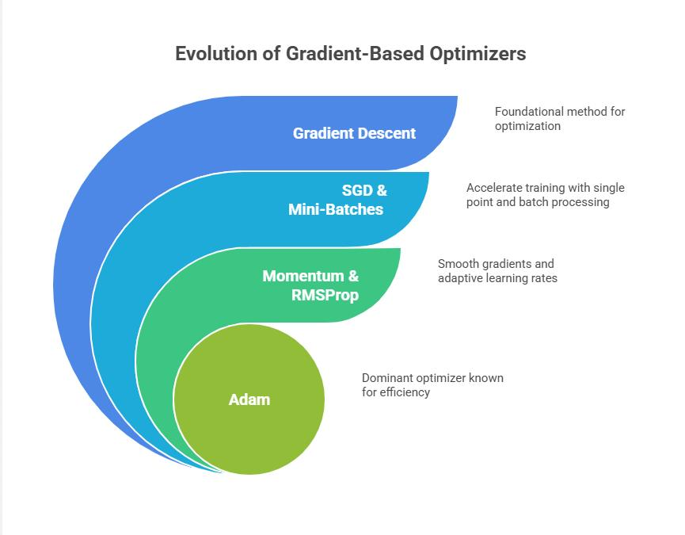

# 🚀 Module 4: Faster Optimizers — Beyond Vanilla Gradient Descent
> **Ch. 11 — Hands-On ML with Scikit-Learn, Keras & TensorFlow (Aurélien Géron)**

---

## 📌 Table of Contents
1. [Start Here: The Big Picture](#big-picture)
2. [Vanilla SGD — The Baseline](#sgd)
3. [Momentum Optimization](#momentum)
4. [Nesterov Accelerated Gradient (NAG)](#nag)
5. [AdaGrad — Adaptive Per-Parameter Rates](#adagrad)
6. [RMSProp — Fixing AdaGrad](#rmsprop)
7. [Adam — The Default Choice](#adam)
8. [Adam Variants: AdaMax & Nadam](#adam-variants)
9. [Learning Rate Scheduling](#lr-scheduling)
10. [Optimizer Comparison Table](#comparison)
11. [Common Beginner Mistakes](#mistakes)
12. [Interview Q&A](#interview)
13. [⚡ One-Page Flash Card](#revision)

---

## 🌍 Start Here: The Big Picture {#big-picture}

> **TL;DR:** Gradient descent is just one way to update weights. By adding **momentum** (remembering past gradients) and **adaptive learning rates** (adjusting per-parameter), we can train 10x-100x faster than vanilla SGD. Adam is the default for most tasks.

**The "Ball Rolling Down a Hill" Analogy ⛰️**

| Optimizer | Physical Analogy |
|-----------|-----------------|
| SGD | Person taking cautious tiny steps in steepest direction |
| Momentum | Ball rolling — picks up speed, overshoots, but gets there faster |
| NAG | Ball that "looks ahead" before rolling — more accurate |
| AdaGrad | Person who takes bigger steps in flat areas, tiny steps in steep areas |
| RMSProp | Smarter AdaGrad that doesn't slow down too much |
| Adam | Best of all worlds: momentum + adaptive learning rates |

---

## 📉 Vanilla SGD — The Baseline {#sgd}

$$\boldsymbol{\theta} \leftarrow \boldsymbol{\theta} - \eta \nabla_\theta J(\boldsymbol{\theta})$$

```python
optimizer = keras.optimizers.SGD(learning_rate=0.01)
```

**Problems:**
- ❌ Same learning rate for ALL parameters (bad — some need large steps, others tiny)
- ❌ Ignores previous gradient directions → zig-zags down ravines
- ❌ Gets stuck in local minima / saddle points more easily

---

## 🏃 Momentum Optimization (Polyak, 1964) {#momentum}

**The Idea:** Don't just use the current gradient — accumulate a "velocity" vector that accelerates in directions where gradients are consistently pointing.

**Equations:**
$$\mathbf{m} \leftarrow \beta \mathbf{m} - \eta \nabla_\theta J(\boldsymbol{\theta})$$
$$\boldsymbol{\theta} \leftarrow \boldsymbol{\theta} + \mathbf{m}$$

Where:
- $\mathbf{m}$ = momentum vector (velocity)
- $\beta$ = momentum hyperparameter (typically 0.9) — controls friction
- $\eta$ = learning rate
- $\nabla_\theta J$ = current gradient

**The Physics:** The gradient acts as **acceleration**, not velocity. The ball accumulates speed in consistent directions and naturally smooths out oscillations.

**Terminal velocity:** Without gradients pushing, the ball reaches max speed = $\frac{\eta \cdot |\nabla J|}{1 - \beta}$

With β=0.9: terminal velocity = 10× the gradient update (10× faster than SGD!)

```python
optimizer = keras.optimizers.SGD(learning_rate=0.001, momentum=0.9)
```

**Why β=0.9?** It balances: small β → momentum dies quickly (like SGD). Large β → too much inertia, overshoots too much. 0.9 is empirically the sweet spot.

**Visual:**


> 📊 **Graph 08:** Momentum vs SGD in a 2D loss landscape. Momentum dampens the oscillations and accelerates down the steepest direction.

```
SGD path:     ←↓→↓←↓  (zig-zag, slow)
Momentum:     ↘↘↘↘↘  (smooth, accelerated)
```

---

## 🔭 Nesterov Accelerated Gradient (NAG, 1983) {#nag}

**The Problem with Momentum:** You compute the gradient AT the current position, then jump. But you already KNOW you'll jump (momentum will move you). Why not compute the gradient AFTER the jump?

**NAG equations:**
$$\mathbf{m} \leftarrow \beta \mathbf{m} - \eta \nabla_\theta J\left(\boldsymbol{\theta} + \beta \mathbf{m}\right)$$
$$\boldsymbol{\theta} \leftarrow \boldsymbol{\theta} + \mathbf{m}$$

Note: gradient is computed at $\boldsymbol{\theta} + \beta \mathbf{m}$ (the "lookahead" position), not at $\boldsymbol{\theta}$.

```python
optimizer = keras.optimizers.SGD(learning_rate=0.001, momentum=0.9, nesterov=True)
```

**Why it's better:** NAG "corrects" momentum before it goes too far. It anticipates where momentum will take it and computes the gradient from there. This typically leads to faster convergence with less oscillation.

**Analogy:** A skier who looks at the slope ahead to decide where to brake, not just using momentum blindly.

---

## 📊 AdaGrad — Adaptive Per-Parameter Learning Rates (Duchi et al., 2011) {#adagrad}

**The Problem AdaGrad Solves:** If feature A is rare (sparse), its gradient is usually 0. When it's non-zero, we should take a big step. If feature B is common, we see its gradient constantly and should take smaller steps.

**Equations:**
$$\mathbf{s} \leftarrow \mathbf{s} + \nabla_\theta J(\boldsymbol{\theta}) \otimes \nabla_\theta J(\boldsymbol{\theta})$$
$$\boldsymbol{\theta} \leftarrow \boldsymbol{\theta} - \eta \nabla_\theta J(\boldsymbol{\theta}) \oslash \sqrt{\mathbf{s} + \varepsilon}$$

Where:
- $\mathbf{s}$ = accumulated sum of squared gradients (one value per parameter)
- $\otimes$ = element-wise multiplication, $\oslash$ = element-wise division
- $\varepsilon \approx 10^{-10}$ prevents division by zero

**Interpretation:** Parameters with large gradients (frequent) get smaller learning rates. Parameters with small gradients (rare) get larger learning rates. Each parameter has its own effective learning rate!

**The Fatal Flaw:** $\mathbf{s}$ grows monotonically forever → learning rate decays to nearly 0 → training stops prematurely before reaching the optimum!

```python
# Not commonly used, but available:
optimizer = keras.optimizers.Adagrad(learning_rate=0.001)
```

> ❌ **When not to use:** For deep neural networks (the decaying LR problem kills it). OK for convex problems like linear/logistic regression.

---

## 🔧 RMSProp — Fixing AdaGrad (Hinton, 2012) {#rmsprop}

**The Fix:** Instead of ACCUMULATING all squared gradients from the start, use an **exponentially decaying moving average**. Old gradients have less influence than recent ones.

**Equations:**
$$\mathbf{s} \leftarrow \rho \mathbf{s} + (1 - \rho) \nabla_\theta J(\boldsymbol{\theta}) \otimes \nabla_\theta J(\boldsymbol{\theta})$$
$$\boldsymbol{\theta} \leftarrow \boldsymbol{\theta} - \eta \nabla_\theta J(\boldsymbol{\theta}) \oslash \sqrt{\mathbf{s} + \varepsilon}$$

Where:
- $\rho$ = decay rate (typically 0.9) — controls how fast old gradients are forgotten
- $\mathbf{s}$ is now a DECAYING average, not a forever-growing sum

**Why it works:** Recent large gradients increase $\mathbf{s}$, reducing the effective step. When gradients become small, $\mathbf{s}$ decays, allowing the LR to recover. The learning rate self-regulates!

```python
optimizer = keras.optimizers.RMSprop(learning_rate=0.001, rho=0.9)
```

> ✅ **When to use:** Generally better than AdaGrad for deep networks. Often good for RNNs.

---

## ⭐ Adam — Adaptive Moment Estimation (Kingma & Ba, 2014) {#adam}

**The Idea:** Combine the best of BOTH worlds:
- **Momentum** (from vanilla momentum): track the first moment (mean) of gradients
- **Adaptive learning rate** (from RMSProp): track the second moment (variance) of gradients

**Full Adam equations:**

**Step 1:** Compute gradient
$$\mathbf{g} = \nabla_\theta J(\boldsymbol{\theta})$$

**Step 2:** Update first moment (momentum, exponential MA of gradients)
$$\mathbf{m} \leftarrow \beta_1 \mathbf{m} + (1 - \beta_1) \mathbf{g}$$

**Step 3:** Update second moment (exponential MA of squared gradients)
$$\mathbf{s} \leftarrow \beta_2 \mathbf{s} + (1 - \beta_2) \mathbf{g} \otimes \mathbf{g}$$

**Step 4:** Bias correction (crucial in early iterations when m,s are near 0)
$$\hat{\mathbf{m}} \leftarrow \frac{\mathbf{m}}{1 - \beta_1^t} \quad \hat{\mathbf{s}} \leftarrow \frac{\mathbf{s}}{1 - \beta_2^t}$$

**Step 5:** Update weights
$$\boldsymbol{\theta} \leftarrow \boldsymbol{\theta} - \eta \hat{\mathbf{m}} \oslash \sqrt{\hat{\mathbf{s}} + \varepsilon}$$

**Default hyperparameters:**
- $\beta_1 = 0.9$ (momentum decay)
- $\beta_2 = 0.999$ (variance decay)
- $\varepsilon = 10^{-7}$
- $\eta = 0.001$

```python
optimizer = keras.optimizers.Adam(learning_rate=0.001, beta_1=0.9, beta_2=0.999)
# Note: you can usually just use keras.optimizers.Adam() with defaults!
```

**Why bias correction matters:**
At t=1: $\hat{\mathbf{m}} = \mathbf{m} / (1 - 0.9^1) = \mathbf{m} / 0.1 = 10 \times \mathbf{m}$  
Without correction, early updates would be 10x too small (m starts near 0).

---

## 🔬 Adam Variants: AdaMax & Nadam {#adam-variants}

### AdaMax
- Replaces ℓ₂ norm (RMS of gradients) with **ℓ∞ norm** (max of gradients)
- $\mathbf{s} \leftarrow \max(\beta_2 \mathbf{s}, |\mathbf{g}|)$ — tracks the max gradient seen per parameter
- More stable than Adam in some cases (particularly with sparse gradients)
- Less commonly used in practice

### Nadam (Nesterov + Adam)
- Adam + Nesterov lookahead trick
- Computes gradient at the "lookahead" position instead of current position
- Generally converges slightly faster than Adam
- Often outperforms Adam, but sometimes loses to RMSProp

```python
optimizer = keras.optimizers.Nadam(learning_rate=0.001)
```

### ⚠️ Caution About Adaptive Optimizers
A 2017 paper (Wilson et al.) showed that Adam and other adaptive optimizers can sometimes **generalize worse** than plain SGD+Momentum on certain datasets. Adaptive optimizers find solutions faster but those solutions can be "sharp minima" that don't generalize well.

**Practical advice:** If your Adam model underperforms at test time despite good training performance, try SGD with Nesterov momentum — it may find a better-generalizing solution, even if it trains slower.

---

## 📅 Learning Rate Scheduling {#lr-scheduling}

> **The Key Insight:** A constant learning rate is suboptimal. Start high to make fast progress, then decrease to converge precisely.

### 1. Power Scheduling

$$\eta(t) = \frac{\eta_0}{(1 + t/s)^c}$$

- $c = 1$ typically, $s$ controls how fast it decays
- After $s$ steps: $\eta = \eta_0 / 2$. After $2s$ steps: $\eta_0 / 3$. Etc.
- Decays rapidly at first, then more slowly

### 2. Exponential Scheduling

$$\eta(t) = \eta_0 \cdot 0.1^{t/s}$$

- Drops by factor of 10 every $s$ steps
- More aggressive than power scheduling

```python
def exponential_decay(lr0, s):
    def exponential_decay_fn(epoch):
        return lr0 * 0.1 ** (epoch / s)
    return exponential_decay_fn

lr_scheduler = keras.callbacks.LearningRateScheduler(exponential_decay(lr0=0.01, s=20))
history = model.fit(X_train, y_train, [...], callbacks=[lr_scheduler])
```

### 3. 1Cycle Scheduling (Smith, 2018)

The most effective modern approach:
1. **Phase 1**: LR increases linearly from very low to max (warmup)
2. **Phase 2**: LR decreases linearly from max back down to low (cooldown)
3. Final brief phase: LR drops to very small value

```
η |    /\
  |   /  \
  |  /    \___
  | /
  |/___________
     training →
```

**Why it works:** The warmup phase helps the optimizer find a good initial direction. The high-LR middle phase escapes local minima. The cooldown phase converges precisely.

### 4. Performance Scheduling

Reduce LR when validation loss stops improving:

```python
lr_scheduler = keras.callbacks.ReduceLROnPlateau(
    factor=0.5,      # multiply LR by 0.5
    patience=5,      # wait 5 epochs with no improvement
    monitor='val_loss'
)
```

### 5. Piecewise Constant Scheduling

```python
def piecewise_constant_fn(epoch):
    if epoch < 5:   return 0.01
    elif epoch < 15: return 0.005
    else:            return 0.001
```

---

## 📊 Optimizer Comparison Table {#comparison}



> 📊 **Graph 09:** Comparison of optimization paths. Adaptive optimizers (AdaGrad, RMSProp, Adam) scale their steps per parameter, heading straight toward the minimum.


> 📊 **Graph 19:** Optimizers escaping a saddle point. Momentum-based methods escape quickly, while plain SGD can get stuck.

| Optimizer | Convergence Speed | Convergence Quality | Notes |
|-----------|------------------|--------------------|----|
| SGD | ⭐ | ⭐⭐⭐ | Slowest, best generalization |
| SGD + Momentum | ⭐⭐ | ⭐⭐⭐ | Better than SGD |
| SGD + Nesterov | ⭐⭐ | ⭐⭐⭐ | Slightly better than momentum |
| AdaGrad | ⭐⭐⭐ | ⭐ | Stops early in deep nets |
| RMSProp | ⭐⭐⭐ | ⭐⭐-⭐⭐⭐ | Good for RNNs |
| **Adam** | **⭐⭐⭐** | **⭐⭐-⭐⭐⭐** | **DEFAULT CHOICE** |
| Nadam | ⭐⭐⭐ | ⭐⭐-⭐⭐⭐ | Sometimes beats Adam |
| AdaMax | ⭐⭐⭐ | ⭐⭐-⭐⭐⭐ | More stable in some cases |

---

## ❌ Common Beginner Mistakes {#mistakes}

**1. Using Adam with a large learning rate** ❌
> Reality: Default LR=0.001 is usually fine for Adam. Setting it much higher (e.g., 0.1) will cause divergence. Unlike SGD, Adam's adaptive scaling means the effective LR per parameter varies — the global LR just sets the scale.

**2. Expecting Adam to always outperform SGD** ❌
> Reality: Adam often finds solutions faster, but they can generalize worse. For benchmarks, SGD+Momentum sometimes achieves better final accuracy (it just takes longer).

**3. Not using learning rate scheduling at all** ❌
> Reality: A constant LR is almost always suboptimal. At minimum, add `ReduceLROnPlateau`. Better: use 1Cycle or exponential scheduling.

**4. Ignoring bias correction in Adam** ⚠️
> Reality: Bias correction is already handled by Keras/TensorFlow in the Adam implementation. You don't need to implement it manually. But understand WHY it's needed: without it, early Adam updates are 10x too small ($1-\beta_1^1 = 0.1$ for $\beta_1=0.9$).

**5. Setting momentum β too high** ❌
> Reality: β=0.99 or higher causes so much inertia that the optimizer overshoots valleys and oscillates. β=0.9 is the standard sweet spot.

---

## 🎤 Interview Q&A {#interview}

**Q1: Explain the difference between SGD, Momentum, and NAG.**
> **A:** SGD: $\theta \leftarrow \theta - \eta \nabla J$. Only uses current gradient, ignores history. Momentum: $m \leftarrow \beta m - \eta \nabla J; \theta \leftarrow \theta + m$. Accumulates a "velocity" vector, accelerates in consistent directions. NAG: Like momentum, but computes gradient at the LOOKAHEAD position $\theta + \beta m$ instead of current $\theta$. This corrects momentum before it overshoots, leading to faster and more stable convergence.

**Q2: Why does Adam need bias correction and what does it do?**
> **A:** Adam initializes m (first moment) and s (second moment) to zero. In early iterations, both are biased toward zero. The updates $m \cdot \eta / \sqrt{s}$ would be way too small. Bias correction divides by $(1-\beta_1^t)$ and $(1-\beta_2^t)$: at t=1, this multiplies m by 10 and s by 1000, counteracting the initialization bias. After many steps, $\beta^t \approx 0$ so the correction becomes negligible.

**Q3: How does RMSProp fix AdaGrad's main problem?**
> **A:** AdaGrad accumulates ALL squared gradients since training started. This makes the denominator grow forever → learning rate decays to near zero → training stops prematurely. RMSProp replaces the cumulative sum with an exponentially decaying moving average: $s \leftarrow \rho s + (1-\rho)g^2$. Old gradients are "forgotten" with decay rate ρ. The denominator stabilizes rather than growing forever, allowing training to continue.

**Q4: What are the default hyperparameters for Adam and why those values?**
> **A:** η=0.001 (generally works without tuning), β₁=0.9 (gradient momentum — 90% past, 10% new), β₂=0.999 (gradient variance — 99.9% past, 0.1% new, very stable), ε=10⁻⁷ (numerical stability). β₂ is much higher than β₁ because gradient variance is very noisy and benefits from aggressive smoothing. The large effective window for s means the per-parameter learning rate adapts slowly and smoothly.

---

## ⚡ One-Page Flash Card {#revision}

```
╔══════════════════════════════════════════════════════════════════════╗
║              MODULE 4 — OPTIMIZERS FLASH CARD                         ║
╠══════════════════════════════════════════════════════════════════════╣
║                                                                        ║
║  SGD: θ ← θ - η·∇J                            (slow, good final)    ║
║                                                                        ║
║  MOMENTUM: m ← βm - η·∇J;  θ ← θ + m         (β=0.9 typical)       ║
║  NAG: gradient computed at θ+βm (lookahead)   (faster than momentum) ║
║                                                                        ║
║  ADAGRAD: s += g²;  θ ← θ - η·g/√(s+ε)       (dies in deep nets!)  ║
║  RMSPROP: s ← ρs + (1-ρ)g²;  θ ← θ - η·g/√(s+ε)  (ρ=0.9)         ║
║                                                                        ║
║  ADAM (DEFAULT ⭐):                                                   ║
║    m ← β₁m + (1-β₁)g   [β₁=0.9]                                    ║
║    s ← β₂s + (1-β₂)g²  [β₂=0.999]                                  ║
║    m̂ = m/(1-β₁ᵗ)  ŝ = s/(1-β₂ᵗ)  [bias correction]               ║
║    θ ← θ - η·m̂/√(ŝ+ε)  [η=0.001 default]                          ║
║                                                                        ║
║  LEARNING RATE SCHEDULING:                                             ║
║  Power: η(t) = η₀/(1+t/s)   Exponential: η(t) = η₀·0.1^(t/s)      ║
║  1Cycle: warmup → max → cooldown (most effective modern approach)    ║
║  ReduceLROnPlateau: reduce when val_loss stops improving             ║
║                                                                        ║
╚══════════════════════════════════════════════════════════════════════╝
```

---

**🔗 Previous Module →** [03 — Transfer Learning](03_Transfer_Learning_Pretraining.md)  
**🔗 Next Module →** [05 — Learning Rate Scheduling](05_Learning_Rate_Scheduling.md)
