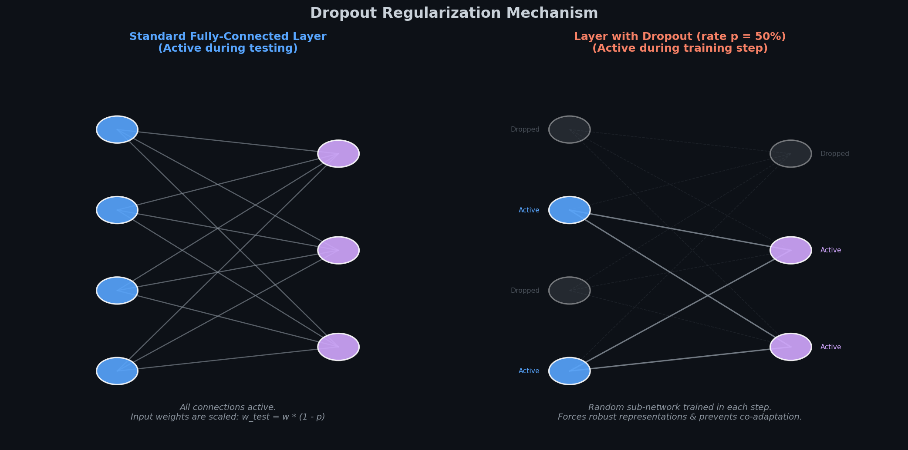
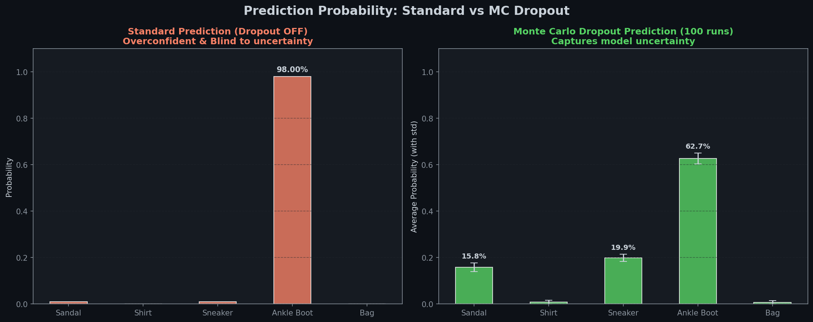

# 🛡️ Module 6: Regularization & Practical Guidelines
> **Ch. 11 — Hands-On ML with Scikit-Learn, Keras & TensorFlow (Aurélien Géron)**

---

## 📌 Table of Contents
1. [Start Here: The Big Picture](#big-picture)
2. [ℓ1 and ℓ2 Weight Regularization](#l1-l2)
3. [Dropout Regularization](#dropout)
4. [Monte Carlo (MC) Dropout](#mc-dropout)
5. [Max-Norm Regularization Constraint](#max-norm)
6. [Summary Recipes: Default DNN Configurations](#recipes)
7. [Common Beginner Mistakes](#mistakes)
8. [Interview Q&A (Top 5)](#interview)
9. [⚡ One-Page Flash Card](#revision)

---

## 🌍 Start Here: The Big Picture {#big-picture}

> **TL;DR:** Deep neural networks have thousands or millions of parameters, giving them the flexibility to fit complex data, but making them prone to severe overfitting. We constrain them using weight penalties ($\ell_1$/$\ell_2$), randomly dropping active units (Dropout), querying model uncertainty (MC Dropout), or setting a maximum weight vector length (Max-Norm).

**The "Employee Backup Plan" Analogy 🏢:**
Imagine a company where a single employee is the only one who knows how to operate the coffee machine, another is the only one who can run payroll, and a third is the only one who can query the database. If any of these people get sick, the company collapses (overfitting/co-adaptation).

To make the company robust, the CEO introduces a rule: every morning, a coin is flipped for each employee to decide if they get the day off (**Dropout**). The remaining staff are forced to learn each other's jobs and cooperate. No single person becomes indispensable, and expertise is spread across the entire organization. The company becomes resilient to individual absences (generalizes better to unseen test data).

---

## 🔍 1. ℓ1 and ℓ2 Weight Regularization {#l1-l2}

Just like in linear models, we add a penalty to the loss function to constrain connection weights:

### Mathematical Formulas:
*   **$\ell_2$ Regularization (Ridge):** Penalty = $\alpha \sum w_j^2$. Constrains weights towards small values, preventing any single weight from dominating.
*   **$\ell_1$ Regularization (Lasso):** Penalty = $\alpha \sum |w_j|$. Drives weights to exactly zero, producing a **sparse model** (useful for memory efficiency).

### Keras Implementation & Refactoring:
To avoid repeating arguments across multiple identical hidden layers, use Python's `functools.partial` to create a thin, reusable layer wrapper:

```python
import tensorflow as tf
from tensorflow import keras
from functools import partial

# Create a custom Dense constructor with L2 regularization
RegularizedDense = partial(
    keras.layers.Dense,
    activation="elu",
    kernel_initializer="he_normal",
    kernel_regularizer=keras.regularizers.l2(0.01) # L2 penalty scale
)

model = keras.models.Sequential([
    keras.layers.Flatten(input_shape=[28, 28]),
    RegularizedDense(300),
    RegularizedDense(100),
    RegularizedDense(10, activation="softmax", kernel_initializer="glorot_uniform")
])
# OUTPUT: Sequential model constructed with L2 regularized dense layers.
```

---

## 🔍 2. Dropout Regularization {#dropout}

Dropout is one of the most successful regularization techniques, typically providing a $1\%\text{--}2\%$ accuracy boost.


> 📊 **Graph 12:** Neuron connectivity under dropout. During training, random nodes are deactivated (output set to 0) in each step. During testing, all connections are active but scaled to match training scale levels.

### The Algorithm:
*   At each training step, every neuron (excluding output neurons) has a probability $p$ (the dropout rate, typically $10\%\text{--}50\%$) of being temporarily "dropped out". It is entirely ignored during this iteration but may be active in the next.
*   **Test Time Scaling:** Since neurons are only active a fraction $(1-p)$ of the time during training, their connection weights must be multiplied by $(1-p)$ at test time. Alternatively, Keras performs **Inverted Dropout**: it divides the active neuron outputs by $(1-p)$ during training so that test weights remain unchanged.

```python
model = keras.models.Sequential([
    keras.layers.Flatten(input_shape=[28, 28]),
    keras.layers.Dropout(rate=0.2), # Dropout on input features
    keras.layers.Dense(300, activation="elu", kernel_initializer="he_normal"),
    keras.layers.Dropout(rate=0.2), # Dropout on Layer 1 outputs
    keras.layers.Dense(100, activation="elu", kernel_initializer="he_normal"),
    keras.layers.Dropout(rate=0.2),
    keras.layers.Dense(10, activation="softmax")
])
# OUTPUT: Dropout-regularized neural network stack compiled.
```

---

## 🔍 3. Monte Carlo (MC) Dropout {#mc-dropout}

MC Dropout (Gal & Ghahramani 2016) establishes a mathematical connection between dropout networks and approximate Bayesian inference. It allows us to get reliable **uncertainty estimates** and a slight accuracy boost from a pre-trained model **without retraining**.

### How it Works:
Instead of disabling dropout at test time, we make 100 predictions with `training=True` active. Because dropout is active, each prediction will be slightly different. We average these predictions to get the final probability distribution.


> 📊 **Graph 13:** Standard prediction vs. MC Dropout. Standard prediction is overly confident ($98\%$), while MC Dropout reveals that the model is uncertain between shoe categories, producing a safer $62\%$ average confidence with standard deviations.

### Subclassing for Batch Normalization Safety:
Forcing `training=True` directly during predictions can disrupt layers that behave differently during training vs testing, such as `BatchNormalization` (which would start updating its moving averages on test data). 

To prevent this, define a custom `MCDropout` layer that only overrides the dropout training parameter:

```python
class MCDropout(keras.layers.Dropout):
    def call(self, inputs):
        # Always force dropout to True, regardless of train/test phase
        return super().call(inputs, training=True)

# Build a model using MCDropout instead of Dropout
model_mc = keras.models.Sequential([
    keras.layers.Flatten(input_shape=[28, 28]),
    MCDropout(rate=0.2),
    keras.layers.Dense(300, activation="elu", kernel_initializer="he_normal"),
    MCDropout(rate=0.2),
    keras.layers.Dense(10, activation="softmax")
])
# To predict:
# y_probas = np.stack([model_mc(X_test, training=False) for _ in range(100)])
# y_proba = y_probas.mean(axis=0) # MC averaged probabilities
```

---

## 🔍 4. Max-Norm Regularization Constraint {#max-norm}

Max-Norm regularization constrains the incoming connection weights $\mathbf{w}$ of each neuron such that $\|\mathbf{w}\|_2 \leq r$, where $r$ is the max-norm hyperparameter.

*   It does **not** add a penalty term to the loss function.
*   Instead, after each training step, it evaluates the norm of the weights and rescales them if they exceed the boundary:
    $$\mathbf{w} \leftarrow \mathbf{w} \frac{r}{\max(r, \|\mathbf{w}\|_2)}$$
*   Reducing $r$ increases the amount of regularization.


> 📊 **Graph 14:** Max-Norm constraint projection. Weight vectors that fall outside the boundary sphere of radius $r=1.5$ are projected back onto the sphere's surface.

```python
# Apply Max-Norm constraint to a Dense layer
keras.layers.Dense(
    100, 
    activation="elu", 
    kernel_initializer="he_normal",
    kernel_constraint=keras.constraints.max_norm(1.0) # r = 1.0 limit
)
# Note: Set axis=0 for Dense [inputs, neurons], axis=[0,1,2] for Conv [h, w, channels, filters].
```

---

## 🔍 5. Summary Recipes: Default DNN Configurations {#recipes}

These guidelines cover the default optimizer, activation, initialization, and regularization combinations for general tasks.

### Table 11-3: Default DNN Configuration
Use this as your starting point for general architectures:

| Hyperparameter | Default Value |
| :--- | :--- |
| **Kernel Initializer** | He initialization (`he_normal` or `he_uniform`) |
| **Activation Function** | ELU |
| **Normalization** | None if shallow; Batch Normalization if deep |
| **Regularization** | Early stopping (+ $\ell_2$ regularization if needed) |
| **Optimizer** | Momentum optimization (or RMSProp or Nadam) |
| **Learning Rate Schedule** | 1cycle |

### Table 11-4: Self-Normalizing DNN Configuration
Use this **only** if your network is a simple, sequential stack of dense layers:

| Hyperparameter | Default Value |
| :--- | :--- |
| **Kernel Initializer** | LeCun initialization (`lecun_normal`) |
| **Activation Function** | SELU |
| **Normalization** | None (natively self-normalizing) |
| **Regularization** | Alpha dropout if needed (standard dropout breaks normalization) |
| **Optimizer** | Momentum optimization (or RMSProp or Nadam) |
| **Learning Rate Schedule** | 1cycle |

---

## ❌ Common Beginner Mistakes {#mistakes}

**1. Comparing training loss and validation loss directly when using Dropout** ❌
> **Reality:** Dropout is only active during training, making training harder. As a result, training loss may appear higher than validation loss even if the model is not overfitting. To compare them fairly, evaluate the training loss **with dropout disabled** (e.g., after the epoch completes).

**2. Using standard Dropout or standard Batch Normalization on a SELU network** ❌
> **Reality:** Standard Dropout sets activations to 0, and Batch Normalization shifts the mean and variance. Both break the mathematical assumptions of SELU's self-normalization. You must use **AlphaDropout** (which preserves mean and variance) and **no BN layers** in a SELU stack.

---

## 🎤 Interview Q&A (Top 5) {#interview}

**Q1: How does Dropout regularize a neural network?**
> **A:** Dropout randomly deactivates a fraction of neurons at each training step. This prevents co-adaptation: neurons cannot rely on their neighbors to perform a task and must learn general, robust features. Additionally, because a different sub-network is sampled at each step, dropout acts like training an ensemble of $2^N$ shared-weight models, averaging their predictions.

**Q2: What is Inverted Dropout, and why is it used?**
> **A:** Standard dropout scales weights by $(1-p)$ at test time to match the training scale. Inverted dropout scales activations by dividing them by $(1-p)$ during the training phase. This ensures the output scale matches the test scale, so the model weights can be used directly at test time without any scaling.

**Q3: How does Monte Carlo (MC) Dropout provide uncertainty estimates?**
> **A:** By making multiple predictions (e.g., 100) with dropout enabled at test time, we sample from the posterior distribution of the network's parameters. The variance of these predictions represents the model's epistemic uncertainty. A high standard deviation across predictions indicates that the model is uncertain about the instance.

**Q4: Why must we subclass the `Dropout` layer for MC Dropout in models that use Batch Normalization?**
> **A:** If we use `model(X_test, training=True)` directly, it forces all layers into training mode. This will cause Batch Normalization layers to recalculate and update their running means and variances on the test data, which degrades performance. Subclassing `Dropout` to force `training=True` in its `call` method keeps only the dropout layers active while allowing other layers to run in test mode.

**Q5: Compare $\ell_1$ and $\ell_2$ regularization. Which one is used to compress models?**
> **A:** $\ell_2$ regularization adds a squared weight penalty, which drives weights to small values but rarely sets them to exactly zero. $\ell_1$ adds an absolute weight penalty, which acts as a coordinate-wise threshold, driving many weights to exactly zero. $\ell_1$ is used to compress models because setting weights to zero produces a sparse network that requires less memory and compute.

---

## ⚡ One-Page Flash Card {#revision}

```
╔══════════════════════════════════════════════════════════════════╗
║               MODULE 6 — REGULARIZATION RECIPES                  ║
╠══════════════════════════════════════════════════════════════════╣
║                                                                  ║
║  REGULARIZATION TYPES:                                           ║
║  - L2 (Ridge):  Adds weight square penalty. Constrains magnitude.║
║  - L1 (Lasso):  Adds weight absolute penalty. Induces sparsity.   ║
║  - Max-Norm:    Constrains ‖w‖₂ ≤ r. Updates weights by scaling.  ║
║                                                                  ║
║  DROPOUT RULES:                                                  ║
║  - Training:    Randomly deactivates neurons with probability p. ║
║  - Testing:     All neurons active. Weights scaled by (1 - p).   ║
║  - Keras:       Inverted dropout scales output by 1/(1-p) during ║
║                 training, leaving test weights unscaled.         ║
║                                                                  ║
║  MC DROPOUT PIPELINE:                                            ║
║  - Predict 100 times with dropout active.                        ║
║  - Mean of outputs = robust prediction.                          ║
║  - Std of outputs  = prediction uncertainty.                     ║
║                                                                  ║
║  SELU NETWORK RULE:                                              ║
║  - Never use standard Dropout or Batch Normalization.            ║
║  - Use AlphaDropout to preserve self-normalizing properties.     ║
║                                                                  ║
║  MODEL BUILDER CLEAN REFACTORING:                                ║
║  - Use functools.partial to wrap layer constructors and avoid    ║
║    repeating hyperparameters (e.g. initializer, regularizer).    ║
╚══════════════════════════════════════════════════════════════════╝
```

---

**🔗 Previous Module →** [05_Learning_Rate_Scheduling.md](05_Learning_Rate_Scheduling.md)
