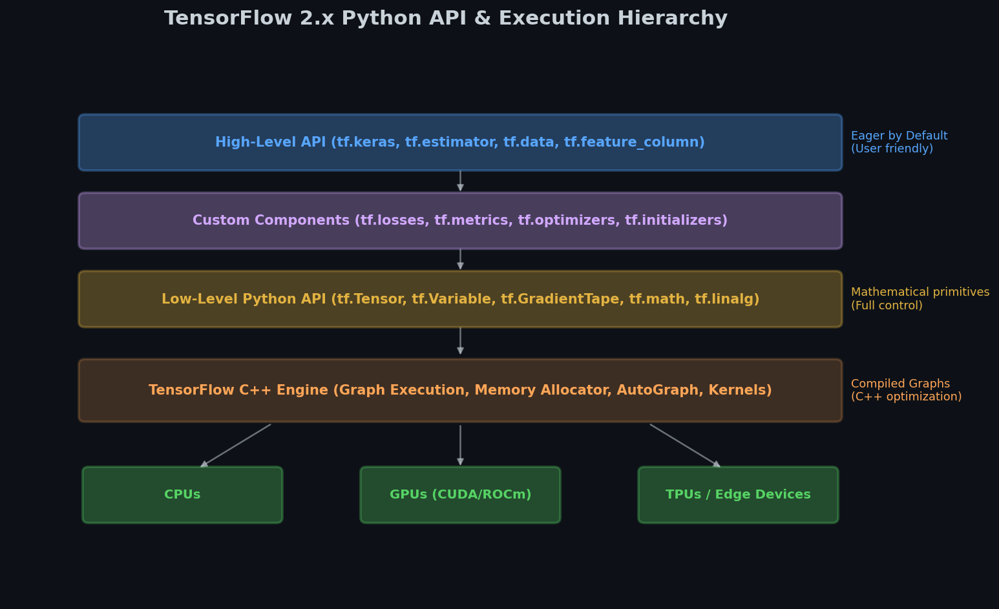
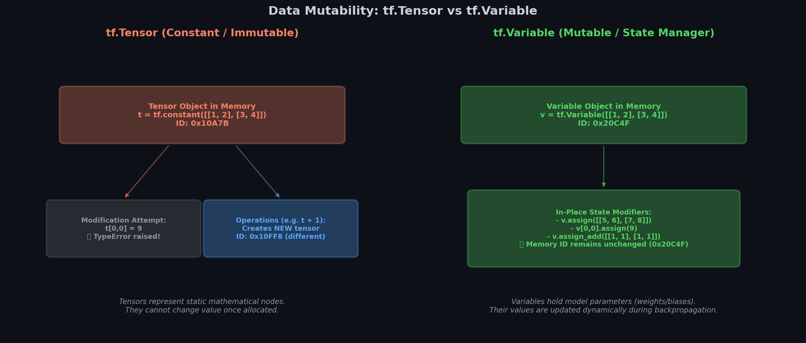

# 🔥 Module 1: TensorFlow Deep Dive — Tensors, Operations & Architecture
> **Ch. 12 — Hands-On ML with Scikit-Learn, Keras & TensorFlow (Aurélien Géron)**

---

## 📌 Table of Contents
1. [Start Here: The Big Picture](#big-picture)
2. [TensorFlow Architecture Overview](#architecture)
3. [Tensors: The Fundamental Data Structure](#tensors)
4. [Tensor Types: Variable vs. Constant vs. SparseTensor](#tensor-types)
5. [Essential Tensor Operations](#operations)
6. [Tensor vs. NumPy: Critical Differences](#vs-numpy)
7. [Data Types and Type Casting](#dtypes)
8. [Variables: The Only Mutable Tensor](#variables)
9. [Keras Low-Level vs. TF API](#keras-vs-tf)
10. [Common Beginner Mistakes](#mistakes)
11. [Interview Q&A](#interview)
12. [⚡ One-Page Flash Card](#revision)

---

## 🌍 Start Here: The Big Picture {#big-picture}

> **TL;DR:** TensorFlow is a numerical computation library built around Tensors (N-dimensional arrays) that can run on CPUs, GPUs, and TPUs. Everything in TF — weights, activations, gradients, losses — is a tensor. Understanding tensors is understanding the foundation of all deep learning operations.

**The "Factory Assembly Line" Analogy 🏭**

Think of TensorFlow as a factory:
- **Tensors** = Raw materials (steel plates, wires, components)
- **Operations (Ops)** = Machines that transform materials
- **Graph** = The blueprint showing which machine connects to which
- **Session/Execution** = Running the factory and watching materials flow through

Modern TF 2.x uses **eager execution** (materials flow immediately when you define the machine). Old TF 1.x used **graph mode** (define the whole blueprint, then run it separately).

**Why TensorFlow?**
- Runs on GPU/TPU → 10x-1000x faster than CPU for matrix math
- Automatic differentiation (Autodiff) → gradient computation for free
- Deployment: mobile, browser, servers, embedded devices
- Production-grade: TFX, TF Serving, TF Lite ecosystem

---

## 🏗️ TensorFlow Architecture Overview {#architecture}

```
┌─────────────────────────────────────────────┐
│           HIGH-LEVEL APIs                     │
│  tf.keras (models, layers, losses)            │
│  tf.data (input pipelines)                   │
│  tf.estimator (structured data)              │
├─────────────────────────────────────────────┤
│           PYTHON API                          │
│  tf.constant, tf.Variable, tf.GradientTape   │
│  tf.function, tf.Module                      │
├─────────────────────────────────────────────┤
│           EXECUTION ENGINE (C++)              │
│  Operations (ops) → kernels per device        │
│  CPU kernels │ GPU kernels │ TPU kernels      │
├─────────────────────────────────────────────┤
│           HARDWARE                            │
│     CPU         GPU          TPU             │
└─────────────────────────────────────────────┘
```


> 📊 **Graph 01:** The TensorFlow Architecture stack, showing high-level Keras APIs built on top of low-level C++ execution engines.

**Key components:**
- **tf.keras**: High-level neural network API
- **tf.data**: Efficient data pipelines (prefetch, parallel loading)
- **tf.image**: Image preprocessing ops
- **tf.signal**: Signal processing (FFT, spectrogram)
- **tf.io**: File I/O (TFRecord, CSV)
- **tf.lite**: Deployment on mobile/embedded devices
- **TensorBoard**: Visualization of training and model graphs

---

## 📦 Tensors: The Fundamental Data Structure {#tensors}

A **tensor** is a generalization of scalars, vectors, and matrices to any number of dimensions (called "axes" or "rank"):

| Name | Rank | Shape | Example |
|------|------|-------|---------|
| Scalar | 0 | () | `tf.constant(42)` |
| Vector | 1 | (n,) | `tf.constant([1, 2, 3])` |
| Matrix | 2 | (m, n) | `tf.constant([[1,2],[3,4]])` |
| 3D Tensor | 3 | (d, m, n) | Batch of images (batch, H, W) |
| 4D Tensor | 4 | (d,h,w,c) | Color image batch (batch, H, W, channels) |
| 5D Tensor | 5 | (b,t,h,w,c) | Video batch (batch, time, H, W, channels) |

```python
import tensorflow as tf

# Scalar
s = tf.constant(42)
print(s.shape)  # ()
print(s.dtype)  # tf.int32
print(s.numpy()) # 42

# Matrix
t = tf.constant([[1., 2., 3.], [4., 5., 6.]])
print(t.shape)  # (2, 3)
print(t.dtype)  # tf.float32

# Indexing (just like NumPy!)
print(t[:, 1:])           # rows: all, cols: 1 to end → shape (2, 2)
print(t[..., 1, tf.newaxis])  # column 1, add dim → shape (2, 1)

# 3D tensor for batch of sequences
batch_of_sequences = tf.constant([[[1., 2.], [3., 4.]],
                                   [[5., 6.], [7., 8.]]])
print(batch_of_sequences.shape)  # (2, 2, 2): (batch, timestep, features)
```

### The rank/shape/ndim vocabulary:
```python
t = tf.constant([[1, 2, 3], [4, 5, 6]])
print(tf.rank(t))          # 2  (2D = matrix)
print(t.shape)             # (2, 3)
print(len(t.shape))        # 2  (number of axes)
print(t.shape[0])          # 2  (size along axis 0)
print(tf.size(t))          # 6  (total number of elements)
```

---

## 🎭 Tensor Types: Variable vs. Constant vs. SparseTensor {#tensor-types}

| Type | Mutable? | When to Use | Memory |
|------|----------|-------------|--------|
| `tf.constant` | ❌ No | Fixed values (data, hyperparams) | Stored directly |
| `tf.Variable` | ✅ Yes | Trainable weights, state | Persistent in memory |
| `tf.SparseTensor` | ❌ No | Very sparse data (embeddings, adj. matrices) | Efficient sparse |
| `tf.RaggedTensor` | ❌ No | Variable-length sequences | Non-uniform rows |


> 📊 **Graph 02:** Memory models for `tf.constant` (immutable) vs `tf.Variable` (mutable, backed by persistent state for weight updates).

```python
# Constant: cannot change
c = tf.constant([1., 2., 3.])
# c.assign([4., 5., 6.])  ← Would raise AttributeError!

# Variable: can change (this is how weights are stored)
v = tf.Variable([1., 2., 3.])
v.assign([4., 5., 6.])          # OK!
v.assign_add([1., 0., 0.])      # v += [1, 0, 0]
v[2].assign(0.)                  # element-wise assignment

# SparseTensor: for sparse data
# Matrix:  [[1, 0], [0, 5]]  stored as:
sparse = tf.SparseTensor(
    indices=[[0, 0], [1, 1]],   # only non-zero positions
    values=[1, 5],               # values at those positions
    dense_shape=[2, 2]           # full shape
)
print(tf.sparse.to_dense(sparse))  # [[1,0],[0,5]]

# RaggedTensor: variable-length rows
sentences = tf.ragged.constant(
    [[1, 2, 3],     # 3 words
     [4, 5],        # 2 words
     [6, 7, 8, 9]]  # 4 words
)
print(sentences.shape)  # (3, None)  ← None = variable length
```

---

## ⚙️ Essential Tensor Operations {#operations}

```python
t = tf.constant([[1., 2., 3.], [4., 5., 6.]])

# ── Math Operations ───────────────────────────────────────────────────────────
print(t + 10)                   # element-wise add (broadcasts scalar)
print(tf.square(t))             # element-wise square
print(t @ tf.transpose(t))      # matrix multiplication (@ = tf.matmul)

# ── Reduction Operations ──────────────────────────────────────────────────────
print(tf.reduce_sum(t))         # sum ALL elements
print(tf.reduce_sum(t, axis=0)) # sum along rows → shape (3,)
print(tf.reduce_sum(t, axis=1)) # sum along cols → shape (2,)
print(tf.reduce_mean(t))        # mean of all elements
print(tf.reduce_max(t, axis=1)) # max per row

# ── Reshaping ─────────────────────────────────────────────────────────────────
print(tf.reshape(t, [3, 2]))    # reshape to (3, 2) — total elements must match
print(tf.reshape(t, [-1]))      # flatten to 1D (-1 = infer size)
print(tf.expand_dims(t, axis=0)) # add dim at axis 0: (1, 2, 3)

# ── Aggregation ───────────────────────────────────────────────────────────────
print(tf.math.top_k(t, k=2))   # top 2 values per row

# ── Conditionals ──────────────────────────────────────────────────────────────
mask = t > 3
print(tf.boolean_mask(t, mask).numpy())  # elements where t > 3
print(tf.where(t > 3, t, -1))   # t if t>3, else -1

# ── Concatenation ─────────────────────────────────────────────────────────────
a = tf.constant([[1, 2], [3, 4]])
b = tf.constant([[5, 6]])
print(tf.concat([a, b], axis=0))  # stack vertically: (3, 2)
print(tf.stack([a, a], axis=0))   # create new axis: (2, 2, 2)
```

---

## 🔄 Tensor vs. NumPy: Critical Differences {#vs-numpy}

| Feature | NumPy | TensorFlow |
|---------|-------|-----------|
| Mutability | Arrays mutable in-place | `tf.constant` immutable, only `tf.Variable` mutable |
| GPU support | ❌ CPU only | ✅ GPU and TPU |
| Gradient tracking | ❌ Manual | ✅ Automatic via `tf.GradientTape` |
| `T` transpose | `array.T` → view (no copy) | `tf.transpose(t)` → new tensor (copy!) |
| Naming | `np.sum`, `np.mean` | `tf.reduce_sum`, `tf.reduce_mean` |
| Boolean indexing | `array[array > 3]` | `tf.boolean_mask(t, mask)` |
| Memory | Shared views | Copy on transpose/slice |

```python
import numpy as np

# Converting between numpy and TF
np_array = np.array([1., 2., 3.])
tf_tensor = tf.constant(np_array)   # numpy → tensor
back_to_np = tf_tensor.numpy()       # tensor → numpy

# NumPy-TF interoperability
# TF ops accept numpy arrays directly!
result = tf.reduce_sum(np_array)     # works fine!

# NumPy functions accept TF tensors!
import numpy as np
result = np.square(tf_tensor)        # works, returns numpy array
```

> ⚠️ **Critical:** Calling `.numpy()` INSIDE a `tf.GradientTape` context breaks gradient tracking! The gradient tape loses the computation history at that point.

---

## 🔡 Data Types and Type Casting {#dtypes}

TensorFlow is strict about data types — operations between different types will fail!

```python
# Common dtypes
tf.float16  # half-precision (GPU memory efficient)
tf.float32  # default for neural network weights ⭐
tf.float64  # double precision (matches Python float)
tf.int8, tf.int16, tf.int32, tf.int64
tf.string   # string tensors
tf.bool     # boolean

# Default dtype gotcha
x = tf.constant([1, 2, 3])        # dtype: int32
y = tf.constant([1., 2., 3.])     # dtype: float32
# tf.add(x, y)  ← InvalidArgumentError! Cannot add int32 and float32

# Explicit casting
x_float = tf.cast(x, tf.float32)  # int32 → float32
result = tf.add(x_float, y)        # works!

# Or specify dtype at creation
x = tf.constant([1, 2, 3], dtype=tf.float32)  # already float

# Checking dtype
print(x.dtype)         # tf.float32
print(x.dtype == tf.float32)  # True
```

**Mixed Precision Training** (important for GPU efficiency):
```python
# Use float16 for compute, float32 for weights (best of both worlds)
from tensorflow.keras.mixed_precision import experimental as mixed_precision
policy = mixed_precision.Policy("mixed_float16")
mixed_precision.set_global_policy(policy)
```

---

## 📌 Variables: The Only Mutable Tensor {#variables}

`tf.Variable` is the ONLY tensor type that can be modified in-place. All neural network weights are `tf.Variable` instances.

```python
# Create a Variable
W = tf.Variable(tf.random.normal([3, 2]))  # random initialization
b = tf.Variable(tf.zeros([2]))             # zero initialization

print(W.trainable)  # True by default — will be tracked by GradientTape!

# Mutation operations
W.assign(tf.ones([3, 2]))              # W = ones (full replacement)
W.assign_add(tf.ones([3, 2]) * 0.01)  # W += 0.01 (in-place add)
W.assign_sub(tf.ones([3, 2]) * 0.01)  # W -= 0.01 (in-place subtract)
W[0, 0].assign(5.)                     # set single element

# Non-trainable Variable (e.g., tracking epoch count)
epoch_counter = tf.Variable(0, trainable=False)

# Variable behaves like a tensor for math operations
output = W @ tf.constant([[1.], [2.], [3.]])  # (2,3) @ (3,1) = (2,1)
```

**Under the hood:** When you call `model.trainable_variables`, Keras returns all `tf.Variable` objects in the model with `trainable=True`. The optimizer then uses these to apply gradient updates.

---

## 🔀 Keras Low-Level vs. TF API {#keras-vs-tf}

```python
# These are equivalent — use whichever you prefer
import tensorflow as tf
from tensorflow import keras

# Option A: TF API
result = tf.square(x)
loss = tf.reduce_mean(tf.square(y_true - y_pred))

# Option B: Keras backend API
result = keras.backend.square(x)
loss = keras.backend.mean(keras.backend.square(y_true - y_pred))

# Option C: Keras losses (highest level, most features)
loss = keras.losses.MeanSquaredError()(y_true, y_pred)
```

**When to use which:**
- `keras.backend.*`: For portable code that works with non-TF Keras backends (theoretically)
- `tf.*`: For TensorFlow-specific code (most common, more ops available)
- `keras.losses/metrics/layers.*`: For building Keras models (highest abstraction)

---

## ❌ Common Beginner Mistakes {#mistakes}

**1. Calling `.numpy()` inside GradientTape** ❌
> Reality: `.numpy()` converts a tensor to a NumPy array. This breaks the computation graph — the tape loses all gradient information up to that point. All tensor operations inside the tape must stay as TF ops.

**2. Mixing int and float tensors in operations** ❌
> Reality: `tf.add(tf.constant(1, dtype=tf.int32), tf.constant(1.5, dtype=tf.float32))` → `InvalidArgumentError`. TF doesn't auto-cast. Always cast explicitly with `tf.cast()`.

**3. Assuming `tf.transpose()` creates a view (like NumPy)** ❌
> Reality: `t.T` in NumPy is a **view** (no new memory). `tf.transpose(t)` creates a **new tensor** with its own data copy. This matters when tracking performance.

**4. Using `=` to update a Variable** ❌
> Reality: `v = v + 1` creates a NEW tensor and rebinds the Python name `v`. The original Variable is unchanged! Use `v.assign(v + 1)` or `v.assign_add(1)` for in-place modification.

**5. Forgetting `dtype=tf.float32` for integer inputs** ❌
> Reality: `tf.constant([1, 2, 3])` creates int32 by default. Neural network operations require float32. Always specify `dtype=tf.float32` or use `tf.cast()`.

---

## 🎤 Interview Q&A {#interview}

**Q1: What is the difference between `tf.constant` and `tf.Variable`?**
> **A:** `tf.constant` is immutable — once created, its values cannot be changed. `tf.Variable` is mutable — you can update its values with `.assign()`, `.assign_add()`, etc. All neural network weights are `tf.Variable` because they need to be updated during training via gradient descent. `tf.constant` is used for fixed data, hyperparameters, or any value that shouldn't change during training.

**Q2: Why does TensorFlow have `tf.reduce_sum` instead of just `sum`?**
> **A:** (1) It reduces a tensor along specified axes (axis argument), not just summing all elements. (2) The name "reduce" comes from the GPU implementation: GPU kernels use a parallel reduction algorithm that adds elements in a tree-like pattern. This non-deterministic order means results may differ slightly across runs due to floating-point precision — hence the explicit "reduce" naming to signal this behavior.

**Q3: What happens when you call `.numpy()` inside a `tf.GradientTape` and why is it problematic?**
> **A:** Calling `.numpy()` converts the tensor to a NumPy array. NumPy operations are not tracked by the tape. If you then apply TF operations to this NumPy array, those operations start a new computation path that the tape doesn't know about. When you call `tape.gradient()`, it returns `None` for variables that were only used in the untracked NumPy portion of the computation.

**Q4: What is eager execution and how does it differ from TF 1.x graph mode?**
> **A:** TF 2.x uses eager execution: operations execute immediately when Python calls them, returning concrete values (like NumPy). TF 1.x used graph mode: you first define a computation graph (using `tf.placeholder`, `tf.Session`), then execute it separately with `session.run()`. Eager execution is more intuitive (you can print tensors anytime, use Python debuggers), but TF 2.x also supports graph mode via `@tf.function` for performance when needed.

---

## ⚡ One-Page Flash Card {#revision}

```
╔══════════════════════════════════════════════════════════════════════╗
║          MODULE 1 — TENSORFLOW TENSORS FLASH CARD                     ║
╠══════════════════════════════════════════════════════════════════════╣
║                                                                        ║
║  TENSOR TYPES:                                                         ║
║  tf.constant → immutable, no gradient by default, created once       ║
║  tf.Variable → mutable, gradient tracked, use .assign() to update    ║
║  tf.SparseTensor → efficient sparse data storage                      ║
║  tf.RaggedTensor → variable-length rows (e.g., unpadded sequences)   ║
║                                                                        ║
║  KEY OPERATIONS:                                                       ║
║  t @ tf.transpose(t) → matrix multiply (matmul)                      ║
║  tf.reduce_sum/mean(t, axis=N) → reduce along axis                   ║
║  tf.reshape(t, [m, -1]) → reshape (-1 = infer)                      ║
║  tf.cast(t, tf.float32) → type conversion                            ║
║  tf.concat([a,b], axis=0) → concatenate along axis                  ║
║                                                                        ║
║  TF vs NUMPY:                                                          ║
║  tf.transpose(t) → NEW copy (not a view like numpy t.T!)             ║
║  .numpy() breaks gradient tape tracking!                              ║
║  np.sum → tf.reduce_sum, np.mean → tf.reduce_mean                   ║
║                                                                        ║
║  DEFAULT DTYPE:                                                        ║
║  tf.constant([1,2,3]) → int32   (must cast to float32 for ops!)     ║
║  tf.constant([1.,2.]) → float32 (note the decimal points)           ║
║                                                                        ║
╚══════════════════════════════════════════════════════════════════════╝
```

---

**🔗 Next Module →** [02 — Custom Losses and Components](02_Custom_Losses_and_Components.md)
