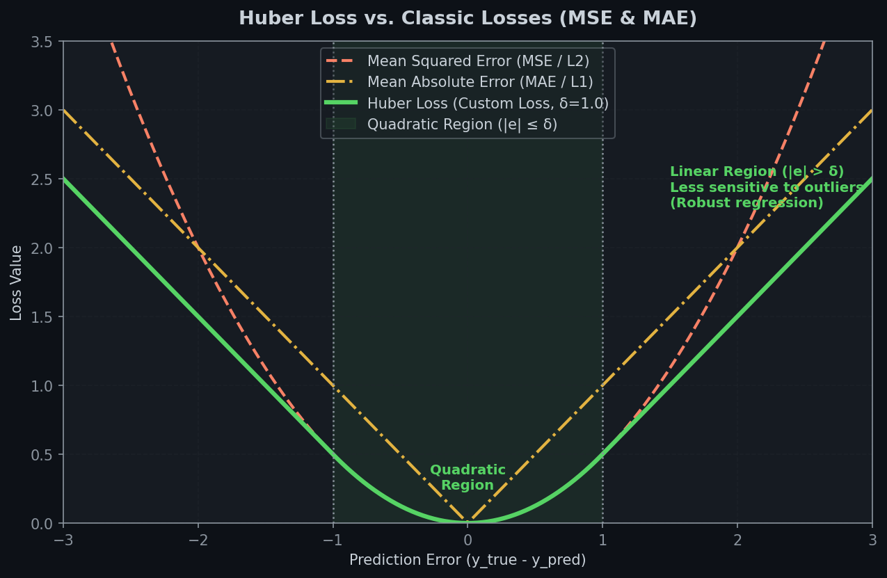
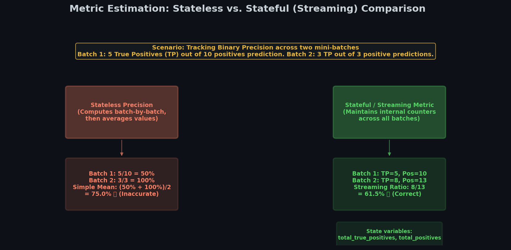

# 🎨 Module 2: Custom Losses and Components
> **Ch. 12 — Hands-On ML with Scikit-Learn, Keras & TensorFlow (Aurélien Géron)**

---

## 📌 Table of Contents
1. [Start Here: The Big Picture](#big-picture)
2. [Custom Loss Functions: Huber Loss](#huber-loss)
3. [Saving and Loading Models with Custom Losses](#saving-losses)
4. [Custom Activations, Initializers, Regularizers, and Constraints](#custom-components)
5. [Stateless vs. Stateful Metrics](#stateless-vs-stateful)
6. [Implementing Stateful Custom Metrics](#stateful-metrics)
7. [Common Beginner Mistakes](#mistakes)
8. [Interview Q&A](#interview)
9. [⚡ One-Page Flash Card](#revision)

---

## 🌍 Start Here: The Big Picture {#big-picture}

> **TL;DR:** While standard Keras features cover 95% of typical applications, customized research problems require custom mathematical elements. TensorFlow lets you easily define custom losses, activation functions, weights initializers, regularizers, and performance metrics that integrate natively into Keras model compilation.

**The Real-World Analogy 🍕:**
Imagine you are customizing a production car. Using standard components is easy: you can choose from the factory catalog for tires, engine size, and seat colors.
But if you are building an off-road racing vehicle, factory defaults will fail. You need custom shock absorbers (Custom Loss functions to penalize bumps), high-grip custom tread layouts (Custom Regularizers to constrain acceleration), and a custom dashboard dial (Custom Stateful Metrics) to track average fuel consumption over the entire trip, rather than just immediate instantaneous readings.

---

## 🔍 1. Custom Loss Functions: Huber Loss {#huber-loss}

When training regression models, Mean Squared Error (MSE) penalizes large outliers severely due to squaring, which can pull the model away from typical data points. Mean Absolute Error (MAE) handles outliers gently, but its gradient is discontinuous at zero, which can slow down training convergence.
The **Huber Loss** offers the best of both worlds: it is quadratic for small errors, and linear for large errors.


> 📊 **Graph 03:** Huber Loss curve compared to MSE and MAE. Note the transition boundary at $\delta = 1.0$, where Huber shifts from quadratic to linear.

### Mathematical Intuition
$$L_{\delta}(y, \hat{y}) = \begin{cases} \frac{1}{2}(y - \hat{y})^2 & \text{for } |y - \hat{y}| \le \delta \\ \delta \left(|y - \hat{y}| - \frac{1}{2}\delta\right) & \text{otherwise} \end{cases}$$

Here, $\delta$ is the threshold defining where the loss changes from quadratic to linear. A smaller $\delta$ makes the loss more robust to outliers.

### Keras Implementation

```python
import tensorflow as tf
from tensorflow import keras

# 1. Custom Huber Loss Function
def huber_fn(y_true, y_pred):
    error = y_true - y_pred
    is_small_error = tf.abs(error) < 1.0 # threshold delta = 1.0
    squared_loss = tf.square(error) / 2.0
    linear_loss  = 1.0 * (tf.abs(error) - 0.5)
    return tf.where(is_small_error, squared_loss, linear_loss)

# Usage in compile:
# model.compile(loss=huber_fn, optimizer="adam")
```

---

## 💾 2. Saving and Loading Models with Custom Losses {#saving-losses}

If you compile a model using a custom loss function and save it, Keras only serializes the model structure and weights, not the custom Python code.

### Standard Function Saving & Loading
To load the model, you must provide a dictionary mapping the custom name to the actual Python function using the `custom_objects` argument:

```python
# Saving model:
# model.save("my_model_with_custom_loss.h5")

# Loading model:
# model = keras.models.load_model("my_model_with_custom_loss.h5",
#                                 custom_objects={"huber_fn": huber_fn})
```

### Parameterizing Custom Losses (Subclassing)
If your loss function relies on custom parameters (like a configurable threshold $\delta$), creating a standard function limits your ability to serialize those settings. 
Instead, you should inherit from `keras.losses.Loss` and implement the `get_config()` method.

```python
class HuberLoss(keras.losses.Loss):
    def __init__(self, threshold=1.0, **kwargs):
        super().__init__(**kwargs)
        self.threshold = threshold

    def call(self, y_true, y_pred):
        error = y_true - y_pred
        is_small_error = tf.abs(error) < self.threshold
        squared_loss = tf.square(error) / 2.0
        linear_loss  = self.threshold * (tf.abs(error) - self.threshold / 2.0)
        return tf.where(is_small_error, squared_loss, linear_loss)

    def get_config(self):
        base_config = super().get_config()
        # Return hyperparameters so they are written to disk
        return {**base_config, "threshold": self.threshold}

# Compilation & Loading
# model.compile(loss=HuberLoss(threshold=1.5), optimizer="adam")
# model = keras.models.load_model("my_model.h5", custom_objects={"HuberLoss": HuberLoss})
```

---

## 🛠️ 3. Custom Activations, Initializers, Regularizers, and Constraints {#custom-components}

You can customize almost any part of a Keras layer:

```python
# 1. Custom Activation Function (Equivalent to tf.nn.softplus)
def my_softplus(z):
    return tf.math.log(tf.exp(z) + 1.0)

# 2. Custom Glorot Initializer
def my_glorot_initializer(shape, dtype=tf.float32):
    stddev = tf.sqrt(2.0 / (shape[0] + shape[1]))
    return tf.random.normal(shape, stddev=stddev, dtype=dtype)

# 3. Custom L1 Regularizer
def my_l1_regularizer(weights):
    return tf.reduce_sum(tf.abs(0.01 * weights))

# 4. Custom Weight Constraint (Enforces positive weights)
def my_positive_constraint(weights):
    return tf.where(weights < 0., 0., weights)

# Applying custom components in a layer
layer = keras.layers.Dense(
    30,
    activation=my_softplus,
    kernel_initializer=my_glorot_initializer,
    kernel_regularizer=my_l1_regularizer,
    kernel_constraint=my_positive_constraint
)
```

> [!NOTE]
> If a component contains hyperparameters, subclass the appropriate parent class (e.g. `keras.regularizers.Regularizer`, `keras.constraints.Constraint`, `keras.initializers.Initializer`) and implement `get_config()`.

---

## 📊 4. Stateless vs. Stateful Metrics {#stateless-vs-stateful}

* **Stateless Metrics**: Calculated batch-by-batch. The overall metric is simply the average of the batch-wise metric values. This works fine for additive metrics like MSE, but fails for ratio-based metrics.
* **Stateful (Streaming) Metrics**: Track running statistics across batches (e.g. sum of True Positives, sum of False Positives), computing the overall metric only from these accumulated totals.


> 📊 **Graph 04:** Comparing Stateless vs. Stateful Precision. Stateless calculations average batch precisions directly, which leads to incorrect math due to differing batch counts. Stateful metrics correctly track running sums of indicators.

---

## 📈 5. Implementing Stateful Custom Metrics {#stateful-metrics}

To implement a stateful metric, subclass `keras.metrics.Metric` and override:
1. `__init__()`: Define state variables using `self.add_weight()`.
2. `update_state()`: Accumulate stats from new batches.
3. `result()`: Compute and return the final metric value.
4. `get_config()`: Serialize configuration variables.

```python
class HuberMetric(keras.metrics.Metric):
    def __init__(self, threshold=1.0, **kwargs):
        super().__init__(**kwargs)
        self.threshold = threshold
        # Initialize state variables to track sum of errors and count
        self.huber_count = self.add_weight("huber_count", initializer="zeros")
        self.huber_sum = self.add_weight("huber_sum", initializer="zeros")

    def update_state(self, y_true, y_pred, sample_weight=None):
        error = y_true - y_pred
        is_small_error = tf.abs(error) < self.threshold
        squared_loss = tf.square(error) / 2.0
        linear_loss  = self.threshold * (tf.abs(error) - self.threshold / 2.0)
        huber_loss = tf.where(is_small_error, squared_loss, linear_loss)
        
        self.huber_sum.assign_add(tf.reduce_sum(huber_loss))
        self.huber_count.assign_add(tf.cast(tf.size(y_true), tf.float32))

    def result(self):
        return self.huber_sum / self.huber_count

    def get_config(self):
        base_config = super().get_config()
        return {**base_config, "threshold": self.threshold}
```

---

## ❌ Common Beginner Mistakes {#mistakes}

### 1. Forgetting to register custom components when loading a model ❌
Loading a model that uses `huber_fn` with `keras.models.load_model("my_model.h5")` will throw a `ValueError: Unknown loss function: huber_fn`.
> **Fix:** Always provide the `custom_objects` parameter mapping strings to functions:
> `model = keras.models.load_model("my_model.h5", custom_objects={"huber_fn": huber_fn})`.

### 2. Computing streaming calculations (like Precision) with a stateless function ❌
Passing a standard Python function to calculate Precision in `metrics=[my_precision]` calculates batch-by-batch percentages and takes their simple average, resulting in mathematically incorrect statistics.
> **Fix:** Always write custom metric classes inheriting from `keras.metrics.Metric` for non-additive evaluations.

---

## 🎤 Interview Q&A {#interview}

**Q1: Why does a custom loss function parameterized via subclassing (e.g. `HuberLoss(threshold=1.5)`) require overriding `get_config()`?**
> **A:** When Keras saves a model to an HDF5 or SavedModel file, it attempts to store the structural configurations of every layer and optimization component. If you do not override `get_config()`, Keras only saves the class name and the default configuration. Upon loading, the model would fall back to the default parameter (e.g., threshold=1.0) rather than restoring the custom parameter (1.5). Overriding `get_config()` forces Keras to write the dictionary of custom hyperparameters directly to the model metadata.

**Q2: What is the exact sequence of executions for `update_state()` and `result()` during a Keras training epoch?**
> **A:** At the beginning of each epoch, Keras calls the metric's `reset_states()` to zero out all state weights. During training, at the end of each mini-batch, Keras passes the batch predictions and labels to `update_state()`, which updates the accumulated weights in-place. Finally, at the end of the epoch (or when logs are printed), Keras calls `result()` once to compute the metric from the accumulated values.

---

## ⚡ One-Page Flash Card {#revision}

```
╔══════════════════════════════════════════════════════════════════╗
║            MODULE 2 — CUSTOM COMPONENTS FLASH CARD               ║
╠══════════════════════════════════════════════════════════════════╣
║                                                                  ║
║  CUSTOM LOSS (FUNCTION VS SUBCLASS):                             ║
║  - Function: Easy, but cannot store custom parameters on save.   ║
║  - Subclass: Inherits from keras.losses.Loss. Must implement:    ║
║      - call(y_true, y_pred)                                      ║
║      - get_config() -> returns dict of hyperparameters           ║
║                                                                  ║
║  METRICS DISTINCTION:                                            ║
║  - Stateless: Computes batch-wise, averages values (MSE is fine) ║
║  - Stateful: Accumulates counts. Inherits from Metric. Method:   ║
║      - __init__(): add_weight() for tracking variables           ║
║      - update_state(y_true, y_pred): update counters             ║
║      - result(): returns final metric value                      ║
║                                                                  ║
║  MODEL LOADING REMINDER:                                         ║
║  - load_model("path.h5", custom_objects={"Name": ClassRef})      ║
╚══════════════════════════════════════════════════════════════════╝
```

---

**🔗 Previous Module →** [01_TensorFlow_Quick_Tour_and_NumPy_Basics.md](01_TensorFlow_Quick_Tour_and_NumPy_Basics.md)  
**🔗 Next Module →** [03_Custom_Layers_and_Models.md](03_Custom_Layers_and_Models.md)
