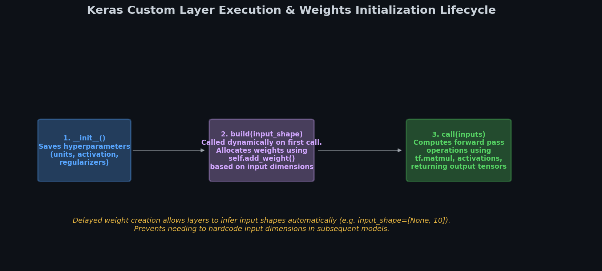

# 🏗️ Module 3: Custom Layers and Models
> **Ch. 12 — Hands-On ML with Scikit-Learn, Keras & TensorFlow (Aurélien Géron)**

---

## 📌 Table of Contents
1. [Start Here: The Big Picture](#big-picture)
2. [Custom Stateless Layers](#stateless-layers)
3. [Custom Stateful Layers (with Weights)](#stateful-layers)
4. [Layers with Multiple Inputs and Outputs](#multi-io-layers)
5. [Custom Models: Subclassing tf.keras.Model](#custom-models)
6. [Losses and Metrics Based on Model Internals](#internal-losses)
7. [Common Beginner Mistakes](#mistakes)
8. [Interview Q&A](#interview)
9. [⚡ One-Page Flash Card](#revision)

---

## 🌍 Start Here: The Big Picture {#big-picture}

> **TL;DR:** When standard dense, convolutional, or recurrent layers are not enough, TensorFlow allows you to build custom building blocks. You can create stateless layers (e.g. math operations), stateful layers (e.g. layers containing learnable weights), and complete model subclasses containing dynamic forward execution logic (loops and branches).

**The Real-World Analogy 🍕:**
Imagine you are building a custom house using Lego blocks.
Most of the time, standard bricks (Dense, Conv2D, Dropout layers) work fine.
But sometimes, you need a highly specialized piece—like a custom structural hinge (a Custom Layer that computes weights in a specific way) or an entire smart home automation hub (a Custom Model that routes power and data dynamically depending on weather sensors). 
Creating custom layers and models lets you define the physics of these components and assemble them into a unified, modular architecture.

---

## 🔍 1. Custom Stateless Layers {#stateless-layers}

If you want to create a layer that performs basic mathematical operations without maintaining any learnable weights, you can write a simple function and wrap it in a `tf.keras.layers.Lambda` layer.

```python
import tensorflow as tf
from tensorflow import keras

# An exponential layer: y = exp(x)
exponential_layer = keras.layers.Lambda(lambda x: tf.exp(x))

# Usage inside a Sequential model
model = keras.models.Sequential([
    keras.layers.Dense(30, activation="relu"),
    exponential_layer
])
```

---

## 🏗️ 2. Custom Stateful Layers (with Weights) {#stateful-layers}

To create a layer that holds trainable weights, you must inherit from `tf.keras.layers.Layer` and implement the following methods:


> 📊 **Graph 05:** Lifecycle of a custom stateful layer. Delayed weight allocation inside `build()` ensures the layer automatically configures itself when it receives inputs of any dimension.

* `__init__(self, units, activation=None, **kwargs)`: Store hyperparameters.
* `build(self, input_shape)`: Allocate weights using `self.add_weight()`. Defining weights here guarantees Keras can inspect input shapes dynamically.
* `call(self, inputs)`: Perform the mathematical forward pass.
* `compute_output_shape(self, input_shape)`: Return the shape of the output tensor.
* `get_config(self)`: Serialize hyperparameters.

### Implementation: A Custom Dense Layer

```python
class MyDense(keras.layers.Layer):
    def __init__(self, units, activation=None, **kwargs):
        super().__init__(**kwargs)
        self.units = units
        self.activation = keras.activations.get(activation)

    def build(self, input_shape):
        # input_shape[-1] gives the feature dimension of the input
        self.kernel = self.add_weight(
            name="kernel",
            shape=[input_shape[-1], self.units],
            initializer="glorot_uniform",
            trainable=True
        )
        self.bias = self.add_weight(
            name="bias",
            shape=[self.units],
            initializer="zeros",
            trainable=True
        )
        super().build(input_shape) # Must call super().build() at the end

    def call(self, inputs):
        # Linear activation logic: y = Wx + b
        result = tf.matmul(inputs, self.kernel) + self.bias
        return self.activation(result) if self.activation is not None else result

    def compute_output_shape(self, input_shape):
        # Retain batch dimension (axis 0), replace feature dimension with units
        return tf.TensorShape([input_shape[0], self.units])

    def get_config(self):
        base_config = super().get_config()
        return {
            **base_config,
            "units": self.units,
            "activation": keras.activations.serialize(self.activation)
        }
```

---

## 🔀 3. Layers with Multiple Inputs and Outputs {#multi-io-layers}

If your layer takes multiple inputs (e.g. two separate tensor paths) or returns multiple outputs, the `call()` method must accept and return tuples:

```python
class MultiIO(keras.layers.Layer):
    def call(self, inputs):
        # Expects a tuple of inputs: (X1, X2)
        X1, X2 = inputs
        # Returns a tuple of outputs: sum, difference
        return X1 + X2, X1 - X2

    def compute_output_shape(self, input_shape):
        # input_shape is a tuple of shapes
        shape1, shape2 = input_shape
        return [shape1, shape1] # Both outputs share the shape of shape1
```

---

## 🏗️ 4. Custom Models: Subclassing tf.keras.Model {#custom-models}

To construct custom model architectures containing custom layers, you inherit from `tf.keras.Model`. Define sub-layers in `__init__()` and implement the forward path execution logic inside `call(inputs)`.


> 📊 **Graph 06:** Subclassed Model with custom `ResidualBlock` layer. The input passes through a main path (Dense Layers) and an identity bypass path before being added.

### Implementation: Subclassed Residual Network

```python
class ResidualBlock(keras.layers.Layer):
    def __init__(self, units, **kwargs):
        super().__init__(**kwargs)
        self.hidden = keras.layers.Dense(units, activation="elu", kernel_initializer="he_normal")

    def call(self, inputs):
        # Main path computes Dense output; bypass path adds inputs directly
        return inputs + self.hidden(inputs)

    def get_config(self):
        # No custom params besides defaults, but good practice
        return super().get_config()


class ResidualRegressor(keras.Model):
    def __init__(self, output_dim, **kwargs):
        super().__init__(**kwargs)
        self.hidden1 = keras.layers.Dense(30, activation="elu", kernel_initializer="he_normal")
        self.block1 = ResidualBlock(30)
        self.block2 = ResidualBlock(30)
        self.out_layer = keras.layers.Dense(output_dim)

    def call(self, inputs):
        x = self.hidden1(inputs)
        x = self.block1(x)
        # Skip connection routing through multiple blocks
        x = self.block2(x)
        return self.out_layer(x)
```

---

## 📈 5. Losses and Metrics Based on Model Internals {#internal-losses}

Sometimes, a loss or metric depends on the internal state of layers rather than just comparing $y_{true}$ and $y_{pred}$ (e.g. variational autoencoder KL divergence, or reconstruction losses).
You can compute these values inside `call()` and register them by calling `self.add_loss()` or `self.add_metric()`.

### Implementation: Reconstruction Regressor

```python
class ReconstructionRegressor(keras.Model):
    def __init__(self, output_dim, **kwargs):
        super().__init__(**kwargs)
        self.hidden = keras.layers.Dense(30, activation="selu", kernel_initializer="lecun_normal")
        self.out_layer = keras.layers.Dense(output_dim)

    def build(self, input_shape):
        # Create an auxiliary reconstruction layer matching input dimension
        self.reconstruct_layer = keras.layers.Dense(input_shape[-1])
        super().build(input_shape)

    def call(self, inputs):
        hidden = self.hidden(inputs)
        reconstruction = self.reconstruct_layer(hidden)
        
        # Calculate reconstruction error (MSE relative to raw inputs)
        recon_loss = tf.reduce_mean(tf.square(reconstruction - inputs))
        # Register loss (multiplied by regularizing weight factor)
        self.add_loss(0.05 * recon_loss)
        
        return self.out_layer(hidden)
```

---

## ❌ Common Beginner Mistakes {#mistakes}

### 1. Initializing weights inside `__init__()` instead of `build()` ❌
Instantiating layer weights inside `__init__()` requires you to hardcode the input dimension (e.g., `shape=[10, units]`). If the model receives inputs of a different shape, training will crash.
> **Fix:** Define weights inside `build(input_shape)`, which extracts the dynamic input dimensions automatically on the first model call.

### 2. Expecting subclassed models to show architecture inside `summary()` ❌
Subclassed models are dynamic; their execution graph is defined inside the Python interpreter, not statically compiled. Thus, calling `model.summary()` right after instantiation will throw errors or show empty tables because Keras does not yet know the input shape.
> **Fix:** Build the model by passing dummy data (e.g., `model(tf.zeros([1, 10]))`) or specify an input shape at build time to populate weight summaries.

---

## 🎤 Interview Q&A {#interview}

**Q1: What are the trade-offs between the Functional API and Model Subclassing?**
> **A:** The Functional API provides a static graph architecture. Keras checks shapes, prevents connectivity bugs, and easily serializes and saves models. You can also print the layout using `plot_model()`.
> Subclassing, on the other hand, provides dynamic execution. You can use conditional loops, variable-sized branches, or arbitrary NumPy functions inside the `call()` method. However, this dynamics turns the model into a black box for Keras: it cannot check shapes, extract intermediate layers, or save easily without custom serialization.

**Q2: What is the difference between a loss added via `compile(loss=...)` and one registered via `self.add_loss()`?**
> **A:** Compile-time losses are classic supervised objectives that compare predicted outputs to target labels ($y_{pred}$ vs. $y_{true}$). Losses added via `self.add_loss()` represent auxiliary regularizations or internal constraints that depend on layer weights or intermediate activations (e.g., reconstruction error, KL divergence, or sparsity constraints). Keras automatically aggregates all losses added via `self.add_loss()` and adds them to the main loss during the backpropagation step.

---

## ⚡ One-Page Flash Card {#revision}

```
╔══════════════════════════════════════════════════════════════════╗
║             MODULE 3 — CUSTOM LAYERS FLASH CARD                  ║
╠══════════════════════════════════════════════════════════════════╣
║                                                                  ║
║  STATEFUL LAYER STRUCTURE:                                       ║
║  - __init__(): Saves units and config settings.                  ║
║  - build(input_shape): Allocates weights using self.add_weight() ║
║  - call(inputs): Mathematical forward execution.                 ║
║  - compute_output_shape(input_shape): Retain/change dimension.   ║
║                                                                  ║
║  API MATRIX:                                                     ║
║  - Sequential/Functional: Static, checkable, serializable.       ║
║  - Subclassing: Dynamic (loops/branches), hard to verify,        ║
║    requires custom config overrides for load/save.               ║
║                                                                  ║
║  INTERNAL CONSTRAINTS:                                           ║
║  - self.add_loss(tensor) -> Registers internal regularization.   ║
║  - self.add_metric(tensor) -> Tracks internal states.            ║
╚══════════════════════════════════════════════════════════════════╝
```

---

**🔗 Previous Module →** [02_Custom_Losses_and_Components.md](02_Custom_Losses_and_Components.md)  
**🔗 Next Module →** [04_Autodiff_and_Custom_Training_Loops.md](04_Autodiff_and_Custom_Training_Loops.md)
