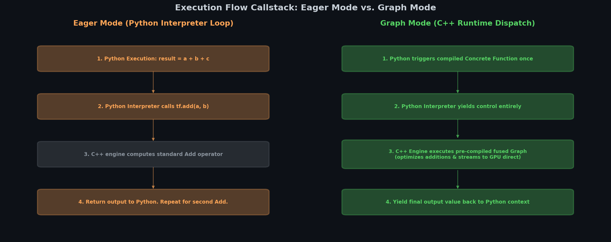
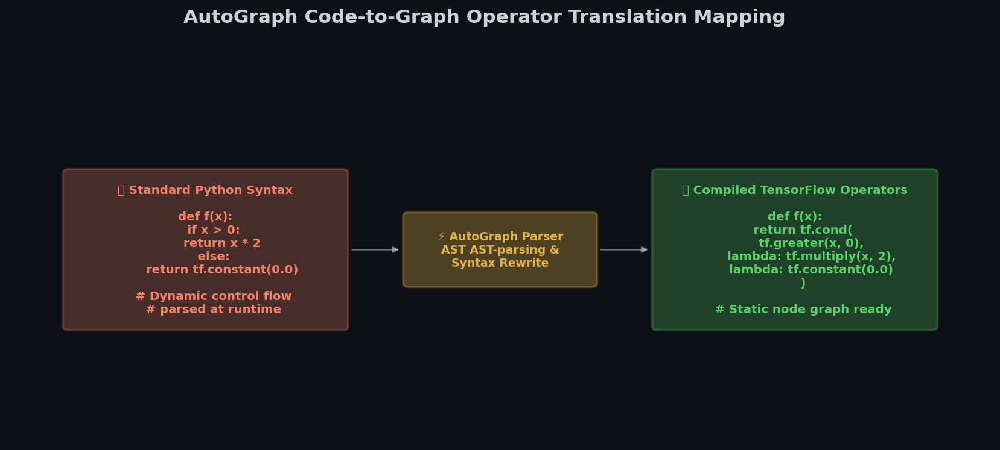
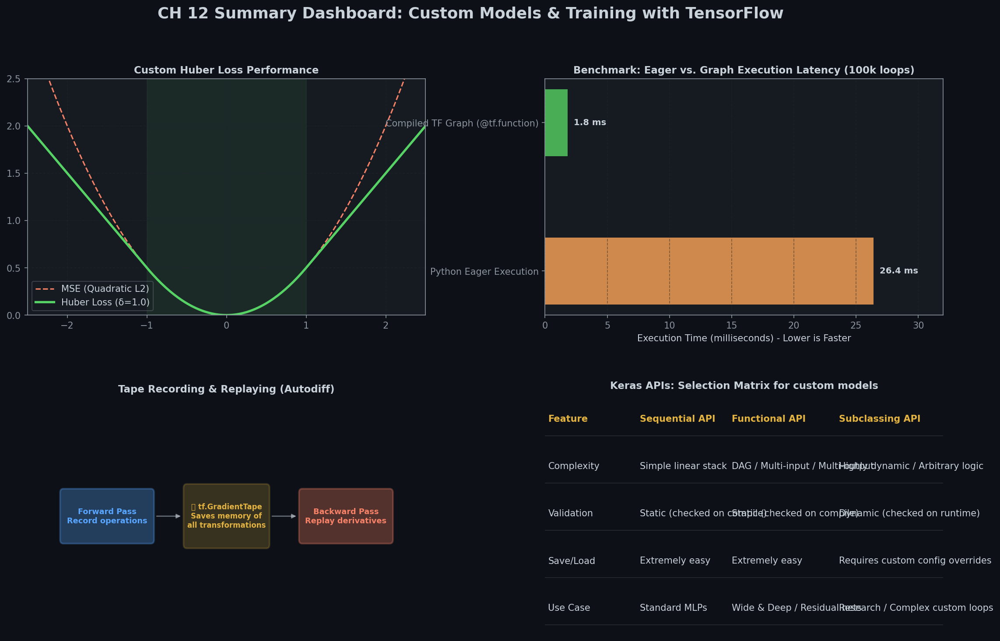

# 🕸️ Module 5: TensorFlow Functions and Graphs
> **Ch. 12 — Hands-On ML with Scikit-Learn, Keras & TensorFlow (Aurélien Géron)**

---

## 📌 Table of Contents
1. [Start Here: The Big Picture](#big-picture)
2. [Eager vs. Graph Execution](#eager-vs-graph)
3. [Compiling Functions with @tf.function](#tf-function)
4. [AutoGraph and Tracing Mechanics](#autograph-tracing)
5. [Rules for Writing Graph-Compatible Code](#graph-rules)
6. [Common Beginner Mistakes](#mistakes)
7. [Interview Q&A](#interview)
8. [⚡ One-Page Flash Card](#revision)

---

## 🌍 Start Here: The Big Picture {#big-picture}

> **TL;DR:** While eager execution makes development intuitive and debugging easy, compiling code to static computation graphs is necessary to achieve maximum speed. TensorFlow uses `@tf.function` to parse Python code (via AutoGraph), trace symbolic executions, and compile the code into highly optimized, hardware-portable computation graphs executed in C++.

**The Real-World Analogy 🍕:**
Imagine you are building a customized skyscraper.
* **Eager execution** is like building the skyscraper on the fly without a blueprint. You lay down bricks, check how they look, adjust the walls, and add windows as you think of them. This is highly flexible and great for designing a creative layout, but it is extremely slow and disorganized.
* **Graph execution** is like drafting a complete CAD blueprint (the Computation Graph) first. Once the engineers review the blueprint, they optimize the structure (removing duplicate supports, pooling materials, scheduling builders to work in parallel). The construction crew can then execute the build rapidly and efficiently at the site.

---

## 🏗️ 1. Eager vs. Graph Execution {#eager-vs-graph}

TensorFlow 2.x executes operations in **eager mode** by default. This matches standard Python behavior where results are computed immediately.

However, static **Computation Graphs** are much faster because:
1. **Operator Fusion**: Fuses multiple adjacent operations (like adding and multiplying matrices) into a single hardware instruction, minimizing GPU RAM transfers.
2. **Parallel Execution**: Automatically identifies independent paths in the graph and runs them concurrently across CPU threads or GPU cores.
3. **Dead Code Elimination**: Prunes nodes whose outputs are not used, saving memory and processing power.
4. **Portability**: The compiled graph is independent of Python. It can be exported and run directly in a C++ server, inside a web browser (TensorFlow.js), or on mobile devices (TensorFlow Lite).


> 📊 **Graph 13:** Callstack comparison of Eager Execution vs. static Graph Execution. Eager mode incurs overhead from returning to the Python interpreter on each operation, whereas Graph mode dispatches execution entirely to C++.

---

## 🚀 2. Compiling Functions with @tf.function {#tf-function}

To compile a standard Python function into a TensorFlow computation graph, decorate it with `@tf.function`:

```python
import tensorflow as tf

# Standard eager function
def eager_cube(x):
    return x ** 3

# Graph-compiled function
@tf.function
def graph_cube(x):
    return x ** 3

t = tf.constant([2.0, 3.0])
print("Eager cube:", eager_cube(t))
# OUTPUT: Eager cube: tf.Tensor([ 8. 27.], shape=(2,), dtype=float32)
print("Graph cube:", graph_cube(t))
# OUTPUT: Graph cube: tf.Tensor([ 8. 27.], shape=(2,), dtype=float32)
```

Behind the scenes, `graph_cube` is not returning a standard value from a Python function; it is invoking a compiled `ConcreteFunction` managed by the C++ engine.

---

## 🔍 3. AutoGraph and Tracing Mechanics {#autograph-tracing}

How does TensorFlow transform dynamic Python code (with `if` statements and loops) into static graphs?


> 📊 **Graph 09:** AutoGraph Tracing Pipeline. Translates Python AST syntax into TF operations, traces the function using symbolic tensors, and compiles the result into a fast static graph.

### AutoGraph
First, TensorFlow parses the function's source code and extracts the Abstract Syntax Tree (AST). It automatically replaces Python syntax with equivalent TensorFlow graph nodes:
* `if` statements $\to$ `tf.cond()`
* `for` and `while` loops $\to$ `tf.while_loop()`


> 📊 **Graph 11:** AutoGraph compilation side-by-side mapping. Translates standard dynamic Python syntax into C++ compatible static graph execution operations.

### Tracing
Next, TensorFlow **traces** the function. Since a static graph needs concrete data types and shapes, TensorFlow runs the function once with **symbolic tensors** (placeholders that have shapes and types but no values). 

During this dry run, TensorFlow records every TF operation. This sequence is then compiled into the final graph.

> [!NOTE]
> TensorFlow caches compiled graphs. If you call the function again with inputs of the same data type and shape, it skips tracing and runs the cached graph immediately. If you pass inputs with a new shape or data type, a new tracing step occurs.

---

## 📜 4. Rules for Writing Graph-Compatible Code {#graph-rules}

To ensure a function compiles successfully without raising bugs, you must follow strict guidelines:

### Rule 1: No Python State Side-Effects
Python code (such as appending to a list, modifying global variables, or calling `print()`) only executes during **tracing**. During subsequent graph runs, these side-effects will **not** be triggered.

```python
x = 0
@tf.function
def side_effect_fn(t):
    global x
    x += 1 # Python state mutation
    print("Python print executes!") # Executed during tracing only!
    tf.print("TF print executes!")  # Executed during every graph run
    return t

# First call (Traces the function)
res = side_effect_fn(tf.constant(1.0))
# OUTPUT: Python print executes!
# OUTPUT: TF print executes!

# Second call (Uses cached graph, no tracing)
res = side_effect_fn(tf.constant(2.0))
# OUTPUT: TF print executes!

print("Global variable value:", x) # Traced only once, so x is 1, not 2!
# OUTPUT: Global variable value: 1
```

### Rule 2: Do Not Create Variables Inside a TF Function
Creating a `tf.Variable` (such as weights or biases) inside a decorated function raises a `ValueError` because the graph tries to allocate new memory at every execution.
> **Fix:** Initialize all variables outside the compiled function.

### Rule 3: Use `tf.range` for Graph Loops
If you loop using `for i in range(10)`, Python unrolls the loop during tracing, creating 10 copies of the operations in the graph. This can result in a bloated graph.
To create a loop represented as a single `tf.while_loop()` node in the graph, write `for i in tf.range(10)`.

---

## ❌ Common Beginner Mistakes {#mistakes}

### 1. Passing Python scalars in loops, causing excessive tracing ❌
If you call a `@tf.function` with Python scalars (e.g., `3`, `4.5`), TensorFlow retraces the function for every distinct value. This leads to massive compilation overhead and performance degradation (known as "trace explosion").
> **Fix:** Always pass inputs as `tf.Tensor` objects (e.g., `tf.constant(3.0)`).

### 2. Wrapping NumPy library calls directly inside a TF function ❌
Calling `np.random.normal()` inside a `@tf.function` will run once during tracing and bake a single constant matrix into the graph. Subsequent executions will reuse this static matrix, generating no new random numbers.
> **Fix:** Use native TensorFlow operations for all calculations: `tf.random.normal()`.

---

## 🎤 Interview Q&A {#interview}

**Q1: What is a "Concrete Function" in TensorFlow?**
> **A:** When you decorate a Python function with `@tf.function`, it becomes a polymorphic function wrapper. When you invoke it with specific input tensor shapes and data types, TensorFlow traces it and creates a static computation graph. This compiled graph, combined with its input/output signatures, is called a **Concrete Function**. You can extract it using `concrete_fn = tf_fn.get_concrete_function(signature)`.

**Q2: What is "Trace Explosion" and how do you diagnose it?**
> **A:** Trace explosion occurs when a `@tf.function` is traced repeatedly, consuming memory and causing significant latency. This happens when the function frequently receives arguments of varying shapes or Python scalars instead of Tensors. You can diagnose it by placing a Python `print()` statement inside the function. If you see the print output in your console repeatedly during training, the function is being retraced.

---

## ⚡ One-Page Flash Card {#revision}

```
╔══════════════════════════════════════════════════════════════════╗
║              MODULE 5 — GRAPH COMPILATION FLASH CARD             ║
╠══════════════════════════════════════════════════════════════════╣
║                                                                  ║
║  EAGER VS GRAPH:                                                 ║
║  - Eager: Runs immediately. Good for debugging.                  ║
║  - Graph: Compiled to C++ engine. Fast, supports parallel and    ║
║    fused operations. Highly portable.                            ║
║                                                                  ║
║  TRACING MECHANICS:                                              ║
║  - Executed once per unique input signature (dtype/shape).       ║
║  - Caches graph. Retraces if signatures change.                  ║
║                                                                  ║
║  COMPATIBILITY RULES:                                            ║
║  - NO Python side-effects (e.g. print(), list.append()).         ║
║  - NO tf.Variable creation inside the function.                  ║
║  - Replace np.* calls with tf.* alternatives.                    ║
║  - Replace range() with tf.range() for graph loop compression.   ║
║                                                                  ║
║  TRACE EXPLOSION TRAP:                                           ║
║  - Do not pass raw Python ints/floats. Wrap in tf.constant().    ║
╚══════════════════════════════════════════════════════════════════╝
```

---

## 📈 Chapter 12 Summary Dashboard


> 📊 **Graph 10:** Comprehensive visual summary of all Chapter 12 concepts: Tensors, Variables, Custom Components, Autodiff, and Graph Compilation.

---

**🔗 Previous Module →** [04_Autodiff_and_Custom_Training_Loops.md](04_Autodiff_and_Custom_Training_Loops.md)
