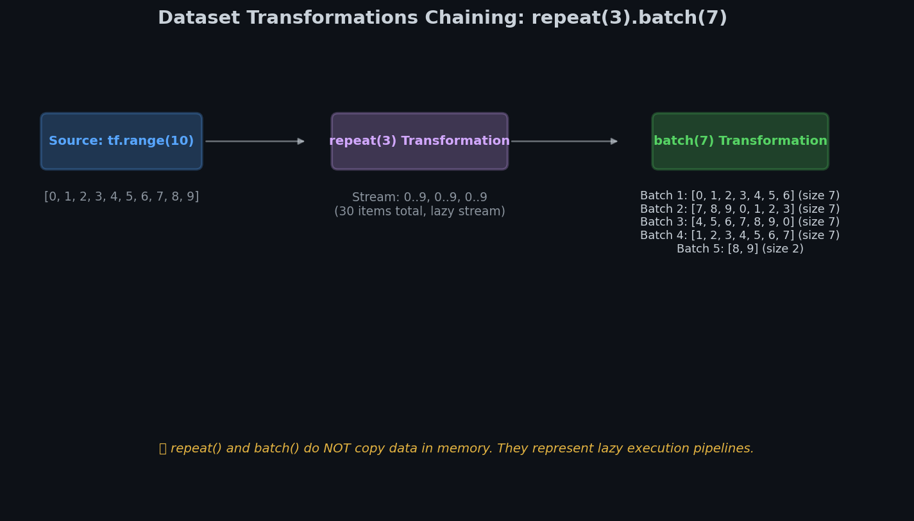
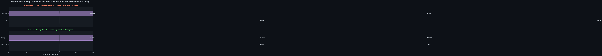
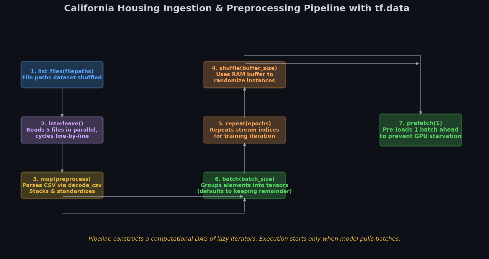

# 🔄 Module 1: The TF Data API — Building Fast, Production-Grade Input Pipelines
> **Ch. 13 — Hands-On ML with Scikit-Learn, Keras & TensorFlow (Aurélien Géron)**

---

## 📌 Table of Contents
1. [Start Here: The Big Picture](#big-picture)
2. [Why the Data API? The Bottleneck Problem](#bottleneck)
3. [Creating Datasets: All Entry Points](#creating)
4. [Essential Transformations](#transformations)
5. [The Shuffle Buffer: How It Works](#shuffle)
6. [Parallelism: Prefetching and Parallel Loading](#parallelism)
7. [Reading from Multiple CSV Files — The Full Pipeline](#csv-pipeline)
8. [Preprocessing Data Inside the Pipeline](#preprocessing)
9. [The Optimal Pipeline Design Pattern](#optimal-pattern)
10. [Common Beginner Mistakes](#mistakes)
11. [Interview Q&A](#interview)
12. [⚡ One-Page Flash Card](#revision)

---

## 🌍 Start Here: The Big Picture {#big-picture}

> **TL;DR:** The `tf.data.Dataset` API lets you build highly efficient data pipelines that load, shuffle, preprocess, and batch data in parallel — so your GPU is NEVER waiting for data. The key transformations are: `map()`, `batch()`, `shuffle()`, `repeat()`, `prefetch()`, and `interleave()`.

**The "Restaurant Kitchen" Analogy 🍳**

Your GPU is the dining table that needs food constantly. Bad data pipeline = one waiter who slowly prepares EACH dish only when the table is empty. The table starves between dishes.

Good `tf.data` pipeline = full kitchen brigade:
- One chef reading ingredients from cold storage (`from_tensor_slices`)
- Another chopping while first is cooking (`map` with `num_parallel_calls`)
- Kitchen prepares next 3 dishes while first is being eaten (`prefetch(2)`)
- Multiple dishes come from multiple kitchens simultaneously (`interleave`)

**Why this matters:**
- Without optimization: GPU utilization typically 30-50% (waiting for data)
- With optimized tf.data pipeline: GPU utilization 90-99%
- Result: Training 2x-5x faster on the same hardware!

---

## ⚠️ Why the Data API? The Bottleneck Problem {#bottleneck}

**Without tf.data (naive approach):**
```python
# BAD PATTERN: CPU prepares one batch, GPU sits idle, then CPU prepares next
for epoch in range(100):
    for X_batch, y_batch in zip(X_chunks, y_chunks):
        # CPU: load data, preprocess          ← GPU sits idle here
        X_proc = preprocess(X_batch)
        # GPU: train on batch                 ← CPU sits idle here
        model.train_on_batch(X_proc, y_batch)
```

Timeline: `[CPU work] [GPU work] [CPU work] [GPU work] ...` — alternating, wasteful!

**With tf.data and prefetch:**
```
[CPU load] [CPU preprocess + GPU training] [CPU preprocess + GPU training] ...
```

Timeline: `[CPU] [CPU+GPU] [CPU+GPU] [CPU+GPU]...` — overlapping!

---

## 🏗️ Creating Datasets: All Entry Points {#creating}

```python
import tensorflow as tf

# ── 1. From in-memory tensors ─────────────────────────────────────────────────
# Most common: your data is already loaded as numpy arrays
X = tf.constant([[1, 2], [3, 4], [5, 6]])  # shape: (3, 2)
y = tf.constant([0, 1, 0])                  # shape: (3,)

dataset = tf.data.Dataset.from_tensor_slices((X, y))
# Creates 3 items: ((1,2), 0), ((3,4), 1), ((5,6), 0)

# Iterate:
for X_item, y_item in dataset:
    print(X_item.numpy(), y_item.numpy())
# [1 2] 0
# [3 4] 1
# [5 6] 0

# ── 2. From a range ────────────────────────────────────────────────────────────
dataset = tf.data.Dataset.range(10)       # 0, 1, 2, ..., 9
dataset = tf.data.Dataset.range(0, 10, 2) # 0, 2, 4, 6, 8 (step=2)

# ── 3. From CSV files (one file) ──────────────────────────────────────────────
dataset = tf.data.TextLineDataset("housing.csv").skip(1)  # skip header

# ── 4. From TFRecord files (binary, most efficient format) ────────────────────
dataset = tf.data.TFRecordDataset("data.tfrecord")

# ── 5. From file patterns ─────────────────────────────────────────────────────
dataset = tf.data.Dataset.list_files("datasets/my_train_*.csv", seed=42)
```

---

## 🔧 Essential Transformations {#transformations}


> 📊 **Graph 01:** Chaining dataset transformations. Each transformation yields a new dataset, maintaining immutability.

Every transformation returns a NEW dataset (datasets are immutable):

```python
dataset = tf.data.Dataset.range(15)  # 0,1,2,...,14

# ── batch() — group items into batches ────────────────────────────────────────
batched = dataset.batch(batch_size=3)
# Items: [0,1,2], [3,4,5], [6,7,8], [9,10,11], [12,13,14]

batched = dataset.batch(3, drop_remainder=True)
# drop_remainder=True: drops last batch if incomplete (all batches same size)

# ── repeat() — repeat the dataset N times ────────────────────────────────────
repeated = dataset.repeat(3)     # 0-14, 0-14, 0-14 (45 items)
repeated = dataset.repeat()      # repeat FOREVER (use in training loops)

# ── map() — apply a transformation function to each item ─────────────────────
doubled = dataset.map(lambda x: x * 2)   # 0,2,4,6,...,28

# map with parallelism (crucial for performance!)
processed = dataset.map(
    preprocess_function,
    num_parallel_calls=tf.data.experimental.AUTOTUNE  # auto-tune parallelism
)

# ── filter() — keep only items matching condition ─────────────────────────────
evens = dataset.filter(lambda x: x % 2 == 0)  # 0,2,4,6,...,14

# ── take() — take first N items ──────────────────────────────────────────────
first_5 = dataset.take(5)   # 0,1,2,3,4

# ── skip() — skip first N items ──────────────────────────────────────────────
after_5 = dataset.skip(5)   # 5,6,7,...,14

# ── flat_map() — map, then flatten one level ──────────────────────────────────
# Useful for expanding each item into multiple items
nested = dataset.flat_map(lambda x: tf.data.Dataset.range(x))
# item 0 → [] (empty), item 1 → [0], item 2 → [0,1], item 3 → [0,1,2]
# result: 0, 0,1, 0,1,2, 0,1,2,3, ...
```

### Order of Operations Matters!

```python
# WRONG: batch BEFORE shuffle — shuffling within fixed batches, not globally!
dataset = dataset.batch(32).shuffle(1000)  # ❌

# CORRECT: shuffle BEFORE batch — truly random batches
dataset = dataset.shuffle(1000).batch(32)  # ✅

# COMPLETE recommended order:
dataset = (dataset
    .shuffle(buffer_size=10000)       # 1. shuffle
    .batch(batch_size=32)             # 2. batch
    .map(preprocess, num_parallel_calls=AUTOTUNE)  # 3. preprocess
    .prefetch(buffer_size=AUTOTUNE)   # 4. prefetch
)
```

---

## 🎰 The Shuffle Buffer: How It Works {#shuffle}

`dataset.shuffle(buffer_size=N)` does NOT shuffle the entire dataset in memory:

**Algorithm:**
1. Fill a buffer of size N with the FIRST N items
2. When asked for an item: pick one RANDOMLY from the buffer, output it
3. Immediately fill the empty spot with the NEXT item from the source
4. Continue until source is exhausted, then drain the buffer randomly

```
Buffer size = 5:

Source:  [A B C D E F G H I J]
                                     Buffer (shuffled internally)
Step 1: Fill buffer              →  [A B C D E]
Step 2: Output C (random)        →  [A B _ D E] + pull F → [A B F D E]
Step 3: Output A (random)        →  [_ B F D E] + pull G → [G B F D E]
...
```

**The critical rule:** Buffer must be at least as large as the dataset for PERFECT shuffling!

```python
# For 10,000 training examples:
dataset = dataset.shuffle(buffer_size=10000, seed=42)  # perfect shuffle
# For large datasets (100M+ items): use buffer = 10% of dataset + shuffle source files

# reshuffle_each_iteration (default True): generates new order each epoch
# Set False for reproducibility in debugging
dataset = dataset.shuffle(1000, reshuffle_each_iteration=True)  # default
```

**Practical guidance:**
- Small dataset (< 100K items): buffer = dataset size (perfect shuffle)
- Medium dataset: buffer = 10,000-50,000 (good enough)
- Huge dataset: pre-shuffle source files + buffer = 5,000-10,000

---

## ⚡ Parallelism: Prefetching and Parallel Loading {#parallelism}

### 1. prefetch() — Overlap CPU and GPU Work


> 📊 **Graph 03:** CPU-GPU overlapping with prefetching. By prefetching, the CPU prepares the next batch while the GPU trains on the current one, preventing starvation.

```python
dataset = dataset.prefetch(buffer_size=tf.data.experimental.AUTOTUNE)
```

`prefetch(N)` maintains N items "ready" in a buffer:
- While the GPU processes batch K, the CPU is SIMULTANEOUSLY preparing batch K+1
- GPU never waits for data!
- `AUTOTUNE`: TF dynamically determines optimal buffer size

```
WITHOUT prefetch:          [CPU K] [GPU K] [CPU K+1] [GPU K+1] ...
WITH prefetch(2):          [CPU K] [CPU K+1 + GPU K] [CPU K+2 + GPU K+1] ...
                                                      ↑ overlap!
```

### 2. num_parallel_calls — Parallelize map()

```python
dataset = dataset.map(
    preprocess_fn,
    num_parallel_calls=tf.data.experimental.AUTOTUNE
)
```

Without parallelism: map calls preprocess_fn sequentially (one at a time)
With AUTOTUNE: multiple CPU cores preprocess different items simultaneously

### 3. interleave() — Read Multiple Files in Parallel

```python
dataset = filepath_dataset.interleave(
    lambda filepath: tf.data.TextLineDataset(filepath).skip(1),
    cycle_length=5,           # 5 files read simultaneously
    num_parallel_calls=tf.data.experimental.AUTOTUNE
)
```

Without interleave: reads file 1 completely, then file 2, then file 3...
With interleave(cycle_length=5): reads 1 line from file 1, 1 line from file 2, ...file 5, then repeats

---

## 📁 Reading from Multiple CSV Files — The Full Pipeline {#csv-pipeline}


> 📊 **Graph 02:** Data Ingestion Pipeline. Reading, interleaving, parsing, and batching data from multiple files simultaneously.

**Scenario:** Housing price prediction dataset split across 20 CSV files.

```python
import tensorflow as tf
import numpy as np

# ── Step 1: List files ────────────────────────────────────────────────────────
train_filepaths = tf.data.Dataset.list_files("data/train_*.csv", seed=42)

# ── Step 2: Read and interleave lines from multiple files ─────────────────────
n_readers = 5
dataset = train_filepaths.interleave(
    lambda fp: tf.data.TextLineDataset(fp).skip(1),  # skip CSV header
    cycle_length=n_readers
)

# ── Step 3: Parse CSV lines ───────────────────────────────────────────────────
n_inputs = 8  # 8 features in housing dataset

@tf.function  # compile for speed!
def preprocess(line):
    # decode_csv: parses comma-separated string into tensors
    defs = [0.] * n_inputs + [tf.constant([], dtype=tf.float32)]  # 9 columns
    fields = tf.io.decode_csv(line, record_defaults=defs)
    x = tf.stack(fields[:-1])  # features: shape (8,)
    y = tf.stack(fields[-1:])  # target: shape (1,)
    return (x - X_mean) / X_std, y  # normalize

# ── Step 4: Build the full pipeline ──────────────────────────────────────────
def csv_dataset(filepaths, repeat=1, n_readers=5,
                n_parse_threads=5, shuffle_buffer_size=10000):
    dataset = tf.data.Dataset.list_files(filepaths, seed=42)
    dataset = dataset.repeat(repeat)
    dataset = dataset.interleave(
        lambda fp: tf.data.TextLineDataset(fp).skip(1),
        cycle_length=n_readers,
        num_parallel_calls=n_readers
    )
    dataset = dataset.shuffle(shuffle_buffer_size)
    dataset = dataset.map(preprocess, num_parallel_calls=n_parse_threads)
    dataset = dataset.batch(32)
    dataset = dataset.prefetch(1)
    return dataset

train_set = csv_dataset(train_filepaths, repeat=None)  # repeat forever for training
valid_set = csv_dataset(valid_filepaths, repeat=1)      # no repeat for validation

model.fit(train_set, steps_per_epoch=len(X_train) // 32,
          epochs=10, validation_data=valid_set)
```

---

## 🔄 Preprocessing Data Inside the Pipeline {#preprocessing}

```python
# Compute statistics BEFORE building pipeline
X_mean = X_train.mean(axis=0)
X_std = X_train.std(axis=0)

@tf.function
def preprocess(line):
    """Parse CSV line → (features, target)"""
    record_defaults = [0.] * 9   # 9 default values (all float)
    fields = tf.io.decode_csv(line, record_defaults=record_defaults)
    
    x = tf.stack(fields[:-1])    # first 8 = features
    y = tf.stack(fields[-1:])    # last 1 = target (median house value)
    
    # Standardize features
    x_scaled = (x - X_mean) / X_std
    
    return x_scaled, y

# Alternative: keras Normalization layer (learns mean/std during adapt())
normalizer = tf.keras.layers.experimental.preprocessing.Normalization()
normalizer.adapt(X_train)  # compute mean and std automatically
```

---

## 🏆 The Optimal Pipeline Design Pattern {#optimal-pattern}

The book-recommended "golden" pipeline order for maximum performance:

```python
def optimal_pipeline(file_pattern, batch_size=32, shuffle_buf=10000):
    """
    AUTOTUNE lets TF dynamically choose optimal parallelism at runtime.
    This pattern maximizes GPU utilization.
    """
    AUTOTUNE = tf.data.experimental.AUTOTUNE
    
    return (
        tf.data.Dataset                           
        .list_files(file_pattern, shuffle=True)   # 1. list & shuffle files
        .repeat()                                  # 2. repeat forever
        .interleave(                               # 3. read multiple files in parallel
            tf.data.TFRecordDataset,
            cycle_length=AUTOTUNE,
            num_parallel_calls=AUTOTUNE
        )
        .map(parse_example, num_parallel_calls=AUTOTUNE)  # 4. parse in parallel
        .shuffle(shuffle_buf)                       # 5. shuffle instances
        .batch(batch_size, drop_remainder=True)    # 6. batch
        .prefetch(AUTOTUNE)                        # 7. prefetch (MUST be last!)
    )
```

**The 7-step golden order:**
1. `.list_files()` — list all source files
2. `.repeat()` — loop over data indefinitely (for training)
3. `.interleave()` — read multiple files simultaneously
4. `.map()` with `AUTOTUNE` — parse/preprocess in parallel
5. `.shuffle()` — randomize order
6. `.batch()` — group into batches
7. `.prefetch()` — ALWAYS the LAST transformation — overlaps CPU/GPU

---

## ❌ Common Beginner Mistakes {#mistakes}

**1. Placing `.prefetch()` before `.batch()`** ❌
> Reality: `prefetch` should be the LAST operation. It pre-fetches complete batches ready for the GPU. If placed before batch, it prefetches individual items, not batches, and you lose the GPU overlap benefit.

**2. Using `shuffle` after `batch`** ❌
> Reality: `batch` then `shuffle` shuffles the ORDER of batches, not the items within them. You want items mixed across batches. Always use `shuffle` BEFORE `batch`.

**3. Not using `num_parallel_calls=AUTOTUNE`** ❌
> Reality: By default, `.map()` and `.interleave()` are single-threaded. On a 8-core machine, you're using only 1/8th of your CPU for data preprocessing. Always specify `num_parallel_calls=tf.data.experimental.AUTOTUNE`.

**4. Calling `.numpy()` inside `map()` function** ❌
> Reality: TF Data API functions passed to `.map()` must be TF-native. Calling `.numpy()` forces CPU eager execution, breaking graph optimization and `@tf.function` compilation.

**5. Setting buffer_size too small in shuffle** ❌
> Reality: `shuffle(buffer_size=10)` on a 10,000-item dataset hardly shuffles at all — you're only shuffling 10 items at a time. Use at least 10% of dataset size, or the full dataset size for small datasets.

**6. Forgetting `.repeat()` for training** ❌
> Reality: Without `.repeat()`, the dataset exhausts after one epoch and `model.fit()` stops. Either use `.repeat()` in the pipeline, OR don't use `steps_per_epoch` (Keras will handle epochs automatically from the dataset size).

---

## 🎤 Interview Q&A {#interview}

**Q1: What is the purpose of `prefetch()` in a tf.data pipeline and why must it be last?**
> **A:** `prefetch(N)` asynchronously prepares N batches in the background while the GPU processes the current batch. This eliminates the CPU-GPU alternation bottleneck: the GPU never sits idle waiting for data. It MUST be last because you want to prefetch COMPLETE, ready-to-train batches. If placed before `.map()`, it prefetches raw data that still needs preprocessing — the GPU would still need to wait for preprocessing before training.

**Q2: Explain how the shuffle buffer works. Why does buffer size matter?**
> **A:** The shuffle buffer is NOT full in-memory shuffle. It fills a buffer of N items, then at each step: picks one randomly from the buffer, outputs it, and pulls in the next item from the source. If N is small relative to the dataset, items end up roughly in their original order because the buffer doesn't span far into the dataset. For perfect shuffling, buffer must equal dataset size. For practical purposes, 10% of dataset size gives good-enough randomization.

**Q3: What's the difference between `.map()` and `.flat_map()`?**
> **A:** `.map(f)` applies f to each item and produces one output per input item (1-to-1 mapping). `.flat_map(f)` applies f and expects each call to return a Dataset — the resulting datasets are then FLATTENED (concatenated) into a single dataset. Use `.flat_map()` when you want to expand each item into multiple items (e.g., one file path → many text lines via `TextLineDataset`).

**Q4: Why should you use `tf.data.experimental.AUTOTUNE` instead of a fixed number for `num_parallel_calls`?**
> **A:** The optimal number of parallel calls depends on the hardware (number of CPU cores), the complexity of the preprocessing function, and the balance between IO and compute. Hardcoding `num_parallel_calls=4` works on your 4-core machine but is suboptimal on a 32-core server or a single-core mobile device. `AUTOTUNE` lets TensorFlow profile the pipeline and dynamically adjust the parallelism to maximize throughput on whatever hardware it's running on.

---

## ⚡ One-Page Flash Card {#revision}

```
╔══════════════════════════════════════════════════════════════════════╗
║         MODULE 1 — TF DATA API FLASH CARD                             ║
╠══════════════════════════════════════════════════════════════════════╣
║                                                                        ║
║  GOLDEN PIPELINE ORDER:                                                ║
║  list_files → repeat → interleave → map (AUTOTUNE) →                 ║
║  shuffle → batch → prefetch (AUTOTUNE)                                ║
║  ← prefetch MUST be LAST! ─────────────────────────────────────────  ║
║                                                                        ║
║  KEY TRANSFORMATIONS:                                                  ║
║  .map(fn, num_parallel_calls=AUTOTUNE) → apply fn in parallel        ║
║  .shuffle(buffer_size=10000) → shuffle (bigger buffer = better)      ║
║  .batch(32, drop_remainder=True) → group into batches                ║
║  .prefetch(AUTOTUNE) → prepare next batch while GPU trains           ║
║  .interleave(fn, cycle_length=N, num_parallel_calls=AUTOTUNE)        ║
║    → read N files simultaneously, interleave lines                   ║
║  .repeat() → loop forever  .repeat(N) → loop N times                ║
║  .filter(pred) → keep items where pred is True                       ║
║  .take(N) → keep only first N items                                  ║
║                                                                        ║
║  SHUFFLE vs BATCH ORDER:                                               ║
║  ✅ shuffle THEN batch (items truly mixed across batches)             ║
║  ❌ batch THEN shuffle (only batch order shuffled, not items)         ║
║                                                                        ║
║  SHUFFLE BUFFER:                                                       ║
║  Small dataset: buffer = full dataset size (perfect shuffle)          ║
║  Large dataset: buffer = 10% of dataset size (practical)             ║
║                                                                        ║
╚══════════════════════════════════════════════════════════════════════╝
```

---

**🔗 Next Module →** [02 — The TFRecord Format and Protobufs](02_The_TFRecord_Format_and_Protobufs.md)
