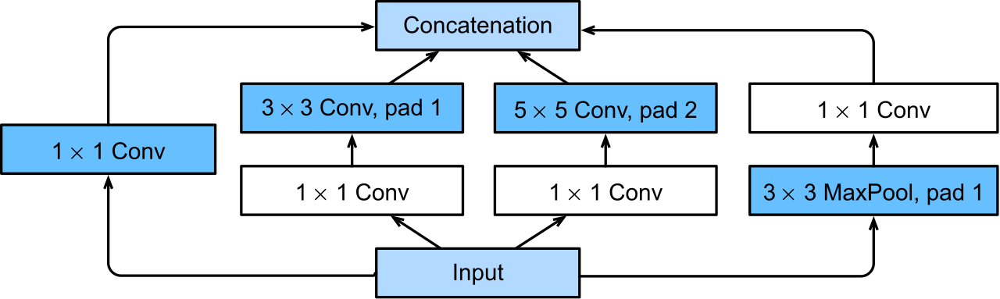
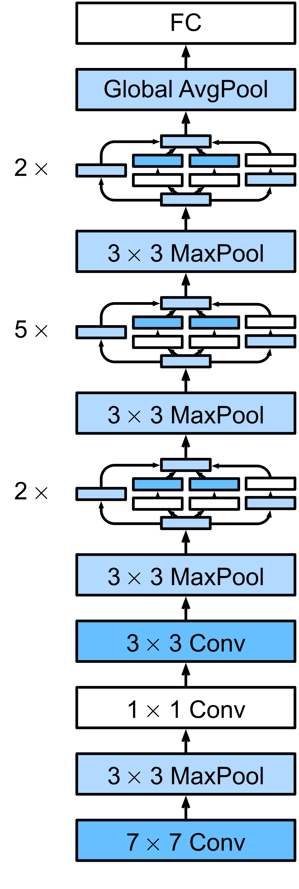
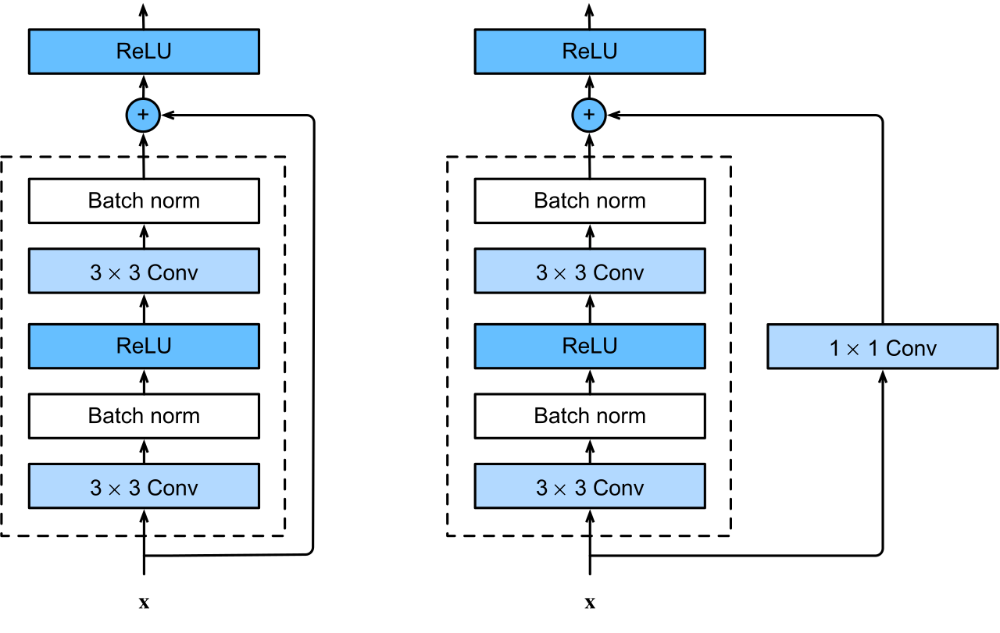
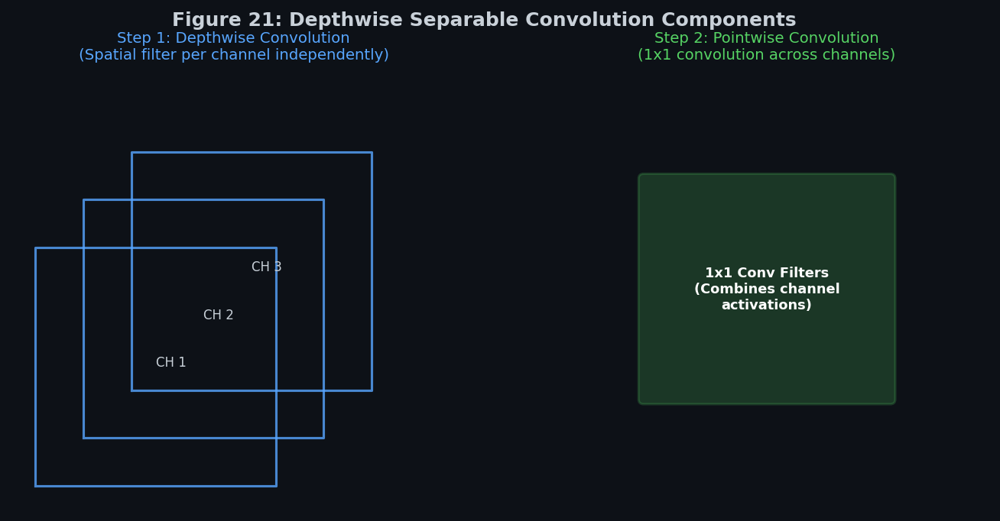

# 🧠 Module 3: Advanced CNN Architectures

---

## 📌 Table of Contents
1. [GoogLeNet](#googlenet)
2. [ResNet](#resnet)
3. [Xception](#xception)
4. [SENet](#senet)

---

## 🔬 1. GoogLeNet {#googlenet}

### Concept Explanation
Christian Szegedy et al. developed **GoogLeNet** (Inception v1) in 2014, focusing on parameter efficiency. While standard networks stack layers sequentially, GoogLeNet introduces **Inception Modules** that process inputs in parallel:
*   **Parallel Paths**: An input feature map passes through four parallel paths:
    1.  A $1 \times 1$ convolution.
    2.  A $1 \times 1$ convolution followed by a $3 \times 3$ convolution.
    3.  A $1 \times 1$ convolution followed by a $5 \times 5$ convolution.
    4.  A $3 \times 3$ Max Pooling followed by a $1 \times 1$ convolution.
*   **Filter Concatenation**: The outputs of these parallel paths are concatenated along the channel dimension.
*   **The 1x1 Convolution Bottleneck**: The $1 \times 1$ convolutions act as bottleneck layers, reducing channel depth before expensive $3 \times 3$ and $5 \times 5$ convolutions. Without these, stacking parallel layers would cause a computational explosion.

### Real-World Example 🔍
Imagine a panel of four specialized experts analyzing a document. Expert A looks at individual words (1x1 conv), Expert B looks at short phrases (3x3 conv), Expert C looks at complete sentences (5x5 conv), and Expert D summaries key sections (pooling). They all write their notes, stack their reports together (concatenation), and pass it to the next team.

### Key Takeaways
*   **Parallelism**: Processes features at multiple scales ($1 \times 1, 3 \times 3, 5 \times 5$) simultaneously.
*   **1x1 Convolutions**: Act as channel dimensionality reducers, keeping computations small.
*   **Parameter Saving**: Uses only 7 million parameters, compared to VGG-16's 138 million, while achieving better accuracy.

### Common Interview Questions
*   **Q: Why are 1x1 convolutions called "bottleneck layers" in the Inception module?**
    *   *Answer:* A $1 \times 1$ convolution acts as a projection layer that changes the channel depth without changing spatial dimensions. By projecting a large channel size (e.g., 256) to a smaller size (e.g., 64) before performing spatial convolutions (like $3 \times 3$ or $5 \times 5$), it dramatically reduces the number of operations and parameter counts.

---

[FIGURE 15: GoogLeNet Inception Module]
*   **Caption**: Standard Inception block with parallel convolution paths and 1x1 bottleneck layers.
*   **Purpose**: Details GoogLeNet's parallel architecture.
*   **Importance**: Shows how parallel convolutional filters reduce calculations.
*   **Placement**: Immediately after the Inception Parallel Paths explanation.
*   **Image Type**: Architecture Diagram
*   **Suggested Content**: Flowchart showing: Input -> split to 1x1, 1x1->3x3, 1x1->5x5, 3x3 pool -> 1x1 -> Concat output.

---

[FIGURE 16: Multi-Scale Feature Extraction]
*   **Caption**: Extracting features at multiple spatial scales simultaneously.
*   **Purpose**: Illustrates multi-scale extraction parallelism.
*   **Importance**: Foundational design concept of GoogLeNet.
*   **Placement**: Right after the parallel paths explanation.
*   **Image Type**: Illustration
*   **Suggested Content**: Parallel paths using different kernel sizes (1x1, 3x3, 5x5) highlighting different spatial visual receptive zones.

---

## 🏗️ 2. ResNet {#resnet}

### Concept Explanation
Kaiming He et al. introduced **ResNet** (Residual Networks) in 2015, solving the **vanishing/exploding gradient problem** in extremely deep networks (100+ layers).
*   **The Degradation Problem**: In deep networks, accuracy saturates and then degrades. This is not due to overfitting, but because gradients vanish as they are backpropagated through dozens of layers, preventing early layers from updating.
*   **Skip Connections (Shortcuts)**: ResNet introduces a bypass connection that feeds the input $x$ directly to the output of a block:
    $$Output = F(x) + x$$
    Where $F(x)$ represents the convolutional layers of the block.
*   **Residual Learning**: Instead of forcing the convolutional layers to learn a complex mapping $H(x)$, they only need to learn the residual mapping:
    $$F(x) = H(x) - x$$
    If a layer is redundant, the network can easily set its weights to zero, causing the block to act as an identity mapping ($Output = x$).
*   **Gradient Highway**: During backpropagation, gradients flow directly through the skip connection without being multiplied by layer weights, establishing a gradient highway straight to the early layers.

### Real-World Example 🔍
Imagine playing a game of "telephone" where a message is passed down a line of 100 people. By the time it reaches the end, the message is completely lost (vanishing gradient). ResNet solves this by giving every few people a microphone to speak directly to the person at the end of the line (skip connection), bypassing the intermediate whisperers.

### Key Takeaways
*   **Identity Mapping**: Bypasses layers when they do not improve performance.
*   **Gradient Flow**: Eliminates vanishing gradients during training by creating shortcut paths.
*   **Residual Blocks**: Can stack hundreds of layers (e.g., ResNet-152) while keeping training stable.

### Common Interview Questions
*   **Q: Mathematically, how do skip connections prevent vanishing gradients during backpropagation?**
    *   *Answer:* The output of a residual block is $y = F(x) + x$. By taking the derivative with respect to the input $x$, we get:
        $$\frac{\partial y}{\partial x} = \frac{\partial F(x)}{\partial x} + 1$$
        Even if the gradient of the convolution layers $\frac{\partial F(x)}{\partial x}$ vanishes to zero, the additive term $+1$ guarantees that a gradient of at least $1$ is always passed back, keeping the gradient flow alive all the way to the first layer.

---

[FIGURE 19: ResNet Basic Block]
*   **Caption**: Residual unit skip connection bypassing convolutional layers.
*   **Purpose**: Demonstrates the shortcut path $F(x) + x$.
*   **Importance**: Foundational building block of deep networks.
*   **Placement**: Immediately after the skip connection concept explanation.
*   **Image Type**: Architecture Diagram
*   **Suggested Content**: Diagram showing input convolving through two layers with a curved bypass path adding the input directly to the block output.

---

[FIGURE 20: Gradient Flow Visualization]
*   **Caption**: Backpropagation gradient flow bypassing weight layers unhindered.
*   **Purpose**: Shows how skip connections maintain gradient flow.
*   **Importance**: Visual explanation of how ResNet solves vanishing gradients.
*   **Placement**: After the mathematical gradient proof.
*   **Image Type**: Flowchart
*   **Suggested Content**: Backward gradient arrows flowing through the bypass shortcut alongside vanished gradients in the convolutional layers.

---

## 🧩 3. Xception {#xception}

### Concept Explanation
François Chollet introduced **Xception** (Extreme Inception) in 2016, modifying GoogLeNet by replacing standard convolutions with **Depthwise Separable Convolutions**:
1.  **Depthwise Convolution**: Applies a single spatial filter per channel independently (extracts spatial patterns).
2.  **Pointwise Convolution**: Applies a $1 \times 1$ convolution across all channels (combines channel patterns).

This decouples the learning of spatial patterns from channel cross-correlations, significantly reducing computation and parameters:
$$\text{Computational Cost Ratio} \approx \frac{1}{N} + \frac{1}{K^2}$$
Where $N$ is the channel depth and $K$ is the kernel size. For a $3 \times 3$ kernel, this cuts computation by approximately **9x** with almost no loss in accuracy.

### Real-World Example 🔍
Imagine color-coding a map. 
*   **Standard approach**: You buy a multi-colored marker and draw lines and fill in regions simultaneously.
*   **Depthwise Separable approach**: First, you outline all regions using a black pen (spatial depthwise). Second, you pick colored highlighters to shade each region (pointwise 1x1). Separating these steps is much faster and cleaner.

### Key Takeaways
*   **Decoupled Learning**: Splits spatial filtering and channel correlation.
*   **Extreme Efficiency**: Reduces computations by a factor of 9x for $3 \times 3$ kernels.
*   **Xception Flow**: Uses Entry, Middle, and Exit flows constructed entirely of depthwise separable blocks.

### Common Interview Questions
*   **Q: How does the computational cost of a Depthwise Separable Convolution compare to a Standard Convolution?**
    *   *Answer:* For input shape $(H, W, D)$ and $N$ filters of size $K \times K$:
        *   Standard Conv cost: $H \times W \times D \times N \times K \times K$
        *   Depthwise Separable Conv cost: $(H \times W \times D \times K \times K) + (H \times W \times D \times N)$
        *   The ratio of savings is: $\frac{D \cdot K^2 + D \cdot N}{D \cdot N \cdot K^2} = \frac{1}{N} + \frac{1}{K^2}$. For large $N$ and $K=3$, this is approximately $1/9 \approx 11\%$ of the standard cost.

---

[FIGURE 21: Depthwise Separable Convolution]
*   **Caption**: Splitting spatial filtering per channel from channel combinations (1x1 conv).
*   **Purpose**: Illustrates depthwise separable convolutions.
*   **Importance**: Key mechanism for high-efficiency CNNs (MobileNet, Xception).
*   **Placement**: Immediately after the depthwise separable concept explanation.
*   **Image Type**: Comparison Chart
*   **Suggested Content**: Side-by-side steps showing depthwise spatial filtering on channels followed by pointwise 1x1 mix filters.

---

[FIGURE 22: Xception Architecture]
*   **Caption**: Flow blocks of the Xception model (Entry Flow, Middle Flow, Exit Flow).
*   **Purpose**: Outlines global block flow.
*   **Importance**: Shows modular block stacking conventions.
*   **Placement**: At the end of Xception section.
*   **Image Type**: Architecture Diagram
*   **Suggested Content**: Entry flow block feeding into the repeated Middle flow block feeding into the Exit flow block.

---

## 🎨 4. SENet {#senet}

### Concept Explanation
Jie Hu et al. introduced **SENet** (Squeeze-and-Excitation Networks) in 2017, winning the final ImageNet competition. It introduces a channel-attention mechanism that dynamically reweights feature map channels:
1.  **Squeeze**: Performs Global Average Pooling to condense each spatial feature map of shape $H \times W \times C$ to a $1 \times 1 \times C$ channel descriptor vector.
2.  **Excitation**: Passes the descriptor vector through two fully connected (Dense) layers with a bottleneck ratio to learn non-linear channel dependencies, outputting weight coefficients between 0 and 1 via a Sigmoid activation.
3.  **Scale**: Multiplies each original feature map channel by its learned weight coefficient, accentuating important features and suppressing irrelevant ones.

### Real-World Example 🔍
Imagine listening to a symphony. All instruments (channels) are playing simultaneously. A Squeeze-and-Excitation block acts like a sound engineer: convolving the audio to detect the volume of each instrument (squeeze), deciding which instrument should lead the melody (excitation), and sliding the audio volume channels to highlight the violin and quiet the drums (scale).

### Key Takeaways
*   **Channel Attention**: Dynamically recalibrates feature maps per channel.
*   **Plug-and-Play**: Can be added to any CNN block (ResNet, Inception) with negligible computational cost.
*   **Dynamic Weighting**: Helps the model focus on context-relevant features.

### Common Interview Questions
*   **Q: What are the three steps of a Squeeze-and-Excitation block?**
    *   *Answer:* 
        1. **Squeeze**: Global Average Pooling collapses spatial shapes to a $1 \times 1 \times C$ channel vector.
        2. **Excitation**: Fully connected layers output a $1 \times 1 \times C$ scale vector of coefficients between 0 and 1.
        3. **Scale**: Element-wise multiplication scales the original feature maps by the excitation scale vector.

---

[FIGURE 23: Squeeze and Excitation Block]
*   **Caption**: Squeeze (GAP) followed by Excitation (FC layers) and Scaling steps.
*   **Purpose**: Details channel recalibration.
*   **Importance**: Demonstrates channel-wise self-attention.
*   **Placement**: Immediately after the squeeze-excitation steps explanation.
*   **Image Type**: Architecture Diagram
*   **Suggested Content**: Diagram showing Feature Map -> Squeeze -> Excitation weights -> scaling output.

---

[FIGURE 24: Channel Attention Mechanism]
*   **Caption**: Scaling dynamic weight coefficients onto feature maps.
*   **Purpose**: Demonstrates feature map reweighting.
*   **Importance**: Visual representation of channel suppression and enhancement.
*   **Placement**: At the end of Module 3.
*   **Image Type**: Illustration
*   **Suggested Content**: Stack of feature maps scaled to thicker (emphasized) or thinner (suppressed) maps based on attention weights.

---

**🔗 Previous Module →** [02_Pooling_Layers_and_Classic_CNN_Architectures.md](02_Pooling_Layers_and_Classic_CNN_Architectures.md)  
**🔗 Next Module →** [04_Pretrained_Models_and_Transfer_Learning.md](04_Pretrained_Models_and_Transfer_Learning.md)
