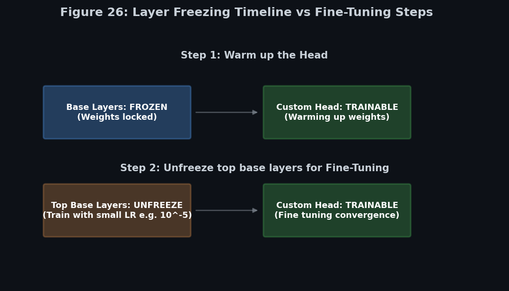

# 🏗️ Module 4: Pretrained CNN Models & Transfer Learning for Computer Vision
> **Ch. 14 — Hands-On ML with Scikit-Learn, Keras & TensorFlow (Aurélien Géron)**

---

## 📌 Table of Contents
1. [Start Here: The Big Picture](#big-picture)
2. [VGGNet — Simplicity at Depth (2014)](#vggnet)
3. [ResNet — The Residual Revolution (2015)](#resnet)
4. [Residual Units: The Math](#residual-math)
5. [Xception — Depthwise Separable Convolutions (2016)](#xception)
6. [SENet — Squeeze-and-Excitation Networks (2017)](#senet)
7. [Using Pretrained Models in Keras](#keras-pretrained)
8. [Transfer Learning for CNNs — Step-by-Step Strategy](#transfer-strategy)
9. [Feature Extraction vs. Fine-Tuning vs. Full Training](#comparison)
10. [When Transfer Learning Fails](#when-fails)
11. [Common Beginner Mistakes](#mistakes)
12. [Interview Q&A](#interview)
13. [⚡ One-Page Flash Card](#revision)

---

## 🌍 Start Here: The Big Picture {#big-picture}

> **TL;DR:** ImageNet competition winners built progressively deeper and smarter networks. Key breakthroughs: ResNet (skip connections solve deep training), Xception (separable convolutions for efficiency), SENet (channel attention). In practice, you never train these from scratch — you download pretrained weights and fine-tune on your data.

**The ImageNet Competition Timeline:**

| Year | Winner | Architecture | Top-5 Error | Key Innovation |
|------|--------|-------------|-------------|---------------|
| 2012 | AlexNet | 8 layers | 15.3% | Deep CNNs + ReLU + Dropout |
| 2014 | GoogLeNet | 22 layers | 6.7% | Inception modules |
| 2014 | VGGNet | 16-19 layers | 7.3% | Simple 3×3 conv stacking |
| 2015 | ResNet | 152 layers | **3.6%** | Skip connections |
| 2017 | SENet | 100+ layers | **2.25%** | Channel attention |

Human top-5 error on ImageNet ≈ 5%. ResNet exceeded human performance!

---

## 🏢 VGGNet — Simplicity at Depth (Simonyan & Zisserman, 2014) {#vggnet}

**The Philosophy:** "What if we used ONLY 3×3 convolutions, stacked very deep?"

**Architecture Pattern:**
```
Input (224×224×3)
→ Conv3×3 × 2 → MaxPool  (downsample ½)
→ Conv3×3 × 2 → MaxPool  (downsample ½)
→ Conv3×3 × 3 → MaxPool  (downsample ½)
→ Conv3×3 × 3 → MaxPool  (downsample ½)
→ Conv3×3 × 3 → MaxPool  (downsample ½)
→ Flatten → Dense(4096) → Dense(4096) → Dense(1000) + Softmax
```

**Why 3×3 is so powerful:**
- Two 3×3 conv layers have the same receptive field as one 5×5
- Three 3×3 layers = one 7×7 layer's receptive field
- But 3×3 stacked layers have **more non-linearity** (one activation per layer)
- And **fewer parameters**: $3 \times (3 \times 3 \times C^2) = 27C^2$ vs. $7 \times 7 \times C^2 = 49C^2$

**Variants:**
- **VGG-16**: 13 conv layers + 3 dense layers = 16 weight layers, ~138M parameters
- **VGG-19**: 16 conv layers + 3 dense layers = 19 weight layers, ~143M parameters

**Critical observation:** Most parameters (73%) are in the dense layers! The huge Dense(4096) → Dense(4096) block has 16M parameters. This is why Global Average Pooling (in later networks) was such an improvement.

```python
# VGG16 in Keras (pretrained on ImageNet)
vgg = keras.applications.VGG16(weights="imagenet")
vgg.summary()  # 138,357,544 parameters!
```

---

## 🔗 ResNet — The Residual Revolution (He et al., 2015) {#resnet}

**The Problem:** Networks deeper than ~20 layers actually got WORSE despite having more capacity. Training a 56-layer network gave worse training accuracy than a 20-layer network — this wasn't overfitting, it was a training problem (vanishing/exploding gradients in very deep nets).

**The Brilliant Solution: Skip Connections**

Instead of learning $h(\mathbf{x})$ directly, each residual unit learns the RESIDUAL $f(\mathbf{x}) = h(\mathbf{x}) - \mathbf{x}$.

```
Standard Layer:      ResNet Residual Unit:
                     
x → [Layer] → h(x)   x → [Layer] → f(x)
                           ↑         ↓
                           └─────→ + → h(x) = f(x) + x
                              (skip connection)
```

**Why this works:**
1. **Initialization advantage:** At initialization, weights ≈ 0, so f(x) ≈ 0 → output = x (identity). Identity is a great starting point — the network starts as a pass-through, not garbage.
2. **Gradient highway:** Gradients can flow directly through skip connections (the derivative of the addition is 1), bypassing the deep layers entirely. This means even 152-layer networks don't suffer vanishing gradients.
3. **Ensemble-like behavior:** Skip connections effectively create shorter paths through the network. A 152-layer ResNet is really an ensemble of many shorter "paths" of varying depths.

---

## 📐 Residual Units: The Math {#residual-math}

### Basic Residual Unit (ResNet-34)

Two 3×3 convolutional layers with skip connection:

$$\mathbf{h} = \text{ReLU}(\mathbf{F}(\mathbf{x}) + \mathbf{x})$$

Where $\mathbf{F}(\mathbf{x}) = \text{BN} \to \text{ReLU} \to \text{Conv3×3} \to \text{BN} \to \text{ReLU} \to \text{Conv3×3}$

### Bottleneck Residual Unit (ResNet-50/101/152)

Three layers: 1×1 → 3×3 → 1×1 (reduces computational cost):

| Conv | Kernel | Filters | Purpose |
|------|--------|---------|---------|
| 1×1 | 1×1×C | C/4 | Compress: reduce channels by 4× (bottleneck) |
| 3×3 | 3×3×C/4 | C/4 | Learn spatial features at reduced cost |
| 1×1 | 1×1×C/4 | C | Expand: restore full channel count |

**Parameter comparison** (256 channels in, 256 out):
- Regular unit: 2 × (3×3×256×256) = 1,179,648 params
- Bottleneck unit: (1×1×256×64) + (3×3×64×64) + (1×1×64×256) = 69,632 params (17× fewer!)

### Handling Dimension Mismatch in Skip Connections

When the spatial dimensions or channel count changes (e.g., at stride-2 downsampling), the skip connection can't be a simple addition. Solution: **1×1 convolution with matching stride**:

$$\mathbf{h} = \text{ReLU}(\mathbf{F}(\mathbf{x}) + \mathbf{W}_s \mathbf{x})$$

Where $\mathbf{W}_s$ is a 1×1 conv with stride 2 that matches the output dimensions.

```python
# ResNet-50 in Keras
resnet = keras.applications.ResNet50(weights="imagenet", include_top=False,
                                      input_shape=[224, 224, 3])

# ResNet family:
# resnet50  = 50 layers, 25M params
# resnet101 = 101 layers, 44M params
# resnet152 = 152 layers, 60M params
```

---

## ⚡ Xception — Depthwise Separable Convolutions (Chollet, 2016) {#xception}

**The Insight:** Standard convolutions try to learn spatial patterns AND cross-channel patterns SIMULTANEOUSLY. What if we separate them?

### Standard Convolution vs. Depthwise Separable

**Standard Conv** (say, 32 filters, 3×3 kernel, 64 input channels):
- One filter: 3 × 3 × 64 = 576 operations per output pixel
- 32 filters: 32 × 576 = 18,432 params + learns spatial AND cross-channel

**Depthwise Separable Conv:**
- **Step 1 — Depthwise Conv:** Apply ONE 3×3 filter PER INPUT channel (64 separate 3×3 filters, one per channel)
  - Params: 64 × 3 × 3 = 576 — learns SPATIAL patterns only, independently per channel
- **Step 2 — Pointwise Conv:** Apply 32 1×1 filters across all 64 channels  
  - Params: 32 × 1 × 1 × 64 = 2,048 — learns CROSS-CHANNEL patterns only

**Total depthwise separable params:** 576 + 2,048 = 2,624 vs 18,432 standard → **7x fewer parameters!**

$$\text{Reduction factor} \approx \frac{1}{N_\text{filters}} + \frac{1}{k^2}$$

For k=3, N=32: factor = 1/32 + 1/9 ≈ 0.14 → **86% reduction** in computation!

```python
# Separable convolution in Keras
layer = keras.layers.SeparableConv2D(filters=32, kernel_size=3, padding="same",
                                      activation="relu")

# Full Xception model
xception = keras.applications.Xception(weights="imagenet", include_top=False,
                                        input_shape=[299, 299, 3])
```

---

## 🎯 SENet — Squeeze-and-Excitation Networks (Hu et al., 2018) {#senet}

**The Insight:** Not all feature channels are equally important. Let the network LEARN to amplify important channels and suppress unimportant ones.

**The Squeeze-and-Excitation (SE) Block:**

1. **Squeeze:** Global Average Pool each channel → 1 value per channel (compress spatial info)
2. **Excitation:** Pass through 2 small Dense layers: Dense(C/r) → ReLU → Dense(C) → Sigmoid
   - r = reduction ratio (typically 16)
   - Output: one weight per channel, between 0 and 1
3. **Scale:** Multiply each channel by its learned weight

```
Input feature maps (H×W×C)
        ↓ Squeeze (Global Avg Pool)
        (1×1×C) — one value per channel
        ↓ Excitation (Dense → ReLU → Dense → Sigmoid)
        (1×1×C) — one attention weight per channel (0 to 1)
        ↓ Scale (multiply original feature maps by attention weights)
        Recalibrated feature maps (H×W×C)
```

**Why it works:** Channels detecting "wheels" get amplified when processing cars. Channels detecting "fur" get suppressed. The network learns to attend to the most relevant features for each input.

---

## 💻 Using Pretrained Models in Keras {#keras-pretrained}

Keras includes all major pretrained CNNs in `keras.applications`:

```python
from tensorflow import keras

# Available pretrained models (all pretrained on ImageNet)
# VGG: keras.applications.VGG16, VGG19
# Inception: keras.applications.InceptionV3, InceptionResNetV2
# ResNet: keras.applications.ResNet50, ResNet101, ResNet152
# Xception: keras.applications.Xception
# MobileNet: keras.applications.MobileNetV2 (lightweight)
# EfficientNet: keras.applications.EfficientNetB0 through B7

# Key parameters:
model = keras.applications.ResNet50(
    weights="imagenet",   # use pretrained ImageNet weights
    include_top=True,     # include the final classification layers
    input_shape=[224, 224, 3]  # required input shape
)

# For transfer learning — remove the top:
base_model = keras.applications.ResNet50(
    weights="imagenet",
    include_top=False,    # ← removes Dense classification layers
    input_shape=[224, 224, 3]
)
```

### Quick Prediction with Pretrained Model

```python
import numpy as np
from tensorflow.keras.applications.resnet50 import preprocess_input, decode_predictions
from tensorflow.keras.preprocessing.image import load_img, img_to_array

# Load and preprocess
img = load_img("cat.jpg", target_size=(224, 224))
X = img_to_array(img)[np.newaxis]          # shape: (1, 224, 224, 3)
X = preprocess_input(X)                    # model-specific normalization!

# Predict
preds = model.predict(X)
decode_predictions(preds, top=3)[0]
# [('n02123159', 'tiger_cat', 0.682),
#  ('n02124075', 'Egyptian_cat', 0.173),
#  ('n02123045', 'tabby', 0.092)]
```

> ⚠️ **Critical:** Each model has its OWN preprocessing function. ALWAYS use `preprocess_input` from the same package as the model. VGG16, ResNet50, Xception all preprocess differently!

---

## 🎯 Transfer Learning for CNNs — Step-by-Step Strategy {#transfer-strategy}

### The Full Keras Workflow


> 📊 **Graph 25:** The Transfer Learning workflow. First, freeze the base model and train the new head. Then, unfreeze the top layers of the base model and fine-tune with a much smaller learning rate.

```python
# ── STEP 1: Load pretrained base (no top) ─────────────────────────────────────
base_model = keras.applications.Xception(
    weights="imagenet",
    include_top=False,           # remove classification head
    input_shape=[224, 224, 3]
)

# ── STEP 2: Add Global Average Pooling + new classification head ──────────────
avg = keras.layers.GlobalAveragePooling2D()(base_model.output)
output = keras.layers.Dense(10, activation="softmax")(avg)   # 10 classes
model = keras.Model(inputs=base_model.input, outputs=output)

# ── STEP 3: Freeze the base ───────────────────────────────────────────────────
base_model.trainable = False

# ── STEP 4: Compile — MUST do after changing trainable ────────────────────────
model.compile(
    loss="sparse_categorical_crossentropy",
    optimizer=keras.optimizers.Adam(lr=0.01),  # can be aggressive (base frozen)
    metrics=["accuracy"]
)

# ── STEP 5: Train ONLY the head for a few epochs ─────────────────────────────
history = model.fit(train_set, validation_data=valid_set, epochs=5)

# ── STEP 6: Unfreeze top layers of base for fine-tuning ──────────────────────
base_model.trainable = True  # unfreeze all
# But only fine-tune from a certain layer onward:
for layer in base_model.layers[:100]:
    layer.trainable = False   # keep bottom 100 layers frozen

# ── STEP 7: Recompile with much smaller learning rate ────────────────────────
model.compile(
    loss="sparse_categorical_crossentropy",
    optimizer=keras.optimizers.Adam(lr=1e-4),  # 100x smaller!
    metrics=["accuracy"]
)

# ── STEP 8: Fine-tune for more epochs ────────────────────────────────────────
history_fine = model.fit(train_set, validation_data=valid_set, epochs=20)
```

### Visualizing Which Layers Are Trainable

```python
for layer in model.layers:
    print(f"{layer.name:35s} trainable: {layer.trainable}")
```

---

## 📊 Feature Extraction vs. Fine-Tuning vs. Full Training {#comparison}


> 📊 **Graph 26:** Visualizing which layers are frozen vs trainable in different transfer learning strategies.

| Strategy | When to Use | Steps |
|----------|-------------|-------|
| **Feature Extraction** | Small dataset + similar domain | Freeze ALL base, train only head |
| **Partial Fine-Tuning** | Moderate dataset + similar domain | Freeze lower base, fine-tune upper base + head |
| **Full Fine-Tuning** | Large dataset + similar domain | Unfreeze all, train with very small LR |
| **From Scratch** | Huge dataset + very different domain | No pretrained weights, full training |

**Decision Matrix:**

```
              Small Dataset    │    Large Dataset
              ─────────────────┼──────────────────────
Similar       Feature Extract  │    Full Fine-Tuning
Domain        (freeze all)     │    (unfreeze all, low LR)
              ─────────────────┼──────────────────────
Different     Extract from     │    From Scratch
Domain        early layers     │    (or light fine-tuning)
```

---

## ❌ When Transfer Learning Fails {#when-fails}

**1. Very different visual domain:**
ImageNet → Medical CT scans, satellite imagery, microscopy. Low-level features (edges) still transfer, but high-level features (objects) don't. Only use early layers.

**2. Catastrophic forgetting with large LR:**
Fine-tuning with a large learning rate will rapidly overwrite pretrained weights. The network "forgets" what it learned on ImageNet. Use 10x-100x smaller LR during fine-tuning.

**3. Wrong input preprocessing:**
Each pretrained model expects different input statistics. Xception: [-1, 1] range. VGG/ResNet: BGR zero-centered. Using wrong preprocessing → model produces garbage predictions even with correct weights.

**4. Input size mismatch without resizing:**
VGG16 trained on 224×224. Providing 64×64 inputs directly produces wrong spatial dimension at dense layers. Always resize to the expected input size.

---

## ❌ Common Beginner Mistakes {#mistakes}

**1. Using large LR when fine-tuning unfrozen pretrained layers** ❌
> Reality: Large LR destroys pretrained weights. After unfreezing, use learning rate 10x-100x smaller than when training the head. The book recommends ~1e-4 for fine-tuning when the head training used 1e-2.

**2. Forgetting to preprocess with model-specific function** ❌
> Reality: Each model (VGG16, ResNet50, Xception) has DIFFERENT normalization:
> - VGG: converts RGB→BGR, subtracts [103.9, 116.8, 123.7]
> - Xception/Inception: scales to [-1, 1]
> - ResNet: subtracts [103.9, 116.8, 123.7]  
> Always use `keras.applications.MODEL.preprocess_input(X)`

**3. Not recompiling after changing base_model.trainable** ❌
> Reality: The change only takes effect after `model.compile()`. Without recompiling, the optimizer still uses the previous list of trainable variables.

**4. Including the top but expecting to use for transfer learning** ❌
> Reality: `include_top=True` includes the dense classification layers designed for 1000 ImageNet classes. For any other number of classes, use `include_top=False` and add your own classification head.

**5. Freezing the base AFTER compiling** ❌
> Reality: The correct order is: (1) Build model with base, (2) Freeze layers, (3) Compile, (4) Train. If you freeze after compiling, the optimizer already has the trainable variables list — recompile is still needed.

---

## 🎤 Interview Q&A {#interview}

**Q1: What are skip connections in ResNet and why are they needed?**
> **A:** A skip connection adds the input $\mathbf{x}$ directly to the output of one or more layers: $\mathbf{h} = f(\mathbf{x}) + \mathbf{x}$. They're needed because very deep networks (50+ layers) without skip connections are hard to train due to vanishing gradients and degradation (deeper networks performing worse than shallower ones). Skip connections solve this in two ways: (1) The gradient can flow directly through the skip path (derivative of addition = 1), bypassing problematic layers. (2) The network starts as an identity function (since f(x)≈0 at initialization), which is a much better starting point than random.

**Q2: What's the difference between a bottleneck residual unit and a basic one?**
> **A:** Basic unit (ResNet-34): two 3×3 conv layers with skip connection. Bottleneck unit (ResNet-50+): three layers: 1×1 → 3×3 → 1×1. The first 1×1 "compresses" channels by 4× (bottleneck), the 3×3 learns spatial patterns at reduced cost, the last 1×1 expands back. This reduces parameters 17× vs. two 3×3 layers while maintaining the same receptive field. Essential for training 100+ layer networks efficiently.

**Q3: Explain depthwise separable convolutions. How do they reduce parameters?**
> **A:** A standard conv kernel learns spatial AND cross-channel patterns simultaneously. A depthwise separable conv splits this: (1) Depthwise: one 3×3 filter per input channel (learns spatial patterns independently per channel). (2) Pointwise: 1×1 conv combining channels (learns cross-channel patterns). For a 3×3 conv with 64 input → 32 output channels: standard = 3×3×64×32 = 18,432 params. Separable = 64×9 + 32×64 = 2,624 params. ~7x reduction with similar accuracy.

**Q4: What is catastrophic forgetting in transfer learning, and how do you prevent it?**
> **A:** When you fine-tune a pretrained network with a large learning rate, the new task's gradients rapidly overwrite the pretrained weights, destroying the learned ImageNet features. The network "forgets" its original learned representations. Prevention: (1) Freeze the base during initial head training. (2) Unfreeze gradually (top layers first). (3) Always use a much smaller learning rate for fine-tuning (10x-100x smaller). The base needs gentle nudging, not a complete overwrite.

---

## ⚡ One-Page Flash Card {#revision}

```
╔══════════════════════════════════════════════════════════════════════╗
║       MODULE 4 — PRETRAINED CNNs & TRANSFER LEARNING                  ║
╠══════════════════════════════════════════════════════════════════════╣
║                                                                        ║
║  CNN ARCHITECTURES:                                                    ║
║  VGG-16/19: only 3×3 convs, 16-19 layers, 138M params (too many!)    ║
║  ResNet: skip connections h=f(x)+x. 152 layers, 3.6% top-5 error    ║
║  Xception: depthwise separable conv — 7x fewer params than standard  ║
║  SENet: squeeze-and-excite channel attention → 2.25% top-5 error     ║
║                                                                        ║
║  RESNET SKIP CONNECTION:                                               ║
║  h(x) = f(x) + x  ← gradient can bypass layers (=1 through skip)    ║
║  At init: f(x)≈0 → h(x)≈x (identity = great starting point!)       ║
║  Bottleneck: 1×1 → 3×3 → 1×1 (17× fewer params than 2×3×3)        ║
║                                                                        ║
║  TRANSFER LEARNING WORKFLOW:                                           ║
║  1. base = Model(weights="imagenet", include_top=False)               ║
║  2. Add GlobalAvgPool + new Dense head                                ║
║  3. base.trainable = False → compile → train head (5 epochs)         ║
║  4. base.trainable = True, freeze bottom layers                       ║
║  5. Recompile with LR 100x smaller → fine-tune (20 epochs)           ║
║                                                                        ║
║  CRITICAL RULES:                                                       ║
║  ✅ Always use model-specific preprocess_input()!                     ║
║  ✅ Recompile after every trainable change!                           ║
║  ✅ Fine-tuning LR must be 10x-100x smaller!                         ║
║  ✅ Freeze base first, warm up head, THEN unfreeze top base layers   ║
║                                                                        ║
╚══════════════════════════════════════════════════════════════════════╝
```

---

**🔗 Previous Module →** [03_Advanced_CNN_Architectures.md](03_Advanced_CNN_Architectures.md)  
**🔗 Next Module →** [05_Deep_Computer_Vision_Tasks.md](05_Deep_Computer_Vision_Tasks.md)
