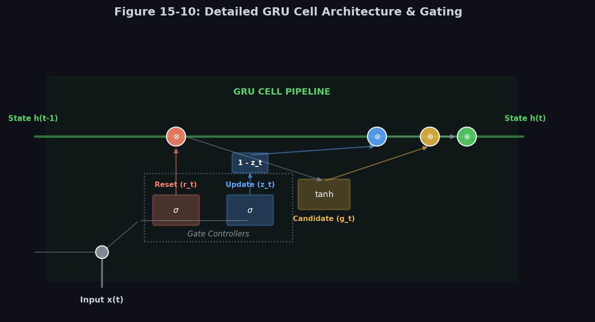

# 🧠 Module 4: Long-Term Dependency Cells (LSTM and GRU)
> **Ch. 15 — Hands-On ML with Scikit-Learn, Keras & TensorFlow (Aurélien Géron)**

---

## 📌 Table of Contents
1. [Start Here: The Big Picture](#big-picture)
2. [The Short-Term Memory Limit of Simple RNNs](#memory-limit)
3. [The LSTM Cell (Long Short-Term Memory)](#lstm-cell)
4. [LSTM Mathematical Formulations](#lstm-math)
5. [The Constant Error Carousel (CEC) Math](#constant-error-carousel)
6. [The GRU Cell (Gated Recurrent Unit)](#gru-cell)
7. [GRU Mathematical Formulations](#gru-math)
8. [LSTM vs. GRU: Architectural Comparison](#lstm-vs-gru)
9. [Common Beginner Mistakes](#mistakes)
10. [Interview Q&A](#interview)
11. [⚡ One-Page Flash Card](#revision)

---

## 🌍 Start Here: The Big Picture {#big-picture}

> **TL;DR:** Standard Simple RNNs cannot carry memory across long sequences due to vanishing gradients. To solve this, LSTM and GRU cells introduce internal gating mechanisms that act as highway valves, allowing information to pass through multiple steps completely unchanged unless explicitly modified.

**The Real-World Analogy 🍕:**
Think of a conveyor belt in a factory. In a Simple RNN, workers must pick up every package, inspect it, modify it, and put it back down. By step 100, the packages are heavily modified and corrupted. In an LSTM, the conveyor belt runs horizontally across the top (the long-term state $\mathbf{C}$). Most packages sit undisturbed on the belt, gliding to the end. Workers only step in to throw off useless packages (Forget Gate), add new packages (Input Gate), or take packages off the belt to ship to customers (Output Gate).

---

## 🔍 1. The Short-Term Memory Limit of Simple RNNs {#memory-limit}

Due to the continuous mathematical transformations at each step in a Simple RNN, information is modified. If a sequence is longer than 10-20 steps, details from early steps are diluted. By step 100, the initial state is lost. This is the **short-term memory problem**.

To solve this, advanced cells introduce an internal memory channel that skips the standard recurrence loop, creating a direct path for long-term memory.

---

## 🔍 2. The LSTM Cell (Long Short-Term Memory) {#lstm-cell}

Proposed by Hochreiter and Simplier in 1997, the LSTM cell splits the state into two paths:
1. **Long-term state $\mathbf{C}_{(t)}$**: Glides along the top, subject only to linear additions and element-wise multiplications.
2. **Short-term state $\mathbf{h}_{(t)}$**: Flows along the bottom, providing the cell's actual output prediction $y_{(t)}$ for the current step.


> 📊 **Graph 09:** LSTM cell internal architecture. Gated controllers (forget, input, output, and candidate gates) control information flow.

### Inside the LSTM Cell: Gating Mechanics
The cell features four gate layers, each implemented as a fully connected layer:
* **Forget Gate ($f_{(t)}$)**: Uses a sigmoid activation $\sigma$ to output a value between 0 (discard completely) and 1 (keep entirely).
* **Input Gate ($i_{(t)}$)**: Uses a sigmoid activation to decide which parts of the candidate state should be updated.
* **Candidate Gate ($g_{(t)}$)**: Uses a $\tanh$ activation to generate new candidate values to be written to the state.
* **Output Gate ($o_{(t)}$)**: Uses a sigmoid activation to decide which parts of the long-term cell state should be output as the short-term state $\mathbf{h}_{(t)}$.

---

## 🔍 3. LSTM Mathematical Formulations {#lstm-math}

For a single instance at step $t$, the computations are:

$$\mathbf{i}_{(t)} = \sigma\left(\mathbf{W}_{xi}^T \mathbf{x}_{(t)} + \mathbf{W}_{hi}^T \mathbf{h}_{(t-1)} + \mathbf{b}_i\right)$$

$$\mathbf{f}_{(t)} = \sigma\left(\mathbf{W}_{xf}^T \mathbf{x}_{(t)} + \mathbf{W}_{hf}^T \mathbf{h}_{(t-1)} + \mathbf{b}_f\right)$$

$$\mathbf{o}_{(t)} = \sigma\left(\mathbf{W}_{xo}^T \mathbf{x}_{(t)} + \mathbf{W}_{ho}^T \mathbf{h}_{(t-1)} + \mathbf{b}_o\right)$$

$$\mathbf{g}_{(t)} = \tanh\left(\mathbf{W}_{xg}^T \mathbf{x}_{(t)} + \mathbf{W}_{hg}^T \mathbf{h}_{(t-1)} + \mathbf{b}_g\right)$$

$$\mathbf{C}_{(t)} = \mathbf{f}_{(t)} \otimes \mathbf{C}_{(t-1)} + \mathbf{i}_{(t)} \otimes \mathbf{g}_{(t)}$$

$$\mathbf{h}_{(t)} = \mathbf{y}_{(t)} = \mathbf{o}_{(t)} \otimes \tanh\left(\mathbf{C}_{(t)}\right)$$

Where $\otimes$ represents the Hadamard (element-wise) product.

### Computational Efficiency: Matrix Concatenation
In production libraries (e.g., PyTorch, TensorFlow, CuDNN), calculating these four linear combinations individually is highly inefficient. Instead, they concatenate the four gate weight matrices and compute all gate pre-activations in a single dot product:

$$\begin{pmatrix} \mathbf{f}_{(t)} \\ \mathbf{i}_{(t)} \\ \mathbf{g}_{(t)} \\ \mathbf{o}_{(t)} \end{pmatrix} = \begin{pmatrix} \sigma \\ \sigma \\ \tanh \\ \sigma \end{pmatrix} \left( \mathbf{W}^T \begin{pmatrix} \mathbf{x}_{(t)} \\ \mathbf{h}_{(t-1)} \end{pmatrix} + \mathbf{b} \right)$$

Where:
* $\mathbf{W}$ is the concatenated weight matrix: $\mathbf{W} = \begin{bmatrix} \mathbf{W}_f & \mathbf{W}_i & \mathbf{W}_g & \mathbf{W}_o \end{bmatrix}$ (combining both input and hidden weights).
* $\mathbf{b}$ is the concatenated bias vector: $\mathbf{b} = \begin{bmatrix} \mathbf{b}_f^T & \mathbf{b}_i^T & \mathbf{b}_g^T & \mathbf{b}_o^T \end{bmatrix}^T$.

### Keras Implementation
```python
from tensorflow import keras

# Standard Keras LSTM Layer usage
model_lstm = keras.models.Sequential([
    keras.layers.LSTM(20, return_sequences=True, input_shape=[None, 1]),
    keras.layers.LSTM(20, return_sequences=True),
    keras.layers.TimeDistributed(keras.layers.Dense(10))
])
```

### Peephole Connections
Standard gate controllers only look at $\mathbf{x}_{(t)}$ and $\mathbf{h}_{(t-1)}$. In 2000, Felix Gers and Jürgen Schmidhuber proposed **Peephole Connections**, which allow the gate controllers to also inspect the current long-term state $\mathbf{C}_{(t-1)}$ (or $\mathbf{C}_{(t)}$ for the output gate), helping them make better gating decisions.

#### Peephole Mathematical Equations
With peephole connections, the gate formulations become:

$$\mathbf{f}_{(t)} = \sigma\left(\mathbf{W}_{xf}^T \mathbf{x}_{(t)} + \mathbf{W}_{hf}^T \mathbf{h}_{(t-1)} + \mathbf{W}_{cf}^T \mathbf{C}_{(t-1)} + \mathbf{b}_f\right)$$

$$\mathbf{i}_{(t)} = \sigma\left(\mathbf{W}_{xi}^T \mathbf{x}_{(t)} + \mathbf{W}_{hi}^T \mathbf{h}_{(t-1)} + \mathbf{W}_{ci}^T \mathbf{C}_{(t-1)} + \mathbf{b}_i\right)$$

$$\mathbf{o}_{(t)} = \sigma\left(\mathbf{W}_{xo}^T \mathbf{x}_{(t)} + \mathbf{W}_{ho}^T \mathbf{h}_{(t-1)} + \mathbf{W}_{co}^T \mathbf{C}_{(t)} + \mathbf{b}_o\right)$$

Note that the forget and input gates inspect the *previous* cell state $\mathbf{C}_{(t-1)}$, whereas the output gate inspects the *current* cell state $\mathbf{C}_{(t)}$.

```python
# To use peepholes, you must use PeepholeLSTMCell inside the RNN wrapper
import tensorflow as tf

model_peephole = keras.models.Sequential([
    keras.layers.RNN(tf.keras.experimental.PeepholeLSTMCell(20), 
                     return_sequences=True, input_shape=[None, 1])
])
```

---

## 🔍 5. The Constant Error Carousel (CEC) Math {#constant-error-carousel}

The primary reason LSTMs do not suffer from vanishing gradients during BPTT is the **Constant Error Carousel**.

### Gradient Derivative Trace
Let's consider the gradient flow of the cell state $\mathbf{C}_{(t)}$ back to the state at the previous step $\mathbf{C}_{(t-1)}$:

$$\frac{\partial \mathbf{C}_{(t)}}{\partial \mathbf{C}_{(t-1)}} = \mathbf{f}_{(t)}$$

During backpropagation over a sequence of length $T$, the error gradient flows backward through time:

$$\frac{\partial E}{\partial \mathbf{C}_{(0)}} = \frac{\partial E}{\partial \mathbf{C}_{(T)}} \prod_{t=1}^T \frac{\partial \mathbf{C}_{(t)}}{\partial \mathbf{C}_{(t-1)}} = \frac{\partial E}{\partial \mathbf{C}_{(T)}} \prod_{t=1}^T \mathbf{f}_{(t)}$$

* In a Simple RNN, the derivative term involves matrix multiplications of $\mathbf{W}_y^T$, which decays exponentially to 0.
* In an LSTM, if the forget gate is open ($f_{(t)} \approx 1.0$), the product is $\prod 1.0 = 1.0$. The gradient flows back unimpeded across hundreds of steps without decaying, allowing the network to retain memories indefinitely.

---

## 🔍 6. The GRU Cell (Gated Recurrent Unit) {#gru-cell}

Proposed by Kyunghyun Cho et al. in 2014, the GRU cell is a simplified variant of the LSTM cell that performs similarly but is computationally more efficient.


> 📊 **Graph 10:** GRU cell internal architecture. It simplifies LSTM by combining states and using only update and reset gates.

### Key Structural Simplifications
1. **Single Hidden State $\mathbf{h}_{(t)}$**: Combines the long-term and short-term states.
2. **Merged Gates**: 
   * A single **Update Gate ($z_{(t)}$)** controls both the forget gate and the input gate. If $z_{(t)}=1$, the old state is kept (forget gate inactive). If $z_{(t)}=0$, the candidate state is written (input gate active).
3. **No Output Gate**: The entire state vector is output directly. A **Reset Gate ($r_{(t)}$)** determines how much of the past state to show to the main $\tanh$ candidate layer.

---

## 🔍 7. GRU Mathematical Formulations {#gru-math}

For a single instance at step $t$, the calculations are:

$$\mathbf{z}_{(t)} = \sigma\left(\mathbf{W}_{xz}^T \mathbf{x}_{(t)} + \mathbf{W}_{hz}^T \mathbf{h}_{(t-1)} + \mathbf{b}_z\right)$$

$$\mathbf{r}_{(t)} = \sigma\left(\mathbf{W}_{xr}^T \mathbf{x}_{(t)} + \mathbf{W}_{hr}^T \mathbf{h}_{(t-1)} + \mathbf{b}_r\right)$$

$$\mathbf{g}_{(t)} = \tanh\left(\mathbf{W}_{xg}^T \mathbf{x}_{(t)} + \mathbf{W}_{hg}^T \left(\mathbf{r}_{(t)} \otimes \mathbf{h}_{(t-1)}\right) + \mathbf{b}_g\right)$$

$$\mathbf{h}_{(t)} = \mathbf{z}_{(t)} \otimes \mathbf{h}_{(t-1)} + \left(1 - \mathbf{z}_{(t)}\right) \otimes \mathbf{g}_{(t)}$$

### Framework Variant: PyTorch / CuDNN GRU Math
In optimized GPU environments, the candidate state $\mathbf{g}_{(t)}$ is often computed slightly differently to parallelize the matrix multiplications before the element-wise reset multiplication:

$$\mathbf{g}_{(t)} = \tanh\left(\mathbf{W}_{xg}^T \mathbf{x}_{(t)} + \mathbf{b}_{ig} + \mathbf{r}_{(t)} \otimes \left(\mathbf{W}_{hg}^T \mathbf{h}_{(t-1)} + \mathbf{b}_{hg}\right)\right)$$

This allows standard frameworks to multiply the full state $\mathbf{h}_{(t-1)}$ by $\mathbf{W}_{hg}$ first and then gate the result with $\mathbf{r}_{(t)}$, saving computational time.

### Keras Implementation
```python
# Simply replace LSTM with GRU
model_gru = keras.models.Sequential([
    keras.layers.GRU(20, return_sequences=True, input_shape=[None, 1]),
    keras.layers.GRU(20, return_sequences=True),
    keras.layers.TimeDistributed(keras.layers.Dense(10))
])
```

---

## 🔍 8. LSTM vs. GRU: Architectural Comparison {#lstm-vs-gru}

| Metric | LSTM Cell | GRU Cell |
| :--- | :--- | :--- |
| **Number of States** | 2 ($\mathbf{C}_{(t)}$ long-term, $\mathbf{h}_{(t)}$ short-term). | 1 ($\mathbf{h}_{(t)}$ hidden state). |
| **Number of Gates** | 3 (Forget $f_t$, Input $i_t$, Output $o_t$). | 2 (Reset $r_t$, Update $z_t$). |
| **Parameter Count** | $4 \times (n(d + n) + n)$ | $3 \times (n(d + n) + n)$ (~33% fewer). |
| **Training Speed** | Slower (higher computational overhead). | Faster (fewer operations). |
| **Memory Footprint** | Higher. | Lower. |
| **Expressive Power** | Higher (more complex gating relationships). | Slightly lower (but generalizes well on smaller datasets). |

---

## ❌ Common Beginner Mistakes {#mistakes}

**1. Using `PeepholeLSTMCell` with GPU acceleration** ❌
> **Why it fails:** Standard `LSTM` and `GRU` layers in Keras default to optimized CuDNN kernels when running on a GPU. Custom cells or experimental cells (like `PeepholeLSTMCell` wrapped in `RNN`) do not match these specific kernel patterns, making training significantly slower (sometimes 10x slower).
> **The Fix:** Only use peephole configurations if they provide a significant boost in validation performance. Otherwise, stick to standard `LSTM` or `GRU` layers for faster training.

---

## 🎤 Interview Q&A {#interview}

**Q1: How mathematically does the LSTM cell solve the vanishing gradient problem?**
> **A:** In a Simple RNN, backpropagating through time requires multiplying by $\mathbf{W}_y^T$ at each step. This repeated matrix multiplication causes gradients to decay exponentially. In an LSTM, the long-term state $\mathbf{C}_{(t)}$ is updated via a linear addition: $\mathbf{C}_{(t)} = \mathbf{f}_{(t)} \otimes \mathbf{C}_{(t-1)} + \mathbf{i}_{(t)} \otimes \mathbf{g}_{(t)}$. The derivative of $\mathbf{C}_{(t)}$ with respect to $\mathbf{C}_{(t-1)}$ contains the forget gate term $\mathbf{f}_{(t)}$. If the forget gate is open ($f_{(t)} \approx 1.0$), the gradient flows backward completely unimpeded without decay, solving the vanishing gradient problem.

**Q2: Compare LSTM and GRU cells. Which one should you use?**
> **A:** 
> * **GRU** has fewer parameters (two gates instead of three), trains faster, requires less memory, and is less prone to overfitting on smaller datasets.
> * **LSTM** is more expressive. Because it maintains separate long-term and short-term memory states, it can model more complex, long-term sequences better than GRU given enough data.
> * **Rule of thumb**: Start with GRU. If the model underfits or struggles with long dependencies, transition to LSTM.

---

## ⚡ One-Page Flash Card {#revision}

```
╔══════════════════════════════════════════════════════════════════╗
║               MODULE 4 — LSTM & GRU GATING CARD                  ║
╠══════════════════════════════════════════════════════════════════╣
║                                                                  ║
║  LSTM CORE STATE:                                                ║
║  - C(t): Long-term memory.                                       ║
║  - h(t): Short-term memory (output).                             ║
║                                                                  ║
║  LSTM GATES:                                                     ║
║  - Forget (f): f(t) * C(t-1)  -> what to drop.                   ║
║  - Input (i): i(t) * g(t)     -> what to store.                  ║
║  - Output (o): o(t) * tanh(C) -> what output to expose.          ║
║                                                                  ║
║  GRU SIMPLIFICATIONS:                                            ║
║  - Merges C(t) and h(t) into h(t).                               ║
║  - Gated by Update (z) and Reset (r) gates only.                 ║
║  - Gating addition: z * h(t-1) + (1-z) * candidate(t)            ║
║                                                                  ║
║  GPU TIP:                                                        ║
║  - Standard layers are CuDNN accelerated; wrapping custom cells  ║
║    deactivates this, slowing training.                           ║
║                                                                  ║
╚══════════════════════════════════════════════════════════════════╝
```

---

**🔗 Previous Module →** [03_Fighting_Unstable_Gradients_in_RNNs.md](03_Fighting_Unstable_Gradients_in_RNNs.md)  
**🔗 Next Module →** [05_Processing_Sequences_Using_1D_CNNs_and_WaveNet.md](05_Processing_Sequences_Using_1D_CNNs_and_WaveNet.md)
