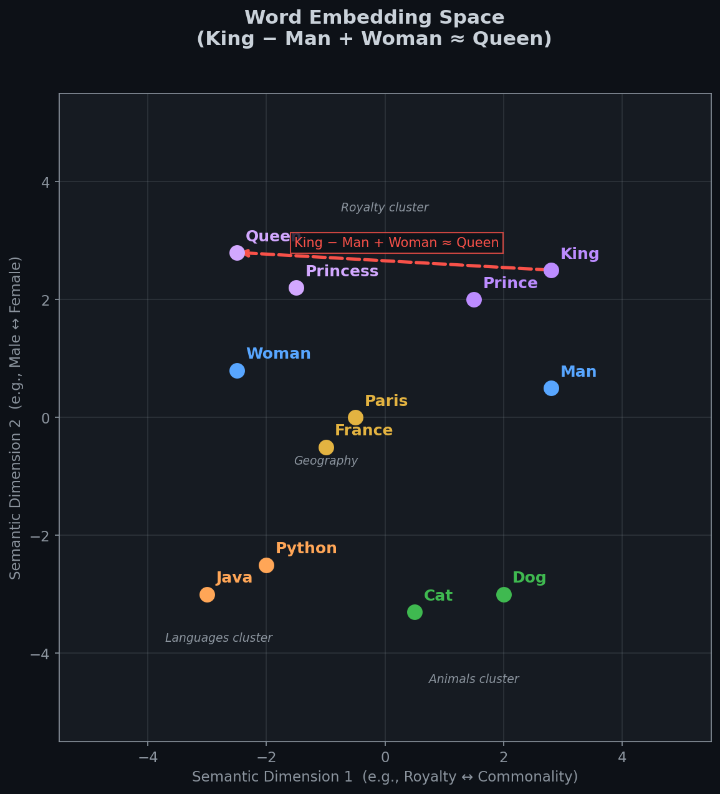
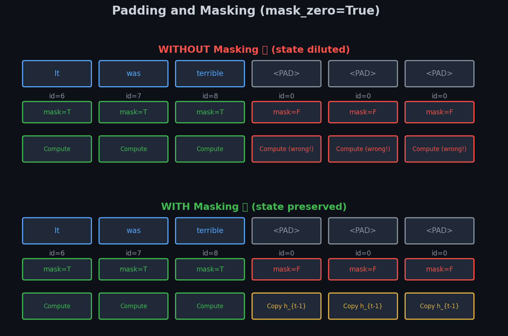

# 🎭 Module 2: Sentiment Analysis and Word Embeddings
> **Ch. 16 — Hands-On ML with Scikit-Learn, Keras & TensorFlow (Aurélien Géron)**

---

## 📌 Table of Contents
1. [🌍 The Big Picture: What's the Task?](#big-picture)
2. [📉 Why One-Hot Encoding Fails](#one-hot)
3. [🌌 Word Embeddings: Learning Meaning as Geometry](#embeddings)
4. [✂️ Tokenization, Padding & Truncation](#tokenization)
5. [🎭 Masking: Ignoring Padding During RNN Processing](#masking)
6. [📦 Reusing Pretrained Embeddings (GloVe / Word2Vec)](#pretrained)
7. [💻 Full End-to-End Sentiment Model](#e2e)
8. [❌ Common Beginner Mistakes](#mistakes)
9. [🎤 Interview Q&A](#interview)
10. [⚡ Flash Card Cheat Sheet](#revision)

---

## 🌍 The Big Picture: What's the Task? {#big-picture}

**Sentiment Analysis:** Given a movie review, predict if it's 👍 (positive) or 👎 (negative).

**The IMDB Dataset (reference benchmark):**
- 50,000 movie reviews
- 25,000 for training, 25,000 for testing
- Labels: 0 = Negative, 1 = Positive

**Example data:**
```
Review: "This film was absolutely brilliant! I loved every minute."  → Label: 1 (Positive)
Review: "Terrible acting. The plot made zero sense."                  → Label: 0 (Negative)
```

**The Full Pipeline:**
```
Raw Text → Tokenize → Pad/Truncate → Embed → RNN → Dense(sigmoid) → 0.0–1.0
"I love it"  → [4, 8, 2]  → [4, 8, 2, 0, 0] → [vectors...] → GRU → 0.95
```

---

## 📉 Why One-Hot Encoding Fails {#one-hot}

Suppose our vocabulary has **10,000 words**. One-hot encoding creates a **10,000-dimensional sparse binary vector** for each word.

**The word vector for "dog":**
```
[0, 0, 0, ..., 0, 1, 0, ..., 0, 0]  ← 10,000 dimensions, single 1 at index 4,312
```

**Critical problems:**

1. **No semantic relationship**: The distance between "dog" and "cat" is $\sqrt{2}$. The distance between "dog" and "airplane" is ALSO $\sqrt{2}$. All words are equidistant from each other!

2. **Massive memory**: A sentence of 500 words → 500 × 10,000 = 5,000,000 floats.

3. **No generalization**: Learning that "dog is cute" is positive doesn't help the model understand "puppy is adorable" — they have orthogonal representations.

---

## 🌌 Word Embeddings: Learning Meaning as Geometry {#embeddings}

Instead of 10,000 sparse dimensions, we map each word to a **dense 100-dimensional vector**. These vectors are learned during training.


> 📊 **Graph 04:** Word Embeddings cluster semantically similar words together. The vector arithmetic `King - Man + Woman ≈ Queen` emerges purely from training on text — the network discovers gender and royalty as geometric directions.

**Concrete Numerical Example (64 dims shown compressed to 2D):**

| Word | Dim 1 (Royal) | Dim 2 (Gender) | Dim 3 (Animal) | ... |
|------|--------------|---------------|----------------|-----|
| King | **+0.95** | **+0.80** | -0.10 | ... |
| Queen | **+0.93** | **-0.82** | -0.11 | ... |
| Man | +0.10 | **+0.79** | -0.05 | ... |
| Woman | +0.11 | **-0.81** | -0.04 | ... |
| Dog | -0.15 | +0.01 | **+0.95** | ... |
| Cat | -0.12 | -0.02 | **+0.91** | ... |

**The Famous Analogy:**
$$\text{vec}(\text{King}) - \text{vec}(\text{Man}) + \text{vec}(\text{Woman})$$
$$= (+0.95, +0.80, ...) - (+0.10, +0.79, ...) + (+0.11, -0.81, ...)$$
$$\approx (+0.96, -0.80, ...) \approx \text{vec}(\text{Queen}) ✅$$

**Implementation in Keras:**

```python
keras.layers.Embedding(
    input_dim=10000,     # Vocabulary size: how many unique words
    output_dim=128,      # Embedding dimensions: each word → 128D vector
    input_length=200,    # Optional: expected sequence length
    mask_zero=True       # Tell downstream layers to ignore 0-padded positions
)
```

**What is this layer internally?**

The `Embedding` layer is just a **learnable weight matrix** of shape `[10000, 128]`.
When the integer ID `4312` (index for "dog") is passed in, it performs a simple **lookup**: return row 4312 of the weight matrix. This is equivalent to a one-hot matrix multiplication, but 10,000× cheaper.

```
Word ID 4312  →  Embedding Matrix[4312, :]  →  [0.21, -0.45, 0.78, ..., 0.33]  (128D vector)
```

These 128 × 10,000 = 1.28 million weights are updated via backpropagation during training.

---

## ✂️ Tokenization, Padding & Truncation {#tokenization}

**The Problem:** Reviews have different lengths. Neural networks require uniform-length tensors.

- Review A: 12 words
- Review B: 487 words
- Review C: 203 words

We need to make all of them the same length (say, 200 words):
- Reviews shorter than 200: **pad with zeros** on the right
- Reviews longer than 200: **truncate** to the first 200 words

**Step-by-Step Numerical Example:**

```python
from tensorflow.keras.preprocessing.text import Tokenizer
from tensorflow.keras.preprocessing.sequence import pad_sequences

reviews = [
    "I loved this movie",     # 4 words
    "It was terrible",        # 3 words
    "Just okay not great"     # 4 words
]
labels = [1, 0, 0]

# Step 1: Build vocabulary mapping
tokenizer = Tokenizer(num_words=10000, oov_token="<UNK>")
tokenizer.fit_on_texts(reviews)
print(tokenizer.word_index)
# → {'<UNK>': 1, 'i': 2, 'loved': 3, 'this': 4, 'movie': 5, 'it': 6,
#    'was': 7, 'terrible': 8, 'just': 9, 'okay': 10, 'not': 11, 'great': 12}

# Step 2: Convert texts to integer sequences
sequences = tokenizer.texts_to_sequences(reviews)
print(sequences)
# → [[2, 3, 4, 5],      "I loved this movie"
#    [6, 7, 8],          "It was terrible"
#    [9, 10, 11, 12]]    "Just okay not great"

# Step 3: Pad to uniform length
X = pad_sequences(sequences, maxlen=6, padding='post', truncating='post')
print(X)
# → [[2, 3, 4, 5, 0, 0],   ← padded with 0s on right
#    [6, 7, 8, 0, 0, 0],   ← padded with 0s on right
#    [9, 10, 11, 12, 0, 0]] ← padded with 0s on right

y = np.array(labels)
```

**IMDB Dataset in practice:**
```python
# Built-in IMDB in Keras
(X_train, y_train), (X_test, y_test) = keras.datasets.imdb.load_data(num_words=10000)
X_train = keras.preprocessing.sequence.pad_sequences(X_train, maxlen=200)
X_test  = keras.preprocessing.sequence.pad_sequences(X_test,  maxlen=200)
print(X_train.shape)  # → (25000, 200)
```

---

## 🎭 Masking: Ignoring Padding During RNN Processing {#masking}

**The Critical Problem:**

After padding, our sequences look like:
```
[6, 7, 8, 0, 0, 0]   ← "It was terrible" + 3 padding zeros
```

If we feed this to an RNN **without masking**, the GRU will process all 6 positions:
```
Step 1: h1 = GRU(6, h0)    → "It"      (correct)
Step 2: h2 = GRU(7, h1)    → "was"     (correct)
Step 3: h3 = GRU(8, h2)    → "terrible" (correct, strong negative signal here!)
Step 4: h4 = GRU(0, h3)    → [PAD]     (meaningless! dilutes h3!)
Step 5: h5 = GRU(0, h4)    → [PAD]     (even more diluted!)
Step 6: h6 = GRU(0, h5)    → [PAD]     (almost forgot "terrible" by now!)
```

The final hidden state `h6` barely remembers "terrible"! The sentiment signal is washed out.

**The Solution: `mask_zero=True`**


> 📊 **Graph 05:** With masking, the GRU simply copies `h_{t-1}` to `h_t` at any position where the input is 0 (padding). The hidden state is perfectly preserved through the padding positions.

```python
# mask_zero=True tells the Embedding layer to generate a boolean mask tensor.
embedding_layer = keras.layers.Embedding(
    input_dim=10000, 
    output_dim=128,
    mask_zero=True   # ← This is all you need!
)
```

**What happens under the hood:**

1. `Embedding(mask_zero=True)` creates: `mask = (inputs != 0)` → boolean tensor
   ```
   Input:    [6, 7, 8,    0,     0,     0    ]
   Mask:     [T, T, T,    F,     F,     F    ]
   ```

2. This mask is automatically **propagated** to the GRU layer.

3. When the GRU processes position $t$ with `mask[t] = False`:
   - It does **NOT** run the GRU equations.
   - It simply sets $h_t = h_{t-1}$ (copy previous state).

Result:
```
Step 1: h1 = GRU(6, h0)    → mask=True  (compute!)
Step 2: h2 = GRU(7, h1)    → mask=True  (compute!)
Step 3: h3 = GRU(8, h2)    → mask=True  (compute!)
Step 4: h4 = SKIP → h4 = h3            (mask=False, copy h3!)
Step 5: h5 = SKIP → h5 = h4 = h3      (mask=False, copy again!)
Step 6: h6 = SKIP → h6 = h5 = h3      (mask=False, copy again!)
```

The final state `h6 = h3` — the exact state right after "terrible". Perfect!

---

## 📦 Reusing Pretrained Embeddings (GloVe / Word2Vec) {#pretrained}

Instead of learning embeddings from scratch on 25,000 reviews, we can borrow embeddings trained on **billions of words** (Wikipedia, Common Crawl).

**GloVe (Global Vectors for Word Representation):**
- Trained on 840 billion Common Crawl tokens
- Available in 50d, 100d, 200d, 300d
- Download: `glove.6B.100d.txt` (~822 MB)

**Step-by-step loading:**

```python
import numpy as np

# Step 1: Download & load GloVe vectors
glove_path = "glove.6B.100d.txt"
embedding_index = {}
with open(glove_path, encoding='utf-8') as f:
    for line in f:
        values = line.split()
        word = values[0]
        vector = np.asarray(values[1:], dtype='float32')
        embedding_index[word] = vector

print(f"Loaded {len(embedding_index):,} word vectors")  # → 400,000 words

# Example: GloVe vector for "terrible"
print(embedding_index["terrible"][:5])  # → [-0.42, 0.71, -0.23, ...]

# Step 2: Build embedding matrix aligned with OUR tokenizer's word_index
vocab_size = 10000
embedding_dim = 100
embedding_matrix = np.zeros((vocab_size, embedding_dim))

coverage = 0
for word, idx in tokenizer.word_index.items():
    if idx >= vocab_size:
        continue
    vec = embedding_index.get(word)
    if vec is not None:
        embedding_matrix[idx] = vec
        coverage += 1

print(f"Coverage: {coverage}/{min(vocab_size, len(tokenizer.word_index))} words found in GloVe")
# → Coverage: 9,843/10,000 words found in GloVe

# Step 3: Create Keras Embedding layer with pretrained weights
embedding_layer = keras.layers.Embedding(
    input_dim=vocab_size,
    output_dim=embedding_dim,
    weights=[embedding_matrix],   # ← load pretrained weights
    trainable=False,              # ← FREEZE first (don't destroy pretrained vectors!)
    mask_zero=True
)
```

**The Two-Phase Training Strategy:**

```python
# PHASE 1: Train with frozen embeddings (base learns task from scratch)
embedding_layer.trainable = False
model.compile(loss="binary_crossentropy", optimizer="adam", metrics=["accuracy"])
history1 = model.fit(X_train, y_train, epochs=5, validation_split=0.2)
# Loss drops quickly since GloVe embeddings are already meaningful

# PHASE 2: Fine-tune embeddings (very small LR!)
embedding_layer.trainable = True
model.compile(
    loss="binary_crossentropy",
    optimizer=keras.optimizers.Adam(lr=1e-5),  # 100x smaller than Phase 1!
    metrics=["accuracy"]
)
history2 = model.fit(X_train, y_train, epochs=10, validation_split=0.2)
# Embeddings slowly adjust to IMDB domain
```

---

## 💻 Full End-to-End Sentiment Model {#e2e}

```python
import tensorflow as tf
from tensorflow import keras

# Parameters
vocab_size = 10000
embed_dim = 128
max_len = 200

# Build model
model = keras.models.Sequential([
    # 1. Word ID → Dense Vector
    keras.layers.Embedding(
        vocab_size, embed_dim,
        input_length=max_len,
        mask_zero=True          # Enable masking for padding
    ),
    
    # 2. Process sequence (captures long-range sentiment patterns)
    keras.layers.Bidirectional(
        keras.layers.GRU(64, return_sequences=True, dropout=0.3)
    ),
    # Bidirectional means: one GRU reads L→R, another reads R→L
    # Outputs concatenated: [64 forward | 64 backward] = 128D at each step
    
    # 3. Reduce sequence → single vector (last step only)
    keras.layers.Bidirectional(
        keras.layers.GRU(64, dropout=0.3)
    ),
    
    # 4. Hidden representation
    keras.layers.Dense(64, activation="relu"),
    keras.layers.Dropout(0.5),
    
    # 5. Binary output: probability of POSITIVE review
    keras.layers.Dense(1, activation="sigmoid")  # 0=Negative, 1=Positive
])

model.summary()
# ┌─────────────────────────────────────────────────────────────────────┐
# │ Layer                        │ Output Shape       │ Param #         │
# ├─────────────────────────────────────────────────────────────────────┤
# │ embedding                    │ (None, 200, 128)   │ 1,280,000       │
# │ bidirectional (GRU)          │ (None, 200, 128)   │ 100,224         │
# │ bidirectional_1 (GRU)        │ (None, 128)        │ 99,584          │
# │ dense                        │ (None, 64)         │ 8,256           │
# │ dropout                      │ (None, 64)         │ 0               │
# │ dense_1                      │ (None, 1)          │ 65              │
# └─────────────────────────────────────────────────────────────────────┘
#   Total params: 1,488,129

model.compile(
    loss="binary_crossentropy",
    optimizer="adam",
    metrics=["accuracy"]
)

history = model.fit(
    X_train, y_train,
    batch_size=128,
    epochs=10,
    validation_split=0.2
)

# Typical results:
# Epoch 10/10: loss=0.18, acc=0.932, val_loss=0.31, val_acc=0.889
test_loss, test_acc = model.evaluate(X_test, y_test)
print(f"Test Accuracy: {test_acc:.1%}")   # → 88–91%

# Make a prediction
review = "Absolutely stunning film. Deeply moving and beautifully shot."
seq = tokenizer.texts_to_sequences([review])
padded = pad_sequences(seq, maxlen=200)
prob = model.predict(padded)[0][0]
print(f"Sentiment: {'Positive 👍' if prob > 0.5 else 'Negative 👎'} ({prob:.2%} confidence)")
# → Sentiment: Positive 👍 (96.38% confidence)
```

---

## ❌ Common Beginner Mistakes {#mistakes}

**1. Using `padding='pre'` then losing sentiment signal** ❌
```python
# If padding is at the FRONT and you use the FINAL RNN state:
pad_sequences(seqs, padding='pre')  
# Input: [0, 0, 0, 6, 7, 8]  (padding at start)
# GRU reads: 0→0→0→"It"→"was"→"terrible"
# ✅ Final state perfectly captures "terrible" (no dilution from post-padding)
# BUT: if the review is long, truncation at the START cuts important context

# Best practice: padding='post', then use GlobalAveragePooling or Bidirectional GRU
```

**2. Checking accuracy but ignoring class imbalance** ❌
```python
# IMDB is balanced (50/50), but many real datasets are not.
# For imbalanced data, use:
#   - AUC-ROC instead of accuracy
#   - class_weight parameter in model.fit()
model.fit(X_train, y_train, class_weight={0: 1.0, 1: 3.0})
```

**3. Forgetting to freeze pretrained embeddings during Phase 1** ❌
```python
# WRONG — immediately training unfrozen GloVe embeddings:
embedding_layer.trainable = True  # ← Gradients from random Dense layer
                                   # will immediately corrupt GloVe vectors!
# CORRECT — freeze first, then fine-tune:
# Phase 1: trainable=False → Phase 2: trainable=True with LR 1e-5
```

---

## 🎤 Interview Q&A {#interview}

**Q1: What is the semantic difference between One-Hot Encoding and Word Embeddings?**
> **A:** One-hot creates orthogonal vectors — all word pairs have identical cosine distance of 0. No semantic relationship is captured. Word Embeddings create dense vectors in a learned continuous space where semantic proximity = geometric proximity. Words with similar meanings have high cosine similarity. The embedding layer is just a trainable lookup table of shape `[vocab_size, embed_dim]`, optimized via backprop to make the downstream task easier.

**Q2: How does `mask_zero=True` work technically in Keras?**
> **A:** The Embedding layer checks if any input token equals 0. It creates a boolean mask tensor `M` where `M[b, t] = (X[b, t] != 0)`. This mask is propagated forward to the GRU layer. At any time step $t$ where `M[b, t] = False`, the GRU simply performs `h_t = h_{t-1}` (copies previous state unchanged). This ensures padding tokens have absolutely zero effect on the final hidden state.

**Q3: What is catastrophic forgetting and how do we prevent it in pretrained embeddings?**
> **A:** Catastrophic forgetting occurs when a pretrained model (or layer) is fine-tuned with a large learning rate, causing new gradients to overwrite the pre-learned representations. For embeddings: if we unfreeze GloVe immediately, the large gradients from the uninitialized Dense/GRU layers will corrupt the semantic structure of GloVe vectors in just a few batches. Prevention: 1) Phase 1 — freeze embeddings, train only new layers. 2) Phase 2 — unfreeze with LR 100× smaller than phase 1. The embeddings then make only tiny adjustments around their pre-learned representations.

---

## ⚡ Flash Card Cheat Sheet {#revision}

```
╔════════════════════════════════════════════════════════════════════════╗
║        MODULE 2 CHEAT SHEET: EMBEDDINGS & SENTIMENT ANALYSIS           ║
╠════════════════════════════════════════════════════════════════════════╣
║                                                                          ║
║  WORD EMBEDDINGS:                                                        ║
║  One-Hot: 10,000D sparse, equidistant, no semantics                     ║
║  Embedding: 128D dense, trainable, semantic = geometric proximity       ║
║  Layer: keras.layers.Embedding(vocab=10000, dim=128, mask_zero=True)   ║
║  Internal: Just a lookup table of shape [10000, 128]                    ║
║                                                                          ║
║  MASKING:                                                                ║
║  mask = (inputs != 0) — auto-propagated to downstream RNN layers        ║
║  At masked positions: h_t = h_{t-1} (state preserved, not updated!)    ║
║  Without mask: padding zeros DILUTE the hidden state!                  ║
║                                                                          ║
║  PRETRAINED EMBEDDINGS (GloVe/Word2Vec):                                ║
║  weights=[embedding_matrix] — initialize with pretrained weights        ║
║  Phase 1: trainable=False, train layers above                          ║
║  Phase 2: trainable=True, lr=1e-5 (100x smaller), fine-tune            ║
║                                                                          ║
║  BIDIRECTIONAL GRU:                                                     ║
║  One GRU L→R + one GRU R→L → concatenated output (2× hidden size)     ║
║  Sees full context (past AND future) at every position                  ║
║                                                                          ║
╚════════════════════════════════════════════════════════════════════════╝
```

---

**🔗 Previous Module →** [01_Char_RNNs_and_Text_Generation.md](01_Char_RNNs_and_Text_Generation.md)  
**🔗 Next Module →** [03_Encoder_Decoder_and_Translation.md](03_Encoder_Decoder_and_Translation.md)
