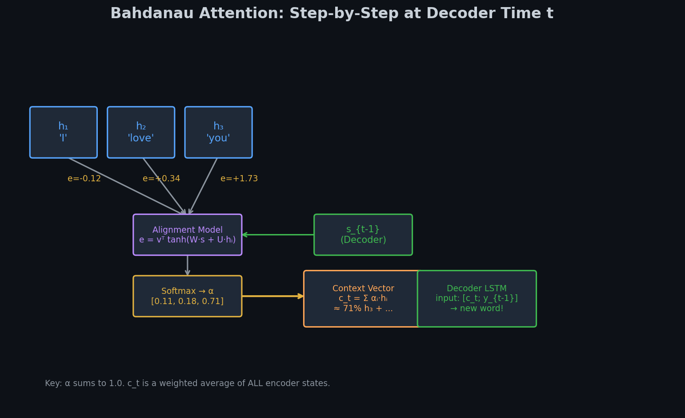
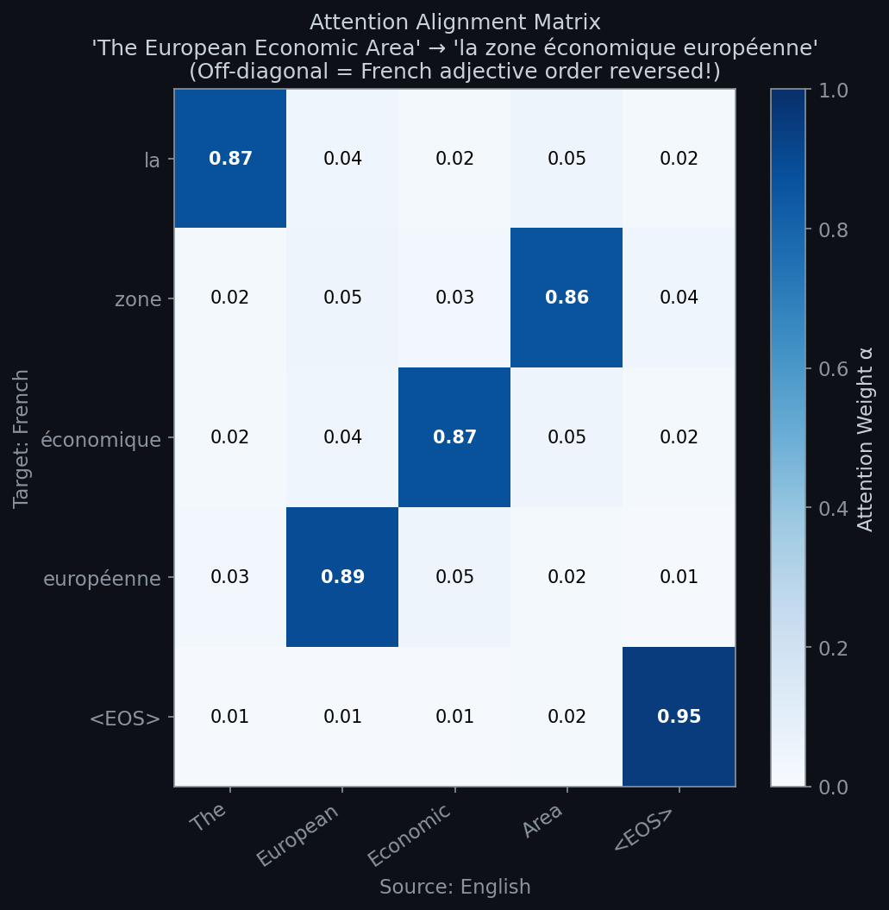

# 🎯 Module 4: Attention Mechanisms — Deep Dive
> **Ch. 16 — Hands-On ML with Scikit-Learn, Keras & TensorFlow (Aurélien Géron)**

---

## 📌 Table of Contents
1. [🌍 The Big Picture: What's Broken & How Attention Fixes It](#big-picture)
2. [📉 The Bottleneck Problem: Quantified](#bottleneck)
3. [➕ Bahdanau (Additive) Attention — Math & Numbers](#bahdanau)
4. [✖️ Luong (Multiplicative) Attention](#luong)
5. [🗺️ Reading the Alignment Matrix](#alignment)
6. [💻 Implementing Attention in Keras](#implementation)
7. [❌ Common Beginner Mistakes](#mistakes)
8. [🎤 Interview Q&A](#interview)
9. [⚡ Flash Card Cheat Sheet](#revision)

---

## 🌍 The Big Picture: What's Broken & How Attention Fixes It {#big-picture}

**Standard Encoder-Decoder (Broken for long sentences):**
```
"Romeo loves Juliet and they both tragically die for love"
        ↓ (10 words compressed into one 256D vector)
        c = [0.21, -0.43, ...]   ← 256 numbers must describe ALL of this!
        ↓
"Roméo aime Juliette et ils meurent tous les deux tragiquement pour l'amour"
```

The Decoder is "reading" all 12 French words from that single 256D summary. Information about "Romeo" from the start has been diluted by processing 9 subsequent words.

**The Attention Solution:**

Instead of one Context Vector for the ENTIRE translation, compute a **unique context vector for each decoder step**, by dynamically attending to different encoder positions.

```
When generating "Roméo":   → focus mostly on Encoder state for "Romeo"
When generating "aime":    → focus mostly on Encoder state for "loves"  
When generating "Juliette":→ focus mostly on Encoder state for "Juliet"
When generating "meurent": → focus on Encoder states for "die" and "tragically"
```

> 💡 **Intuition:** Think of how YOU translate. When writing the French word for "tragically", your eyes move back to the English word "tragically" in the source text. Attention gives the model the same ability.

---

## 📉 The Bottleneck Problem: Quantified {#bottleneck}

**Encoder output for a 10-word sentence:**

The Encoder produces states: $h_1, h_2, ..., h_{10}$

In a standard Encoder-Decoder, we keep ONLY $h_{10}$ (the final state).

**What happens to the information gradient?**

For an LSTM with tanh activations, the gradient flowing from step $T$ back to step 1 is:
$$\frac{\partial h_1}{\partial h_T} = \prod_{t=1}^{T-1} \frac{\partial h_{t+1}}{\partial h_t}$$

Each $\frac{\partial h_{t+1}}{\partial h_t}$ is bounded by the largest singular value of the weight matrix times the derivative of tanh (max 1). For a 10-word sentence, the gradient from step 10 to step 1 passes through 9 multiplications of numbers ≤ 1, often resulting in values like $0.9^9 \approx 0.39$. For 50 words: $0.9^{49} \approx 0.005$.

**With Attention:** The Decoder can directly compute a weighted sum of ALL encoder states. The gradient path from the decoder to any encoder state is at most 1-2 matrix multiplications! No more 50-step gradient chains.

---

## ➕ Bahdanau (Additive) Attention — Math & Numbers {#bahdanau}

**Paper:** *"Neural Machine Translation by Jointly Learning to Align and Translate"* — Bahdanau et al., 2015


> 📊 **Graph 09:** Bahdanau Attention architecture. For each decoder step $t$, the alignment model scores every encoder state $h_i$ against the decoder's previous state $s_{t-1}$. The softmax-normalized scores become weights over the encoder states, forming a dynamic context vector $c_t$.

### The 6-Step Algorithm (with numbers!)

**Setup:**
- Encoder states: $h_1, h_2, h_3$ (each is 256D, from encoding "I love you")
  ```
  h_1 = [0.21, -0.14, ..., 0.33]  ← "I"
  h_2 = [0.82,  0.71, ..., 0.15]  ← "love"
  h_3 = [0.45, -0.23, ..., 0.67]  ← "you"
  ```
- Decoder state from step 0: $s_0 = c = h_3$ (initialized to context vector)
- We are at decoder step $t=1$ (predicting "Je")

---

**Step 1: Compute Alignment Score $e_{1,i}$** for every encoder state $h_i$:

The alignment model is a small feed-forward network:
$$e_{1,i} = \mathbf{v}_a^T \tanh(\mathbf{W}_a s_0 + \mathbf{U}_a h_i)$$

Where $\mathbf{W}_a$ and $\mathbf{U}_a$ are learned weight matrices, and $\mathbf{v}_a$ is a learned vector.

**In practice (simplified with scalar example):**
```
score(s_0, h_1) = v^T * tanh(W * s_0 + U * h_1) = -0.12   ← Low match: "I" ≠ "Je" context
score(s_0, h_2) = v^T * tanh(W * s_0 + U * h_2) = +0.34   ← Medium: "love" somewhat relevant  
score(s_0, h_3) = v^T * tanh(W * s_0 + U * h_3) = +1.73   ← High: "you" → "Je" = subject!
```

**Step 2: Normalize with Softmax:**
$$\alpha_{1,i} = \frac{\exp(e_{1,i})}{\sum_{k=1}^T \exp(e_{1,k})}$$

```
Raw scores: [-0.12, +0.34, +1.73]

exp scores: [e^{-0.12}, e^{0.34}, e^{1.73}] = [0.887, 1.405, 5.641]
Sum = 0.887 + 1.405 + 5.641 = 7.933

Attention weights: α_1 = [0.887/7.933, 1.405/7.933, 5.641/7.933]
                       = [0.112,        0.177,        0.711      ]
```

Interpretation: When predicting "Je", the model pays:
- 11.2% attention to encoder state for "I"
- 17.7% attention to encoder state for "love"
- **71.1%** attention to encoder state for "you" 

*(This makes sense! "Je" = "I" in French, which corresponds to the subject "I" = "you" in the source, where "you" is the object. The attention is learning grammar!)*

**Step 3: Compute Context Vector $c_1$ (weighted sum):**
$$c_1 = \sum_{i=1}^T \alpha_{1,i} h_i$$

```
c_1 = 0.112 × h_1  +  0.177 × h_2  +  0.711 × h_3
    = 0.112 × [0.21, -0.14, ...]  
    + 0.177 × [0.82,  0.71, ...]  
    + 0.711 × [0.45, -0.23, ...]
    
    = [0.023, -0.016, ...]
    + [0.145,  0.126, ...]
    + [0.320, -0.163, ...]
    
    = [0.488,  -0.053, ...]   ← Rich, decoder-step-specific context vector!
```

**Step 4: Decoder generates next word using $c_1$:**
$$s_1 = \text{LSTM}([c_1; y_0], s_0)$$

The context vector $c_1$ is concatenated with the previous output embedding before being fed into the decoder LSTM. The decoder now has access to focused information!

**Step 5: Output probability:**
$$P(\hat{y}_1) = \text{softmax}(\mathbf{W}_o [s_1; c_1; y_0])$$

**Step 6: Repeat for $t=2$ ("t'aime"), $t=3$ ("<EOS>"), etc.**

Each decoder step gets its OWN context vector, focused on the most relevant encoder positions.

---

## ✖️ Luong (Multiplicative) Attention {#luong}

**Paper:** *"Effective Approaches to Attention-based Neural Machine Translation"* — Luong et al., 2015

Luong observed: if $s_t$ and $h_i$ represent the same semantic space, their **dot product** should be large when they're relevant to each other!

**Three Scoring Functions:**

| Type | Formula | Notes |
|------|---------|-------|
| **Dot** | $e_{t,i} = s_t^T h_i$ | Fastest. Requires $\dim(s) = \dim(h)$ |
| **General** | $e_{t,i} = s_t^T \mathbf{W}_a h_i$ | Flexible dimensions. One small matrix. |
| **Concat** | $e_{t,i} = \mathbf{v}_a^T \tanh(\mathbf{W}_a[s_t; h_i])$ | Similar to Bahdanau. |

**Numerical Example (Dot Scoring):**

```
s_1 = [0.7, 0.3, -0.5]  (Decoder state, simplified 3D)
h_1 = [0.2, 0.1,  0.9]  ← "I"
h_2 = [0.8, 0.4, -0.6]  ← "love"
h_3 = [0.5, 0.2, -0.3]  ← "you"

Dot product scores:
e(s_1, h_1) = 0.7×0.2 + 0.3×0.1 + (-0.5)×0.9  = 0.14 + 0.03 - 0.45 = -0.28
e(s_1, h_2) = 0.7×0.8 + 0.3×0.4 + (-0.5)×(-0.6) = 0.56 + 0.12 + 0.30 = 0.98  ← high!
e(s_1, h_3) = 0.7×0.5 + 0.3×0.2 + (-0.5)×(-0.3) = 0.35 + 0.06 + 0.15 = 0.56

After softmax: α ≈ [0.06, 0.60, 0.34]
```

The model strongly attends to "love" when the decoder state is querying for the verb!

**Key Differences: Bahdanau vs Luong:**

| Feature | Bahdanau | Luong |
|---------|---------|-------|
| Which decoder state? | Previous state $s_{t-1}$ | Current state $s_t$ |
| Scoring mechanism | Additive (tanh+linear) | Multiplicative (dot product) |
| Parameters | $\mathbf{W}_a$, $\mathbf{U}_a$, $\mathbf{v}_a$ | None (dot) or $\mathbf{W}_a$ (general) |
| Computational cost | $O(T \cdot d^2)$ | $O(T \cdot d)$ — much faster! |
| Context vector usage | Concatenated before LSTM | Concatenated AFTER LSTM ($\tilde{s}_t = \tanh(W_c[c_t; s_t])$) |
| Modern usage | Still seen in research | **Standard for production (Keras `Attention` layer)** |

---

## 🗺️ Reading the Alignment Matrix {#alignment}

The softmax weights $\alpha_{t,i}$ can be visualized as a matrix:
- **Rows:** Target (French) words
- **Columns:** Source (English) words
- **Color intensity:** Attention weight (darker = higher attention)


> 📊 **Graph 08:** Attention Alignment Matrix for English→French translation of "The European Economic Area". Note the off-diagonal bright spots where French grammar reverses the English word order.

**Reading the matrix:**

```
"The European Economic Area" → "la zone économique européenne"

           The  European  Economic  Area
la         0.9    0.0       0.0     0.1    ← "la" = "The" (article maps to article!)
zone       0.0    0.1       0.0     0.9    ← "zone" = "Area" (jumped to end!)
économique 0.0    0.0       0.9     0.1    ← "économique" = "Economic" (correct)
européenne 0.0    0.9       0.1     0.0    ← "européenne" = "European" (jumped!)
```

The bright spots JUMP around because French adjective ordering is reversed from English:
- English: "European Economic Area" (Adj-Adj-Noun)
- French: "zone économique européenne" (Noun-Adj-Adj, reversed!)

The attention matrix literally shows the model LEARNING French grammar from data — no grammar rules were programmed in!

**Explainability Use Case:**

If a translation is wrong, you can look at the attention matrix to diagnose:
- Bright spot in the wrong column → Model misidentified the corresponding source word
- All columns uniformly lit → Model is confused and looking at everything equally (bad!)
- Sharp diagonal with correct offsets → Good alignment!

---

## 💻 Implementing Attention in Keras {#implementation}

Keras provides a built-in `Attention` layer (Luong-style):

```python
from tensorflow import keras

# ════════════════════════════════
# ENCODER
# ════════════════════════════════
encoder_inputs = keras.layers.Input(shape=[None], name="encoder_input")
enc_emb = keras.layers.Embedding(vocab_size, embed_dim)(encoder_inputs)
# NOTE: return_sequences=True needed to get ALL hidden states (not just final!)
encoder_outputs, state_h, state_c = keras.layers.LSTM(
    units=256, 
    return_sequences=True,  # ← CRITICAL: We need ALL encoder outputs for attention!
    return_state=True
)(enc_emb)
encoder_state = [state_h, state_c]

# ════════════════════════════════
# DECODER
# ════════════════════════════════
decoder_inputs = keras.layers.Input(shape=[None], name="decoder_input")
dec_emb = keras.layers.Embedding(vocab_size, embed_dim)(decoder_inputs)
decoder_lstm = keras.layers.LSTM(units=256, return_sequences=True, return_state=True)
decoder_outputs, _, _ = decoder_lstm(dec_emb, initial_state=encoder_state)

# ════════════════════════════════
# ATTENTION LAYER (the magic!)
# ════════════════════════════════
# For each decoder step: compute weighted sum of all encoder_outputs
attention_layer = keras.layers.Attention()  # Luong-style dot-product attention

# Query = decoder outputs, Value = encoder outputs, Key = encoder outputs
context_vector = attention_layer([decoder_outputs, encoder_outputs])
# context_vector shape: [batch, decoder_steps, encoder_hidden_dim]

# Concatenate context with decoder outputs
decoder_combined = keras.layers.Concatenate(axis=-1)([decoder_outputs, context_vector])

# Final output
decoder_outputs_final = keras.layers.Dense(vocab_size, activation="softmax")(decoder_combined)

# Full training model
model = keras.Model(
    inputs=[encoder_inputs, decoder_inputs], 
    outputs=decoder_outputs_final
)
model.compile(optimizer="adam", loss="sparse_categorical_crossentropy", metrics=["accuracy"])
```

---

## ❌ Common Beginner Mistakes {#mistakes}

**1. Not using `return_sequences=True` in the Encoder when using Attention** ❌
```python
# WRONG — without return_sequences, you only get the final hidden state
encoder_outputs, state_h, state_c = keras.layers.LSTM(256)(enc_emb)
# encoder_outputs is shape [batch, 256] (just final step) — nothing to attend over!

# CORRECT — return ALL hidden states for attention to query:
encoder_outputs, state_h, state_c = keras.layers.LSTM(
    256, return_sequences=True, return_state=True  # ← both True!
)(enc_emb)
# encoder_outputs is shape [batch, src_len, 256] — now attention can work!
```

**2. Confusing the different context vectors** ❌
```
Standard Encoder-Decoder: ONE context vector c (the final encoder state)
                          Used for the ENTIRE decoding process.

With Attention:           DIFFERENT context vector c_t for EACH decoder step.
                          c_t is a weighted sum of ALL encoder states.
```

**3. Trying to use Attention on very long sequences (100K+ tokens)** ❌
> Reality: Computing attention weights requires $O(T_{\text{src}} \times T_{\text{tgt}})$ operations. For a 10,000-word document translated to 10,000 target words, this is 100M operations PER HEAD PER LAYER. This is why models use sparse attention, local attention windows, or memory-efficient alternatives (like Flash Attention) for very long sequences.

---

## 🎤 Interview Q&A {#interview}

**Q1: In Bahdanau Attention, what is the alignment score computing?**
> **A:** The alignment score $e_{t,i} = \mathbf{v}^T \tanh(\mathbf{W}_a s_{t-1} + \mathbf{U}_a h_i)$ measures the "compatibility" between the current decoder hidden state $s_{t-1}$ (what the decoder is currently trying to generate) and each encoder hidden state $h_i$ (information from input position $i$). A high score means "encoder position $i$ contains information highly relevant to the current decoding step $t$." The softmax-normalized scores tell us how much weight to give each encoder position when forming the context vector.

**Q2: Why does Luong use the current decoder state while Bahdanau uses the previous state?**
> **A:** In Bahdanau's architecture, the context vector $c_t$ is computed BEFORE the decoder LSTM runs at step $t$, then fed as part of the LSTM input. So we only have $s_{t-1}$ available when computing the attention. In Luong's architecture, the decoder LSTM runs first at step $t$ to produce $s_t$, THEN we use $s_t$ to compute attention and form $c_t$, which is then passed through a final transformation: $\tilde{s}_t = \tanh(W_c[c_t; s_t])$. Using the current state is arguably more semantically meaningful since it represents "where the decoder is right now."

**Q3: What does the Attention Alignment Matrix tell us about the model?**
> **A:** It reveals which source word positions the decoder is attending to when generating each target word. A perfect diagonal means word-for-word monotonic alignment. Off-diagonal bright spots reveal grammatical reordering (e.g., adjective placement differences between languages). Uniform, diffuse attention over all positions indicates the model is uncertain or confused. Sparse, sharp attention peaks indicate confident, well-learned alignments. It provides remarkable explainability — you can trace any translation output back to specific source positions.

---

## ⚡ Flash Card Cheat Sheet {#revision}

```
╔══════════════════════════════════════════════════════════════════════╗
║                MODULE 4 CHEAT SHEET: ATTENTION MECHANISMS             ║
╠══════════════════════════════════════════════════════════════════════╣
║                                                                        ║
║  THE PROBLEM:                                                          ║
║  Context vector = single h_T (fixed size, loses early-word info)       ║
║                                                                        ║
║  THE SOLUTION (Bahdanau):                                              ║
║  For each decoder step t:                                              ║
║  1. e_{t,i} = v^T * tanh(W_a*s_{t-1} + U_a*h_i)  (alignment score)  ║
║  2. α_{t,i} = softmax(e_{t,i})  (attention weights, sum to 1)          ║
║  3. c_t = Σ α_{t,i} * h_i  (dynamic context vector)                   ║
║  4. Decoder LSTM uses [c_t; y_{t-1}] as input                         ║
║                                                                        ║
║  LUONG vs BAHDANAU:                                                    ║
║  Bahdanau: uses s_{t-1}, additive tanh scoring, context BEFORE LSTM   ║
║  Luong:    uses s_t,     dot product scoring,  context AFTER LSTM      ║
║  Luong is faster (O(T*d) vs O(T*d^2)), Keras Attention = Luong        ║
║                                                                        ║
║  ALIGNMENT MATRIX:                                                     ║
║  Plot α_{t,i}: rows=target words, cols=source words                   ║
║  Shows grammar inversions as off-diagonal bright spots                 ║
║  Provides explainability: see WHERE the model looked                   ║
║                                                                        ║
╚══════════════════════════════════════════════════════════════════════╝
```

---

**🔗 Previous Module →** [03_Encoder_Decoder_and_Translation.md](03_Encoder_Decoder_and_Translation.md)  
**🔗 Next Module →** [05_The_Transformer_Architecture.md](05_The_Transformer_Architecture.md)
