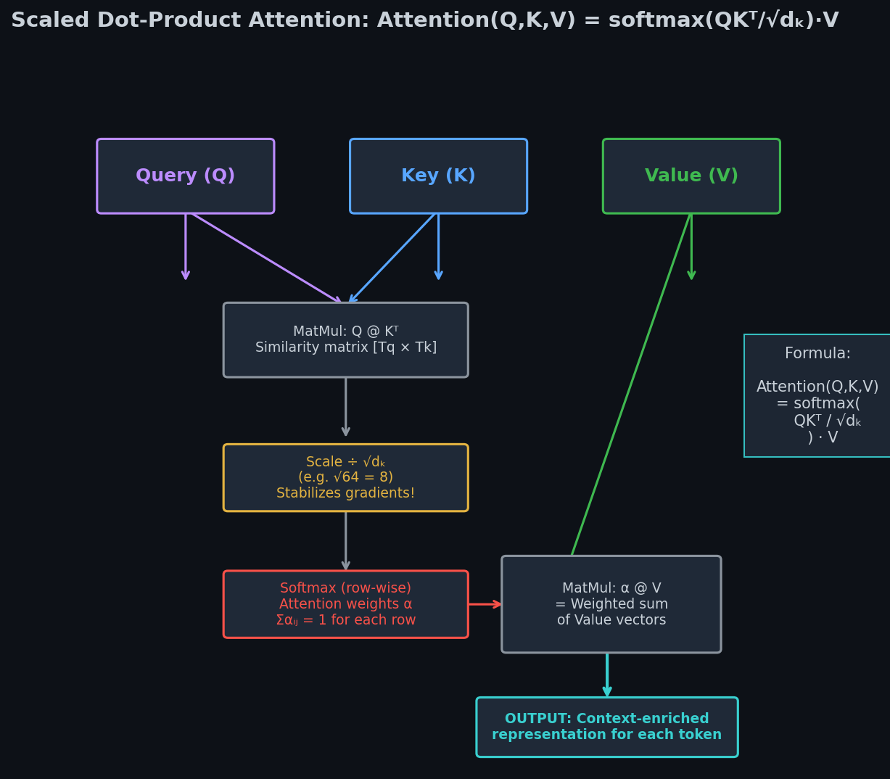
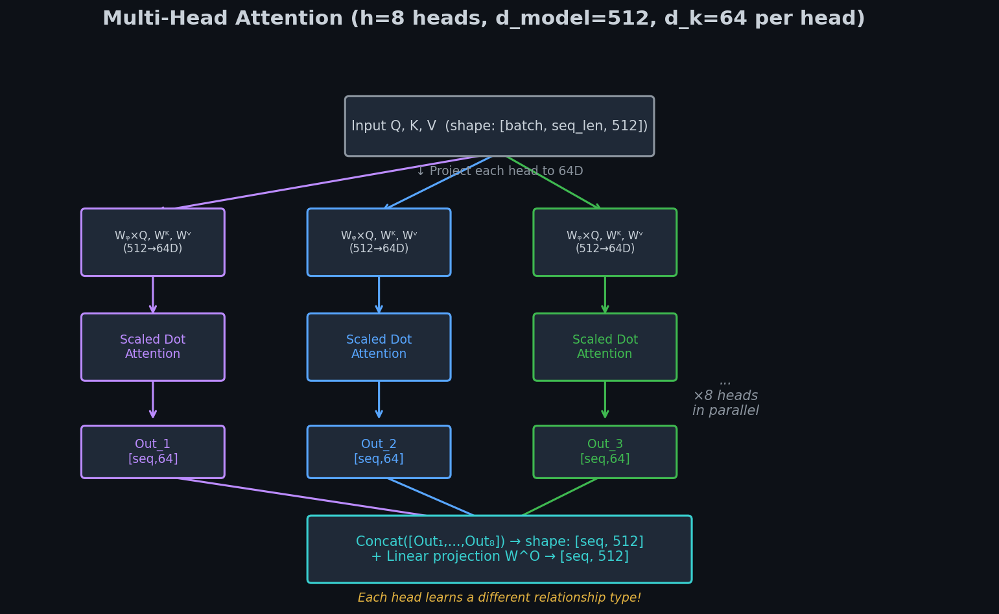
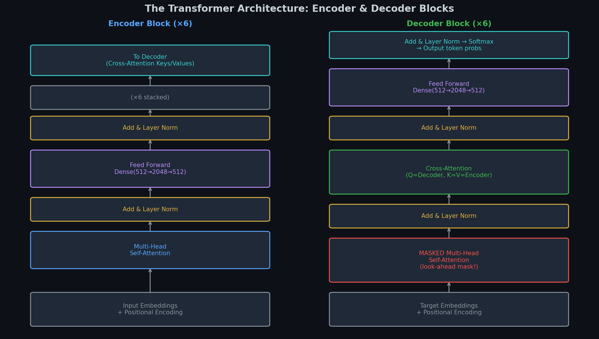

# 🤖 Module 5: The Transformer Architecture — Deep Dive
> **Ch. 16 — Hands-On ML with Scikit-Learn, Keras & TensorFlow (Aurélien Géron)**

---

## 📌 Table of Contents
1. [🌍 The Big Picture: Why Transformers Replaced RNNs](#big-picture)
2. [🔑 Scaled Dot-Product Attention (Q, K, V) — With Full Numbers](#scaled-dot)
3. [📍 Positional Encoding — Why and How](#positional)
4. [🧠 Multi-Head Attention — The Power of Parallel Perspectives](#multi-head)
5. [🏗️ The Full Transformer Block: Encoder and Decoder](#transformer-block)
6. [🎯 Layer Normalization vs Batch Normalization](#layer-norm)
7. [💻 Implementing a Transformer in Keras](#implementation)
8. [❌ Common Beginner Mistakes](#mistakes)
9. [🎤 Interview Q&A](#interview)
10. [⚡ Flash Card Cheat Sheet](#revision)

---

## 🌍 The Big Picture: Why Transformers Replaced RNNs {#big-picture}

**Published:** *"Attention Is All You Need"* — Vaswani et al., Google Brain, 2017

**The Two Fatal Flaws of RNNs:**

### Flaw 1: Sequential Processing = Cannot Parallelize

An RNN MUST process word $t$ before word $t+1$:
```
"The cat sat on the mat"
 t=1  t=2  t=3  t=4  t=5  t=6

GPU has 5,000 cores available.
But RNN uses 1 core at a time (step t requires step t-1 to finish first).
4,999 cores sit idle during training! 
```

For a 512-word sentence on a 4096-core GPU, utilization = **0.02%** of available hardware.

### Flaw 2: Long-Range Dependencies

```
"The animal didn't cross the street because [it] was too tired."
        word 2                                word 10
```

What does "it" refer to? "animal" (word 2) or "street" (word 7)?

In an LSTM, the gradient from the prediction of "it" at position 10 must backpropagate through 8 time steps to reach "animal". Gradient signal degrades with every step.

**The Transformer Solution:**

Every word attends to every other word in a SINGLE matrix multiplication. Word 1 is exactly "1 operation away" from word 512. No sequential dependency. Full GPU parallelism.

```
Training time on WMT 2014 English→German:
RNN seq2seq:     ~3.5 days on 8 P100 GPUs
Transformer base:  ~12 hours on 8 P100 GPUs  (7× faster!)
Transformer big:   ~3.5 days on 8 P100 GPUs  (same time, but ~2 BLEU better!)
```

---

## 🔑 Scaled Dot-Product Attention (Q, K, V) — With Full Numbers {#scaled-dot}

The core innovation of the Transformer.

### The Database Retrieval Analogy

Imagine a Python dictionary (hash table), but differentiable:
```python
# Standard dictionary (hard lookup):
data = {"cat": [0.2, 0.8, ...], "dog": [0.3, 0.7, ...]}
result = data["cat"]  # Either exactly "cat" or error

# Attention (soft lookup):
# If query="kitty", keys=["cat", "dog", "fish"],
# Attention returns a WEIGHTED SUM of values based on similarity:
# weights: cat=0.85, dog=0.12, fish=0.03
# result = 0.85 × cat_vector + 0.12 × dog_vector + 0.03 × fish_vector
```

### Where do Q, K, V come from?

Every word in the input gets projected into THREE different vector spaces using learned weight matrices:

```
Input word embedding x_i (shape: [d_model=512]):

Q_i = x_i @ W_Q    (shape: [d_k=64])   ← "What am I looking for?"
K_i = x_i @ W_K    (shape: [d_k=64])   ← "What do I contain?"  
V_i = x_i @ W_V    (shape: [d_v=64])   ← "What do I deliver?"
```

Weight matrices: $W_Q \in \mathbb{R}^{512 \times 64}$, $W_K \in \mathbb{R}^{512 \times 64}$, $W_V \in \mathbb{R}^{512 \times 64}$

### The Formula and Step-by-Step Computation

$$\text{Attention}(\mathbf{Q}, \mathbf{K}, \mathbf{V}) = \text{softmax}\left(\frac{\mathbf{Q}\mathbf{K}^T}{\sqrt{d_k}}\right)\mathbf{V}$$


> 📊 **Graph 10:** The Scaled Dot-Product Attention circuit. Q×K^T gives a similarity matrix, divided by sqrt(d_k) to prevent gradient vanishing in softmax, then applied as weights over V.

### Full Numerical Example (d_k=4 for simplicity)

**Input sentence:** "The cat sat" (3 words, each embedded in 4D)

**Step 0: Compute Q, K, V for each word**
```
Simplified W_Q, W_K, W_V matrices (4×4, usually 512×64):

Word embeddings:
x_1 ("The") = [1.0,  0.0, 0.5, -0.5]
x_2 ("cat") = [0.2,  0.9, 0.1,  0.3]
x_3 ("sat") = [-0.1, 0.3, 0.8, -0.2]

After linear projections (simplified):
Q:  Q_1 = [0.5, 0.1, 0.2, -0.1]   K:  K_1 = [0.4, 0.3, 0.1,  0.2]   V:  V_1 = [0.8, -0.2, ...]
    Q_2 = [0.1, 0.8, 0.0,  0.2]       K_2 = [0.1, 0.7, 0.0,  0.1]       V_2 = [0.3,  0.9, ...]
    Q_3 = [0.0, 0.2, 0.7, -0.1]       K_3 = [0.2, 0.1, 0.6, -0.1]       V_3 = [-0.1, 0.5, ...]
```

**Step 1: Compute QK^T (similarity matrix)**
```
QK^T = Q @ K^T

Row 1 (Q_1 queries all keys):
  Q_1 · K_1 = 0.5×0.4 + 0.1×0.3 + 0.2×0.1 + (-0.1)×0.2 = 0.20+0.03+0.02-0.02 = 0.23
  Q_1 · K_2 = 0.5×0.1 + 0.1×0.7 + 0.2×0.0 + (-0.1)×0.1 = 0.05+0.07+0.00-0.01 = 0.11
  Q_1 · K_3 = 0.5×0.2 + 0.1×0.1 + 0.2×0.6 + (-0.1)×(-0.1) = 0.10+0.01+0.12+0.01 = 0.24

Row 2 (Q_2 queries all keys):
  Q_2 · K_1 = 0.1×0.4 + 0.8×0.3 + 0.0×0.1 + 0.2×0.2 = 0.04+0.24+0.00+0.04 = 0.32
  Q_2 · K_2 = 0.1×0.1 + 0.8×0.7 + 0.0×0.0 + 0.2×0.1 = 0.01+0.56+0.00+0.02 = 0.59
  Q_2 · K_3 = 0.1×0.2 + 0.8×0.1 + 0.0×0.6 + 0.2×(-0.1) = 0.02+0.08+0.00-0.02 = 0.08

QK^T = [[0.23, 0.11, 0.24],
         [0.32, 0.59, 0.08],
         [...,  ...,  ...]]
```

**Step 2: Scale by $\sqrt{d_k} = \sqrt{4} = 2$**
```
QK^T / sqrt(4) = [[0.115, 0.055, 0.120],
                   [0.160, 0.295, 0.040],
                   [...,   ...,   ...  ]]
```

**WHY SCALE?**

Without scaling, with $d_k = 64$: dot products can be very large (around $\sqrt{64} \times 1 = 8$ in expectation). After softmax, large values cause near-one-hot distributions:
```
Without scaling:  softmax([5.2, 0.1, -3.4]) ≈ [0.9946, 0.0054, 0.0001]
With scaling:     softmax([0.65, 0.0125, -0.425]) ≈ [0.52, 0.35, 0.13]
```

The unscaled distribution has effectively zero gradient for positions 2 and 3 — they receive no useful gradient updates!

**Step 3: Apply Softmax (row-wise)**
```
Row 1: softmax([0.115, 0.055, 0.120]) 
     = [e^0.115, e^0.055, e^0.120] / (e^0.115 + e^0.055 + e^0.120)
     = [1.122, 1.057, 1.127] / 3.306
     = [0.340, 0.320, 0.341]  ← "The" attends roughly equally to all words

Row 2: softmax([0.160, 0.295, 0.040])
     = [1.174, 1.343, 1.041] / 3.558
     = [0.330, 0.377, 0.293]  ← "cat" attends most to itself (makes sense!)
```

**Step 4: Multiply by V to get final output**
```
Output_1 = 0.340 × V_1 + 0.320 × V_2 + 0.341 × V_3
         = 0.340 × [0.8, -0.2, ...] + 0.320 × [0.3, 0.9, ...] + 0.341 × [-0.1, 0.5, ...]
         = [0.272, -0.068, ...] + [0.096, 0.288, ...] + [-0.034, 0.171, ...]
         = [0.334, 0.391, ...]   ← Context-enriched representation of "The"!
```

Each word's output is now a context-aware vector that has "looked at" all other words.

---

## 📍 Positional Encoding — Why and How {#positional}

**The Problem:** Matrix multiplication is permutation invariant.

```python
# These give the SAME attention output (only word identities matter, not position):
sentence_1 = "The dog ate the cat"
sentence_2 = "The cat ate the dog"  # Different meaning! Same bag-of-words.
```

The Transformer cannot distinguish these without position information!

**The Solution:** Add a position-dependent signal to each word embedding BEFORE processing:

$$PE_{(pos, 2i)}   = \sin\left(\frac{pos}{10000^{2i/d_{model}}}\right)$$
$$PE_{(pos, 2i+1)} = \cos\left(\frac{pos}{10000^{2i/d_{model}}}\right)$$

Where:
- $pos$ = position in sequence (0, 1, 2, ...)
- $i$ = dimension index (0, 1, ..., $d_{model}/2$)
- $d_{model} = 512$

**Concrete Example for position 0 and 1 (d_model=4):**

```
Position 0:
  dim 0: sin(0/10000^0) = sin(0/1)       = 0.000
  dim 1: cos(0/10000^0) = cos(0/1)       = 1.000
  dim 2: sin(0/10000^2/4) = sin(0/100)   = 0.000
  dim 3: cos(0/10000^2/4) = cos(0/100)   = 1.000

PE[0] = [0.000, 1.000, 0.000, 1.000]

Position 1:
  dim 0: sin(1/10000^0) = sin(1/1)       = 0.841
  dim 1: cos(1/10000^0) = cos(1/1)       = 0.540
  dim 2: sin(1/10000^0.5) = sin(1/10)    = 0.100
  dim 3: cos(1/10000^0.5) = cos(1/10)    = 0.995

PE[1] = [0.841, 0.540, 0.100, 0.995]
```

**Why sine/cosine?**

1. **Bounded:** All values stay in [-1, 1]. No scaling issues.
2. **Unique per position:** Every position gets a completely different pattern.
3. **Relative positions are linear:** For any fixed offset $k$: 
   $PE_{pos+k}$ can be represented as a linear function of $PE_{pos}$.
   This means the model can easily learn "position $t+3$ is always 3 steps ahead of position $t$."

```python
# Keras implementation
import numpy as np

def positional_encoding(max_len, d_model):
    """Create a [max_len, d_model] positional encoding matrix."""
    pos = np.arange(max_len)[:, np.newaxis]       # Shape: [max_len, 1]
    i   = np.arange(d_model)[np.newaxis, :]       # Shape: [1, d_model]
    
    angles = pos / np.power(10000, (2 * (i // 2)) / d_model)
    
    # Apply sin to even indices, cos to odd
    angles[:, 0::2] = np.sin(angles[:, 0::2])    # Even dimensions
    angles[:, 1::2] = np.cos(angles[:, 1::2])    # Odd dimensions
    
    return tf.cast(angles[np.newaxis, :, :], dtype=tf.float32)  # [1, max_len, d_model]

pe = positional_encoding(max_len=100, d_model=512)
print(pe.shape)  # → (1, 100, 512)
```

**The final input to the Transformer:**
```
Input = Embedding(token_id) + PositionalEncoding(position)
      = [semantic meaning] + [position signal]
      = d_model-dimensional vector
```

---

## 🧠 Multi-Head Attention — The Power of Parallel Perspectives {#multi-head}


> 📊 **Graph 11:** Multi-Head Attention. Q, K, V are projected into h different lower-dimensional subspaces. Each head performs attention independently. Results are concatenated and projected back to d_model.

**Why do we need multiple heads?**

A single attention head learns ONE type of relationship (e.g., subject-verb agreement).
But a sentence has MANY types of relationships simultaneously:

```
Sentence: "The referee, who was watching the match, called a foul."

Head 1 might learn: subject-verb agreement ("referee called")
Head 2 might learn: relative clauses ("who" modifies "referee")
Head 3 might learn: coreference ("who" = "referee")
Head 4 might learn: semantic roles ("referee" = AGENT, "foul" = THEME)
```

**The Math:**

With $h=8$ heads and $d_{model}=512$, each head has $d_k = d_v = 512/8 = 64$ dimensions.

$$\text{MultiHead}(Q, K, V) = \text{Concat}(\text{head}_1, ..., \text{head}_h) W^O$$

Where:
$$\text{head}_i = \text{Attention}(Q W_i^Q, K W_i^K, V W_i^V)$$

**Parameter count for Multi-Head Attention (h=8, d_model=512, d_k=d_v=64):**

| Component | Shape | Parameters |
|-----------|-------|-----------|
| $W_i^Q$ per head | $[512, 64]$ | 32,768 |
| $W_i^K$ per head | $[512, 64]$ | 32,768 |
| $W_i^V$ per head | $[512, 64]$ | 32,768 |
| 8 heads × (Q+K+V) | — | 3 × 32,768 × 8 = **786,432** |
| Output projection $W^O$ | $[512, 512]$ | **262,144** |
| **Total** | — | **~1.05M parameters per MHA layer** |

---

## 🏗️ The Full Transformer Block: Encoder and Decoder {#transformer-block}


> 📊 **Graph 12:** The complete Transformer architecture. The Encoder stack (left) processes the input. The Decoder stack (right) generates the output. Residual connections and Layer Normalization surround every sub-layer.

### Encoder Block (repeated N=6 times in the original paper):

```
Input Embeddings + Positional Encoding
                ↓
┌─────────────────────────────────────────────────────────┐
│  Encoder Block (×6):                                      │
│                                                           │
│  ┌─ Multi-Head Self-Attention ─────────────────────────┐ │
│  │  Q = K = V = SAME source (words look at each other) │ │
│  └───────────────────────────────────────────────────── ┘ │
│                     ↓ + residual                          │
│              Layer Normalization                          │
│                     ↓                                     │
│  ┌─ Feed Forward Network ──────────────────────────────┐ │
│  │  FFN(x) = max(0, x W_1 + b_1) W_2 + b_2            │ │
│  │  (Two Dense layers: 512→2048→512, with ReLU)        │ │
│  └─────────────────────────────────────────────────────┘ │
│                     ↓ + residual                          │
│              Layer Normalization                          │
└─────────────────────────────────────────────────────────┘
```

### Decoder Block (repeated N=6 times):

```
Target Embeddings + Positional Encoding
                ↓
┌─────────────────────────────────────────────────────────┐
│  Decoder Block (×6):                                      │
│                                                           │
│  ┌─ MASKED Multi-Head Self-Attention ─────────────────┐  │
│  │  Masks future tokens (look-ahead mask)              │  │
│  │  At position t, can only see positions 0..t        │  │
│  └─────────────────────────────────────────────────────┘  │
│                     ↓ + residual                          │
│              Layer Normalization                          │
│                     ↓                                     │
│  ┌─ CROSS Attention (Encoder-Decoder Attention) ───────┐  │
│  │  Q = Decoder state, K = V = Encoder final output   │  │
│  │  THIS is where translation/understanding happens!  │  │
│  └─────────────────────────────────────────────────────┘  │
│                     ↓ + residual                          │
│              Layer Normalization                          │
│                     ↓                                     │
│  ┌─ Feed Forward Network ──────────────────────────────┐  │
│  └─────────────────────────────────────────────────────┘  │
│                     ↓ + residual                          │
│              Layer Normalization                          │
└─────────────────────────────────────────────────────────┘
```

### The Look-Ahead Mask (Crucial for Decoder!)

```
Teacher forcing feeds ALL target tokens simultaneously for efficiency:
Decoder input: [<SOS>, Je, t'aime]   (all at once during training)

Without mask, word at position 2 ("t'aime") can attend to position 3 ("<EOS>"):
→ It would CHEAT! It knows what the next word is!

The look-ahead mask sets attention weights for future positions to -∞ (before softmax):

       <SOS>  Je  t'aime
<SOS> [ 0.0, -∞,  -∞  ]   ← <SOS> can only see itself
Je    [ 0.3,  0.7, -∞  ]   ← Je can see <SOS> and itself
t'aime[ 0.1,  0.4,  0.5]  ← t'aime can see all past tokens

After softmax of -∞: P = 0 (the masked positions contribute nothing)
```

---

## 🎯 Layer Normalization vs Batch Normalization {#layer-norm}

**Batch Normalization:** Normalizes across the BATCH dimension.

```
Input: [batch=32, seq_len=10, d_model=512]
BatchNorm computes mean and std ACROSS the 32 samples.
```

**Problem for NLP:** Sequence lengths vary wildly within a batch (due to padding). Batch statistics are polluted by padding tokens.

**Layer Normalization:** Normalizes across the FEATURE dimension.

```
Input: [batch=32, seq_len=10, d_model=512]
LayerNorm computes mean and std ACROSS the 512 features for each individual position.
```

Each word is normalized independently — padding tokens don't affect other words.

```python
# Implementation:
layer_norm = keras.layers.LayerNormalization(axis=-1)  # Normalize over the last axis (features)

# Residual + LayerNorm pattern (used everywhere in Transformers):
x = multi_head_attention(x, x, x)
x = layer_norm(x + residual_input)   # Add & Norm!
```

---

## 💻 Implementing a Transformer in Keras {#implementation}

```python
import tensorflow as tf
from tensorflow import keras

class MultiHeadAttention(keras.layers.Layer):
    def __init__(self, d_model, num_heads):
        super().__init__()
        self.num_heads = num_heads
        self.d_model = d_model
        self.d_k = d_model // num_heads   # 512 // 8 = 64 per head
        
        # Linear projections for Q, K, V
        self.W_q = keras.layers.Dense(d_model)
        self.W_k = keras.layers.Dense(d_model)
        self.W_v = keras.layers.Dense(d_model)
        self.W_o = keras.layers.Dense(d_model)  # Output projection
    
    def split_heads(self, x, batch_size):
        """Split d_model dimension into (num_heads, d_k)."""
        x = tf.reshape(x, (batch_size, -1, self.num_heads, self.d_k))
        return tf.transpose(x, perm=[0, 2, 1, 3])  # [batch, heads, seq, d_k]
    
    def call(self, query, key, value, mask=None):
        batch_size = tf.shape(query)[0]
        
        Q = self.split_heads(self.W_q(query), batch_size)   # [B, H, Tq, dk]
        K = self.split_heads(self.W_k(key),   batch_size)   # [B, H, Tk, dk]
        V = self.split_heads(self.W_v(value), batch_size)   # [B, H, Tv, dv]
        
        # Scaled Dot-Product Attention
        dk = tf.cast(self.d_k, tf.float32)
        scores = tf.matmul(Q, K, transpose_b=True) / tf.math.sqrt(dk)  # [B, H, Tq, Tk]
        
        if mask is not None:
            scores += (mask * -1e9)   # Set masked positions to -infinity
        
        weights = tf.nn.softmax(scores, axis=-1)  # [B, H, Tq, Tk]
        output = tf.matmul(weights, V)            # [B, H, Tq, dv]
        
        # Merge heads
        output = tf.transpose(output, [0, 2, 1, 3])  # [B, Tq, H, dv]
        output = tf.reshape(output, (batch_size, -1, self.d_model))  # [B, Tq, d_model]
        
        return self.W_o(output)  # Final projection → [B, Tq, d_model]


class TransformerEncoderBlock(keras.layers.Layer):
    def __init__(self, d_model, num_heads, dff, dropout_rate=0.1):
        super().__init__()
        self.mha = MultiHeadAttention(d_model, num_heads)
        self.ffn = keras.Sequential([
            keras.layers.Dense(dff, activation="relu"),  # 512 → 2048
            keras.layers.Dense(d_model)                  # 2048 → 512
        ])
        self.norm1 = keras.layers.LayerNormalization(epsilon=1e-6)
        self.norm2 = keras.layers.LayerNormalization(epsilon=1e-6)
        self.drop1 = keras.layers.Dropout(dropout_rate)
        self.drop2 = keras.layers.Dropout(dropout_rate)
    
    def call(self, x, training=False, mask=None):
        # Sub-layer 1: Multi-Head Self-Attention + Add & Norm
        attn_output = self.mha(x, x, x, mask)   # Self-attention: Q=K=V=x
        attn_output = self.drop1(attn_output, training=training)
        x = self.norm1(x + attn_output)          # Add & Norm (residual!)
        
        # Sub-layer 2: Feed Forward + Add & Norm
        ffn_output = self.ffn(x)
        ffn_output = self.drop2(ffn_output, training=training)
        x = self.norm2(x + ffn_output)            # Add & Norm
        
        return x   # Shape preserved: [batch, seq_len, d_model]
```

---

## ❌ Common Beginner Mistakes {#mistakes}

**1. Not using the Look-Ahead Mask in the Decoder's Self-Attention** ❌
```python
# WRONG — during training with teacher forcing, word at position t
# can "see" the ground truth at position t+1, t+2, ...
decoder_self_attn = MultiHeadAttention(...)
output = decoder_self_attn(x, x, x)  # ← No mask! Decoder cheats!

# CORRECT — apply look-ahead mask:
def create_look_ahead_mask(size):
    mask = 1 - tf.linalg.band_part(tf.ones((size, size)), -1, 0)
    return mask  # [size, size] upper triangular matrix of ones

mask = create_look_ahead_mask(seq_len)
output = decoder_self_attn(x, x, x, mask=mask)  # ← Masked!
```

**2. Using Batch Normalization instead of Layer Normalization** ❌
```python
# WRONG — batch norm polluted by padding, doesn't work well with NLP:
keras.layers.BatchNormalization()

# CORRECT — layer norm normalizes each position independently:
keras.layers.LayerNormalization(axis=-1)
```

**3. Forgetting to scale the dot product** ❌
```python
# WRONG — large d_k causes attention weights to saturate near 0 or 1:
scores = tf.matmul(Q, K, transpose_b=True)
weights = tf.nn.softmax(scores)

# CORRECT — scale by sqrt(d_k) to keep variance stable:
dk = tf.cast(tf.shape(K)[-1], tf.float32)
scores = tf.matmul(Q, K, transpose_b=True) / tf.math.sqrt(dk)
weights = tf.nn.softmax(scores)
```

---

## 🎤 Interview Q&A {#interview}

**Q1: What are Q, K, V in the Transformer and where do they come from?**
> **A:** Q (Query), K (Key), and V (Value) are three different linear projections of the SAME input. Each input token $x_i$ is multiplied by learned weight matrices $W^Q$, $W^K$, $W^V$ to produce $Q_i$, $K_i$, $V_i$. Conceptually: Q represents "what am I looking for?", K represents "what information do I contain?", V represents "what information will I provide?". The dot product between Q and all K's measures relevance, the softmax normalizes it, and the result is used to weight-sum all V's — producing a context-aware output for each token.

**Q2: Why is the scaling factor $\sqrt{d_k}$ used and what happens without it?**
> **A:** The dot product $Q \cdot K$ has variance $d_k$ (if Q and K are unit-variance random vectors, their dot product has variance $d_k$). For large $d_k$ (e.g., 64 or 512), this means dot products are large in magnitude. Large inputs to softmax create near-one-hot distributions where most weights are ≈0 and one weight ≈1. In this regime, softmax gradients are nearly zero — the network can barely learn. Dividing by $\sqrt{d_k}$ keeps the dot product variance at 1, ensuring the softmax operates in its gradient-active range.

**Q3: In a Transformer Decoder, why are there THREE different attention mechanisms?**
> **A:** The three serve completely different purposes. (1) **Masked Self-Attention:** Each decoder output position attends to other DECODER positions, but only to past positions (future-masked). This lets the decoder model sequential dependencies within what it's generating. (2) **Cross-Attention (Encoder-Decoder Attention):** The decoder's representations form the Queries, while the encoder's final outputs form the Keys and Values. This is where the decoder "reads" the input and performs the actual translation/generation conditioned on the input. (3) The **Feed-Forward Network** applies position-wise transformations.

---

## ⚡ Flash Card Cheat Sheet {#revision}

```
╔═══════════════════════════════════════════════════════════════════════╗
║              MODULE 5 CHEAT SHEET: THE TRANSFORMER                     ║
╠═══════════════════════════════════════════════════════════════════════╣
║                                                                         ║
║  SCALED DOT-PRODUCT ATTENTION:                                          ║
║  Attention(Q,K,V) = softmax(Q*K^T / sqrt(d_k)) * V                     ║
║  Q=K=V=Input for SELF-ATTENTION                                        ║
║  Q=Decoder, K=V=Encoder for CROSS-ATTENTION                           ║
║  Scale by sqrt(d_k) to prevent softmax saturation!                     ║
║                                                                         ║
║  POSITIONAL ENCODING:                                                   ║
║  PE[pos,2i]   = sin(pos / 10000^(2i/d_model))                          ║
║  PE[pos,2i+1] = cos(pos / 10000^(2i/d_model))                          ║
║  Added to word embeddings BEFORE the first Transformer block           ║
║                                                                         ║
║  MULTI-HEAD ATTENTION (h=8):                                           ║
║  Split d_model=512 into 8 heads of d_k=64                              ║
║  Each head learns a different type of relationship                      ║
║  Concat 8 heads → Linear projection W^O → d_model output              ║
║                                                                         ║
║  TRANSFORMER BLOCK PATTERN:                                             ║
║  Encoder: [MH Self-Attn → Add&Norm → FFN → Add&Norm] × N              ║
║  Decoder: [Masked MH → A&N → Cross-Attn → A&N → FFN → A&N] × N       ║
║  Use Layer Norm (not Batch Norm)!                                       ║
║                                                                         ║
║  LOOK-AHEAD MASK (Decoder self-attention):                             ║
║  Upper triangular -∞ matrix → after softmax = 0.0 (blocked!)          ║
║  Prevents position t from seeing future positions t+1, t+2, ...        ║
║                                                                         ║
╚═══════════════════════════════════════════════════════════════════════╝
```

---

**🔗 Previous Module →** [04_Attention_Mechanisms.md](04_Attention_Mechanisms.md)  
**🔗 Next Module →** [06_Recent_Innovations_in_Language_Models.md](06_Recent_Innovations_in_Language_Models.md)
