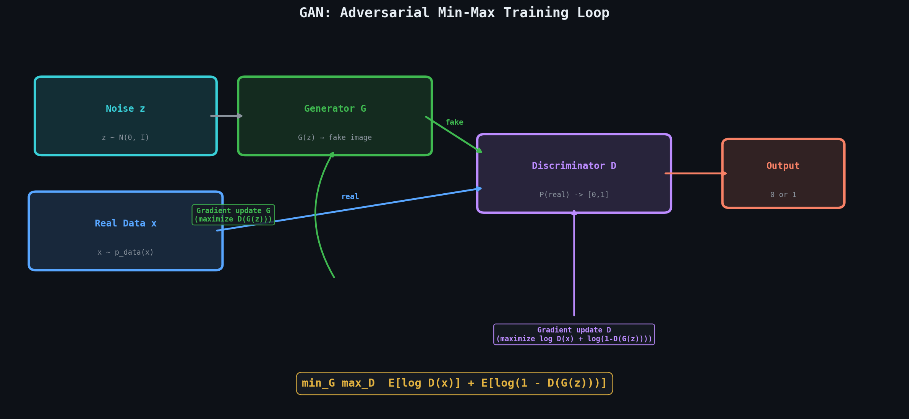
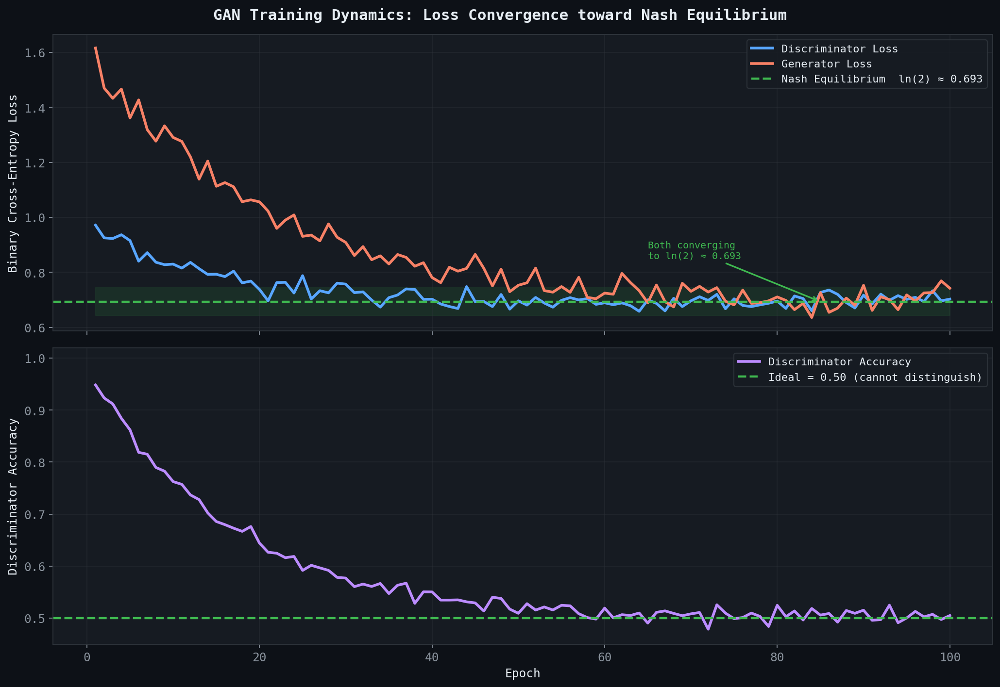
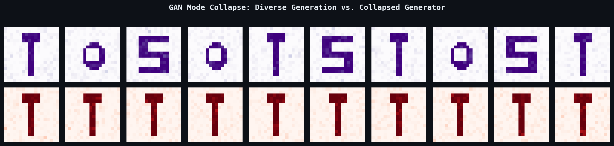

# ⚔️ Module 04: Generative Adversarial Networks (GANs)
> **Ch. 17 — Hands-On ML with Scikit-Learn, Keras & TensorFlow (Aurélien Géron)**

---

## 📌 Table of Contents
1. [Start Here: The Big Picture](#big-picture)
2. [The Adversarial Framework](#adversarial-framework)
3. [The GAN Objective (Min-Max Game)](#gan-objective)
4. [Building the Generator](#generator)
5. [Building the Discriminator](#discriminator)
6. [The GAN Training Loop](#training-loop)
7. [GAN Training Instabilities](#instabilities)
8. [Practical Tricks & Stabilization](#tricks)
9. [Common Beginner Mistakes](#mistakes)
10. [Interview Q&A](#interview)
11. [⚡ One-Page Flash Card](#revision)

---

## 🌍 Start Here: The Big Picture {#big-picture}

> **TL;DR:** A GAN pits two neural networks against each other — a **Generator** that fabricates fake data, and a **Discriminator** that tries to catch the fakes. The Generator gets better by fooling the Discriminator; the Discriminator gets better by catching the Generator. When equilibrium is reached, the Generator produces data indistinguishable from real data.

**The Real-World Analogy 🎭:**
Think of an **art forger** (Generator) vs. an **art authentication expert** (Discriminator). The forger studies the expert's mistakes and improves their technique. The expert studies newly discovered fakes and gets sharper. Over time, the forger becomes so skilled that even world-class experts cannot tell the difference — that's GAN equilibrium. The expert (Discriminator) is discarded after training; only the forger (Generator) is deployed.

---

## 🔍 1. The Adversarial Framework {#adversarial-framework}

| Component | Role | Input | Output |
|---|---|---|---|
| **Generator G** | Creates fake samples | Random noise `z ~ N(0,I)` | Fake sample `G(z)` |
| **Discriminator D** | Classifies real vs fake | Image `x` or `G(z)` | Probability `D(x) ∈ [0,1]` |

The two networks are coupled through the training loop:

```
                    ┌─────────────────────────┐
 Noise z ~ N(0,I)   │    GENERATOR G(z)        │──► Fake Image
                    └─────────────────────────┘
                                  │ (fake samples)
                                  ▼
Real Images ──────────────► DISCRIMINATOR D(x) ──► P(real) ∈ [0,1]
                                  │
                    ┌─────────────▼─────────────┐
                    │ Loss signals feedback to:  │
                    │  G: "fool the discriminator"│
                    │  D: "catch the fakes"       │
                    └──────────────────────────┘
```

---

## 🔍 2. The GAN Objective — Min-Max Game {#gan-objective}

The original GAN objective (Goodfellow et al., 2014):

$$\min_G \max_D \; V(D, G) = \mathbb{E}_{x \sim p_{\text{data}}}[\log D(x)] + \mathbb{E}_{z \sim p_z}[\log(1 - D(G(z)))]$$

### Intuition: What Each Player Optimizes

**Discriminator** maximizes:
- `log D(x)`: correctly classify real images as real (push D(x) → 1)
- `log(1 - D(G(z)))`: correctly classify fakes as fake (push D(G(z)) → 0)

**Generator** minimizes (equivalent: maximizes `log D(G(z))`):
- `log(1 - D(G(z)))`: fool the Discriminator into thinking fakes are real


> 📊 **Graph 14:** The adversarial min-max training loop. The Generator gets gradients to maximize `D(G(z))` (fool the Discriminator). The Discriminator gets gradients to maximize its ability to distinguish real data `x` from fakes `G(z)`.

### Nash Equilibrium
Training converges (theoretically) when neither player can improve unilaterally:
- Discriminator outputs `D(x) = 0.5` for all inputs (cannot distinguish real from fake)
- Generator distribution matches the real data distribution exactly

$$p_G(x) = p_{\text{data}}(x) \quad \text{at equilibrium}$$

---

## 🔍 3. Building the Generator {#generator}

The Generator maps random noise to realistic images:

```
z (100-dim noise) → Dense(128) → LeakyReLU → Dense(256) → LeakyReLU → Dense(784) → tanh → Reshape[28,28]
```

```python
import tensorflow as tf
from tensorflow import keras

codings_size = 100   # Latent noise dimension

generator = keras.Sequential([
    keras.layers.Dense(100, activation="selu"),
    keras.layers.Dense(150, activation="selu"),
    keras.layers.Dense(28 * 28, activation="tanh"),   # tanh: outputs in [-1, 1]
    keras.layers.Reshape([28, 28])
])
```

> [!NOTE]
> The Generator's final activation is **`tanh`** (outputs ∈ [-1, 1]), so inputs **must be normalized to [-1, 1]** (divide by 127.5 and subtract 1). This gives the Generator more expressive range than sigmoid (which outputs ∈ [0, 1]).

---

## 🔍 4. Building the Discriminator {#discriminator}

The Discriminator is a binary classifier: Real (1) vs. Fake (0):

```python
discriminator = keras.Sequential([
    keras.layers.Flatten(),
    keras.layers.Dense(150, activation="selu"),
    keras.layers.Dense(100, activation="selu"),
    keras.layers.Dense(1, activation="sigmoid")   # P(real)
])

discriminator.compile(
    loss="binary_crossentropy",
    optimizer=keras.optimizers.RMSprop(learning_rate=0.0008, momentum=0.5),
    metrics=["accuracy"]
)
```

> [!TIP]
> Use **`RMSprop`** for the Discriminator (with `clipvalue` or reduced `momentum`) rather than Adam. Adam's momentum can cause the Discriminator to become too strong too quickly, starving the Generator of useful gradients.

---

## 🔍 5. The GAN Training Loop {#training-loop}

The key constraint: **freeze the Discriminator's weights when training the Generator**, and vice versa.

```python
import numpy as np

# ── Full GAN Model (Generator → Discriminator) ──
# Used to train Generator; Discriminator must be frozen
discriminator.trainable = False   # Freeze D when training G

gan_input = keras.Input(shape=[codings_size])
fake_images = generator(gan_input)
gan_output = discriminator(fake_images)
gan = keras.Model(gan_input, gan_output)

gan.compile(
    loss="binary_crossentropy",
    optimizer=keras.optimizers.RMSprop(learning_rate=0.0004, momentum=0.5)
)

# ── Training Data ──
(X_train, _), _ = keras.datasets.mnist.load_data()
X_train = X_train.astype("float32") / 127.5 - 1.0   # Normalize to [-1, 1]
X_train = X_train.reshape(-1, 28, 28)

# ── Training Loop ──
batch_size = 32
n_epochs = 50

def train_gan(gan, generator, discriminator, X_train, batch_size, n_epochs, codings_size):
    half_batch = batch_size // 2

    for epoch in range(n_epochs):
        for step in range(len(X_train) // batch_size):

            # ── Phase 1: Train Discriminator ──
            # Real images with label 1 (with label smoothing: 0.9)
            real_imgs = X_train[np.random.randint(0, len(X_train), half_batch)]
            noise = tf.random.normal(shape=[half_batch, codings_size])
            fake_imgs = generator(noise, training=True)

            # Concatenate real + fake
            mixed_imgs = tf.concat([real_imgs, fake_imgs], axis=0)
            labels = tf.concat([
                tf.ones((half_batch, 1)) * 0.9,   # Label smoothing: 0.9 not 1.0
                tf.zeros((half_batch, 1))
            ], axis=0)

            discriminator.trainable = True
            d_loss = discriminator.train_on_batch(mixed_imgs, labels)

            # ── Phase 2: Train Generator ──
            noise = tf.random.normal(shape=[batch_size, codings_size])
            g_labels = tf.ones((batch_size, 1))   # Generator wants D(G(z)) → 1

            discriminator.trainable = False
            g_loss = gan.train_on_batch(noise, g_labels)

        print(f"Epoch {epoch+1}/{n_epochs} | D Loss: {d_loss[0]:.4f} | G Loss: {g_loss:.4f}")

train_gan(gan, generator, discriminator, X_train, batch_size, n_epochs, codings_size)
# OUTPUT: Epoch 50/50 | D Loss: 0.6821 | G Loss: 0.7012  (near 0.693 = ln(2) at equilibrium)
```


> 📊 **Graph 15:** GAN training dynamics over 100 epochs. Generator loss (orange) and Discriminator loss (blue) oscillate but trend toward `ln(2) ≈ 0.693`. The Discriminator accuracy approaches 0.5, indicating Nash equilibrium where it can no longer distinguish real from fake.

---

## 🔍 6. GAN Training Instabilities {#instabilities}

GANs are notoriously difficult to train. Here are the main failure modes:

### Mode Collapse
The Generator learns to produce only **one (or few) very convincing fake** instead of diverse samples:

```
Real data: 10 diverse digit classes
Generator after mode collapse: only produces "1"s (because D is easily fooled by them)
```

**Cause**: The Generator finds a local solution that reliably fools the Discriminator, and never explores other modes of the data distribution.


> 📊 **Graph 16:** Mode collapse visualization. Top: healthy Generator produces diverse samples across many digits. Bottom: mode-collapsed Generator produces only variations of "1" because it found a local optimum that fools the Discriminator.

### Vanishing Gradients
If the Discriminator is **too good too early**, `D(G(z)) ≈ 0` → `log(1 - D(G(z))) ≈ 0` → Generator receives no gradient signal.

### Oscillation / Non-Convergence
The two losses oscillate endlessly without settling — both networks keep "chasing" each other without reaching equilibrium.

### Diagnostic Signals
| Signal | Meaning |
|--------|---------|
| D loss → 0 | Discriminator is winning (Generator failing) |
| D loss → ln(2) ≈ 0.693 | Equilibrium — ideal GAN training signal |
| G loss → 0 | Mode collapse or trivial Discriminator |
| Both losses oscillating wildly | Learning rate too high |

---

## 🔍 7. Practical Tricks & Stabilization {#tricks}

| Technique | Mechanism | Effect |
|---|---|---|
| **Label Smoothing** | Use `0.9` instead of `1.0` for real labels | Prevents Discriminator overconfidence → better gradients |
| **LeakyReLU** | `max(αx, x)` with `α=0.2` | Avoids dead neurons in Discriminator |
| **Separate Batches** | Don't mix real+fake in same batch norm | Prevents batch stats from leaking info |
| **Learning Rate Ratio** | D-LR > G-LR (or train D multiple steps per G step) | Keeps Discriminator slightly ahead |
| **Spectral Normalization** | Normalize weight matrices by their largest singular value | Stabilizes Discriminator Lipschitz constraint |
| **Gradient Penalty (WGAN-GP)** | Penalize gradients > 1 norm | Enforces 1-Lipschitz constraint on D |
| **Mini-batch Discrimination** | D sees statistics of whole batch | Prevents mode collapse |
| **Experience Replay** | Show D old fake images occasionally | Prevents D from forgetting past fakes |

```python
# Label smoothing example
real_labels = tf.ones((half_batch, 1)) * 0.9   # Smooth: 0.9 not 1.0
fake_labels = tf.zeros((half_batch, 1))         # Keep fake labels at 0

# LeakyReLU in Discriminator
discriminator_v2 = keras.Sequential([
    keras.layers.Flatten(),
    keras.layers.Dense(150),
    keras.layers.LeakyReLU(alpha=0.2),
    keras.layers.Dense(100),
    keras.layers.LeakyReLU(alpha=0.2),
    keras.layers.Dense(1, activation="sigmoid")
])
```

---

## ❌ Common Beginner Mistakes {#mistakes}

**1. "Training G and D simultaneously on the same batch"** ❌
> They must be trained **alternately**: first update D (with Generator frozen), then update G (with Discriminator frozen). Simultaneous updates cause coupled, unstable gradient updates that prevent convergence.

**2. "Using the same learning rate for G and D"** ❌
> If D is too powerful (very low loss), G receives near-zero gradients. Use a **higher LR for G** (or train D fewer steps per epoch) to keep both in balance. A common heuristic: D-LR = 0.0008, G-LR = 0.0004.

**3. "Normalizing inputs to [0, 1] with tanh Generator output"** ❌
> `tanh` output ∈ [-1, 1]. If real images are in [0, 1], the Discriminator trivially distinguishes them by pixel value range alone. Always normalize real images to [-1, 1]: `X = X / 127.5 - 1.0`.

**4. "Ignoring mode collapse during training"** ❌
> If generated samples become homogeneous (all look the same), training has collapsed. Early stopping and restarting with different random seeds is often the fastest fix. Structurally: use WGAN-GP or mini-batch discrimination.

**5. "Checking only final loss, not generated image quality"** ❌
> GAN loss does NOT monotonically correlate with image quality. Loss values near `ln(2)` suggest balance, but the only reliable signal is **visual inspection** of generated samples at regular intervals.

---

## 🎤 Interview Q&A {#interview}

**Q1: Explain the GAN min-max objective. What does Nash Equilibrium mean in this context?**
> **A:** The GAN objective is a minimax game:
> $$\min_G \max_D \mathbb{E}_{x}[\log D(x)] + \mathbb{E}_z[\log(1-D(G(z)))]$$
> **Discriminator** maximizes: correctly label real as 1 and fake as 0.
> **Generator** minimizes (= maximizes from G's perspective): fool D into outputting 1 for fakes.
>
> **Nash Equilibrium** is the theoretical convergence point where neither player benefits from changing strategy:
> - Generator produces samples from the true data distribution: `p_G = p_data`
> - Discriminator can no longer distinguish: `D(x) = 0.5` for all `x`
> - Both losses stabilize near `ln(2) ≈ 0.693`
>
> In practice, exact Nash equilibrium is rarely achieved — training oscillates around it.

**Q2: What is mode collapse and what architectural/algorithmic techniques mitigate it?**
> **A:** Mode collapse occurs when the Generator converges to producing a small subset of the data distribution (e.g., only "1"s for MNIST) because those outputs reliably fool the current Discriminator. Mitigation strategies:
> 1. **Mini-batch discrimination**: Add a layer to D that computes statistics *across the batch*. If G collapses to one mode, the batch looks homogeneous → D learns to penalize this.
> 2. **Unrolled GANs**: Train G against a D that has been "unrolled" several steps ahead → G must fool future D states, discouraging local optima.
> 3. **Wasserstein GAN (WGAN)**: Replace cross-entropy with Earth Mover's distance — provides more informative gradients throughout training, even when distributions don't overlap.
> 4. **Experience Replay**: Store past Generator outputs and show them to D occasionally → prevents D from forgetting old failure modes.

**Q3: Why is `discriminator.trainable = False` necessary during Generator training?**
> **A:** When training the Generator through the combined `gan` model (`noise → G → D → loss`), we compute gradients w.r.t. G's weights. If D's weights are also trainable, the optimizer would update *both* G and D simultaneously — but D's update would be incorrect (it would be trained on fake images with the wrong label "real"). By setting `discriminator.trainable = False`, we:
> 1. Prevent D's weights from receiving gradient updates during G's training step.
> 2. Ensure only G's weights are updated by `gan.train_on_batch()`.
> 3. Maintain the alternating training discipline that makes GANs stable.

---

## ⚡ One-Page Flash Card {#revision}

```
╔══════════════════════════════════════════════════════════════════╗
║           MODULE 04 — GENERATIVE ADVERSARIAL NETWORKS           ║
╠══════════════════════════════════════════════════════════════════╣
║                                                                  ║
║  ARCHITECTURE:                                                   ║
║  z ~ N(0,I) → Generator G → Fake Image                          ║
║  Real/Fake → Discriminator D → P(real) ∈ [0,1]                  ║
║                                                                  ║
║  OBJECTIVE:                                                      ║
║  min_G max_D E[log D(x)] + E[log(1 - D(G(z)))]                  ║
║  Equilibrium: D(x) = 0.5, Loss ≈ ln(2) ≈ 0.693                 ║
║                                                                  ║
║  TRAINING LOOP:                                                  ║
║  Phase 1: Train D (G frozen) on real(label=0.9) + fake(label=0)  ║
║  Phase 2: Train G (D frozen) — want D(G(z)) → 1                 ║
║                                                                  ║
║  KEY TRICKS:                                                     ║
║  - Label smoothing: use 0.9 not 1.0 for real labels             ║
║  - tanh output → normalize inputs to [-1, 1]                     ║
║  - LeakyReLU(α=0.2) in Discriminator                            ║
║  - D-LR > G-LR  (keep balance)                                  ║
║  - Monitor generated images, not just loss numbers              ║
║                                                                  ║
║  FAILURE MODES:                                                  ║
║  - Mode Collapse → diverse fakes → only one type                 ║
║  - D Loss→0 → Generator gets no signal                          ║
║  - Oscillation → reduce learning rates                           ║
╚══════════════════════════════════════════════════════════════════╝
```

---

**🔗 Previous Module →** [03_Variational_Autoencoders.md](03_Variational_Autoencoders.md)
**🔗 Next Module →** [05_DCGAN_and_GAN_Variants.md](05_DCGAN_and_GAN_Variants.md)
