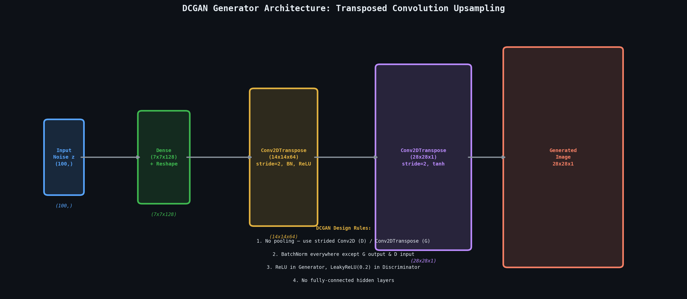
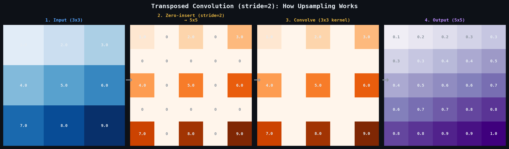
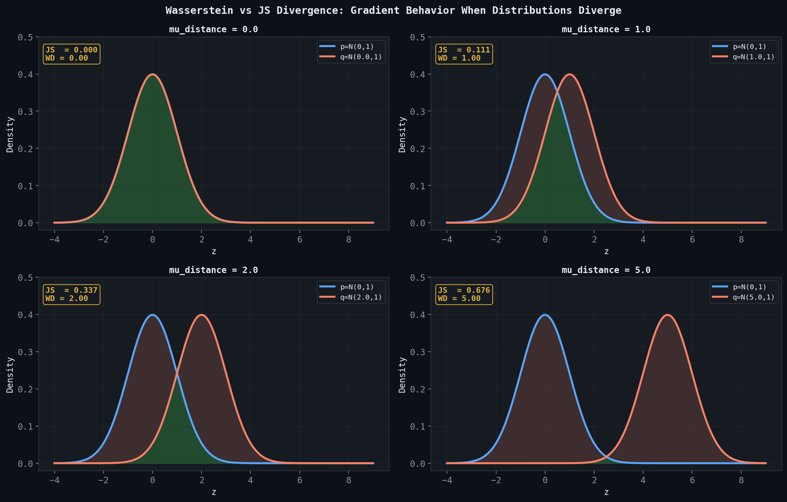

# 🖼️ Module 05: Deep Convolutional GANs & GAN Variants
> **Ch. 17 — Hands-On ML with Scikit-Learn, Keras & TensorFlow (Aurélien Géron)**

---

## 📌 Table of Contents
1. [Start Here: The Big Picture](#big-picture)
2. [Why Convolutions for GANs?](#why-conv)
3. [DCGAN Architecture Deep-Dive](#dcgan)
4. [Transposed Convolutions (Upsampling)](#transposed-conv)
5. [Progressive Growing of GANs (ProGAN)](#progan)
6. [Conditional GAN (cGAN)](#cgan)
7. [Wasserstein GAN (WGAN & WGAN-GP)](#wgan)
8. [StyleGAN Overview](#stylegan)
9. [Common Beginner Mistakes](#mistakes)
10. [Interview Q&A](#interview)
11. [⚡ One-Page Flash Card](#revision)

---

## 🌍 Start Here: The Big Picture {#big-picture}

> **TL;DR:** Deep Convolutional GANs (DCGANs) replace dense layers with convolutional and transposed convolutional layers, enabling photorealistic high-resolution image synthesis. Subsequent variants (WGAN, ProGAN, StyleGAN, cGAN) each solve a specific weakness of the original GAN: training instability, low resolution, lack of control, or limited diversity.

**The Real-World Analogy 🏗️:**
A basic GAN (dense layers) is like sculpting with your hands — crude shapes, low resolution. DCGAN is like using precision CNC machinery — complex spatial structures emerge automatically. ProGAN is like building a skyscraper floor-by-floor — start with a small stable structure and add detail. StyleGAN is like having a mixing board for artistic style — fine-grained control over content, layout, and texture independently.

---

## 🔍 1. Why Convolutions for GANs? {#why-conv}

Dense-layer GANs treat images as flat vectors — they **ignore spatial structure**:
- Pixel at (1,1) has no special relationship to pixel at (1,2) in a Dense layer.
- Dense layers scale badly: a 256×256 image = 65,536-dimensional flat vector.

Convolutional layers:
- **Parameter efficient**: share weights across spatial locations via convolution kernels.
- **Spatially aware**: explicitly model local pixel relationships (edges, textures, shapes).
- **Scale naturally**: same kernel works regardless of image size.

| Architecture | Generator | Discriminator | Output |
|---|---|---|---|
| Vanilla GAN | Dense layers | Dense layers | 28×28 blurry |
| DCGAN | Transposed Conv | Strided Conv | 64×64 sharp |
| ProGAN | Progressive TC | Progressive SC | 1024×1024 photorealistic |
| StyleGAN | Mapping Net + TC | — | 1024×1024 + control |

---

## 🔍 2. DCGAN Architecture Deep-Dive {#dcgan}

The **DCGAN** paper (Radford et al., 2015) established architectural guidelines that are still foundational:

### DCGAN Design Rules
1. **Replace pooling with strided convolutions** (Discriminator) and transposed convolutions (Generator) — let the network learn its own spatial downsampling/upsampling.
2. **Use Batch Normalization** in both G and D (except G's output layer and D's input layer).
3. **Use ReLU** in Generator (except final `tanh` output layer).
4. **Use LeakyReLU** in Discriminator (α = 0.2).
5. **No fully-connected hidden layers** — only convolutional layers.

### DCGAN Generator — Keras
```python
import tensorflow as tf
from tensorflow import keras

codings_size = 100

# ── DCGAN Generator ──
# Noise (100,) → Dense → Reshape → TransposeConv chain → 28×28×1 image
dcgan_generator = keras.Sequential([
    keras.layers.Dense(7 * 7 * 128),                            # 7×7 spatial @ 128 channels
    keras.layers.Reshape([7, 7, 128]),
    keras.layers.BatchNormalization(),
    keras.layers.Conv2DTranspose(64, kernel_size=5, strides=2,  # 14×14×64
                                  padding="same", activation="selu"),
    keras.layers.BatchNormalization(),
    keras.layers.Conv2DTranspose(1, kernel_size=5, strides=2,   # 28×28×1
                                  padding="same", activation="tanh"),
])

# ── DCGAN Discriminator ──
dcgan_discriminator = keras.Sequential([
    keras.layers.Conv2D(64, kernel_size=5, strides=2, padding="same"),  # 14×14×64
    keras.layers.LeakyReLU(alpha=0.2),
    keras.layers.Dropout(0.4),
    keras.layers.Conv2D(128, kernel_size=5, strides=2, padding="same"), # 7×7×128
    keras.layers.LeakyReLU(alpha=0.2),
    keras.layers.Dropout(0.4),
    keras.layers.Flatten(),
    keras.layers.Dense(1, activation="sigmoid")
])

dcgan_discriminator.compile(
    loss="binary_crossentropy",
    optimizer=keras.optimizers.RMSprop(learning_rate=0.0008, momentum=0.5),
    metrics=["accuracy"]
)

# ── Full DCGAN ──
dcgan_discriminator.trainable = False
dcgan_input = keras.Input(shape=[codings_size])
dcgan_output = dcgan_discriminator(dcgan_generator(dcgan_input))
dcgan = keras.Model(dcgan_input, dcgan_output)
dcgan.compile(
    loss="binary_crossentropy",
    optimizer=keras.optimizers.RMSprop(learning_rate=0.0004, momentum=0.5)
)
```


> 📊 **Graph 17:** DCGAN Generator architecture. Noise vector → Dense(7×7×128) → Reshape → Transposed Conv (×2) → 28×28 image. Each transposed convolution doubles spatial resolution. The diagram lists the core design rules.

---

## 🔍 3. Transposed Convolutions (Upsampling) {#transposed-conv}

Transposed convolutions (also called "deconvolutions" or "fractionally strided convolutions") are the **inverse of strided convolutions** — they upsample feature maps.

### How Transposed Conv2D Works (stride=2)
```
Input (7×7):          Output (14×14):
┌─────────┐           ┌───────────────────┐
│ 1  2    │  stride=2 │ 1  0  2  0        │
│ 3  4    │ ────────► │ 0  0  0  0        │
└─────────┘           │ 3  0  4  0        │
                      │ 0  0  0  0        │
                      └───────────────────┘
          Then convolve with learned kernel (fills zeros)
```

The key insight: `strides=2` in transposed conv **doubles** the spatial size at each step.


> 📊 **Graph 18:** Step-by-step upsampling via transposed convolution. 1. Input is a 3x3 matrix. 2. A stride of 2 zero-inserts spaces between elements, expanding to 5x5. 3. A 3x3 kernel slides over the padded matrix. 4. Output is an upsampled 5x5 feature map.

| Operation | Spatial Effect | Used In |
|---|---|---|
| `Conv2D(strides=2)` | Halves spatial size (downsampling) | Discriminator |
| `Conv2DTranspose(strides=2)` | Doubles spatial size (upsampling) | Generator |

> [!WARNING]
> Transposed convolutions can produce **checkerboard artifacts** — visible periodic grid patterns in generated images. This is caused by stride-2 upsampling with odd-sized kernels. Fix: use **bilinear upsampling + regular Conv2D** instead of `Conv2DTranspose`. Alternatively, use `kernel_size=4, stride=2` which divides evenly.

```python
# Alternative: UpSampling2D + Conv2D (avoids checkerboard artifacts)
keras.layers.UpSampling2D(size=(2, 2)),             # Nearest-neighbor upsampling
keras.layers.Conv2D(64, kernel_size=3, padding="same", activation="relu"),
```

---

## 🔍 4. Progressive Growing of GANs (ProGAN) {#progan}

**ProGAN** (Karras et al., 2018) achieves ultra-high-resolution (1024×1024) synthesis by starting with a tiny 4×4 image and gradually adding new layers:

```
Phase 1: Train on 4×4   images (quick, stable)
Phase 2: Fade in 8×8    resolution (smoothly blend new layers)
Phase 3: Fade in 16×16  resolution
...
Phase N: Fade in 1024×1024 resolution
```

### Why Progressive Training Works
- Early phases establish **global structure** (face shape, color) quickly.
- Later phases add **fine detail** (hair strands, pores) once the global structure is stable.
- Training at low resolutions is computationally cheap and fast to converge.
- Avoids the challenge of learning a 1024×1024 distribution from scratch.

> [!NOTE]
> ProGAN introduced several innovations used in modern GAN research:
> - **Minibatch Standard Deviation**: Adds a feature map to D that measures diversity of the batch → penalizes mode collapse.
> - **Equalized Learning Rate**: Scales weights at runtime to normalize gradient magnitudes across layers.
> - **Pixel-wise Normalization**: Normalizes activation vectors per pixel (instead of BatchNorm).

---

## 🔍 5. Conditional GAN (cGAN) {#cgan}

A **Conditional GAN** conditions both G and D on auxiliary information `y` (e.g., class label):

$$G(z, y) \rightarrow \text{Image of class } y$$
$$D(x, y) \rightarrow P(\text{real} | \text{class } y)$$

This gives **explicit control** over what the Generator produces.

```python
# Conditional Generator: concatenate one-hot label to noise
n_classes = 10  # MNIST digits

# Noise input
noise_input = keras.Input(shape=[codings_size])
# Label input (one-hot)
label_input = keras.Input(shape=[n_classes])

# Concatenate
combined = keras.layers.Concatenate()([noise_input, label_input])

x = keras.layers.Dense(150, activation="selu")(combined)
x = keras.layers.Dense(28 * 28, activation="tanh")(x)
output = keras.layers.Reshape([28, 28])(x)

conditional_generator = keras.Model([noise_input, label_input], output)

# Usage: generate a specific digit class
noise = tf.random.normal(shape=[5, codings_size])
labels = tf.one_hot([0, 1, 2, 3, 4], depth=n_classes)  # Generate digits 0-4
generated_images = conditional_generator([noise, labels])
# OUTPUT: 5 images, each of the specified digit class
```

### cGAN Variants
| Variant | Conditioning | Use Case |
|---|---|---|
| **cGAN** | Class labels | Class-specific generation |
| **Pix2Pix** | Paired images | Image-to-image translation (sketch → photo) |
| **CycleGAN** | Unpaired images | Domain transfer (horse → zebra) |
| **BigGAN** | Class + truncation trick | Large-scale class-conditional generation |

---

## 🔍 6. Wasserstein GAN (WGAN & WGAN-GP) {#wgan}

Standard GAN training uses **Jensen-Shannon (JS) divergence** as the implicit distance measure between real and generated distributions. JS divergence has a critical flaw: when distributions don't overlap (common early in training), **gradients vanish completely**.

### WGAN: Earth Mover's Distance
WGAN uses the **Wasserstein-1 (Earth Mover's) distance**:

$$W(p_{\text{data}}, p_G) = \inf_{\gamma \in \Pi} \mathbb{E}_{(x,y)\sim\gamma}[\|x - y\|]$$

Intuition: "How much 'earth' (probability mass) needs to be moved, and how far, to transform `p_G` into `p_data`?"

**Why it's better**:
- Provides **non-zero gradients** even when distributions are disjoint.
- More interpretable loss: lower = better generated quality (approximately).
- Smoother training dynamics.


> 📊 **Graph 19:** Why WGAN is better. As the distance between the generated (orange) and real (blue) distributions increases, the JS divergence (used by standard GANs) flattens out to `ln(2)` — meaning gradients vanish completely. The Wasserstein distance (Earth Mover's) scales linearly with distance, providing a constant, meaningful gradient even when distributions are completely disjoint.

### WGAN Requirements
The **Critic** (renamed from Discriminator; outputs unbounded real values, no sigmoid):
1. Must be **1-Lipschitz**: `|f(x) - f(y)| ≤ |x - y|` for all `x, y`.
2. Original WGAN enforces this via **weight clipping** (clip to `[-c, c]`).
3. WGAN-GP enforces via a **gradient penalty** (preferred):

$$\mathcal{L}_{WGAN-GP} = \mathbb{E}[\text{Critic}(G(z))] - \mathbb{E}[\text{Critic}(x)] + \lambda \mathbb{E}\left[(\|\nabla_{\hat{x}} \text{Critic}(\hat{x})\|_2 - 1)^2\right]$$

```python
# WGAN Critic (no sigmoid, outputs unbounded real values)
wgan_critic = keras.Sequential([
    keras.layers.Flatten(),
    keras.layers.Dense(150, activation="selu"),
    keras.layers.Dense(100, activation="selu"),
    keras.layers.Dense(1),   # No activation — unbounded critic score
])

# WGAN Loss (non-standard — custom training loop required)
# Critic loss = mean(critic(fakes)) - mean(critic(reals))   (want to maximize)
# Generator loss = -mean(critic(G(z)))                      (want to minimize)
```

> [!IMPORTANT]
> WGAN trains the **Critic multiple times** (typically 5×) per Generator update. This keeps the Critic accurate (near the Lipschitz constraint optimum) before updating G. Never train G more frequently than the Critic in WGAN.

---

## 🔍 7. StyleGAN Overview {#stylegan}

**StyleGAN** (Karras et al., 2019) introduced a radically different Generator architecture enabling unprecedented control over image style:

```
Latent z ──► Mapping Network (8 Dense layers) ──► w ∈ W space
                                                      │
                                          ┌───────────▼──────────────┐
                                          │  Adaptive Instance Norm  │ ← w (per layer)
Learned Constant 4×4 ──► Conv → AdaIN → Conv → AdaIN → ... → 1024×1024
             ↑                              ↑
    Per-layer Gaussian Noise         (controls style at each resolution)
```

### Key StyleGAN Innovations
| Innovation | Effect |
|---|---|
| **Mapping Network** | Maps `z → w` in a less entangled latent space |
| **Adaptive Instance Normalization (AdaIN)** | Injects `w` as per-channel mean/std → controls style |
| **Per-layer Noise** | Adds stochastic detail (hair, skin texture) |
| **Style Mixing** | Use different `w` vectors at different resolutions → swap coarse/fine style |
| **W+ Space** | Independently control `w` per layer → richer editing |

> [!NOTE]
> StyleGAN2 removed AdaIN's normalization artifact (water-droplet blob) by redesigning the normalization. StyleGAN3 further improved equivariance to translation/rotation. These are **research-level architectures** — for practical use, pre-trained checkpoints (e.g., from NVIDIA) are used directly.

---

## ❌ Common Beginner Mistakes {#mistakes}

**1. "Using BatchNorm in D's input layer or G's output layer"** ❌
> DCGAN's design rules explicitly exclude BatchNorm at:
> - **D's input**: BN would normalize real and fake images differently → leaks statistical info about which batch they came from.
> - **G's output**: BN would distort the final `tanh` pixel outputs.
> Follow the rule: BN everywhere except these two locations.

**2. "Using ReLU instead of LeakyReLU in the Discriminator"** ❌
> ReLU kills all negative activations (dead neurons), particularly harmful in D since it receives many negative signals from fake images. LeakyReLU(α=0.2) passes a small fraction `0.2x` for negative inputs, keeping gradients alive throughout the network.

**3. "Setting stride=2 kernel_size=3 in Conv2DTranspose (checkerboard)"** ❌
> `kernel_size=3` with `stride=2` causes uneven overlap in transposed convolutions → checkerboard artifacts. Use `kernel_size=4` (divides evenly with stride=2), or switch to `UpSampling2D + Conv2D`.

**4. "Clipping weights in WGAN to large values"** ❌
> Large clip values (e.g., `c=10.0`) allow the Critic to violate the Lipschitz constraint, causing the same training instability as standard GANs. Use small clip values (`c=0.01`) or prefer WGAN-GP which avoids clipping altogether.

---

## 🎤 Interview Q&A {#interview}

**Q1: What is the fundamental architectural improvement of DCGAN over vanilla GAN?**
> **A:** DCGAN replaces fully-connected layers with:
> - **Generator**: `Dense → Reshape → [BatchNorm → ReLU → Conv2DTranspose] × N → tanh`
> - **Discriminator**: `[Conv2D(stride=2) → BatchNorm → LeakyReLU] × N → Dense(1, sigmoid)`
>
> This enables:
> 1. **Spatial hierarchy**: convolutions learn increasingly complex spatial features (edges → textures → objects).
> 2. **Parameter efficiency**: conv layers share weights across spatial locations.
> 3. **No pooling**: strided convolutions learn to downsample/upsample, preserving gradient flow.
> 4. **BatchNorm**: stabilizes training by normalizing activations between layers.

**Q2: Why does WGAN solve the vanishing gradient problem of standard GANs?**
> **A:** In standard GANs, the loss is based on JS divergence. When `p_G` and `p_data` are disjoint (early in training, when G produces obvious fakes), JS divergence is exactly `log 2` — a constant — so its **gradient is zero**. G receives no training signal.
>
> WGAN uses Earth Mover's (Wasserstein-1) distance, which remains non-zero and finite even when distributions are completely disjoint. The Wasserstein distance provides a **meaningful gradient** proportional to how far apart the distributions are, so G always has a useful learning signal, even when it produces terrible fakes early in training.

**Q3: Explain the difference between cGAN, Pix2Pix, and CycleGAN. When would you use each?**
> **A:**
> | | cGAN | Pix2Pix | CycleGAN |
> |---|---|---|---|
> | **Conditioning** | Class labels `y` | Paired source images | Unpaired domain images |
> | **Training data** | Images + labels | Paired `{source, target}` | Two unpaired image collections |
> | **Control** | Generate class `y` | Map any input to styled output | Transfer domain style |
> | **Use case** | Digit "5" generation | Sketch → photo | Horse → Zebra |
> | **Data need** | Easy to get | Hard (paired data rare) | Easy (unpaired) |
>
> **Pix2Pix** requires expensive paired data (e.g., architectural photos + corresponding semantic maps). **CycleGAN** makes this feasible when only unpaired collections are available, using a *cycle-consistency loss*: `F(G(x)) ≈ x` — translating X→Y→X should recover X.

---

## ⚡ One-Page Flash Card {#revision}

```
╔══════════════════════════════════════════════════════════════════╗
║          MODULE 05 — DCGAN & GAN VARIANTS                        ║
╠══════════════════════════════════════════════════════════════════╣
║                                                                  ║
║  DCGAN RULES:                                                    ║
║  G: Dense→Reshape→[BN→ReLU→Conv2DTranspose]×N→tanh              ║
║  D: [Conv2D(stride=2)→BN→LeakyReLU(0.2)]×N→Dense(1,sigmoid)    ║
║  → NO pooling. NO FC hidden layers. BN except G-out & D-in.     ║
║                                                                  ║
║  TRANSPOSED CONV:                                                ║
║  - Conv2DTranspose(strides=2) → doubles spatial size            ║
║  - Checkerboard fix: UpSampling2D + Conv2D instead               ║
║  - Use kernel_size=4 with stride=2 to avoid artifacts           ║
║                                                                  ║
║  GAN VARIANTS:                                                   ║
║  - cGAN: condition on labels → class-specific generation         ║
║  - WGAN: Earth Mover's distance → no vanishing gradients         ║
║  - WGAN-GP: gradient penalty (better than weight clipping)       ║
║  - ProGAN: progressive resolution → 1024×1024                   ║
║  - StyleGAN: mapping net + AdaIN → disentangled style control   ║
║                                                                  ║
║  WGAN CRITIC:                                                    ║
║  - No sigmoid (unbounded output)                                 ║
║  - Train Critic 5× per Generator update                          ║
║  - Loss: mean(Critic(fakes)) - mean(Critic(reals))               ║
╚══════════════════════════════════════════════════════════════════╝
```

---

**🔗 Previous Module →** [04_Generative_Adversarial_Networks.md](04_Generative_Adversarial_Networks.md)
**🔗 Next Module →** [06_Diffusion_Models.md](06_Diffusion_Models.md)
