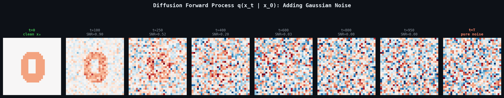
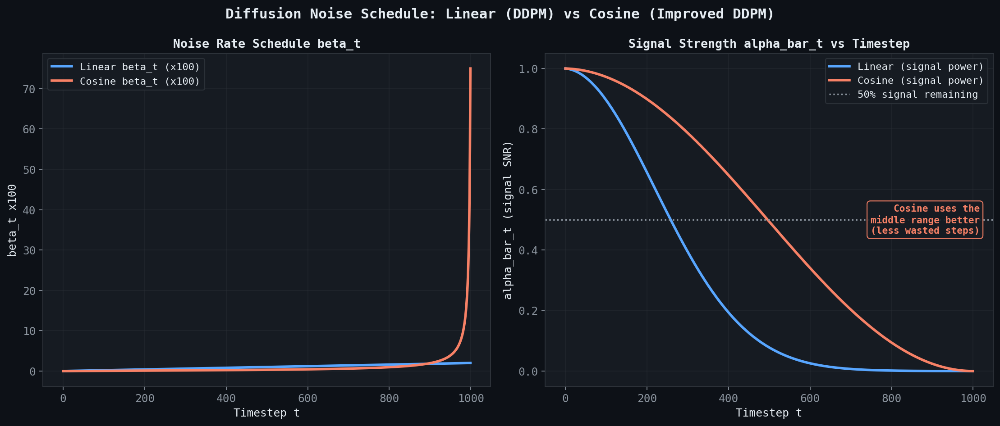
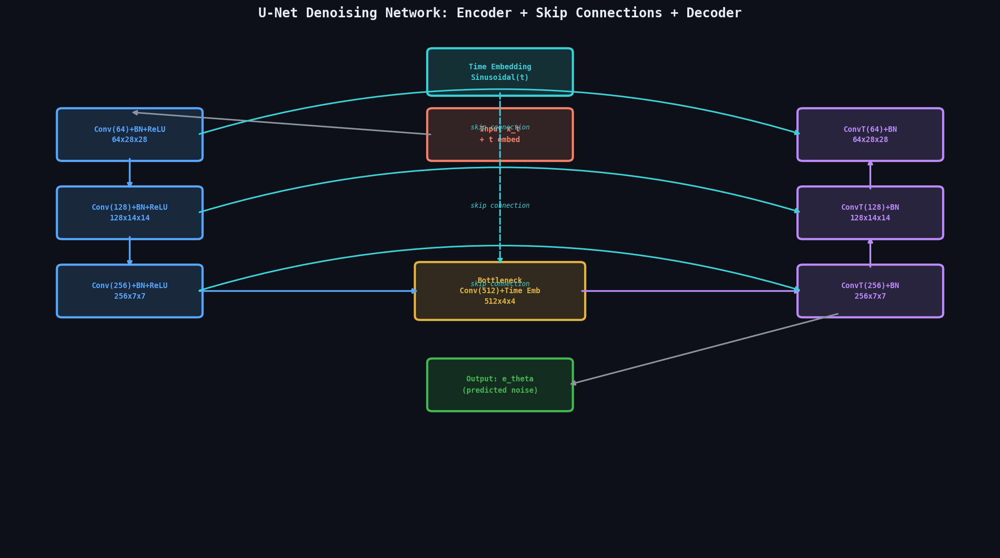
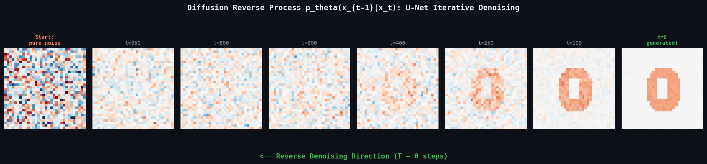
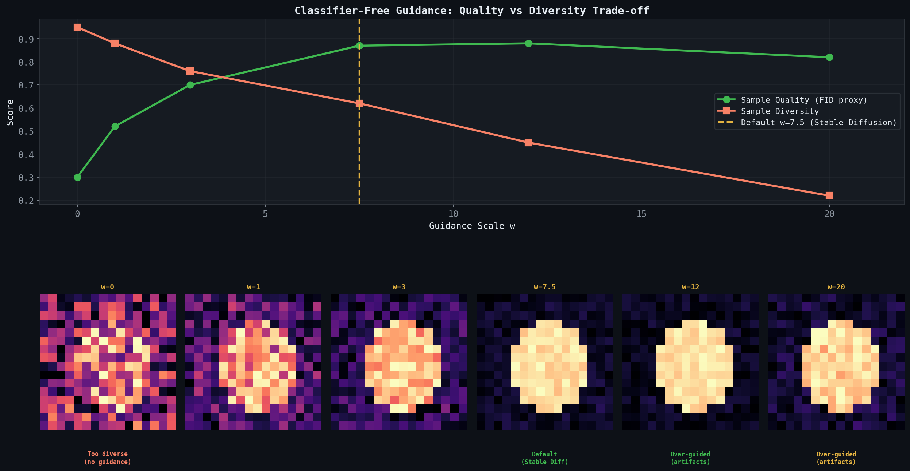

# 🌊 Module 06: Diffusion Models
> **Ch. 17 — Hands-On ML with Scikit-Learn, Keras & TensorFlow (Aurélien Géron)**

---

## 📌 Table of Contents
1. [Start Here: The Big Picture](#big-picture)
2. [The Core Idea: Forward & Reverse Processes](#core-idea)
3. [Forward Process: Adding Noise (q)](#forward-process)
4. [The Noise Schedule](#noise-schedule)
5. [Reverse Process: Denoising (p_θ)](#reverse-process)
6. [Training Objective: Predict the Noise](#training-objective)
7. [The Denoising Network (U-Net Architecture)](#unet)
8. [Sampling (Inference)](#sampling)
9. [Classifier-Free Guidance (Conditional Generation)](#cfg)
10. [Diffusion vs GANs vs VAEs](#comparison)
11. [Common Beginner Mistakes](#mistakes)
12. [Interview Q&A](#interview)
13. [⚡ One-Page Flash Card](#revision)

---

## 🌍 Start Here: The Big Picture {#big-picture}

> **TL;DR:** Diffusion models learn to generate data by learning to *reverse* a process that gradually adds Gaussian noise to a clean image over `T` timesteps until it becomes pure noise. At inference, the model starts from random noise and iteratively denoises it over `T` steps to produce a realistic image. This approach is now the state-of-the-art for image, audio, and video generation.

**The Real-World Analogy 🧊→💧→🌊:**
Imagine dropping an ice cube into warm water. Over time (`T` steps), it melts into a puddle of formless water molecules (pure noise). A diffusion model learns to *run this process in reverse* — starting from random warm water and predicting exactly how to refreeze it, step by step, into a perfect ice sculpture. The model never directly creates the sculpture; it only learns to *remove a tiny amount of disorder at each step*.

---

## 🔍 1. The Core Idea: Forward & Reverse Processes {#core-idea}

Diffusion models define two Markov chains:

```
FORWARD PROCESS q (fixed, no learning):
x₀ (real image) → x₁ (slightly noisy) → x₂ (noisier) → ... → xT (pure noise ≈ N(0,I))

REVERSE PROCESS p_θ (learned, the model):
xT (pure noise) → xT-1 (slightly less noisy) → ... → x₁ → x₀ (generated image)
```

The model only needs to learn the **reverse process** — how to remove a small amount of noise at each step.

> [!IMPORTANT]
> **The key insight**: The forward process `q(xₜ|xₜ₋₁)` is a **fixed**, hand-designed Gaussian noise process (no parameters). Only the reverse process `p_θ(xₜ₋₁|xₜ)` is learned. This is what makes diffusion models stable and much easier to train than GANs.

---

## 🔍 2. Forward Process: Adding Noise {#forward-process}

At each step `t`, we add a small amount of Gaussian noise:

$$q(x_t | x_{t-1}) = \mathcal{N}(x_t;\; \sqrt{1 - \beta_t}\, x_{t-1},\; \beta_t \mathbf{I})$$

Where `βₜ` is the **noise schedule** — how much noise to add at step `t`.

### Closed-Form Sampling at Any Timestep
A critical mathematical convenience: we can sample `xₜ` at **any timestep** directly from `x₀` without simulating all intermediate steps:

$$q(x_t | x_0) = \mathcal{N}(x_t;\; \sqrt{\bar{\alpha}_t}\, x_0,\; (1 - \bar{\alpha}_t)\mathbf{I})$$

Where:
$$\alpha_t = 1 - \beta_t, \quad \bar{\alpha}_t = \prod_{s=1}^{t} \alpha_s$$

In code:
```python
import numpy as np

def q_sample(x0, t, alphas_bar, noise=None):
    """Sample x_t from x_0 at any timestep t directly."""
    if noise is None:
        noise = tf.random.normal(shape=tf.shape(x0))
    sqrt_alpha_bar = tf.sqrt(alphas_bar[t])
    sqrt_one_minus_alpha_bar = tf.sqrt(1.0 - alphas_bar[t])
    # Rearrange for broadcasting: [batch, 1, 1, 1]
    sqrt_alpha_bar = tf.reshape(sqrt_alpha_bar, [-1, 1, 1, 1])
    sqrt_one_minus_alpha_bar = tf.reshape(sqrt_one_minus_alpha_bar, [-1, 1, 1, 1])
    return sqrt_alpha_bar * x0 + sqrt_one_minus_alpha_bar * noise
    # x_t = √ᾱ_t · x₀ + √(1-ᾱ_t) · ε,   ε ~ N(0,I)
```


> 📊 **Graph 21:** Forward diffusion process across T=1000 timesteps. Row shows the same image progressively corrupted from x₀ (clean) to x₁₀₀₀ (pure Gaussian noise). The SNR (signal-to-noise ratio) degrades at each step.

---

## 🔍 3. The Noise Schedule {#noise-schedule}

The noise schedule `{βₜ}` controls *how fast* the signal is destroyed:

| Schedule Type | Formula | Property |
|---|---|---|
| **Linear** (original DDPM) | `β_t` grows linearly from `β₁=1e-4` to `β_T=0.02` | Simple, but suboptimal at high T |
| **Cosine** (improved DDPM) | `ᾱ_t = cos²(...)` | Smoother, better for larger images |
| **Sigmoid** | Custom S-curve | Used in Stable Diffusion v3 |

```python
# Linear noise schedule (T=1000)
T = 1000
betas = np.linspace(1e-4, 0.02, T, dtype=np.float32)  # β₁ to β_T
alphas = 1.0 - betas                                    # αₜ = 1 - βₜ
alphas_bar = np.cumprod(alphas)                         # ᾱₜ = Π αₛ for s=1..t

# ᾱ at key timesteps:
# t=0:    ᾱ₀ ≈ 1.0   (original image preserved)
# t=250:  ᾱ₂₅₀ ≈ 0.5 (half signal, half noise)
# t=1000: ᾱ₁₀₀₀ ≈ 0  (pure noise)
print(f"ᾱ at t=0: {alphas_bar[0]:.4f}")     # OUTPUT: ᾱ at t=0: 0.9999
print(f"ᾱ at t=500: {alphas_bar[499]:.4f}") # OUTPUT: ᾱ at t=500: 0.0590
print(f"ᾱ at t=999: {alphas_bar[999]:.6f}") # OUTPUT: ᾱ at t=999: 0.000004
```


> 📊 **Graph 20:** Linear vs Cosine noise schedules. The linear schedule (blue) destroys the signal (alpha_bar_t) too quickly, reaching near-zero signal by step 400. The cosine schedule (orange) decays smoothly, using the entire 1000-step budget much more efficiently.

> [!TIP]
> Use a **cosine schedule** for best results. The linear schedule destroys information too quickly at low timesteps and too slowly near `t=T`, wasting capacity. The cosine schedule spends more training effort in the informative middle range.

---

## 🔍 4. Reverse Process: Learning to Denoise {#reverse-process}

The reverse process is a learned Markov chain:

$$p_\theta(x_{t-1} | x_t) = \mathcal{N}(x_{t-1};\; \mu_\theta(x_t, t),\; \Sigma_\theta(x_t, t))$$

The model `θ` must predict `μ_θ` (the mean of the denoised image at step `t-1`).

### Ho et al. (2020) — Key Simplification
Instead of directly predicting `μ_θ(xₜ, t)`, it's equivalent (and more stable) to predict the **noise** `ε` that was added:

$$\mu_\theta(x_t, t) = \frac{1}{\sqrt{\alpha_t}}\left(x_t - \frac{\beta_t}{\sqrt{1 - \bar{\alpha}_t}} \epsilon_\theta(x_t, t)\right)$$

So the model simply learns: **"Given a noisy image `xₜ` at timestep `t`, predict the original noise `ε` that was added."**

---

## 🔍 5. Training Objective: Predict the Noise {#training-objective}

The full training objective (simplified ELBO):

$$\mathcal{L}_{\text{simple}} = \mathbb{E}_{t, x_0, \varepsilon}\left[\|\varepsilon - \varepsilon_\theta(\underbrace{\sqrt{\bar{\alpha}_t} x_0 + \sqrt{1-\bar{\alpha}_t}\varepsilon}_{x_t},\; t)\|^2\right]$$

In plain English: "At each training step, pick a random image `x₀`, a random timestep `t`, and random noise `ε`. Compute the noisy image `xₜ`. Ask the model to predict `ε` from `xₜ` and `t`. Minimize the MSE."

```python
def compute_diffusion_loss(model, x0, t, alphas_bar):
    """Training loss for DDPM."""
    noise = tf.random.normal(shape=tf.shape(x0))
    # Compute noisy image at timestep t
    x_t = q_sample(x0, t, alphas_bar, noise)
    # Model predicts the noise
    noise_pred = model([x_t, t], training=True)
    # MSE loss between true noise and predicted noise
    return tf.reduce_mean(tf.square(noise - noise_pred))
```

### Training Loop
```python
optimizer = keras.optimizers.Adam(learning_rate=2e-4)

@tf.function
def train_step(x0):
    batch_size = tf.shape(x0)[0]
    # Random timestep for each sample in the batch
    t = tf.random.uniform(shape=[batch_size], minval=0, maxval=T, dtype=tf.int32)

    with tf.GradientTape() as tape:
        loss = compute_diffusion_loss(denoising_model, x0, t, alphas_bar)

    grads = tape.gradient(loss, denoising_model.trainable_variables)
    optimizer.apply_gradients(zip(grads, denoising_model.trainable_variables))
    return loss

for epoch in range(n_epochs):
    for batch in dataset:
        loss = train_step(batch)
    print(f"Epoch {epoch+1} | Loss: {loss.numpy():.4f}")
# OUTPUT: Epoch 100 | Loss: 0.0082  (MSE between true and predicted noise)
```

---

## 🔍 6. The Denoising Network — U-Net Architecture {#unet}

The denoising model `ε_θ(xₜ, t)` needs to:
1. Take a **noisy image** `xₜ` and **timestep** `t` as input.
2. Output a **noise prediction** of the same shape as `xₜ`.

The canonical choice is a **U-Net** with timestep embedding:

```
xₜ (28×28×1)
     │
  ┌──▼─────────────────────────────────────────────┐  ENCODER
  │ Conv 64 + TimeEmbed  →  [28×28×64]              │ (downsampling)
  │ Conv 128 + TimeEmbed →  [14×14×128]             │
  │ Conv 256 + TimeEmbed →  [7×7×256]               │
  └──────────────────────────────────────┬──────────┘
                    Bottleneck (7×7×256) │
  ┌──────────────────────────────────────▼──────────┐  DECODER
  │ TranspConv 128 + Skip [14×14×128] + TimeEmbed   │ (upsampling +
  │ TranspConv 64  + Skip [28×28×64]  + TimeEmbed   │  skip connections)
  │ Conv 1  →  [28×28×1]  (predicted noise ε)       │
  └─────────────────────────────────────────────────┘
```

### Why U-Net?
- **Skip connections** preserve high-frequency spatial detail lost during downsampling.
- The encoder captures semantic context; the decoder uses skip connections to restore precise spatial location.
- **Timestep embedding**: `t` is embedded via a sinusoidal encoding (same as Transformer positional encoding) and added to each layer's feature maps — tells the model "how much noise was added."

### Timestep Sinusoidal Embedding
```python
class TimeEmbedding(keras.layers.Layer):
    def __init__(self, embed_dim, **kwargs):
        super().__init__(**kwargs)
        self.embed_dim = embed_dim

    def call(self, t):
        half_dim = self.embed_dim // 2
        # Sinusoidal encoding (same as Transformer positional encoding)
        emb = tf.math.log(10000.0) / (half_dim - 1)
        emb = tf.exp(tf.range(half_dim, dtype=tf.float32) * -emb)
        emb = tf.cast(t[:, None], tf.float32) * emb[None, :]
        emb = tf.concat([tf.sin(emb), tf.cos(emb)], axis=-1)
        return emb  # Shape: [batch, embed_dim]
```


> 📊 **Graph 23:** U-Net Denoising Architecture. The noisy input `x_t` is downsampled by the encoder, then upsampled by the decoder. Skip connections preserve spatial detail. Crucially, the sinusoidal timestep embedding `t` is added to every block so the network knows how much noise to expect.


> 📊 **Graph 22:** Reverse diffusion process — U-Net iteratively removes noise over T steps. Left = pure Gaussian noise (xT). Right = clean generated image (x₀).

---

## 🔍 7. Sampling (Inference) {#sampling}

At inference, start from `xT ~ N(0, I)` and iteratively denoise using the DDPM update rule:

$$x_{t-1} = \frac{1}{\sqrt{\alpha_t}}\left(x_t - \frac{\beta_t}{\sqrt{1-\bar{\alpha}_t}}\,\varepsilon_\theta(x_t, t)\right) + \sqrt{\beta_t}\,z, \quad z \sim \mathcal{N}(0, I)$$

```python
def ddpm_sample(model, shape, T, alphas, betas, alphas_bar):
    """Generate a sample by running the full reverse diffusion chain."""
    # Start from pure noise
    x = tf.random.normal(shape=shape)   # x_T

    for t in reversed(range(T)):
        t_batch = tf.fill([shape[0]], t)

        # Predict noise at this timestep
        noise_pred = model([x, t_batch], training=False)

        # Compute the mean of p_θ(x_{t-1} | x_t)
        alpha_t = alphas[t]
        alpha_bar_t = alphas_bar[t]
        beta_t = betas[t]

        coeff = beta_t / tf.sqrt(1.0 - alpha_bar_t)
        mean = (1.0 / tf.sqrt(alpha_t)) * (x - coeff * noise_pred)

        # Add noise (except at last step t=0)
        if t > 0:
            z = tf.random.normal(shape=tf.shape(x))
            x = mean + tf.sqrt(beta_t) * z
        else:
            x = mean   # Final step: no additional noise

    return x   # x_0: generated image

# Generate 16 images
generated = ddpm_sample(denoising_model, shape=[16, 28, 28, 1], T=T,
                         alphas=alphas, betas=betas, alphas_bar=alphas_bar)
# OUTPUT: (16, 28, 28, 1) tensor of generated MNIST-like images
```

> [!WARNING]
> DDPM sampling requires **T=1000 sequential model forward passes** — extremely slow at inference (several minutes per image on CPU). Use **DDIM** (Denoising Diffusion Implicit Models) to sample in 50 steps with comparable quality by skipping timesteps.

### DDIM: Faster Sampling
```python
# DDIM: Sample only a subset of timesteps (e.g., 50 out of 1000)
ddim_steps = list(range(0, T, T // 50))   # [0, 20, 40, ..., 980]
# Use the same DDPM-trained model — no retraining needed!
# DDIM changes only the sampling formula, not the model or training.
```

---

## 🔍 8. Classifier-Free Guidance (Conditional Generation) {#cfg}

**Classifier-Free Guidance (CFG)** enables conditional generation (e.g., "generate a dog") without requiring a separate classifier:

The model is trained with **both conditional and unconditional** objectives:
- 10% of training: class label `c` is dropped (unconditional: `c = ∅`)
- 90% of training: class label `c` is provided (conditional)

At inference, the noise prediction is blended:

$$\tilde{\varepsilon}_\theta(x_t, t, c) = \varepsilon_\theta(x_t, t, \emptyset) + w \cdot \left(\varepsilon_\theta(x_t, t, c) - \varepsilon_\theta(x_t, t, \emptyset)\right)$$

Where `w` is the **guidance scale** (typically 7–10 for text-to-image):
- `w = 0`: unconditional (diverse, lower quality)
- `w = 1`: standard conditional
- `w = 7–15`: high guidance (sharper, more class-adherent, less diverse)

```python
# CFG sampling
def cfg_sample(model, condition, guidance_scale=7.5, T=1000, shape=...):
    x = tf.random.normal(shape=shape)
    null_condition = get_null_embedding()   # Empty/null class embedding

    for t in reversed(range(T)):
        t_batch = tf.fill([shape[0]], t)
        # Two model passes: conditional and unconditional
        eps_cond   = model([x, t_batch, condition], training=False)
        eps_uncond = model([x, t_batch, null_condition], training=False)
        # CFG blending
        eps_guided = eps_uncond + guidance_scale * (eps_cond - eps_uncond)
        # DDPM update with guided noise prediction
        x = ddpm_step(x, t, eps_guided, alphas, betas, alphas_bar)

    return x
```


> 📊 **Graph 24:** CFG Quality vs Diversity trade-off. As guidance scale `w` increases, image quality improves (it adheres strictly to the prompt), but diversity drops. If `w` is too high (>12), the image becomes deep-fried and artifact-heavy. The default for Stable Diffusion is `w=7.5`.

> [!NOTE]
> **Stable Diffusion**, **DALL-E 2**, and **Imagen** all use classifier-free guidance. The text prompt is encoded into `c` via a text encoder (e.g., CLIP or T5), and the guidance scale controls how strongly the output adheres to the prompt vs. being creative/diverse.

---

## 🔍 9. Diffusion vs GANs vs VAEs {#comparison}

| Property | VAE | GAN | Diffusion |
|---|---|---|---|
| **Training stability** | ✅ Very stable | ❌ Mode collapse, oscillation | ✅ Very stable |
| **Sample quality** | ❌ Blurry | ✅ Sharp | ✅✅ Ultra-sharp |
| **Sample diversity** | ✅ Good | ❌ Mode collapse | ✅✅ Excellent |
| **Log-likelihood** | ✅ Tractable ELBO | ❌ Not tractable | ✅ Tractable ELBO |
| **Inference speed** | ✅ Single forward pass | ✅ Single forward pass | ❌ T=1000 steps (slow) |
| **Conditional generation** | ✅ Easy | ✅ cGAN | ✅✅ CFG |
| **Latent space editing** | ✅ Smooth interpolation | ⚠️ W-space (StyleGAN) | ⚠️ DDIM inversion |
| **SOTA status** | 2013-2017 | 2018-2021 | **2022–present** |

> [!IMPORTANT]
> Diffusion models are now the **dominant paradigm** for generative AI (Stable Diffusion, Midjourney, Sora). Their training stability and diversity advantages over GANs make them the preferred choice for new generative systems. The main remaining weakness is **slow inference speed**, being actively addressed by distillation (Consistency Models, LCM) and fewer-step samplers (DDIM, DPM-Solver).

---

## ❌ Common Beginner Mistakes {#mistakes}

**1. "Running the full T=1000 sampling loop at inference"** ❌
> This takes minutes per image. Use **DDIM** or **DPM-Solver** for 10–50 step sampling with comparable quality. These require no retraining — only a different sampling formula applied to the same trained model.

**2. "Forgetting to condition the U-Net on timestep t"** ❌
> Without timestep conditioning, the model sees the same noisy image `xₜ` at all timesteps but doesn't know whether it's at `t=10` (almost clean) or `t=990` (almost pure noise). The denoising prediction would be wildly incorrect. Always embed `t` and add it to every U-Net layer's feature maps.

**3. "Using BCE instead of MSE for the noise prediction loss"** ❌
> The denoising loss is **MSE on noise values** `ε ∈ ℝ` (unbounded real numbers). BCE requires outputs in [0,1] (probabilities). Using BCE here makes no mathematical sense and produces incorrect gradients.

**4. "Sampling without adding noise in intermediate steps"** ❌
> The DDPM reverse step includes stochastic noise `√βₜ · z` for `t > 0`. Removing it (making sampling fully deterministic) degrades sample quality and diversity. Only the final step (`t=0`) should be noise-free. DDIM is the correct way to achieve deterministic sampling — it re-derives the update rule from scratch.

**5. "Setting guidance scale w too high"** ❌
> Very high guidance scales (w > 15) produce **over-saturated, artifact-heavy** images. The model adheres too strictly to the condition and sacrifices realism. Sweet spot for text-to-image: `w = 7.5` (Stable Diffusion default).

---

## 🎤 Interview Q&A {#interview}

**Q1: Explain the DDPM training objective. Why do we predict noise instead of the clean image?**
> **A:** The DDPM training objective is:
> $$\mathcal{L} = \mathbb{E}_{t, x_0, \varepsilon}\left[\|\varepsilon - \varepsilon_\theta(x_t, t)\|^2\right]$$
> We predict the added noise `ε` rather than `x₀` directly for several reasons:
> 1. **Scale invariance**: The noise magnitude is bounded by `N(0,I)`, while `x₀` can have arbitrary scale and range. Predicting `ε` is better conditioned.
> 2. **Equivalent formulation**: Predicting `ε` is mathematically equivalent to predicting `x₀` (you can derive one from the other using the reparameterization formula), but empirically predicting `ε` converges faster and produces better samples.
> 3. **Denoising interpretation**: The model learns the *structure* of natural images by learning what noise looks unnatural — a powerful implicit generative prior.

**Q2: What is the reparameterization in diffusion models? How does it enable direct sampling at any timestep?**
> **A:** Using the noise schedule, any noisy image `xₜ` can be expressed directly from `x₀`:
> $$x_t = \sqrt{\bar{\alpha}_t}\, x_0 + \sqrt{1-\bar{\alpha}_t}\, \varepsilon, \quad \varepsilon \sim \mathcal{N}(0,I)$$
> This is the "closed-form forward process" — we don't need to simulate `t` sequential noise-addition steps; we can compute `xₜ` for any `t` with **one matrix operation**. This is critical for efficient training: we can sample a random `t` for each training example and compute `xₜ` instantly, rather than running the full `t`-step simulation.

**Q3: Compare Diffusion Models and GANs as generative frameworks. When would you still choose a GAN?**
> **A:** 
> **Diffusion advantages**: Training stability (no adversarial collapse), superior sample diversity and quality, well-calibrated likelihoods.
> **GAN advantages**:
> 1. **Speed**: Single forward pass to generate (GAN: milliseconds; Diffusion: seconds to minutes).
> 2. **Latent manipulation**: StyleGAN's disentangled W-space enables precise semantic editing of faces (age, expression, hairstyle) — diffusion editing requires DDIM inversion which is less precise.
> 3. **Video generation (historically)**: Temporal coherence in video GANs (StyleGAN-V) is faster to achieve than diffusion-based video.
>
> **Choose GANs when**: Real-time generation is required (game assets, streaming), or when precise latent space manipulation is needed. **Choose Diffusion when**: Maximum quality and diversity is the priority (image/audio synthesis, research).

**Q4: What is Classifier-Free Guidance and how does it differ from Classifier Guidance?**
> **A:**
> **Classifier Guidance** (original approach): Requires training a **separate noise-aware classifier** `p_φ(c|xₜ)` for every target class. Gradient of the classifier guides the reverse diffusion toward class `c`. Limitation: must train and maintain a separate classifier for each use case.
>
> **Classifier-Free Guidance (CFG)** (Ho & Salimans, 2022): No separate classifier needed. The denoising network itself learns both conditional and unconditional predictions. At inference, the guided noise estimate is:
> $$\tilde{\varepsilon} = \varepsilon_{\text{uncond}} + w \cdot (\varepsilon_{\text{cond}} - \varepsilon_{\text{uncond}})$$
> This is **simpler, more flexible**, and performs better in practice. All major text-to-image models (Stable Diffusion, DALL-E 2, Imagen) use CFG. The guidance scale `w` provides a quality-diversity tradeoff knob.

---

## ⚡ One-Page Flash Card {#revision}

```
╔══════════════════════════════════════════════════════════════════╗
║                  MODULE 06 — DIFFUSION MODELS                    ║
╠══════════════════════════════════════════════════════════════════╣
║                                                                  ║
║  FORWARD PROCESS (fixed, no learning):                           ║
║  q(xₜ|xₜ₋₁) = N(√(1-βₜ)·xₜ₋₁, βₜ·I)                          ║
║  Shortcut: xₜ = √ᾱₜ·x₀ + √(1-ᾱₜ)·ε,  ε~N(0,I)                ║
║                                                                  ║
║  TRAINING OBJECTIVE:                                             ║
║  L = MSE(ε, ε_θ(xₜ, t))   — predict the added noise!           ║
║  Random t per batch sample  (efficient single-step sampling)     ║
║                                                                  ║
║  REVERSE STEP (inference):                                       ║
║  x_{t-1} = 1/√αₜ · (xₜ - βₜ/√(1-ᾱₜ)·ε_θ) + √βₜ·z            ║
║  T=1000 steps DDPM  or  50 steps DDIM (faster)                  ║
║                                                                  ║
║  ARCHITECTURE:                                                   ║
║  U-Net with sinusoidal timestep embedding (like Transformer PE)  ║
║  Skip connections + downsampling/upsampling blocks               ║
║                                                                  ║
║  CONDITIONAL GENERATION (CFG):                                   ║
║  ε_guided = ε_uncond + w·(ε_cond - ε_uncond)                    ║
║  w=7.5 (Stable Diffusion default)                                ║
║                                                                  ║
║  VS GANS:                                                        ║
║  Diffusion: stable + diverse + slower inference                  ║
║  GAN: fast inference + fragile training + less diverse           ║
╚══════════════════════════════════════════════════════════════════╝
```

---

**🔗 Previous Module →** [05_DCGAN_and_GAN_Variants.md](05_DCGAN_and_GAN_Variants.md)
