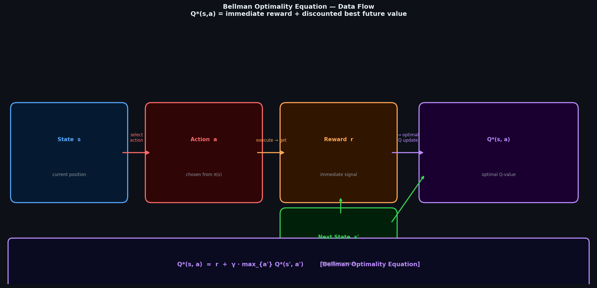
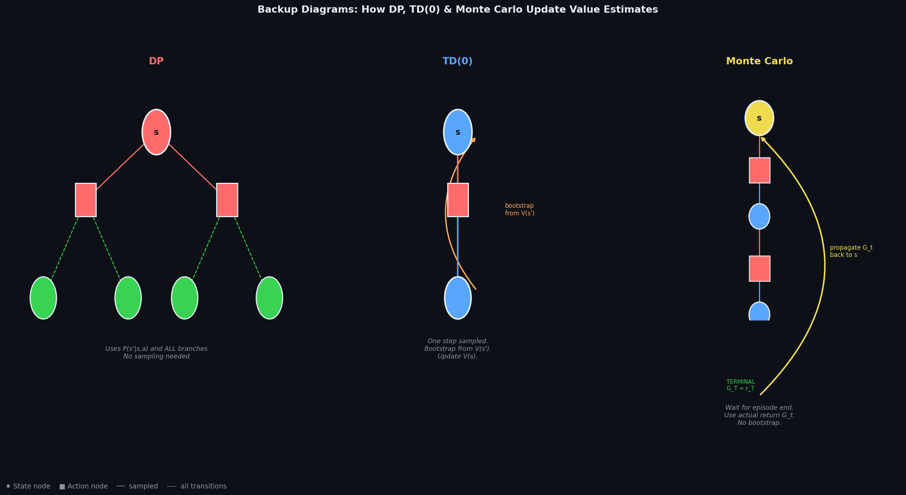
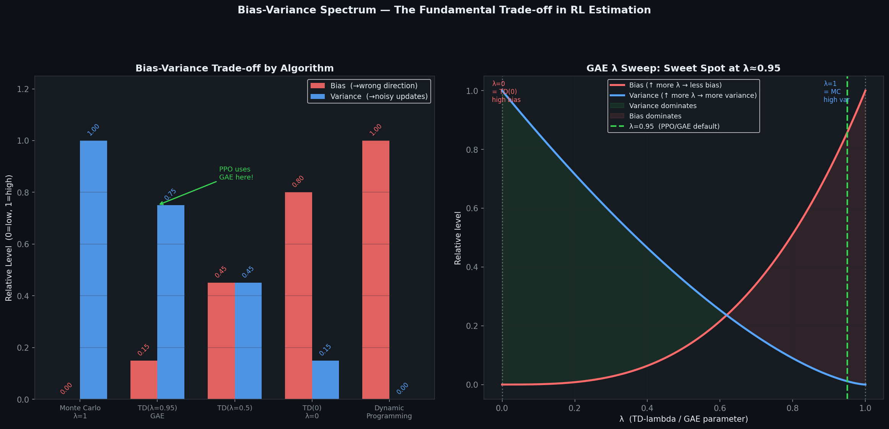
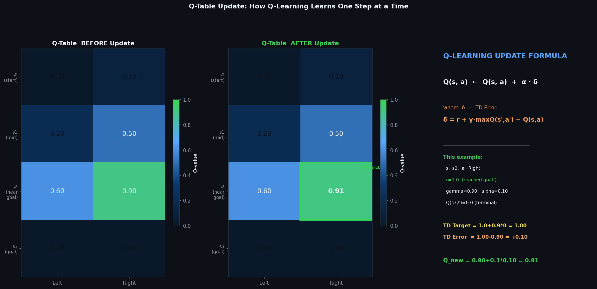

# 🧮 Module 03: Markov Decision Processes, Dynamic Programming & TD Learning
> **Ch. 18 — Hands-On ML with Scikit-Learn, Keras & TensorFlow (Aurélien Géron)**

---

## 📌 Table of Contents
1. [Start Here: The Big Picture](#big-picture)
2. [MDPs — The Full Formalism Revisited](#mdps-formalism)
3. [Optimal Policies & Value Functions](#optimal)
4. [Dynamic Programming: Policy & Value Iteration](#dynamic-programming)
5. [Temporal Difference Learning: TD(0)](#td-learning)
6. [SARSA: On-Policy TD Control](#sarsa)
7. [Q-Learning: Off-Policy TD Control](#q-learning)
8. [Tabular Q-Learning Implementation](#tabular-q)
9. [The Taxi-v3 Environment Example](#taxi)
10. [Common Beginner Mistakes](#mistakes)
11. [Interview Q&A](#interview)
12. [⚡ One-Page Flash Card](#revision)

---

## 🌍 Start Here: The Big Picture {#big-picture}

> **TL;DR:** Dynamic Programming (DP) provides the **exact solution** to MDPs when the full model P(s'|s,a) is known — but it's computationally infeasible for large state spaces. Temporal Difference (TD) Learning bridges DP's power with Monte Carlo's model-free nature: TD methods learn value functions **from experience**, updating estimates **incrementally** using the Bellman equation as a target.

**The Real-World Analogy 🗓️:**
Consider planning a road trip. **Dynamic Programming** is like having a perfect GPS with all roads and speeds — you compute the exact optimal route. **Monte Carlo** is like having a friend drive the trip from scratch each time and averaging the time. **TD Learning** is like adjusting your travel time estimate after each checkpoint — "I thought this stretch would take 30min but it took 25; I'll update my estimate for next time." You don't need to finish the trip (Monte Carlo) or know all roads (DP) to learn efficiently.

---

## 🔍 1. MDPs — The Full Formalism Revisited {#mdps-formalism}

### A Concrete MDP Example: Stochastic MarineWorld

The book presents an 11-state MDP with explicit transition probabilities and rewards. Let's use a simpler grid world for illustration:

```
GRID WORLD (3x4 states):
┌───┬───┬───┬────┐
│S  │ . │ . │ G+ │
├───┼───┼───┼────┤
│ . │XXX│ . │ P- │
├───┼───┼───┼────┤
│ . │ . │ . │ .  │
└───┴───┴───┴────┘

S = Start, G+ = Goal (reward +1), P- = Pit (reward -1), XXX = Wall
Actions: Up, Down, Left, Right
Stochastic: with 80% probability go intended direction, 10% left, 10% right
```

**Transition Function P(s'|s,a):**
```python
# Example for action "Right" from state (1,1):
P("(1,2)" | "(1,1)", "Right") = 0.80   # Go right as intended
P("(0,1)" | "(1,1)", "Right") = 0.10   # Slip upward
P("(2,1)" | "(1,1)", "Right") = 0.10   # Slip downward
```

### Why Stochastic Transitions Matter

In a **deterministic MDP**: same state + same action → always same next state.
In a **stochastic MDP**: outcome is a probability distribution over next states.

Real-world systems are almost always stochastic (wind affects drone flight, market prices shift, motors slip), so RL algorithms must be robust to stochasticity.

---

## 🔍 2. Optimal Policies & Value Functions {#optimal}

### The Bellman Optimality Equations (Expanded)



**Optimal State Value:**
```
V*(s) = max_a Σ_{s'} P(s'|s,a) [ R(s,a,s') + γ·V*(s') ]
```

**Optimal Action Value:**
```
Q*(s,a) = Σ_{s'} P(s'|s,a) [ R(s,a,s') + γ·max_{a'} Q*(s',a') ]
```

**Deriving Optimal Policy from Q*:**
```
π*(s) = argmax_a Q*(s,a)
```

### Key Properties of Optimal Value Functions

| Property | Description |
|---------|-------------|
| **Uniqueness** | V* and Q* are unique solutions to the Bellman optimality equations |
| **Consistency** | V*(s) = max_a Q*(s,a) |
| **Contraction** | Bellman backup operator T is a contraction (γ < 1 ensures convergence) |

---

## 🔍 3. Dynamic Programming: Policy & Value Iteration {#dynamic-programming}

DP requires **complete knowledge** of the MDP (transition probabilities and rewards). Used for small, discrete MDPs.

### Policy Evaluation (Prediction)

Given a fixed policy π, compute V^π(s) for all states:

```
POLICY EVALUATION ALGORITHM:
────────────────────────────────────────────────────
Initialize V(s) = 0 for all s ∈ S

Repeat until convergence (max change < θ):
  For each state s:
    V_new(s) = Σ_a π(a|s) · Σ_{s'} P(s'|s,a) [ R(s,a,s') + γ·V(s') ]
  Δ = max_s |V_new(s) - V(s)|
  V ← V_new
────────────────────────────────────────────────────
```

### Policy Iteration (Control)

Alternates between policy evaluation and policy improvement:

```
POLICY ITERATION:
────────────────────────────────────────────────────
Initialize π randomly

Repeat:
  1. POLICY EVALUATION: Compute V^π until convergence
  2. POLICY IMPROVEMENT:
     For each state s:
       π_new(s) = argmax_a Σ_{s'} P(s'|s,a) [ R(s,a,s') + γ·V^π(s') ]
  3. If π_new == π: CONVERGED → return π*
     Else: π ← π_new
────────────────────────────────────────────────────
```

> [!IMPORTANT]
> Policy iteration **always converges** to the optimal policy π* in a finite number of iterations (since there are finitely many deterministic policies). Each iteration strictly improves the policy until it reaches the globally optimal one (Policy Improvement Theorem guarantees this).

### Value Iteration (More Efficient)

Instead of waiting for full policy evaluation convergence, update V directly:

```
VALUE ITERATION:
────────────────────────────────────────────────────
Initialize V(s) = 0 for all s ∈ S

Repeat until convergence (max change < θ):
  For each state s:
    V(s) ← max_a Σ_{s'} P(s'|s,a) [ R(s,a,s') + γ·V(s') ]

Extract optimal policy:
  π*(s) = argmax_a Σ_{s'} P(s'|s,a) [ R(s,a,s') + γ·V(s') ]
────────────────────────────────────────────────────
```

**Value Iteration Implementation:**
```python
import numpy as np

# Transition matrix: T[s, a, s'] = P(s'|s,a)
# Rewards matrix: R[s, a, s'] = reward for transition
# Shapes depend on environment

def value_iteration(T, R, gamma=0.95, theta=1e-6):
    """
    T: (n_states, n_actions, n_states) transition probabilities
    R: (n_states, n_actions, n_states) reward matrix
    Returns: V* (optimal values), pi* (optimal policy)
    """
    n_states = T.shape[0]
    V = np.zeros(n_states)
    
    while True:
        V_new = np.zeros(n_states)
        for s in range(n_states):
            # Compute Q(s,a) for all actions, take max
            Q_sa = np.sum(T[s] * (R[s] + gamma * V), axis=1)  # Shape: (n_actions,)
            V_new[s] = np.max(Q_sa)
        
        delta = np.max(np.abs(V_new - V))
        V = V_new
        if delta < theta:
            break
    
    # Extract optimal policy
    Q = np.sum(T * (R + gamma * V), axis=2)  # Shape: (n_states, n_actions)
    pi = np.argmax(Q, axis=1)
    
    return V, pi

# Example: 3-state MDP
# States: s0 (start), s1 (intermediate), s2 (terminal with +10 reward)
T = np.array([
    # s0: action 0 -> s1 with p=0.7, s2 with p=0.3; action 1 -> s0 with p=1
    [[0.7, 0.3], [1.0, 0.0]],  # Wait, dimensions need to match - simplified example
])
# OUTPUT: Converges in ~100 iterations for most small MDPs
```

### DP Limitations

| Problem | Description |
|---------|-------------|
| **Curse of dimensionality** | State space grows exponentially with variables |
| **Requires full model** | P(s'\|s,a) must be known exactly |
| **Tabular** | Cannot generalize across similar states |
| **Memory** | Must store V(s) for ALL states |

---

## 🔍 4. Temporal Difference Learning: TD(0) {#td-learning}

TD learning is the **cornerstone of modern RL**: it combines the **sampling efficiency** of Monte Carlo with the **incremental updates** of DP.

### The TD Error (δ)

The **TD error** measures the difference between the current value estimate and a bootstrapped target:

```
δ_t = r_t + γ·V(s_{t+1}) - V(s_t)
```

| Component | Meaning |
|-----------|---------|
| `r_t + γ·V(s_{t+1})` | **TD Target**: immediate reward + discounted value of next state |
| `V(s_t)` | Current estimate of state value |
| `δ_t` | Error signal: how wrong was our estimate? |

### TD(0) Value Update Rule

```
V(s_t) ← V(s_t) + α · δ_t
V(s_t) ← V(s_t) + α · [r_t + γ·V(s_{t+1}) - V(s_t)]
```

where α is the learning rate (step size).

### TD vs Monte Carlo vs DP Comparison



| Method | Updates | Model Required | Variance | Bias |
|--------|---------|---------------|---------|------|
| **DP** | Sweep all states | YES | None | None (exact) |
| **Monte Carlo** | End of episode | No | High | Zero |
| **TD(0)** | Every step | No | Low | Some (bootstrap) |

```
BOOTSTRAP HIERARCHY:
                    
DP: Uses full model, zero variance, exact bootstrapping
   |
   ↓ Remove model requirement
   
TD: Uses sampled transitions, bootstraps from V(s')
   |
   ↓ Remove bootstrapping
   
Monte Carlo: Uses full episode returns, no bootstrapping
```

> [!IMPORTANT]
> **Bootstrapping**: In TD learning, we update V(s_t) using V(s_{t+1}) — we use our own estimate as a target. This introduces **bias** (if V is wrong, our target is wrong), but drastically reduces **variance** vs Monte Carlo (no need to wait for full episode return).

### TD(λ) — Bridging TD and Monte Carlo



TD(λ) unifies TD(0) and Monte Carlo via **eligibility traces**:

```
λ = 0: Pure TD(0)  (one-step bootstrap)
λ = 1: Pure Monte Carlo (full return, no bootstrap)
λ ∈ (0,1): Interpolation (λ-weighted mix of n-step returns)
```

**n-Step Returns:**
```
G_t^(1) = r_t + γ·V(s_{t+1})                                    (1-step TD)
G_t^(2) = r_t + γ·r_{t+1} + γ²·V(s_{t+2})                      (2-step TD)
G_t^(n) = r_t + γ·r_{t+1} + ... + γ^{n-1}·r_{t+n} + γ^n·V(s_{t+n})  (n-step TD)
G_t^(λ) = (1-λ)Σ_{n=1}^{∞} λ^{n-1} · G_t^(n)                  (TD-λ: weighted average)
```

---

## 🔍 5. SARSA: On-Policy TD Control {#sarsa}

SARSA extends TD(0) to **learn Q(s,a)** (not just V(s)) while following the current policy.

**SARSA = State, Action, Reward, next State, next Action**

### SARSA Update Rule

```
Q(s_t, a_t) ← Q(s_t, a_t) + α · [r_t + γ·Q(s_{t+1}, a_{t+1}) - Q(s_t, a_t)]
```

> [!NOTE]
> The key property: SARSA uses `a_{t+1}` — the **actual next action sampled from the current policy** (hence "on-policy"). It evaluates the policy it's following. If the policy is ε-greedy, SARSA accounts for the exploration probability in its Q-value estimates.

### SARSA Algorithm

```
SARSA (On-Policy TD Control):
─────────────────────────────────────────────────────
Initialize Q(s,a) = 0 for all s,a
Choose ε for ε-greedy policy

For each episode:
  Initialize s
  Choose a from s using ε-greedy(Q)
  
  For each step:
    Take action a, observe r, s'
    Choose a' from s' using ε-greedy(Q)
    Q(s,a) ← Q(s,a) + α·[r + γ·Q(s',a') - Q(s,a)]
    s ← s'; a ← a'
    if terminal: break
─────────────────────────────────────────────────────
```

---

## 🔍 6. Q-Learning: Off-Policy TD Control {#q-learning}

Q-Learning (Watkins, 1989) is the foundational RL algorithm that directly learns Q*(s,a) **regardless of the policy being followed**.



### Q-Learning Update Rule

```
Q(s_t, a_t) ← Q(s_t, a_t) + α · [r_t + γ·max_{a'} Q(s_{t+1}, a') - Q(s_t, a_t)]
                                    ↑                  ↑
                              TD Target            GREEDY max — key difference from SARSA!
```

### Q-Learning vs SARSA Comparison

| Property | SARSA | Q-Learning |
|---------|-------|------------|
| **Type** | On-policy | Off-policy |
| **Next action** | Actual policy action a' | max over all actions |
| **Target** | Q(s', a') where a' ~ π | max_a' Q(s', a') |
| **Convergence** | Converges to π*_ε (ε-greedy opt) | Converges to π* (true optimal) |
| **Safety** | More conservative (explores safely) | Can overestimate Q-values |
| **Sample efficiency** | Lower | Higher (off-policy replay) |

> [!IMPORTANT]
> **Why Q-Learning is off-policy**: The update uses `max_a' Q(s',a')` — the greedy action — regardless of what action the agent actually takes. This means the agent can explore with ε-greedy but still learn the optimal *greedy* policy. This enables **experience replay** (reusing old data with a different past policy).

### Convergence Guarantee

Q-Learning converges to Q* if:
1. All state-action pairs are visited infinitely often
2. Learning rate α satisfies: Σ α_t = ∞ and Σ α_t² < ∞
3. γ < 1

---

## 🔍 7. Tabular Q-Learning Implementation {#tabular-q}

### Discretizing Continuous Observations for Tabular Q-Learning

CartPole has continuous state space → must discretize for tabular Q-Learning:

```python
import gymnasium as gym
import numpy as np

# ─── Environment Setup ──────────────────────────────────────────────────────
env = gym.make("CartPole-v1")
n_actions = env.action_space.n   # 2 (left, right)

# Discretize observation space into bins
n_bins = 6   # Each of 4 dims gets 6 bins -> 6^4 = 1,296 possible discrete states
obs_low  = [-2.4, -2.5, -0.25, -2.5]    # Practical limits (not -inf)
obs_high = [ 2.4,  2.5,  0.25,  2.5]

# Create bins for each dimension
bins = [
    np.linspace(obs_low[i], obs_high[i], n_bins - 1)
    for i in range(4)
]

def discretize(obs):
    """Convert continuous observation to discrete state index tuple."""
    return tuple(int(np.digitize(obs[i], bins[i])) for i in range(4))

# ─── Q-Table Initialization ──────────────────────────────────────────────────
Q_table = np.zeros((n_bins,) * 4 + (n_actions,))  # Shape: (6,6,6,6,2)
print(f"Q-table size: {Q_table.size:,} entries")
# OUTPUT: Q-table size: 2,592 entries

# ─── Hyperparameters ────────────────────────────────────────────────────────
n_episodes = 10_000
alpha      = 0.10      # Learning rate
gamma      = 0.95      # Discount factor
eps_start  = 1.0       # Initial exploration
eps_end    = 0.02      # Final exploration
eps_decay  = 0.9999    # Multiplicative decay per step

epsilon = eps_start
total_steps = 0

# ─── Training Loop ──────────────────────────────────────────────────────────
episode_rewards = []

for episode in range(n_episodes):
    obs, _ = env.reset()
    state   = discretize(obs)
    total_reward = 0
    
    for step in range(500):
        # ε-greedy action selection
        if np.random.rand() < epsilon:
            action = env.action_space.sample()    # Explore
        else:
            action = int(np.argmax(Q_table[state]))  # Exploit
        
        # Take action
        next_obs, reward, terminated, truncated, _ = env.step(action)
        next_state = discretize(next_obs)
        done = terminated or truncated
        
        # Q-Learning update
        best_next_q = np.max(Q_table[next_state]) if not terminated else 0.0
        td_target   = reward + gamma * best_next_q
        td_error    = td_target - Q_table[state + (action,)]
        Q_table[state + (action,)] += alpha * td_error
        
        state = next_state
        total_reward += reward
        total_steps  += 1
        epsilon = max(eps_end, epsilon * eps_decay)  # Decay epsilon
        
        if done:
            break
    
    episode_rewards.append(total_reward)
    
    if (episode + 1) % 1000 == 0:
        recent_mean = np.mean(episode_rewards[-100:])
        print(f"Episode {episode+1:5d} | Mean last 100: {recent_mean:.1f} | ε: {epsilon:.3f}")

# OUTPUT:
# Episode  1000 | Mean last 100:  36.2 | ε: 0.905
# Episode  2000 | Mean last 100:  72.1 | ε: 0.819
# Episode  5000 | Mean last 100: 145.3 | ε: 0.607
# Episode 10000 | Mean last 100: 178.6 | ε: 0.368  <- Near optimal!

env.close()
```

### Evaluating the Learned Policy

```python
env_eval = gym.make("CartPole-v1")
eval_rewards = []

for _ in range(100):
    obs, _ = env_eval.reset()
    state = discretize(obs)
    total_reward = 0
    
    for _ in range(500):
        action = int(np.argmax(Q_table[state]))   # Pure greedy (no exploration)
        obs, reward, terminated, truncated, _ = env_eval.step(action)
        state = discretize(obs)
        total_reward += reward
        if terminated or truncated:
            break
    
    eval_rewards.append(total_reward)

print(f"Evaluation — Mean: {np.mean(eval_rewards):.1f} ± {np.std(eval_rewards):.1f}")
# OUTPUT: Evaluation — Mean: 189.3 ± 14.2  (near-perfect performance)
```

---

## 🔍 8. The Taxi-v3 Environment Example {#taxi}

The Gymnasium **Taxi-v3** environment is a classic small MDP perfectly suited for tabular Q-Learning:

```python
import gymnasium as gym
import numpy as np

env = gym.make("Taxi-v3")
print(f"State space size: {env.observation_space.n}")    # OUTPUT: 500
print(f"Action space size: {env.action_space.n}")        # OUTPUT: 6
# Actions: 0=South, 1=North, 2=East, 3=West, 4=Pickup, 5=Dropoff

# State encodes: (taxi_row, taxi_col, passenger_loc, destination)
# 5 rows × 5 cols × 5 passenger_locs × 4 destinations = 500 states

# Q-table: 500 states × 6 actions
Q = np.zeros((env.observation_space.n, env.action_space.n))

# Training
alpha, gamma, epsilon = 0.1, 0.99, 1.0
n_episodes = 10_000

for ep in range(n_episodes):
    state, _ = env.reset()
    done = False
    
    while not done:
        if np.random.rand() < epsilon:
            action = env.action_space.sample()
        else:
            action = np.argmax(Q[state])
        
        next_state, reward, terminated, truncated, _ = env.step(action)
        done = terminated or truncated
        
        Q[state, action] += alpha * (reward + gamma * np.max(Q[next_state]) - Q[state, action])
        state = next_state
    
    epsilon = max(0.01, epsilon * 0.9995)

# Evaluation
total_penalties, total_epochs = 0, 0
n_eval = 100

for _ in range(n_eval):
    state, _ = env.reset()
    epochs, penalties = 0, 0
    done = False
    
    while not done:
        action = np.argmax(Q[state])
        state, reward, terminated, truncated, _ = env.step(action)
        done = terminated or truncated
        if reward == -10:    # Penalty for illegal pickup/dropoff
            penalties += 1
        epochs += 1
    
    total_penalties += penalties
    total_epochs    += epochs

print(f"Avg steps per episode: {total_epochs / n_eval:.1f}")
print(f"Avg penalties per episode: {total_penalties / n_eval:.2f}")
# OUTPUT:
# Avg steps per episode: 13.1
# Avg penalties per episode: 0.00  <- Perfect! No illegal moves.
```

---

## ❌ Common Beginner Mistakes {#mistakes}

**1. "Using the same alpha for all states equally"** ❌
> States that are visited frequently converge faster than rarely-visited states. Consider using **decreasing α per state-action pair**: α(s,a) = 1/N(s,a) where N counts visits. This satisfies convergence conditions theoretically.

**2. "Confusing SARSA and Q-Learning update targets"** ❌
> SARSA: `Q(s,a) ← Q(s,a) + α·[r + γ·Q(s', a') - Q(s,a)]` where a' is the *actual next action* (from current ε-greedy policy)
> Q-Learning: `Q(s,a) ← Q(s,a) + α·[r + γ·max_{a'} Q(s',a') - Q(s,a)]` where we take the *max over all actions*
> Mixing these up causes convergence to the wrong policy.

**3. "Forgetting terminal state bootstrap"** ❌
> When `terminated=True`, the episode has ended — there is no next state. The TD target should be just `r_t`, not `r_t + γ·V(s_{t+1})`. Setting V(terminal_state) = 0 correctly handles this: `target = r + γ * 0 = r`. Always check `if terminated: target = r` vs `target = r + γ*V(s')`.

**4. "Not decaying ε enough"** ❌
> If ε stays high throughout training (e.g., ε=0.5 forever), the agent continues exploring randomly and never fully exploits its learned Q-values. The optimal policy in evaluation is always fully greedy (ε=0). During training, ε should decay smoothly to ~0.01-0.05.

**5. "Too many bins for continuous state discretization"** ❌
> With 10 bins per dimension and 4 dims: 10^4 = 10,000 states. With 20 bins: 20^4 = 160,000 states. Most states may never be visited in training, leading to poor generalization. Use **Function Approximation (DQN)** for high-dimensional spaces instead.

---

## 🎤 Interview Q&A {#interview}

**Q1: What is the difference between TD(0) and Monte Carlo methods? Which has higher bias and which has higher variance?**
> **A:**
> - **Monte Carlo** computes the full return G_t = r_t + γ·r_{t+1} + ... + γ^{T-t}·r_T by waiting until the episode ends. It's an **unbiased** estimate of V^π(s_t) because it uses the actual observed return — no approximations. However, since G_t is a sum of many random rewards, it has **high variance**.
>
> - **TD(0)** uses a one-step bootstrap target: r_t + γ·V(s_{t+1}). Since V(s_{t+1}) is an *estimate* (not the true value), this introduces **bias** — the target is wrong to the degree that V(s_{t+1}) is wrong. However, since we're averaging over only one step of randomness (not the whole episode), **variance is much lower**.
>
> **Practical implication**: TD is preferred in most modern RL because low variance leads to more stable, faster learning. Bias decreases naturally as V converges during training.

**Q2: Explain why Q-Learning is off-policy. What advantage does this give?**
> **A:** Q-Learning is off-policy because its update target `r + γ·max_{a'} Q(s',a')` uses the **greedy** (best) action regardless of the action the agent actually took. The agent can follow *any* exploration policy (e.g., ε-greedy, random) and Q-Learning will still converge to the optimal Q* for the greedy policy.
>
> **Key advantages of off-policy:**
> 1. **Experience Replay**: We can store transitions in a replay buffer and reuse them many times with different (updated) Q-functions. DQN uses exactly this.
> 2. **Behavior Policy Separation**: A robot can learn from safe exploration while converging to an optimal (possibly aggressive) exploitation policy.
> 3. **Learning from Demonstrations**: Can learn from trajectories generated by a human or another agent.

**Q3: How does Value Iteration differ from Policy Iteration? Which is more computationally efficient?**
> **A:**
> - **Policy Iteration**: Alternates between (1) full policy evaluation — iterating V until convergence — and (2) policy improvement — one sweep to get greedy policy. Each iteration requires many sweeps in the evaluation phase.
> - **Value Iteration**: Combines both into a single update: `V(s) ← max_a Σ_{s'} P(s'|s,a)[R + γ·V(s')]`. No separate evaluation phase — the V update already takes the max.
>
> **Efficiency**: Policy Iteration typically converges in **fewer outer iterations** but each iteration is expensive (full evaluation). Value Iteration has **simpler per-iteration updates** but may need more iterations. For large state spaces with expensive policy evaluation, Value Iteration is usually preferred. Both have the same asymptotic complexity when exact convergence is required.

**Q4: What is bootstrapping in TD learning and why does it introduce bias?**
> **A:** Bootstrapping means using the current estimate V(s_{t+1}) as part of the update target for V(s_t). This is "learning a guess from a guess."
>
> It introduces **bias** because V(s_{t+1}) is not the true value V^π(s_{t+1}) — it's our current approximate estimate, which is wrong especially early in training. The TD target `r + γ·V̂(s_{t+1})` is therefore a biased estimate of the true return G_t.
>
> **Why accept bias?** Because the alternative (Monte Carlo) waits for the full return — which has zero bias but extremely high variance (the sum of many random variables). In practice, the bias from bootstrapping quickly decreases as V converges, while the variance reduction from not waiting for full episode returns provides more stable gradient updates throughout training. This is the fundamental **bias-variance tradeoff** at the heart of TD vs MC.

---

## ⚡ One-Page Flash Card {#revision}

```
╔══════════════════════════════════════════════════════════════════╗
║        MODULE 03 — MDP, DP, TD LEARNING, Q-LEARNING             ║
╠══════════════════════════════════════════════════════════════════╣
║                                                                  ║
║  BELLMAN OPTIMALITY:                                             ║
║  V*(s) = max_a Σ P(s'|s,a)[R + γ·V*(s')]                        ║
║  Q*(s,a) = Σ P(s'|s,a)[R + γ·max_a' Q*(s',a')]                 ║
║                                                                  ║
║  TD ERROR: δ_t = r_t + γ·V(s_{t+1}) - V(s_t)                   ║
║  TD UPDATE: V(s_t) <- V(s_t) + α·δ_t                            ║
║                                                                  ║
║  SARSA (ON-POLICY):                                              ║
║  Q(s,a) <- Q(s,a) + α·[r + γ·Q(s',a') - Q(s,a)]               ║
║  where a' ~ π_ε (actual next action from policy)                 ║
║                                                                  ║
║  Q-LEARNING (OFF-POLICY):                                        ║
║  Q(s,a) <- Q(s,a) + α·[r + γ·max_a' Q(s',a') - Q(s,a)]        ║
║  where max_a' is greedy (not the action taken!)                  ║
║                                                                  ║
║  BIAS-VARIANCE:                                                  ║
║  Monte Carlo: High variance, Zero bias (full return)             ║
║  TD(0): Low variance, Some bias (bootstraps from V(s'))          ║
║  TD(λ): Interpolates between MC (λ=1) and TD (λ=0)              ║
║                                                                  ║
║  Q-TABLE SIZE: n_bins^n_dims * n_actions                         ║
║  Taxi-v3: 500 states * 6 actions = 3,000 entries                 ║
║  CartPole (6 bins): 6^4 * 2 = 2,592 entries                     ║
╚══════════════════════════════════════════════════════════════════╝
```

---

**🔗 Previous Module →** [02_OpenAI_Gym_and_Policy_Gradients.md](02_OpenAI_Gym_and_Policy_Gradients.md)
**🔗 Next Module →** [04_Deep_Q_Networks.md](04_Deep_Q_Networks.md)
