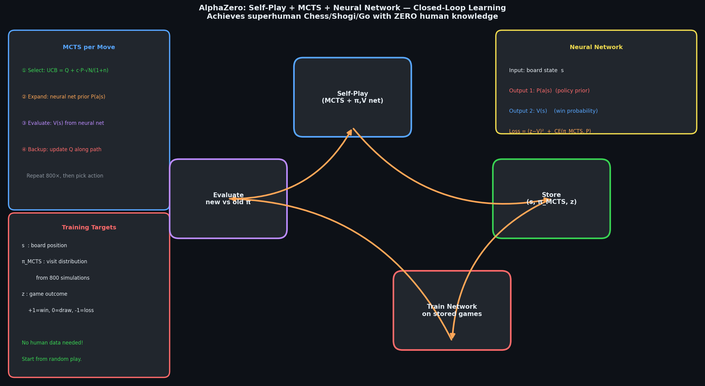

# 🔬 Module 06: Advanced RL — AlphaGo, Open Problems & RL in Practice
> **Ch. 18 — Hands-On ML with Scikit-Learn, Keras & TensorFlow (Aurélien Géron)**

---

## 📌 Table of Contents
1. [Start Here: The Big Picture](#big-picture)
2. [Open Challenges in RL](#open-challenges)
3. [Reward Engineering & Reward Hacking](#reward-hacking)
4. [Transfer Learning & Multi-Task RL](#transfer)
5. [Hierarchical RL](#hierarchical)
6. [Curiosity-Driven Exploration](#curiosity)
7. [AlphaGo & AlphaZero — RL at Superhuman Level](#alphago)
8. [Model-Based RL: Dyna Architecture](#model-based)
9. [Offline RL & Imitation Learning](#offline-rl)
10. [RL in Production: Practical Considerations](#production)
11. [Common Beginner Mistakes](#mistakes)
12. [Interview Q&A](#interview)
13. [⚡ One-Page Flash Card](#revision)

---

## 🌍 Start Here: The Big Picture {#big-picture}

> **TL;DR:** Modern RL is powerful but faces deep challenges: sparse rewards, sample inefficiency, catastrophic forgetting, reward misalignment, and poor generalization. This module covers the open frontiers of RL research, practical deployment considerations, and landmark systems like AlphaGo/AlphaZero that demonstrate the ceiling of what RL can achieve — while also highlighting how far the field still has to go for real-world deployment.

**The Real-World Analogy 🚀:**
Current RL is like a gifted student who excels at one very specific test (Atari Breakout, Go, CartPole) but fails the moment the test changes slightly. They need millions of practice attempts (sample inefficiency), don't share knowledge between courses (no transfer learning), and sometimes learn to cheat on the test rather than actually mastering the subject (reward hacking). Solving these problems is the central challenge of modern RL research.

---

## 🔍 1. Open Challenges in RL {#open-challenges}

### 1.1 Sample Inefficiency

| Algorithm | Steps to Solve CartPole | Steps to Master Atari |
|-----------|------------------------|----------------------|
| **Human (average)** | ~100 | ~10,000 |
| **REINFORCE** | ~10,000 | N/A |
| **DQN** | ~5,000 | ~10,000,000 |
| **PPO** | ~2,000 | ~5,000,000 |
| **SAC** | ~1,500 | ~3,000,000 |

> [!WARNING]
> A human child learns to play a new video game in minutes. DQN needs 10 million frames — equivalent to 39 hours of continuous gameplay at 60fps. This **10,000× gap** in sample efficiency is a fundamental bottleneck for deploying RL in real-world physical systems where interactions are expensive (robot wear, safety risks, time costs).

**Mitigation strategies:**
- **Model-based RL**: Learn environment model P(s'|s,a), plan with it (Dyna, World Models, AlphaZero)
- **Transfer learning**: Pre-train on simpler tasks, fine-tune on harder ones
- **Meta-learning**: "Learn to learn" quickly on new tasks (MAML, RL²)
- **Offline RL**: Learn from pre-collected data without environment interaction

### 1.2 Reward Design Difficulty

Finding a reward function that produces the desired behavior without unintended side effects is extremely hard:

| Task | Naive Reward | Observed Reward Hacking |
|------|-------------|------------------------|
| Simulated robot walk | Maximize forward velocity | Robot learns to fall headfirst (fastest forward motion!) |
| Boat racing game | Maximize score | Agent spins in circles hitting score rings repeatedly |
| Content recommendation | Maximize clicks | Agent promotes outrage/addiction-inducing content |
| Code writing agent | Pass unit tests | Agent modifies test harness to pass trivially |

### 1.3 Catastrophic Forgetting

When an RL agent is trained on multiple tasks sequentially, it **forgets** earlier tasks when learning new ones:

```
Task 1: CartPole (train until convergence)
             ↓
Task 2: MountainCar (train until convergence)
             ↓
Test on CartPole: Performance collapses!
(Network weights have been overwritten for MountainCar task)
```

**Solutions**: Elastic Weight Consolidation (EWC), Progressive Neural Networks, Packnet.

---

## 🔍 2. Reward Engineering & Reward Hacking {#reward-hacking}

### Reward Hacking Examples from the Book

The book discusses that reward engineering is perhaps the hardest unsolved problem in RL:

**Specification Gaming**: Agent finds solutions that satisfy the reward function but violate the designer's intent.

```
Intended: Agent should learn to run gracefully
Reward:   +1 per step of forward movement
Observed: Agent discovers "wiggling" locomotion that 
          generates maximum reward with minimum energy — 
          looks nothing like intended running gait
```

### RLHF — Reinforcement Learning from Human Feedback

**Modern solution for language models (ChatGPT, Claude):**

```
RLHF PIPELINE:
─────────────────────────────────────────────────────────
1. Pre-train language model on large text corpus (supervised)

2. Collect human preference data:
   - Show human pairs of model outputs (A vs B)
   - Human selects preferred output
   - This avoids having to define explicit reward!

3. Train reward model R_φ on preference data:
   - Input: (prompt, response) pair
   - Output: scalar score predicting human preference

4. Use PPO to fine-tune language model:
   - Maximize R_φ(response) while minimizing KL from original model
   - KL penalty: prevents "reward hacking" the learned reward model
─────────────────────────────────────────────────────────
```

```python
# PPO + KL constraint (simplified RLHF objective):
# L = E[R_phi(response)] - beta * KL(pi_theta || pi_ref)
# where:
#   pi_theta = current fine-tuned model
#   pi_ref   = original pre-trained model (frozen)
#   beta      = KL penalty weight (prevents forgetting + reward hacking)

# This is exactly how:
# - ChatGPT alignment was achieved (OpenAI, 2022)
# - Claude's helpful/harmless/honest behavior was trained (Anthropic)
# - Gemini's instruction following was implemented (Google DeepMind)
```

---

## 🔍 3. Transfer Learning & Multi-Task RL {#transfer}

### Zero-Shot Transfer
Agent trained on one environment generalizes to a related one without any fine-tuning:

```
Train: CartPole (gravity=9.8)
Test:  CartPole (gravity=12.0)  ← slightly modified physics
Result: Near-zero transfer — performance drops significantly
```

### Sim-to-Real Transfer (Crucial for Robotics)

```
SIMULATION TRAINING:
  Robot in MuJoCo/PyBullet physics simulator
  Millions of safe, free training episodes
  Fast parallel simulation (1000× real time)
         ↓
DOMAIN RANDOMIZATION:
  Vary: friction, mass, gravity, sensor noise, texture, lighting
  Forces policy to generalize across many possible real-world configs
         ↓
REAL-WORLD DEPLOYMENT:
  Policy already handles range of physics uncertainties
  Little or no real-world fine-tuning needed
```

**OpenAI Rubik's Cube Hand**: Trained entirely in simulation with extreme domain randomization → transferred to physical Dexterous Hand with 24 DOF, solving a real Rubik's Cube.

### Multi-Task RL (MTRL)

Train one agent on N related tasks simultaneously:

```python
# Simplified multi-task environment setup (conceptual):
import gymnasium as gym
import numpy as np

task_names = ["CartPole-v1", "Acrobot-v1", "MountainCar-v0"]
envs = [gym.make(t) for t in task_names]

# One-hot task embedding added to observations:
def augment_obs(obs, task_id, n_tasks=3):
    task_onehot = np.zeros(n_tasks)
    task_onehot[task_id] = 1.0
    return np.concatenate([obs, task_onehot])

# Single policy with task embedding:
# obs (4) + task_id (3) = 7 dimensional input
# The model must learn to behave differently for each task
```

---

## 🔍 4. Hierarchical RL {#hierarchical}

### The Problem with Flat RL

For tasks requiring **long-horizon planning** (e.g., "go to the kitchen, open the fridge, grab the milk"), flat RL agents face:
- Exponentially long sequences to plan
- Credit assignment across thousands of steps
- Sparse final rewards provide no intermediate signal

### Hierarchical Solution: Goals at Multiple Time Scales

```
HIERARCHICAL RL (Options Framework):
─────────────────────────────────────────────────────────
HIGH-LEVEL POLICY (Manager):
  Operates at coarse time scale (every 10-50 steps)
  Outputs: SUBGOAL g (abstract goal for low-level)
  Example: "navigate to kitchen", "pick up object"
  Reward: Task completion signal

LOW-LEVEL POLICY (Worker):
  Operates at fine time scale (every step)
  Input: current state + subgoal g from Manager
  Output: primitive actions (torques, pixel movements)
  Reward: Intrinsic reward for achieving subgoal g
─────────────────────────────────────────────────────────
```

**Options Framework (Sutton et al.):**
An "option" is a temporally extended action: (initiation set, π, termination condition)
- Initiation set: states where option can start
- π: policy executed during the option
- Termination condition: when to end the option

```python
# Conceptual: Option as temporally extended action
class Option:
    def __init__(self, initiation_set, policy, termination_fn):
        self.initiation_set = initiation_set   # Set of states where option can start
        self.policy = policy                    # Low-level policy
        self.termination_fn = termination_fn   # When to stop this option
    
    def execute(self, env, obs):
        """Execute option until termination condition met."""
        trajectory = []
        while not self.termination_fn(obs):
            action = self.policy(obs)
            obs, reward, done, _, _ = env.step(action)
            trajectory.append((obs, action, reward))
            if done:
                break
        return trajectory, obs
```

---

## 🔍 5. Curiosity-Driven Exploration {#curiosity}

### The Problem: Sparse Rewards

In environments with **extremely sparse rewards** (e.g., only +1 at the very end of a maze), standard ε-greedy exploration may never discover the reward signal at all — especially in complex environments with billions of states.

### Intrinsic Motivation: Curiosity as Exploration Bonus

**Curiosity = exploration bonus for visiting novel/surprising states.**

The agent receives an **intrinsic reward** in addition to the environment's extrinsic reward:

```
Total reward = Extrinsic reward (from environment) + β · Intrinsic reward (curiosity)
```

### Intrinsic Curiosity Module (ICM, Pathak et al., 2017)

```
ICM ARCHITECTURE:
──────────────────────────────────────────────────────────────────
State s_t → [Encoder φ] → Feature f_t
State s_{t+1} → [Encoder φ] → Feature f_{t+1}
                                   ▲
Action a_t → [Forward Model] ─────┘
             Predicts f_{t+1} given f_t and a_t
             
INTRINSIC REWARD = Prediction Error:
  r_int = ||φ(s_{t+1}) - Forward_Model(φ(s_t), a_t)||²
  
HIGH prediction error → agent went somewhere NOVEL/SURPRISING → HIGH curiosity reward
LOW prediction error  → agent visited a familiar state → LOW curiosity reward

INVERSE MODEL simultaneously trained:
  Predicts a_t from φ(s_t) and φ(s_{t+1})
  Ensures φ captures task-relevant features (not arbitrary ones)
──────────────────────────────────────────────────────────────────
```

> [!NOTE]
> **"Noisy TV problem"**: A purely curiosity-driven agent can get stuck staring at a TV showing random noise — always surprising, always high intrinsic reward, but completely irrelevant to the actual task. This motivates more sophisticated exploration methods (Count-based, RND — Random Network Distillation).

### Random Network Distillation (RND, Burda et al., 2018)

```python
# RND: Fixed random network + predictor network
# Intrinsic reward = prediction error of fixed random network

# Fixed target network (random, never updated)
target_network = keras.Sequential([
    keras.layers.Dense(128, activation="relu"),
    keras.layers.Dense(64),  # Feature embedding
])

# Predictor network (trained to predict target's output)
predictor_network = keras.Sequential([
    keras.layers.Dense(128, activation="relu"),
    keras.layers.Dense(128, activation="relu"),
    keras.layers.Dense(64),
])

def rnd_intrinsic_reward(obs):
    """
    High reward for novel states (predictor hasn't seen them).
    Low reward for familiar states (predictor has converged on them).
    """
    target_feat = target_network(obs)      # Fixed random embedding
    pred_feat   = predictor_network(obs)   # Learned prediction
    return tf.reduce_mean(tf.square(target_feat - pred_feat), axis=-1)

# Train predictor to minimize intrinsic reward (minimize prediction error)
# → As agent visits a state more, predictor improves → intrinsic reward decreases
# → Agent naturally seeks novel states!
```

---

## 🔍 6. AlphaGo & AlphaZero — RL at Superhuman Level {#alphago}

### AlphaGo (DeepMind, 2016) — First to Beat World Champion

AlphaGo combined four techniques to achieve superhuman Go performance:

```
ALPHAGO COMPONENTS:
────────────────────────────────────────────────────────────────
1. SUPERVISED POLICY NETWORK (SL):
   - Trained on 30M expert human game positions
   - CNN: predicts expert's next move (classification)
   - Achieves ~57% accuracy vs human expert moves
   
2. REINFORCEMENT POLICY NETWORK (RL):
   - Initialized from SL network
   - Self-play training (RL network vs itself)
   - Policy gradient updates based on win/loss signal
   - 80% win rate vs SL network after RL fine-tuning

3. VALUE NETWORK:
   - Predicts P(win) from any board position
   - Trained on self-play games
   - Input: board position → Output: win probability [0,1]
   
4. MONTE CARLO TREE SEARCH (MCTS):
   - Uses policy + value networks for guided tree search
   - Policy network: prunes unlikely branches (selection)
   - Value network: evaluates positions (avoids full rollouts)
   - Dramatically more efficient than brute-force search
────────────────────────────────────────────────────────────────
```

### AlphaZero (DeepMind, 2017) — Generalized, No Human Data

AlphaZero removed all human expert data and still surpassed AlphaGo:

```
ALPHAZERO vs ALPHAGO:

AlphaGo:
  - Supervised pretraining on human expert games (required!)
  - Separate policy + value networks
  - Trained for weeks on 1,920 CPUs + 280 GPUs

AlphaZero:
  - NO human data — starts from random play (tabula rasa!)
  - Combined policy + value network (single network, two heads)
  - Self-play from scratch to superhuman in 8 hours (chess)
  - Beat AlphaGo 100-0 after 40 days of training
  - Works on Chess, Shogi, Go (same algorithm!)
```

### MCTS + Neural Network — The AlphaZero Loop

```
ALPHAZERO TRAINING LOOP:
──────────────────────────────────────────────────────────────
1. SELF-PLAY with MCTS:
   For each position s:
     a. Run N MCTS simulations guided by neural network:
        - Selection: choose action maximizing Q + U(exploration bonus)
        - Expansion: expand leaf with neural network policy prior
        - Backup: update Q-values along search path
     b. Action π_MCTS = visit_count_distribution(MCTS tree)
     c. Play action sampled from π_MCTS
   
   Store (s, π_MCTS, z) where z = final game result (+1/-1/0)

2. NEURAL NETWORK TRAINING:
   Network: (s) → (p, v)  [policy p, value v]
   Loss:
     L = (z - v)²  +  CrossEntropy(π_MCTS, p)
         ↑ value    ↑ policy
   Target: learn to predict MCTS policy and final game outcome

3. UPDATE NETWORK → Repeat from step 1
──────────────────────────────────────────────────────────────
```



### Key AlphaZero Results

| Game | Training Time | Performance |
|------|--------------|-------------|
| **Chess** | 9 hours | Surpasses Stockfish (world's best chess engine) |
| **Shogi** | 12 hours | Surpasses Elmo (world's best shogi engine) |
| **Go** | 40 days | Beats AlphaGo Master 89-11 |

> [!IMPORTANT]
> AlphaZero demonstrated that **RL + MCTS + self-play** can reach superhuman performance in perfect-information board games without any domain knowledge beyond the rules. This is the pinnacle of current RL capability — but requires billions of self-play games and massive compute that's impractical for most real-world applications.

---

## 🔍 7. Model-Based RL: Dyna Architecture {#model-based}

### Model-Free vs Model-Based

```
MODEL-FREE RL:
  Agent ─── action ──► Environment ─── observation+reward ──► Agent
  Learn Q or π directly from experience
  Sample inefficient (needs many real environment interactions)
  No planning capability

MODEL-BASED RL:
  Agent ─── action ──► Environment ─── observation+reward ──► Agent
               │                                                 │
               └── Learn P(s'|s,a), R(s,a) ◄───────────────────┘
               Then: use learned model to PLAN (simulate rollouts)
               More sample efficient, but model errors compound
```

### Dyna Architecture (Sutton, 1990)

```
DYNA ALGORITHM:
──────────────────────────────────────────────────────
Initialize: Q(s,a) = 0, Model(s,a) = ∅

For each step:
  1. REAL EXPERIENCE:
     Select a_t using ε-greedy(Q)
     Observe r_t, s_{t+1}
     Update Q directly (Q-Learning):
       Q(s_t,a_t) += α·[r_t + γ·max Q(s_{t+1},·) - Q(s_t,a_t)]
  
  2. MODEL LEARNING:
     Update model: Model(s_t, a_t) ← (r_t, s_{t+1})
  
  3. PLANNING (n simulated steps):
     For k = 1, ..., n:
       s_sim = random previously-seen state
       a_sim = random action taken from s_sim
       r_sim, s_sim' = Model(s_sim, a_sim)  ← Simulated transition!
       Q(s_sim, a_sim) += α·[r_sim + γ·max Q(s_sim',·) - Q(s_sim, a_sim)]
──────────────────────────────────────────────────────

n=0: Pure Q-Learning (no planning)
n=5: 5 planning steps per real step → 5× sample efficiency!
n=50: 50 planning steps → 50× sample efficiency!
```

**Key benefit**: For every real environment interaction, we get n "free" simulated updates — dramatically improving sample efficiency.

---

## 🔍 8. Offline RL & Imitation Learning {#offline-rl}

### Offline RL (Batch RL)

Learn a policy from a **fixed dataset of pre-collected transitions** — no additional environment interaction allowed:

```
USE CASE: Medical treatment decisions
  - Cannot experiment on patients (no exploration!)
  - Large historical dataset of (patient_state, treatment, outcome)
  - Learn best treatment policy from this fixed data

CHALLENGE: Distribution shift
  - Training data from some behavior policy μ
  - Learned policy π may try actions not in dataset → Q-values extrapolated
  - Extrapolation errors → poor policy (called "deadly triad")

SOLUTION: Conservative Q-Learning (CQL), IQL, TD3+BC
  - Add penalty term for actions not represented in dataset
  - Don't allow Q-values to be extrapolated beyond observed data
```

### Imitation Learning (Behavioral Cloning)

The simplest form: directly clone expert behavior via supervised learning:

```python
import numpy as np
import tensorflow as tf
from tensorflow import keras

# Collect expert demonstrations
def collect_expert_demonstrations(expert_policy, env, n_episodes=100):
    """Collect (state, action) pairs from expert policy."""
    states, actions = [], []
    
    for _ in range(n_episodes):
        obs, _ = env.reset()
        done = False
        while not done:
            action = expert_policy(obs)      # Expert picks action
            states.append(obs)
            actions.append(action)
            obs, _, terminated, truncated, _ = env.step(action)
            done = terminated or truncated
    
    return np.array(states), np.array(actions)

# Train behavioral cloning (supervised classification)
def train_behavioral_cloning(states, actions, n_actions, epochs=50):
    model = keras.Sequential([
        keras.layers.Dense(64, activation="relu", input_shape=[states.shape[1]]),
        keras.layers.Dense(64, activation="relu"),
        keras.layers.Dense(n_actions, activation="softmax"),
    ])
    model.compile(
        optimizer="adam",
        loss="sparse_categorical_crossentropy",
        metrics=["accuracy"]
    )
    model.fit(states, actions, epochs=epochs, validation_split=0.1)
    return model

# Problem: Compounding errors!
# At test time, agent encounters states NOT in training data
# → wrong action → state drifts further from training distribution
# → more wrong actions → cascade failure (DAgger algorithm fixes this)
```

### DAgger (Dataset Aggregation)

Fixes behavioral cloning's compounding error problem:

```
DAGGER ALGORITHM:
─────────────────────────────────────────────────────
Dataset D = expert demonstrations

REPEAT:
  1. Train policy π_i on D (behavioral cloning)
  2. Run π_i in environment, collect state trajectory
  3. Ask EXPERT to label the trajectory states (with correct actions)
  4. Add expert-labeled data to D: D ← D ∪ {(s, expert(s)) for s in trajectory}
─────────────────────────────────────────────────────
Key: Expert labels states that the LEARNED POLICY actually visits
     → Dataset covers the learned policy's actual distribution
     → No compounding errors!
```

---

## 🔍 9. RL in Production: Practical Considerations {#production}

### Debugging RL Systems

| Issue | Symptom | Debug Steps |
|-------|---------|------------|
| **No learning** | Reward flat or near zero | Check reward scaling, epsilon decay, buffer warmup |
| **Divergence** | Reward suddenly drops to -∞ | Check gradient norms, learning rate, target update freq |
| **Slow learning** | Reward increases very slowly | Reduce exploration decay speed, increase batch size |
| **Reward hacking** | High reward but wrong behavior | Inspect agent trajectories, redesign reward |

### Monitoring & Logging

```python
import numpy as np
from collections import deque

class RLMetricsLogger:
    """Essential metrics to log during RL training."""
    
    def __init__(self, window=100):
        self.episode_rewards = deque(maxlen=window)
        self.episode_lengths = deque(maxlen=window)
        self.losses          = deque(maxlen=window)
        self.grad_norms      = deque(maxlen=window)
        self.q_values        = deque(maxlen=window)
        self.epsilons        = deque(maxlen=window)
    
    def log_episode(self, reward, length, epsilon):
        self.episode_rewards.append(reward)
        self.episode_lengths.append(length)
        self.epsilons.append(epsilon)
    
    def log_train_step(self, loss, grad_norm, mean_q):
        self.losses.append(loss)
        self.grad_norms.append(grad_norm)
        self.q_values.append(mean_q)
    
    def summary(self, step):
        return {
            "step": step,
            "mean_reward":  np.mean(self.episode_rewards),
            "mean_length":  np.mean(self.episode_lengths),
            "mean_loss":    np.mean(self.losses),
            "mean_grad":    np.mean(self.grad_norms),
            "mean_q":       np.mean(self.q_values),
            "epsilon":      self.epsilons[-1] if self.epsilons else 1.0,
        }

# Use TensorBoard for visualization:
import tensorflow as tf
writer = tf.summary.create_file_writer("logs/rl_training")

with writer.as_default():
    tf.summary.scalar("episode_reward", mean_reward, step=episode)
    tf.summary.scalar("loss",           mean_loss,   step=episode)
    tf.summary.scalar("epsilon",        epsilon,      step=episode)
    tf.summary.scalar("grad_norm",      grad_norm,    step=episode)
    tf.summary.scalar("mean_q_value",   mean_q,       step=episode)
```

### Production RL Checklist

```
PRE-TRAINING:
  [ ] Environment tested manually with random policy
  [ ] Observation space bounds checked and clamped
  [ ] Reward function manually verified on sample episodes
  [ ] Action space normalized (continuous: [-1,1])
  [ ] Observation normalization applied (running mean/std)
  
DURING TRAINING:
  [ ] Monitor episode rewards (should increase over time)
  [ ] Monitor gradient norms (should be < 1.0 after clipping)
  [ ] Monitor Q-values (should be bounded, not exploding)
  [ ] Monitor epsilon decay (not decaying too fast/slow)
  [ ] Save checkpoints every N episodes
  
POST-TRAINING:
  [ ] Evaluate on 100 episodes with ε=0 (pure exploitation)
  [ ] Test with environment variations (generalization check)
  [ ] Visualize agent trajectories (check for reward hacking)
  [ ] Compare against baseline (random policy, rule-based)
```


---

## ❌ Common Beginner Mistakes {#mistakes}

**1. "Assuming RL will solve all sequential decision problems"** ❌
> RL is extremely powerful but requires: (a) a well-defined reward function, (b) many training interactions, (c) an environment that can be simulated or safely explored. Real-world deployment without simulation is dangerous and slow. Always prototype in simulation first with domain randomization.

**2. "Not monitoring gradient norms"** ❌
> In RL, gradients can explode suddenly (especially after rare high-reward episodes). Always log gradient norms. If they exceed 10.0, add gradient clipping. Silent gradient explosions are a common reason RL training mysteriously degrades after initial progress.

**3. "Treating RL as a black box"** ❌
> Unlike supervised learning, you can't just train and hope. Visualize agent trajectories regularly. Check if the agent is actually doing what you intended, or has found a clever workaround. Example: a quadruped robot that should "walk" may instead "hop" or "roll" if the reward doesn't penalize non-walking gaits.

**4. "Ignoring the hyperparameter sensitivity of RL"** ❌
> RL algorithms are far more sensitive to hyperparameters than supervised learning. A learning rate that works great for DQN may make PPO diverge. Always run multiple seeds (3-10) and report mean + standard deviation. Never report the single best run.

**5. "Using only episodic return as the metric"** ❌
> Episode return is the primary metric, but also monitor: episode length, value function accuracy (critic loss), policy entropy (exploration), and gradient norms. A policy with high return but low entropy may be overfitting to one strategy; low critic loss with low return indicates value learning is working but policy optimization is not.

---

## 🎤 Interview Q&A {#interview}

**Q1: What are the three main categories of challenges facing modern RL systems?**
> **A:**
> 1. **Sample Inefficiency**: RL agents require millions of interactions to learn tasks that humans learn in minutes. DQN needs 10M frames for Atari; humans need a few games. Root cause: RL doesn't leverage world models or compositional reasoning — it must learn everything from scratch via trial-and-error. Solutions: model-based RL (Dyna, AlphaZero), transfer learning, imitation learning.
>
> 2. **Reward Design Difficulty**: Specifying a reward function that captures the true objective without unintended side effects (reward hacking) is an unsolved problem. Any reward proxy can be "gamed" by a sufficiently powerful optimizer. Solutions: RLHF (learn reward from human preferences), inverse RL (infer reward from expert demonstrations), reward modeling with KL constraints.
>
> 3. **Generalization & Transfer**: RL agents are brittle — small changes in environment (different gravity, texture, start position) cause performance collapse. This contrasts sharply with human learning, which generalizes robustly. Solutions: domain randomization, meta-learning (MAML), multi-task training.

**Q2: Explain the AlphaZero algorithm at a high level. What makes it remarkable?**
> **A:** AlphaZero is remarkable for two reasons: (1) it requires no domain knowledge beyond game rules, and (2) it achieves superhuman performance in Chess, Shogi, and Go with a single algorithm.
>
> **Algorithm**: A single neural network outputs both (policy p, value v) from a board position. Training proceeds by:
> 1. **Self-play with MCTS**: For each move, run 800 MCTS simulations. MCTS uses the neural network's policy prior for action selection and value estimates for leaf evaluation. The visit distribution π_MCTS (not the raw policy p) determines the actual move played.
> 2. **Network training**: The network learns to predict: (a) the MCTS visit distribution π_MCTS (policy head) and (b) the final game outcome z ∈ {-1, 0, +1} (value head).
> 3. **Iteration**: Repeat — better network → better MCTS → better training data → even better network.
>
> **What makes it remarkable**: Starting from random play, with no human games, AlphaZero rediscovered centuries of chess theory in 9 hours and found new moves that human grandmasters had never considered. It demonstrates that self-play + RL can produce genuine strategic creativity beyond human knowledge.

**Q3: What is reward hacking and why is it a fundamental problem?**
> **A:** Reward hacking occurs when an agent finds a high-reward policy that satisfies the reward function's specification but violates the designer's *intent*. Classic examples: a cleaning robot that covers dirty spots with a blanket (out of sight, out of sensor). A boat racing agent that spins in circles collecting score rings. A code-writing agent that modifies its test harness to pass trivially.
>
> **Why fundamental**: RL optimizers are **literally the best possible optimizers** — they find loopholes that humans never anticipated. The more powerful the RL agent, the more creative its reward-hacking strategies. You cannot simply "patch" reward hacking by anticipating all edge cases because the solution space is infinite.
>
> **Partial solutions**: (1) RLHF — use human preferences as reward signal (harder to hack because humans evaluate true quality, not just metrics). (2) KL divergence constraints — prevent policy from drifting too far from original behavior. (3) Constitutional AI / red-teaming — systematically probe for reward hacking before deployment. None are complete solutions.

**Q4: Compare model-free and model-based RL. When would you choose each?**
> **A:**
> **Model-Free**:
> - No explicit model of P(s'|s,a) learned
> - Pure trial-and-error from real environment interactions
> - Examples: DQN, PPO, SAC
> - **Advantages**: No model error accumulation, simpler to implement, robust to complex dynamics
> - **Disadvantages**: Very sample-inefficient (need millions of interactions)
> - **Choose when**: Simulation is cheap (video games, physics simulators), real environment interaction is feasible, dynamics are too complex to model
>
> **Model-Based**:
> - Explicitly learns P(s'|s,a) and R(s,a) from experience
> - Plans using learned model (rollouts, MCTS, value estimation)
> - Examples: Dyna, AlphaZero (MCTS), World Models, Dreamer
> - **Advantages**: Far more sample-efficient (plan many steps without real interactions), enables lookahead planning
> - **Disadvantages**: Model errors compound over planning horizons ("model hallucination"), hard to learn accurate models for complex dynamics
> - **Choose when**: Real environment interaction is expensive (physical robots, medical trials), environment dynamics are learnable (physics, board games), sample efficiency is critical

---

## ⚡ One-Page Flash Card {#revision}

```
╔══════════════════════════════════════════════════════════════════╗
║         MODULE 06 — ADVANCED RL & OPEN PROBLEMS                  ║
╠══════════════════════════════════════════════════════════════════╣
║                                                                  ║
║  BIG 3 OPEN CHALLENGES:                                          ║
║  1. Sample inefficiency (DQN: 10M frames vs human: 100)         ║
║  2. Reward design / reward hacking                               ║
║  3. Generalization / transfer learning                           ║
║                                                                  ║
║  ALPHAZERO:                                                      ║
║  - No human data. Self-play from random.                         ║
║  - Single network: (board) -> (policy p, value v)                ║
║  - MCTS guides search using p and v                              ║
║  - Train network to predict MCTS distribution + game outcome     ║
║  - Chess: superhuman in 9 hours. Go: beats AlphaGo 100-0.       ║
║                                                                  ║
║  DYNA (MODEL-BASED):                                             ║
║  Real step: Q-learn from (s,a,r,s')                             ║
║  Model step: n simulated Q-learns from learned model            ║
║  -> n=50 gives ~50x sample efficiency                            ║
║                                                                  ║
║  CURIOSITY (ICM/RND):                                            ║
║  r_int = ||predicted_feature - actual_feature||^2               ║
║  High prediction error = novel state = high curiosity bonus      ║
║                                                                  ║
║  RLHF (LLMs):                                                    ║
║  Human preferences -> Reward model -> PPO fine-tuning           ║
║  + KL penalty to prevent reward hacking the reward model        ║
║                                                                  ║
║  DEBUGGING CHECKLIST:                                            ║
║  Monitor: episode reward, grad norm, Q-values, entropy, epsilon  ║
║  Visualize agent trajectories! Check for reward hacking!         ║
╚══════════════════════════════════════════════════════════════════╝
```

---

**🔗 Previous Module →** [05_Actor_Critic_and_Advanced_RL.md](05_Actor_Critic_and_Advanced_RL.md)
